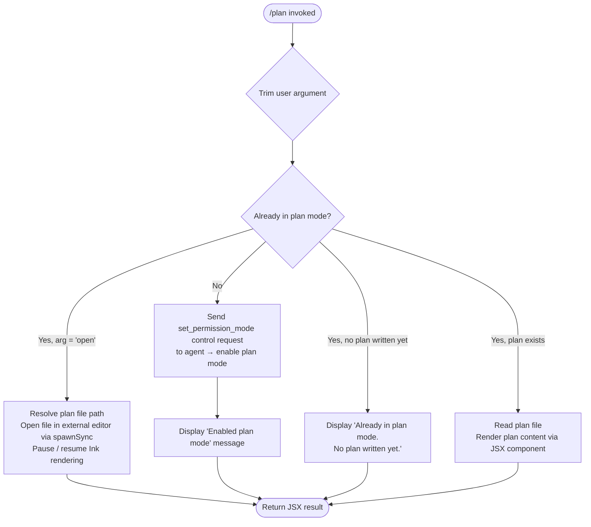

# `/plan`

> Analysis basis: CC v2.1.163 bundle.js (AST extraction + Claude interpretation)
> Minimum version: v2.1.163

---

## Overview

The `/plan` command enables **plan mode** in the current Claude Code session, or displays the existing session plan if one has already been written. When invoked with the `open` argument, it opens the plan file in an external editor. It operates by sending a `set_permission_mode` control request to the agent and managing a plan file on disk, rendering the result via a JSX component.

---

## Registration

| Field | Value |
|---|---|
| type | `local-jsx` |
| name | `plan` |
| description | `Enable plan mode or view the current session plan` |
| argumentHint | `[open\|<description>]` |
| module_id | `U6K` |
| load_inline | `true` |
| loc_byte | `12413546` |
| loc_byte_end | `12413745` |
| loc_line | `8829` |
| arbor_handler.name | `cyf` |
| arbor_handler.fqn | `claude-2.1.163::cyf` |
| arbor_handler.kind | `AsyncFunction` |
| arbor_handler.resolution_path | `module_id` |
| arbor_handler.n_hits | `0` |

Analysis basis: CC v2.1.163 bundle.js:+12413546

---

## Input Branching

The handler (`cyf`) exhibits four or more distinct branches depending on the current mode state and the argument supplied by the user. A Mermaid flowchart is used below.



Analysis basis: CC v2.1.163 bundle.js:+12412347 – +12413313

---

## Behavioral Spec

### 1. Entry Point — Main Handler

The Arbor-resolved handler is `cyf` (AsyncFunction, resolved via `module_id` → `U6K`).

```
async function planCommandHandler(userArgs, appState, context):
    rawArg = trimArgument(userArgs)          // A.trim at +12412916

    isInPlanMode = checkCurrentPermissionMode(appState)
    fileSystemUtils  = getFileSystemUtils(appState)   // q at +12412347
    sessionConfig    = getSessionConfig(appState)      // s4 at +12412380
    inkInstance      = getInkInstance(appState)        // iX at +12412391
    eventEmitter     = getEventEmitter(appState)       // ee at +12412411
    connectionPool   = getConnectionPool(appState)     // K at +12412424

    if not isInPlanMode:
        branch_enablePlanMode(appState, context)
    else if rawArg == "open":                          // "open" literal at +12412935
        branch_openPlanInEditor(appState, inkInstance)
    else if planFileIsEmpty(appState):
        branch_noPlanYet()
    else:
        branch_displayPlan(appState)

    return renderJSX(planResultComponent)              // KV.createElement at +12413313
```

Analysis basis: CC v2.1.163 bundle.js:+12412347

---

### 2. Enable Plan Mode

When the session is not currently in plan mode, the handler sends a `set_permission_mode` control request.

```
function enablePlanMode(appState, context):
    sendControlRequest(                                // M.sendControlRequest at +12412547
        type = "set_permission_mode",                 // literal at +12412577
        payload = buildPermissionModePayload(context)
    )
    displayMessage("Enabled plan mode")               // literal at +12412686
    updatePermissionRules(context)                    // J$ at +12412460
    applyPolicyAndSettingsLayers(context)             // _RH at +12412463
```

The control request dispatches a `set_permission_mode` signal to the agent runtime.

Analysis basis: CC v2.1.163 bundle.js:+12412547, +12412577, +12412686

---

### 3. Already-in-Plan-Mode Guard

If the session is already in plan mode, the handler checks whether a plan file exists before deciding which sub-branch to take.

```
function alreadyInPlanModeGuard(rawArg, planFilePath, inkInstance):
    if rawArg == "open":                              // literal at +12412935
        openPlanInEditor(planFilePath, inkInstance)
        return OPEN_RESULT

    planContent = readPlanFile(planFilePath)          // nZ at +12413052
    if planContent is empty or file missing:
        displayMessage("Already in plan mode. No plan written yet.")
                                                      // literal at +12413094
        return NO_PLAN_RESULT

    return renderPlanContent(planContent)             // iZ at +12413045
```

Analysis basis: CC v2.1.163 bundle.js:+12412935, +12413045, +12413052, +12413094

---

### 4. Open Plan in External Editor

When `rawArg == "open"`, the handler launches an external editor process while temporarily pausing the Ink terminal UI.

```
function openPlanInEditor(planFilePath, inkInstance):
    editorCommand = resolveEditor()                  // Gg at +12413195
    inkInstance.enterAlternateScreen()               // A.enterAlternateScreen at +11528277
    inkInstance.pause()                              // A.pause at +11528307
    inkInstance.suspendStdin()                       // A.suspendStdin at +11528317

    args = buildEditorArgs(editorCommand, planFilePath)
                                                     // L.split at +11528356, f.slice at +11528381
    result = spawnSync(                              // Pgq.spawnSync at +11528399
        command = editorCommand,
        args    = args,
        options = { stdio: "inherit" }               // literal at +11528431
    )

    inkInstance.exitAlternateScreen()                // A.exitAlternateScreen at +11528779
    inkInstance.resumeStdin()                        // A.resumeStdin at +11528808
    inkInstance.resume()                             // A.resume at +11528824

    editorName = resolveEditorName(result)           // sW at +12413288
    return editorName
```

The editor resolution (`Gg`) also reads the plan file back after editing (`_.readFileSync` at +11528701) to capture any changes.

Analysis basis: CC v2.1.163 bundle.js:+12413195, +11528277, +11528399, +11528779

---

### 5. Plan File Reading and Display

The plan file content is loaded and rendered when the plan exists.

```
function readAndDisplayPlan(appState):
    planFilePath = resolvePlanFilePath(appState)     // nZ → c2H at +12413052
    content = readFileSync(planFilePath, "utf-8")    // encoding literal at +13231076
    if fileNotFound(content):                        // ENOENT at +175606
        return null
    strippedContent = stripANSI(content)             // b4 → Bun.stripANSI at +3840296
    return renderContentComponent(strippedContent)   // U6q at +12413309
```

Analysis basis: CC v2.1.163 bundle.js:+12413045, +13231076, +175606

---

### 6. Plan File Path Resolution

```
function resolvePlanFilePath(appState):
    baseDir = getSessionDirectory(appState)          // r2A at +205248
    filePath = joinPath(baseDir, planFileName)       // KHH.join at +205262
    return filePath
```

File operations may include atomic rename/unlink sequences for safe writes:

```
function safePlanFileWrite(filePath, content):
    tempPath = filePath + ".txt"                     // ".txt" literal at +205021
    appendFile(tempPath, content)                    // Zy.appendFile at +205376
    if byteLength(content) > threshold:              // Buffer.byteLength at +205771
        rename(tempPath, filePath)                   // Zy.rename at +205073
    else:
        unlink(tempPath)                             // Zy.unlink at +205113
```

Analysis basis: CC v2.1.163 bundle.js:+205248, +205021, +205073, +205376

---

### 7. Permission Mode & Rules Management

The permission/rules subsystem (`J$`) is invoked when enabling plan mode, handling `allow`, `deny`, and `alwaysAsk` rule sets.

```
function updatePermissionRules(context):
    for each ruleOperation in ["addRules", "replaceRules", "removeRules",
                                "addDirectories", "removeDirectories"]:
        processRuleSet(context, ruleOperation)

    // Rule categories handled:
    //   "allow"           → alwaysAllowRules   (literals at +4752232, +4752240)
    //   "deny"            → alwaysDenyRules    (literals at +4752272, +4752279)
    //   "alwaysAsk"       → alwaysAskRules     (literal at +4752297)

    if mode == "bypassPermissions":                  // literal at +4751705
        logWarning("Ignoring permission update: setMode 'bypassPermissions'" +
                   " rejected — mode is not available ...")
                                                     // literal at +4751771
```

Analysis basis: CC v2.1.163 bundle.js:+4751705, +4752047, +4752232

---

### 8. Policy Settings Layering

The policy-and-settings layer (`_RH` → `_p`) applies multiple configuration sources in priority order.

```
function applyPolicyAndSettingsLayers(context):
    layers = [
        "policySettings",   // literal at +1281036
        "flagSettings",     // literal at +1281086
        "userSettings",     // literal at +1281134
        "localSettings",    // literal at +1281182
    ]
    for layer in layers:
        mergeSettingsLayer(context, layer)

    // "auto" model-selection mode is also evaluated here
    //   literal "auto" at +10680416
    // CLI arg "--allowed-tools" is recognized at +10669080
    // Source "cliArg" tagged at +10669031, "session" at +10670321
```

Analysis basis: CC v2.1.163 bundle.js:+1281036, +10680416, +10669080

---

### 9. Model Compatibility Check

The handler (`zcH`, called via `_RH` → `THA` → `WT`) checks whether the active model supports plan mode.

```
function checkModelCompatibility(modelId):
    unsupportedPrefixes = ["claude-3-"]              // literal at +2987561
    supportedModels = [
        "claude-opus-4-0",   // +2987579
        "claude-opus-4-1",   // +2987602
        "claude-opus-4-5",   // +2987625
        "claude-sonnet-4-0", // +2987648
        "claude-sonnet-4-5", // +2987673
        "claude-haiku-4-5",  // +2987698
        "claude-opus-4-6",   // +2987772
    ]
    providerTypes = ["firstParty", "anthropicAws"]   // +2987733, +2987751
    if modelId.startsWith("claude-3-"):
        return INCOMPATIBLE
    return COMPATIBLE
```

Analysis basis: CC v2.1.163 bundle.js:+2987561, +2987579

---

### 10. JSX Rendering

The final result is rendered as a React/Ink JSX component tree.

```
function renderPlanResult(content, editorName, messageText):
    element = createElement(PlanResultComponent, {   // KV.createElement at +12413313
        content:    content,
        editor:     editorName,                      // sW at +12413288
        message:    messageText,
    })
    // Inner streaming display uses yeH (stream-output component)
    //   which attaches a "data" event listener (+7940730)
    //   and strips ANSI codes via Bun.stripANSI (+3840296)
    return element
```

Analysis basis: CC v2.1.163 bundle.js:+12413313, +7940725, +3840296

---

## State & Side Effects

| Item | Detail |
|---|---|
| Telemetry | `tengu_feature_sad` (bundle.js:+1010365); `tengu_native_cursor` (bundle.js:+3812705) |
| Control request | `set_permission_mode` sent to agent via `M.sendControlRequest` (+12412547) |
| File I/O | Plan file created/read under session directory; atomic rename pattern used (+205073, +205376) |
| File deletion | `Zy.unlink` on temp file when write is below threshold (+205113); `xuK.unlinkSync` via `q` (+16110347) |
| Permission rules | `alwaysAllowRules`, `alwaysDenyRules`, `alwaysAskRules` updated in session state (+4752232–+4752297) |
| Ink UI pause | Terminal rendering paused and stdin suspended during external editor session (+11528307, +11528317) |
| Ink UI resume | Alternate screen exited and rendering resumed after editor exits (+11528779, +11528824) |
| Hook registration | `j9` → `MXA.register` called at +60323 (likely a cleanup/teardown hook) |
| Log sink | Transcript log written via `ncK` → `Zy.appendFile` at +205376; managed by `icK` |
| Error logging | `Er.logError` called at +1015986 on internal failures |
| `bypassPermissions` guard | Mode change rejected silently if `disableBypassPermissionsMode` is set (+4751771) |

---

## Version History

| Version | Change |
|---|---|
| v2.1.163 | Initial analysis |

---

## Common Mistakes

1. **Invoking `/plan` when already in plan mode without any argument** — if no plan has been written yet, the command returns the message "Already in plan mode. No plan written yet." rather than activating anything new.
2. **Expecting `/plan open` to work when not yet in plan mode** — the `open` branch is only reachable once plan mode is active; invoking it cold will first enable plan mode instead.
3. **Using `/plan` with a `claude-3-*` model** — the model compatibility check (`zcH`) will flag these as unsupported; plan mode requires claude-opus-4-x, claude-sonnet-4-x, or claude-haiku-4-5 series models.
4. **Assuming the plan file is written immediately** — the file is created and flushed via an atomic append-then-rename sequence; the plan content may not be visible until the first flush cycle completes.
5. **Trying to set `bypassPermissions` mode via `/plan`** — if `disableBypassPermissionsMode` is configured or the session was not launched in bypass mode, the permission update is silently ignored with a warning log.

---

## Appendix — Identifier Mapping

> For bundle debugging only. Identifiers change across versions.

| Identifier | Role |
|---|---|
| `cyf` | Main plan command handler (AsyncFunction, Arbor-resolved) |
| `q` | File system unlink utility / plan file removal |
| `s4` | Session configuration accessor |
| `MEH` | Session config internal helper |
| `iX` | Ink instance accessor |
| `ee` | Event emitter accessor |
| `K` | Connection pool / active connections accessor |
| `L` | Connection set manager (add/delete/finally) |
| `f` | Individual connection or file handle |
| `A` | Secondary connection or path helper |
| `J$` | Permission rules manager (allow/deny/alwaysAsk) |
| `v` | HTTP bootstrap fetch utility |
| `ccK` | Fetch request builder |
| `OXA` | HTTP header construction helper |
| `H` | Generic string / fetch response handler |
| `e$` | Fetch response accessor |
| `Pw_` | URL/string parser (split, trim, indexOf, slice) |
| `ZHH` | Permission set membership checker |
| `uj` | String replace utility |
| `t1` | Settings diff/merge utility |
| `s6` | Feature telemetry emitter (`tengu_feature_sad`) |
| `SH` | JSON serializer |
| `_` | Generic array/string utility (various methods) |
| `J4` | Path formatting / display name builder |
| `g2A` | Path segment mapper |
| `ppH` | Write-to-handle helper |
| `h2A` | Low-level file write helper |
| `icK` | Transcript log manager |
| `$pH` | Debounced log flush scheduler (setTimeout/setImmediate) |
| `d3H` | Log entry formatter |
| `Q6` | File path join helper |
| `aL6` | Log rotation / archive helper |
| `r2A` | Plan file path resolver (joins session dir + filename) |
| `i2A` | Atomic file rename/unlink helper |
| `ncK` | Log append-to-file writer (mkdir + appendFile) |
| `j9` | Cleanup/teardown hook registrar |
| `pM` | Markdown/text escape helper (replaceAll) |
| `MT4` | String escape processor |
| `_RH` | Policy + settings layer orchestrator |
| `THA` | Settings merge top-level entry |
| `Ld` | Settings layer loader |
| `WT` | Per-layer settings applicator |
| `XHA` | Settings schema validator |
| `zcH` | Model compatibility checker |
| `r6_` | Settings priority resolver |
| `x8` | Settings priority layer indexer |
| `WR` | Session rules writer |
| `DMH` | Object-entries rule iterator |
| `_p` | Settings entries processor (cliArg, session sources) |
| `y3` | Settings entry parser (substring, replaceAll) |
| `OT4` | Settings key normalizer |
| `PE` | `Object.hasOwn` wrapper |
| `zT4` | Settings value type checker |
| `$T4` | Settings value escape helper |
| `wHA` | Tool allowlist builder |
| `YbH` | Tool allowlist cache manager |
| `DHA` | Relative path resolver for tool allowlist |
| `qRq` | Session-level rule applicator |
| `CMf` | Rule inclusion checker |
| `M` | Active sessions / connection registry |
| `EH` | String coercion wrapper |
| `O96` | Plan file existence checker |
| `I3H` | File stats helper |
| `h6` | Path join shorthand |
| `uv` | Path utility base |
| `iZ` | Plan file read-and-display orchestrator |
| `nZ` | Plan file content reader |
| `c2H` | Plan file path cache manager |
| `PX_` | Path separator normalizer |
| `ocH` | Platform path helper (Aj6-based) |
| `Q98` | Alternative platform path helper (Aj6-based) |
| `R8` | ENOENT error filter |
| `v8` | Error code extractor |
| `kH` | Error reporter and logger |
| `HA` | Error constructor wrapper |
| `eH` | String coercion for errors |
| `Dq` | Error dispatch router |
| `RSA` | Error string builder |
| `HW4` | Error history ring buffer (shift/push) |
| `Gg` | External editor launcher (spawnSync + Ink pause/resume) |
| `Lp` | Editor resolution helper |
| `FY` | Editor binary finder |
| `BPf` | Editor command builder |
| `OAA` | Editor basename/extension detector |
| `Q1` | String index/slice helper |
| `sW` | Editor name resolver (toLowerCase, basename) |
| `U6q` | Streaming plan content renderer |
| `yeH` | Stream event attacher ("data" listener) |
| `XB` | Ink element factory wrapper |
| `$G_` | React createElement shim |
| `Ka` | Native cursor component (`tengu_native_cursor` telemetry) |
| `b4` | ANSI strip wrapper (Bun.stripANSI) |

---

Note: index built via Arbor fallback; some signals (telemetry, literals) may be missing — see arbor-fallback.js.