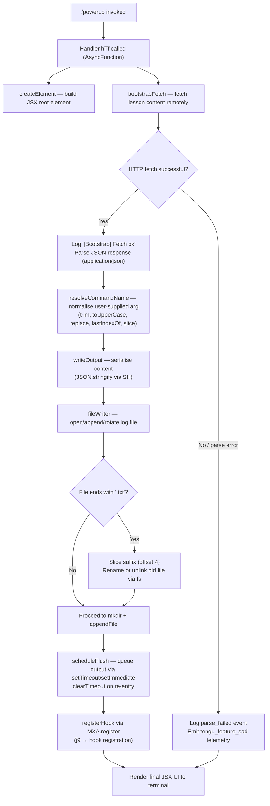

# `/powerup`

> Analysis basis: CC v2.1.163 bundle.js (AST extraction + Claude interpretation)
> Minimum version: v2.1.163

---

## Overview

The `/powerup` command delivers quick interactive lessons that help users discover and learn Claude Code features. It renders a JSX-based UI component and bootstraps feature content by fetching lesson data from a remote endpoint, then presents it to the user in an interactive format. The command is classified as a `local-jsx` type, meaning its primary output is a rendered React/JSX element rather than a plain text response.

---

## Registration

| Field | Value |
|---|---|
| type | `local-jsx` |
| name | `powerup` |
| description | `Discover Claude Code features through quick interactive lessons` |
| module_id | `ciq` |
| load_inline | `true` |
| loc_byte | `11986865` |
| loc_byte_end | `11987045` |
| loc_line | `8301` |
| arbor_handler.name | `hTf` |
| arbor_handler.fqn | `claude-2.1.163::hTf` |
| arbor_handler.kind | `AsyncFunction` |
| arbor_handler.resolution_path | `module_id` |
| arbor_handler.n_hits | `0` |

Analysis basis: CC v2.1.163 bundle.js:+11986865

---

## Input Branching

The command flow involves three or more distinct paths: initial JSX element creation, a bootstrap data-fetch phase with success/failure branches, and a content-write/file-management phase. A Mermaid flowchart is used accordingly.



Analysis basis: CC v2.1.163 bundle.js:+11986739 (createElement), +11986774 (bootstrap call), +15724218 ("[Bootstrap] Fetching"), +15724592 ("[Bootstrap] Fetch ok"), +15724562 (parse_failed)

---

## Behavioral Spec

### 1. Handler Entry Point

The async handler `hTf` (resolved via `module_id` → `ciq`) is the command's main entry point. It creates the root JSX element and then invokes the bootstrap fetch function.

```
async function powerupHandler(context):
    rootElement = createElement(PowerupComponent, context)
    bootstrapData = await bootstrapFetch(context)
    return rootElement
```

Analysis basis: CC v2.1.163 bundle.js:+11986739, +11986774

---

### 2. Bootstrap Fetch

The bootstrap function fetches lesson content from a remote API. It logs `"[Bootstrap] Fetching"` before the request and `"[Bootstrap] Fetch ok"` on success. It sets `Content-Type: application/json` and a `User-Agent` header. A 5000 ms timeout is applied.

```
async function bootstrapFetch(config):
    log("[Bootstrap] Fetching")
    response = await fetch(endpoint, {
        headers: {
            "Content-Type": "application/json",
            "User-Agent": claudeCodeUserAgent
        },
        timeout: 5000
    })
    if response.ok:
        data = await response.json()
        log("[Bootstrap] Fetch ok")
        return data
    else:
        emitTelemetry("api_bootstrap_fetch", { status: "parse_failed" })
        return null
```

Timeout constant: 5000 ms (bundle.js:+15724419)
Analysis basis: CC v2.1.163 bundle.js:+15724218, +15724303, +15724318, +15724337, +15724540, +15724562, +15724592

---

### 3. Command Name Resolution

After the fetch, the user-supplied argument (if any) is normalised into a canonical feature key. The normalisation pipeline: split on delimiters → trim whitespace → convert to uppercase → replace special characters → find last index of separator → slice to extract the base name.

```
function resolveCommandName(rawInput):
    parts = rawInput.split(delimiter)
    trimmed = parts.map(p => p.trim())
    upper = trimmed.join("").toUpperCase()
    replaced = upper.replace(pattern, replacement)
    lastSep = replaced.lastIndexOf(separator)
    return replaced.slice(lastSep + 1)
```

A `[REDACTED]` sentinel value is used during path processing (bundle.js:+198141), and a split-depth limit of `2` is applied (bundle.js:+198170).

Analysis basis: CC v2.1.163 bundle.js:+206177, +206197, +206200, +198089, +198225, +198251

---

### 4. Output Serialisation

Resolved lesson content is serialised to a string via `JSON.stringify` before being handed to the file writer.

```
function serialiseOutput(data):
    return JSON.stringify(data)
```

Analysis basis: CC v2.1.163 bundle.js:+185153

---

### 5. File Writer and Log Rotation

The file writer manages an append-only output log. It creates the target directory if absent, appends content, and rotates the active file when it detects a `.txt` suffix. A rotation involves renaming or unlinking the old file before creating a new one.

```
async function fileWriter(content, filePath):
    dir = path.dirname(filePath)
    await fs.mkdir(dir, { recursive: true })
    await fs.appendFile(filePath, content)
    await rotateLegacyFile(filePath)

async function rotateLegacyFile(filePath):
    stat = await fs.stat(filePath)
    if filePath.endsWith(".txt"):
        base = filePath.slice(0, filePath.length - 4)
        try:
            await fs.rename(filePath, base)
        catch:
            await fs.unlink(filePath)
```

File extension constant: `".txt"` (bundle.js:+205021)
Slice offset constant: `4` (bundle.js:+205043)
Analysis basis: CC v2.1.163 bundle.js:+205317, +205376, +204917, +205010, +205032, +205073, +205113

---

### 6. Output Flush Scheduler

Pending output chunks are queued and flushed asynchronously. The scheduler clears any pending timeout before setting a new one, uses `setImmediate` for zero-latency flushes, and joins queued segments before writing.

```
function scheduleFlush(chunk, state):
    clearTimeout(state.pendingTimer)
    state.outputQueue.push(chunk)
    state.pendingTimer = setTimeout(function():
        payload = state.outputQueue.join("")
        state.outputQueue = []
        writeToStream(payload)
        setImmediate(function():
            remainder = state.laterQueue.join("")
            if remainder:
                writeToStream(remainder)
        )
    , FLUSH_DELAY)
```

Flush delay constants: 1000 ms, 100 ms (bundle.js:+59625, +59646)
Analysis basis: CC v2.1.163 bundle.js:+59737, +59778, +59811, +59855, +59901, +59936, +59994, +60034, +60085

---

### 7. Model Resolution

The bootstrap path resolves the appropriate Claude model tier to use for lesson generation. The resolution checks a set of named tiers in order: `opusplan`, `[1m]`, `sonnet`, `haiku`, `opus`, `best`. Provider backends checked include `firstParty`, `anthropicAws`, `gateway`, and `mantle`.

```
function resolveModel(config):
    modelAlias = config.modelAlias.trim().toLowerCase()
    if modelAlias contains known tier:
        return mapTierToModel(modelAlias)
    fallback to "best"
```

Named tiers (bundle.js:+2243249, +2243275, +2243290, +2243329, +2243368, +2243405)
Analysis basis: CC v2.1.163 bundle.js:+2243153, +2243164, +2243182

---

### 8. Hook Registration

After the lesson content is prepared, a lifecycle hook is registered via the hook registry (`MXA.register`). This enables the powerup UI to receive subsequent updates or respond to user interactions during the lesson session.

```
function registerPowerupHook(handler):
    hookRegistry.register(handler)
```

Analysis basis: CC v2.1.163 bundle.js:+60323

---

### 9. API Logging / Debug Mode

A `"debug"` mode flag is present in the implementation. When active, additional diagnostic output is emitted. A `"system"` role literal is also present, indicating that certain bootstrap messages may be injected as system-role context.

Analysis basis: CC v2.1.163 bundle.js:+206051 ("debug"), +11986787 ("system")

---

### 10. Path Normalisation Utility

A utility is used to normalise file-system paths used during the write phase. It joins segments, resolves the directory component, and checks for the `EISDIR` error code when a path unexpectedly refers to a directory.

```
function normalisePath(segments):
    joined = path.join(...segments)
    resolved = resolveDir(joined)
    if isDir(resolved):
        throw Error("EISDIR")
    return resolved
```

Error code constant: `"EISDIR"` (bundle.js:+175646)
Maximum filename length check: `40` characters (bundle.js:+16160063)
Analysis basis: CC v2.1.163 bundle.js:+205596, +175638

---

## State & Side Effects

| Item | Detail |
|---|---|
| Telemetry | `tengu_feature_sad` (emitted on fetch/parse failure; bundle.js:+1010365) |
| Telemetry (bootstrap) | `api_bootstrap_fetch` with property `parse_failed` (bundle.js:+15724540, +15724562) |
| Hook registration | Lifecycle hook registered via `MXA.register` (bundle.js:+60323) |
| File system | Creates directories with `fs.mkdir`; appends content with `fs.appendFile`; rotates `.txt` files via `fs.rename` / `fs.unlink` |
| Timer state | `clearTimeout` / `setTimeout` / `setImmediate` used for output flush scheduling |
| appState changes | `_A.get` called during bootstrap (bundle.js:+15724254); lesson state stored and retrieved from app state map |
| Network | Outbound HTTP fetch with `Content-Type: application/json` and `User-Agent` headers; 5000 ms timeout |
| Buffer | `Buffer.byteLength` called during file-write sizing (bundle.js:+205771) |
| Sound | <!-- TODO: not found in depth-2 traversal; needs --depth 4 --> |

---

## Version History

| Version | Change |
|---|---|
| v2.1.163 | Initial analysis |

---

## Common Mistakes

1. **Invoking `/powerup` without network access**: The command performs a remote bootstrap fetch on startup. If the network is unavailable, the fetch will time out after 5000 ms and the `tengu_feature_sad` telemetry event will fire; no lesson content will be displayed.
2. **Expecting plain-text output**: `/powerup` is a `local-jsx` command — its output is a rendered JSX component, not a streamed text reply. Scripts that scrape CLI stdout for plain text will not capture the lesson UI.
3. **Stale `.txt` log files**: The file writer silently renames or deletes any `.txt`-suffixed file it encounters in the output path. Do not store data you want to keep in a `.txt` file in the same directory used by this command.
4. **Model alias mismatches**: The model resolution step expects one of the known alias strings (`opusplan`, `[1m]`, `sonnet`, `haiku`, `opus`, `best`). An unrecognised alias will fall through to the `"best"` default rather than raising an error, which may not be the intended tier.
5. **Re-entrant flush calls**: The flush scheduler cancels any in-flight timeout on each new chunk. Rapid successive invocations (e.g., scripted input) will keep resetting the timer, delaying output until the stream of chunks pauses.

---

## Appendix — Identifier Mapping

> For bundle debugging only. Identifiers change across versions.

| Identifier | Role |
|---|---|
| `hTf` | Main async handler for `/powerup` (arbor_handler; AsyncFunction) |
| `H` | Bootstrap fetch orchestrator |
| `v` | Command argument processing / normalisation pipeline |
| `ccK` | Sub-processor within argument normalisation (calls `Vy`, `dcK`, `OXA`) |
| `OXA` | Lower-level normalisation helper (calls `lgK`, `ngK`) |
| `SH` | Output serialiser (`JSON.stringify` wrapper) |
| `_` | Raw input string being processed (used for `toUpperCase`, `replace`, `split`) |
| `J4` | Command name resolver (split, replace, lastIndexOf, slice) |
| `g2A` | Segment mapper (`BcK.map`) |
| `q` | File path / secondary string operand |
| `A` | Filename string (`toLowerCase`, `slice`) |
| `ppH` | Write dispatcher (delegates to `h2A`) |
| `h2A` | Stream write helper (`H.write`) |
| `icK` | File writer coordinator (mkdir, appendFile, rename, unlink, Buffer.byteLength) |
| `$pH` | Output flush scheduler (clearTimeout, setTimeout, setImmediate, queue management) |
| `d3H` | Path construction helper (join, `a8`, `h6`) |
| `Q6` | Configuration accessor used within file writer |
| `aL6` | EISDIR / directory-check helper (calls `v8`) |
| `r2A` | Path join + resolve helper |
| `i2A` | File rotation handler (stat, endsWith, rename, unlink) |
| `ncK` | Append-file pipeline (mkdir, appendFile, rotate, size-check) |
| `j9` | Hook registration wrapper (calls `MXA.register`) |
| `e$` | App-state extraction helper |
| `Pw_` | Argument parser (split, trim, indexOf, slice) |
| `ZHH` | Feature-flag / set membership check (`g44.has`) |
| `uj` | String sanitiser (`H.replace`) |
| `t1` | Lesson content builder (delegates to `D6H`, `Aq`, `eX`) |
| `D6H` | Content structure builder (`x0`, `IqH`, `SA`, `yd`) |
| `x0` | Content node factory |
| `IqH` | Content node type resolver |
| `yd` | Markdown/text line parser (trim, startsWith, includes, map) |
| `Aq` | Model alias resolver (trim, toLowerCase, replace, tier mapping) |
| `o0` | Tier lookup helper (`q4H`) |
| `_4H` | Known-model-list inclusion check (`H4H.includes`) |
| `wI` | Model tier handler for `opusplan`/`[1m]` (calls `gM`, `Z5`) |
| `NQH` | Model tier handler for `sonnet` / `haiku` (calls `Z5`) |
| `NE` | Model tier handler for `opus` (calls `gM`, `Z5`, `XA`) |
| `kX1` | Wrapper delegating to `NE` |
| `gM` | Provider-type resolver (`XA`; maps to `anthropicAws`, `gateway`) |
| `Pe6` | First-party inclusion check (`l1L.includes`) |
| `vQH` | Fallback model resolver (`eH`) |
| `eX` | Extended content assembler (calls `Aq`, `r0`) |
| `r0` | Full model-resolution pipeline (ZA, P6H, PYH, IQH, NE, z2, gM, XA, Z5, wI) |
| `s6` | Telemetry emitter for `tengu_feature_sad` (calls `c`, `P6`) |
| `c` | Telemetry event constructor |
| `P6` | Telemetry dispatch (calls `Nu6`) |
| `Nu6` | Low-level telemetry sink |

---

Note: index built via Arbor fallback; some signals (telemetry, literals) may be missing — see arbor-fallback.js.