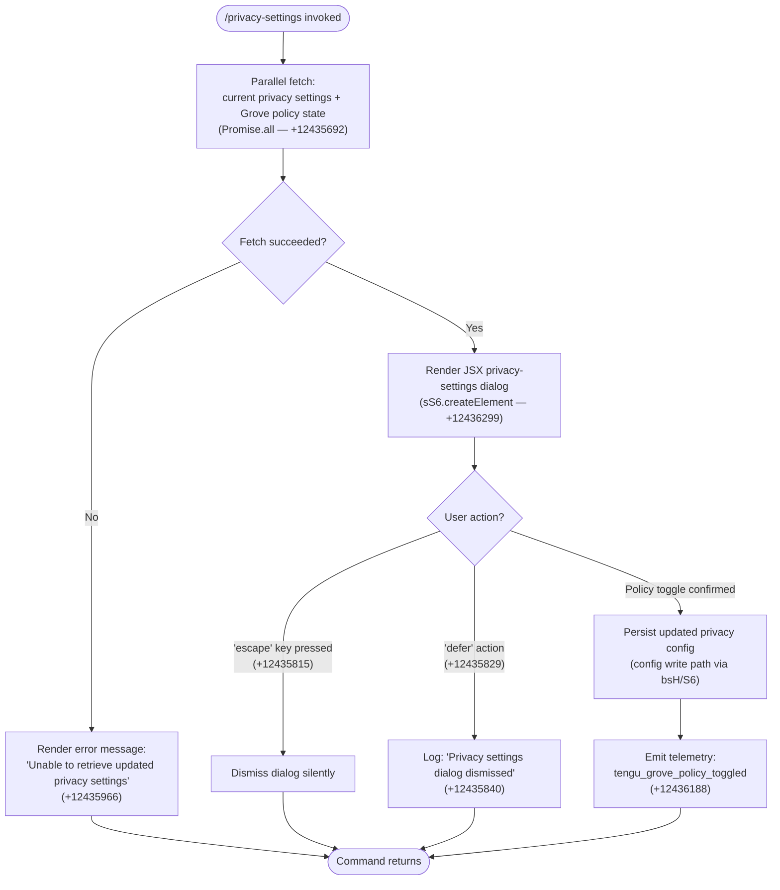

# `/privacy-settings`

> Analysis basis: CC v2.1.163 bundle.js (AST extraction + Claude interpretation)
> Minimum version: v2.1.163

---

## Overview

`/privacy-settings` is a local JSX command that opens an interactive dialog allowing the user to view and update their privacy configuration. When invoked, it fetches the current privacy/Grove policy state in parallel with other initialization data, renders a JSX dialog component, and persists any changes the user makes—emitting a telemetry event when a policy toggle occurs.

---

## Registration

| Field | Value |
|---|---|
| type | `local-jsx` |
| name | `privacy-settings` |
| description | `View and update your privacy settings` |
| module_id | `K8K` |
| load_inline | `true` |
| loc_byte | `12436652` |
| loc_byte_end | `12436844` |
| loc_line | `8839` |
| arbor_handler.name | `Lhf` |
| arbor_handler.fqn | `claude-2.1.163::Lhf` |
| arbor_handler.kind | `AsyncFunction` |
| arbor_handler.resolution_path | `module_id` |
| arbor_handler.n_hits | `0` |

Analysis basis: CC v2.1.163 bundle.js:+12436652

---

## Input Branching

The command has three or more distinct behavioral paths depending on dialog exit action and data-fetch result, so a flowchart is used.



---

## Behavioral Spec

### Handler Entry — `privacySettingsHandler` (`Lhf`)

The main handler is the async function `Lhf`, resolved via `module_id` → `K8K`.

```
async function privacySettingsHandler(context):
    // Parallel initialization: fetch config + Grove/MCP state
    [privacyData, groveState] = await Promise.all([
        fetchGroveConfig(context),          // Gs — +12435705
        fetchGlobalConfigHandle(context)    // gXH — +12435710
    ])

    if fetchFailed(privacyData):
        render("Unable to retrieve updated privacy settings")
        return

    // Build JSX element for the settings dialog
    dialogElement = sS6.createElement(
        PrivacySettingsComponent,           // +12436299
        { category: "settings" }            // literal "settings" at +12436252
    )

    // Present dialog and await user interaction
    result = await showDialog(dialogElement, context)  // W6 — +12436249

    handleDialogResult(result)
```

Analysis basis: CC v2.1.163 bundle.js:+12435652

---

### Dialog Result Handling

```
function handleDialogResult(result):
    if result.action == "escape":           // +12435815
        // silent dismiss, no logging
        return

    if result.action == "defer":            // +12435829
        log("Privacy settings dialog dismissed")   // +12435840
        return

    // Policy was toggled — persist and emit telemetry
    persistPrivacyConfig(result.newSettings)
    emitTelemetry("tengu_grove_policy_toggled")     // +12436188
```

Analysis basis: CC v2.1.163 bundle.js:+12435815, +12435829, +12436188

---

### Config Read Path — `configReader` (`bsH`)

`bsH` orchestrates reading the current configuration state, calling multiple sub-functions:

```
function configReader(options):
    rawConfig = readConfigFile(options)         // n4H — +6998720
    watchedConfig = watchConfigFile(options)    // hL  — +6998741
    persistConfig = saveConfigWithLock(options) // S6  — +6998780
    timestamp = Date.now()                      // +6998809
    return buildConfigResult(rawConfig, watchedConfig, persistConfig, timestamp)
```

Analysis basis: CC v2.1.163 bundle.js:+6998720

---

### Config File Access — `configFileAccessor` (`bDH`)

Handles low-level file I/O for the configuration store, including reading, backup creation, and safe writes. Key behaviors:

- Reads config as UTF-8 (`"utf-8"` — +3261934) via `q.readFileSync`
- Validates access guard: raises `"Config accessed before allowed."` (+3261851) if called prematurely
- Handles `ENOENT` (+3262081) to return a default config when the file does not exist
- Creates backup copies with prefix `".backup."` (+3260704), retaining at most 5 backups (+3260837)
- Backup rotation uses timestamps via `Date.now()`
- Directory is created via `q.mkdirSync` if absent; duplicate guard on `EEXIST` (+3262696)
- Emits `tengu_config_parse_error` (+3262482) on JSON parse failure

Analysis basis: CC v2.1.163 bundle.js:+3261851

---

### Locked Config Save — `saveConfigWithLock` (`SX_`)

Implements a file-lock-based safe write path with integrity protection:

```
function saveConfigWithLock(config, lockPath):
    ensureDirectory(dirname(lockPath))          // pD.dirname + L.mkdirSync
    acquireLock(lockPath, timeout=60000)        // +3260588
    if lockContentionDetected:
        log("Lock acquisition took longer than expected...")  // +3259818
        emitTelemetry("tengu_config_lock_contention")        // +3259907

    reReadConfig = readCurrentConfig()
    if reReadConfigMissingAuthThatCacheHas(reReadConfig, cache):
        log("saveConfigWithLock: re-read config is missing auth...")  // +3260234
        emitTelemetry("tengu_config_auth_loss_prevented")             // +3260386
        return  // refuse write to protect credentials

    writeConfig(config)
    rotateStaleMark()
    emitTelemetry("tengu_config_stale_write")   // when applicable, +3260043
    releaseLock()
```

Analysis basis: CC v2.1.163 bundle.js:+3259818, +3260234

---

### Config Read with Subscription Mode classification — `classifyConfigSource` (`X8`)

Classifies the origin of a configuration entry using status strings:

| Status literal | Meaning | loc_byte |
|---|---|---|
| `"unknown"` | Source not determined | +3257366 |
| `"local"` | Local project config | +3257441 |
| `"migrated"` | Migrated from old config | +3257428 |
| `"native"` | Native installation | +3257473 |
| `"installed"` | Installed via package | +3257459 |
| `"disabled"` | Feature disabled | +3257492 |
| `"enabled"` | Feature enabled | +3257518 |
| `"no_permissions"` | Insufficient permissions | +3257532 |
| `"not_configured"` | Setting not yet configured | +3257553 |
| `"global"` | Global config scope | +3257572 |

Analysis basis: CC v2.1.163 bundle.js:+3257366

---

### Subscription Tier Normalization — `normalizeTier` (`n4H`)

Recognizes two canonical subscription tier strings:

- `"max"` (+3020758)
- `"pro"` (+3020769)

Used when constructing the privacy settings display to show tier-relevant options.

Analysis basis: CC v2.1.163 bundle.js:+3020758

---

### Grove/MCP State Initialization — `groveStateInit` (`M`)

Calls `AbH` (MCP server aggregator) and `tU8` (apply-connection-result), then reads from the connection map (`L.get`, `L.values`) and triggers `VYA` (remote server retry logic). This provides the MCP server connection state that the privacy dialog may display.

Analysis basis: CC v2.1.163 bundle.js:+15805746

---

## State & Side Effects

| Item | Detail |
|---|---|
| Telemetry | `tengu_grove_policy_toggled` (+12436188) — fired on any policy toggle; `tengu_config_parse_error` (+3262482) — config JSON parse failure; `tengu_config_lock_contention` (+3259907) — lock wait exceeded; `tengu_config_stale_write` (+3260043) — stale write detected; `tengu_config_auth_loss_prevented` (+3260386) — refused write to protect auth; `tengu_feature_sad` (+1010365) — generic feature failure; `tengu_mcp_oauth_flow_start/success/error` — OAuth side-effects via MCP init |
| Hook registration | `j9` → `MXA.register` (+60323) — registers a cleanup/hook during config write path |
| appState changes | Privacy/Grove policy flags updated in global config on confirmed toggle; MCP connection state read-initialized via `VYA` / `AbH` |
| File I/O | Config file read via `q.readFileSync`; safe write via locked `SX_` path; up to 5 backup files maintained with `".backup."` prefix |
| Dialog literals | `"Privacy settings dialog dismissed"` (+12435840); `"Unable to retrieve updated privacy settings"` (+12435966) |
| Sound | <!-- TODO: not found in depth-2 traversal; needs --depth 4 --> |

---

## Version History

| Version | Change |
|---|---|
| v2.1.163 | Initial analysis |

---

## Common Mistakes

1. **Invoking while config lock is held by another instance**: A concurrent Claude Code process holding the config lock will trigger `tengu_config_lock_contention` and slow down or block the settings write. The warning `"Lock acquisition took longer than expected - another Claude instance may be running"` appears in this case.
2. **Expecting immediate persistence on "defer"**: When the user selects the defer action, the dialog is dismissed without saving. Only an explicit policy toggle triggers `tengu_grove_policy_toggled` and persists the change.
3. **Corrupted config file**: If the config JSON cannot be parsed, the command emits `tengu_config_parse_error` and may fall back to a default. Manual repair of the config file is required before settings take effect.
4. **Credential-loss guard refusal**: If a re-read of the config file appears to be missing authentication credentials that are present in cache, the write is silently refused (see GH #3117 guard at +3260234). This prevents wiping `~/.claude.json` but means changes are not saved.

---

## Appendix — Identifier Mapping

> For bundle debugging only. Identifiers change across versions.

| Identifier | Role |
|---|---|
| `Lhf` | Main handler for `/privacy-settings` (AsyncFunction, entry point) |
| `bsH` | Config reader orchestrator (reads + watches + saves config) |
| `n4H` | Tier/subscription normalization and raw config read |
| `_q` | Internal config state accessor |
| `uL_` | Config field getter (sub-accessor A) |
| `xL_` | Config field getter (sub-accessor B) |
| `zY` | Config initialization / environment resolver |
| `ZA` | Config array validator / include-check |
| `nR` | Array membership checker (uses `Array.isArray`, `H.includes`) |
| `ou1` | Auxiliary config reader output formatter |
| `hL` | Config file watcher setup |
| `S6` | Config persistence (save to disk) |
| `Q6` | Config path resolver |
| `vX_` | Config value serializer |
| `bDH` | Low-level config file I/O (read/write/backup) |
| `XTL` | File watch subscription manager (`watchFile`/`unwatchFile`) |
| `v` | HTTP fetch / bootstrap utility |
| `ccK` | User-agent / version string builder |
| `OXA` | Platform identifier helper |
| `H` | Bootstrap fetch wrapper (returns config from remote) |
| `e$` | Fetch error classifier |
| `Pw_` | URL parser / path extractor |
| `ZHH` | Blocked-host set checker |
| `uj` | Header sanitizer (replace sensitive values) |
| `t1` | Response body decoder |
| `s6` | Config store accessor (get/set) |
| `SH` | JSON serializer wrapper |
| `J4` | Path normalization utility |
| `g2A` | Path segment mapper |
| `q` | Filesystem namespace (sync ops: `readFileSync`, `statSync`, etc.) |
| `A` | Lowercase / case-fold helper |
| `ppH` | Output writer (stdout/stderr helper) |
| `h2A` | Stream write wrapper |
| `icK` | Async config append/write orchestrator |
| `$pH` | Debounced batch writer (uses `setTimeout`/`setImmediate`) |
| `d3H` | Config directory path builder |
| `aL6` | File existence/version checker |
| `r2A` | Config file path joiner |
| `i2A` | Atomic rename / unlink helper |
| `ncK` | Async mkdir + appendFile writer |
| `j9` | Cleanup hook registrar (`MXA.register`) |
| `KB9` | Grove cache manager (stale/fresh decision) |
| `X8` | Config source classifier (status enum labeler) |
| `SX_` | Locked config save (with backup rotation) |
| `_lH` | Config lock file path builder |
| `Lr1` | Config entries enumerator (`Object.entries`) |
| `t98` | Timestamp recorder for config ops |
| `fj6` | Config diff / change detector |
| `c` | Platform/OS context accessor |
| `hX_` | Config write helper with directory creation |
| `M` | MCP/Grove state manager (aggregates connection state) |
| `AbH` | MCP server aggregator (iterates servers, builds state) |
| `bl` | MCP server batch loader |
| `wG6` | MCP server group handler |
| `ws` | MCP server connection worker |
| `Cl` | MCP config entry collector |
| `xY8` | MCP server warning formatter (red/yellow output) |
| `DG6` | MCP server deduplication/registry |
| `fk` | MCP file-system connector |
| `oO` | MCP stdio connection manager |
| `Mb_` | MCP binary resolver |
| `K` | MCP server display formatter (pad/map) |
| `L` | Async task set manager (add/delete/finally) |
| `f` | Connection close handler |
| `__` | Underscore/internal utility wrapper |
| `sk6` | MCP server status summarizer |
| `rkq` | MCP reconnect orchestrator |
| `et_` | MCP error type classifier |
| `VXH` | MCP config hasher (SHA-256) |
| `CY8` | MCP capability set builder |
| `bY8` | MCP capability hasher |
| `GP` | JSON hash helper (SHA-256 over JSON.stringify) |
| `SY8` | MCP server status normalizer |
| `M4` | Status enum mapper |
| `O8` | MCP debug log emitter |
| `os_` | MCP OAuth / connection flow handler |
| `pKf` | OAuth parameter builder |
| `Ad` | Auth config accessor |
| `i1H` | OAuth IDE connector helper |
| `r1H` | OAuth retry handler |
| `o1H` | OAuth flow executor (full server + callback) |
| `r_6` | In-flight request tracker (Map get/set/delete) |
| `D` | Forced-shutdown handler (`process.exit`, `z.abort`) |
| `HI8` | MCP auth-cache checker |
| `Sn` | MCP reconnect supervisor |
| `kx` | Auth key store accessor |
| `Y` | Daemon supervisor (write/start/stop/updateConfig) |
| `T7` | MCP error log emitter |
| `EH` | Error-to-string converter |
| `UKf` | OAuth URL opener |
| `mKf` | SSH environment detector |
| `as_` | MCP complete-authentication handler |
| `i_6` | In-flight lock getter (`lv8.get`) |
| `o_6` | Pending request getter (`nv8.get`) |
| `Kyq` | MCP reconnect state machine |
| `N9` | AsyncLocalStorage store getter |
| `hI8` | Auth cache file path builder |
| `rs_` | MCP connection result applier |
| `Ab_` | MCP server inclusion checker |
| `j` | Process kill helper (SIGTERM) |
| `R` | Worker process manager |
| `FN` | MCP skills/tools loader |
| `D6` | MCP skill set builder |
| `I` | Chokidar file-watcher wrapper |
| `W6` | Dialog/modal presenter |
| `S` | Terminal output stream writer |
| `tkq` | Async iterator / mapper utility |
| `hB` | Promise-pool / concurrent mapper |
| `zA6` | Integer parser (radix 10) |
| `SI8` | Integer parser variant (radix 20) |
| `tU8` | Apply-connection-result handler |
| `_bH` | Config hash comparator |
| `mk` | MCP server cleanup coordinator |
| `$A6` | MCP server state hash updater |
| `$` | Daemon status reporter |
| `TKK` | Daemon status file writer (`daemon.status.json`) |
| `nr` | Status line formatter |
| `JR6` | Status file path builder |
| `VYA` | Remote MCP server retry/refresh orchestrator |
| `mY8` | MCP server needs-auth cache checker |
| `l8` | Async timeout/abort wrapper |
| `O` | Background session marker |

---

Note: index built via Arbor fallback; some signals (telemetry, literals) may be missing — see arbor-fallback.js.