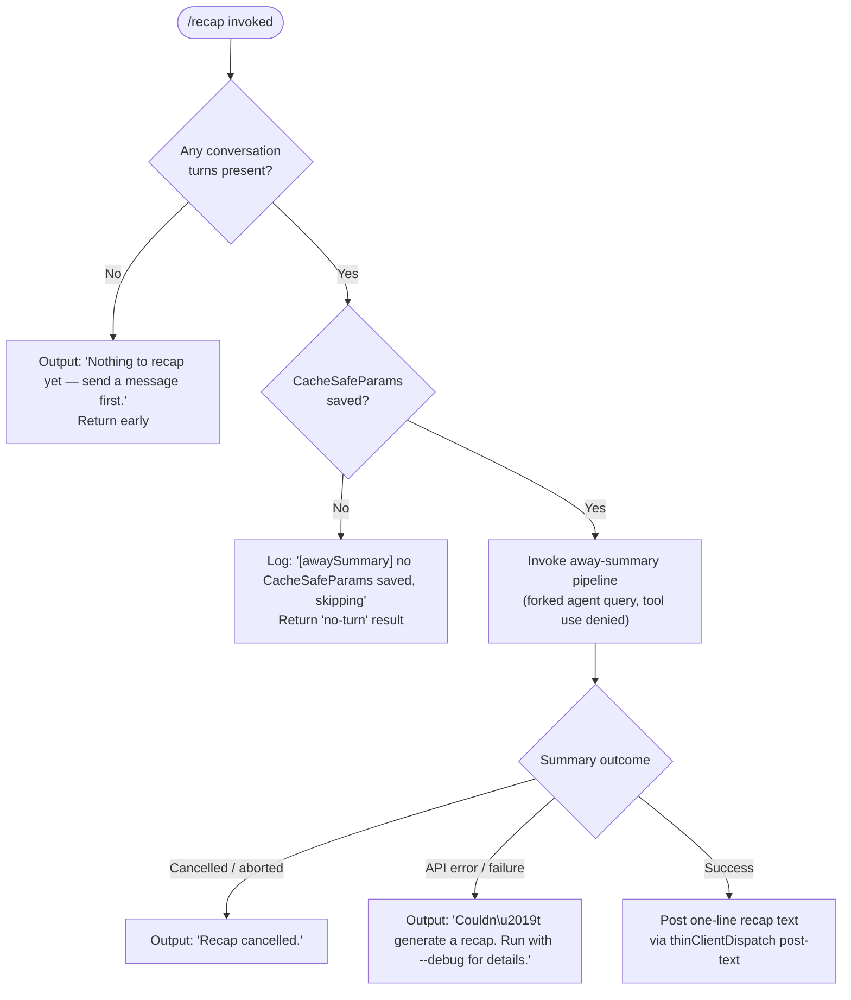

# `/recap`

> Analysis basis: CC v2.1.163 bundle.js (AST extraction + Claude interpretation)
> Minimum version: v2.1.163

---

## Overview

`/recap` generates a single-line summary of the current Claude Code session on demand. It invokes an "away summary" pipeline (the same mechanism used for background session summaries) and, upon completion, posts the resulting text back to the user's terminal. If no conversation turns have occurred yet, or if the summary attempt is cancelled or fails, the command reports a short diagnostic message instead.

---

## Registration

| Field | Value |
|---|---|
| type | `local` |
| name | `recap` |
| description | `Generate a one-line session recap now` |
| loc_byte | `12972139` |
| loc_byte_end | `12972355` |
| loc_line | `9613` |
| supportsNonInteractive | `false` |
| thinClientDispatch | `post-text` |
| load_inline | `true` |
| load_ident | `mpf` |
| arbor_handler.name | `mpf` |
| arbor_handler.fqn | `claude-2.1.163::mpf` |
| arbor_handler.kind | `AsyncFunction` |
| arbor_handler.resolution_path | `load_ident` |
| arbor_handler.n_hits | `0` |

Analysis basis: CC v2.1.163 bundle.js:+12972139

---

## Input Branching

The command exhibits four distinct outcome branches based on session state and the result of the away-summary call, requiring a flowchart representation.



Analysis basis: CC v2.1.163 bundle.js:+12971889, +12971981, +12972039, +5479781, +5479839

---

## Behavioral Spec

### 1. Handler Entry — `recapCommandHandler` (`mpf`)

The handler is an `AsyncFunction` resolved via the `load_ident` path (inline `Promise.resolve({call: mpf})`). It is the sole entry point for `/recap`.

```
async function recapCommandHandler(context):
    turns = getConversationTurns(context)

    if turns is empty or null:
        postText("Nothing to recap yet — send a message first.")
        return

    result = await invokeAwaySummary(context)

    match result.status:
        case "no-turn":
            // silently skip — no turns found at summary time
            return
        case "aborted" | "cancelled":
            postText("Recap cancelled.")
            return
        case "api-error" | "failed":
            postText("Couldn't generate a recap. Run with --debug for details.")
            return
        case "ok":
            postText(result.summaryText)
```

Analysis basis: CC v2.1.163 bundle.js:+12971747, +12971889, +12971981, +12972039

---

### 2. Away-Summary Invocation — `awaySummaryOrchestrator` (`cO8`)

This is the shared away-summary pipeline, also used by background session summarisation. When called by `/recap`, it operates synchronously from the user's perspective (the user waits for the result in the foreground).

```
async function awaySummaryOrchestrator(context, signal):
    params = getCacheSafeParams(context)

    if params is null:
        log("[awaySummary] no CacheSafeParams saved, skipping")
        return { status: "no-turn" }

    abortController = new AbortController()
    signal.addEventListener("abort", () => abortController.abort())

    try:
        summaryResult = await runForkedAgentQuery(params, abortController.signal)
        return processAwaySummaryResult(summaryResult)
    catch AbortError:
        return { status: "aborted" }
    catch ApiError:
        return { status: "api-error" }
```

Analysis basis: CC v2.1.163 bundle.js:+5479760, +5479779, +5479781, +5479839, +5479876, +5479895, +5479907, +5479954

---

### 3. Forked Agent Query — `forkedAgentQueryRunner` (`jG`)

The away-summary content is generated by a forked agent call — a lightweight sub-agent invocation. Tool use is denied for this sub-agent (literal `"Away summary cannot use tools"` at +5480087), ensuring the recap is produced solely from the conversation context already in memory.

```
async function forkedAgentQueryRunner(params, signal):
    startTime = Date.now()
    sessionId  = generateRandomId()          // crypto random hex (8 bytes)

    // Build message list from current turn history
    messages = buildMessageList(params)

    // Deny all tool use for this forked call
    toolPolicy = { mode: "deny", reason: "Away summary cannot use tools" }

    response = await callModelStreaming(messages, toolPolicy, signal)

    if response.status == "ok":
        summaryText = extractTextFromResponse(response)
        return { status: "ok", summaryText }
    else if response.status == "aborted":
        return { status: "aborted" }
    else:
        return { status: "api-error" }
```

Analysis basis: CC v2.1.163 bundle.js:+10913259, +10913382, +10913571, +5480072, +5480087, +5480155, +5480299, +5480388, +5480449

---

### 4. Result Classification — `awaySummaryResultProcessor` (`$V9`)

After the forked agent returns, the result is classified and the appropriate literal string is selected for display.

```
function awaySummaryResultProcessor(rawResults):
    flattened = rawResults.flatMap(extractContent)

    match classifyOutcome(flattened):
        case "ok":        return { status: "ok", summaryText: flattened.join("") }
        case "aborted":   return { status: "aborted" }
        case "api-error": return { status: "api-error" }
        case "other":     return { status: "api-error" }
```

Analysis basis: CC v2.1.163 bundle.js:+5480316, +5480405, +5480615

---

### 5. Transcript / Log Writing — `transcriptLogger` (`icK`)

The away-summary pipeline writes an intermediate transcript file for the forked call. The logger:

- Resolves the working directory via `path.dirname`.
- Appends entries to a `.txt`-suffixed log file (`Zy.appendFile`), creating parent directories if absent (`Zy.mkdir`).
- Rotates or renames the file when it grows large (`i2A` handles rename / unlink).
- Measures byte size with `Buffer.byteLength` before each append.
- Registers a cleanup hook via `hookRegistry.register` (`j9` → `MXA.register`).

```
async function transcriptLogger(entry, logDir):
    logPath = path.join(resolveLogDir(logDir), generateLogFilename())

    await fs.mkdir(path.dirname(logPath), { recursive: true })
    await fs.appendFile(logPath, formatEntry(entry))

    await rotateLogs(logPath)       // rename/unlink if over size limit
    registerCleanupHook(logPath)    // ensures removal on process exit
```

Analysis basis: CC v2.1.163 bundle.js:+205563, +205588, +205596, +205626, +205716, +205733, +205765, +205771, +205804, +205821, +205830, +205926, +205021, +204917, +205073, +205113

---

### 6. Output Delivery — `thinClientDispatch` mode `post-text`

The registration declares `thinClientDispatch: "post-text"`. This means the final text string from the handler is forwarded directly to the terminal output channel without additional rendering. No interactive UI element is shown; the recap line is printed as plain text.

Analysis basis: CC v2.1.163 bundle.js:+12972139 (registration field)

---

## State & Side Effects

| Item | Detail |
|---|---|
| Telemetry — general query events | `tengu_query_error`, `tengu_fork_agent_query`, `tengu_forked_agent_default_turns_exceeded` (emitted by the forked agent sub-pipeline) |
| Telemetry — feature outcome | `tengu_feature_ok` (+1010222), `tengu_feature_sad` (+1010365), `tengu_feature_bad` (+1010284) |
| Telemetry — autocompact (shared pipeline) | `tengu_auto_compact_rapid_refill_breaker`, `tengu_auto_compact_succeeded`, `tengu_post_autocompact_turn` |
| Telemetry — refusal / fallback (shared pipeline) | `tengu_refusal_fallback_triggered`, `tengu_refusal_fallback_prompt_shown`, `tengu_refusal_fallback_prompt_choice`, `tengu_model_fallback_triggered` |
| Telemetry — tool / hook events (shared pipeline) | `tengu_stop_hook_block_count`, `tengu_loop_dynamic_wakeup_ends_turn`, `tengu_mcp_tools_refreshed_mid_turn` |
| Hook registration | Cleanup hook registered via `MXA.register` (`j9`) to remove the intermediate transcript file on process exit |
| File system | Intermediate transcript `.txt` file created/appended under the session log directory; rotated on size threshold |
| appState changes | `getAppState` / `setAppState` called within the forked agent query loop (via `JV8`); does not permanently alter the interactive session's conversation history |
| AbortController | A fresh `AbortController` is created per recap invocation; linked to the caller's abort signal so Ctrl-C propagates correctly |
| Tool use | Explicitly denied for the forked recap agent (`"Away summary cannot use tools"`) |
| Sound | None detected in depth-2 traversal |
| Non-interactive mode | `supportsNonInteractive: false` — the command is unavailable in `--print` / pipe mode |

---

## Version History

| Version | Change |
|---|---|
| v2.1.163 | Initial analysis |

---

## Common Mistakes

1. **Running `/recap` before any message is sent.** The command immediately returns `"Nothing to recap yet — send a message first."` and does nothing — it requires at least one completed conversation turn.
2. **Expecting tool-use output in the recap.** The forked agent that generates the recap is explicitly denied tool access; the summary is produced from conversation text only, not from fresh tool invocations.
3. **Using `/recap` in non-interactive mode.** `supportsNonInteractive: false` means piping or `--print` mode will not expose this command; it is only available in the interactive REPL.
4. **Interpreting a `"Recap cancelled."` message as an error.** This indicates the underlying forked agent query was aborted (e.g., user pressed Ctrl-C during generation), not a permanent failure.
5. **Expecting a multi-line summary.** The command description and its one-line design intention mean the output is intentionally terse; the forked model is instructed to produce a compact recap.

---

## Appendix — Identifier Mapping

> For bundle debugging only. Identifiers change across versions.

| Identifier | Role |
|---|---|
| `mpf` | `recapCommandHandler` — async handler for `/recap`; Arbor-resolved entry point via `load_ident` |
| `cO8` | `awaySummaryOrchestrator` — shared away-summary pipeline called by the handler |
| `o_H` | Helper called early in the away-summary pipeline (exact role requires deeper traversal) |
| `v` | Message/content formatting utility (used widely across the pipeline) |
| `ccK` | Sub-utility within message formatting |
| `OXA` | Nested helper under `ccK`; calls `lgK` / `ngK` |
| `H` | Polymorphic context/state object accessed throughout (fetch, appState, etc.) |
| `e$` | Helper on the context/state object |
| `Pw_` | String parsing utility (split, trim, indexOf, slice operations) |
| `ZHH` | Set-membership check helper |
| `uj` | String replacement helper |
| `t1` | String processing utility (`D6H`, `Aq`, `eX`) |
| `s6` | Shared utility calling `c` and `P6` |
| `SH` | JSON serialisation wrapper (`JSON.stringify`) |
| `J4` | Path/filename manipulation utility (basename, slice, lastIndexOf) |
| `g2A` | Maps over `BcK` — likely builds a list of context items |
| `ppH` | Output/write helper (`h2A` → `H.write`) |
| `h2A` | Low-level write wrapper |
| `icK` | `transcriptLogger` — appends forked-agent transcript to disk |
| `$pH` | Buffered write / debounce utility (uses `setTimeout`, `clearTimeout`, `setImmediate`) |
| `d3H` | Log-entry formatter (joins `KHH`, calls `a8`, `h6`) |
| `Q6` | Helper within the transcript logger |
| `aL6` | Utility checking for `EISDIR` error code |
| `r2A` | Log-path resolver (`path.join`, `h6`) |
| `i2A` | Log-file rotation helper (stat, rename, unlink, `.txt` suffix check) |
| `ncK` | Bound append worker: mkdir, appendFile, rotate, measure byte length |
| `j9` | Hook registrar → `MXA.register` |
| `jG` | `forkedAgentQueryRunner` — runs the forked model call for the recap |
| `JV8` | Core forked-query executor (getAppState/setAppState, model call, UUID generation) |
| `xC` | Initialises query context (`dq`, `Hz9`) |
| `C7H` | Conversation dump/load helper |
| `QwH` | Setup step within the forked query |
| `Cw9` | Setup step within the forked query |
| `M` | App-state aggregator (reads `L` map, calls `VYA`) |
| `sI8` | Step in the forked query loop |
| `oh` | Random-bytes generator (`dm9.randomBytes`, 8 bytes, hex encoding) |
| `XV8` | Step in the forked query loop |
| `b1H` | Message-list builder for the forked call |
| `d4` | Sub-step of message builder, calls `j9` |
| `iCH` | Message filter (filters by `"ant"` prefix, `Hx8`, `Yx8`, `QFf`) |
| `gm` | Outer wrapper around `kOf` and `KY8`; manages session turn lifecycle |
| `kOf` | Main agent query loop (streaming, tool execution, compact, hooks, etc.) |
| `KY8` | Session-ready / cleanup handler (`tu` Map, `hC_`, `t06` delete operations) |
| `hH` | Logging helper — success path (`tengu_feature_ok`) |
| `RH` | Logging helper — failure path (`tengu_feature_bad`) |
| `$y6` | Checks `dMf` map membership (dedup / seen-set guard) |
| `K9H` | Step within the forked query dispatch |
| `Uk8` | Step within the forked query dispatch |
| `jRq` | Re-checks `$y6`; dedup guard for repeated calls |
| `D` | Process-exit / abort orchestrator |
| `IJ` | Forced-shutdown helper |
| `z` | Abort-signal handler (`hH`, `RH`, `Yh`, `Tp`) |
| `wfH` | Active-request tracker (filter, has-check on `L`, push) |
| `fJ` | Sub-utility of `wfH` |
| `cz7` | Finds matching request in array |
| `L` | Pending-request set (`q.add`, `q.delete`, `f.finally`) |
| `c` | Core render/display primitive |
| `BOf` | Output formatter for forked agent results |
| `P6` | Notification/render dispatcher (`Nu6`) |
| `u8` | Stream-output manager (UUID, `X` reader, `P` terminal handler) |
| `P` | Terminal/UI session manager (NFC normalise, vim mode, worker spawn) |
| `J` | Write helper (`w`) |
| `j` | Process-kill helper (`A.values`, `R.kill`) |
| `Y` | Supervisor config updater (stop/start/updateConfig, `LmK`, `f` Map) |
| `h` | Background worker sweep (idle stale, low-memory retire, prewarm) |
| `w` | Worker lifecycle manager (spawn, kill, SIGKILL, freemem check) |
| `A3A` | Vim-mode operator registry (`Cof`, `bof`, `xof`, … `Qof`) |
| `C` | Request enqueue helper (`Feq`, `I.enqueue`, `Pj.randomUUID`, `h6`) |
| `X` | Socket/IPC reader (Buffer concat, indexOf, subarray, timeout) |
| `J5` | Socket end/flush helper (`H.end`, `SH`) |
| `G55` | IPC message dispatcher (handles ping/nudge/yield/lease/kill/resize/attach/snapshot etc.) |
| `EH` | String coercion helper (`String(...)`) |
| `$V9` | `awaySummaryResultProcessor` — flatMaps raw results into classified outcome |

---

Note: index built via Arbor fallback; some signals (telemetry, literals) may be missing — see arbor-fallback.js.