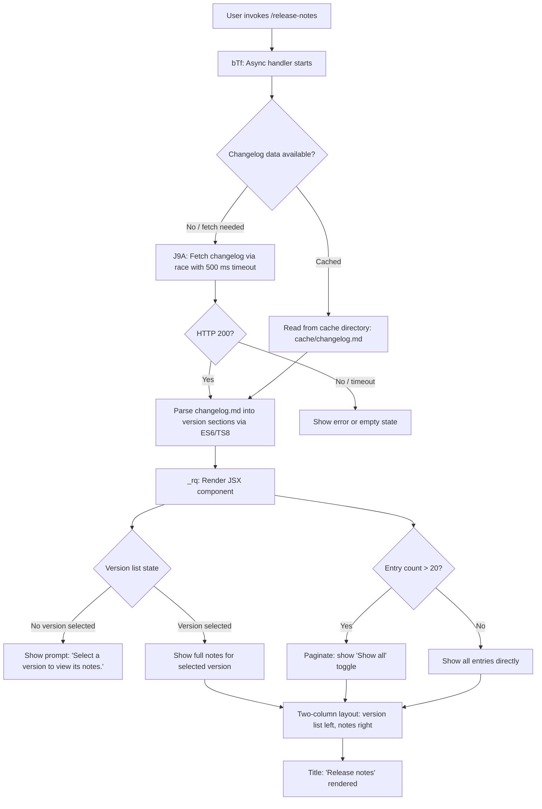

# `/release-notes`

> Analysis basis: CC v2.1.163 bundle.js (AST extraction + Claude interpretation)
> Minimum version: v2.1.163

---

## Overview

`/release-notes` renders an interactive, paginated UI panel that displays the Claude Code changelog. It fetches or reads a cached `changelog.md` file, parses it into per-version sections, and presents a two-column layout: a scrollable version list on the left and the selected version's notes on the right. The command is implemented as a JSX component rendered directly in the terminal UI rather than as a prompt sent to the AI agent.

---

## Registration

| Field | Value |
|---|---|
| type | `local-jsx` |
| name | `release-notes` |
| description | `View release notes` |
| module_id | `Arq` |
| load_inline | `true` |
| loc_byte | `11992189` |
| loc_byte_end | `11992330` |
| loc_line | `8306` |
| arbor_handler.name | `bTf` |
| arbor_handler.fqn | `claude-2.1.163::bTf` |
| arbor_handler.kind | `AsyncFunction` |
| arbor_handler.resolution_path | `module_id` |
| arbor_handler.n_hits | `0` |

Analysis basis: CC v2.1.163 bundle.js:+11992189

---

## Input Branching

The command has multiple distinct branches driven by changelog availability, version selection, and UI display modes.



Analysis basis: CC v2.1.163 bundle.js:+11990445 (handler entry), +11987441 (cache path), +11990495 (Promise.race/timeout), +11990762 (pagination threshold 20), +11990835 ("Show all"), +11991477 ("Select a version to view its notes."), +11991861 ("Release notes")

---

## Behavioral Spec

### Handler Entry and Timeout Race

The primary handler (`bTf`) is an `AsyncFunction`. On invocation it immediately sets up a `Promise.race` between the changelog fetch operation and a hard timeout. The timeout fires after **500 milliseconds** and rejects with an `Error` carrying the message `"Timeout"`.

```
async function releaseNotesHandler(args):
    timeoutPromise = new Promise((_, reject) =>
        setTimeout(() => reject(new Error("Timeout")), 500)
    )
    result = await Promise.race([fetchChangelog(), timeoutPromise])
    return renderReleaseNotesComponent(result, args)
```

Analysis basis: CC v2.1.163 bundle.js:+11990445, +11990463, +11990469, +11990481, +11990495

---

### Changelog Fetch and Cache Resolution (`J9A`)

The changelog fetcher (`J9A`) checks for a locally cached copy before performing a network request. The cache path is constructed by joining the cache directory with the filename `changelog.md` under the `cache` subdirectory.

```
async function fetchChangelog():
    cacheDir  = path.join(configDir, "cache")
    cachePath = path.join(cacheDir, "changelog.md")

    if httpStatus == 200:
        content = await networkFetch()
        writeToCache(cachePath, content)
        return content
    else:
        return readFromCache(cachePath)
```

Key constants:
- Cache subdirectory: `"cache"` (bundle.js:+11987084)
- Cache filename: `"changelog.md"` (bundle.js:+11987092)
- Expected HTTP status for success: `200` (bundle.js:+11987399)

Analysis basis: CC v2.1.163 bundle.js:+11987330, +11987375, +11987441, +11987464, +11987514

---

### Changelog Parsing (`TS8` / `ES6`)

The raw markdown text is split into per-version blocks and then each block is tokenized into header and bullet-list items.

```
function parseChangelog(rawMarkdown):
    lines = rawMarkdown.split("\n")
    sections = []
    currentSection = null

    for line in lines:
        trimmed = line.trim()
        if isVersionHeader(trimmed):         // e.g. "## v2.1.163 - date"
            if currentSection != null:
                sections.push(currentSection)
            parsed = parseVersionHeader(trimmed)   // extracts version + date via " - " separator
            currentSection = { version: parsed.version, date: parsed.date, entries: [] }
        elif trimmed.startsWith("- "):       // bullet entry
            currentSection.entries.push(trimmed)

    if currentSection != null:
        sections.push(currentSection)

    return sections
```

The header parser (`Q1`) locates the separator `" - "` via `indexOf`, then slices version and date substrings.
Bullet prefix constant: `"- "` (bundle.js:+11987978)
Version/date separator: `" - "` (bundle.js:+11987900)

Analysis basis: CC v2.1.163 bundle.js:+11987769, +11987818, +11987895, +11987935, +11987958, +11988086, +11988439, +11988466, +11988539

---

### JSX Render Component (`_rq`)

The render function (`_rq`) produces the interactive terminal UI component. It uses React memo-cache internals (sentinel `"react.memo_cache_sentinel"`, bundle.js:+11991336).

```
function renderReleaseNotesUI(sections, selectedVersion, showAll):
    MAX_VISIBLE = 20                        // bundle.js:+11990762
    LAYOUT = "column"                       // bundle.js:+11991410

    versionList = sections.map(buildVersionListItem)   // X9A, _.map
    if not showAll and len(sections) > MAX_VISIBLE:
        versionList = versionList.slice(0, MAX_VISIBLE)
        showAllButton = "Show all"          // bundle.js:+11990835

    if selectedVersion == null:
        rightPane = "Select a version to view its notes."  // bundle.js:+11991477
    else:
        rightPane = renderMarkdownNotes(selectedVersion.entries)

    return ColumnLayout(
        left  = versionList,
        right = rightPane,
        title = "Release notes"             // bundle.js:+11991861
    )
```

The version list items are built by `X9A` (maps sections to display rows) and `Hrq` (slices entries for preview, using `gw` for display formatting).
User interaction (version selection) is tracked via `Symbol.for` keyed state, with indices 3, 7, 9, 10 used as React memo-cache slots (bundle.js:+11990918, +11991210, +11991291, +11991319).

Analysis basis: CC v2.1.163 bundle.js:+11990245, +11990320, +11990346, +11990373, +11990756, +11990933, +11991038, +11991078, +11991158, +11991325

---

### Bootstrap / API Fetch Utility (`H` → `v`)

When a network fetch is required, the general-purpose bootstrap fetch utility is used. It sets the following HTTP headers:

- `Content-Type: application/json` (bundle.js:+11992318 via +15724303)
- `User-Agent: @anthropic-ai/claude-code` (bundle.js:+15724337)

The fetch log prefix is `"[Bootstrap] Fetching"` (bundle.js:+15724218).  
On success the log records `"[Bootstrap] Fetch ok"` (bundle.js:+15724592).  
On JSON parse failure it records event `"parse_failed"` under the `"api_bootstrap_fetch"` context (bundle.js:+15724540, +15724562).  
A secondary timeout of **5000 ms** applies at the fetch layer (bundle.js:+15724419) — separate from the 500 ms command-level timeout.

Analysis basis: CC v2.1.163 bundle.js:+15724216, +15724254, +15724303, +15724318, +15724337, +15724389, +15724419, +15724537

---

### Config / Cache Write Path (`icK`, `ncK`, `i2A`)

Persisting the fetched changelog to disk goes through the config-adjacent file-write subsystem:

```
async function writeCacheFile(path, content):
    ensureDirectoryExists(path.dirname)          // Zy.mkdir
    if fileExists(path):
        if path.endsWith(".txt"):
            rotateTxtBackup(path)               // rename .txt → .txt.N
        else:
            unlinkOldFile(path)                 // Zy.unlink
    appendOrWrite(path, content)                // Zy.appendFile
    checkRotation(path)                         // i2A
```

File extension check constant: `".txt"` (bundle.js:+205021)  
Rotation slice length: `4` characters (bundle.js:+205043)

Analysis basis: CC v2.1.163 bundle.js:+205563, +205588, +205596, +205626, +205716, +205733, +205765, +205771, +205804

---

## State & Side Effects

| Item | Detail |
|---|---|
| Telemetry — `tengu_feature_sad` | Fired on feature error path (bundle.js:+1010365) |
| Telemetry — `tengu_config_lock_contention` | Fired when config write-lock is contended (bundle.js:+3259907) |
| Telemetry — `tengu_config_stale_write` | Fired when a stale config write is detected (bundle.js:+3260043) |
| Telemetry — `tengu_config_parse_error` | Fired when config JSON cannot be parsed (bundle.js:+3262482) |
| Telemetry — `tengu_config_auth_loss_prevented` | Fired when write is blocked to prevent auth loss (bundle.js:+3260386) |
| Cache write | Writes fetched `changelog.md` to `<configDir>/cache/changelog.md` (bundle.js:+11987084, +11987092) |
| Hook registration | `j9` calls `MXA.register` — registers a cleanup/teardown hook (bundle.js:+60323) |
| Timer — command timeout | `setTimeout` 500 ms wraps changelog fetch race (bundle.js:+11990481) |
| Timer — fetch timeout | 5000 ms secondary timeout on bootstrap HTTP fetch (bundle.js:+15724419) |
| `clearTimeout` / `setTimeout` / `setImmediate` | Used inside terminal write buffer (`$pH`) for debounced output flushing (bundle.js:+59737, +59901, +59994) |
| File system | `Zy.mkdir`, `Zy.appendFile`, `Zy.rename`, `Zy.unlink`, `Zy.stat` called during cache management |
| Auth-loss guard | Refuses config write if re-read config is missing auth present in cache; logs to `saveConfigWithLock` (bundle.js:+3260234) and `saveGlobalConfig fallback` (bundle.js:+3256928) |
| Lock warning | Warns `"Lock acquisition took longer than expected - another Claude instance may be running"` (bundle.js:+3259818) |
| appState changes | Version selection tracked in React memo-cache slots; no persistent appState mutation observed at depth ≤ 2 |
| Sound | None observed at depth ≤ 2 |

---

## Version History

| Version | Change |
|---|---|
| v2.1.163 | Initial analysis |

---

## Common Mistakes

1. **Expecting AI-generated output**: `/release-notes` is a `local-jsx` command — it renders a static UI panel from a cached file, it does not send a prompt to the AI model.
2. **Assuming instant load**: The command races against a 500 ms timeout. On slow or offline systems the changelog fetch may time out and the panel may show an empty or error state.
3. **Stale cache after upgrade**: The changelog is cached at `<configDir>/cache/changelog.md`. If this file is corrupted or from a much older version, the displayed notes may not match the running version until the cache is refreshed.
4. **Conflating the two timeouts**: There is a 500 ms command-level timeout (bundle.js:+11990481) *and* a separate 5000 ms HTTP-level timeout (bundle.js:+15724419). Both must succeed for fresh data to appear.
5. **Config write collisions**: Concurrent Claude Code instances can trigger `tengu_config_lock_contention`; the lock warning message explicitly calls this out (bundle.js:+3259818).

---

## Appendix — Identifier Mapping

> For bundle debugging only. Identifiers change across versions.

| Identifier | Role |
|---|---|
| `bTf` | Primary async handler for `/release-notes` (Arbor-resolved entry point) |
| `J9A` | Changelog fetch + cache resolution function |
| `j9A` | Cache path builder (joins configDir + `"cache"` + `"changelog.md"`) |
| `GS6` | Secondary changelog accessor / cache reader |
| `TS8` | Changelog markdown parser (top-level coordinator) |
| `ES8` | Changelog parse helper (section splitting) |
| `ES6` | Per-line tokenizer (version headers and bullet entries) |
| `Q1` | Version header parser (indexOf `" - "`, slice version/date) |
| `_rq` | JSX render component for the release-notes UI |
| `X9A` | Version list item mapper (`_.map` over sections) |
| `Hrq` | Entry preview slicer (`H.slice` for abbreviated display) |
| `gw` | Display formatter for version list rows |
| `H` | Bootstrap fetch utility (network request + header injection) |
| `v` | Inner fetch executor (called by `H`) |
| `ccK` | HTTP response handler |
| `OXA` | Response parsing helper |
| `SH` | JSON serialization helper (`JSON.stringify`) |
| `J4` | Path/filename utility (replace, lastIndexOf, slice) |
| `g2A` | Path segment mapper (`BcK.map`) |
| `ppH` | Write buffer flush helper |
| `h2A` | Low-level stream write (`H.write`) |
| `icK` | Cache file write coordinator |
| `$pH` | Debounced terminal output flusher (clearTimeout/setTimeout/setImmediate) |
| `d3H` | File write finalization helper |
| `ncK` | Atomic cache append function (mkdir + appendFile + rotate) |
| `i2A` | Cache rotation checker (stat + endsWith + rename/unlink) |
| `r2A` | Cache path joiner (`KHH.join`) |
| `aL6` | Async file utility helper |
| `j9` | Hook registration caller (`MXA.register`) |
| `N9` | AsyncLocalStorage store reader (`FZL.getStore`) |
| `X8` | Config save with lock (global config write path) |
| `SX_` | Config write core (lock + backup + atomic rename) |
| `bDH` | Config file reader with parse error recovery |
| `hX_` | Config file writer helper (uses `TM6` for atomic write) |
| `TM6` | Atomic file write via temp file + rename |
| `Lr1` | Config entry iterator (`Object.entries`) |
| `t98` | Timestamp recorder (`Date.now`) |
| `wP1` | Config object merge helper (`Object.assign`) |
| `RX_` | Backup path builder (`pD.join` + `"backups"`) |
| `fj6` | Config field validator |
| `Pw_` | User-agent / version string parser (`_.split`, `q.trim`, `q.slice`) |
| `ZHH` | Feature-flag set checker (`g44.has`) |
| `uj` | String sanitizer (`H.replace`) |
| `t1` | Markdown renderer (terminal inline formatting) |
| `D6H` | Markdown block processor |
| `yd` | Inline text node renderer |
| `Aq` | Token classifier (model names, formatting tokens) |
| `eX` | Extended token processor |
| `r0` | Inline element renderer |
| `NE` | Named-entity renderer |
| `wI` | Emphasis/strong renderer |
| `NQH` | Nested emphasis helper |
| `kX1` | Token kind dispatcher |
| `gM` | Anthropic-AWS / gateway router |
| `Pe6` | List inclusion checker (`l1L.includes`) |
| `vQH` | Value quoter (`eH`) |
| `_4H` | Header-set inclusion checker (`H4H.includes`) |
| `o0` | Query-string helper (`q4H`) |
| `s6` | Session/context initializer |
| `P6` | Telemetry pipeline starter |
| `Nu6` | Telemetry event emitter |
| `c` | Core context accessor |
| `U_` | URL builder for changelog endpoint |
| `Dq` | HTTP request dispatcher |
| `RSA` | Response status checker |
| `eH` | String coercion utility (`String(...)`) |
| `HA` | Error constructor wrapper |
| `kH` | HTTP error handler (logError path) |
| `HW4` | Request queue manager (shift/push) |
| `TKK` | Telemetry event batcher (Date.now + N9 + SH) |
| `e$` | App state accessor |
| `Q6` | Path existence checker |
| `V` | Directory entry filter |
| `P` | Interactive selector / picker component |
| `K` | Column formatter (`L.map` + `f.padEnd`) |
| `$` | Output stream / buffer object |
| `T` | Scrollable list slice helper |
| `_lH` | Config schema validator |

---

Note: index built via Arbor fallback; some signals (telemetry, literals) may be missing — see arbor-fallback.js.