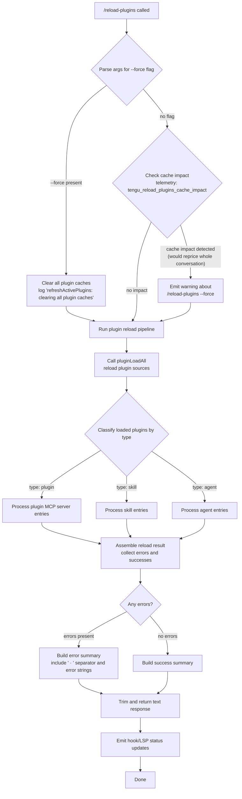

# `/reload-plugins`

> Analysis basis: CC v2.1.163 bundle.js (AST extraction + Claude interpretation)
> Minimum version: v2.1.163

---

## Overview

`/reload-plugins` activates pending plugin changes in the current session without requiring a full restart. It re-scans all plugin sources (skills, agents, MCP servers), optionally clearing caches first when `--force` is supplied, and emits a summary of what was reloaded or encountered errors.

---

## Registration

| Field | Value |
|---|---|
| type | `local` |
| name | `reload-plugins` |
| description | `Activate pending plugin changes in the current session` |
| argumentHint | `[--force]` |
| supportsNonInteractive | `false` |
| thinClientDispatch | `control-request` |
| module_id | `pAK` |
| load_inline | `true` |
| loc_byte | `12571762` |
| loc_byte_end | `12572006` |
| loc_line | `9042` |
| arbor_handler.name | `dSf` |
| arbor_handler.kind | `AsyncFunction` |
| arbor_handler.fqn | `claude-2.1.163::dSf` |
| arbor_handler.resolution_path | `module_id` |
| arbor_handler.n_hits | `0` |

Analysis basis: CC v2.1.163 bundle.js:+12571762

---

## Input Branching

The command has 4+ distinct branches based on `--force` presence, cache-impact analysis, plugin types encountered, and final status reporting, so a Mermaid flowchart is used.



Analysis basis: CC v2.1.163 bundle.js:+12570460 – +12571267

---

## Behavioral Spec

### Main Handler — `reloadPluginsHandler` (bundle: `dSf`)

The handler is an `AsyncFunction` resolved via `module_id → pAK`.

```
async function reloadPluginsHandler(args, context):
    rawArgs = parseArgumentString(args)          // iX, s4
    forceFlag = rawArgs.includes("--force")      // literal: "--force", "force"

    // Check cache impact before reloading
    cacheImpact = checkCacheImpact(context)      // uAK
    emit telemetry("tengu_reload_plugins_cache_impact", cacheImpact)

    if cacheImpact.significant and not forceFlag:
        // Warn the user that a force-reload would reprice the conversation
        // literal: "the whole conversation instead of using the cache. Run /reload-plugins --force to apply."
        appendWarning(context)

    appState = getAppState(context)              // _.getAppState

    // Determine plugin label for display
    pluginLabel = classify(reloadTarget)         // Hi → "plugin", "skill", "agent"
    // literal: "plugin MCP server", "plugin", "skill", "agent"

    reloadResult = await runActivePluginRefresh(appState, forceFlag)  // V0H

    // Build response text
    summaryParts = []
    for entry in reloadResult.entries:
        if entry.status == "error":
            summaryParts.push(entry.label + " · " + entry.errorText)
            // literal: " · ", "error"
        else:
            summaryParts.push(entry.label)

    responseText = summaryParts.join("\n").trim()   // H.trim
    // literal: "text"

    // Emit hook and LSP updates
    updateHookRegistration(context)              // RMH
    updateLSPServers(context)                    // R_H

    return { type: "text", content: responseText }
```

Analysis basis: CC v2.1.163 bundle.js:+12570460

---

### Force-Flag Argument Parsing — `parseCommandArgs` (bundle: `iX` → `s4`)

```
function parseCommandArgs(rawInput):
    tokens = tokenize(rawInput)                  // s4
    result = { force: false, rest: [] }
    for token in tokens:
        if token == "--force":
            result.force = true
        else:
            result.rest.push(token)
    return result
```

Analysis basis: CC v2.1.163 bundle.js:+12570460, +1097255

---

### Cache-Impact Check — `checkCacheImpactForReload` (bundle: `uAK`)

```
function checkCacheImpactForReload(context):
    pluginMap = context.pluginMap              // _.has, A.has
    sizeSummary = estimateCacheSize(pluginMap) // xN, Ls
    impactLevel = categorizeCacheLevel(sizeSummary)
    // emit tengu_reload_plugins_cache_impact
    return impactLevel
```

Analysis basis: CC v2.1.163 bundle.js:+12570914, +12569478

---

### Active Plugin Refresh — `refreshActivePlugins` (bundle: `V0H`)

This is the core reload pipeline. It clears caches when force is set, then re-runs the full plugin discovery and connection sequence.

```
async function refreshActivePlugins(appState, forceFlag):
    if forceFlag:
        log("refreshActivePlugins: clearing all plugin caches")
        // literal: "refreshActivePlugins: clearing all plugin caches"
        clearAllPluginCaches()                 // sZq → "Cleared installed plugins cache"
        clearSkillIndexCache()                 // Mm → H.clearSkillIndexCache
        clearMemoizedCaches()                  // MF → mN8.clear

    // Re-scan all plugin sources in parallel
    [pluginFileResults, mcpConfigResults] = await Promise.all([
        loadPluginsFromDisk(appState),         // Ys → plugin/skill/MCPB/DXT files
        loadMcpConfig(appState),               // ws → .mcp.json configs
    ])

    // Assemble combined plugin load result
    loadResult = assemblePluginLoadResult(pluginFileResults, mcpConfigResults)
    // literal: "plugin_load_all", "plugin_load_total_failure", "plugin_load_partial_failures"
    // warn if cwd changed mid-scan:
    // literal: "assemblePluginLoadResult: originalCwd changed mid-scan; skipping side-effects (stale early-kick)"

    // Apply MCP updates to live connections
    applyMcpUpdates(loadResult)                // M → tU8 → H.applyMcpUpdate

    // Emit event to signal plugin state change
    emitPluginStateChanged()                   // Vl.emit

    return loadResult
```

Analysis basis: CC v2.1.163 bundle.js:+12567430, +10017957

---

### Plugin Discovery from Disk — `loadAllPluginsFromPaths` (bundle: `Ys`)

```
async function loadAllPluginsFromPaths(appState):
    pluginRoots = resolvePluginRoots(appState)  // JC_ → "pluginRoot"
    results = []
    for root in pluginRoots:
        entries = scanDirectory(root)           // ox9 → CW6
        for entry in entries:
            if entry.endsWith(".mcpb") or entry.endsWith(".dxt"):
                result = await loadMcpbOrDxt(entry)   // FC_
            else:
                result = await loadFilePlugin(entry)
            results.push(result)
    return await Promise.all(results)
```

Analysis basis: CC v2.1.163 bundle.js:+6779260, +5264366, +5264387

---

### MCP Config Loading — `loadMcpServerConfigs` (bundle: `ws`)

```
async function loadMcpServerConfigs(appState):
    // Sources in priority order (literals):
    // "projectSettings", "userSettings", "localSettings", "policySettings"
    sources = [projectSettings, userSettings, localSettings, policySettings]
    merged = {}
    for source in sources:
        config = readMcpJsonFile(source)        // EP → .mcp.json
        if config:
            merged = Object.assign(merged, config.mcpServers)

    // Validate and partition servers
    validServers = []
    invalidServers = []
    for [name, serverConfig] in Object.entries(merged):
        if isValidConfig(serverConfig):         // Qj → "policySettings" check
            validServers.push({ name, config: serverConfig })
        else:
            invalidServers.push({ name, error: "mcp-config-invalid" })

    // Launch/reconnect MCP server processes
    await reconnectMcpServers(validServers)     // qm9 → zh_ → Dh_
    trackErrors(invalidServers)                 // fk

    return { valid: validServers, errors: invalidServers }
```

Analysis basis: CC v2.1.163 bundle.js:+6831301, +6829563, +6829586, +6829607

---

### Hook & LSP Update Post-Reload — `updateHooksAndLsp` (bundle: `RMH`, `R_H`)

```
function updateHooksAndLsp(context, loadResult):
    // Update hook registrations
    hookEntries = extractHooks(loadResult)      // RMH → hkH → x8
    for hook in hookEntries:
        registrar.register(hook)                // j9 → MXA.register

    // Update LSP server list
    lspEntries = extractLspServers(loadResult)  // R_H
    for lsp in lspEntries:
        applyLspUpdate(lsp)

    // Emit: "hook", "plugin LSP server"
    // literals: "hook", "plugin LSP server"
```

Analysis basis: CC v2.1.163 bundle.js:+12571224, +12571267

---

## State & Side Effects

| Item | Detail |
|---|---|
| Telemetry | `tengu_reload_plugins_cache_impact` (bundle.js:+12569754) — fires on every invocation with cache size data |
| Telemetry (indirect) | `tengu_feature_ok`, `tengu_feature_sad`, `tengu_feature_bad` (bundle.js:+1010222, +1010365, +1010284) — general feature-outcome events from the control-request dispatcher |
| Telemetry (indirect) | `tengu_mcp_list_changed` (bundle.js:+15916828) — fires when MCP tool list refreshes after reload |
| Telemetry (indirect) | `tengu_plugin_state_file_error` (bundle.js:+10018136) — fires if plugin state JSON cannot be parsed |
| Cache mutations | When `--force`: clears installed-plugins cache (`sZq`), skill-index cache (`Mm → H.clearSkillIndexCache`), and memoized caches (`MF → mN8.clear`) |
| appState changes | `V0H` writes updated plugin/MCP server maps back into `appState`; `Vl.emit` signals plugin-state-changed to subscribers |
| Hook registration | `j9 → MXA.register` re-registers hooks discovered in the reloaded plugin set |
| MCP connections | Live MCP connections are updated via `tU8 → H.applyMcpUpdate`; orphaned connections are disposed with log messages "applyConnectionResult: disposing orphaned connect (slot config changed mid-flight)" and "…(slot removed mid-flight)" |
| LSP servers | LSP server list is refreshed via `R_H`; labels used: "plugin LSP server", "lsp-manager" |
| Sound | None observed in depth-2 traversal |

---

## Version History

| Version | Change |
|---|---|
| v2.1.163 | Initial analysis |

---

## Common Mistakes

1. **Omitting `--force` when plugin caches are stale.** If an installed plugin was updated on disk, a plain `/reload-plugins` may skip re-loading it because the cache still considers it current. The bundle warns with a message ending in `"Run /reload-plugins --force to apply."` (bundle.js:+12570345).

2. **Expecting non-interactive use.** `supportsNonInteractive` is `false`; invoking the command from a headless/pipe context will not work as expected.

3. **Running in a thin-client session without control-request support.** The `thinClientDispatch` field is `"control-request"`, meaning the command requires a full control channel to the daemon. If the channel is unavailable, the reload silently fails.

4. **Assuming immediate MCP reconnection.** The reload re-attempts connections, but servers with a recent failure are skipped for 15 minutes unless the plugin config is edited; see the literal `"Skipping connection (recent failure cached; retries automatically in 15 min, or edit the plugin config to retry now)"` (bundle.js:+10425670).

5. **Confusing `/reload-plugins` with a full restart.** The command activates changes inside the current session; it does not restart the daemon process or clear conversation context.

---

## Appendix — Identifier Mapping

> For bundle debugging only. Identifiers change across versions.

| Identifier | Role |
|---|---|
| `dSf` | Main handler for `/reload-plugins` (AsyncFunction, resolved via module_id `pAK`) |
| `iX` | Argument tokenizer (pre-parse of raw CLI string) |
| `s4` | Low-level argument parse helper |
| `MEH` | Argument parse sub-utility |
| `Hi` | Plugin-type classifier ("plugin" / "skill" / "agent") |
| `b8` | Generic utility called from plugin-type classifier |
| `uAK` | Cache-impact check for reload |
| `qm9` | MCP server reconnect orchestrator |
| `zh_` | MCP plugin loader (dispatches to `Dh_` and `Oh_`) |
| `Dh_` | Individual MCP plugin load/connect (path + url types) |
| `Oh_` | MCP skills-dir loader (marketplace-aware) |
| `ws` | MCP config reader and server launcher |
| `EP` | MCP JSON config file reader (.mcp.json) |
| `vXH` | MCP binary (mcpb) download/extract helper |
| `Qj` | Policy-settings gate checker |
| `JY8` | MCP server entry normalizer |
| `qD7` | MCP server state tracker (Map operations) |
| `V0H` | Core refreshActivePlugins pipeline |
| `sZq` | Installed-plugins cache clear helper |
| `F$` | Plugin reload sub-dispatcher |
| `LAf` | Plugin loader factory |
| `Mm` | Skill-index cache clear orchestrator |
| `MF` | Memoized-cache clear helper |
| `Ys` | Plugin-files-from-disk loader |
| `FC_` | MCPB / plugin manifest reader |
| `CW6` | Plugin directory scanner and manifest processor |
| `ox9` | Plugin source status classifier |
| `nSH` | LSP config file loader (.lsp.json) |
| `FU7` | LSP config entry processor |
| `s08` | LSP extension-conflict checker |
| `M` | MCP state manager (applyMcpUpdate, VYA) |
| `AbH` | MCP server connection builder |
| `tU8` | MCP connection result applier |
| `VYA` | MCP retry / all-remote-recovered handler |
| `RMH` | Hook and permission updater post-reload |
| `R_H` | LSP server list updater post-reload |
| `FW6` | Plugin install/resolve engine (large; contains version resolution) |
| `mAK` | Reload completion callback |
| `cSf` | Result split/formatter helper |
| `gSf` | LSP manager filter helper |
| `QSf` | Plugin-prefix filter helper |
| `xAK` | Plugin has-set helper |
| `hkH` | Hook entry extractor (Object.entries iteration) |
| `j9` | Hook registrar (calls `MXA.register`) |
| `kR_` | Compliance/context level resolver |
| `IR_` | "auto:" context level parser |
| `ENH` | HIPAA compliance resolver |
| `Ls` | TST / tool-search tier resolver |
| `gM7` | Tool-search settings array resolver |
| `D6` | Tool-search config lookup |
| `ED` | outputTokens extractor |
| `xN` | Cache-impact category builder |
| `JC_` | Plugin root path resolver |

Note: index built via Arbor fallback; some signals (telemetry, literals) may be missing — see arbor-fallback.js.