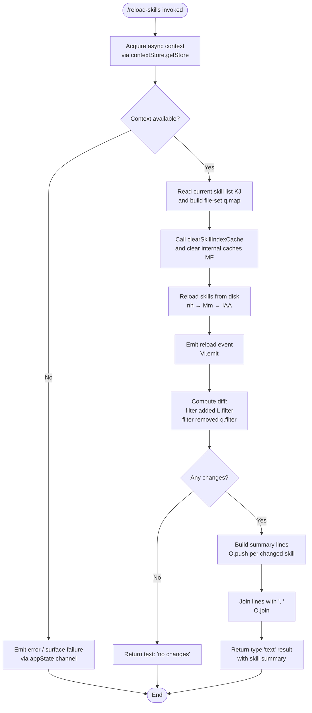

# `/reload-skills`

> Analysis basis: CC v2.1.163 bundle.js (AST extraction + Claude interpretation)
> Minimum version: v2.1.163

---

## Overview

`/reload-skills` rescans the filesystem for skill definitions that were added or modified during the current session, invalidates all relevant in-memory caches, reloads skill data from disk, and emits an event to notify other subsystems. On completion it prints a human-readable summary listing which skills changed (or reports "no changes" if none were detected). The command supports both interactive and non-interactive (thin-client) modes.

---

## Registration

| Field | Value |
|---|---|
| type | `local` |
| name | `reload-skills` |
| description | `Pick up skills added or changed on disk during this session` |
| loc_byte | `12572556` |
| loc_byte_end | `12572773` |
| loc_line | `9042` |
| supportsNonInteractive | `true` |
| thinClientDispatch | `post-text` |
| module_id | `FAK` |
| load_inline | `true` |
| arbor_handler.name | `nSf` |
| arbor_handler.fqn | `claude-2.1.163::nSf` |
| arbor_handler.kind | `AsyncFunction` |
| arbor_handler.resolution_path | `module_id` |
| arbor_handler.n_hits | `0` |

Analysis basis: CC v2.1.163 bundle.js:+12572556

---

## Input Branching

The handler has 4+ distinct outcome branches (error acquiring context, no skills detected, some skills changed, all skills unchanged), so a Mermaid flowchart is used.



Analysis basis: CC v2.1.163 bundle.js:+12572078 – +12572773

---

## Behavioral Spec

### 1. Handler Entry — `reloadSkillsHandler` (`nSf`)

The top-level handler is an `AsyncFunction` resolved via module `FAK`.

```
async function reloadSkillsHandler(commandInput):
    ctx = acquireAsyncContext()          // b6 → bd6 → contextStore.getStore
    if ctx is null or unavailable:
        raiseContextError()             // surfaced through appState channel
        return

    previousSkillKeys  = getCurrentSkillKeys()   // KJ
    previousSkillFiles = buildFileSet(previousSkillKeys)  // q.map over keys

    invalidateAllSkillCaches()          // nh → Mm → clearSkillIndexCache + IAA
    clearInternalCache()                // MF → mN8.clear

    newSkillList = reloadSkillsFromDisk()  // L.map → per-skill reload with cleanup
    emitReloadEvent()                      // Vl.emit

    addedSkills   = newSkillList.filter(s => not previousSkillFiles.has(s))   // L.filter + f.has
    removedSkills = previousSkillFiles.filter(s => not newSkillList.has(s))   // q.filter

    summaryLines = []
    for each skill in addedSkills ∪ removedSkills:
        summaryLines.push(formatSkillLine(skill))   // O.push → b8 formatter

    if summaryLines is empty:
        return { type: "text", content: "no changes" }
    else:
        return { type: "text", content: summaryLines.join(", ") }
```

Analysis basis: CC v2.1.163 bundle.js:+12572078

---

### 2. Context Acquisition — `acquireAsyncContext` (`b6`)

```
function acquireAsyncContext():
    store = contextStore.getStore()     // bd6 → Cd6.getStore
    if store is undefined:
        handleMissingContext()          // ie
        return null
    return contextFromStore(store)      // X_ → uv
```

Analysis basis: CC v2.1.163 bundle.js:+1020504

---

### 3. Skill Index Cache Invalidation — `invalidateSkillCaches` (`nh` → `Mm`)

```
async function invalidateSkillCaches():
    await Promise.resolve()             // yield microtask queue
    callAuxiliaryInvalidator()          // IAA
    skillIndexModule.clearSkillIndexCache()   // H.clearSkillIndexCache
```

The skill index module (`H`) itself performs several sub-operations when its cache-clear path is entered: it fetches bootstrap data (logging `"[Bootstrap] Fetching"` at debug level), sets `Content-Type: application/json` and `User-Agent` headers, enforces a **5000 ms timeout** for the fetch, fires a `tengu_feature_sad` telemetry event on failure, and normalises skill names (upper-case conversion, trimming, format parsing via `Pw_`, allow-list checks via `ZHH`, replacement via `uj`, and token splitting via `t1`).

Analysis basis: CC v2.1.163 bundle.js:+13154448 (cache clear), +15724216 (bootstrap fetch), +15724419 (5000 ms timeout), +1010365 (telemetry)

---

### 4. Per-Skill Disk Reload — `reloadSkillFile` (`L`)

```
function reloadSkillFile(skillEntry):
    tracker.add(skillEntry)             // q.add — mark in-progress
    try:
        result = fetchAndParseSkillFromDisk(skillEntry)
        return result
    finally:
        closeHandleA()                  // A.close / f.toLowerCase normalisation
        closeHandleQ()                  // q.close
        processLoaded(result)           // L (recursive / continuation)
        tracker.delete(skillEntry)      // q.delete — unmark in-progress
```

Analysis basis: CC v2.1.163 bundle.js:+16139269

---

### 5. Skill Summary Formatting — `formatSkillLine` (`b8`)

```
function formatSkillLine(skill):
    // Pads skill name to fixed width (40 characters) for alignment
    padded = skill.name.padEnd(40)      // f.padEnd, literal 40 at +16160063
    label  = "skill"                    // literal at +12572452
    state  = determineState(skill)      // "stopped" if applicable (+16170094)
    return padded + "  " + label + additionalInfo(skill)
```

When a skill entry corresponds to a stopped background session, the string `"background session"` is appended to the line (literal at `+16170137`).

Analysis basis: CC v2.1.163 bundle.js:+16158058, +16158071, +16160063

---

### 6. Internal Cache Clear — `clearInternalCache` (`MF`)

```
function clearInternalCache():
    internalSkillMap.clear()    // mN8.clear
```

This is a simple unconditional `Map#clear()` call that wipes the command's own runtime skill registry before the reload populates it afresh.

Analysis basis: CC v2.1.163 bundle.js:+9960597

---

### 7. Skill Key Parsing — `parseSkillKey` (`Pw_`)

Used during the invalidation/comparison phase to decompose a raw skill key string.

```
function parseSkillKey(rawKey):
    parts = rawKey.split(separator)         // _.split
    for each part in parts:
        trimmed = part.trim()               // q.trim
        idx     = trimmed.indexOf(marker)   // q.indexOf, marker offset=1 (+2974496)
        if idx >= 0:
            head = trimmed.slice(0, idx)    // q.slice, start=0 (+2974521)
            tail = trimmed.slice(idx + 1)
            yield { head, tail }
```

Analysis basis: CC v2.1.163 bundle.js:+2974410

---

### 8. Allow-List Check — `isAllowedSkillName` (`ZHH`)

```
function isAllowedSkillName(name):
    return allowSet.has(name)    // g44.has
```

Returns `true` only when the normalised skill name appears in the statically compiled allow-set `g44`.

Analysis basis: CC v2.1.163 bundle.js:+843864

---

## State & Side Effects

| Item | Detail |
|---|---|
| Telemetry | `tengu_feature_sad` fired on bootstrap-fetch parse failure (bundle.js:+1010365) |
| Cache invalidation | `clearSkillIndexCache()` called on the skill index module (`H`) at +13154501 |
| Internal map | `mN8.clear()` wipes the runtime skill registry before reload at +9960597 |
| Event emission | `Vl.emit` broadcasts a reload event to registered subsystem listeners at +12572185 |
| File handles | Per-skill file handles closed unconditionally in `finally` blocks at +16145261, +16145271 |
| In-progress tracker | `q.add` / `q.delete` bracket each skill's reload for concurrency tracking at +16139269, +16139292 |
| Bootstrap HTTP | Sets `Content-Type: application/json`, `User-Agent` header; enforces 5000 ms fetch timeout at +15724303, +15724337, +15724419 |
| stdout (thin-client) | Dispatched via `thinClientDispatch: "post-text"`; result is always `type: "text"` at +12572395 |

---

## Version History

| Version | Change |
|---|---|
| v2.1.163 | Initial analysis |

---

## Common Mistakes

1. **Running during active skill execution** — calling `/reload-skills` while a skill is executing may produce inconsistent state because `mN8.clear()` is unconditional; the in-progress tracker (`q.add`/`q.delete`) mitigates but does not fully prevent races.
2. **Expecting immediate bootstrap data** — the skill index module performs an async network fetch with a 5 000 ms timeout on cache-clear. If the API is unreachable, the `tengu_feature_sad` event fires and cached data may be stale or empty.
3. **Interpreting "no changes" as an error** — the command always succeeds (exit 0) and prints `"no changes"` when no skill files changed since session start; this is normal.
4. **Using in non-interactive scripts without checking output** — `supportsNonInteractive: true` means the command runs headlessly, but the thin-client dispatch (`post-text`) only emits text; callers should parse the returned string to detect diffs programmatically.
5. **Assuming synchronous cache invalidation** — `invalidateSkillCaches` begins with `Promise.resolve()`, yielding to the microtask queue; in tight async loops the cache may not yet be cleared when the next tick reads it.

---

## Appendix — Identifier Mapping

> For bundle debugging only. Identifiers change across versions.

| Identifier | Role |
|---|---|
| `nSf` | Top-level `reloadSkillsHandler` — AsyncFunction; command entry point |
| `b6` | `acquireAsyncContext` — retrieves the active async context store |
| `bd6` | `getContextFromStore` — reads value from context store |
| `ie` | `handleMissingContext` — error path when context store is absent |
| `X_` | `wrapContextResult` — wraps the raw store value into a typed context object |
| `uv` | `contextValueMapper` — maps raw store fields to handler-facing context shape |
| `nh` | `invalidateSkillCaches` — outer invalidation coordinator |
| `Mm` | `clearSkillIndexCacheAsync` — async cache-clear with microtask yield |
| `H` | `skillIndexModule` — module owning `clearSkillIndexCache` and bootstrap fetch |
| `v` | `bootstrapFetchUtil` — performs HTTP bootstrap fetch with headers and timeout |
| `e$` | `skillIndexCacheMap` — internal Map backing the skill index cache |
| `Pw_` | `parseSkillKey` — splits and parses raw skill key strings |
| `ZHH` | `isAllowedSkillName` — allow-list membership check via static Set |
| `uj` | `normaliseSkillName` — applies regex replacement to normalise skill name |
| `t1` | `splitSkillTokens` — tokenises a normalised skill name |
| `s6` | `bootstrapFetchDispatch` — dispatches the bootstrap fetch and handles telemetry |
| `dN8` | `skillReloadAuxA` — auxiliary reload step A within `nh` |
| `SZq` | `skillReloadAuxB` — auxiliary reload step B within `nh` |
| `dCH` | `skillReloadAuxC` — auxiliary reload step C; delegates to `Dk6` |
| `Dk6` | `skillStoreAccessor` — reads from skill Wv8 store and calls `zk6` |
| `zk6` | `skillStoreReadHelper` — helper used by `Dk6` to retrieve a skill entry |
| `MF` | `clearInternalCache` — clears `mN8` runtime skill Map |
| `L` | `reloadSkillFile` — per-skill disk reload with in-progress tracking |
| `f` | `skillFileHandle` — file/connection handle managed within skill reload |
| `A` | `skillHandleA` — secondary handle closed after reload (name lowercased) |
| `K` | `formatSkillTable` — formats skill entries into padded table rows |
| `O` | `summaryLineAccumulator` — array collecting formatted summary lines |
| `b8` | `formatSkillLine` — formats a single skill into a human-readable line |
| `IAA` | `auxiliaryIndexInvalidator` — called alongside `clearSkillIndexCache` in `Mm` |

---

Note: index built via Arbor fallback; some signals (telemetry, literals) may be missing — see arbor-fallback.js.