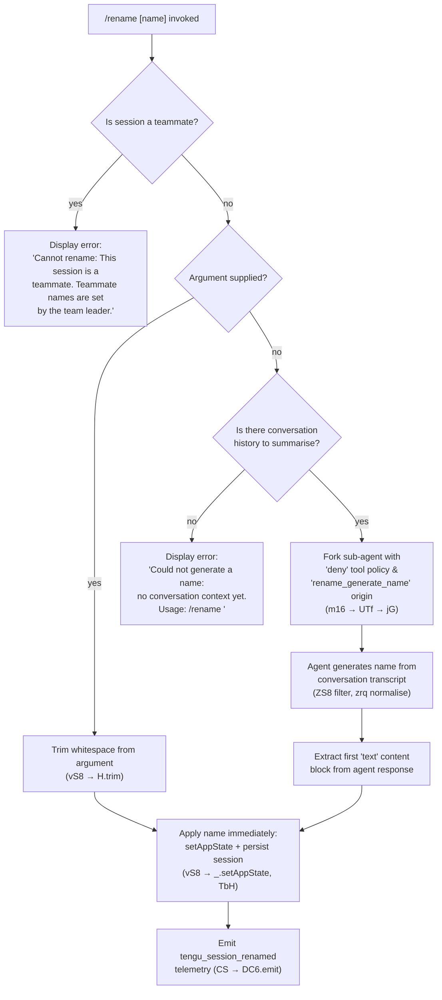

# `/rename`

> Analysis basis: CC v2.1.163 bundle.js (AST extraction + Claude interpretation)
> Minimum version: v2.1.163

---

## Overview

The `/rename` command sets or generates a display name for the current Claude Code conversation session. When invoked with an explicit name argument it applies that name immediately; when invoked without an argument it forks a lightweight sub-agent to generate an appropriate name from the conversation history. The command also supports the alias `/name`.

---

## Registration

| Field | Value |
|---|---|
| type | `local-jsx` |
| name | `rename` |
| description | `Rename the current conversation` |
| argumentHint | `[name]` |
| immediate | `true` |
| aliases | `["name"]` |
| module_id | `Yrq` |
| load_inline | `true` |
| loc_byte | `11998074` |
| loc_byte_end | `11998273` |
| loc_line | `8326` |
| arbor_handler.name | `BTf` |
| arbor_handler.fqn | `claude-2.1.163::BTf` |
| arbor_handler.kind | `AsyncFunction` |
| arbor_handler.resolution_path | `module_id` |
| arbor_handler.n_hits | `0` |

Analysis basis: CC v2.1.163 bundle.js:+11998074

---

## Input Branching

Four distinct paths exist (teammate guard → no-argument auto-generate → no-history guard → explicit name), requiring a Mermaid flowchart.



Analysis basis: CC v2.1.163 bundle.js:+11997100 (teammate guard), +11997218 (current-session fetch), +11997337 (trim), +11997371 (auto-generate branch), +11997449 (no-history error), +11997563 (apply name), +11997577 (setAppState)

---

## Behavioral Spec

### 1 — Top-level handler (`BTf`)

```
async function renameCommandHandler(userInput, context):
    sessionInfo  = fetchCurrentSession(context)          // NS8 → GT
    isMate       = checkIfTeammate(sessionInfo)          // vS8 → OM → s0

    if isMate:
        displayError("Cannot rename: This session is a teammate…")
        return

    rawArg = userInput.trim()

    if rawArg is not empty:
        applyNameDirectly(rawArg, context)              // path A
    else:
        autoGenerateName(context)                       // path B
```

Analysis basis: CC v2.1.163 bundle.js:+11997770 (`BTf → vS8`), +11997786 (`BTf → H`), +11997828 (`BTf → NS8`)

---

### 2 — Teammate guard (`OM → s0`)

```
function fetchCurrentSessionFromStore(context):
    store = getAsyncLocalStore()                        // s0 → q5_.getStore
    return store.currentSession                         // returns index 0
```

The numeric literal `0` at bundle.js:+2251124 is the store slot index used to read the current session. If the session carries a teammate flag, the error string `"Cannot rename: This session is a teammate. Teammate names are set by the team leader."` (bundle.js:+11997238) is surfaced and execution stops.

Analysis basis: CC v2.1.163 bundle.js:+11997218, +2251112, +2251124, +11997238

---

### 3 — Auto-generate path (`m16`)

When no explicit name is provided, the orchestrator function (`m16`) is invoked:

```
async function autoGenerateName(context):
    historyMessages = filterConversationHistory(context)  // ZS8

    if historyMessages is empty:
        displayError("Could not generate a name: no conversation context yet. Usage: /rename <name>")
        return

    // Fork a sub-agent dedicated to name generation
    agentResult = await forkSubAgent({
        toolPolicy : "deny",                             // no tools allowed
        origin     : "rename_generate_name",
        systemNote : "Session name generation cannot use tools",
        turnLimit  : derived from C6A timestamp logic
    })                                                   // UTf → jG

    nameText = extractFirstTextBlock(agentResult)        // v, EH
    applyNameDirectly(nameText.trim(), context)
```

The literal `"deny"` (bundle.js:+11995368) is the tool-access policy for the forked agent. The literal `"rename_generate_name"` (bundle.js:+11995486) identifies the fork origin in telemetry. The guard string `"Session name generation cannot use tools"` appears at bundle.js:+11995383.

Analysis basis: CC v2.1.163 bundle.js:+11995923 (`m16 → D6`), +11995964 (`m16 → C6A`), +11995983 (`m16 → UTf`), +11996035 (`m16 → ZS8`), +11996076 (`m16 → xh`), +11997449 (no-history error literal), +11997371 (`vS8 → m16`)

---

### 4 — History filter (`ZS8`)

```
function filterConversationHistory(messages):
    result = []
    for msg in messages:
        if msg.isMeta == false and msg.origin == "human":
            result.push(msg)
    // joins message fragments (_.push, _.join, A.slice)
    return result
```

Fields `"isMeta"` (bundle.js:+11992602), `"origin"` (bundle.js:+11992637), and `"human"` (bundle.js:+11992677) are checked to select only genuine human-turn messages. The collected array determines whether the no-history guard triggers.

Analysis basis: CC v2.1.163 bundle.js:+11996035, +11992741, +11992759, +11992857, +11992889

---

### 5 — Sub-agent fork (`UTf → jG`)

```
async function forkRenameAgent(context, abortController):
    // Sets up AbortController listener (UTf → H.addEventListener)
    // Calls abort on parent cancel (UTf → A.abort)

    agentResponse = await queryAgent(context, {
        toolPolicy     : "deny",
        originTag      : "rename",                      // literal at +11995462
        responseFormat : { type: "json_schema" },       // literal at +11996298
        contentFilter  : "text"                         // literal at +11995709
    })                                                  // jG → JV8

    filteredOutput = flatMapTextBlocks(agentResponse)   // UTf → q.flatMap
    normalised     = normaliseOutput(filteredOutput)    // UTf → zrq → xR → H.trim
    return normalised
```

The `"rename"` origin tag (bundle.js:+11995462) and `"rename_generate_name"` sub-origin (bundle.js:+11995486) are emitted in telemetry via the forked query path. The tool policy `"deny"` prevents the agent from calling any tools; it is restricted to generating a plain-text session name.

Analysis basis: CC v2.1.163 bundle.js:+11995122 (`UTf → o_H`), +11995172, +11995250 (`UTf → jG`), +11995270 (`UTf → u8`), +11995608, +11995773, +11995803, +11995841

---

### 6 — Apply name directly (`vS8` path A + `TbH`)

```
function applyNameDirectly(name, context):
    trimmedName = name.trim()
    context.setAppState({ sessionName: trimmedName })   // vS8 → _.setAppState
    persistSession(trimmedName, context)                 // vS8 → TbH
    updateSidebarTitle(trimmedName)                      // TbH → CS → DC6.emit
    emitRenameComplete(context)                          // ak8, BwH, aj
```

`TbH` orchestrates persistence: it calls `CS` (log writer using `"custom-title"` tag, bundle.js:+13196287) and also `JMH` which persists the `"agent-name"` field (bundle.js:+13199309) and emits `tengu_agent_name_set`. The `"ai-title"` tag (bundle.js:+13196451) is used when the name originates from the auto-generate path.

Analysis basis: CC v2.1.163 bundle.js:+11997563 (`vS8 → TbH`), +11997577 (`vS8 → _.setAppState`), +11997596 (`vS8 → ak8`), +11997619 (`vS8 → BwH`), +11997623 (`vS8 → aj`), +13196287, +13196366, +13196379, +13199309, +13199394, +13199407

---

### 7 — Name sanitisation utilities (`v`, `J4`, `Aq`)

During auto-generate, the raw model response is passed through a chain of string utilities before being stored:

```
function sanitiseName(rawText):
    step1 = rawText.toUpperCase()                      // v → _.toUpperCase (+206177)
    step2 = replaceDisallowedChars(step1)              // J4 → H.replace (+198089)
    // Strips path separators; uses file-extension detection (i2A → H.endsWith ".txt", +205021)
    step3 = truncateToLimit(step2)                     // J4 → A.lastIndexOf, A.slice
    step4 = normaliseModel(step3)                      // Aq: trim + toLowerCase + replace
    return step4
```

The `.txt` extension literal (bundle.js:+205021) is used when the backing JSONL transcript file extension is checked before a filesystem rename (`i2A → Zy.rename`, bundle.js:+205073).

Analysis basis: CC v2.1.163 bundle.js:+206075, +206115, +206177, +206197, +206216, +198062, +198089, +198225, +198251

---

## State & Side Effects

| Item | Detail |
|---|---|
| Telemetry — rename fork | `tengu_rename_full_session_fork` (bundle.js:+11995926) — fired when the auto-generate sub-agent is launched |
| Telemetry — session renamed | `tengu_session_renamed` (bundle.js:+13196379) — fired after the name is successfully written to the log |
| Telemetry — agent name set | `tengu_agent_name_set` (bundle.js:+13199407) — fired when the agent-name field is persisted |
| Telemetry — fork query | `tengu_fork_agent_query` (bundle.js:+10915237) — fired inside the forked agent query path |
| Telemetry — forked agent turns exceeded | `tengu_forked_agent_default_turns_exceeded` (bundle.js:+10914794) |
| appState changes | `setAppState` called with updated session name field (`_.setAppState`, bundle.js:+11997577) |
| Filesystem | Conversation JSONL log receives a rename via `Zy.rename` (bundle.js:+205073); `.txt` extension files handled by `Zy.unlink` (bundle.js:+205113); new entry appended via `ncK → Zy.appendFile` (+205376) |
| Session log tags | `"custom-title"` written when name is user-supplied (+13196287); `"ai-title"` written when name is AI-generated (+13196451) |
| Hook registration | `j9 → MXA.register` (bundle.js:+60323) — registered within the conversation persistence layer (`icK → j9`) |
| Sound | None detected in depth-2 traversal |
| AbortController | The forked agent honours the parent abort signal via `UTf → H.addEventListener("abort", …)` (bundle.js:+11995172); calls `A.abort()` on cancellation (+11995203) |

---

## Version History

| Version | Change |
|---|---|
| v2.1.163 | Initial analysis |

---

## Common Mistakes

1. **Invoking `/rename` with no argument before any conversation turns exist.** The command will display `"Could not generate a name: no conversation context yet. Usage: /rename <name>"` and exit without modifying the session. Supply an explicit name instead.

2. **Attempting to rename a teammate session.** Teammate session names are controlled by the team leader; the command surfaces a hard error and makes no change.

3. **Expecting the auto-generated name to be instant.** Without an argument the command forks a sub-agent that makes a model API call. This incurs latency and counts against API usage, even though the agent is tool-restricted (`"deny"` policy) and typically resolves quickly.

4. **Assuming `/rename` and `/name` have different behavior.** The alias `"name"` is registered identically to `"rename"` — both invoke the same `BTf` handler.

5. **Providing a name with leading/trailing whitespace.** The name is trimmed automatically (`H.trim`, bundle.js:+11997337), so surrounding whitespace is silently discarded.

---

## Appendix — Identifier Mapping

> For bundle debugging only. Identifiers change across versions.

| Identifier | Role |
|---|---|
| `BTf` | Top-level async handler for `/rename` (Arbor-resolved entry point) |
| `vS8` | Inner dispatch function; routes between teammate-guard, explicit-name, and auto-generate paths |
| `NS8` | Current-session fetcher (reads session record from context) |
| `OM` | Teammate-status checker; calls `s0` to read async-local store |
| `s0` | Async-local store reader (`q5_.getStore`) |
| `m16` | Auto-generate orchestrator; calls `D6`, `C6A`, `UTf`, `ZS8`, `xh`, `zrq`, `EH` |
| `UTf` | Sub-agent fork executor; sets up abort listener and fires `jG` |
| `jG` | Forked agent query runner; calls `JV8`, `gm`, `BOf`, `wfH`, etc. |
| `JV8` | Core agent API call; reads/writes appState, emits streaming events |
| `ZS8` | Conversation-history filter; collects non-meta human-origin messages |
| `zrq` | Output normaliser; trims and extracts text from agent response blocks |
| `xR` | String trimmer utility used inside `zrq` |
| `TbH` | Name-application coordinator; calls `CS`, `JMH`, `M`, `Rd`, etc. |
| `CS` | Session log writer; appends `"custom-title"` entry and emits `DC6` event |
| `JMH` | Agent-name persister; writes `"agent-name"` field and emits `tengu_agent_name_set` |
| `icK` | Conversation file manager; handles path resolution, rename, append, and hook registration |
| `i2A` | File-rename helper; detects `.txt` extension, calls `Zy.rename` and `Zy.unlink` |
| `ncK` | File-append helper; calls `Zy.mkdir` and `Zy.appendFile` |
| `aL6` | Path utility used inside file manager |
| `r2A` | Conversation path resolver |
| `d3H` | Conversation directory builder |
| `ppH` | Write helper (`h2A → H.write`) |
| `v` | Name transformation pipeline (uppercase, replace, includes checks) |
| `J4` | Filename sanitiser (replace, lastIndexOf, slice) |
| `Aq` | Model-alias normaliser (trim, toLowerCase, replace) |
| `g2A` | Filename character map builder (`BcK.map`) |
| `SH` | JSON serialiser utility (`JSON.stringify`) |
| `EH` | String coercion utility (`String(...)`) |
| `D6` | Session-state watcher / change detector |
| `C6A` | Timestamp/turn-budget calculator for forked agent |
| `gm` | Sub-agent lifecycle manager (exit, lifecycle, turn events) |
| `BOf` | Forked agent result collector |
| `xh` | Context builder passed to query engine |
| `pv8` | Context snapshot serialiser (hashes, file reads, writes) |
| `HT` | Tool-schema assembler for the agent query |
| `h3K` | Main agent query loop (streaming, retries, advisor, watchdog) |
| `CxH` | No-assistant-message error handler |
| `us_` | Context accumulator used inside `CxH` |
| `Y2` | Token/model normaliser |
| `af_` | Auth-key prefix classifier (`/login managed key`, `sk-ant-`) |
| `t1` | Model-selection resolver |
| `D6H` | Conversation-state router |
| `yd` | Message-history builder |
| `eX` | Extended context assembler |
| `r0` | Request-object constructor |
| `wI` | Model/tier mapper |
| `NE` | Provider selector |
| `gM` | Provider-type classifier |
| `XA` | Renderer / error surface |
| `Rd` | Session-record reader/writer (`rO6`) |
| `rO6` | Low-level file read/write for session record |
| `BwH` | File-watcher manager (watches conversation files) |
| `yK` | Watcher setup helper |
| `cE` | Watcher path builder |
| `e9` | File-stat and cache manager |
| `ff` | Atomic file-write helper (uses `MY`) |
| `MY` | Safe file-writer (random bytes temp name, rename-to-final) |
| `oj` | Cache-delete helper |
| `kH` | Error logger / buffer writer |
| `HA` | Error stringifier |
| `eH` | Generic string coercer |
| `Dq` | Error-detail formatter |
| `RSA` | Recursive error stringifier |
| `HW4` | Rolling error-log ring-buffer manager |
| `aj` | Session-basename extractor |
| `ak8` | Session-keys enumerator (`Object.keys`) |
| `M` | MCP server manager (starts/stops MCP connections) |
| `AbH` | MCP connection applicator |
| `bl` | Single MCP connection handler |
| `fk` | MCP plugin loader |
| `tU8` | MCP connection-result applier |
| `mk` | MCP slot cleanup |
| `VYA` | MCP server-list reconciler |
| `$A6` | MCP connection version checker |
| `mY8` | MCP auth-state checker |
| `l8` | Async timeout/retry helper |
| `TKK` | Telemetry timestamp helper |
| `D$H` | Log-file appender with mkdir |
| `Ov` | Log-line formatter |
| `PM` | Log-prefix builder |
| `JR` | Log renderer (uv) |
| `X_` | Log renderer variant |
| `d4` | Hook registration caller (`j9`) |
| `bt` | Log-write with event emission |
| `s4` | MEH hook invoker |
| `wT` | Watcher teardown |
| `Wt` | Watcher state tracker |
| `x1H` | Sidebar / title update helper |
| `j9` | Hook registry (`MXA.register`) |
| `$pH` | Debounce/throttle scheduler (clearTimeout, setTimeout, setImmediate) |
| `Q6` | Config accessor |
| `D` | Forced-shutdown handler (process.exit) |
| `GT` | Session-record getter |
| `lK` | Filter utility for conversation list |
| `UE` | Context enrichment utility |
| `S6` | Session-watcher with file change detection |
| `XTL` | File-watch subscription manager (`a98.watchFile`) |
| `B98` | Session-dedup tracker |
| `OX_` | Session-event emitter |
| `jX_` | Session-join handler |
| `qu` | Session-queue processor |
| `Au` | Session log-line consumer |
| `bDH` | Config-file reader (JSONL + stat + mkdir + backup) |
| `V46` | Turn-budget calculator helper |
| `o_H` | AbortController factory |
| `XV8` | Agent-ID generator |
| `oh` | Random-bytes generator (`dm9.randomBytes`) |
| `b1H` | Background-task tracker |
| `wfH` | Streaming filter/dedup |
| `K9H` | Streaming-event accumulator |
| `Uk8` | Streaming-state tracker |
| `jRq` | Message-type router |
| `$y6` | Message-type classifier (tombstone, tool_use_summary, etc.) |
| `u8` | Text-input component builder |
| `P` | Input-field renderer |
| `X` | Stream-chunk reader (Buffer.concat, indexOf) |
| `eK` | Event emitter |
| `B6` | JSON parser (`JSON.parse`) |
| `v8` | Error classifier (`EISDIR`, `ENOENT`, `EEXIST`) |
| `R8` | Error-code extractor |
| `Xvq` | Cache-query builder |
| `Qqf` | Context-block serialiser |
| `mv8` | Context-snapshot factory |
| `Pw_` | API-key parser (split, trim, indexOf, slice) |
| `ZHH` | Feature-flag checker (`g44.has`) |
| `uj` | Path replacer |
| `NQH` | Model-tier resolver |
| `kX1` | Extended-model selector |
| `Pe6` | Model-include-list checker |
| `vQH` | Model-capability checker |
| `o0` | Model-alias lookup (`q4H`) |
| `_4H` | Disallowed-model-name checker |
| `s6` | Feature-flag accessor |
| `P6` | Feature-flag reader (`Nu6`) |
| `Hj6` | Session-path builder |
| `_j6` | Session-file namer |
| `c` | JSX/React renderer |
| `Nu6` | Feature-flag store |
| `sk6` | MCP slot key builder |
| `rkq` | MCP connection runner |
| `bY8` | MCP status reporter |
| `SY8` | MCP config writer |
| `O8` | MCP debug logger |
| `os_` | OAuth flow launcher |
| `as_` | OAuth callback completer |
| `Kyq` | MCP capability fetcher |
| `rs_` | MCP status reader |
| `Ab_` | MCP transport selector |
| `FN` | MCP skills emitter |
| `I` | File-watcher chokidar wrapper |
| `T7` | MCP error logger |
| `tkq` | MCP heartbeat handler |
| `zA6` | Port parser (parseInt) |
| `SI8` | Timeout parser (parseInt) |
| `_bH` | MCP version validator |
| `K` | Column formatter |
| `__` | Utility re-export |