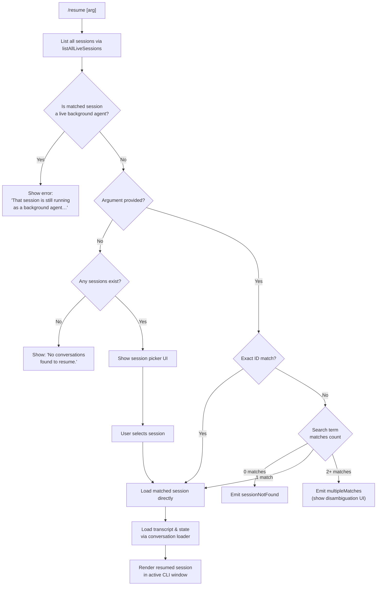

# `/resume`

> Analysis basis: CC v2.1.163 bundle.js (AST extraction + Claude interpretation)
> Minimum version: v2.1.163

---

## Overview

`/resume` (alias: `/continue`) allows a user to resume a previous Claude Code conversation by providing a conversation ID or search term. The command queries existing sessions, optionally filters out live background sessions, and then loads the selected conversation's transcript and state back into the active CLI session.

---

## Registration

| Field | Value |
|---|---|
| type | `local-jsx` |
| name | `resume` |
| description | Resume a previous conversation |
| argumentHint | `[conversation id or search term]` |
| aliases | `["continue"]` |
| module_id | `asq` |
| load_inline | `true` |
| loc_byte | `12180656` |
| loc_byte_end | `12180853` |
| loc_line | `8515` |
| arbor_handler.name | `avf` |
| arbor_handler.fqn | `claude-2.1.163::avf` |
| arbor_handler.kind | `AsyncFunction` |
| arbor_handler.resolution_path | `module_id` |
| arbor_handler.n_hits | `0` |

Analysis basis: CC v2.1.163 bundle.js:+12180656

---

## Input Branching

The handler has 4+ distinct resolution paths depending on session state and search results.



Analysis basis: CC v2.1.163 bundle.js:+12179248, +12179258, +12179693, +12176902, +12176973

---

## Behavioral Spec

### Session Listing and Background-Agent Guard

The handler begins by calling the live-session lister (`I5H`, which calls `A.listAllLiveSessions` with mode `"interactive"`). The result set is inspected for any session matching the user's argument that is currently flagged as a running background agent.

Analysis basis: CC v2.1.163 bundle.js:+12179248, +9020411, +9020502

```
async function resumeCommandHandler(userArg, appContext):
    sessions = await listAllLiveSessions(mode="interactive")

    matchedSession = findSession(sessions, userArg)

    if matchedSession and matchedSession.isLiveBackgroundAgent:
        showError(
            "That session is still running as a background agent. " +
            "Open `claude agents` to attach to it, or stop it there first to resume here."
        )
        return
```

The exact error string is: `"That session is still running as a background agent. Open \`claude agents\` to attach to it, or stop it there first to resume here."` (bundle.js:+12179258)

### Worktree Detection

Before presenting sessions, the command runs worktree detection (`WxH`) to determine the current git worktree context. It executes `git worktree list --porcelain` (literals at bundle.js:+12176277, +12176284), parses output, and uses the worktree path to filter or sort sessions relevant to the current working directory. The NFC normalization (`"NFC"` at bundle.js:+177636) is applied to path strings for cross-platform consistency.

Analysis basis: CC v2.1.163 bundle.js:+12179615, +12176222

```
function detectCurrentWorktree(cwd):
    output = exec("git", ["worktree", "list", "--porcelain"])
    worktrees = parsePortcelainOutput(output)
    normalizedCwd = normalize(cwd, "NFC")
    current = worktrees.find(wt => normalizedCwd.startsWith(wt.path))
    return current
```

Telemetry event `tengu_worktree_detection` is fired during this step (bundle.js:+12176366).

### No-Results Path

If `sessions` is empty (or no sessions match the search term), the command renders the message:

> `"No conversations found to resume."` (bundle.js:+12179693)

Analysis basis: CC v2.1.163 bundle.js:+12179693

### Session Search and Disambiguation

When the user supplies a search term:

- If a single session matches, it is loaded directly.
- If zero sessions match, the `sessionNotFound` outcome is produced (literal at bundle.js:+12176902).
- If two or more sessions match, the `multipleMatches` outcome is triggered (literal at bundle.js:+12176973), presenting a disambiguation UI rendered with bold formatting (`isq` → `j6.bold`, bundle.js:+12176937).

Analysis basis: CC v2.1.163 bundle.js:+12179812, +12179826, +12176902, +12176973

```
function resolveSession(sessions, arg):
    if arg is empty:
        return showPicker(sessions)

    matches = sessions.filter(s => sessionMatches(s, arg))

    switch matches.length:
        case 0: return { outcome: "sessionNotFound" }
        case 1: return { outcome: "ok", session: matches[0] }
        default: return { outcome: "multipleMatches", sessions: matches }
```

### Conversation Loading and Transcript Replay

Once a session is selected, the transcript loader (`h5H`) and session-state hydrator (`lN6` / `DMK` / `v1H`) are invoked. These reconstruct in-memory conversation chains from the on-disk JSONL transcript files. Key metadata keys read from the transcript include:

| Metadata key | Purpose |
|---|---|
| `summary` | Conversation compact summary |
| `last-prompt` | Last user-issued prompt |
| `custom-title` | User-defined session title |
| `ai-title` | Model-generated title |
| `tag` | Session tags |
| `agent-name` | Named agent for session |
| `agent-color` | Visual color for agent |
| `agent-setting` | Agent configuration |
| `mode` | Conversation mode |
| `permission-mode` | Permission policy |
| `worktree-state` | Worktree snapshot |
| `pr-link` | Associated PR URL |

Analysis basis: CC v2.1.163 bundle.js:+13208741, +13208808, +13208904, +13208982, +13209052, +13209113, +13209187, +13209263, +13209343, +13209406, +13209564, +13209648

The transcript parser (`pFf` / `mFf`) reads files synchronously using `iS.openSync` / `iS.readSync` / `iS.closeSync`, with a read buffer of `1 048 576` bytes per chunk (bundle.js:+13205321). Files with a `.txt` extension are handled specially (literal `".txt"` at bundle.js:+205021). Transcript file operations use `Zy.stat`, `Zy.rename`, `Zy.unlink`, and `Zy.appendFile` for integrity management (bundle.js:+204917, +205073, +205113, +205376).

### Session Load Dispatch and Hook Registration

Once the transcript is reconstructed, the session-resumption renderer (`Fn`) assembles the file-context list (`wMK`) and dispatches the conversation to the active CLI viewport. The hook-manager registration (`j9` → `MXA.register`, bundle.js:+60323) re-registers any session-scoped hooks.

The `Date.now()` call at bundle.js:+12179570 records the resume initiation timestamp; `WxH` also stamps its own `Date.now()` at bundle.js:+12176222.

Telemetry events `slash_command_session_id` and `slash_command_title` are emitted after successful resume (literals at bundle.js:+12179954, +12180178).

Analysis basis: CC v2.1.163 bundle.js:+12179619, +12179633, +12180060, +12180079

```
async function loadAndRenderSession(session, appContext):
    transcript = await readTranscriptFile(session.transcriptPath)
    chain      = buildMessageChain(transcript)
    fileCtx    = buildFileContext(session.workingDir)

    registerSessionHooks(session)

    emitTelemetry("slash_command_session_id", session.id)
    emitTelemetry("slash_command_title",      session.title)

    renderResumedSession(chain, fileCtx, appContext)
```

### Background-Session Skip Logic

Sessions in state `"skip"` (literal at bundle.js:+12179461) or with role `"user"` marker (literal at bundle.js:+12179399) are skipped during chain construction to avoid replaying intermediate agent state from background sessions.

Analysis basis: CC v2.1.163 bundle.js:+12179461, +12179399

---

## State & Side Effects

| Item | Detail |
|---|---|
| Telemetry — worktree | `tengu_worktree_detection` (bundle.js:+12176366) |
| Telemetry — transcript integrity | `tengu_transcript_phantom_parent` (bundle.js:+13207519) |
| Telemetry — chain walk | `tengu_relink_walk_broken` (bundle.js:+13188538), `tengu_chain_parent_cycle` (bundle.js:+13189028), `tengu_chain_timestamp_fallback` (bundle.js:+13189177), `tengu_chain_parallel_tr_recovered` (bundle.js:+13191043) |
| Telemetry — transcript parent | `tengu_transcript_parent_cycle` (bundle.js:+13211324) |
| Telemetry — command | `slash_command_session_id`, `slash_command_title` (literals at bundle.js:+12179954, +12180178) |
| Hook registration | Re-registers session hooks via `MXA.register` (bundle.js:+60323) |
| File I/O | Reads transcript JSONL via `iS.openSync`/`readSync`/`closeSync`; may rename or unlink stale lock files via `Zy.rename`, `Zy.unlink` |
| appState changes | Hydrates all conversation-chain maps (`v1H`): message map, tool-result map, agent-setting map, worktree-state, permission-mode, pr-link, etc. |
| Sound | None observed in depth-2 traversal |
| Background-agent guard | Hard-stops resume with inline error if target session is a live background agent (bundle.js:+12179258) |

---

## Version History

| Version | Change |
|---|---|
| v2.1.163 | Initial analysis |

---

## Common Mistakes

1. **Passing a partial ID that matches multiple sessions** — the command will emit `multipleMatches` and ask you to disambiguate rather than picking the most recent one automatically.
2. **Trying to resume a session that is still running as a background agent** — the command blocks this with an explicit error and directs you to `claude agents` instead.
3. **Running `/resume` in a directory with no matching worktree** — worktree detection runs first; sessions from a different git worktree may not appear in the picker depending on the active filter.
4. **Expecting the alias `/continue` to behave differently** — `/continue` is a full alias and is identical in behaviour to `/resume`.
5. **Assuming the session list is always global** — sessions are filtered and sorted based on the current worktree context, so sessions from unrelated projects may not appear at the top.

---

## Appendix — Identifier Mapping

> For bundle debugging only. Identifiers change across versions.

| Identifier | Role |
|---|---|
| `osq` | Command registration filter / outer command wrapper |
| `avf` | Main async handler for `/resume` (Arbor-resolved entry point) |
| `I5H` | Live-session lister (calls `listAllLiveSessions`) |
| `WxH` | Worktree detection and session-list enrichment |
| `Fn` | Session renderer / file-context assembler for resumed session |
| `wMK` | File-context builder (directory scan, file index) |
| `jC6` | Session dispatch coordinator |
| `txH` | Buffer assembler for transcript content |
| `iFf` | Inner transcript record parser |
| `h5H` | Conversation-chain loader (top-level) |
| `v1H` | Session-state hydrator (populates in-memory maps) |
| `lN6` | Snapshot/conversation-metadata reader |
| `DMK` | Conversation directory mapper |
| `BFf` | Conversation file finder |
| `y5H` | Message-chain builder |
| `IFf` | Incremental chain filter and sort |
| `VFf` | Chain-node deduplicator |
| `$MK` | Metadata key extractor |
| `vFf` | Chain-node validator (NaN / value checks) |
| `ufA` | Unified format adapter for conversation entries |
| `nfA` | Compact-summary message normalizer |
| `rfA` | Content-type filter (image / document) |
| `kFf` | Attachment/content type predicate |
| `yFf` | Array-content type predicate |
| `e66` | Message map extractor |
| `mS6` | Message segment normalizer |
| `Ax8` | Message-lookup helper (get/set) |
| `qx8` | Message-list enumerator |
| `pFf` | Low-level transcript file reader (sync I/O) |
| `mFf` | Buffer-based transcript parser |
| `UFf` | Alternate sync file reader |
| `ZFf` | Chain-walk cycle detector |
| `l5K` | Linked-list traversal for message chains |
| `gTH` | JSONL line parser (with BOM handling) |
| `PE4` | JSONL field extractor |
| `GE4` | JSONL substring parser |
| `WE4` | JSONL token decoder |
| `XE4` | JSONL header validator |
| `icK` | Transcript append / write manager |
| `ncK` | Transcript chunk appender (mkdir + appendFile) |
| `i2A` | Transcript file rotation handler |
| `r2A` | Transcript path resolver |
| `d3H` | Transcript directory builder |
| `aL6` | Transcript size checker |
| `a2A` | Transcript write scheduler |
| `AU6` | Async write queue |
| `ppH` | Output write helper |
| `h2A` | Underlying stream write |
| `$pH` | Batched output scheduler (setTimeout/setImmediate loop) |
| `j9` | Hook registration dispatcher |
| `isq` | Bold-text formatter for disambiguation UI |
| `N$` | Session-picker UI component |
| `At` | Session-display renderer |
| `DF` | UUID format validator (regex test) |
| `MO` | Path normalizer (NFC) |
| `_Y` | Path segment trimmer |
| `jE` | Directory walker for project sessions |
| `kH` | Error-to-string converter |
| `HA` | Error wrapper |
| `EH` | String coercion helper |
| `eH` | String identity wrapper |
| `Dq` | Error log dispatcher |
| `RSA` | Error formatter |
| `HW4` | Shift-push ring buffer |
| `SH` | JSON serializer (JSON.stringify wrapper) |
| `J4` | Session ID formatter / path builder |
| `g2A` | Session-list mapper |
| `ccK` | Conversation context constructor |
| `OXA` | Context-list builder |
| `v` | Session-match / filter predicate |
| `Pw_` | Argument string parser (split/trim/indexOf/slice) |
| `ZHH` | Feature-flag set checker |
| `uj` | String replacer utility |
| `t1` | Model-and-context orchestrator |
| `D6H` | Context selector |
| `yd` | Model selection and validation |
| `Aq` | Model identifier normalizer |
| `eX` | Extended model resolver |
| `r0` | Model capability router |
| `wI` | Model-profile lookup |
| `NE` | Named-model entry resolver |
| `gM` | Model registry accessor |
| `kX1` | Model alias expander |
| `NQH` | Model shorthand resolver |
| `Pe6` | Model inclusion list checker |
| `vQH` | Model exclusion checker |
| `_4H` | Model category classifier |
| `s6` | Feature-flag evaluator |
| `P6` | Feature registry lookup |
| `Nu6` | Feature-flag base resolver |
| `S_` | Main daemon / subprocess launcher |
| `bTH` | Child-process lifecycle manager |
| `VR` | Viewport/render context |
| `Q6` | Session-quota checker |
| `gMH` | Session metadata aggregator |
| `wR8` | Resumption render pipeline entry |
| `TKK` | Daemon status file reader (`daemon.status.json`) |
| `JR6` | Status file path builder |
| `nr` | Status deserialization helper |
| `N9` | AsyncLocalStorage context fetcher |
| `X_` | Working-directory resolver |
| `uv` | Current-directory getter |
| `Nl` | Projects-directory resolver |
| `NO` | No-op / null-check guard |
| `B0H` | File-tree node builder |
| `pfA` | Directory recursive scanner |
| `MC6` | File-metadata cache manager |
| `TTH` | File-tree leaf constructor |
| `Hq6` | Tree-node hash generator |
| `jMK` | MIME-type detector |
| `qMK` | File-type classifier |
| `W` | MCP client connection manager |
| `G` | MCP server group |
| `AbH` | MCP tool-list builder |
| `tU8` | MCP connection result applier |
| `VYA` | MCP server-state reconciler |
| `M` | MCP state manager (top-level React context equivalent) |
| `L` | Active-session set manager |
| `f` | Session close handler |
| `y` | Away-summary scheduler |
| `mZ8` | Rate-limit state reader |
| `Uq5` | Away-summary eligibility checker |
| `cO8` | Away-summary generator |
| `RH` | Render helpers (foreground) |
| `hH` | Render helpers (background) |
| `e` | Voice / recording session manager |
| `Pb8` | Voice WebSocket stream handler |
| `pGK` | Audio VAD / silence detector |
| `XH` | Audio chunk queue |
| `NH` | Audio pipeline race handler |
| `LH` | MCP elicitation handler |
| `IOA` | Voice-event logger |
| `vOA` | Voice-session metadata tracker |
| `lmH` | Language/locale detector |
| `_WA` | Date-time locale formatter |
| `D` | Process-exit / abort dispatcher |
| `z` | Daemon lifecycle controller |
| `SG4` | String coercion (daemon status) |
| `K$` | Configuration key resolver |
| `v8` | Async error boundary |
| `b8` | Background-session state store |
| `O` | Background-session tracker |
| `YH` | Active input handle |
| `wH` | Focus-state checker |
| `jH` | Key-event list |
| `U65` | UI utility helper |

---

Note: index built via Arbor fallback; some signals (telemetry, literals) may be missing — see arbor-fallback.js.