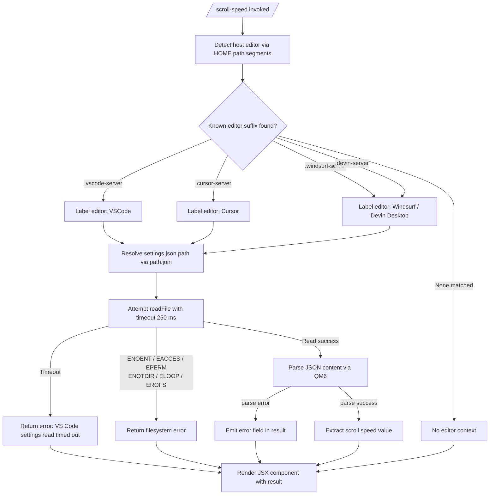

```markdown
---
type: feature-spec
feature: "scroll-speed"
cc_version: "2.1.163"
updated: "2026-06-05"
tags: ["scroll-speed", "commands", "slash-commands"]
source: "bundle-analysis"
bundle_verified: true
analysis_basis: "CC v2.1.163 bundle.js (AST extraction + Claude interpretation)"
author: "ryujaeuk <ryujaeuk@gmail.com>"
repository: "https://github.com/MyLittleLuckyDog/cc-gnothi"
license: "AGPL-3.0-only"
---

# `/scroll-speed`

> Analysis basis: CC v2.1.163 bundle.js (AST extraction + Claude interpretation)
> Minimum version: v2.1.163

---

## Overview

`/scroll-speed` is a local JSX slash command that adjusts the mouse wheel scroll speed within the Claude Code terminal UI. It accomplishes this by reading the host editor's settings file (e.g., `settings.json` for VS Code, Cursor, Windsurf, or Devin Desktop) and applying a scroll-speed value derived from those settings. The command renders a JSX component to present its result or any errors to the user.

---

## Registration

| Field | Value |
|---|---|
| type | `local-jsx` |
| name | `scroll-speed` |
| description | Adjust mouse wheel scroll speed |
| loc_byte | 12233395 |
| loc_byte_end | 12233643 |
| loc_line | 8632 |
| module_id | `atq` |
| load_inline | `true` |
| arbor_handler.name | `tIf` |
| arbor_handler.fqn | `claude-2.1.163::tIf` |
| arbor_handler.kind | `AsyncFunction` |
| arbor_handler.resolution_path | `module_id` |
| arbor_handler.n_hits | 0 |

Analysis basis: CC v2.1.163 bundle.js:+12233395

---

## Input Branching

The handler exhibits four or more distinct branches depending on the detected editor environment and whether the settings file is successfully read and parsed. A Mermaid flowchart is used.



Analysis basis: CC v2.1.163 bundle.js:+12233158, +4031909, +4027782, +4031956, +4031989

---

## Behavioral Spec

### Top-level Handler (`tIf`)

The async function `tIf` is the command's main entry point, resolved via `module_id → atq`.

```
async function scrollSpeedHandler(context):
    // Step 1: Race a settings-read operation against a 250 ms timeout
    result = await timeoutRace(
        readEditorSettings(),
        timeoutMs = 250,
        timeoutMessage = "VS Code settings read timed out"
    )

    // Step 2: Render JSX component with the result
    return createElement(ScrollSpeedComponent, { result })
```

Analysis basis: CC v2.1.163 bundle.js:+12233158, +12233167, +12233171, +12233229

---

### Timeout Race (`yL`)

A generic utility that races an async operation against a fixed deadline.

```
async function timeoutRace(promise, timeoutMs, timeoutMessage):
    timer = null
    timeoutPromise = new Promise((_, reject) =>
        timer = setTimeout(() => reject(new Error(timeoutMessage)), timeoutMs)
    )
    try:
        result = await Promise.race([promise, timeoutPromise])
        clearTimeout(timer)
        return result
    catch error:
        clearTimeout(timer)
        throw error
```

The timeout constant is **250 milliseconds** (bundle.js:+12233167).
The timeout error message is `"VS Code settings read timed out"` (bundle.js:+12233171).

Analysis basis: CC v2.1.163 bundle.js:+2294013, +2294044, +2294091

---

### Editor Settings Reader (`WE_`)

Reads the current editor's `settings.json` and returns parsed scroll-speed data.

```
async function readEditorSettings():
    // Step 1: Identify the editor from the user's HOME or shell path
    editorKind = detectEditorFromPath(currentHomePath)
    // editorKind is one of: "VSCode", "Cursor", "Devin Desktop", or null

    // Step 2: Build the path to settings.json
    settingsPath = path.join(editorConfigDir, "settings.json")

    // Step 3: Read the file as UTF-8
    rawContent = await fs.readFile(settingsPath, "utf-8")

    // Step 4: Parse JSON, capturing any parse errors
    parsed = parseJsonSafe(rawContent)

    // Step 5: Extract the scroll speed field
    scrollSpeedValue = extractScrollSpeed(parsed)
    return scrollSpeedValue
```

Analysis basis: CC v2.1.163 bundle.js:+4031909, +4031956, +4031968, +4031982, +4031989, +4032016

---

### Editor Detection (`sL8`)

Inspects path segments to determine which editor environment is hosting the terminal.

```
function detectEditorFromPath(homePath):
    if homePath.includes(".vscode-server"):
        return "VSCode"           // bundle.js:+4027793, +4032260
    if homePath.includes(".cursor-server"):
        return "Cursor"           // bundle.js:+4027823, +4032288
    if homePath.includes(".windsurf-server"):
        return "Windsurf"         // bundle.js:+4027853, +4032301
    if homePath.includes(".devin-server"):
        return "Devin Desktop"    // bundle.js:+4027885, +4032318
    return null
```

Analysis basis: CC v2.1.163 bundle.js:+4027782, +4027793, +4027823, +4027853, +4027885, +4027903

---

### JSON Safe Parser (`QM6`)

Wraps raw JSON parsing with error normalization.

```
function parseJsonSafe(rawString):
    // Strip leading BOM or whitespace prefix if present
    trimmed = stripPrefix(rawString)   // via vx: startsWith + slice
    try:
        return { value: JSON.parse(trimmed) }
    catch e:
        return { error: String(e) }    // emits field "error" (bundle.js:+1144178)
```

Analysis basis: CC v2.1.163 bundle.js:+1144075, +1144079, +1144102, +1144159, +1144178

---

### Filesystem Error Classifier (`s1` / `v8`)

Translates raw Node.js filesystem errors into structured results. Recognized error codes:

| Code | Meaning |
|---|---|
| `ENOENT` | File not found |
| `EACCES` | Permission denied |
| `EPERM` | Operation not permitted |
| `ENOTDIR` | Not a directory |
| `ELOOP` | Symlink loop |
| `EROFS` | Read-only filesystem |

Analysis basis: CC v2.1.163 bundle.js:+176030, +176047, +176061, +176075, +176088, +176103, +176116

---

### Telemetry / Error Logger (`kH` pipeline)

When a non-filesystem error occurs during settings reading, the error is logged through a structured pipeline:

```
function logCommandError(error):
    formattedMessage = formatError(error)     // HA + eH: Error → String
    appendToRecentErrors(formattedMessage)    // HW4: shift/push bounded ring buffer
    pushErrorRecord(formattedMessage)         // hBH.push
    Er.logError(formattedMessage)             // external logger
```

Additionally, a telemetry event `tengu_feature_sad` is fired via `s6` when an unexpected error condition is encountered (bundle.js:+1010365).

Analysis basis: CC v2.1.163 bundle.js:+1015586, +1015599, +1015845, +1015928, +1015946, +1015986

---

## State & Side Effects

| Item | Detail |
|---|---|
| Telemetry | `tengu_feature_sad` (bundle.js:+1010365) — fired on unexpected error path |
| Hook registration | None identified in depth-2 traversal |
| appState changes | None identified in depth-2 traversal |
| Sound | <!-- TODO: not found in depth-2 traversal; needs --depth 4 --> |
| Filesystem reads | `settings.json` inside the detected editor's config directory, read as `utf-8` (bundle.js:+4031989, +4032016) |
| Timeout | 250 ms hard deadline on settings read (bundle.js:+12233167) |
| Error ring buffer | Recent errors appended via bounded shift/push queue (`HW4` — bundle.js:+1015266, +1015278) |

---

## Version History

| Version | Change |
|---|---|
| v2.1.163 | Initial analysis |

---

## Common Mistakes

1. **Assuming the command applies universally**: `/scroll-speed` only reads from editors it recognizes (VS Code, Cursor, Windsurf, Devin Desktop). Running it in an unrecognized terminal host will produce no editor-specific result.
2. **Expecting immediate results in slow environments**: The settings read has a hard 250 ms timeout. On network-mounted home directories or very slow disks the read will time out and return `"VS Code settings read timed out"` rather than the actual value.
3. **Ignoring filesystem permission errors**: If `settings.json` exists but is unreadable (`EACCES`, `EPERM`, `EROFS`), the command reports a classified error rather than a scroll-speed value. Fixing file permissions resolves this.
4. **Treating a parse error as a blank setting**: If `settings.json` is malformed JSON, the parser returns an `{ error: "..." }` object rather than crashing. The UI component will display this error inline.
5. **Expecting telemetry in all error cases**: `tengu_feature_sad` is only fired on the unexpected error branch, not on predictable filesystem errors (ENOENT, etc.).

---

## Appendix — Identifier Mapping

> For bundle debugging only. Identifiers change across versions.

| Identifier | Role |
|---|---|
| `tIf` | Main async handler for `/scroll-speed` (entry point resolved via `module_id: atq`) |
| `yL` | Timeout-race utility (wraps `setTimeout` / `Promise.race` / `clearTimeout`) |
| `WE_` | Editor settings reader (orchestrates detection → readFile → parse) |
| `hpL` | Helper called early in settings reader (exact role not resolved at depth 2) |
| `sL8` | Editor detection from path segments (checks `.vscode-server`, `.cursor-server`, etc.) |
| `H` | Bootstrap fetch / User-Agent / HTTP utility (shared infrastructure) |
| `v` | User-agent / header builder (produces `Content-Type`, `User-Agent` headers) |
| `e$` | Utility called from bootstrap fetch context |
| `Pw_` | String parser — splits, trims, and slices structured strings |
| `ZHH` | Set membership checker (`g44.has`) |
| `uj` | String replacement utility (`H.replace`) |
| `t1` | Structured field extractor (`D6H`, `Aq`, `eX`) |
| `s6` | Telemetry emitter — fires `tengu_feature_sad` |
| `QM6` | JSON safe-parser with error normalization |
| `vx` | Prefix stripper (`startsWith` + `slice`) used inside JSON parser |
| `PE_` | Array type guard (`Array.isArray`) |
| `s1` | Filesystem error classifier (maps error codes to structured results) |
| `v8` | Inner helper of filesystem error classifier |
| `kH` | Error logger / ring-buffer pipeline coordinator |
| `HA` | Error-to-string formatter (wraps `Error` and `String`) |
| `eH` | String normalizer (converts values via `String()`) |
| `Dq` | Error record builder (delegates to `RSA`) |
| `RSA` | Inner error record constructor (uses `eH`) |
| `HW4` | Bounded ring-buffer manager (`kd6.shift` / `kd6.push`) |

---

Note: index built via Arbor fallback; some signals (telemetry, literals) may be missing — see arbor-fallback.js.
```