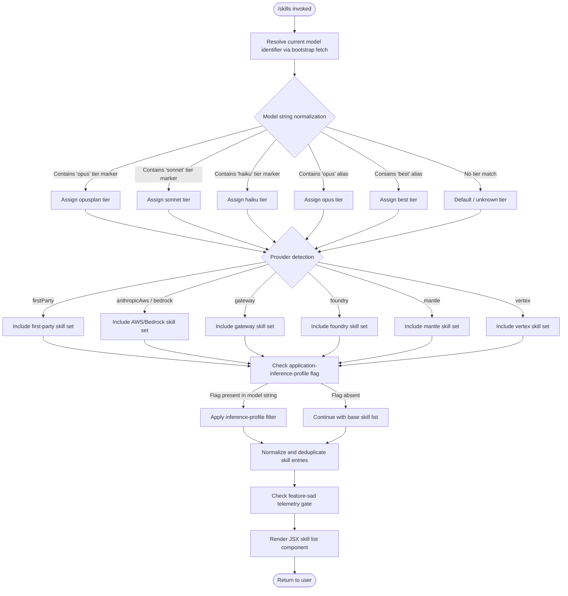

# `/skills`

> Analysis basis: CC v2.1.163 bundle.js (AST extraction + Claude interpretation)
> Minimum version: v2.1.163

---

## Overview

The `/skills` command lists all available skills (built-in capabilities and model-tier features) registered within the current Claude Code session. It executes immediately without prompting the agent, rendering its output as a JSX component. The command resolves the active model context, normalizes model identifiers, and collates skill entries before returning a structured display.

---

## Registration

| Field | Value |
|---|---|
| type | `local-jsx` |
| name | `skills` |
| description | `List available skills` |
| immediate | `true` |
| module_id | `Yeq` |
| load_inline | `true` |
| loc_byte | `12243129` |
| loc_byte_end | `12243261` |
| loc_line | `8632` |
| arbor_handler.name | `fkf` |
| arbor_handler.fqn | `claude-2.1.163::fkf` |
| arbor_handler.kind | `AsyncFunction` |
| arbor_handler.resolution_path | `module_id` |
| arbor_handler.n_hits | `0` |

Analysis basis: CC v2.1.163 bundle.js:+12243129

---

## Input Branching

The command's internal flow involves more than three distinct paths based on model tier detection, provider resolution, and skill-set construction. A Mermaid flowchart is used below.



Analysis basis: CC v2.1.163 bundle.js:+12242944, +12243018, +2241358, +2096653, +2097331

---

## Behavioral Spec

### 1. Handler Entry Point (`fkf`)

The Arbor-resolved async handler `fkf` is the command's main entry point (resolution path: `module_id` → `Yeq`).

```
async function skillsHandler(context):
    jsx_element = createElement(SkillListComponent)
    skill_data  = await buildSkillList(context)
    return render(jsx_element, skill_data)
```

Analysis basis: CC v2.1.163 bundle.js:+12242944, +12243018

### 2. Skill List Builder (`buildSkillList` / `a0`)

```
async function buildSkillList(context):
    raw_model_id = await resolveModelIdentifier(context)   // Aq
    model_info   = await fetchModelMetadata(raw_model_id)  // H9
    has_flag     = skillFlagSet.has(model_info.id)         // c1L.has
    if count(model_info.skills) < 4:
        return trimmed subset
    return full_skill_list
```

Numeric limit: minimum skill-count threshold is **4** (bundle.js:+2241350).
Set membership check uses an internal flag set (`c1L`) with a threshold of **3** (bundle.js:+2241435).

Analysis basis: CC v2.1.163 bundle.js:+2241350, +2241422, +2241435

### 3. Model Identifier Resolution (`resolveModelIdentifier` / `Aq`)

```
function resolveModelIdentifier(raw):
    trimmed    = raw.trim()                         // H.trim
    lower      = trimmed.toLowerCase()              // _.toLowerCase
    normalized = applySlugSubstitutions(lower)      // o0 → q4H → eH → String
    tier       = detectTierTag(normalized)          // _4H, wI
    provider   = detectProvider(normalized)         // gM, NE, XA, kX1
    return buildFinalIdentifier(tier, provider)     // vQH, Pe6
```

Model-tier tag markers found in literals (bundle.js:+2243249–+2243405):
- `"opusplan"` → opus-plan tier
- `"sonnet"` → sonnet tier
- `"haiku"` → haiku tier
- `"opus"` → opus tier
- `"best"` → best/default tier
- `"[1m]"` suffix marker (bundle.js:+2243275)

Analysis basis: CC v2.1.163 bundle.js:+2243153, +2243164, +2243182, +2243228, +2243267, +2243344

### 4. Model Metadata Fetch (`fetchModelMetadata` / `H` + bootstrap)

```
async function fetchModelMetadata(model_id):
    log("[Bootstrap] Fetching", model_id)
    response = await httpGet(endpoint, {
        headers: {
            "Content-Type": "application/json",
            "User-Agent":   userAgentString
        },
        timeout: 5000
    })
    if response.ok:
        log("[Bootstrap] Fetch ok")
        data = parseJson(response)
        return data
    else:
        emitTelemetry("api_bootstrap_fetch", "parse_failed")
        return fallback_metadata
```

Timeout: **5000 ms** (bundle.js:+15724419).
Log prefix `"[Bootstrap] Fetching"` at bundle.js:+15724218; `"[Bootstrap] Fetch ok"` at bundle.js:+15724592.
Headers `"Content-Type"` / `"application/json"` at bundle.js:+15724303/+15724318; `"User-Agent"` at bundle.js:+15724337.

Analysis basis: CC v2.1.163 bundle.js:+15724216, +15724218, +15724303, +15724318, +15724337, +15724419

### 5. Provider Detection (`detectProvider` / `XA` and friends)

```
function detectProvider(normalized_id):
    if contains(normalized_id, "bedrock"):   return "anthropicAws"
    if contains(normalized_id, "foundry"):   return "foundry"
    if contains(normalized_id, "mantle"):    return "mantle"
    if contains(normalized_id, "vertex"):    return "vertex"
    if contains(normalized_id, "gateway"):   return "gateway"
    return "firstParty"
```

Provider string literals at bundle.js:+2097348 (`"firstParty"`), +2097366 (`"anthropicAws"`), +2097386 (`"gateway"`), +2096693 (`"bedrock"`), +2096743 (`"foundry"`), +2096853 (`"mantle"`), +2096901 (`"vertex"`).

Analysis basis: CC v2.1.163 bundle.js:+2096653, +2097331

### 6. Model String Parsing (`parseModelString` / `Pw_`)

```
function parseModelString(raw):
    parts     = raw.split(delimiter)
    trimmed   = parts.map(q => q.trim())
    idx       = trimmed.indexOf(marker)          // indexOf; offset literal 1
    if idx >= 0:
        return trimmed.slice(idx)                // slice from offset 0
    return trimmed
```

Slice offset constants: `1` (bundle.js:+2974496), `0` (bundle.js:+2974521).

Analysis basis: CC v2.1.163 bundle.js:+2974410, +2974449, +2974473, +2974513

### 7. Known Model Identifiers

The following concrete model strings appear as skill-eligibility references (bundle.js:+2240188–+2241104):

| Model String | loc_byte |
|---|---|
| `claude-opus-4-8` | +2240215 |
| `claude-opus-4-7` | +2240272 |
| `claude-opus-4-6` | +2240329 |
| `claude-opus-4-5` | +2240386 |
| `claude-opus-4-1` | +2240443 |
| `claude-opus-4-0` | +2240532 |
| `claude-sonnet-4-6` | +2240564 |
| `claude-sonnet-4-5` | +2240625 |
| `claude-sonnet-4-0` | +2240720 |
| `claude-haiku-4-5` | +2240754 |
| `claude-3-7-sonnet` | +2240813 |
| `claude-3-5-sonnet` | +2240874 |
| `claude-3-5-haiku` | +2240935 |
| `claude-3-opus` | +2240994 |
| `claude-3-sonnet` | +2241047 |
| `claude-3-haiku` | +2241104 |

The string `"application-inference-profile"` (bundle.js:+2241240) is used to detect inference-profile-scoped models, which may restrict the available skill set.

### 8. Inference-Profile Filter (`filterByInferenceProfile` / `tX`)

```
function filterByInferenceProfile(model_string, skill_list):
    lower = model_string.toLowerCase()
    if lower.includes("application-inference-profile"):
        filtered = skill_list.filter(s => !excludedByProfile(s))
        return filtered.map(s => s.replace(profilePattern, ""))
    return skill_list
```

Analysis basis: CC v2.1.163 bundle.js:+2240188, +2240204, +2241152

### 9. Telemetry Gate (`featureSadCheck` / `s6`)

```
function featureSadCheck(context):
    result = internalCheck(context)      // c
    rating = scoreResult(result)         // P6
    emitTelemetry("tengu_feature_sad", rating)
    return rating
```

Analysis basis: CC v2.1.163 bundle.js:+1010363, +1010399

---

## State & Side Effects

| Item | Detail |
|---|---|
| Telemetry | `tengu_feature_sad` (bundle.js:+1010365); `api_bootstrap_fetch` / `parse_failed` sub-event (bundle.js:+15724540, +15724562) |
| Network I/O | HTTP GET to bootstrap endpoint with 5000 ms timeout; sets `Content-Type: application/json` and `User-Agent` headers |
| Hook registration | None detected in depth-2 traversal |
| appState changes | None detected in depth-2 traversal |
| JSX rendering | Renders a skill-list component via `iqA.createElement` (bundle.js:+12242944) |
| Sound | None detected |
| Flag-set read | Reads `c1L` (internal skill-flag set) and `g44` (model-capability set) at bundle.js:+2241422, +843864 |
| Log output | `"[Bootstrap] Fetching"` and `"[Bootstrap] Fetch ok"` debug log lines |

---

## Version History

| Version | Change |
|---|---|
| v2.1.163 | Initial analysis |

---

## Common Mistakes

1. **Assuming `/skills` is interactive** — the `immediate: true` flag means the command executes and renders without invoking the agent turn loop. No prompt is sent to the model.
2. **Expecting the list to be static** — the skill list is dynamically resolved from the active model identifier; switching models (e.g., via `/model`) may change which skills are shown.
3. **Ignoring inference-profile restrictions** — models identified as `application-inference-profile` receive a filtered skill set; not all standard skills appear for such models.
4. **Assuming all providers have equal skill coverage** — provider detection (`firstParty`, `anthropicAws`, `bedrock`, `foundry`, `mantle`, `vertex`, `gateway`) influences which skills are eligible.
5. **Expecting instant results on slow networks** — the bootstrap fetch has a hard 5000 ms timeout; in degraded network conditions the command may fall back to cached/default metadata.

---

## Appendix — Identifier Mapping

> For bundle debugging only. Identifiers change across versions.

| Identifier | Role |
|---|---|
| `fkf` | Main async handler for `/skills` (Arbor-resolved entry point) |
| `a0` | Skill list builder; orchestrates model metadata fetch and skill collation |
| `Aq` | Model identifier resolver; trims, lowercases, and normalizes raw model strings |
| `H` | Bootstrap fetch coordinator; performs HTTP GET and returns model metadata |
| `v` | Debug/log utility called during bootstrap fetch |
| `e$` | Auxiliary helper called from bootstrap fetch coordinator |
| `Pw_` | Model string parser; splits, trims, and slices model identifier parts |
| `ZHH` | Capability-set membership checker (uses `g44.has`) |
| `uj` | String replacement utility used during identifier normalization |
| `t1` | Normalization pipeline stage combining slug substitution and trim |
| `s6` | Telemetry gate / feature-sad check |
| `_` | String operand (toLowerCase, toUpperCase, replace) in normalization steps |
| `o0` | Slug substitution dispatcher (calls `q4H`) |
| `q4H` | Inner slug substitution function (calls `eH`) |
| `A` | Lowercase string transformation context (calls `f.toLowerCase`) |
| `f` | Connection/stream close handler (unrelated to skills display logic) |
| `_4H` | Tier-tag detector; checks membership in known tier marker list (`H4H.includes`) |
| `wI` | Tier-to-model-spec mapper; calls `gM` and `Z5` |
| `gM` | Provider-type mapper; resolves `firstParty` / `anthropicAws` / `gateway` strings |
| `Z5` | Extended provider resolver; handles `amH`, `O8L`, `T$1`, `Us6`, `XA` |
| `NQH` | Alternate tier resolution path (delegates to `Z5`) |
| `NE` | Combined tier + provider normalizer |
| `XA` | Provider enum resolver (returns `eH`-encoded provider constant) |
| `kX1` | Top-level provider chain entry (delegates to `NE`) |
| `Pe6` | Skill-inclusion filter; checks `l1L.includes` for skill eligibility |
| `vQH` | Final identifier builder; calls `eH` for canonical form |
| `eH` | String canonicalizer / encoder (wraps native `String`) |
| `H9` | Model metadata assembler; calls `Bs6`, `tX`, and `dQ8` |
| `Bs6` | Skill entry enumerator; uses `Object.entries` and `e_` |
| `e_` | Internal dependency resolver (calls `DU`) |
| `tX` | Inference-profile filter; applies toLowerCase / includes / replace logic |
| `dQ8` | Auxiliary metadata field processor called from model metadata assembler |

---

Note: index built via Arbor fallback; some signals (telemetry, literals) may be missing — see arbor-fallback.js.