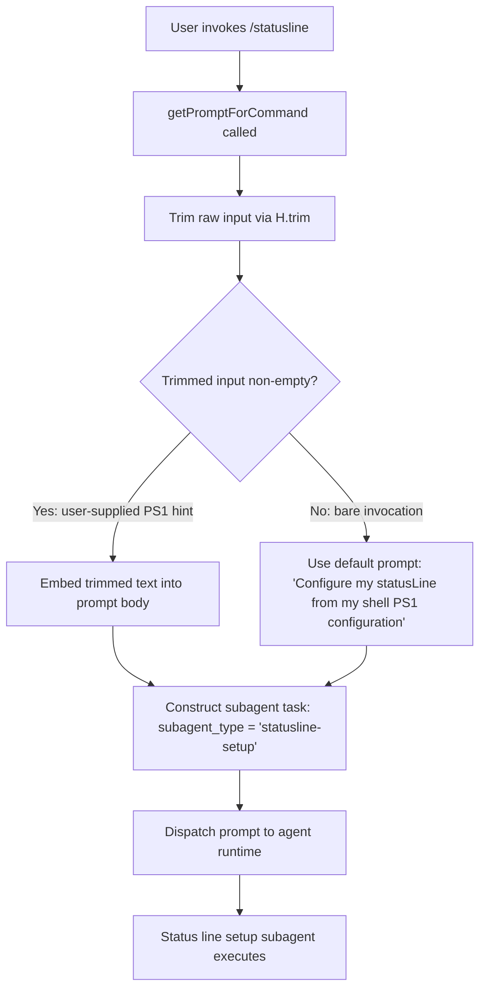

# `/statusline`

> Analysis basis: CC v2.1.163 bundle.js (AST extraction + Claude interpretation)
> Minimum version: v2.1.163

---

## Overview

`/statusline` is a `prompt`-type slash command that configures Claude Code's terminal status line UI by dispatching a subagent task of type `"statusline-setup"`. When invoked, the command constructs a prompt instructing the agent to read the user's existing shell PS1 configuration and mirror or adapt it into Claude Code's status line format. The entire setup interaction is handled inline via the `getPromptForCommand` handler method.

---

## Registration

| Field | Value |
|---|---|
| type | `prompt` |
| name | `statusline` |
| description | `Set up Claude Code's status line UI` |
| aliases | `[]` (none) |
| handler_method | `getPromptForCommand` |
| handler_method_start (loc_byte) | `12710846` |
| handler_method_end (loc_byte) | `12711054` |
| loc_byte | `12710541` |
| loc_byte_end | `12711055` |
| loc_line | `9080` |
| prompt_body.length | `76` characters |
| prompt_body.trace | `inline template` |
| prompt_body.summary | Creates a subagent with type `"statusline-setup"` and a prompt derived from the user's shell PS1 configuration (see Behavioral Spec) |
| arbor_handler.name | `getPromptForCommand` |
| arbor_handler.kind | `Method` |
| arbor_handler.fqn | `claude-2.1.163::getPromptForCommand` |
| arbor_handler.resolution_path | `direct` |
| arbor_handler.n_hits | `1` |
| `handler_method_start` | `12710846` |
| `handler_method_end` | `12711054` |

Analysis basis: CC v2.1.163 bundle.js:+12710541

---

## Input Branching

The command's handler performs two sequential operations before constructing the prompt: it reads the raw user input (if any) and trims whitespace. The resulting flow has two distinguishable branches — whether the user supplied additional text (a custom shell PS1 string) or invoked the command bare.



Analysis basis: CC v2.1.163 bundle.js:+12710846 (handler start), +12710881 (H.trim call), +12710891 (default prompt literal), +12710962 (text field)

---

## Behavioral Spec

### Handler Entry — `getPromptForCommand`

The Arbor-resolved handler `getPromptForCommand` is an ObjectMethod defined directly on the registration object (resolution path: `direct`, n_hits: 1). It acts as the sole entry point for this command.

```
function getPromptForCommand(rawInput):
    trimmedInput = trim(rawInput)

    if trimmedInput is non-empty:
        userHint = trimmedInput
    else:
        userHint = "Configure my statusLine from my shell PS1 configuration"

    promptText = buildSubagentPrompt(
        subagent_type = "statusline-setup",
        prompt        = userHint
    )

    return { type: "text", body: promptText }
```

Analysis basis: CC v2.1.163 bundle.js:+12710852 (getPromptForCommand call edge), +12710881 (trim call), +12710891 (default literal), +12710962 (type: "text" literal)

---

### Prompt Body Construction

The prompt body is an inline template string of length 76 characters (short, single-purpose). It creates a subagent invocation carrying the `"statusline-setup"` subagent type and embeds the user's prompt text. The trace confirms this is built entirely inside the handler without a separate module load.

```
function buildSubagentPrompt(subagent_type, prompt):
    return template(
        "Create a [subagent] with subagent_type {subagent_type} and the prompt {prompt}"
    )
    // total rendered length: ~76 chars for the bare invocation case
```

Analysis basis: CC v2.1.163 bundle.js:+12710846–12711054 (handler_method byte range), prompt_body.length = 76, prompt_body.trace = "inline template"

---

### Input Processing Pipeline (`v` and downstream)

After the prompt is constructed by `getPromptForCommand`, it passes through the shared prompt command pipeline (entry point: obfuscated function `v`, referenced from `H`). This pipeline performs several transformations before agent dispatch:

```
function promptPipeline(promptText, context):
    // 1. Debug-mode check
    if context.logLevel == "debug":
        logDebug(promptText)                    // literal "debug" at +206051

    // 2. Membership / include-check on prompt text
    if promptText.includes(marker):
        applySpecialHandling(promptText)

    // 3. Normalize to uppercase where required
    normalized = promptText.toUpperCase()       // +206177

    // 4. Path manipulation for working directory context
    workingPath = extractPath(promptText)       // J4 sub-routine: replace, lastIndexOf, slice

    // 5. Write to status buffer
    writeStatusBuffer(workingPath)              // ppH → h2A → H.write

    // 6. Invoke statusline writer (icK)
    writeStatuslineFile(context, workingPath)   // see sub-section below

    // 7. Register hook (j9)
    registerHook()                              // j9 → MXA.register
```

Analysis basis: CC v2.1.163 bundle.js:+206051 ("debug"), +206115 (H.includes), +206177 (toUpperCase), +206197 (J4), +206222 (ppH), +206236 (icK), +205926 (j9)

---

### Status Line File Writer (`icK`)

The statusline writer is responsible for persisting the computed status line content to disk. It coordinates directory creation, file append, rotation/rename, and byte-length gating.

```
function writeStatuslineFile(context, content):
    targetDir  = path.dirname(statuslineFilePath)   // KHH.dirname at +205596
    filePath   = path.join(targetDir, fileName)     // r2A → KHH.join at +205248

    // Byte-length guard
    byteLen = Buffer.byteLength(content)            // +205771
    if byteLen exceeds threshold:
        rotateFile(filePath)                        // i2A: stat → endsWith(".txt") → rename / unlink

    // Ensure directory exists
    ensureDir(targetDir)                            // ncK → Zy.mkdir at +205317

    // Append content
    appendToFile(filePath, content)                 // ncK → Zy.appendFile at +205376

    // Schedule deferred flush
    scheduleFlush(content)                          // $pH: clearTimeout → setTimeout → setImmediate
```

Analysis basis: CC v2.1.163 bundle.js:+205563 ($pH), +205588 (d3H), +205596 (KHH.dirname), +205771 (Buffer.byteLength), +205804 (a2A), +205317 (Zy.mkdir), +205376 (Zy.appendFile)

---

### File Rotation Sub-routine (`i2A`)

```
function rotateIfNeeded(filePath):
    stats = fs.stat(filePath)                   // Zy.stat at +204917
    if filePath.endsWith(".txt"):               // +205010
        truncatedPath = filePath.slice(0, -4)   // +205032, constant 4 at +205043
        fs.rename(filePath, truncatedPath)      // Zy.rename at +205073
    else:
        fs.unlink(filePath)                     // Zy.unlink at +205113
```

Analysis basis: CC v2.1.163 bundle.js:+204917, +205010, +205021 (".txt"), +205043 (4), +205073, +205113

---

### Deferred Write Scheduler (`$pH`)

The scheduler uses a debounce-like pattern with both `setTimeout` and `setImmediate` to coalesce rapid successive status line updates.

```
function scheduleFlush(content):
    clearTimeout(pendingTimer)                  // +59737
    pendingBuffer.push(content)                 // $.push at +59936

    pendingTimer = setTimeout(function():
        flushLines = pendingBuffer.join(sep)    // $.join at +59811
        writeLines(flushLines)                  // H call at +59778
        pendingBuffer = []

        setImmediate(function():
            finalLines = deferredBuffer.join(sep)   // J.join at +60034
            deferredBuffer.push(content)            // L.push at +60085
        )
    , DEBOUNCE_DELAY)
```

Debounce constants found in the implementation scope: `1000` ms (bundle.js:+59625) and `100` (bundle.js:+59646).

Analysis basis: CC v2.1.163 bundle.js:+59625, +59646, +59737, +59811, +59901, +59936, +59994, +60034

---

### Bootstrap / Fetch Context (`H` → `v` preamble)

The outer handler `H` performs a lightweight bootstrap fetch before delegating to the prompt pipeline. This fetch is logged with the literal `"[Bootstrap] Fetching"` and uses `Content-Type: application/json`.

```
function bootstrapFetch(url):
    log("[Bootstrap] Fetching", url)            // +15724218
    response = fetch(url, {
        headers: {
            "Content-Type":  "application/json",    // +15724303, +15724318
            "User-Agent":    userAgentString         // +15724337
        },
        timeout: 5000                               // +15724419
    })

    on success:
        log("[Bootstrap] Fetch ok")                 // +15724592
    on parse failure:
        emitTelemetry("api_bootstrap_fetch", {
            status: "parse_failed"                  // +15724540, +15724562
        })
```

Analysis basis: CC v2.1.163 bundle.js:+15724218, +15724303, +15724337, +15724419, +15724540, +15724562, +15724592

---

### Hook Registration (`j9`)

After the statusline file is written, a hook is registered via the module-level hook registry.

```
function registerStatuslineHook():
    hookRegistry.register(statuslineHookDescriptor)     // MXA.register at +60323
```

Analysis basis: CC v2.1.163 bundle.js:+205926 (j9 call from icK), +60323 (MXA.register)

---

### Path / Model Context Utilities

The call graph traversal reaches several model-resolution helpers (`Aq`, `NE`, `wI`, `NQH`, `kX1`, `gM`) that normalise API provider and model name strings before embedding them into request context. Key literals found in their scope:

- Model tier keywords: `"opusplan"` (+2243249), `"sonnet"` (+2243290), `"haiku"` (+2243329), `"opus"` (+2243368), `"best"` (+2243405)
- Provider tags: `"firstParty"` (+2239457), `"anthropicAws"` (+2097366), `"gateway"` (+2097386), `"mantle"` (+2240098), `"anthropic."` (+2237210)
- Tier window: `"[1m]"` (+2243275)

These utilities are shared infrastructure, not specific to `/statusline`, but they appear in the depth-2 traversal because the prompt dispatch path resolves the active model before sending the subagent task.

Analysis basis: CC v2.1.163 bundle.js:+2243153 (Aq entry), +2239425 (NE), +2239622 (wI), +2097331 (gM)

---

## State & Side Effects

| Item | Detail |
|---|---|
| Telemetry | `tengu_feature_sad` fired from `s6 → c` path (bundle.js:+1010365) — appears to be a shared error/sad-path event, not statusline-specific |
| Telemetry (bootstrap) | `api_bootstrap_fetch` with property `parse_failed` on JSON parse error (bundle.js:+15724540) |
| File system writes | `Zy.appendFile` to statusline output file; `Zy.mkdir` ensures parent directory; `Zy.rename` / `Zy.unlink` for rotation |
| Hook registration | `MXA.register` called after write — registers a statusline update hook in the global hook registry (bundle.js:+60323) |
| Deferred writes | `setTimeout` (1000 ms / 100 ms debounce constants) + `setImmediate` coalesce rapid updates before flushing |
| appState changes | Statusline content written to disk path derived from app state's config directory (icK reads config path via `Q6` / `aL6`) |
| Sound | None detected in depth-2 traversal |
| Subagent dispatch | Creates a subagent of type `"statusline-setup"` carrying the user's PS1 hint or the default prompt |

---

## Version History

| Version | Change |
|---|---|
| v2.1.163 | Initial analysis |

---

## Common Mistakes

1. **Invoking `/statusline` expecting instant UI changes** — the command dispatches a subagent (`"statusline-setup"`) which runs asynchronously; the status line is updated only after the subagent completes its file write and the hook fires.
2. **Assuming free-form text input is required** — the command works bare (no arguments); user-supplied text is treated as an optional PS1 configuration hint passed through to the subagent prompt.
3. **Confusing the debounce timers** — if `/statusline` is invoked in rapid succession (e.g. from a script), the 1000 ms debounce (`+59625`) means only the last update in each burst reaches the file; intermediate writes are coalesced.
4. **Editing the statusline output file directly** — the file writer includes a rotation step (`Zy.rename` / `Zy.unlink`) triggered by byte-length threshold; manual edits may be overwritten or renamed on the next invocation.
5. **Expecting the command to read `$PS1` automatically without a shell context** — the default prompt literal (`"Configure my statusLine from my shell PS1 configuration"`, bundle.js:+12710891) is an instruction to the subagent, not a live shell variable read; the subagent must be able to access shell configuration through available tools.

---

## Appendix — Identifier Mapping

> For bundle debugging only. Identifiers change across versions.

| Identifier | Role |
|---|---|
| `__handler_statusline` | Synthetic BFS entry point for the `/statusline` command handler (not a real bundle symbol) |
| `H` | Outer bootstrap/fetch wrapper; entry point into prompt pipeline from command handler |
| `v` | Core prompt processing function; applies debug check, include test, uppercase normalisation, path extraction, buffer write, and statusline file write |
| `ccK` | Shared utility called from `v`; delegates to `Vy`, `dcK`, `OXA` |
| `OXA` | Sub-utility of `ccK`; calls `lgK` and `ngK` |
| `SH` | JSON serialisation helper; wraps `JSON.stringify` |
| `J4` | Path/string manipulation helper: replace, lastIndexOf, slice on working directory string |
| `g2A` | Maps over `BcK` array; likely formats path segments |
| `q` | File-system helper used for `unlinkSync` (sync unlink of temp files) |
| `A` | String normalisation helper; applies `toLowerCase` |
| `ppH` | Status buffer write dispatcher; delegates to `h2A` |
| `h2A` | Low-level write helper; calls `H.write` |
| `icK` | Statusline file writer; coordinates mkdir, appendFile, byte-length check, rotation, deferred flush, and hook registration |
| `$pH` | Debounced/deferred write scheduler; uses `clearTimeout`, `setTimeout`, `setImmediate` |
| `d3H` | Helper called from `icK`; constructs file path via `KHH.join`; calls `a8` and `h6` |
| `Q6` | Config path accessor called from `icK` |
| `aL6` | Config directory resolver; calls `v8`; handles `EISDIR` error code |
| `r2A` | Path join helper: `KHH.join` + `h6` |
| `i2A` | File rotation helper: `Zy.stat`, endsWith `.txt`, `Zy.rename` / `Zy.unlink` |
| `ncK` | File write orchestrator: `Zy.mkdir` → `Zy.appendFile` → `aL6` → `r2A` → `i2A` → byte-length check |
| `j9` | Hook registrar; calls `MXA.register` |
| `e$` | Auxiliary called from outer `H`; role not fully resolved at depth 2 |
| `Pw_` | Input parser: split, trim, indexOf, slice on raw command input |
| `ZHH` | Set membership check; uses `g44.has` |
| `uj` | String sanitiser; applies `H.replace` |
| `t1` | Prompt composition orchestrator; calls `D6H`, `Aq`, `eX` |
| `D6H` | Prompt builder helper; calls `x0`, `IqH`, `SA`, `yd` |
| `x0` | Sub-helper of `D6H`; role not fully resolved at depth 2 |
| `IqH` | Sub-helper of `D6H`; role not fully resolved at depth 2 |
| `yd` | Prompt line processor; trims, checks prefixes, includes, applies `Bs6`, `VQH`, `IX1`, `Q1L`, `_4H`, `Aq`, `d1L` |
| `Aq` | Model/provider name normaliser; trims, lowercases, replaces; dispatches to `o0`, `_4H`, `wI`, `NQH`, `NE`, `kX1`, `gM`, `Pe6`, `vQH` |
| `o0` | Provider lookup; calls `q4H` |
| `_4H` | Provider inclusion check; tests against `H4H` array |
| `wI` | Model tier resolver; calls `gM`, `Z5` |
| `NQH` | Tier-based model selector; calls `Z5` |
| `NE` | Model name resolver; calls `gM`, `Z5`, `XA` |
| `kX1` | Model alias expander; calls `NE` |
| `gM` | API provider classifier; calls `XA`; classifies `anthropicAws`, `gateway`, `mantle`, `firstParty` |
| `Pe6` | Model tier list checker; tests against `l1L` |
| `vQH` | Model variant selector; calls `eH` |
| `eX` | Prompt extension helper; calls `Aq`, `r0` |
| `r0` | Prompt finaliser; calls `ZA`, `P6H`, `PYH`, `IQH`, `NE`, `z2`, `gM`, `XA`, `Z5`, `wI` |
| `s6` | Telemetry emitter wrapper; calls `c`, `P6` |
| `c` | Core telemetry dispatch; emits `tengu_feature_sad` on error path |
| `P6` | Telemetry transport; calls `Nu6` |
| `Nu6` | Low-level telemetry sender |

---

Note: index built via Arbor fallback; some signals (telemetry, literals) may be missing — see arbor-fallback.js.