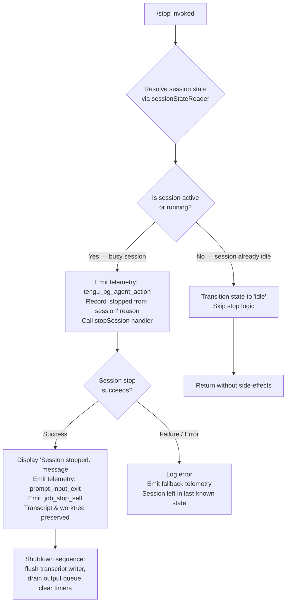

# `/stop`

> Analysis basis: CC v2.1.163 bundle.js (AST extraction + Claude interpretation)
> Minimum version: v2.1.163

---

## Overview

The `/stop` command halts the currently running background session, emitting a `stop_command` telemetry event and transitioning the session to an idle/stopped state. Crucially, it is a **non-destructive stop**: both the session transcript and any associated worktree are preserved on disk after the command completes. The command is registered as type `local-jsx` and executes immediately (`immediate: true`) without user confirmation.

---

## Registration

| Field | Value |
|---|---|
| type | `local-jsx` |
| name | `stop` |
| description | `Stop this background session; transcript and worktree are kept` |
| immediate | `true` |
| module_id | `O5K` |
| load_inline | `true` |
| loc_byte | `13074523` |
| loc_byte_end | `13074707` |
| loc_line | `9697` |
| arbor_handler.name | `JBf` |
| arbor_handler.fqn | `claude-2.1.163::JBf` |
| arbor_handler.kind | `AsyncFunction` |
| arbor_handler.resolution_path | `module_id` |
| arbor_handler.n_hits | `0` |

Analysis basis: CC v2.1.163 bundle.js:+13074523

---

## Input Branching

The `/stop` handler has four distinct behavioral branches depending on the current session state detected at invocation time:



Analysis basis: CC v2.1.163 bundle.js:+13074242 (handler entry `JBf`), +13073851 (`"stopped from session"` literal), +13073880 (`"idle"` literal), +13074024 (`"Session stopped."` literal)

---

## Behavioral Spec

### Top-Level Handler (stopCommandHandler)

Analysis basis: CC v2.1.163 bundle.js:+13074242

```
async function stopCommandHandler(context):
    emit telemetry event "tengu_bg_agent_action"     // +13073653
    call backgroundAgentActionHelper(context)        // JBf → Qb8 edge at +13074252
    call sessionShutdownOrchestrator(context)        // JBf → H edge at +13074242
```

### Background Agent Action Helper (backgroundAgentActionHelper)

Analysis basis: CC v2.1.163 bundle.js:+13073651

```
function backgroundAgentActionHelper(context):
    call reactComponentRenderer(context)             // → c
    call primaryReactPanel(context)                  // → P6 → Nu6
    call pathJoinHelper(context)                     // → W6 → Nu6
    call logPathHelper(context)                      // → h6 → uv
    set stopReason = "stop"                          // literal at +13073688
    call sessionStatusUpdater(context, stopReason)   // → jBf
    call sessionStateReader(context)                 // → Z9 → GYH

    // Check if session must be stopped from running state
    set stoppedFromSessionReason = "stopped from session"  // +13073851
    set idleStatus = "idle"                                // +13073880

    call sessionFileWatcher(context)                 // → e9
    call sessionFinalizer(context)                   // → jY → $N → FwH
    call transcriptFlusher(context)                  // → ff → MY, oj

    // Emit stop confirmation
    set confirmationMessage = "Session stopped."    // +13074024
    call displayConfirmation(confirmationMessage)    // → $9H

    emit telemetry event "job_stop_self"            // +13074055 (literal key)
    emit telemetry event "prompt_input_exit"        // +13074077

    return stopResult
```

### Session File Watcher / State Reader (sessionFileWatcher)

Analysis basis: CC v2.1.163 bundle.js:+13073792 (edge `Qb8 → e9`)

```
async function sessionFileWatcher(context):
    // Resolves session state file path via path.join  (+4159910)
    statePath = path.join(context.sessionDir, stateFile)
    results = await Promise.all([fs.stat(statePath)])   // +4160008

    // Delete transient state maps
    transientStateMap.delete(sessionId)                 // +4160162
    pendingWriteSet.delete(sessionId)                   // +4160176

    emit telemetry "tengu_bg_state_read_transient"      // +4160358

    if stat fails with "ENOENT":                        // +175606
        log warning "warn"                              // +4160304
        return { status: "unknown" }                    // +4160404

    // Read state file
    content = await fs.readFile(statePath, "utf-8")    // +4160572
    parsed = safeJsonParse(content)                    // → B6 → JSON.parse

    // Determine session status from parsed state
    // Valid status values found in literals:
    //   "done", "success", "failed", "failure", "stopped", "active"
    //   (+4166814, +4166827, +4166844, +4166859, +4166876, +4166995)
    transientStateMap.set(sessionId, parsed)           // +4160824

    if parsed.order or parsed.stateOrder present:      // +4159937, +4159958
        sort entries by order field
        return entry at highest order index

    return parsed
```

### Session Finalizer / Status Normalizer (sessionFinalizer)

Analysis basis: CC v2.1.163 bundle.js:+13073805 (edge `Qb8 → jY`)

```
function sessionFinalizer(context):
    // Delegates to $N → FwH for finalization bookkeeping
    // Checks if current state is terminal ("done","success","failed","failure","stopped")
    if sessionState in ["done","success","failed","failure","stopped"]:
        return currentState
    if sessionState == "active":
        return "active"
    return "unknown"
```

### Transcript Flusher (transcriptFlusher)

Analysis basis: CC v2.1.163 bundle.js:+13073817 (edge `Qb8 → ff`)

```
async function transcriptFlusher(context):
    // Constructs the transcript path with path.join   (+4159610)
    // Serializes current transcript state via SH (→ JSON.stringify)  +4159625
    // Delegates to MY for atomic write:
    //   1. Generate random temp filename via randomBytes (hex)    +2283564, +2283592
    //   2. fs.writeFile to temp path (utf8)                      +2283611, +2283639
    //   3. fs.rename temp → final path                           +2283665
    //   4. If NP1 set has entry: fs.copyFile                     +2283739
    //   5. If vP1 set has entry: fs.unlink old                   +2283794
    // Removes entry from transientStateMap via oj               +4159869
    // Transcript file is KEPT on disk (not deleted)
```

### Transcript File Rotation Helper (transcriptRotationHelper)

Analysis basis: CC v2.1.163 bundle.js:+205563 (`icK → $pH`), +205588 (`icK → d3H`)

```
function transcriptRotationHelper(transcriptPath):
    clearTimeout(existingTimer)                  // +59737
    batchedLines = $.join(separator)             // +59811
    pendingLines = L.join(separator)             // +59855
    scheduleWrite via setTimeout (1000 ms)       // +59625, +1000 literal
    push to pending queue via $.push             // +59936
    setImmediate for flush                       // +59994
    joinedOutput = J.join(separator)             // +60034
    L.push(newLine)                              // +60085

    // Path construction for transcript directory
    transcriptDir = path.dirname(transcriptPath) // +205596
    rotatedPath = buildRotatedPath(transcriptPath)  // → r2A → KHH.join, h6
    statResult = fs.stat(transcriptPath)            // → i2A → Zy.stat +204917

    if transcriptPath.endsWith(".txt"):          // +205010, ".txt" literal +205021
        slicedPath = transcriptPath.slice(0, -4) // numeric 4 at +205043
        renamedPath = slicedPath + suffix
        await fs.rename(transcriptPath, renamedPath)  // +205073
    else:
        await fs.unlink(transcriptPath)          // +205113

    // Ensure output directory exists
    await fs.mkdir(transcriptDir, {recursive:true})  // → ncK → Zy.mkdir +205317
    await fs.appendFile(finalPath, content)           // +205376

    byteLength = Buffer.byteLength(content)      // +205771
```

### Session Shutdown Orchestrator (sessionShutdownOrchestrator)

Analysis basis: CC v2.1.163 bundle.js:+15724216 (edge `H → v`) and +15724254 (`H → _A.get`)

```
async function sessionShutdownOrchestrator(context):
    // Log bootstrap-style debug message "[Bootstrap] Fetching"  +15724218
    // Set Content-Type: application/json                        +15724303, +15724318
    // Set User-Agent header                                     +15724337

    sessionRecord = sessionMap.get(sessionId)     // → _A.get +15724254
    call sessionTokenParser(sessionId)            // → Pw_ +15724358
    call sessionSetMembershipCheck(sessionId)     // → ZHH → g44.has +15724389
    call sessionIdSanitizer(sessionId)            // → uj → H.replace +15724401
    call inputParserPipeline(input)               // → t1 +15724404
    call remoteConfigBootstrap(context)           // → J45 +15724428

    // Timeout for API calls: 5000 ms             +5000 literal at +15724419

    // Session-end event emitted with "session_end" key  +5448163

    call apiBootstrapFetcher(context)             // → s6 +15724537
    // Emit telemetry "api_bootstrap_fetch" / "parse_failed" / "[Bootstrap] Fetch ok"
    //   +15724540, +15724562, +15724592
```

### Main Shutdown Runner (mainShutdownRunner)

Analysis basis: CC v2.1.163 bundle.js:+5447669 (entry `M9`)

```
async function mainShutdownRunner(context):
    resolveImmediately = Promise.resolve()           // +5447669
    call terminalOutputRenderer()                    // → v7
    call shutdownSupervisor(context)                 // → K → L.map

    setTimeout(shutdownCallback, 2000)               // +5447720, 2000 ms +2000 literal
    call inkUnmountHelper()                          // → JyH → H.unmount +5445299
    call consoleOutputFinalizer()                    // → LS_ → AfH.writeSync

    // Grace period before forced kill: 3500 ms     +3500 literal +5447773
    timerRef.unref()                                 // +5447782

    call outputQueueDrainer()                        // → OpH → MXA.drain +60366
    winner = await Promise.race([...])               // +5447886

    // Collect all settled shutdown tasks
    await gatherShutdownResults()                    // → gZ9 → Promise.allSettled +13256225

    // Create AbortSignal with timeout             +5448051
    abortSignal = AbortSignal.timeout(timeout)

    // Emit "session_end" telemetry                 +5448163
    emit tengu_cache_eviction_hint                  // +5448125

    call startupProfileReporter()                   // → j76 → OWA, pc8
    call scrollSummaryEmitter()                     // → mO8 → tengu_scroll_summary +5447055
    call appStateManager()                          // → M1 (local-agent mode +3439749)

    // Write final output sync
    fs.writeSync(outputFd, finalContent)            // → AfH.writeSync +5448233

    clearTimeout(gracePeriodTimer)                  // +5447963
    setTimeout(forceKill, 500)                      // 500 ms +5447344

    call processShutdown()                          // → fS_
    // fS_ may call process.exit or process.kill("SIGKILL")  +5445886, +5445911, +5445936
```

### Process Shutdown Handler (processShutdownHandler)

Analysis basis: CC v2.1.163 bundle.js:+5445805

```
function processShutdownHandler():
    clearTimeout(exitTimer)                // +5445805
    inkInstance = inkInstanceMap.get(key)  // → t4.get +5445838
    if inkInstance:
        inkInstance.unmount()
    // Attempt graceful exit
    try:
        process.exit(code)                 // +5445886
    catch:
        process.kill(pid, "SIGKILL")       // +5445911, +5445936
    // "unreachable" path as Error guard   +5445959
```

### Input Parser Pipeline (inputParserPipeline)

Analysis basis: CC v2.1.163 bundle.js:+2239233 (entry `t1 → D6H`)

```
function inputParserPipeline(rawInput):
    // Parses model alias strings found in literals:
    //   "opusplan", "[1m]", "sonnet", "haiku", "opus", "best"
    //   +2243249, +2243275, +2243290, +2243329, +2243368, +2243405

    // Check for anthropic. prefix  +2237210
    // Validate provider type: "firstParty", "anthropicAws", "gateway", "mantle"
    //   +2239457, +2097366, +2097386, +2240098

    // Session types recognized: "bg", "daemon", "daemon-worker"
    //   +2252437, +2252447, +2252461
    normalizedInput = input.trim().toLowerCase()
    sanitized = sanitizeModelAlias(normalizedInput)
    resolvedModel = resolveModelFromAlias(sanitized)
    return resolvedModel
```

---

## State & Side Effects

| Item | Detail |
|---|---|
| Telemetry: tengu_bg_agent_action | Fired at the start of the stop handler (bundle.js:+13073653) |
| Telemetry: tengu_bg_state_read_transient | Fired when reading session state from disk (bundle.js:+4160358) |
| Telemetry: tengu_feature_ok | Fired on successful feature completion (bundle.js:+1010222) |
| Telemetry: tengu_feature_sad | Fired on feature failure path (bundle.js:+1010365) |
| Telemetry: tengu_scroll_summary | Fired during session scroll/output summary emit (bundle.js:+5447055) |
| Telemetry: tengu_cache_eviction_hint | Fired during final shutdown sequence (bundle.js:+5448125) |
| Telemetry: tengu_daemon_config_reload | Fired when daemon config is reloaded (bundle.js:+16148704) |
| Telemetry: tengu_startup_perf | Fired when startup profiling report is emitted (bundle.js:+217090) |
| Telemetry: tengu_pewter_brook | Fired during display mode detection for fullscreen (bundle.js:+3440377) |
| Literal event key: job_stop_self | String literal logged/emitted on self-stop (bundle.js:+13074055) |
| Literal event key: prompt_input_exit | String literal emitted on UI exit from prompt (bundle.js:+13074077) |
| Literal event key: stop_command | String literal used for stop command identification (bundle.js:+13074256) |
| Literal event key: session_end | String literal emitted at session teardown (bundle.js:+5448163) |
| Transcript preservation | Transcript is flushed atomically via temp-file rename then kept on disk; NOT deleted |
| Worktree | Worktree directory is preserved (per registration description and no `unlink` on worktree path in graph) |
| Session state transition | Session status moves from `"active"` → `"stopped"` (literals at +4166876, +4166995) |
| Timer management | Existing timers are cleared (`clearTimeout`) then new grace-period timers set (3500 ms, 2000 ms, 500 ms) at +5447773, +5447951, +5447344 |
| Process exit | `process.exit` or `process.kill("SIGKILL")` called as last resort in `processShutdownHandler` (bundle.js:+5445886, +5445936) |
| Transcript write interval | Internal transcript batching uses 1000 ms flush interval (bundle.js:+59625) |
| Output queue drain | `MXA.drain` called to empty output queue before process exit (bundle.js:+60366) |
| Hook registration | `MXA.register` called for hook registration (bundle.js:+60323) via `j9` |
| appState changes | `local-agent` mode configured in app state manager (bundle.js:+3439749); fullscreen detection active |
| Sound | <!-- TODO: not found in depth-2 traversal; needs --depth 4 --> |

---

## Version History

| Version | Change |
|---|---|
| v2.1.163 | Initial analysis |

---

## Common Mistakes

1. **Expecting the worktree to be deleted**: `/stop` explicitly preserves both the transcript and the worktree. To clean up a worktree, a separate command or manual deletion is required.
2. **Calling `/stop` on an already-stopped session**: If the session is already in `"idle"` or a terminal state (`"done"`, `"success"`, `"failed"`, `"failure"`, `"stopped"`), the command detects this and returns without action — no error is displayed, which can be confusing.
3. **Assuming immediate process exit**: The shutdown sequence has multiple grace-period timers (3500 ms, 2000 ms, 500 ms). The process is not immediately killed; output is flushed and the queue drained first.
4. **Confusing `/stop` with session deletion**: This command stops execution but does not remove the session record, its state file, or associated files. The session remains inspectable after `/stop`.
5. **Running `/stop` outside a background session context**: The command is scoped to background (`"bg"`) or daemon (`"daemon"`, `"daemon-worker"`) session types. Invoking it from a foreground interactive session may produce unexpected behavior not covered by this spec.

---

## Appendix — Identifier Mapping

> For bundle debugging only. Identifiers change across versions.

| Identifier | Role |
|---|---|
| `JBf` | Top-level stop command handler (AsyncFunction; arbor_handler entry point) |
| `H` | Session shutdown orchestrator / bootstrap fetch helper |
| `v` | HTTP/API request builder (sets headers like Content-Type, User-Agent) |
| `ccK` | Session context or config getter |
| `OXA` | Sub-config accessor |
| `SH` | JSON serializer wrapper |
| `J4` | Path/string formatter for session IDs |
| `g2A` | Batch-map helper over session state entries |
| `q` | Filesystem unlink / delete helper or queue object (context-dependent) |
| `A` | String lowercaser / path slicer |
| `ppH` | Transcript write dispatcher |
| `h2A` | Low-level file write helper |
| `icK` | Transcript rotation and file management orchestrator |
| `$pH` | Batched-line write scheduler (clearTimeout/setTimeout/setImmediate) |
| `d3H` | Log directory builder |
| `Q6` | Directory existence / mkdir helper |
| `aL6` | Async utility wrapper |
| `r2A` | Rotated transcript path builder |
| `i2A` | Transcript stat/rename/unlink sequencer |
| `ncK` | Transcript append-file orchestrator (mkdir + appendFile) |
| `j9` | Hook registrar (calls MXA.register) |
| `e$` | Session lookup helper |
| `Pw_` | Session token string parser (split/trim/indexOf/slice) |
| `ZHH` | Session set membership checker |
| `uj` | Session ID sanitizer (replace) |
| `t1` | Input parser pipeline entry |
| `D6H` | Model/input parser dispatcher |
| `x0` | Model alias resolver sub-helper |
| `IqH` | Input normalization helper |
| `yd` | Model string decomposer |
| `Aq` | Model alias normalizer (trim/toLowerCase/replace) |
| `o0` | Model alias sub-lookup |
| `_4H` | Model list membership checker |
| `wI` | Model type categorizer (gM + Z5) |
| `NQH` | Model name validator |
| `NE` | Model resolution helper (gM + Z5 + XA) |
| `kX1` | Alias-to-model mapper |
| `gM` | Provider type resolver |
| `Pe6` | Model list inclusion checker |
| `vQH` | Model fallback handler |
| `eX` | Extended input parser |
| `r0` | Full model resolution pipeline |
| `s6` | API bootstrap fetcher |
| `c` | React component renderer / JSX factory |
| `P6` | Primary React panel renderer |
| `Nu6` | React render root |
| `Qb8` | Background agent action helper (core stop logic) |
| `W6` | Path join helper (Nu6 route) |
| `h6` | Log path helper |
| `uv` | Low-level log writer |
| `jBf` | Session status updater |
| `Z9` | Session state reader |
| `GYH` | Session state store |
| `e9` | Session file watcher / state file reader |
| `R8` | Error code checker |
| `v8` | EISDIR / ENOENT error handler |
| `tf` | Alternate error checker |
| `B6` | Safe JSON parser |
| `jY` | Session finalizer entry |
| `$N` | Finalization delegator |
| `FwH` | Finalization bookkeeper |
| `ff` | Transcript flusher entry |
| `MY` | Atomic file writer (randomBytes + writeFile + rename) |
| `oj` | Transient state map cleaner |
| `ke6` | Auxiliary stop helper |
| `$9H` | UI confirmation message displayer ("Session stopped.") |
| `hH` | Secondary React panel renderer |
| `M9` | Main shutdown runner / process teardown orchestrator |
| `K` | Shutdown supervisor map iterator |
| `L` | Async task tracker (add/finally/delete) |
| `f` | Session connection closer (A.close + q.close) |
| `JyH` | Ink UI unmount helper |
| `YC` | Terminal cleanup helper |
| `U48` | Terminal write-sync helper (ANSI save/restore cursor) |
| `LS_` | Console output finalizer (writeSync + dim styling) |
| `qE` | Output queue accessor |
| `Kx` | Output formatter |
| `w06` | Worktree path stat helper |
| `g$` | Worktree sub-path helper |
| `CZ9` | Console string escaper |
| `fS_` | Process shutdown handler (process.exit / process.kill) |
| `OpH` | Output queue drainer (MXA.drain) |
| `Y` | Daemon config reload handler |
| `C0H` | Config change processor |
| `iLK` | Config key iterator |
| `E` | Remote control event handler |
| `T` | Supervisor controller (stop/updateConfig/start) |
| `LmK` | Heartbeat scheduler |
| `V` | Worker process controller |
| `gZ9` | Shutdown result gatherer (Promise.allSettled) |
| `j76` | Startup profiling reporter entry |
| `pc8` | Startup perf event emitter |
| `OWA` | Startup profile data formatter |
| `mO8` | Scroll summary emitter |
| `RZ9` | Scroll data accessor |
| `SZ9` | Scroll metrics calculator (Date.now / Math.max / Math.round) |
| `M1` | App state manager (local-agent mode) |
| `Z46` | App state sub-component |
| `pO8` | Parallel shutdown task runner (Promise.all / Promise.race) |
| `l8` | Abort-aware timeout helper |

---

Note: index built via Arbor fallback; some signals (telemetry, literals) may be missing — see arbor-fallback.js.