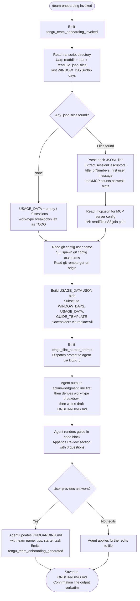

# `/team-onboarding`

> Analysis basis: CC v2.1.163 bundle.js (AST extraction + Claude interpretation)
> Minimum version: v2.1.163

---

## Overview

`/team-onboarding` is a `prompt`-type slash command that scans the invoking user's local Claude Code transcript history, derives a work-type breakdown from those sessions, and co-authors an `ONBOARDING.md` guide that new teammates can paste into Claude Code for an interactive walkthrough. The command is non-hidden, collaborative in tone, and produces a concrete draft before asking for revisions.

---

## Registration

| Field | Value |
|---|---|
| type | `prompt` |
| name | `team-onboarding` |
| description | `Help teammates ramp on Claude Code with a guide from your usage` |
| isHidden | `false` |
| handler_method | `getPromptForCommand` |
| handler_method_start | `12081472` |
| handler_method_end | `12082182` |
| loc_byte | `12081134` |
| loc_byte_end | `12082183` |
| loc_line | `8484` |
| prompt_body.length | `4539` |
| prompt_body.trace | `identifier→$ (local→1 ext vars)` |
| arbor_handler.name | `getPromptForCommand` |
| arbor_handler.kind | `Method` |
| arbor_handler.resolution_path | `direct` |
| arbor_handler.fqn | `claude-2.1.163::getPromptForCommand` |
| arbor_handler.n_hits | `2` |

Analysis basis: CC v2.1.163 bundle.js:+12081134

---

## Input Branching

The handler contains 4+ distinct branches depending on transcript availability, session count, MCP configuration, and the multi-turn review flow, so a Mermaid flowchart is used.



Analysis basis: CC v2.1.163 bundle.js:+12081472

---

## Behavioral Spec

### 1. Invocation and Telemetry Bookkeeping

On invocation the handler immediately fires `tengu_team_onboarding_invoked` before any data collection begins.

```
function handleTeamOnboarding(context):
    emit("tengu_team_onboarding_invoked")
    windowDays = 365          // literal at bundle.js:+12081721
    cutoffMs   = Date.now() - windowDays * 24 * 60 * 60 * 1000
    usageData  = collectTranscriptUsageData(cutoffMs)
    mcpConfig  = readMcpConfig()
    gitMeta    = readGitMeta()
    prompt     = buildPrompt(usageData, mcpConfig, gitMeta, windowDays)
    dispatchPromptToAgent(prompt)   // via X_6 → D6 path
```

Analysis basis: CC v2.1.163 bundle.js:+12081730 (Date.now), +12081721 (365 literal)

---

### 2. Transcript Scanning (`collectTranscriptUsageData`)

Reads `.jsonl` transcript files from the local Claude Code projects directory, limited to the configured look-back window. The function (`Uaq`) performs async parallel reads.

```
async function collectTranscriptUsageData(cutoffMs):
    transcriptDir = projectsDirectoryPath()     // Nx / nv path helpers
    entries       = await fs.readdir(transcriptDir)
    jsonlFiles    = entries.filter(e => extname(e) == ".jsonl")
    results = await Promise.all(
        jsonlFiles.map(async file =>
            stat = await fs.stat(join(transcriptDir, file))
            if not stat.isFile(): return null
            raw  = await fs.readFile(join(transcriptDir, file))
            return parseTranscriptFile(raw)
        )
    )
    return results.filter(r => r != null)
```

Key detail: only files with `.jsonl` extension (literal at bundle.js:+12070085) are processed. File-modification time is checked against `cutoffMs` (24-hour window factor: `24 * 60 * 1000` at bundle.js:+12069970–12069979).

Analysis basis: CC v2.1.163 bundle.js:+12069957 (Uaq start), +12070054 (filter), +12070104 (Promise.all)

---

### 3. Session Descriptor Extraction (inside `parseTranscriptFile`)

Each JSONL file is split into lines (10-line batch references at bundle.js:+12070481). The parser searches for:

- MCP tool invocations via `"name":"mcp__` pattern (literal at bundle.js:+12070664)
- Structured content arrays via `"content":[` pattern (literal at bundle.js:+12071014)
- First user message text
- PR numbers linked to the session
- Session title

Regex helpers `dVf`, `cVf`, `lVf` are used for structured field extraction. Lines starting with known prefixes are skipped (`D.startsWith` at bundle.js:+12071121).

```
function parseTranscriptFile(rawContent):
    lines            = rawContent.split("\n")
    sessionDescriptor = { title: null, prNumbers: [], firstUserMessage: null,
                          toolCount: 0, mcpCount: 0 }
    for line in lines:
        if line includes "\"name\":\"mcp__":
            sessionDescriptor.mcpCount += 1
        if line includes "\"content\":[":
            tryExtractFirstUserMessage(line, sessionDescriptor)
        tryExtractPrNumbers(line, sessionDescriptor)
    return sessionDescriptor
```

Analysis basis: CC v2.1.163 bundle.js:+12070455, +12070496, +12070542, +12070805, +12070861, +12071036

---

### 4. MCP Configuration Reading (`rVf`)

Reads `.mcp.json` from the workspace root (literal at bundle.js:+12072196), parses it as JSON, and extracts the `mcpServers` key (literal at bundle.js:+12072252). Falls back gracefully when the file is absent.

```
async function readMcpConfig():
    try:
        raw  = await fs.readFile(join(workspaceRoot, ".mcp.json"), "utf8")
        data = JSON.parse(raw)
        return data["mcpServers"] ?? {}
    catch:
        return {}
```

Analysis basis: CC v2.1.163 bundle.js:+12072172, +12072185, +12072219, +12072252

---

### 5. Git Metadata Reading (`S_`)

Spawns two sequential `git` subprocesses to gather identity and repository URL context. Uses `bTH` (subprocess runner) under the hood.

```
async function readGitMeta():
    userName  = await spawnGit(["config", "user.name"])
    remoteUrl = await spawnGit(["remote", "get-url", "origin"])
    return { generatedBy: userName.trim(), remoteUrl: remoteUrl.trim() }
```

Literals: `"git"`, `"config"`, `"user.name"`, `"remote"`, `"get-url"`, `"origin"` at bundle.js:+12072819–12072910.

Analysis basis: CC v2.1.163 bundle.js:+12072816 (S_ entry), +12072819 (git literal)

---

### 6. Prompt Assembly and Placeholder Substitution

The handler assembles the final prompt string by substituting three template placeholders using `_.replaceAll` (bundle.js:+12081919):

| Placeholder | Substituted With |
|---|---|
| `{{WINDOW_DAYS}}` | Numeric look-back window (365) |
| `{{USAGE_DATA}}` | JSON-serialised session descriptor array |
| `{{GUIDE_TEMPLATE}}` | Internal guide markdown template string |

The Math helpers `Math.min`, `Math.max`, `Math.floor` (bundle.js:+12081675–12081693) are used to normalise bar-chart widths (20-character ASCII bars, `█` filled, `░` empty) before injection into `{{GUIDE_TEMPLATE}}`.

```
function buildPrompt(usageData, mcpConfig, gitMeta, windowDays):
    template  = BASE_PROMPT_TEMPLATE          // 4539 chars, bundle.js:+12081134
    guideTemplate = GUIDE_TEMPLATE_STRING
    dataJson  = JSON.stringify({ sessionDescriptors: usageData,
                                 mcpServers: mcpConfig,
                                 generatedBy: gitMeta.generatedBy,
                                 currentRepo: gitMeta.remoteUrl })
    return template
        .replaceAll("{{WINDOW_DAYS}}", String(windowDays))
        .replaceAll("{{USAGE_DATA}}",  dataJson)
        .replaceAll("{{GUIDE_TEMPLATE}}", guideTemplate)
```

Analysis basis: CC v2.1.163 bundle.js:+12081919 (replaceAll), +12081932 (WINDOW_DAYS literal), +12081972 (GUIDE_TEMPLATE literal), +12082007 (USAGE_DATA literal), +12081950 (String cast)

---

### 7. Prompt Dispatch to Agent (`X_6` → `D6`)

After assembly the prompt is forwarded to the agent runtime. The call chain is:

```
dispatchPromptToAgent(prompt):
    X_6(prompt)      // flint-harbor share path, fires tengu_flint_harbor_share
        → D6(prompt) // core session dispatch
```

The dispatch also fires `tengu_flint_harbor_prompt` (bundle.js:+12081509) immediately before the agent receives the text.

Analysis basis: CC v2.1.163 bundle.js:+12082028 (X_6 call), +12081506 (D6 call), +12081509 (telemetry)

---

### 8. Agent-Side Guided Workflow (Prompt Instructions)

The prompt instructs the agent to follow a strict five-step sequence. The key behavioural constraints are:

1. **Immediate acknowledgment first** — the agent must output a specific acknowledgment line (citing `"last {{WINDOW_DAYS}} days"`) as the very first visible text, before any classification or tool calls. This is an explicit ordering constraint described in the prompt body.

2. **Work-type classification** — the agent classifies each session in `sessionDescriptors` into one of seven canonical task-type buckets: `build_feature`, `debug_fix`, `improve_quality`, `analyze_data`, `plan_design`, `prototype`, `write_docs`. The top 3–5 with percentages are selected. Display names use title-case with spaces (e.g. "Build Feature"). When ~0 sessions exist the breakdown is left as a TODO.

3. **Context gathering** — the agent resolves the team name from `currentRepo`, sibling workspace directories, and MCP server entries (`name` + `urlOrigin`). Team Tips and Get Started sections are left as TODO placeholders pending review answers.

4. **ONBOARDING.md generation** — the agent writes the file using the embedded `{{GUIDE_TEMPLATE}}` structure, filling in real numbers (not placeholders), using `generatedBy` as the author name (omitted if missing), and rendering ASCII bar charts 20 characters wide.

5. **Review loop** — after rendering the draft in a code block, the agent appends a `---` divider and `**Review**` section containing exactly three numbered questions: (a) team name confirmation, (b) starter task link, (c) team tips. On receiving answers it updates `ONBOARDING.md` and outputs the verbatim closing confirmation line. Further edits from the user are applied to the file.

Analysis basis: CC v2.1.163 bundle.js:+12081472–12082182 (handler_method body), prompt_body length 4539

---

### 9. Post-Generation Telemetry

After the agent finishes the initial guide generation the `tengu_team_onboarding_generated` event is emitted (bundle.js:+12082051). The `tengu_flint_harbor_share` event fires via the `X_6` dispatch path (bundle.js:+9808077).

---

## State & Side Effects

| Item | Detail |
|---|---|
| Telemetry (command-specific) | `tengu_team_onboarding_invoked` (bundle.js:+12081732), `tengu_team_onboarding_generated` (bundle.js:+12082051), `tengu_flint_harbor_prompt` (bundle.js:+12081509), `tengu_flint_harbor_share` (bundle.js:+9808077) |
| Telemetry (infrastructure) | `tengu_config_parse_error`, `tengu_config_lock_contention`, `tengu_config_stale_write`, `tengu_config_auth_loss_prevented`, `tengu_bg_dispatch_sigkill_escalate`, `tengu_bg_dispatch_low_mem`, `tengu_bg_spare_enable`, `tengu_bg_spare_claim`, `tengu_bg_spare_claim_fail`, `tengu_bg_retire_pinned_low_mem`, `tengu_bg_prewarm_per_sweep`, `tengu_daemon_control`, `tengu_daemon_config_reload` |
| File reads | Reads all `.jsonl` transcript files under the projects directory for the past 365 days; reads `.mcp.json` from workspace root |
| File writes | Agent writes (and subsequently updates) `ONBOARDING.md` in the current working directory |
| Subprocess spawns | Two `git` subprocess calls: `git config user.name` and `git remote get-url origin` |
| Hook registration | `j9` → `MXA.register` (bundle.js:+60323); file-watch lifecycle via `XTL` / `a98.watchFile` / `a98.unwatchFile` |
| appState changes | Session dispatch updates internal session map via `D6`; config lock path via `SX_` |
| Sound | None observed in depth-2 traversal |
| Look-back window | 365 days (literal bundle.js:+12081721) |
| ASCII bar chart width | 20 characters (`█` filled, `░` empty) |

---

## Version History

| Version | Change |
|---|---|
| v2.1.163 | Initial analysis |

---

## Common Mistakes

1. **Running the command outside a git repository** — the handler spawns `git config user.name` and `git remote get-url origin`; if these fail (no git repo, no remote named `origin`) the `generatedBy` and `currentRepo` fields will be empty or absent in the injected usage data, causing the agent to omit the author name and leave the repo field blank.

2. **Expecting an immediate draft without any transcript history** — if no `.jsonl` files are found in the projects directory (e.g. fresh install or transcripts disabled), the `sessionDescriptors` array will be empty and the work-type breakdown will be rendered as a TODO placeholder rather than real percentages.

3. **Answering the Review questions out of order** — the prompt instructs the agent to update `ONBOARDING.md` only after all three Review questions are answered. Sending partial answers in separate messages may cause the agent to write incomplete updates before receiving the full set.

4. **Misinterpreting the 365-day window as configurable** — the look-back window is hard-coded to `365` days (bundle.js:+12081721) and is not a user-settable parameter in v2.1.163.

5. **Expecting the command to push or share the file** — the command only writes `ONBOARDING.md` locally; distribution to team docs or Slack channels is left to the user, as indicated by the verbatim closing line in the prompt.

6. **Assuming `.mcp.json` is required** — the MCP config read is a best-effort operation; the command functions normally when `.mcp.json` is absent.

---

## Appendix — Identifier Mapping

> For bundle debugging only. Identifiers change across versions.

| Identifier | Role |
|---|---|
| `__handler_team-onboarding` | Synthetic BFS entry point for the command handler (not a real bundle symbol) |
| `D6` | Core session/prompt dispatch function |
| `Hj6` | Dispatch sub-helper A (called by D6) |
| `_j6` | Dispatch sub-helper B (called by D6) |
| `qu` | Dispatch sub-helper C (called by D6) |
| `Au` | Internal async utility called by qu and OX_ |
| `LC` | Lower-level async primitive called by Au |
| `B98` | Deduplication / session-registry guard |
| `OX_` | Session object factory / initialiser |
| `QNH` | Session event emitter setup (calls zh) |
| `oU` | Random-bytes / ID generator for sessions |
| `SH` | JSON serialiser wrapper |
| `BEL` | Session lifecycle helper |
| `jX_` | Post-dedup session registration handler |
| `qm1` | Post-registration helper A |
| `e_` | Post-registration helper B |
| `ni1` | Post-registration helper C |
| `ZHH` | Seen-session set membership checker |
| `S6` | Config/lock acquisition entry point |
| `Q6` | Config directory path resolver |
| `vX_` | Config validation helper |
| `bDH` | Config file reader / parser |
| `q` | Filesystem module reference (fs-like) |
| `B6` | JSON.parse wrapper |
| `vx` | String prefix-strip utility |
| `_` | General filesystem / string utility |
| `v8` | Error / status reporter |
| `fr1` | Config directory scanner / backup helper |
| `v` | Multi-purpose string formatter / logger |
| `c` | Generic context/config object |
| `RX_` | Backup path builder |
| `w` | Background session / daemon manager |
| `XTL` | File-watch lifecycle manager |
| `No` | File-watch event handler |
| `j9` | Hook registration helper (calls MXA.register) |
| `X8` | Usage-data collection orchestrator |
| `SX_` | Config save-with-lock function |
| `L` | Async lock / file-handle manager |
| `f` | File handle / stream object |
| `wP1` | Config merge utility |
| `v5_` | Config diff helper |
| `fj6` | Config field accessor |
| `A` | General collection / map object |
| `V` | Versioned collection helper |
| `P` | Editor/cursor state machine |
| `J` | Editor sub-component J |
| `j` | Worker process manager |
| `H` | Bootstrap fetch / HTTP helper |
| `z` | Daemon stop controller |
| `Y` | Supervisor config reload handler |
| `h` | Background sweep / memory pressure handler |
| `A3A` | Vim-mode operator dispatcher |
| `C` | Rate-limit event enqueuer |
| `T` | Timer / interval manager |
| `TM6` | Atomic file write helper (temp+rename) |
| `O` | File stat / symlink checker |
| `R8` | Error code classifier |
| `_lH` | Usage-data shape validator |
| `Lr1` | Session descriptor builder (Object.entries loop) |
| `t98` | Timestamp helper (Date.now wrapper) |
| `hX_` | Per-session file writer |
| `oVf` | Top-level usage-data collection coordinator |
| `X_` | Projects-path resolver |
| `uv` | Home-directory path utility |
| `Nx` | Transcript directory path builder |
| `nv` | Inner path join helper for projects dir |
| `_Y` | Path normaliser / relative-path calculator |
| `UW4` | Absolute-path distance calculator |
| `Uaq` | Transcript file reader and session extractor |
| `s1` | Error status code helper |
| `K` | Column-padding / display formatter |
| `$` | Outer context / state container (holds prompt template) |
| `TKK` | Telemetry batch emitter |
| `D` | Process exit / abort controller |
| `IJ` | Forced-shutdown signal handler |
| `rVf` | .mcp.json reader |
| `iVf` | Usage-data post-processor |
| `S_` | Git metadata reader (spawns git subprocesses) |
| `bTH` | Subprocess runner / execa wrapper |
| `pbA` | Platform-specific executable resolver |
| `ce8` | Subprocess stdout collector |
| `le8` | Subprocess stderr collector |
| `ie8` | Subprocess combined-output collector |
| `lCA` | Timeout validator |
| `VM6` | Subprocess error builder |
| `de8` | Reflect-based property accessor for subprocess |
| `TbA` | Exit-event listener setup |
| `cCA` | Subprocess timeout race wrapper |
| `nCA` | Kill-on-timeout handler |
| `QCA` | Subprocess output event binder |
| `dCA` | Force-kill handler |
| `GbA` | Subprocess stream aggregator |
| `kM6` | Subprocess result finaliser |
| `PbA` | Pipe setup helper |
| `WbA` | Execa default options merger |
| `aCA` | Stream data-event binder |
| `SG4` | String coercion helper for subprocess output |
| `K$` | Subprocess kill-signal sender |
| `kH` | Logging / error-reporting utility |
| `HA` | Error string formatter |
| `eH` | String coercion for log messages |
| `Dq` | Log routing / dispatch |
| `HW4` | Ring-buffer log appender |
| `pTH` | Git URL parser (extracts host, path, owner) |
| `LE4` | URL component extractor |
| `Q1` | String slice utility for URL parsing |
| `X_6` | Flint-harbor share dispatcher (fires tengu_flint_harbor_share) |
| `WZ` | Inner share helper (calls n1) |

---

Note: index built via Arbor fallback; some signals (telemetry, literals) may be missing — see arbor-fallback.js.