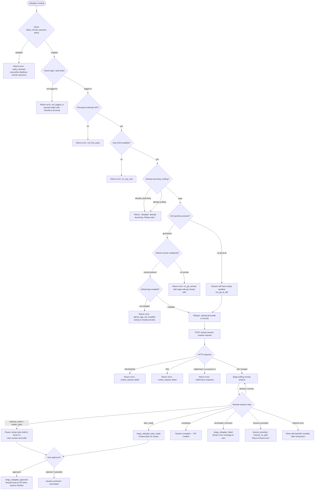

# `/ultraplan`

> Analysis basis: CC v2.1.163 bundle.js (AST extraction + Claude interpretation)
> Minimum version: v2.1.163

---

## Overview

`/ultraplan` launches a remote Claude Code web session that drafts an editable implementation plan for a given prompt. It teleports the local repository state to Anthropic's cloud infrastructure, runs an autonomous planning agent there, then streams the resulting plan back to the local CLI for the user to review, edit, and approve before any code is executed. Results from the approved plan are delivered as a pull request when the remote session finishes.

---

## Registration

| Field | Value |
|---|---|
| type | `local-jsx` |
| name | `ultraplan` |
| description | `Draft an editable plan in Claude Code on the web ( ... ) · See ...` |
| argumentHint | `<prompt>` |
| load_inline | `true` |
| load_ident | `EIf` |
| loc_byte | `12213850` |
| loc_byte_end | `12214082` |
| loc_line | `8606` |
| arbor_handler.name | `EIf` |
| arbor_handler.fqn | `claude-2.1.163::EIf` |
| arbor_handler.kind | `AsyncFunction` |
| arbor_handler.resolution_path | `load_ident` |
| arbor_handler.n_hits | `1` |

Analysis basis: CC v2.1.163 bundle.js:+12213850

---

## Input Branching

The handler has well over three distinct execution paths (eligibility failures, guard states, remote session lifecycle branches, plan-ready vs. needs-input vs. timeout, etc.), so a Mermaid flowchart is used.



Analysis basis: CC v2.1.163 bundle.js:+12211990, +12212008, +12209229, +12209488, +12209506, +12209553, +12210948

---

## Behavioral Spec

### 1. Handler Entry — `handlerMain` (`EIf`)

```
async function handlerMain(commandInput, appState):
    prompt = commandInput.args        # free-text after "/ultraplan"
    invocationKind = "slash"          # literal at +12212136

    # Check appState for "allow_remote_sessions" setting
    if not appState.allow_remote_sessions:
        return error("policy_blocked")

    # Detect "ultraplan" keyword anywhere in prompt (case-insensitive, gi flag)
    # Used for implicit invocation path — see eligibilityChecker
    normalizedPrompt = normalizePromptKeyword(prompt)   # calls SN8 at +12211990

    # Resolve auth + org identity
    authContext = resolveAuthContext()                   # calls W9 at +12212008

    # Get or create environment selection
    envContext = getEnvironmentContext()                 # calls H at +12212043

    # If all guards pass, start session orchestration
    result = await launchOrchestration(normalizedPrompt, authContext, envContext)
    appState.setAppState(result)                        # _.setAppState at +12212547
```

Analysis basis: CC v2.1.163 bundle.js:+12211990, +12212043, +12212325, +12212547

---

### 2. Prompt Keyword Normalizer — `normalizePromptKeyword` (`SN8`)

```
function normalizePromptKeyword(rawPrompt):
    # Strip leading slash-command token if prompt begins with "ultraplan"
    # H.startsWith check at +9926662; literal "ultraplan" at +9927412
    if rawPrompt.startsWith("ultraplan"):
        rawPrompt = rawPrompt.slice(relevantOffset)    # H.slice at +9927640

    # Collapse whitespace / clean up punctuation
    cleaned = rawPrompt.replace(pattern, "$1$2")       # A.replace at +9927711, literal "$1$2" at +9927737
    # Limit token depth to 5 significant segments      # literal 5 at +9927760
    return cleaned
```

Analysis basis: CC v2.1.163 bundle.js:+9927412, +9927640, +9927711, +9927737, +9927760

---

### 3. Auth & Policy Guard — `resolveAuthContext` (`W9`)

```
function resolveAuthContext():
    # Tier-based policy sets: vBL (blocked set), IBL (allowed set)
    if vBL.has(currentProvider):                       # +4178289
        return error("policy_blocked")

    # Check account type (firstParty / enterprise / team)
    accountType = classifyAccount()                    # calls EC at +4178304; literals at +4177771, +4178044, +4178079

    if IBL.has(currentProvider):                       # +4178321
        # Requires allow_product_feedback setting
        if not setting("allow_product_feedback"):      # literal at +4178345
            return error("policy_blocked")

    # Read config file (utf-8)                          # literal at +4178152
    configData = readFileSync(configPath, "utf-8")     # XX6 → dL9.readFileSync at +4178129

    # Validate telemetry preference
    telemetryMode = getTelemetryMode()                 # q7H at +4178651
    # Modes: "essential-traffic", "no-telemetry", "default", "yes", "on"
    # literals at +1014267, +1014326, +1014400, +27104, +27110

    return { accountType, telemetryMode, configData }
```

Analysis basis: CC v2.1.163 bundle.js:+4178289, +4178304, +4178321, +4178345, +4178129

---

### 4. Remote Eligibility Check — `checkRemoteEligibility` (`dzq`)

```
async function checkRemoteEligibility(authContext):
    # Emits telemetry: tengu_ccr_bundle_seed_enabled at +9120777
    # Emits telemetry: bg_remote_eligibility_check literal at +9120374

    if not authContext.isLoggedIn:
        return { ok: false, code: "not_logged_in",
                 message: "Please run /login and sign in with your Claude.ai account (not Console)." }
        # literals at +9122232, +9122254

    if not isInGitRepo():
        return { ok: false, code: "not_in_git_repo" }   # literal at +9122333

    remoteUrl = getGitRemoteUrl()
    if not remoteUrl:
        return { ok: false, code: "no_git_remote",
                 message: "Background tasks require a GitHub remote. Add one with `git remote add origin REPO_URL`." }
        # literals at +9122471, +9122493

    if not githubAppInstalled():
        return { ok: false, code: "github_app_not_installed" }   # literal at +9122588

    if policyBlocked():
        return { ok: false, code: "policy_blocked",
                 message: "Remote sessions are disabled by your organization's policy..." }
        # literals at +9122742, +9122765

    return { ok: true }
```

Analysis basis: CC v2.1.163 bundle.js:+9120374, +9122232, +9122333, +9122471, +9122588, +9122742

---

### 5. Launch Orchestration — `launchOrchestration` (`FS6`)

```
async function launchOrchestration(prompt, authContext, envContext):
    # Guard: deduplicate concurrent launches
    if pollingSetHas("already_polling"):               # literal at +12209488
        return early_return
    if launchingSetHas("already_launching"):           # literal at +12209506
        return message("ultraplan: already launching. Please wait for the session to start.")
        # literal at +12208093

    # Validate prompt is non-empty; show usage hint if missing
    # "Usage: /ultraplan \<prompt\>, or include \"ultraplan\" anywhere"  at +12209553
    # "in your prompt"  at +12209619
    if not prompt:
        return showUsage()

    # Register in-progress guard with finally-cleanup
    addToLaunchingSet()                                # L → q.add at +16139269; L → f.finally at +16139278

    # Run eligibility pre-flight
    eligibility = await checkRemoteEligibility(authContext)
    if not eligibility.ok:
        emit("tengu_ultraplan_create_failed", { code: eligibility.code })   # +12209266
        return error(eligibility.message)

    # Select cloud environment
    env = await selectOrCreateEnvironment(envContext)  # calls GIf at +12209756

    # Upload repository state
    bundleResult = await uploadRepoBundle()            # calls WR8 → PR8 at +12209642

    # Create remote session via POST
    session = await createRemoteSession(prompt, env, bundleResult)

    # Begin polling loop
    return await pollAndStream(session)
```

Analysis basis: CC v2.1.163 bundle.js:+12209229, +12209264, +12209306, +12209488, +12209506, +12209529, +12209642, +12209696, +12209756, +12209863

---

### 6. Environment Selection — `selectOrCreateEnvironment` (`GIf`)

```
async function selectOrCreateEnvironment(envContext):
    # Emit "precondition" phase marker            # literal at +12210081

    # List available teleport environments        # calls T2H → dzq at +12209998
    environments = await listTeleportEnvironments()

    # Attempt to find or auto-create a default cloud environment
    # Teleport env type: "task-notification"      # literal at +12210258

    defaultEnv = environments.find(e => e.isDefault)
    if not defaultEnv:
        defaultEnv = await autoCreateDefaultCloudEnv()
        # On failure: warn "Could not create a cloud environment. Set one up at
        #   https://claude.ai/code/onboarding?magic=env-setup"  at +9050814

    if environments is empty:
        return error("no_environments",
                     "No environments available for session creation")   # literals at +9051952, +9051835

    # Run GitHub preflight check (unless byoc_env_skip_preflight)
    preflightResult = await runGithubPreflight()     # calls CRH at +12211054

    # Generate branch name + task title            # calls Wn7 at +9052503
    branch = await generateBranchName(prompt)
    # Title prefix: "claude/task"                  # literal at +9035612
    # Branch title max length: 75 chars            # literal at +9035606

    # Upload repository bundle                     # calls Wn → Sl_ at teleport bundle phase
    bundleUpload = await uploadGitBundle()

    emit("tengu_ultraplan_launched")               # +12210948

    return { env: defaultEnv, branch, bundleUpload }
```

Analysis basis: CC v2.1.163 bundle.js:+12210081, +12210258, +12210313, +12210321, +12210346, +12210948, +9051835, +9051952

---

### 7. Remote Session Polling — `pollAndStream` (`JIf`)

```
async function pollAndStream(session):
    emit("tengu_ultraplan_timeout_seconds")        # +12204862
    # Maximum poll timeout: 5400 seconds           # literal at +12204896
    # Poll interval: 1000 ms min, 1800000 ms max   # literals at +9128823, +9128830

    startTime = Date.now()

    loop:
        state = await pollRemoteSession(session.id)   # calls Hv → task status watchers

        switch state.status:
            case "starting":
            case "running":
                continue polling

            case "requires_action":
            case "needs_input":
                # Present draft plan to user
                planText = extractPlanText(state)     # calls jIf → wIf at +12205150
                # Prepend marker: "Here is a draft plan to refine:"   # literal at +12205203
                emit("tengu_ultraplan_awaiting_input")  # +12205506
                userResponse = await awaitUserInput(planText)
                if userResponse.approved:
                    emit("tengu_ultraplan_approved")    # +12205982
                    # "Results will land as a pull request..."  # literal at +12206472
                    return approvedResult()
                else:
                    archiveSession(session.id)
                    return cancelled()

            case "plan_ready":
                emit("tengu_ultraplan_plan_ready")     # +12205574
                planText = extractPlanText(state)
                return presentPlan(planText)

            case "completed":
                return completedResult(state)

            case "terminated":
            case "archived":
                emit("tengu_ultraplan_failed")         # +12206859
                # "Remote Ultraplan session failed..."  # literal at +12207270
                return error(state.errorMessage)

            case "requires_action" (timeout):
                elapsed = (Date.now() - startTime) / 60000
                # "timeout_pending" / "timeout_no_plan"  literals at +12197265, +12197283
                return error("Timed out after N minutes")

        if networkError and retriesExhausted:
            # "Lost connection to the remote session after repeated retries..."  # literal at +12196220
            return error("network_or_unknown")
```

Analysis basis: CC v2.1.163 bundle.js:+12204862, +12204896, +12205203, +12205506, +12205574, +12205982, +12206472, +12206859, +12207270, +12196220, +12197265, +12197283, +9128823, +9128830

---

### 8. Git Bundle Upload — `uploadGitBundle` (`Sl_`)

```
async function uploadGitBundle():
    emit("tengu_ccr_bundle_upload")               # +9032552
    # Phase marker: "teleport_git_bundle_upload"  # literal at +9032259

    if not isInGitRepo():
        return error("Not in a git repository")   # literal at +9032320

    # Check for any commits
    refs = git("for-each-ref", "--count=1", "refs/")   # literals at +9032462, +9032477, +9032489
    if refs is empty:
        return error("Repository has no commits yet")  # literal at +9032670

    # Create git stash bundle
    stashRef = git("stash", "create")             # literals at +9032748, +9032756
    # Write to: ccr-seed.bundle / _source_seed.bundle   # literals at +9033555, +9033862

    # Upload bundle via API (HTTP 200 expected)   # literal at +9033076
    response = postBundleToAPI(bundleFile)

    # Determine bundle mode: head / fallback_head / squashed / fallback_squashed
    # literals at +9034232, +9034271, +9034306, +9034349
    mode = determineBundleMode(response)

    # Clean up temp files via _86.unlink          # +9034507
    cleanup(bundleFile)

    emit("tengu_ccr_bundle_upload", { status: "success", mode })   # literal at +9034163
    return { mode, uploadRef: response.ref }
```

Analysis basis: CC v2.1.163 bundle.js:+9032259, +9032320, +9032552, +9032670, +9032748, +9033076, +9034163, +9034507

---

### 9. Remote Session Creation — `createRemoteSession` (`Wn`)

```
async function createRemoteSession(prompt, env, bundleResult):
    # Phase logging: "[teleport] phase: POST-sent"   # literal at +9055536
    # Phase 2 (literal 2 at +9055528)

    # Apply anthropic-beta header: "ccr-byoc-2025-07-29"   # literal at +9048532
    # Apply x-organization-uuid header                       # literal at +9048554
    # API version: "2023-06-01"                              # literal at +9048515 area → +3202361

    payload = buildSessionPayload(prompt, env, bundleResult)
    # Source label selection: "bundle" / "git_repository" / "explicit_env_bundle"
    # literals at +9048901, +9049093, +9049040

    response = await _A.post(sessionEndpoint, payload)    # _A.post at +9049802

    switch response.status:
        case 201:                                          # literal at +9049894
            sessionId = response.data.id
            if not sessionId:
                return error("malformed_response",
                             "Server returned a malformed session response (no session id)")
                # literal at +9050348, +9050411
            return { sessionId }
        case 401: case 403: case 429:                     # literals at +9049965, +9049969, +9049973
            return error("create_request_failed")         # literal at +9050195
        case 500:                                         # literal at +9049856
            return error("create_request_failed")
        default:
            if response.data includes "github_repo_access_denied":   # literal at +9050017
                return error("github_repo_access_denied")
```

Analysis basis: CC v2.1.163 bundle.js:+9048532, +9048554, +9049802, +9049856, +9049894, +9049965, +9050017, +9050195, +9050348, +9050411, +9055536

---

### 10. GitHub App Pre-flight Check — `runGithubPreflight` (`CRH`)

```
async function runGithubPreflight():
    # Generate random token via mMK.randomBytes (8 bytes)   # Wk at +9127142, literal 8 at +13255668

    # Check if remote_agent is already running              # literal at +9127145, +9127253
    existingAgent = checkRunningAgent()

    # Record start time for elapsed tracking
    startTime = Date.now()                                  # +9127405

    # Compute session link                                  # sn7 at +9127465
    sessionLink = buildSessionLink()

    # Start polling preflight status                        # izq at +9127667
    result = await pollPreflightStatus(startTime)
    # Poll interval: 1000 ms                                # literal at +9128823
    # Max wait: 1800000 ms (30 min)                         # literal at +9128830

    return result
```

Analysis basis: CC v2.1.163 bundle.js:+9127142, +9127145, +9127253, +9127405, +9127465, +9127667, +9128823, +9128830

---

### 11. Orphaned Session Cleanup

On handler entry, if a prior session was detected as orphaned or stale, the handler attempts to archive it:

```
function archiveOrphanedSession(sessionId):
    try:
        archiveRemoteSession(sessionId)
    catch err:
        log("ultraplan: failed to archive orphaned session")   # literal at +12211675
        # suppress and continue
```

Analysis basis: CC v2.1.163 bundle.js:+12211675

---

### 12. Unexpected Error Catch-all

```
function handleUnexpectedError(err):
    emit("tengu_ultraplan_create_failed", { code: "unexpected_error" })
    # literal "unexpected_error" at +12211368
    # literal 1500 ms cooldown before unblocking at +12211297
    await sleep(1500)
    return message("Ultraplan hit an unexpected error during launch. Wait for the user's next instructions.")
    # literal at +12211527
```

Analysis basis: CC v2.1.163 bundle.js:+12211297, +12211368, +12211527

---

## State & Side Effects

| Item | Detail |
|---|---|
| Telemetry: `tengu_ultraplan_create_failed` | Fired when pre-flight or creation fails; carries `code` field (bundle.js:+12209266) |
| Telemetry: `tengu_ultraplan_prompt_identifier` | Fired at session creation with prompt fingerprint (bundle.js:+12205029) |
| Telemetry: `tengu_ultraplan_launched` | Fired after environment selected and session creation request sent (bundle.js:+12210948) |
| Telemetry: `tengu_ultraplan_timeout_seconds` | Fired at poll start; records configured timeout (bundle.js:+12204862) |
| Telemetry: `tengu_ultraplan_awaiting_input` | Fired when remote session pauses for user plan approval (bundle.js:+12205506) |
| Telemetry: `tengu_ultraplan_plan_ready` | Fired when plan draft is available (bundle.js:+12205574) |
| Telemetry: `tengu_ultraplan_approved` | Fired when user approves the plan (bundle.js:+12205982) |
| Telemetry: `tengu_ultraplan_failed` | Fired when remote session terminates with error (bundle.js:+12206859) |
| Telemetry: `tengu_ccr_bundle_seed_enabled` | Fired during eligibility check (bundle.js:+9120777) |
| Telemetry: `tengu_ccr_bundle_upload` | Fired during git bundle upload phase (bundle.js:+9032552) |
| Telemetry: `tengu_teleport_bundle_mode` | Records which bundle mode was selected (bundle.js:+9048936) |
| Telemetry: `tengu_ccr_session_link` | Records the session link (bundle.js:+9042484) |
| Telemetry: `tengu_teleport_source_decision` | Records which source type was used (bundle.js:+9054398) |
| Telemetry: `tengu_config_parse_error` | Fired on config file parse failure (bundle.js:+3262482) |
| Telemetry: `tengu_bg_dispatch_sigkill_escalate` | Fired if background daemon requires SIGKILL escalation (bundle.js:+16133292) |
| Telemetry: `tengu_feature_bad` / `tengu_feature_ok` | Feature gate checks during session creation (bundle.js:+1010284, +1010222) |
| Telemetry: `tengu_bg_low_mem_mb` / `tengu_bg_dispatch_low_mem` | Memory pressure monitoring during background dispatch (bundle.js:+13015224, +16133893) |
| Telemetry: `tengu_bg_spare_enable` / `tengu_bg_spare_claim` / `tengu_bg_spare_claim_fail` | Daemon spare-worker lifecycle events (bundle.js:+16134597, +16134725, +16134991) |
| Telemetry: `tengu_bg_sendclaim_failed` | Daemon claim handoff failure (bundle.js:+16113022) |
| Telemetry: `tengu_bg_adopt_sock_unlinked` | Daemon socket adoption cleanup (bundle.js:+13488833) |
| Telemetry: `tengu_teleport_generate_title` | Fired when AI generates branch/task title (literal at +9035910) |
| appState changes | `_.getAppState` read at +12212325; `_.setAppState` write at +12212547 |
| Guard set registration | Launching/polling guard sets manipulated via `L` (add/finally/delete) at +16139269, +16139278, +16139292 |
| Git side effects | Temporary git stash created (`refs/seed/stash`, `refs/seed/root`) and removed; temp `.bundle` files unlinked via `_86.unlink` at +9034507 |
| Network | `_A.post` (Axios) for session creation at +9049802; `_A.get` for polling at +8997581; `_A.isCancel` at +9057463; `_A.isAxiosError` at +9000113 |
| Browser / web | `B66 → Ye.open` opens claude.ai URL on GitHub app installation flow at +13254528 |
| Filesystem | Config read via `readFileSync`; git bundle written to temp path and deleted after upload |
| Timeout | Poll maximum: 5400 seconds (bundle.js:+12204896); Session timeout marker: 30 minutes (literal "remote session exceeded 30 minutes" at +9131472); 60000 ms per-minute boundary at +12197042 |
| Error cooldown | 1500 ms sleep before unblocking on unexpected error (bundle.js:+12211297) |

---

## Version History

| Version | Change |
|---|---|
| v2.1.163 | Initial analysis |

---

## Common Mistakes

1. **Invoking without a Claude.ai login**: `/ultraplan` requires a Claude.ai account OAuth token, not an API key. Running it with only an API key set will return the `not_logged_in` error and instruct the user to run `/login`.

2. **Missing GitHub remote**: The command requires `git remote add origin <REPO_URL>` before it can teleport repository state. Running it in a git repository with no configured remote yields `no_git_remote`.

3. **GitHub App not installed on the repository**: Even with a remote, the Anthropic GitHub App must be installed on the target repo. The error `github_app_not_installed` is shown with a link to `claude.ai/code` for setup.

4. **Running in a repository with no commits**: A bare-initialized repository (`git init` only) will fail with "Repository has no commits yet — run `git add . && git commit -m "initial"` then retry".

5. **Triggering while a session is already launching**: The command is guarded against concurrent launches. Issuing `/ultraplan` a second time while the first is still launching returns the `already_launching` guard message instead of starting a second session.

6. **Expecting immediate code execution**: `/ultraplan` is a *planning* command. Code changes are not applied locally — approved plans result in a pull request created by the remote session, not direct file edits.

7. **Organization policy blocking remote sessions**: Enterprise or team accounts may have `allow_remote_sessions` disabled. The user must contact their org admin to enable remote sessions.

---

## Appendix — Identifier Mapping

> For bundle debugging only. Identifiers change across versions.

| Identifier | Role |
|---|---|
| `EIf` | Main async handler for `/ultraplan` (handlerMain) |
| `SN8` | Prompt keyword normalizer — strips "ultraplan" prefix and cleans whitespace |
| `hN8` | Inner helper called by normalizer |
| `so_` | String scan helper; checks startsWith / matchAll for keyword detection |
| `W9` | Auth and policy guard resolver (resolveAuthContext) |
| `lL9` | Auth sub-resolver called by W9 |
| `WIH` | Auth config reader |
| `EC` | Account classifier (firstParty / enterprise / team) |
| `XX6` | Config file reader (readFileSync, utf-8) |
| `q7H` | Telemetry/privacy-mode checker |
| `Dq` | Network mode resolver |
| `RSA` | Network mode classifier |
| `eH` | String/error utility |
| `e4H` | Error wrapper helper |
| `C5H` | App-state accessor helper |
| `FS6` | Launch orchestration outer function |
| `L` | Guard-set manager (add/finally/delete for in-progress tracking) |
| `ytq` | Usage-hint renderer |
| `WR8` | Bundle upload coordinator |
| `PR8` | Bundle upload inner driver |
| `D6` | Daemon worker context utility |
| `YIf` | Upload result handler |
| `GIf` | Environment selection and session creation coordinator |
| `T2H` | Environment listing wrapper |
| `dzq` | Remote eligibility checker (checkRemoteEligibility) |
| `jIf` | Plan text extractor / formatter |
| `wIf` | Plan text inner assembler |
| `Wn` | Remote session creator and teleport orchestrator (createRemoteSession) |
| `b6` | Base utility (used in multiple sub-paths) |
| `Z7` | XA-based URL resolver |
| `S3` | Path/string helper |
| `ul_` | Utility: n1/eH/vU calls (string ops) |
| `kH` | Error logger with HA/eH/Dq chain |
| `mx` | S6/n1/BV/fYH group — session metadata builder |
| `U1` | Environment URL validator (local/staging/prod) |
| `gj` | Axios request header builder (anthropic-version etc.) |
| `Sl_` | Git bundle upload implementation (teleport_git_bundle_upload) |
| `h6` | Utility wrapper (uv calls) |
| `v` | Log-level / theme helper (debug/warn/etc.) |
| `P6` | Nu6-based promise utility |
| `bR` | Git remote URL resolver (remote.origin.url) |
| `Ozq` | UUID + push-set helper (randomUUID) |
| `pN6` | Poll payload builder |
| `SH` | JSON.stringify wrapper |
| `$zq` | Session link builder |
| `LT8` | Polling state accumulator |
| `_t` | Environment listing API caller (teleport_environments_list) |
| `a66` | Default cloud environment auto-creator (teleport_default_environment_create) |
| `EH` | String coercion utility |
| `$` | Array/collection utilities (map, find, findLast, some) |
| `Wn7` | Branch name + task title generator (teleport_generate_title) |
| `wh` | Worker health checker |
| `ERH` | GitHub App installation checker (checkGithubAppInstalled) |
| `ov` | Default branch resolver (symbolic-ref, main/master) |
| `t1` | Timer/timing utility |
| `CHH` | Remote URL parser (https/http, remote.origin.url) |
| `s` | MCP update / pending-state applicator |
| `HA` | Error-to-string converter |
| `jz` | Cancel detection helper |
| `BO` | Abort-signal propagator |
| `iw` | Claude.ai base URL resolver (local/staging/prod) |
| `k_` | Module initializer |
| `jv_` | URL path builder (lP6/VrL) |
| `PIf` | Boolean guard for environment availability |
| `CRH` | GitHub preflight runner (runGithubPreflight) |
| `Wk` | Random-bytes token generator |
| `B66` | Browser open helper (Ye.open for GitHub app install) |
| `o2` | Timestamp/duration helper |
| `sn7` | Session link builder helper |
| `izq` | Preflight / session status poller |
| `Hv` | Task status watcher / event stream processor |
| `l8f` | Task-started event handler |
| `d8f` | Task-updated event handler |
| `n8f` | Task-retained event handler |
| `i8f` | Task-iteration event handler |
| `p1H` | Task status state-machine (user_typed / active / aborted states) |
| `JIf` | Poll-and-stream main loop (pollAndStream) |
| `Etq` | Session poll result ingester |
| `OIf` | D6-based session lookup |
| `WIf` | Plan text inner render |
| `_v6` | Session file cleanup (FfA / zL.unlink) |
| `K` | Column formatter (L.map / f.padEnd) |
| `pm` | Post-session API poster |
| `j9` | Hook registrar (MXA.register) |
| `XIf` | Post-launch hook handler |
| `S6` | Config loader and watcher (bDH / XTL) |
| `Q6` | Config path resolver |
| `vX_` | Config value extractor |
| `bDH` | Config file reader with backup support |
| `B6` | JSON.parse wrapper |
| `vx` | Prefix-strip helper (startsWith/slice) |
| `v8` | Config value serializer |
| `fr1` | Config directory reader (readdirStringSync) |
| `RX_` | Config join/path builder |
| `w` | Background daemon session manager |
| `l8` | Process kill with timeout utility |
| `RH` | Session result-ok reporter (tengu_feature_ok) |
| `hH` | Session result-bad reporter (tengu_feature_bad) |
| `Nb8` | Memory check helper (macos / 1024 MB threshold) |
| `zX6` | Background session CLAUDE config reader |
| `g` | Process lifecycle manager (spawn/kill/retire) |
| `EDA` | Daemon connection establisher (JB8.connect) |
| `IDA` | Daemon worker lifecycle manager |
| `D` | Forced-shutdown handler (process.exit) |
| `XTL` | Config file watcher (a98.watchFile / unwatchFile) |
| `No` | Watcher cleanup helper |
| `_96` | Parallel pre-launch checker (Promise.all over bR/wh/F4/b6/eH/ERH) |