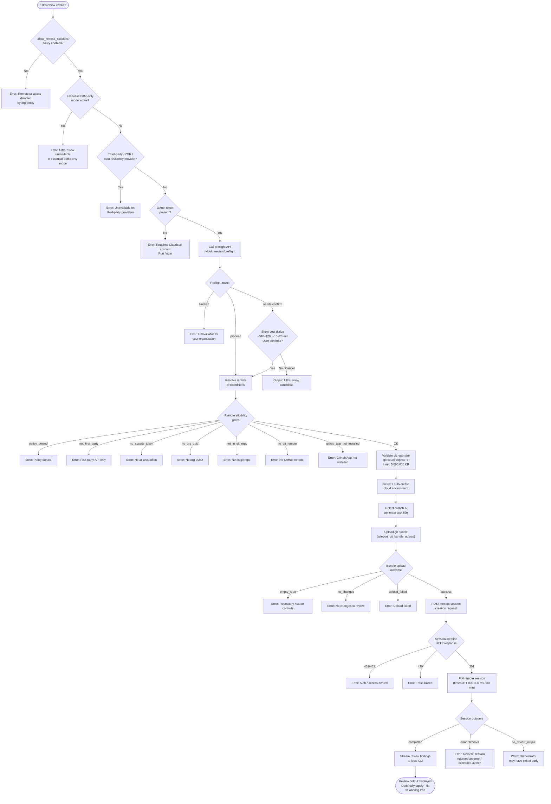

# `/ultrareview`

> Analysis basis: CC v2.1.163 bundle.js (AST extraction + Claude interpretation)
> Minimum version: v2.1.163

---

## Overview

`/ultrareview` launches a cloud-hosted agent on Claude Code for the web that performs deep bug-finding and verification across your current Git branch. The command runs through several sequential gates — policy checks, preflight API validation, org/auth verification, and cost-confirmation — before dispatching a remote session that uploads a Git bundle, executes an AI review workflow, and streams results back to the local CLI. It is estimated to cost roughly $10–$20 USD per run and takes approximately 10–20 minutes.

---

## Registration

| Field | Value |
|---|---|
| type | `local-jsx` |
| name | `ultrareview` |
| description | `"Start a cloud agent that finds and verifies bugs in your branch ( … , … USD) · Runs in Claude Code on the web. See …"` |
| loc_byte | `12225372` |
| loc_byte_end | `12225642` |
| loc_line | `8631` |
| module_id | `xtq` |
| load_inline | `true` |
| arbor_handler.name | `uIf` |
| arbor_handler.fqn | `claude-2.1.163::uIf` |
| arbor_handler.kind | `AsyncFunction` |
| arbor_handler.resolution_path | `module_id` |
| arbor_handler.n_hits | `1` |

Analysis basis: CC v2.1.163 bundle.js:+12225372

---

## Input Branching

The command has more than three distinct decision branches (policy block, essential-traffic-only mode, third-party provider, unauthenticated, preflight API results, org eligibility, cost overage confirmation, session launch outcome), so a Mermaid flowchart is used.



Analysis basis: CC v2.1.163 bundle.js:+12223027 (handler entry `uIf`), +12183541 (preflight status branch), +12183895 (essential-traffic message), +12184042 (third-party message), +12188638 (org-unavailable message), +12183055 (cost estimate), +12183147 (time estimate), +9047590 (policy_denied message), +9047707 (not_first_party message), +9047851 (no_access_token message), +9048179 (no_org_uuid message), +9131472 (timeout message)

---

## Behavioral Spec

### 1. Entry Point and Policy Gate

The handler `uIf` (an `AsyncFunction` resolved via `module_id → xtq`) is called when the user invokes `/ultrareview`.

```
async function ultrareviewHandler(args, context):
    // Gate 1: organisation policy
    if not remoteSessionsAllowed(context):
        display("Remote sessions are disabled by your organization's policy. ...")
        return

    // Gate 2: overage / budget check (telemetry: tengu_review_overage_blocked)
    if overageLimitReached(context):
        emit telemetry(tengu_review_overage_blocked)
        display overage error
        return

    // Proceed to preflight
    runPreflightAndLaunch(args, context)
```

Analysis basis: CC v2.1.163 bundle.js:+12223027, +12223030 (`allow_remote_sessions` literal), +12223062 (policy error message), +12223362 (`tengu_review_overage_blocked`)

---

### 2. Preflight Check (`wtq` / `xqA`)

Before any session is created the command calls the Anthropic cloud API for a preflight verdict.

```
async function runPreflight(context):
    // Determine bughunter config (telemetry: tengu_review_bughunter_config)
    config = getBughunterConfig(context)   // → GxH

    // Check essential-traffic-only mode
    if isEssentialTrafficOnlyMode(context):
        emit telemetry(...)
        return error("essential-traffic-only")   // message at +12183895

    // Check third-party / ZDR / data-residency provider
    providerKind = getProviderKind(context)
    if providerKind in ["zdr", "data-residency"]:
        return error("Ultrareview ... unavailable on third-party providers.")  // +12184042

    // Check OAuth token
    if not hasOAuthToken(context):
        return error("Ultrareview requires a Claude.ai account. Run /login ...")  // +12184175

    // Call /v1/ultrareview/preflight
    response = await apiGet("/v1/ultrareview/preflight")   // +12183765
    if response.status == "blocked":
        return error("Ultrareview is unavailable for your organization.")  // +12188638
    if response.status == "needs-confirm":
        return { action: "confirm", costEstimate: "$10-$20", timeEstimate: "~10–20 min" }
    if response.status == "proceed":
        return { action: "proceed" }
```

Cost estimate literal: `"$10-$20"` (bundle.js:+12183055)
Time estimate literal: `"~10–20 min"` (bundle.js:+12183147)
Preflight endpoint literal: `"/v1/ultrareview/preflight"` (bundle.js:+12183765)
Telemetry event: `tengu_review_bughunter_config` (bundle.js:+12182938)
Telemetry event: `api_ultrareview_preflight` (bundle.js:+12184386)

---

### 3. Overage Dialog and Confirmation (`uIf` branching)

When the preflight returns `"needs-confirm"`, an interactive cost/time dialog is presented. Telemetry is emitted whether or not the user confirms.

```
function handlePreflightNeedsConfirm(preflightResult):
    emit telemetry(tengu_review_overage_dialog_shown)   // +12223699
    showCostConfirmationDialog(
        cost  = "$10-$20",
        time  = "~10–20 min",
        action = "confirm" | "cancel"
    )
    if userCancelled:
        display("Ultrareview cancelled.")   // +12224006
        return
    // else fall through to remote precondition checks
```

Analysis basis: CC v2.1.163 bundle.js:+12223699, +12188733 (`"confirm"` literal), +12188800 (`"needs-confirm"` literal), +12224006

---

### 4. Remote Precondition Checks (`bqA`)

`bqA` is the main pre-launch eligibility validator. It runs a series of sequential checks, each capable of short-circuiting with a telemetry event.

```
async function checkRemotePreconditions(context):
    emit telemetry(tengu_review_remote_precondition_failed)  // on any failure

    // 4a. Verify git repository
    isGitRepo = await runGit(["rev-parse", "--is-inside-work-tree"])  // +8999249
    if not isGitRepo:
        return fail("not_in_git_repo")   // +9120841

    // 4b. Verify git remote URL (expects GitHub)
    remoteUrl = await getRemoteUrl()     // git config --get remote.origin.url  // +1109192
    if not remoteUrl:
        return fail("no_git_remote")     // +9120934

    // 4c. Check repository object count against size limit
    objectStats = await runGit(["count-objects", "-v"])  // +9029260
    repoSizeKB  = parseObjectCount(objectStats)
    if repoSizeKB > 5_000_000:           // +9029701
        emit telemetry(tengu_ccr_bundle_max_bytes)
        return fail("too_large")

    // 4d. Determine default branch and current branch
    defaultBranch  = await resolveDefaultBranch()   // symbolic-ref / show-ref  // +1120442
    currentBranch  = await runGit(["branch", "--abbrev-ref", "HEAD"])  // +1120270

    // 4e. Compute merge-base and diff stat
    mergeBase = await runGit(["merge-base", currentBranch, defaultBranch])  // +12187137
    diffStat  = await runGit(["diff", "--shortstat", mergeBase])  // +12187644
    if no changes in diff:
        return fail("no_changes")  // +9054076

    // 4f. Check GitHub App installation
    appInstalled = await checkGithubAppInstalled(context)  // ERH  // +8999363
    if not appInstalled:
        return fail("github_app_not_installed")  // +9121030

    return OK
```

Telemetry: `tengu_review_remote_precondition_failed` (bundle.js:+12185428)
Analysis basis: CC v2.1.163 bundle.js:+12185413 (`MT8`/`bqA`), +9029251 (`fzq`), +9029701 (size limit)

---

### 5. Git Bundle Upload (`Sl_` / teleport)

Once all preconditions pass, the local repository is packed as a git bundle and uploaded to the Anthropic cloud.

```
async function uploadGitBundle(context):
    emit telemetry(tengu_ccr_bundle_upload)   // +9032552

    // Stash any uncommitted work temporarily
    stashRef = await runGit(["stash", "create"])   // +9032748

    // Determine bundle strategy: head | fallback_head | squashed | fallback_squashed
    bundleMode = determineBundleMode(stashRef)
    emit telemetry(tengu_teleport_bundle_mode)   // +9048936

    // Write bundle file: "<name>-ccr-seed.bundle"   // +9033555
    bundlePath = writeBundleFile(bundleMode)

    // POST bundle to cloud storage endpoint
    response = await httpPost(uploadUrl, bundleFile)
    if response.status != 200:
        emit telemetry with outcome = "upload_failed"  // +9034011
        return fail
    emit telemetry with outcome = "success"  // +9034163

    // Cleanup temp bundle file
    fs.unlink(bundlePath)   // _86.unlink  // +9034507
```

Analysis basis: CC v2.1.163 bundle.js:+9032230 (`Sl_`), +9033555 (bundle name), +9033566 (`.bundle` extension), +9034163 (`"success"`)

---

### 6. Remote Session Creation and Polling (`uqA` / `Wn` / `CRH` / `izq`)

After the bundle upload, a remote session is created via HTTP POST and then polled until completion or timeout.

```
async function createAndPollRemoteSession(bundleInfo, context):
    // Validate access token and org UUID
    validateAccessTokenAndOrg(context)   // Wn gates

    // Generate a session title using the AI title generator (Wn7)
    taskTitle = await generateTaskTitle(description)   // teleport_generate_title // +9035910

    // Construct session creation payload with source type
    payload = buildSessionPayload(
        sourceType    = bundleInfo.sourceType,   // "bundle" | "git_repository" | "explicit_env_bundle"
        orgUuid       = orgUuid,
        anthropicBeta = "ccr-byoc-2025-07-29",  // +9048532
        title         = taskTitle
    )

    // POST to session endpoint
    response = await httpPost(sessionCreationUrl, payload)
    if response.status in [401, 403]:
        return fail("github_repo_access_denied")  // +9050017
    if response.status == 429:
        return fail("create_request_failed")
    if response.status != 201:
        return fail("create_request_failed")  // +9050195
    sessionId = extractSessionId(response)
    if not sessionId:
        return fail("malformed_response")  // +9050411

    // Emit session link telemetry
    emit telemetry(tengu_ccr_session_link)  // +9042484

    // Poll for session completion
    deadline    = Date.now() + 1_800_000   // 30 min timeout  // +9128830
    while Date.now() < deadline:
        sessionState = await pollSessionState(sessionId)   // izq
        if sessionState.status == "completed":
            result = extractReviewResult(sessionState)
            return success(result)
        if sessionState.status in ["error", "archived"]:
            return fail("remote session returned an error")  // +9131431
        if exceededDeadline:
            return fail("remote session exceeded 30 minutes")  // +9131472
        await sleep(pollingInterval)

    // If no review output in completed session
    if result is empty:
        warn("no review output — orchestrator may have exited early")  // +9131509
```

Timeout constant: 1,800,000 ms = 30 minutes (bundle.js:+9128830)
Telemetry events: `tengu_review_remote_launched` (bundle.js:+12191807), `tengu_review_remote_teleport_failed` (bundle.js:+12191284)
Analysis basis: CC v2.1.163 bundle.js:+9122107 (`T2H`/`dzq`), +9127142 (`CRH`), +9127667 (`izq`)

---

### 7. Result Delivery and `--fix` Application (`xIf` / `bIf`)

When the remote session completes, findings are streamed back to the local CLI. If the `--fix` flag was passed, the fix instructions are applied to the local working tree.

```
function deliverReviewResults(sessionResult, flags):
    // Map result messages to local display format
    messages = sessionResult.messages.map(formatForDisplay)   // bIf

    // If --fix flag was present, apply patches to working tree
    if flags.includes("--fix"):
        // " The user passed --fix: when the findings arrive, apply them..."  // +12222765
        applyFindingsToWorkingTree(messages)

    // Display all findings in CLI
    for message in messages:
        displayToUser(message)
```

Analysis basis: CC v2.1.163 bundle.js:+12222474 (`uqA`), +12222538 (`bIf`), +12222765 (`--fix` instruction literal), +12222366 (`bIf` map)

---

### 8. `--fix` / `--comment` Argument Parsing (`jR8` / `Xtq`)

The command accepts optional subcommand flags; `Xtq` dispatches the legacy `/code-review ultra` alias check and `jR8` normalises raw argument text.

```
function parseUltrareviewArgs(rawArgs):
    trimmed = rawArgs.trim()
    parts   = trimmed.split(whitespace)

    flags = new Set()
    for part in parts:
        normalised = normaliseFlag(part)   // WV: H.replace
        if normalised == "fix":
            flags.add("fix")   // +12185296
        if normalised == "comment":
            flags.add("comment")   // +12185302

    // Detect legacy alias invocation: "/code-review ultra"  // +12185381
    if Xtq.has(legacyAlias):
        routeToUltrareview(flags)

    return flags
```

Analysis basis: CC v2.1.163 bundle.js:+12185289 (`jR8`), +12185296 (`"fix"`), +12185302 (`"comment"`), +12185381 (`"/code-review ultra"`)

---

## State & Side Effects

| Item | Detail |
|---|---|
| Telemetry — `tengu_review_bughunter_config` | Emitted at bughunter config resolution (bundle.js:+12182938) |
| Telemetry — `tengu_review_remote_precondition_failed` | Emitted when any pre-launch gate fails (bundle.js:+12185428) |
| Telemetry — `tengu_review_overage_blocked` | Emitted when org budget/overage limit is hit (bundle.js:+12223362) |
| Telemetry — `tengu_review_overage_dialog_shown` | Emitted when the cost-confirmation dialog is shown (bundle.js:+12223699) |
| Telemetry — `tengu_ccr_bundle_max_bytes` | Emitted when repo object count exceeds size limit (bundle.js:+9029175) |
| Telemetry — `tengu_ccr_bundle_seed_enabled` | Emitted when seed-bundle optimisation path is taken (bundle.js:+9120777) |
| Telemetry — `tengu_ccr_bundle_upload` | Emitted on each bundle upload attempt (bundle.js:+9032552) |
| Telemetry — `tengu_teleport_bundle_mode` | Emitted to record which bundle strategy was chosen (bundle.js:+9048936) |
| Telemetry — `tengu_ccr_session_link` | Emitted after a session ID is received (bundle.js:+9042484) |
| Telemetry — `tengu_teleport_source_decision` | Emitted to record the resolved code-source type (bundle.js:+9054398) |
| Telemetry — `tengu_review_remote_teleport_failed` | Emitted when the teleport/launch pipeline fails (bundle.js:+12191284) |
| Telemetry — `tengu_review_remote_launched` | Emitted on successful session launch (bundle.js:+12191807) |
| Telemetry — `tengu_feature_ok` / `tengu_feature_sad` | Generic feature-level success/failure events (bundle.js:+1010222, +1010365) |
| Network I/O | `GET /v1/ultrareview/preflight` (preflight check); `POST` to session creation endpoint; `GET` polling endpoint; bundle file upload |
| Filesystem | Temporary `.bundle` file written and deleted (e.g. `*-ccr-seed.bundle`, `_source_seed.bundle`) (bundle.js:+9033555, +9033862) |
| git operations | `rev-parse`, `count-objects -v`, `config --get remote.origin.url`, `symbolic-ref`, `branch --abbrev-ref`, `merge-base`, `diff --shortstat`, `stash create`, `for-each-ref`, `update-ref`, `stash drop` |
| appState changes | Session added to remote-sessions registry; MCP update path (`applyMcpUpdate`) called for result delivery |
| Policy guard | Reads `allow_remote_sessions` from org policy (bundle.js:+12223030); reads `allow_product_feedback` (bundle.js:+4178345) |
| Auth requirement | Requires Claude.ai OAuth token (not API key) (bundle.js:+12184175); uses `x-organization-uuid` header (bundle.js:+9048554); `anthropic-beta: ccr-byoc-2025-07-29` header (bundle.js:+9048532) |
| Cost | Approximately `$10–$20` USD per run (bundle.js:+12183055) |
| Duration | Approximately `~10–20 min` (bundle.js:+12183147); hard timeout 30 min / 1,800,000 ms (bundle.js:+9128830) |

---

## Version History

| Version | Change |
|---|---|
| v2.1.163 | Initial analysis |

---

## Common Mistakes

1. **Using an API key instead of a Claude.ai account.** `/ultrareview` requires OAuth authentication. Running `/login` with a Claude.ai (not Console) account is mandatory. API key–only setups receive the error "Ultrareview requires a Claude.ai account."
2. **No GitHub remote configured.** The command requires `git remote add origin <REPO_URL>` pointing to a GitHub repository. Non-GitHub remotes (GitLab, Bitbucket, bare SSH, etc.) will fail the precondition gate with `no_git_remote` or `github_app_not_installed`.
3. **GitHub App not installed.** Even with a valid remote URL, the Anthropic GitHub App must be installed on the repository's organisation/account. Without it the command halts at the `github_app_not_installed` stage.
4. **Running inside an organisation with remote sessions disabled.** If your organisation admin has not enabled `allow_remote_sessions`, the command will immediately error out. Contact your org admin.
5. **Running in essential-traffic-only mode.** Enterprise environments with `essential-traffic-only` proxy restrictions block the cloud session entirely; the command detects this and exits with an informative message.
6. **Invoking on a branch with no diverging changes.** If `git diff --shortstat <merge-base>` returns nothing, the command will fail with a `no_changes` precondition error.
7. **Repository too large.** Repositories whose `git count-objects -v` report exceeds 5,000,000 KB will be rejected before any upload is attempted.
8. **Third-party or data-residency API providers.** `/ultrareview` only works on the first-party Anthropic API. ZDR, data-residency, and third-party gateway providers are explicitly blocked.

---

## Appendix — Identifier Mapping

> For bundle debugging only. Identifiers change across versions.

| Identifier | Role |
|---|---|
| `uIf` | Main handler (`AsyncFunction`) for `/ultrareview`; top-level entry point |
| `W9` | Remote-session eligibility gate / initial guard checks |
| `lL9` | Inner eligibility helper called by `W9` |
| `WIH` | Org/plan feature-access checker |
| `EC` | Plan-type resolver (reads `firstParty`, `enterprise`, `team` flags) |
| `XX6` | File-system config reader (`readFileSync`, UTF-8) |
| `q7H` | Account-flag checker (array `.some`, `_.includes`) |
| `Dq` | Telemetry dispatch helper |
| `RSA` | Telemetry payload builder |
| `eH` | String coercion / error-message formatter |
| `e4H` | Secondary string-error formatter |
| `H` | Bootstrap / API fetch helper (fetches config JSON with `Content-Type: application/json`) |
| `v` | HTTP request helper (debug logging, header assembly) |
| `ccK` | HTTP client factory |
| `OXA` | Logger / output handler |
| `SH` | JSON serialiser wrapper |
| `J4` | URL / path manipulation helper |
| `g2A` | Path-segment mapper |
| `ppH` | Output writer (`h2A` → `H.write`) |
| `h2A` | Low-level write helper |
| `icK` | Transcript / log-file manager (mkdir, appendFile, rename, unlink) |
| `$pH` | Async queue / batched-output flusher (`setTimeout`, `setImmediate`) |
| `d3H` | Log-file path builder |
| `aL6` | Filesystem stat / error classifier |
| `r2A` | Log-file path resolver (`path.join`) |
| `i2A` | Log-file rotation / rename helper |
| `ncK` | Log-file append worker |
| `j9` | Hook registration (`MXA.register`) |
| `Pw_` | Argument string parser (split, trim, indexOf, slice) |
| `ZHH` | Capability / feature-flag set checker (`g44.has`) |
| `uj` | Text sanitiser (`H.replace`) |
| `t1` | Model / provider resolver |
| `D6H` | Provider-config dispatcher |
| `yd` | Model-name normaliser (trim, map, startsWith, includes) |
| `Aq` | Model-alias resolver (opusplan, sonnet, haiku, opus, best) |
| `o0` | Model lookup (`q4H`) |
| `_4H` | Model-inclusion checker (`H4H.includes`) |
| `wI` | Model-config builder (`gM`, `Z5`) |
| `NQH` | Nested model-config builder |
| `NE` | Model-config assembler (`gM`, `Z5`, `XA`) |
| `kX1` | Model-config entry constructor |
| `gM` | Provider-URL assembler |
| `Pe6` | Model-list membership checker (`l1L.includes`) |
| `vQH` | Model-error formatter |
| `eX` | Model-resolution coordinator |
| `r0` | Provider-config aggregator |
| `s6` | UI helper / component renderer |
| `c` | Core React/JSX component factory |
| `P6` | UI primitive wrapper |
| `Nu6` | UI base node creator |
| `Xtq` | Legacy-alias dispatcher (`/code-review ultra` redirect) |
| `jR8` | Argument tokeniser (trim, split, replace, Set) |
| `L` | Async-task lifecycle manager (add, delete, finally) |
| `f` | Background task handle (close, finally) |
| `WV` | Flag-text normaliser (`H.replace`) |
| `K` | Column-formatter / output padder |
| `M` | MCP server-state manager |
| `AbH` | MCP connection setup worker |
| `tU8` | MCP connection result applier (`applyMcpUpdate`) |
| `$` | MCP state accessor (`TKK`) |
| `VYA` | MCP remote-server retry coordinator |
| `bqA` | Remote precondition checker (main eligibility pipeline) |
| `MT8` | Git work-tree verifier (`rev-parse --is-inside-work-tree`) |
| `b6` | Async-store / context getter (`bd6`) |
| `bd6` | Context-store reader (`Cd6.getStore`) |
| `X_` | Utility / environment helper (`uv`) |
| `S_` | Git command executor |
| `bTH` | Git process runner (spawn, promise, reject/resolve) |
| `D` | Process exit / abort handler |
| `SG4` | Exit code formatter |
| `kH` | Git error handler / logger |
| `bR` | Git remote URL resolver (`config --get remote.origin.url`) |
| `eQ` | Remote-URL cache checker (`Pc6`) |
| `Pc6` | Remote-URL cache reader (`YKH.get remoteUrl`) |
| `iBH` | Credential scrubber (`://***@`) |
| `CHH` | Remote-URL parser (trim, match, LxA, Q1) |
| `LxA` | URL component extractor (includes, split) |
| `Q1` | URL substring extractor (indexOf, slice) |
| `Mzq` | Repository object-count checker (`git count-objects -v`) |
| `fzq` | Object-count parser / size converter |
| `Lzq` | Size-limit guard (`D6`) |
| `D6` | Repository-size state accessor |
| `C8` | Git-context collector |
| `ov` | Default-branch resolver via `symbolic-ref --short refs/remotes/origin/HEAD` |
| `fH_` | Default-branch cache reader (`YKH.get defaultBranch`) |
| `Gw` | Current-branch resolver via `branch --abbrev-ref HEAD` |
| `KH_` | Current-branch cache reader (`YKH.get branch`) |
| `kQ_` | Diff-stat parser (`H.match`, `parseInt`) |
| `Ytq` | Diff-stat evaluator (`GxH`, `Number.isFinite`, `Math.floor`) |
| `GxH` | Diff-count helper (`D6`) |
| `xqA` | Preflight orchestrator (calls `wtq`, `ExH`) |
| `wtq` | Preflight API caller (`/v1/ultrareview/preflight`, `V9.get`) |
| `B6` | JSON parser wrapper |
| `SqA` | Preflight response schema validator |
| `hH` | UI notification / toast helper |
| `ExH` | Preflight result post-processor (`GxH`) |
| `y86` | Subscription / plan-type checker |
| `fZ` | Subscription feature extractor |
| `TDH` | Subscription state resolver |
| `hL` | Plan subscription tester |
| `zY` | Subscription-type mapper (stripe, apple, google_play) |
| `S6` | Session / state recorder (`Date.now`, `XTL`) |
| `ZA` | Plan-and-role validator |
| `nR` | Role-list membership tester (`Array.isArray`, `H.includes`) |
| `iy` | User-role checker (max, pro, admin, billing, owner, primary_owner) |
| `_q` | Role-set evaluator |
| `et` | Git-context diff accumulator |
| `xIf` | Result delivery coordinator (`uqA`, `bIf`) |
| `uqA` | Full session launch + result handler |
| `T2H` | Session precondition aggregator (`dzq`) |
| `dzq` | Eligibility multi-check runner |
| `Wn` | Remote session creator / poller (teleport core) |
| `Z7` | Session state serialiser |
| `S3` | Session state helper |
| `ul_` | Session event emitter |
| `mx` | Session message formatter |
| `U1` | OAuth URL validator / builder |
| `gj` | API response parser (`zW`) |
| `Sl_` | Git bundle upload pipeline (`teleport_git_bundle_upload`) |
| `h6` | Utility helper (`uv`) |
| `W6` | UI primitive (`Nu6`) |
| `Ozq` | Session event queue builder (`Cl_.randomUUID`) |
| `$zq` | Session link helper |
| `LT8` | Session lifecycle tracker |
| `_t` | Environment list fetcher (`teleport_environments_list`) |
| `a66` | Default cloud environment creator (`teleport_default_environment_create`) |
| `EH` | String coercion helper |
| `Wn7` | Task-title generator (`teleport_generate_title`, `claude/task` schema) |
| `wh` | Session hook processor |
| `ERH` | GitHub App installation checker |
| `s` | MCP pending-session state watcher |
| `HA` | Error constructor wrapper |
| `jz` | Cancellation detector |
| `BO` | Abort-error classifier |
| `CRH` | Remote session monitor / result extractor |
| `Wk` | Random bytes generator (`mMK.randomBytes`) |
| `B66` | Browser / external URL opener (`Ye.open`) |
| `o2` | Session open-URL helper |
| `sn7` | Session status string builder |
| `izq` | Session poll loop (timeout 1 800 000 ms) |
| `Z2H` | Session cleanup helper (`iw`) |
| `iw` | Background cleanup scheduler |
| `bIf` | Result message mapper (`H.map`) |
| `CqA` | Cancellation handler ("Ultrareview cancelled.") |