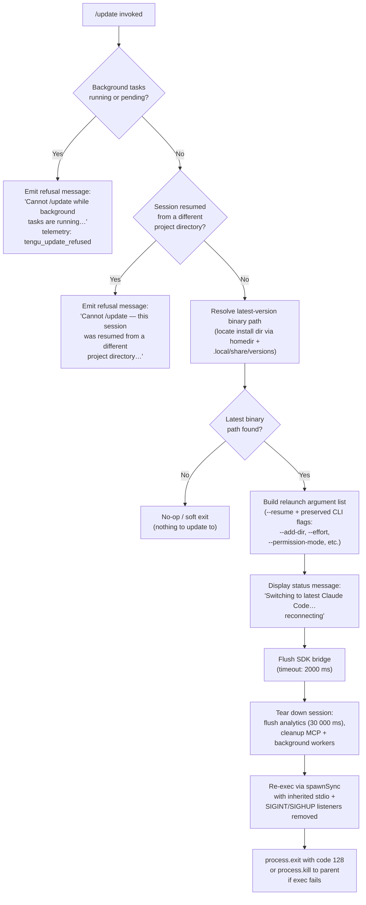

# `/update`

> Analysis basis: CC v2.1.163 bundle.js (AST extraction + Claude interpretation)
> Minimum version: v2.1.163

---

## Overview

The `/update` command switches the running Claude Code process to the latest installed version without terminating the current conversation. It performs a live in-process relaunch: it flushes all pending I/O, tears down the active session bridge, and executes a `spawnSync`-based re-exec of the new binary while forwarding the `--resume` flag so the conversation context is restored automatically in the new process.

---

## Registration

| Field | Value |
|---|---|
| type | `local` |
| name | `update` |
| description | `Switch to the latest version (conversation continues)` |
| supportsNonInteractive | `false` |
| isHidden | `true` |
| module_id | `y9K` |
| load_inline | `true` |
| loc_byte | `12655703` |
| loc_byte_end | `12655944` |
| loc_line | `9069` |
| arbor_handler.name | `ECf` |
| arbor_handler.fqn | `claude-2.1.163::ECf` |
| arbor_handler.kind | `AsyncFunction` |
| arbor_handler.resolution_path | `module_id` |
| arbor_handler.n_hits | `0` |

Analysis basis: CC v2.1.163 bundle.js:+12655703

---

## Input Branching

The command handler has five distinct guard branches before it commits to the relaunch sequence, making a Mermaid flowchart the appropriate representation.



---

## Behavioral Spec

### Guard — Background Task Check

Before any relaunch work begins, the handler queries active and pending background tasks via `Object.values` over the task registry.

```
function checkBackgroundTasksBlocking(taskRegistry):
    tasks = Object.values(taskRegistry)
    blocking = tasks.filter(t => t.status == "running" or t.status == "pending")
    if blocking.length > 0:
        emitTelemetry("tengu_update_refused")
        return Error("Cannot /update while background tasks are running — wait for them to finish, then try again.")
    return OK
```

Analysis basis: CC v2.1.163 bundle.js:+12653832 (Object.values call), +12653870 ("running"), +12653892 ("pending"), +12653973 (error literal), +12653609 (telemetry event)

---

### Guard — Resumed-from-Different-Directory Check

The handler inspects application state to detect whether the session was resumed from a project directory that differs from the current working directory.

```
function checkResumeDirectoryCompatibility(appState):
    if appState.resumedFromDifferentDir == true:
        return Error("Cannot /update — this session was resumed from a different project directory. Restart manually with --resume to continue on the latest version.")
    return OK
```

Analysis basis: CC v2.1.163 bundle.js:+12654214 (error literal)

---

### Latest-Version Binary Resolution

The handler locates the newest installed version of the `claude` binary by enumerating the versioned install tree under the user home directory.

```
function resolveLatestBinaryPath():
    homeDir = getHomedir()                        // uses f8q.homedir
    versionsDir = path.join(homeDir, ".local", "share", "versions")
    entries = listVersionEntries(versionsDir)      // returns sorted list
    latestEntry = entries[entries.length - 1]
    binaryPath = path.join(latestEntry, "bin", "claude")
    return binaryPath
```

Key path segments observed: `".local"`, `"share"`, `"versions"`, `"bin"`, `"claude"`.

Analysis basis: CC v2.1.163 bundle.js:+12653509 (binary lookup call), +855842 (`Bun.which`), +7975808 (`".local"`), +7975817 (`"share"`), +9299311 (`"versions"`), +7975888 (`"bin"`), +12653512 (`"claude"`)

---

### Relaunch Argument Construction

The handler reconstructs the CLI argument list for the new process, preserving session identity and relevant flags from the current invocation.

```
function buildRelaunchArgs(currentArgs, sessionId, addedDirs):
    args = ["--resume", sessionId]

    // Propagate additional directories
    for dir in addedDirs:
        args.push("--add-dir", dir)

    // Propagate optional flags if present in current invocation
    if currentArgs.has("--allow-dangerously-skip-permissions"):
        args.push("--allow-dangerously-skip-permissions")
    if currentArgs.has("--effort"):
        args.push("--effort", currentArgs["--effort"])
    if currentArgs.has("--permission-mode"):
        args.push("--permission-mode", currentArgs["--permission-mode"])

    return args
```

Analysis basis: CC v2.1.163 bundle.js:+12379781 (`I46`), +12379809 (`"--add-dir"`), +12379978 (`"--allow-dangerously-skip-permissions"`), +12380120 (`"--effort"`), +12380137 (`"--permission-mode"`), +12378285 (`"--resume"`), +12379730 (`"session"`)

---

### Status Message Emission

Before tearing down, the handler writes a `text`-type assistant message into the conversation so the user sees an in-conversation notification.

```
function emitStatusMessage(outputWriter):
    message = {
        role: "assistant",
        type: "text",
        content: "Switching to latest Claude Code… reconnecting"
    }
    outputWriter.writeSdkMessages([message])
```

Analysis basis: CC v2.1.163 bundle.js:+12654725 (literal `"Switching to latest Claude Code… reconnecting"`), +12654701 (`O.writeSdkMessages`), +12653655 (`"text"`)

---

### Bridge Flush and Teardown Sequence

The handler orchestrates a timed multi-step teardown before re-execing.

```
async function relaunchTeardown(bridge, analyticsClient, mcpManager):
    // Step 1: flush SDK bridge with timeout
    await Promise.race([
        bridge.flush(),
        timeout(2000)      // 2 000 ms — "bridge flush"
    ])

    // Step 2: full teardown (MCP connections, background sessions, analytics)
    await Promise.all([
        timeout(30000, label="flush timeout (relaunch)"),  // 30 000 ms hard cap
        analyticsClient.flush(label="analytics flush timeout"),
        mcpManager.teardown(),
        backgroundWorkerCleanup()
    ])

    bridge.teardown()
```

Analysis basis: CC v2.1.163 bundle.js:+12654795 (`O.flush`), +12654846 (`O.teardown`), +12654805 (2000 ms literal), +12378344 (30 000 ms timeout), +12378352 (`"flush timeout (relaunch)"`), +12378470 (`"analytics flush timeout"`)

---

### Process Re-Exec (execve-style Relaunch)

After teardown the handler removes all existing signal listeners, installs minimal no-op handlers, and synchronously re-execs the new binary.

```
function performRelaunch(newBinaryPath, relaunchArgs):
    process.removeAllListeners()
    process.on("SIGINT", noop)
    process.on("SIGHUP", noop)

    result = spawnSync(newBinaryPath, relaunchArgs, {
        stdio: "inherit",
        env: buildUpdatedEnv()    // uses Object.assign + eHK logic
    })

    if result indicates failure:
        // Write relaunch-error marker file via bJ (writeFileSync)
        logError("relaunch_spawn_error")
        process.exit(128)
    else:
        process.kill(process.pid, "SIGTERM")   // signal parent to exit cleanly
```

On macOS the handler uses `bun:ffi` to call `execve` via `/usr/lib/libSystem.B.dylib`; on Linux it targets `libc.so.6`. This replaces the running process image directly when available.

Analysis basis: CC v2.1.163 bundle.js:+12378854 (`process.removeAllListeners`), +12378884 (`process.on`), +12378825 (`"SIGINT"`), +12378844 (`"SIGHUP"`), +12378911 (`_6K.spawnSync`), +12378946 (`"inherit"`), +12379133 (`bJ` error-file writer), +12379136 (`"relaunch_spawn_error"`), +12379160 (`process.exit`), +12379225 (`process.kill`), +12377389 (`"bun:ffi"`), +12377425 (`"macos"`), +12377433 (`"/usr/lib/libSystem.B.dylib"`), +12377462 (`"libc.so.6"`), +12379273 (exit code 128)

---

### Session State Snapshotting (Pre-Relaunch)

Immediately before teardown, the handler reads and then updates `appState` to record the in-flight relaunch, and queries the last assistant message so the conversation can be reconstructed after resume.

```
function snapshotSessionForResume(appStateStore, conversationLog):
    state = appStateStore.getAppState()

    // Identify last assistant turn for resume injection
    lastAssistantMsg = conversationLog.findLast(m => m.role.startsWith("assistant-"))

    // Generate a fresh message UUID for the resume handshake
    resumeMessageId = generateUUID()   // uses EC8.randomUUID

    updatedState = Object.assign({}, state, { relaunching: true, resumeMessageId })
    appStateStore.setAppState(updatedState)

    return { resumeMessageId, lastAssistantMsg }
```

Analysis basis: CC v2.1.163 bundle.js:+12654461 (`_.getAppState`), +12654615 (`_.setAppState`), +12654515 (`"assistant-"` prefix), +12654721 (`I9K` / `EC8.randomUUID`), +12654936 (`Object.assign`)

---

## State & Side Effects

| Item | Detail |
|---|---|
| Telemetry — `tengu_update_refused` | Fired when the command is blocked due to running or pending background tasks (bundle.js:+12653609) |
| Telemetry — `tengu_feature_sad` | Fired on feature degradation path within the network/queue subsystem reachable during teardown (bundle.js:+1010365) |
| Telemetry — `tengu_feature_bad` | Fired on feature error path in the same subsystem (bundle.js:+1010284) |
| Telemetry — `tengu_feature_ok` | Fired on feature success path in the same subsystem (bundle.js:+1010222) |
| Telemetry — `tengu_scroll_summary` | Fired during scroll/summary rendering touched by the teardown render path (bundle.js:+5447055) |
| Telemetry — `tengu_config_parse_error` | Fired if config file parsing fails during argument reconstruction (bundle.js:+3262482) |
| appState changes | `relaunching: true` flag and `resumeMessageId` written via `_.setAppState` before re-exec (bundle.js:+12654615) |
| SDK bridge | `O.writeSdkMessages`, `O.flush`, `O.teardown` called in sequence; bridge is fully drained before re-exec (bundle.js:+12654701, +12654795, +12654846) |
| Process signal listeners | All existing listeners removed via `process.removeAllListeners()`; `"beforeExit"` and `"exit"` handlers cleared (bundle.js:+12378854, +12379000, +12379041) |
| Error marker file | On spawn failure, `bJ` writes a file via `upH.writeFileSync` to record the relaunch error for diagnostics (bundle.js:+192467) |
| MCP connections | MCP manager teardown called; all server connections closed cleanly (bundle.js:+12654846, via `O.teardown`) |
| Background workers | Background session cleanup (`pO8`, `D06`, `JyH`) executed as part of the `Promise.all` teardown (bundle.js:+12378459) |
| Analytics flush | Analytics client drained with a timeout label `"analytics flush timeout"` (bundle.js:+12378470) |
| Hook registration | `j9` / `MXA.register` touched during the `F4A` (hook-append) path; last-prompt hook entry appended with key `"last-prompt"` (bundle.js:+13182248) |
| Sound | <!-- TODO: not found in depth-2 traversal; needs --depth 4 --> |

---

## Version History

| Version | Change |
|---|---|
| v2.1.163 | Initial analysis |

---

## Common Mistakes

1. **Running `/update` while background tasks are active** — The command refuses with an explicit error message (`"Cannot /update while background tasks are running…"`) and fires `tengu_update_refused`. Wait for all background tasks to complete first.

2. **Using `/update` in a session resumed from a mismatched project directory** — If the session was opened with `--resume` pointing to a project other than the current working directory, `/update` will refuse. Restart manually with the correct `--resume` path instead.

3. **Expecting `/update` to be visible in the command palette** — The command is registered with `isHidden: true`, so it does not appear in autocomplete or help listings. It must be typed explicitly.

4. **Expecting `/update` to work in non-interactive (CI/scripted) mode** — `supportsNonInteractive: false` means the command is a no-op or errors in non-interactive sessions.

5. **Assuming the relaunch is instantaneous** — The teardown sequence imposes real timeouts: 2 000 ms for the bridge flush and up to 30 000 ms for the full teardown. In slow environments the gap between the status message and the new process appearing may be noticeable.

6. **Forgetting that re-exec uses `execve` (not a child process)** — On supported platforms (macOS via `libSystem`, Linux via `libc.so.6`) the current process image is fully replaced. Any state held in the old process that was not written to `appState` or passed via CLI flags will be lost.

---

## Appendix — Identifier Mapping

> For bundle debugging only. Identifiers change across versions.

| Identifier | Role |
|---|---|
| `ECf` | Main async handler for `/update` (arbor_handler; AsyncFunction resolved via module_id `y9K`) |
| `TC8` | Binary/install-path lookup helper — checks for `claude` binary via `Bun.which` |
| `uM` | Wrapper that calls `Bun.which` to locate the `claude` executable |
| `KvA` | Inner `Bun.which` invocation utility |
| `NS` | Versioned install directory resolver (constructs path to `versions` dir, calls `K3` and `H5H`/`H1H`) |
| `PZ8` | Path-join helper for the versions directory tree |
| `K3` | Array-based path segment validator (uses `Array.isArray`) |
| `H5H` | Constructs `~/.local/share/…` path segment (uses `n28` + `OZ6.join`) |
| `n28` | Home-directory lookup (`f8q.homedir`) |
| `H1H` | Constructs `bin/` path segment under a version entry |
| `Z9` | Process/context initializer called early in the handler |
| `GYH` | Background-mode type discriminator (`"bg"`, `"daemon"`, `"daemon-worker"`) |
| `c` | General utility / context accessor |
| `aj` | Current script basename resolver (`k2.basename`) |
| `h6` | Async task / promise helper (uses `uv`) |
| `uv` | Low-level async primitive |
| `Uk` | Path utilities accessor |
| `VKA` | New-binary path builder (uses `K6K.dirname`, `X_`, `K4`) |
| `X_` | Path existence check helper (uses `uv`) |
| `K4` | Path resolution helper (uses `uv`) |
| `b9H` | Session metadata accessor |
| `Le` | Hook/attachment filter (checks `gFf.has` for `"ant"` / `"attachment"` / `"hook_success"`) |
| `Hx8` | Hook registry accessor |
| `F4A` | Hook append helper — writes `"last-prompt"` entry via `_.appendEntry` |
| `d4` | Hook registration dispatcher (calls `j9` / `MXA.register`) |
| `j9` | `MXA.register` wrapper |
| `_` | App-state / store accessor (`getAppState`, `setAppState`, `appendEntry`) |
| `kH` | Network queue / request scheduler (manages `hBH`, logs errors via `Er.logError`) |
| `HA` | Error constructor wrapper |
| `eH` | String coercion utility |
| `Dq` | Queue drain / retry logic (uses `RSA`) |
| `RSA` | Request serializer using `eH` |
| `HW4` | Sliding-window queue manager (`kd6.shift` / `kd6.push`) |
| `wT` | App-state transition writer (called between `getAppState` and `setAppState`) |
| `O` | SDK bridge object (`writeSdkMessages`, `flush`, `teardown`) |
| `b8` | Bridge internal state accessor |
| `I9K` | UUID generator (`EC8.randomUUID`) |
| `yL` | Timed promise race helper (`setTimeout` / `Promise.race` / `clearTimeout`) |
| `UwH` | String-coercion helper for env/arg building |
| `D0H` | Full relaunch orchestrator — stat check, teardown, `spawnSync`, `process.exit` / `process.kill` |
| `D06` | Interval-clear wrapper (`jS_` / `clearInterval`) |
| `jS_` | `clearInterval` wrapper |
| `JyH` | Terminal/render teardown (`AfH.writeSync`, `H.unmount`, `YC`, `U48`) |
| `H` | Ink/render root (unmount, text rendering helpers) |
| `v` | Terminal output formatter (ANSI, padding, trim) |
| `e$` | Render state accessor |
| `Pw_` | Text-content parser (split/trim/indexOf/slice) |
| `ZHH` | Character-width cache checker (`g44.has`) |
| `uj` | Text replace helper |
| `t1` | Render layout calculator (`D6H`, `Aq`, `eX`) |
| `s6` | Render child manager |
| `YC` | Render cleanup step |
| `U48` | Terminal write helper (`Aa.writeSync`, escape-sequence emission) |
| `SvH` | Terminal capability detector (Ghostty, iTerm2, tmux checks) |
| `TvH` | Terminal state restore |
| `bW` | tmux escape-sequence wrapper (`aP_`, `replaceAll`) |
| `K$` | Cursor/scroll state helper |
| `mO8` | Teardown render/scroll manager (`qE`, `RZ9`, `SZ9`, `M1`) |
| `qE` | Scroll position accessor |
| `RZ9` | Render-state snapshot |
| `SZ9` | Animated-frame timer (`Date.now`, `Math.max`, `Math.round`, `Object.assign`) |
| `yZ9` | Frame update dispatcher |
| `M1` | Fullscreen / terminal-mode manager (`ZHH`, `q2_`, `mo`, `A2_`, `e_`, `wNL`, `D6`) |
| `q2_` | String encoder for terminal sequences |
| `mo` | Fullscreen mode toggle dispatcher (`DNL`) |
| `A2_` | Boolean-coercion path helper |
| `e_` | Deferred-update scheduler (`DU`) |
| `wNL` | Alternate screen mode writer (`D6`) |
| `D6` | Terminal control sequence emitter (`Hj6`, `_j6`, `qu`, `yDH`, `B98`, `tw6`, `eU`, `S6`) |
| `ET` | Analytics event emitter (uses `d4`) |
| `OpH` | MCP drain helper (`MXA.drain`) |
| `pO8` | Background-session cleanup coordinator (`Promise.all`, `iV`, `Mc`, `H`, `Promise.race`, `l8`) |
| `l8` | Child-process lifetime manager (`K`, `Error`, `q`, `setTimeout`, `O`, `clearTimeout`) |
| `K` | Process list padder (`L.map`, `f.padEnd`) |
| `q` | File-unlink helper (`xuK.unlinkSync`) |
| `L` | Tracked-promise set manager (`q.add`, `f.finally`, `q.delete`) |
| `eHK` | `execve`-based re-exec function (FFI load, env build, `M.execve`, `process.chdir`) |
| `f` | Native library / socket handle |
| `A` | Connection/process map |
| `$` | Pending-task queue |
| `TKK` | Telemetry event builder (`nr`, `Date.now`, `N9`, `JR6`, `SH`) |
| `w` | Background session manager (SIGKILL escalation, low-mem, spare-pool, EDA/IDA) |
| `b` | Process handle |
| `RH` | Session error renderer (`c`, `P6`) |
| `hH` | Session ok renderer (`c`, `P6`) |
| `Nb8` | Low-memory threshold checker (`a6`, `D6`; threshold: 1024 MB) |
| `zX6` | Config file reader (`I2.readFile`, `KT_`, `B6`, `Array.isArray`) |
| `g` | Process lifecycle controller (`process.kill`, `setTimeout`, `Math.min`) |
| `EDA` | Spare-pool claim sender (`Fg.claim`, `JB8.connect`, socket write/end) |
| `IDA` | Background worker IPC handler (done/killed/failed/crashed/blocked/working/active/idle states) |
| `D` | Forced-shutdown executor (`IJ`, `process.exit`, `z.abort`) |
| `v8` | Version/build-info accessor |
| `P6` | Generic renderer bootstrap (`Nu6`) |
| `F` | Disposable resource handle |
| `M` | MCP server manager (`AbH`, `tU8`, `L.get`, `VYA`) |
| `AbH` | MCP connection initializer (stdio/sse/http/ws-ide/sse-ide routing) |
| `tU8` | MCP update applier (`H.applyMcpUpdate`, `_bH`, `O8`, `A.cleanup`, `mk`, `dD`) |
| `VYA` | MCP reconnect/retry manager (`AbH`, `tU8`, `l8`, `$A6`) |
| `z` | Daemon stop controller (`hH`, `RH`, `Yh`, `Tp`) |
| `Yh` | Daemon stop notifier (`Au`, `_c.push`, `QNH`, `$X_`) |
| `Tp` | Daemon shutdown sequence (`Promise.race`, `Promise.all`, `Ac`, `fc`, `l8`, `process.exit`) |
| `EH` | Error-to-string coercer |
| `bJ` | Error-marker file writer (`upH.writeFileSync`, `Wc8.join`) |
| `QR8` | Relaunch CLI-args assembler (`Array.from`, `I46`, `q.push`, `S6`) |
| `I46` | Argument-token iterator |
| `S6` | Config-file watcher / installer state machine (`Q6`, `eT`, `vX_`, `bDH`, `XTL`) |
| `Q6` | Config path resolver |
| `vX_` | Config validation helper |
| `bDH` | Config file reader and backup manager (`q.readFileSync`, `B6`, `vx`, `q.copyFileSync`) |
| `B6` | JSON.parse wrapper |
| `vx` | Version-string prefix stripper (`startsWith`, `slice`) |
| `fr1` | Backup directory enumerator (`pD.basename`, `_.readdirStringSync`, `pD.join`) |
| `RX_` | Backup path constructor (`pD.join`, `a8`) |
| `XTL` | File-watch installer (`a98.watchFile`, `Q6`, `m9`, `vx`, `vX_`, `No`, `j9`) |
| `No` | Watch-event normalizer |
| `R_` | Session resume-state reader (`H.getAppState`, `A.findLast`, `mk8`, `pk8`) |
| `mk8` | Allowed-tools resume mapper (`L1`) |
| `L1` | Tool-list normalizer |
| `pk8` | Disallowed-tools resume mapper (`L1`) |
| `Q$` | Current session app-state accessor (`H.getAppState`) |