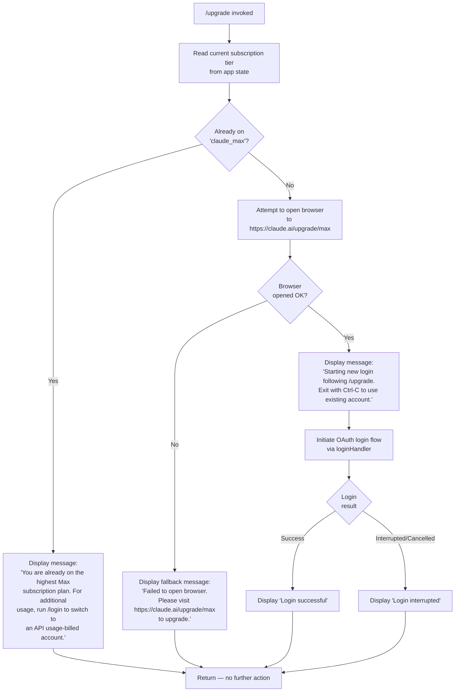

# `/upgrade`

> Analysis basis: CC v2.1.163 bundle.js (AST extraction + Claude interpretation)
> Minimum version: v2.1.163

---

## Overview

The `/upgrade` command guides the user through upgrading their Claude subscription to the **Max** plan, which offers higher rate limits and more access to Claude Opus models. When invoked, it checks the user's current subscription tier and either notifies them that they are already on the highest plan, or opens a browser to the upgrade URL (`https://claude.ai/upgrade/max`) and initiates a new login flow to associate the upgraded account. The command renders a JSX component (`local-jsx` type) and coordinates an async OAuth-based authentication sequence upon completion.

---

## Registration

| Field | Value |
|---|---|
| type | `local-jsx` |
| name | `upgrade` |
| description | `Upgrade to Max for higher rate limits and more Opus` |
| loc_byte | `12701375` |
| loc_byte_end | `12701622` |
| loc_line | `9080` |
| module_id | `ALA` |
| load_inline | `true` |
| arbor_handler.name | `zR6` |
| arbor_handler.fqn | `claude-2.1.163::zR6` |
| arbor_handler.kind | `AsyncFunction` |
| arbor_handler.resolution_path | `module_id` |
| arbor_handler.n_hits | `0` |

Analysis basis: CC v2.1.163 bundle.js:+12701375

---

## Input Branching

The handler has four distinct execution paths depending on subscription state and login outcome, so a Mermaid flowchart is used.



Analysis basis: CC v2.1.163 bundle.js:+12700506, +12700650, +12700751, +12700901, +12700904, +12700976, +12701095, +12701114, +12701168

---

## Behavioral Spec

### 1. Handler Entry — Subscription Check

The async handler `upgradeCommandHandler` (bundle ident: `zR6`) is the primary entry point resolved via the `module_id` → `ALA` path.

```
async function upgradeCommandHandler(context):
    currentTier = readSubscriptionTier(context.appState)
    // "max" tier literal checked (bundle.js:+12700506)
    // specifically, plan "default_claude_max_20x" is the recognized max-tier value
    // (bundle.js:+12700531)

    if currentTier == "max" OR currentTier matches claude_max family:
        display(ALREADY_ON_MAX_MESSAGE)
        // Message: "You are already on the highest Max subscription plan..."
        // (bundle.js:+12700751)
        return
    else:
        proceedToUpgradeFlow(context)
```

Analysis basis: CC v2.1.163 bundle.js:+12700506, +12700531, +12700650, +12700751

---

### 2. Upgrade URL Browser Launch

If the user is not already on the Max plan, the handler attempts to open the system browser to the upgrade URL.

```
function openUpgradeBrowser():
    url = "https://claude.ai/upgrade/max"   // (bundle.js:+12700904)

    platform = process.platform
    if platform == "darwin":
        exec("open", url)
    else if platform == "win32":
        exec("rundll32", "url,OpenURL", url)
    else:
        exec("xdg-open", url)               // Linux fallback

    if launchFailed:
        display("Failed to open browser. Please visit https://claude.ai/upgrade/max to upgrade.")
        // (bundle.js:+12701168)
        return FAILURE
    return SUCCESS
```

Analysis basis: CC v2.1.163 bundle.js:+12700904, +12701168, +6804086, +6804102, +6804186, +6804198, +6804260, +6804267

The URL opener (`hK`) delegates to a platform dispatcher (`C8`) which chooses between `open` (macOS), `rundll32 url,OpenURL` (Windows), and `xdg-open` (Linux/other).

---

### 3. Post-Browser Login Flow

After successfully opening the browser, the handler starts a fresh OAuth login sequence to pick up the newly upgraded subscription.

```
function initiatePostUpgradeLogin(context):
    display("Starting new login following /upgrade. Exit with Ctrl-C to use existing account.")
    // (bundle.js:+12700976)

    loginResult = await oauthLoginFlow(context)
    // oauthLoginFlow uses the same flow as /login (authSessionHandler, fYH)
    // including: fetchOAuthProfile (bundle.js:+2103549),
    //            token validation, and API key helper resolution

    if loginResult.success:
        display("Login successful")      // (bundle.js:+12701095)
    else:
        display("Login interrupted")    // (bundle.js:+12701114)
```

Analysis basis: CC v2.1.163 bundle.js:+12700901, +12700976, +12701095, +12701114

The login flow delegates to `oauthLoginFlow` (bundle ident: `fYH`), which itself calls the OAuth profile fetch utility (bundle ident: `hH`, telemetry event `oauth_profile_fetch` at +2103549) and handles token failure via `oauth_profile_token_failed` (+2103616). A 10-second timeout is applied to the profile fetch request (bundle.js:+2103533).

---

### 4. OAuth Profile Fetch Sub-flow

```
async function fetchOAuthProfile(token, apiBaseUrl):
    headers = {
        "Content-Type": "application/json",   // (bundle.js:+2103490, +2103505)
    }
    timeoutMs = 10000                          // (bundle.js:+2103533)

    try:
        response = await httpGet(apiBaseUrl, headers, timeoutMs)
        emitTelemetry("oauth_profile_fetch")  // (bundle.js:+2103549)
        return response.profile
    catch error:
        emitTelemetry("oauth_profile_token_failed")  // (bundle.js:+2103616)
        logError(error)
        return null
```

Analysis basis: CC v2.1.163 bundle.js:+2103490, +2103505, +2103533, +2103549, +2103616

---

### 5. Authentication Environment Resolution

The login flow resolves the auth environment before attempting OAuth. This is shared with other auth-dependent commands.

```
function resolveAuthEnvironment(config):
    // Provider exclusions checked (bundle.js:+2096693, +2096743, +2096799, +2096853, +2096901)
    // Providers: "bedrock", "foundry", "anthropicAws", "mantle", "vertex", "firstParty"
    // are evaluated to determine if OAuth is applicable.

    if envVar("ANTHROPIC_API_KEY") present:
        useApiKey()
    else if envVar("CLAUDE_CODE_OAUTH_TOKEN_FILE_DESCRIPTOR") present:
        useOAuthFd()     // (bundle.js:+2118959)
    else if envVar("CLAUDE_CODE_API_KEY_FILE_DESCRIPTOR") present:
        useApiKeyFd()    // (bundle.js:+2119102)
    else if wifEnvVars present:
        // ANTHROPIC_FEDERATION_RULE_ID + ANTHROPIC_ORGANIZATION_ID
        useWIF()
    else:
        throw Error("ANTHROPIC_API_KEY, ANTHROPIC_AUTH_TOKEN, CLAUDE_CODE_OAUTH_TOKEN, or WIF env vars ... required")
        // (bundle.js:+2999533)
```

Analysis basis: CC v2.1.163 bundle.js:+2096693–2096910, +2118959, +2119102, +2999064, +2999533

---

### 6. JSX Component Rendering

Because the command type is `local-jsx`, the handler renders React elements via `_LA.createElement` (bundle.js:+12700937). The rendered component:

- Listens for API key changes via `_.onChangeAPIKey` callback (bundle.js:+12701072)
- Invokes the session/login handler (`kH`) on mount or on user confirmation (bundle.js:+12701147)
- Displays status messages as described in the branching section above

```
function renderUpgradeComponent(props):
    return createElement(UpgradeView, {
        onChangeAPIKey: props.onChangeAPIKey,
        loginHandler: kH,
        ...statusMessages
    })
```

Analysis basis: CC v2.1.163 bundle.js:+12700937, +12701072, +12701091, +12701147

---

### 7. setTimeout Guard

A `setTimeout` call is present in the handler (bundle.js:+12700736), functioning as a guard or delay before initiating the login sequence. This ensures the browser has had time to open before the CLI blocks on the OAuth callback.

```
function upgradeWithDelay(context):
    openUpgradeBrowser()
    setTimeout(() => {
        initiatePostUpgradeLogin(context)
    }, delayMs)
```

Analysis basis: CC v2.1.163 bundle.js:+12700736

---

## State & Side Effects

| Item | Detail |
|---|---|
| Telemetry | `tengu_feature_ok` (bundle.js:+1010222); `tengu_feature_sad` (bundle.js:+1010365) |
| Telemetry (OAuth) | `oauth_profile_fetch` (bundle.js:+2103549); `oauth_profile_token_failed` (bundle.js:+2103616) |
| Telemetry (Bootstrap) | `api_bootstrap_fetch` (bundle.js:+15724540) |
| Browser launch | Opens `https://claude.ai/upgrade/max` via platform-specific command (macOS: `open`, Windows: `rundll32 url,OpenURL`, Linux: `xdg-open`) |
| appState changes | Subscription tier updated in app state after successful login; API key listener registered via `onChangeAPIKey` (bundle.js:+12701072) |
| OAuth session | New OAuth session initiated post-upgrade; token stored via file descriptor or environment variable resolution |
| Hook registration | `MXA.register` called via `j9` (bundle.js:+60323) — registers a cleanup or lifecycle hook |
| Error logging | `Er.logError` called on auth/login failure (bundle.js:+1015986) |
| Sound | <!-- TODO: not found in depth-2 traversal; needs --depth 4 --> |
| Shutdown guard | `D` can call `process.exit` or `z.abort` in forced-shutdown scenarios (bundle.js:+16166601, +16166622) |

---

## Version History

| Version | Change |
|---|---|
| v2.1.163 | Initial analysis |

---

## Common Mistakes

1. **Running `/upgrade` when already on Max**: The command will immediately return the message "You are already on the highest Max subscription plan…" and suggest `/login` to switch to an API-billed account instead. No browser is opened.

2. **Browser launch failures in headless environments**: In SSH sessions or CI environments without a display server, `xdg-open` (Linux) will fail. The command prints a fallback message with the direct URL (`https://claude.ai/upgrade/max`) so the user can open it manually.

3. **Interrupting the login flow**: If the user presses `Ctrl-C` during the post-browser OAuth login step, the session is marked interrupted and a "Login interrupted" message is shown. The subscription may have been upgraded on the web side but not yet reflected in the CLI session — running `/login` afterward will pick up the new plan.

4. **Using `/upgrade` with non-OAuth auth providers**: The upgrade flow is OAuth-specific. Users authenticated via `ANTHROPIC_API_KEY` or enterprise providers (`bedrock`, `vertex`, `foundry`, `anthropicAws`, `mantle`) will encounter auth environment mismatches since the OAuth profile fetch path requires a valid OAuth token.

5. **Expecting instant rate-limit changes**: The upgrade URL opens in the browser, but the CLI must complete the login flow before the new subscription tier is reflected in the current session. Exiting during the `setTimeout`-guarded delay window may leave the session on the old plan.

---

## Appendix — Identifier Mapping

> For bundle debugging only. Identifiers change across versions.

| Identifier | Role |
|---|---|
| `zR6` | Main async handler for `/upgrade` command (AsyncFunction, resolved via module_id ALA) |
| `ZA` | Auth state reader / subscription tier resolver |
| `zY` | Authentication orchestration function (delegates to sub-auth helpers) |
| `L4` | General logging / tracing utility |
| `eH` | Error formatting / wrapping helper |
| `Bj` | OAuth credential and profile configuration assembler |
| `ns6` | Network/utility sub-function called by credential assembler |
| `JcH` | Token header builder (calls error formatter and endpoint helper) |
| `vU` | OAuth token file descriptor reader |
| `lV` | Flag settings accessor |
| `nR` | Array/include check utility for auth mode validation |
| `Z7` | Provider type checker (bedrock, foundry, vertex, etc.) |
| `XA` | Provider exclusion validator |
| `pX` | Auth profile selector |
| `DO` | Auth environment resolver (checks API key, OAuth FD, WIF env vars) |
| `Hw6` | API key helper resolver |
| `HpH` | VSCode integration check (`claude-vscode` client detector) |
| `zO6` | API key file descriptor reader |
| `S6` | Session/state persistence function |
| `iR` | History slice utility (last 20 entries) |
| `Aw6` | Auth wrapper / alternative token path |
| `fYH` | OAuth login flow orchestrator (profile fetch, token validation) |
| `U1` | OAuth URL builder and environment resolver |
| `_vA` | Environment variable reader for OAuth config |
| `n74` | OAuth endpoint path builder |
| `hH` | OAuth profile fetch (HTTP GET, 10 s timeout, emits `oauth_profile_fetch`) |
| `c` | HTTP client instance |
| `P6` | HTTP request dispatcher |
| `Nu6` | Base HTTP utility |
| `s6` | Secondary profile/token fetch path (emits `oauth_profile_token_failed`) |
| `BO` | Token cache or storage accessor |
| `v` | Bootstrap fetch orchestrator (fetches API configuration on startup) |
| `ccK` | Bootstrap response parser |
| `OXA` | Log-level gating utility |
| `H` | Bootstrap HTTP fetch function (adds User-Agent, 5 s timeout) |
| `e$` | User-Agent string builder |
| `Pw_` | URL query string parser (split/trim/indexOf/slice) |
| `ZHH` | Bootstrap cache hit checker |
| `uj` | URL sanitizer (replace sensitive params) |
| `t1` | Bootstrap result processor |
| `SH` | JSON serialization helper |
| `J4` | Path/filename utility (basename, extension extraction) |
| `g2A` | Path map builder |
| `q` | File system unlink caller |
| `A` | File path lowercaser |
| `ppH` | Output writer (writes to stdout/stream) |
| `h2A` | Raw stream write helper |
| `icK` | Log file writer / appender (manages rotation, mkdir, appendFile) |
| `$pH` | Buffered output batcher (uses setTimeout/setImmediate, clearTimeout) |
| `d3H` | Log entry formatter |
| `Q6` | Log level constant accessor |
| `aL6` | Log rotation size checker |
| `r2A` | Log file path resolver |
| `i2A` | Log file rotation handler (stat, rename, unlink) |
| `ncK` | Log append worker (mkdir, appendFile, rotate) |
| `j9` | Lifecycle hook registrar (calls `MXA.register`) |
| `kH` | Login session handler (main login orchestrator called by upgrade UI) |
| `HA` | Error constructor wrapper |
| `Dq` | Login error classifier |
| `RSA` | Login error formatter |
| `HW4` | Login queue manager (shift/push on `kd6`) |
| `hK` | Browser URL opener (platform dispatch: open / rundll32 / xdg-open) |
| `pY7` | URL protocol validator (checks `http:` / `https:`) |
| `FY` | Browser launch result handler |
| `C8` | Platform-specific process spawner for browser open |
| `S_` | Interactive session runner (renders TUI, manages shutdown) |
| `bTH` | TUI component tree builder |
| `D` | Forced shutdown handler (process.exit / abort controller) |
| `SG4` | Terminal size / string formatter |
| `K$` | Keyboard interrupt handler |
| `v8` | Version/config accessor |
| `b6` | Async local storage context reader |
| `bd6` | Store getter (reads from `Cd6` AsyncLocalStorage) |
| `X_` | UV/libuv handle utility |

---

Note: index built via Arbor fallback; some signals (telemetry, literals) may be missing — see arbor-fallback.js.