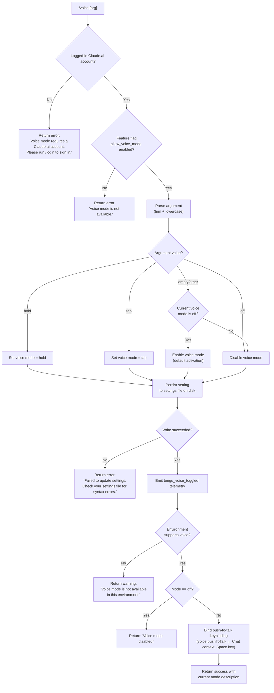

# `/voice`

> Analysis basis: CC v2.1.163 bundle.js (AST extraction + Claude interpretation)
> Minimum version: v2.1.163

---

## Overview

The `/voice` command toggles voice mode for the Claude Code CLI session. It accepts an optional sub-command argument (`hold`, `tap`, or `off`) to select a specific activation mode or disable voice input. The command enforces account-level and feature-flag prerequisites before making any state changes, and persists the chosen mode to the user settings file on disk.

---

## Registration

| Field | Value |
|---|---|
| type | `local` |
| name | `voice` |
| description | `Toggle voice mode` |
| argumentHint | `[hold\|tap\|off]` |
| supportsNonInteractive | `false` |
| isHidden | `null` |
| module_id | `I7K` |
| load_inline | `true` |
| loc_byte | `12971424` |
| loc_byte_end | `12971666` |
| loc_line | `9613` |
| arbor_handler.name | `bpf` |
| arbor_handler.fqn | `claude-2.1.163::bpf` |
| arbor_handler.kind | `AsyncFunction` |
| arbor_handler.resolution_path | `module_id` |
| arbor_handler.n_hits | `1` |

Analysis basis: CC v2.1.163 bundle.js:+12971424

---

## Input Branching

The command has five or more distinct execution paths depending on account status, feature-flag state, argument value, and environment capability, so a Mermaid flowchart is used.



Analysis basis: CC v2.1.163 bundle.js:+12968795 (argument literals `hold`, `tap`, `off`, `invalid`)

---

## Behavioral Spec

### 1. Entry Point — Main Handler (`bpf`)

The handler is an `AsyncFunction` resolved by Arbor via the `module_id` path from module `I7K`.

```
async function handleVoiceCommand(args, appState):
    settings = loadCurrentSettings(appState)          // calls settingsReader (zY)
    
    # Gate 1: account check
    if not isLoggedInWithClaudeAI(settings):          // checks profile type
        return textResult(
            "Voice mode requires a Claude.ai account. "
            "Please run /login to sign in."
        )
    
    # Gate 2: feature flag
    featureFlags = getFeatureFlags(settings)          // checks allow_voice_mode flag
    if not featureFlags.allow_voice_mode:
        return textResult("Voice mode is not available.")
    
    # Argument normalization
    rawArg = args.trim()                              // first trim call at +12969170
    normalizedArg = parseVoiceArgument(rawArg)        // calls argumentParser (Cpf)
    
    # Settings persistence
    writeResult = await writeVoiceSetting(            // calls settingsWriter (r_)
        normalizedArg, appState
    )
    if writeResult.error:
        return textResult(
            "Failed to update settings. "
            "Check your settings file for syntax errors."
        )
    
    # Telemetry
    emitTelemetry("tengu_voice_toggled", {            // +12969420
        mode: normalizedArg
    })
    
    # Environment capability check
    if not environmentSupportsVoice(appState):        // calls environmentCheck (v7A)
        return textResult(
            "Voice mode is not available in this environment."
        )
    
    # Outcome
    if normalizedArg == "off" or currentMode == "off":
        return textResult("Voice mode disabled.")     // literal at +12969475
    
    # Keybinding registration for active mode
    registerKeybinding({                              // calls keybindingRegister ($P)
        action: "voice:pushToTalk",                   // literal at +12970688
        context: "Chat",                              // literal at +12970707
        key: "Space"                                  // literal at +12970714
    })
    
    # Microphone permission hint (macOS)
    if platform == "macOS" and permissionDenied:
        hint = "System Settings → Privacy & Security → Microphone"
        // literal at +12970226
    
    return successResult(currentVoiceMode)
```

Analysis basis: CC v2.1.163 bundle.js:+12968878

---

### 2. Argument Parser (`Cpf`)

```
function parseVoiceArgument(rawInput):
    trimmed = rawInput.trim()                         // +12968748
    lower   = trimmed.toLowerCase()
    
    if lower == "hold":   return "hold"              // +12968795
    if lower == "tap":    return "tap"               // +12968807
    if lower == "off":    return "off"               // +12968818
    if lower == "":       return TOGGLE_CURRENT      // implicit toggle
    return "invalid"                                  // +12968839
```

Analysis basis: CC v2.1.163 bundle.js:+12968748

---

### 3. Account / Feature-Flag Check (`F96` → `Z7A` → `W9`)

```
function checkVoicePrerequisites(appState):
    featureSet = resolveFeatureSet(appState)          // W9 checks vBL, IBL membership sets
    
    # Tier / plan checks relevant to voice
    if plan in ["enterprise", "team"]:                // literals at +4178044, +4178079
        # enterprise/team accounts have additional flag resolution
        pass
    
    voiceAllowed = featureSet.has("allow_voice_mode") // literal at +12959056
    return voiceAllowed
```

Analysis basis: CC v2.1.163 bundle.js:+12959056 (`allow_voice_mode`), +12959098

---

### 4. Settings Writer (`r_`)

The settings writer is a complex function that:

1. Determines the target settings file path (resolves `.claude/settings.json` or `settings.local.json`). Analysis basis: CC v2.1.163 bundle.js:+1269318
2. Reads the current settings from disk (via atomic read with BOM detection). Analysis basis: CC v2.1.163 bundle.js:+1021093
3. Applies the voice mode change to the in-memory settings object.
4. Performs a safe atomic write using a temporary file with `fsyncSync` + rename, preserving original file permissions. Analysis basis: CC v2.1.163 bundle.js:+1057874, +1057940, +1058068
5. Validates gitignore rules and emits `gitignore_global_rule` / `write_ineffective` diagnostic strings when appropriate. Analysis basis: CC v2.1.163 bundle.js:+1279074, +1279215
6. Returns success or surfaces a structured error to the caller.

```
async function writeVoiceSetting(mode, appState):
    configPath = resolveSettingsPath(appState)        // hx + Xl6
    existingSettings = readSettingsFile(configPath)   // Zr
    
    updatedSettings = applyVoiceMode(existingSettings, mode)
    
    try:
        atomicWriteFile(configPath, updatedSettings)  // TM6: tmpfile + fsync + rename
        emitTimestamp(mH_)                            // records Date.now to Rc6 map
        return { success: true }
    catch err:
        logError(err)                                 // kH → Er.logError
        return { error: err }
```

Analysis basis: CC v2.1.163 bundle.js:+1278224 (`cO`), +1278351 (`R8`/`v8`), +1279356 (`DU`)

---

### 5. Settings Loader (`e_` → `DU` → `g6_`)

Before any gate checks the handler loads the current settings from disk using the standard settings pipeline. This pipeline:

- Marks the start with a performance hook `loadSettingsFromDisk_start`. Analysis basis: CC v2.1.163 bundle.js:+1276855
- Loads flag settings, policy settings, user settings, project settings, and local settings in layered order. Analysis basis: CC v2.1.163 bundle.js:+1265844, +1265866, +1269054, +1269105, +1269127
- Merges SDK inline settings when present. Analysis basis: CC v2.1.163 bundle.js:+1268126
- Emits `settings_load_started` and `settings_load_completed` log events. Analysis basis: CC v2.1.163 bundle.js:+1273469, +1274198
- Marks the end with `loadSettingsFromDisk_end`. Analysis basis: CC v2.1.163 bundle.js:+1276911

---

### 6. Keybinding Registration (`$P`)

When voice mode is set to an active mode (`hold` or `tap`), the command registers a push-to-talk keybinding:

```
function registerPushToTalkKeybinding(appState):
    binding = {
        action:  "voice:pushToTalk",    // +12970688
        context: "Chat",                // +12970707
        key:     "Space"                // +12970714
    }
    
    loadKeybindingsConfig(appState)     // DL8 → svH: reads keybindings.json
    mergeKeybinding(binding)            // wL8 → kG_/z19
    applyKeybindings(appState)          // $P persists merged config
```

Analysis basis: CC v2.1.163 bundle.js:+12970685, +3877767

---

## State & Side Effects

| Item | Detail |
|---|---|
| Telemetry | `tengu_voice_toggled` (emitted on every successful mode change, +12969420) |
| Telemetry (indirect) | `tengu_feature_ok` (+1010222), `tengu_feature_bad` (+1010284), `tengu_feature_sad` (+1010365) — generic feature gate outcomes |
| Settings persistence | Writes `voiceMode` field to `.claude/settings.json` (or `settings.local.json`) via atomic rename |
| Keybinding registration | Registers `voice:pushToTalk` → `Space` in `Chat` context when mode is `hold` or `tap` |
| Settings load | Reads all settings layers from disk on every invocation (flag, policy, user, project, local) |
| Log events | `settings_load_started`, `settings_load_completed` written to log file via `appendFileSync` |
| Performance marks | `loadSettingsFromDisk_start` / `loadSettingsFromDisk_end` via `perf_hooks` |
| Error logging | On write failure: `Er.logError` is called and the error is surfaced to the user |
| appState changes | Voice mode stored to persistent settings; keybindings config updated in memory and on disk |
| Sound | <!-- TODO: not found in depth-2 traversal; needs --depth 4 --> |
| Microphone permission | On macOS, if permission denied, displays a hint pointing to `System Settings → Privacy & Security → Microphone` (+12970226) |

---

## Version History

| Version | Change |
|---|---|
| v2.1.163 | Initial analysis |

---

## Common Mistakes

1. **Running `/voice` without a Claude.ai account**: The command hard-gates on a signed-in Claude.ai profile. Running it with only an API key will return the login prompt regardless of argument.
2. **Expecting `/voice` to work when `allow_voice_mode` feature flag is disabled**: Even with a valid account, the `allow_voice_mode` flag must be enabled server-side. There is no local override.
3. **Providing an unrecognised argument**: Only `hold`, `tap`, and `off` are valid. Any other token is normalised to `"invalid"` and the command will not change settings.
4. **Syntax errors in `settings.json`**: The settings write step reads and re-serialises the existing file. A pre-existing JSON syntax error causes the write to fail with "Failed to update settings. Check your settings file for syntax errors."
5. **Assuming `/voice` works in non-interactive mode**: `supportsNonInteractive: false` — the command is unavailable in headless or piped invocations.
6. **Expecting voice in non-macOS/unsupported environments**: Even if all gates pass, the environment capability check may return "Voice mode is not available in this environment." for environments that lack the required audio subsystem.

---

## Appendix — Identifier Mapping

> For bundle debugging only. Identifiers change across versions.

| Identifier | Role |
|---|---|
| `bpf` | Main async handler for `/voice` command (arbor_handler) |
| `F96` | Voice prerequisite orchestrator — gates account + feature flag |
| `T7A` | Inner prerequisite check dispatcher |
| `Z7A` | Feature-flag resolver entry point |
| `W9` | Feature-set membership checker (vBL/IBL sets, plan tier) |
| `lL9` | Nested feature-set initialiser |
| `EC` | Feature-set constructor / merge helper |
| `WIH` | Feature-set cache update helper |
| `Dq` | Traffic classification helper (`essential-traffic`) |
| `e4H` | Feature flag accessor |
| `zY` | Settings object accessor / current-state reader |
| `Bj` | Settings record builder / profile resolver |
| `DO` | Auth/credential resolver (API key, OAuth token) |
| `JcH` | Logging helper for settings events |
| `Aw6` | Settings augmentation helper |
| `Z7` | First-party auth type resolver |
| `SA` | Session/auth-state accessor |
| `pX` | Profile selector |
| `WZ` | Secondary prerequisite check helper |
| `uR6` | Feature flag value extractor |
| `e_` | Settings load initiator (calls `DU`) |
| `DU` | Settings load coordinator — orchestrates all layers |
| `g6_` | Core settings load pipeline |
| `j8` | Log file writer (appendFileSync, mkdirSync) |
| `Om6` | Settings merge helper |
| `D$6` | Flag settings layer loader |
| `SmA` | User settings layer loader |
| `HzH` | Settings file path resolver |
| `qd` | Settings file parser/validator |
| `kmA` | SDK inline settings processor |
| `Kd` | Settings layer aggregator |
| `X_` | Platform/environment detector |
| `w$6` | WSL-specific settings handler |
| `$m6` | Settings finalization helper |
| `Cpf` | Argument parser (trims and maps to hold/tap/off/invalid/toggle) |
| `H` | Bootstrap fetch / HTTP helper |
| `v` | Debug/config logger |
| `ccK` | Config accessor helper |
| `SH` | JSON serialiser wrapper |
| `J4` | String path/argument normaliser |
| `ppH` | Path helper |
| `icK` | Config file read helper with buffer/byte checks |
| `Pw_` | Command-line string splitter/trimmer |
| `ZHH` | g44 set membership check |
| `uj` | String replacement utility |
| `t1` | Model alias resolver |
| `D6H` | Model name decomposer |
| `Aq` | Model string normaliser (lowercase, alias map) |
| `eX` | Extended model resolver |
| `s6` | Feature announcement helper |
| `c` | Core app-state/context accessor |
| `P6` | App notification emitter |
| `r_` | Settings writer (atomic write with fsync+rename) |
| `cO` | Settings path + aggregator accessor |
| `Q6` | Path join/resolve utility |
| `F6_` | Settings write pipeline coordinator |
| `oP` | Settings validation wrapper |
| `Zr` | Settings file reader (BOM detection, encoding) |
| `R$` | Real-path resolver |
| `xd6` | Read-buffer helper |
| `R8` | ENOENT / error code checker |
| `v8` | Error code accessor |
| `mH_` | Write-timestamp recorder (Rc6 map + Date.now) |
| `rTH` | Settings path resolver pre-write |
| `Xl6` | .claude directory path builder |
| `TM6` | Atomic file writer (tmpfile, fchmodSync, fsyncSync, renameSync) |
| `sz` | Cache clear utility (Mm6, BF8) |
| `vc6` | Config file read/write coordinator |
| `b6` | AsyncLocalStorage config store getter |
| `bd6` | Config store resolver |
| `WH_` | Config write formatter |
| `Nc6` | Gitignore check orchestrator |
| `S_` | Git check-ignore runner |
| `ME4` | Path normaliser for gitignore lookup |
| `XxA` | Gitignore result evaluator |
| `hx` | .claude settings directory path builder |
| `hH` | Success notification helper |
| `RH` | Error notification helper |
| `kH` | Error logger (Er.logError) |
| `HA` | Error string constructor |
| `eH` | String coercion helper |
| `HW4` | FIFO queue rotate helper |
| `M` | MCP connection manager / top-level MCP orchestrator |
| `AbH` | MCP server connection batch handler |
| `bl` | MCP server loader |
| `wG6` | MCP server initialiser |
| `ws` | MCP server connection handler |
| `Cl` | MCP SDK server collector |
| `xY8` | MCP error display helper |
| `DG6` | MCP server type dispatcher |
| `fk` | MCP server factory |
| `oO` | MCP server instance wrapper |
| `rkq` | MCP tool registration handler |
| `et_` | MCP context builder |
| `VXH` | MCP tool hash/fingerprint generator |
| `CY8` | MCP tool schema hasher |
| `bY8` | MCP tool change detector |
| `GP` | MCP tool hash helper |
| `SY8` | MCP server status tracker |
| `M4` | MCP status record factory |
| `O8` | MCP debug log emitter |
| `os_` | MCP server connection lifecycle manager |
| `pKf` | MCP OAuth URL builder |
| `Ad` | MCP auth token accessor |
| `i1H` | MCP IDE connector |
| `r1H` | MCP reconnect trigger |
| `o1H` | MCP OAuth flow handler (full OAuth PKCE + local callback server) |
| `r_6` | MCP pending-connection map manager |
| `D` | Process exit / abort controller |
| `HI8` | MCP needs-auth cache reader |
| `Sn` | MCP server reconnect orchestrator |
| `kx` | Auth credential accessor |
| `Y` | Supervisor / daemon writer |
| `T7` | MCP error logger |
| `EH` | Error string coercer |
| `mKf` | SSH environment check for MCP |
| `as_` | MCP complete-authentication handler |
| `Kyq` | MCP tool registration with cache check |
| `N9` | AsyncLocalStorage store getter |
| `hI8` | MCP needs-auth cache path builder |
| `rs_` | MCP tool response handler |
| `Ab_` | MCP server status emitter |
| `X8` | Config save/migrate handler |
| `j` | Worker process map iterator |
| `R` | Worker process controller |
| `FN` | MCP skill event handler |
| `D6` | MCP skill dispatcher |
| `I` | Chokidar file-watch initialiser |
| `S` | File-change write notifier |
| `tkq` | MCP tool mapper |
| `hB` | Async iterator / stream helper |
| `zA6` | MCP tool count parser |
| `SI8` | MCP server count parser |
| `tU8` | MCP connection result applicator |
| `_bH` | MCP fingerprint differ |
| `mk` | MCP slot cleanup helper |
| `$A6` | MCP connection fingerprinter |
| `$` | Daemon status writer |
| `TKK` | Daemon status file updater |
| `nr` | Status record builder |
| `JR6` | Daemon status file path builder |
| `VYA` | MCP server update dispatcher |
| `mY8` | MCP server filter (aY7/qb_ sets) |
| `l8` | Abort-with-timeout helper |
| `$P` | Keybinding registration/persistence handler |
| `DL8` | Keybindings file loader |
| `svH` | Keybindings config parser |
| `ZG_` | Keybinding entry builder |
| `WB` | Keybinding skill dispatcher |
| `gLH` | Keybindings file path builder |
| `B6` | JSON.parse wrapper |
| `OL8` | Keybinding block structure validator |
| `fL8` | Keybinding entry flattener |
| `W19` | Keybinding write notification helper |
| `EG_` | Keybinding duplicate detector |
| `TG_` | Keybinding block normaliser |
| `wL8` | Keybinding merge helper |
| `kG_` | Keybinding conflict resolver |
| `IG_` | Keybinding conflict entry builder |
| `z19` | Platform keybinding map builder |
| `vCL` | Platform-specific key sequence builder |
| `lmH` | Locale/language normaliser |
| `S6` | File watcher initialiser |
| `vX_` | Watch event debouncer |
| `bDH` | Config file read/write with backup |
| `vx` | BOM/encoding prefix stripper |
| `fr1` | Settings backup directory resolver |
| `RX_` | Backup path builder |
| `w` | Daemon process worker manager |
| `Nb8` | Memory threshold builder |
| `zX6` | Process list reader |
| `g` | Worker process lifecycle controller |
| `EDA` | Unix socket connect helper |
| `IDA` | Worker process spawn/manage helper |
| `XTL` | File-watch registration helper |
| `No` | Watch event normaliser |
| `j9` | MXA registration helper |