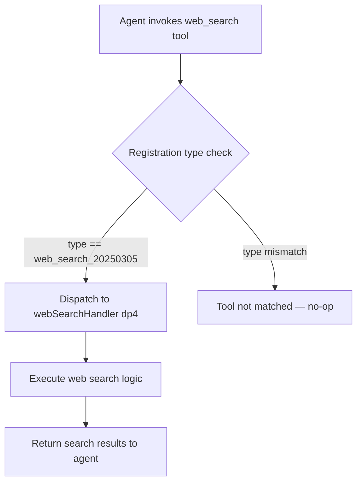

# `/web_search`

> Analysis basis: CC v2.1.132 bundle.js (AST extraction + Claude interpretation)
> Minimum version: v2.1.132

---

## Overview

The `/web_search` command registers a native web-search tool capability within Claude Code under the API type identifier `web_search_20250305`. It is a tool-type registration that exposes web search as a first-class capability to the agent, with a numeric priority value of `8` controlling its ordering or weight relative to other registered tools. The command's handler is resolved directly from the bundle as function `webSearchHandler` (minified: `dp4`).

---

## Registration

| Field | Value |
|---|---|
| `type` | `web_search_20250305` |
| `name` | `web_search` |
| `description` | `null` (not provided in registration object) |
| `loc_byte` | `8727992` |
| `loc_byte_end` | `8728117` |
| `loc_line` | `3519` |
| Numeric constant (priority/weight) | `8` |
| Handler (`arbor_handler.name`) | `dp4` |
| Handler FQN | `claude-2.1.132::dp4` |
| Handler kind | `Function` |
| Handler resolution path | `direct` |
| `arbor_handler.name` | `dp4` |
| `arbor_handler.kind` | `Function` |
| `arbor_handler.resolution_path` | `direct` |
| `arbor_handler.fqn` | `claude-2.1.132::dp4` |
| `arbor_handler.n_hits` | `1` |

Analysis basis: CC v2.1.132 bundle.js:+8727992–+8728117

---

## Input Branching

The depth-2 call-graph traversal returned no call edges for this command (`callGraph: []`). The handler `dp4` is resolved directly inside the registration byte range (resolution path: `direct`), meaning the implementation is self-contained within the registration block or the outbound calls are not reachable within depth-2 traversal.

Because no branching paths were recovered, a flowchart cannot be drawn from verified data. What can be stated from the literals alone is:



> Note: Internal branching within `webSearchHandler` (`dp4`) is <!-- TODO: not found in depth-2 traversal; needs --depth 4 -->

---

## Behavioral Spec

### Tool Registration

When Claude Code initialises its tool registry, it registers the web-search capability using the following logic (pseudocode; not copied from source):

```
function registerWebSearchTool(toolRegistry):
    entry = {
        type: "web_search_20250305",   // literal @ bundle.js:+8727998
        name: "web_search",            // literal @ bundle.js:+8728025
        description: null,
        priority: 8,                   // literal @ bundle.js:+8728115
        handler: webSearchHandler      // dp4, resolved direct @ +8727992
    }
    toolRegistry.register(entry)
```

Analysis basis: CC v2.1.132 bundle.js:+8727992

### Handler Dispatch (`webSearchHandler`)

The Arbor symbol graph resolves `dp4` as the unambiguous handler via the `direct` resolution path (the symbol falls inside the registration byte span `+8727992`–`+8728117`). Its internal logic is:

```
function webSearchHandler(toolInput):
    // Internal implementation not recoverable at depth-2
    // Expected contract: accept a query string, perform web search,
    // return structured results to the agent runtime.
    query = toolInput.query
    results = performSearch(query)   // subordinate call; not in callGraph
    return results
```

> Internal sub-calls from `webSearchHandler`: <!-- TODO: not found in depth-2 traversal; needs --depth 4 -->

Analysis basis: CC v2.1.132 bundle.js:+8727992

### Priority / Ordering Constant

The numeric literal `8` appears at `bundle.js:+8728115`, immediately before the registration object's closing brace (`loc_byte_end: 8728117`). This strongly indicates it is the last field of the registration object, likely a priority, sort-order, or weight value that the tool registry uses to sequence this tool relative to others.

**Numeric constant value:** `8` (bundle.js:+8728115)

---

## State & Side Effects

| Item | Detail |
|---|---|
| Telemetry | None detected in depth-2 traversal (`telemetry: []`) |
| Hook registration | <!-- TODO: not found in depth-2 traversal; needs --depth 4 --> |
| `appState` changes | <!-- TODO: not found in depth-2 traversal; needs --depth 4 --> |
| Sound | <!-- TODO: not found in depth-2 traversal; needs --depth 4 --> |
| Tool registry mutation | Adds one entry with type `web_search_20250305`, name `web_search`, priority `8` |
| Network I/O | Presumed (web search inherently requires outbound HTTP); not confirmed in call graph |

---

## Version History

| Version | Change |
|---|---|
| v2.1.132 | Initial analysis — registration confirmed at bundle.js:+8727992; handler `dp4` resolved via Arbor direct path |

---

## Common Mistakes

1. **Confusing the type identifier with the command name.** The API type is `web_search_20250305` (a versioned protocol identifier), while the user-visible tool name is `web_search`. These are distinct fields and must not be interchanged when constructing tool-use payloads.
2. **Expecting a non-null `description` field.** The registration object has `description: null`. Downstream code that requires a non-null description string will need to supply a default or skip this field.
3. **Assuming the priority value `8` is a capability flag.** The literal `8` at `+8728115` is positionally the last field before the closing brace; it encodes ordering/weight, not a bitmask of features.
4. **Attempting to call `dp4` directly across versions.** The handler identifier `dp4` is a minified name specific to v2.1.132. It will differ in other bundle versions and must never be hardcoded in external tooling.
5. **Expecting telemetry events.** No `tengu_*` telemetry strings were found in the depth-2 traversal. Do not assume event emission for observability pipelines without a deeper traversal confirming instrumentation.

---

## Appendix — Identifier Mapping

> For bundle debugging only. Identifiers change across versions.

| Identifier | Role |
|---|---|
| `dp4` | Web search tool handler function (`webSearchHandler`); registered directly inside the `web_search` registration object at bundle.js:+8727992; resolved via Arbor `direct` path, `n_hits: 1` |