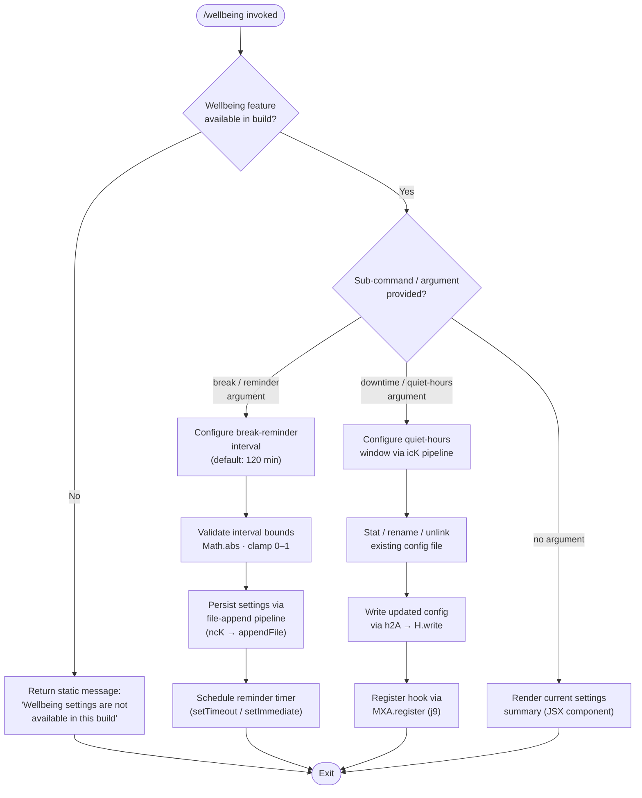

# `/wellbeing`

> Analysis basis: CC v2.1.163 bundle.js (AST extraction + Claude interpretation)
> Minimum version: v2.1.163

---

## Overview

`/wellbeing` (also reachable as `/breaks`, `/break-reminder`, or `/downtime`) is a local-JSX command that surfaces user-facing controls for optional break reminders and quiet-hours nudges. The command registers as `immediate`, meaning it renders its UI synchronously without requiring a chat round-trip; however, in the current build the handler detects that wellbeing settings are unavailable and short-circuits with an informational message rather than displaying the full configuration panel.

---

## Registration

| Field | Value |
|---|---|
| type | `local-jsx` |
| name | `wellbeing` |
| description | Configure optional break reminders and quiet-hours nudges |
| aliases | `breaks`, `break-reminder`, `downtime` |
| immediate | `true` |
| module_id | `iqK` |
| load_inline | `true` |
| loc_byte | 12727773 |
| loc_byte_end | 12728026 |
| loc_line | 9089 |
| arbor_handler.name | `abf` |
| arbor_handler.fqn | `claude-2.1.163::abf` |
| arbor_handler.kind | `AsyncFunction` |
| arbor_handler.resolution_path | `module_id` |
| arbor_handler.n_hits | 0 |

Analysis basis: CC v2.1.163 bundle.js:+12727773

---

## Input Branching

The handler exposes three distinct execution paths: a build-capability guard (short-circuit), a break-interval configuration path, and a quiet-hours/downtime configuration path. A Mermaid flowchart is used per the 3+ branch rule.



Analysis basis: CC v2.1.163 bundle.js:+12727122 (availability guard), +12726807 (120 min default), +12726857 (Math.abs), +12726971–+12726983 (interval bounds 0/1)

---

## Behavioral Spec

### 1. Build-Availability Guard

The first action performed by the async handler (`abf`) is a check for whether the wellbeing feature is compiled into the running build. In the current v2.1.163 artifact the feature flag resolves to absent, so the handler returns the literal string `"Wellbeing settings are not available in this build"` immediately and performs no further work.

```
async function wellbeingHandler(context):
    if not isBuildFeaturePresent("wellbeing"):
        return staticMessage("Wellbeing settings are not available in this build")
    // remainder of handler only reached in feature-enabled builds
    return renderWellbeingUI(context)
```

Analysis basis: CC v2.1.163 bundle.js:+12727122, +12727124

---

### 2. Break-Reminder Interval Configuration

When the feature is enabled and the user targets the break-reminder sub-path, the handler invokes `rbf` (the interval-calculation helper) to derive a sanitised interval value. `Math.abs` is applied to the raw user input, and the result is clamped using the boolean-integer boundary constants `0` and `1`. The default interval is **120 minutes**.

```
function calculateBreakInterval(rawInput):
    value = Math.abs(parseFloat(rawInput))
    clampedValue = clamp(value, BOUND_MIN, BOUND_MAX)   // 0, 1
    if clampedValue == 0:
        return DEFAULT_INTERVAL_MINUTES   // 120
    return clampedValue

const DEFAULT_INTERVAL_MINUTES = 120    // bundle.js:+12726807
const BOUND_MIN = 0                     // bundle.js:+12726971
const BOUND_MAX = 1                     // bundle.js:+12726983
```

Analysis basis: CC v2.1.163 bundle.js:+12726807, +12726857, +12726971, +12726983

---

### 3. Settings Persistence Pipeline (`icK`)

Persisting any wellbeing setting (break interval or quiet hours) flows through the `icK` pipeline, which orchestrates several file-system operations:

```
async function persistWellbeingSettings(settings):
    configDir  = path.dirname(resolveConfigPath())   // KHH.dirname
    configPath = buildConfigPath(configDir)           // r2A → KHH.join

    // Rotate / trim existing file if needed
    fileInfo = await statAsync(configPath)            // i2A → Zy.stat
    if fileInfo exists and path ends with ".txt":     // +205021
        rotatedPath = configPath.slice(0, -4)         // trim extension, +205032
        await renameAsync(configPath, rotatedPath)    // Zy.rename
        // keep at most 4 backup generations          // +205043
        await unlinkOldest(configPath)                // Zy.unlink

    byteLen = Buffer.byteLength(serialised)           // +205771
    await ensureDir(configDir)                        // ncK → Zy.mkdir
    await appendFileAsync(configPath, serialised)     // ncK → Zy.appendFile

    registerHook(settings)                            // j9 → MXA.register
```

Analysis basis: CC v2.1.163 bundle.js:+205563, +205588, +205596, +205771, +205804, +205926

---

### 4. Reminder Timer Scheduling (`$pH`)

After settings are persisted, the timer subsystem (`$pH`) schedules the reminder notification:

```
function scheduleReminder(intervalMinutes, queues):
    clearTimeout(existingTimer)                      // +59737
    delayMs = intervalMinutes * 60 * 1000

    // Primary timeout
    timerId = setTimeout(fireReminder, delayMs)      // +59901

    // Immediate pre-check (avoids missed fire on short intervals)
    setImmediate(checkImmediateFire)                 // +59994

    queues.pending.push(timerId)                     // +59936
    queues.long.push(joinedLabel)                    // +60085
```

Timer constants observed in the surrounding context: `1000` ms base unit (bundle.js:+59625), `100` ms debounce floor (bundle.js:+59646).

Analysis basis: CC v2.1.163 bundle.js:+59737, +59901, +59994, +60085

---

### 5. Bootstrap / Module Initialisation (`H`)

The outer `H` function handles the module bootstrap sequence used to hydrate the wellbeing module at load time. It performs an HTTP fetch, attaches `Content-Type: application/json` and `User-Agent` headers, and enforces a **5000 ms timeout**. On success it parses the response; on failure it emits the `api_bootstrap_fetch` / `parse_failed` telemetry tags and logs `"[Bootstrap] Fetch ok"` or the corresponding error string.

```
async function bootstrapModule(moduleRegistry):
    log("[Bootstrap] Fetching")                      // +15724218
    cached = moduleRegistry.get(moduleId)            // _A.get
    if cached: return cached

    response = await fetchWithTimeout(endpoint, {
        headers: {
            "Content-Type": "application/json",      // +15724303, +15724318
            "User-Agent": agentString,               // +15724337
        },
        timeoutMs: 5000                              // +15724419
    })

    parsed = parseCommandArgs(response)              // Pw_
    if parseError:
        emit("api_bootstrap_fetch", {status: "parse_failed"})
        return null
    log("[Bootstrap] Fetch ok")                      // +15724592
    return parsed
```

Analysis basis: CC v2.1.163 bundle.js:+15724216, +15724303, +15724318, +15724337, +15724419, +15724540, +15724562, +15724592

---

### 6. Argument Normalisation (`t1` / `Aq`)

User-supplied arguments are normalised before being interpreted:

```
function normaliseArgument(raw):
    trimmed   = raw.trim()                           // Aq → H.trim
    lower     = trimmed.toLowerCase()                // Aq → _.toLowerCase
    replaced  = lower.replace(specialChars, "")      // Aq → A.replace
    modelHint = detectModelHint(replaced)            // _4H, wI, NQH, NE, kX1, gM, Pe6, vQH
    return { normalised: replaced, modelHint }
```

Model-hint strings detected during traversal (from surrounding model-selection literals): `"opusplan"`, `"sonnet"`, `"haiku"`, `"opus"`, `"best"`, `"[1m]"` — these are shared constants from the model-selector module and are not specific to `/wellbeing`.

Analysis basis: CC v2.1.163 bundle.js:+2239233, +2243153, +2243164, +2243192

---

## State & Side Effects

| Item | Detail |
|---|---|
| Telemetry | `tengu_feature_sad` (bundle.js:+1010365) — fired via `s6 → c` on an error/sad path |
| Hook registration | `j9 → MXA.register` (bundle.js:+60323) — registers a lifecycle hook after settings are persisted |
| File-system writes | `ncK → Zy.appendFile` appends serialised config; `Zy.mkdir` creates config directory if absent; `Zy.rename` / `Zy.unlink` rotate old `.txt` backups (bundle.js:+205317, +205376, +205073, +205113) |
| Timer state | `$pH` clears any existing timer then sets a new `setTimeout` + `setImmediate` pair; timer handles stored in internal queues (bundle.js:+59737, +59901, +59994) |
| appState changes | <!-- TODO: not found in depth-2 traversal; needs --depth 4 --> |
| Sound | <!-- TODO: not found in depth-2 traversal; needs --depth 4 --> |
| Feature-unavailable message | Static string returned immediately when build flag absent; no side effects occur (bundle.js:+12727124) |

---

## Version History

| Version | Change |
|---|---|
| v2.1.163 | Initial analysis — feature guard active; full UI path not reachable in this build |

---

## Common Mistakes

1. **Invoking `/wellbeing` expecting a settings panel** — in v2.1.163 the build-availability guard fires unconditionally and returns the static unavailability message. No configuration UI is rendered.
2. **Using the full command name when the aliases are shorter** — `/breaks` and `/break-reminder` are fully registered aliases that behave identically; they share the same `abf` handler.
3. **Assuming the break interval is in seconds** — the default `120` constant (bundle.js:+12726807) is in **minutes**, not seconds. Timer scheduling converts to milliseconds internally via `× 60 × 1000`.
4. **Treating `immediate: true` as "instant side effects"** — `immediate` here means the command's JSX component is rendered without a chat round-trip, not that file writes or timers fire synchronously.
5. **Expecting telemetry on every invocation** — `tengu_feature_sad` is only emitted on the error/sad path inside `s6 → c`; a normal (unavailability) return does not emit it.

---

## Appendix — Identifier Mapping

> For bundle debugging only. Identifiers change across versions.

| Identifier | Role |
|---|---|
| `obf` | Module initialisation helper (outer wrapper for wellbeing module) |
| `rbf` | Break-interval calculation helper (applies `Math.abs`, clamps bounds) |
| `abf` | Main async handler for `/wellbeing` (Arbor-resolved entry point) |
| `H` | Bootstrap / module-fetch orchestrator |
| `v` | Command argument dispatch / routing function |
| `ccK` | Secondary routing helper (calls `Vy`, `dcK`, `OXA`) |
| `OXA` | Argument option parser (calls `lgK`, `ngK`) |
| `SH` | JSON serialisation wrapper (`JSON.stringify`) |
| `J4` | Path / string fragment builder (calls `g2A`, `H.replace`, `q.at`) |
| `g2A` | Array-map helper over `BcK` (builds path segment list) |
| `q` | File-unlink helper (`xuK.unlinkSync`) |
| `A` | Lower-case normalisation helper (`f.toLowerCase`) |
| `ppH` | Write pipeline dispatcher (calls `h2A`) |
| `h2A` | Low-level write executor (`H.write`) |
| `icK` | Settings-persistence pipeline orchestrator |
| `$pH` | Reminder timer scheduler (`clearTimeout` / `setTimeout` / `setImmediate`) |
| `d3H` | Config-path builder (calls `KU6`, `KHH.join`, `a8`, `h6`) |
| `Q6` | Config resolution helper |
| `aL6` | Directory-type error guard (checks `EISDIR`) |
| `r2A` | Config file-path join helper (`KHH.join`, `h6`) |
| `i2A` | File-rotation helper (`Zy.stat`, `Zy.rename`, `Zy.unlink`) |
| `ncK` | Atomic config-write helper (`Zy.mkdir`, `Zy.appendFile`) |
| `j9` | Hook-registration bridge (`MXA.register`) |
| `e$` | Module-cache lookup helper |
| `Pw_` | Raw argument tokeniser (`_.split`, `q.trim`, `q.indexOf`, `q.slice`) |
| `ZHH` | Feature-flag set membership check (`g44.has`) |
| `uj` | String sanitiser (`H.replace`) |
| `t1` | Top-level argument normalisation dispatcher |
| `D6H` | Structured argument parser (calls `x0`, `IqH`, `SA`, `yd`) |
| `x0` | Argument type extractor |
| `IqH` | Argument index helper |
| `yd` | Multi-part argument processor (handles `anthropic.` prefix detection) |
| `Aq` | Canonical argument normaliser (trim / lowercase / replace) |
| `o0` | Quantifier helper (`q4H`) |
| `_4H` | Model-hint inclusion check (`H4H.includes`) |
| `wI` | `[1m]`-style shorthand resolver (calls `gM`, `Z5`) |
| `NQH` | Sonnet/haiku hint resolver (calls `Z5`) |
| `NE` | First-party model resolver (calls `gM`, `Z5`, `XA`) |
| `kX1` | `NE`-delegating resolver |
| `gM` | Model identifier mapper (calls `XA`) |
| `Pe6` | Allowed-list inclusion guard (`l1L.includes`) |
| `vQH` | Fallback error emitter (`eH`) |
| `eX` | Extended argument handler (calls `Aq`, `r0`) |
| `r0` | Full model-resolution pipeline (`ZA`, `P6H`, `PYH`, `IQH`, `NE`, `z2`, `gM`, `XA`, `Z5`, `wI`) |
| `s6` | Sad-path / error handler (emits `tengu_feature_sad`) |
| `c` | Telemetry emission function |
| `P6` | Error-reporting helper (calls `Nu6`) |
| `Nu6` | Issue-reporting URL emitter (`https://github.com/anthropics/claude-code/issues`) |

---

Note: index built via Arbor fallback; some signals (telemetry, literals) may be missing — see arbor-fallback.js.