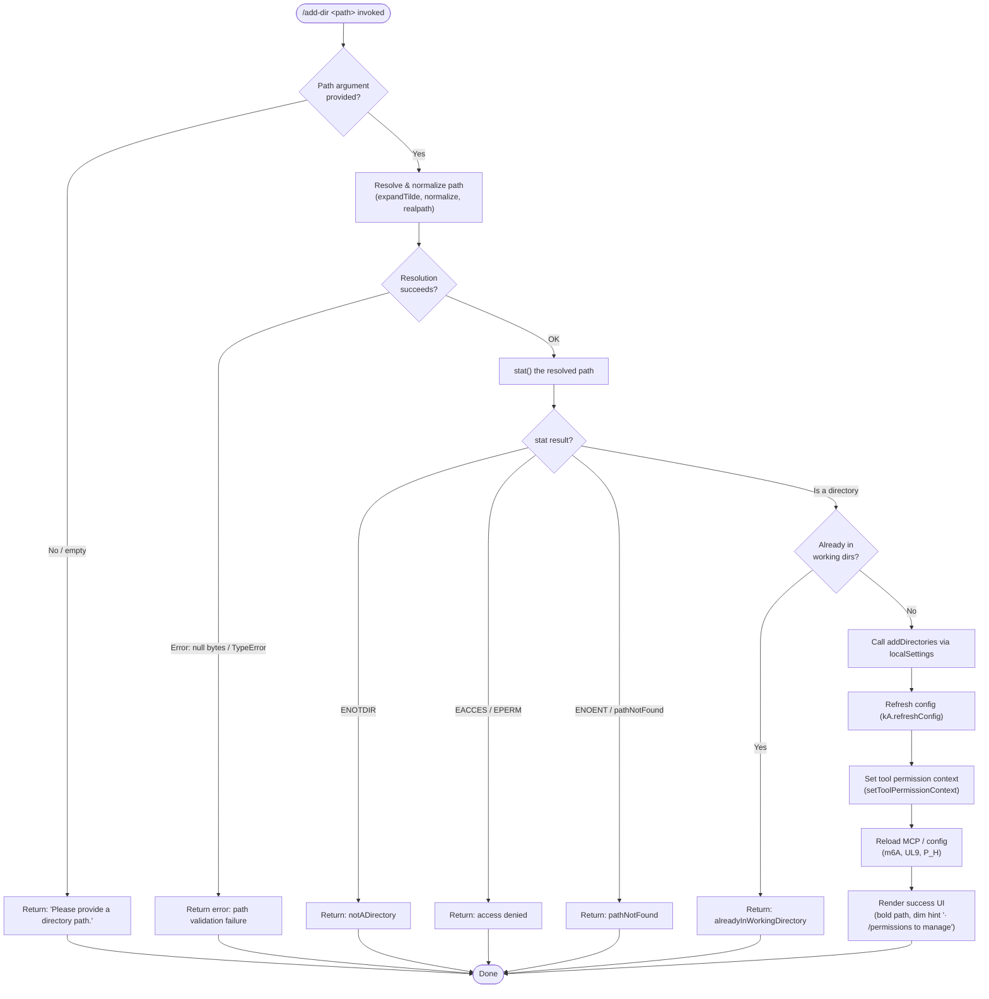

# `/add-dir`

> Analysis basis: CC v2.1.165 bundle.js (AST extraction + Claude interpretation)
> Minimum version: v2.1.165

---

## Overview

`/add-dir` registers an additional filesystem directory as a working directory for the current Claude Code session. It accepts a single path argument, validates that the path refers to an accessible directory, and then persists the addition via `addDirectories` in local settings — making the new directory available to file-access tools for the remainder of the session.

---

## Registration

| Field | Value |
|---|---|
| type | `local-jsx` |
| name | `add-dir` |
| description | `Add a new working directory` |
| argumentHint | `<path>` |
| module_id | `Mxq` |
| load_inline | `true` |
| loc_byte | `10919741` |
| loc_byte_end | `10919889` |
| loc_line | `7234` |
| arbor_handler.name | `dOf` |
| arbor_handler.fqn | `claude-2.1.165::dOf` |
| arbor_handler.kind | `AsyncFunction` |
| arbor_handler.resolution_path | `module_id` |
| arbor_handler.n_hits | `0` |

Analysis basis: CC v2.1.165 bundle.js:+10919741

---

## Input Branching

The command has 5+ distinct outcome branches (empty path, path-resolve error, not-a-directory, access denied/not-found, already-in-working-directory, success), so a Mermaid flowchart is used.



Analysis basis: CC v2.1.165 bundle.js:+10918522, +3844479, +3844577, +3844667, +3844722, +3844847, +3844923

---

## Behavioral Spec

### 1. Entry Point — `addDirHandler` (`dOf`)

The primary handler is the async function `dOf`, resolved via module `Mxq`.

```
async function addDirHandler(args, context):
    inputPath = args[0]  // raw string from CLI

    // Step 1: retrieve current app state
    state = getAppState(context)  // via stateAccessor (R_)

    // Step 2: validate and resolve path
    resolveResult = resolveWorkingDirectory(inputPath)
    // → may return { kind: "emptyPath" } | { kind: "notADirectory" } |
    //              { kind: "pathNotFound" } | { kind: "alreadyInWorkingDirectory" } |
    //              { kind: "success", path: resolvedPath }

    if resolveResult.kind != "success":
        return renderErrorUI(resolveResult)

    resolvedPath = resolveResult.path

    // Step 3: update settings
    updateLocalSettings("addDirectories", [resolvedPath])  // literal "addDirectories" +10918558

    // Step 4: set tool permission context
    context.setToolPermissionContext(resolvedPath)  // +10918632

    // Step 5: sync permission rules (J$)
    syncPermissionRules(context)

    // Step 6: refresh runtime config
    kA.refreshConfig()  // +10918716

    // Step 7: persist config file (m6A) — realpath, mkdir, appendFile
    persistConfigChanges(resolvedPath)

    // Step 8: update background state (UL9)
    updateBackgroundState()

    // Step 9: refresh tool/command lists (P_H)
    refreshToolAndCommandLists()

    // Step 10: render success UI
    return renderSuccessUI(resolvedPath)
```

Analysis basis: CC v2.1.165 bundle.js:+10918522, +10918558, +10918605, +10918632, +10918716

---

### 2. State Lookup — `stateAccessor` (`R_`)

```
function stateAccessor(context):
    appState = H.getAppState()                      // +10916285
    workingDir = appState.find("working_directory") // literal +10916390
    allowedTools = appState.find("allowed_tools")   // literal +10916445
    disallowedTools = appState.find("disallowed_tools") // literal +10916500
    avoidPrompts = appState.find("avoid_prompts")   // literal +10916561

    // findLast used for most-recent config layer  // +10916365
    return { workingDir, allowedTools, disallowedTools, avoidPrompts }
```

Analysis basis: CC v2.1.165 bundle.js:+10916285, +10916365, +10916390

---

### 3. Path Resolution — `resolveWorkingDirectory` (`hnH` → `Z1`)

```
function resolveWorkingDirectory(rawPath):
    if rawPath is empty or whitespace:
        return { kind: "emptyPath" }    // literal +3844479

    normalizedPath = normalizePath(rawPath)
    // expandTilde: replace leading "~/" with homedir()  // +1053121
    // normalize unicode NFC                             // +177636
    // iv.normalize, iv.isAbsolute, iv.resolve           // +1053250, +1053304

    if normalizedPath contains null bytes:
        raise TypeError("Path contains null bytes")     // literal +1052993

    statResult = fs.stat(resolvedPath)                  // L19.stat +3844532

    if statResult.error.code == "ENOTDIR":
        return { kind: "notADirectory" }                // literal +3844577
    if statResult.error.code in ["EACCES", "EPERM"]:
        return { kind: "accessDenied" }                 // literals +3844682, +3844696
    if statResult.error.code is other (ENOENT etc.):
        return { kind: "pathNotFound" }                 // literal +3844722

    if resolvedPath already in current workingDirectories:
        return { kind: "alreadyInWorkingDirectory" }    // literal +3844847

    return { kind: "success", path: resolvedPath }      // literal +3844923
```

Analysis basis: CC v2.1.165 bundle.js:+3844479, +3844532, +3844577, +3844667, +3844682, +3844696, +3844722, +3844847, +3844923, +1052993

---

### 4. Permission Rule Sync — `permissionRuleSync` (`J$`)

```
function permissionRuleSync(context):
    // Handles addRules, replaceRules, removeRules operations
    // on alwaysAllowRules, alwaysDenyRules, alwaysAskRules

    for each operation in ["addRules", "replaceRules", "removeRules"]:  // literals +4752117, +4752465, +4753122
        applyRuleOperation(operation, context)

    // Also handles removeDirectories  // literal +4753506
    // bypassPermissions mode guard:
    if operation.mode == "bypassPermissions":           // literal +4751775
        if bypassPermissionsDisabled:
            log("Ignoring permission update: setMode 'bypassPermissions' rejected...")
            // literal +4751841
            return

    // Sync allow/deny maps using A.set / A.delete      // +4753035, +4753734
```

Analysis basis: CC v2.1.165 bundle.js:+4751775, +4751841, +4752117, +4752302, +4752342, +4752465, +4753122, +4753506

---

### 5. Config Persistence — `persistConfigChanges` (`m6A`)

```
async function persistConfigChanges(resolvedPath):
    // Determine environment
    env = getEnvironment()  // checks "production" / "test"  // literals +13168338, +13168435

    // Normalize path (NFC unicode normalization)  // +177636
    realPath = zL.realpath(resolvedPath)           // +13168675

    // Locate or create config directory
    configDir = XD.join(configBase, ...)           // +13168833
    await zL.mkdir(configDir, { recursive: true }) // +13168958

    // Read existing config file (utf8)             // literal +13168876
    existing = await zL.readFile(configPath, "utf8")

    // Append new directory entry
    await zL.appendFile(configPath, entry)         // +13169039

    // Log errors via kH (error logger)            // +13168935
```

Analysis basis: CC v2.1.165 bundle.js:+13168675, +13168833, +13168876, +13168958, +13169039

---

### 6. Background State Update — `backgroundStateUpdate` (`UL9`)

```
async function backgroundStateUpdate():
    // Clean stale state entries (oj)              // +4163455
    // Read current bg task states (e9)            // +4163473
    //   - Uses I2.stat, I2.readFile on state files
    //   - Tracks order ("order"), stateOrder      // literals +4160007, +4160028
    //   - Marks unknown states as "warn"          // literal +4160374
    //   - Emits tengu_bg_state_read_transient     // +4160428

    // Flush pending writes (ff)                   // +4163638
    //   - Uses MY (atomic write: randomBytes → writeFile → rename)
    //   - Constants: 4 random bytes, "hex" encoding  // literals +2283650, +2283662

    // Reload error logger (kH) if needed          // +4163749
```

Analysis basis: CC v2.1.165 bundle.js:+4163455, +4163473, +4163638, +4160428

---

### 7. Success / Error UI Rendering

```
function renderSuccessUI(resolvedPath):
    boldPath = j6.bold(resolvedPath)              // +10918794
    hint = j6.dim("· /permissions to manage")    // literal +10919087, +10919080
    return JSX: display boldPath + hint

function renderErrorUI(resolveResult):
    switch resolveResult.kind:
        "emptyPath":
            return "Please provide a directory path."  // literal +3845008
        "notADirectory":
            return notADirectoryMessage(resolveResult)  // +3844577 / SnH +10919318
        "pathNotFound":
            return pathNotFoundMessage()
        "alreadyInWorkingDirectory":
            return alreadyTrackedMessage()
        default:
            return "Did not add a working directory."  // literal +10919223
                   + "Unknown error"                   // literal +10918979
```

Analysis basis: CC v2.1.165 bundle.js:+10918794, +10919080, +10919087, +10919223, +10918979, +3845008, +10919318

---

## State & Side Effects

| Item | Detail |
|---|---|
| Telemetry: `tengu_feature_sad` | Fired on a feature-level sad path (error/failure branch) — bundle.js:+1010365 |
| Telemetry: `tengu_daemon_config_reload` | Fired after daemon config is reloaded following directory addition — bundle.js:+16149069 |
| Telemetry: `tengu_bg_state_read_transient` | Fired during background state reconciliation in `backgroundStateUpdate` — bundle.js:+4160428 |
| Config persistence | Appends new directory to config file via `zL.appendFile`; creates directory tree if missing — bundle.js:+13168958, +13169039 |
| `kA.refreshConfig()` | Synchronously refreshes runtime config after settings mutation — bundle.js:+10918716 |
| `setToolPermissionContext` | Updates tool permission context for the new directory scope — bundle.js:+10918632 |
| Permission rule sync (`J$`) | Re-evaluates and persists `alwaysAllowRules`, `alwaysDenyRules`, `alwaysAskRules` — bundle.js:+4752302, +4752342 |
| MCP / tool list refresh (`P_H`) | Refreshes available tools and MCP command lists to include new directory scope — bundle.js:+10918776 |
| Background state flush (`UL9`) | Performs atomic writes for background task state — bundle.js:+4163638 |
| Sound | None observed in depth-2 traversal |
| appState changes | Adds entry to `working_directory` tracked list; `localSettings.addDirectories` updated — literals +10916390, +10918558 |

---

## Version History

| Version | Change |
|---|---|
| v2.1.165 | Initial analysis |

---

## Common Mistakes

1. **Providing a file path instead of a directory path** — `/add-dir /some/file.txt` will fail with a `notADirectory` error because the command calls `stat()` and checks for directory type.
2. **Providing a path already registered** — If the resolved path is already in the session's working directory list, the command returns `alreadyInWorkingDirectory` and does not duplicate the entry.
3. **Using a relative path without a clear CWD context** — Paths are resolved via `iv.resolve` relative to the process working directory; an ambiguous relative path may resolve to an unexpected location. Prefer absolute or `~/`-prefixed paths.
4. **Paths with null bytes** — Any path containing null bytes triggers an immediate `TypeError` before filesystem access occurs.
5. **Expecting `/add-dir` to persist across all projects** — The addition is written to `localSettings` (project-local scope), not to global user settings. It applies only to the current project's config.
6. **Bypassing permission mode conflicts** — If `disableBypassPermissionsMode` is active, any subsequent `setMode bypassPermissions` calls from the new directory context will be silently rejected with a log-only warning.

---

## Appendix — Identifier Mapping

> For bundle debugging only. Identifiers change across versions.

| Identifier | Role |
|---|---|
| `dOf` | Main async handler for `/add-dir` (`addDirHandler`) |
| `R_` | App state accessor / working-directory config reader (`stateAccessor`) |
| `H` | Bootstrap / app-state host object (`appStateHost`) |
| `v` | Path utility / validation helper (`pathValidator`) |
| `icK` | Inner path component checker (`pathComponentChecker`) |
| `SH` | JSON serialization helper (`jsonSerializer`) |
| `J4` | Path string manipulation utility (`pathStringUtil`) |
| `ppH` | Path component processor (`pathComponentProcessor`) |
| `acK` | Directory context accumulator (`dirContextAccumulator`) |
| `e$` | Config entry accessor (`configEntryAccessor`) |
| `Gw_` | String split/trim utility (`stringSplitUtil`) |
| `ZHH` | Set-membership checker (`setMembershipChecker`) |
| `uj` | String replace helper (`stringReplaceHelper`) |
| `e1` | Config layer resolver (`configLayerResolver`) |
| `D6H` | Deep config getter (`deepConfigGetter`) |
| `Aq` | Config key normalizer (`configKeyNormalizer`) |
| `eX` | Config entry extractor (`configEntryExtractor`) |
| `s6` | Feature flag accessor (`featureFlagAccessor`) |
| `c` | Base constant / primitive helper (`baseConstant`) |
| `P6` | Numeric utility (`numericUtil`) |
| `A` | Array/collection helper (`arrayHelper`) |
| `f` | File handle / stream helper (`fileStreamHelper`) |
| `L` | Lifecycle / set manager (`lifecycleSetManager`) |
| `pk8` | Permission rule applicator A (`permRuleApplicatorA`) |
| `Uk8` | Permission rule applicator B (`permRuleApplicatorB`) |
| `L1` | Permission rule base processor (`permRuleBaseProcessor`) |
| `J$` | Permission rule sync orchestrator (`permRuleSyncOrchestrator`) |
| `pM` | Path escaper / formatter (`pathEscapeFormatter`) |
| `zT4` | String replaceAll helper (`stringReplaceAllHelper`) |
| `K` | Map/set collection (`mapSetCollection`) |
| `Gy` | State guard / gate function (`stateGate`) |
| `Y` | Supervisor / watcher manager (`supervisorManager`) |
| `C0H` | MCP connection state checker (`mcpConnectionStateChecker`) |
| `N9` | Async store reader (`asyncStoreReader`) |
| `v8` | Error code checker (`errorCodeChecker`) |
| `X7A` | MCP slot comparator (`mcpSlotComparator`) |
| `EH` | String coercion helper (`stringCoercionHelper`) |
| `aLK` | MCP layout/metrics calculator (`mcpMetricsCalculator`) |
| `E` | Event / keyboard handler (`eventKeyboardHandler`) |
| `b` | DOM event object (`domEventObject`) |
| `t0` | Config reload trigger (`configReloadTrigger`) |
| `r_` | Full config reader (`fullConfigReader`) |
| `T` | Timer / scheduler object (`timerScheduler`) |
| `$mK` | Heartbeat / keepalive helper (`heartbeatHelper`) |
| `L8H` | Heartbeat interval constant (`heartbeatInterval`) |
| `V` | Secondary timer / process (`secondaryTimer`) |
| `t46` | Session/effort state accessor (`sessionEffortAccessor`) |
| `m6A` | Config file persistence handler (`configFilePersistenceHandler`) |
| `m0H` | Environment detector (`environmentDetector`) |
| `eH` | String coercion / truthy check (`stringTruthyCheck`) |
| `LMK` | Config location resolver (`configLocationResolver`) |
| `Lx` | Config path builder (`configPathBuilder`) |
| `MO` | Unicode NFC normalizer (`unicodeNFCNormalizer`) |
| `R8` | Error instance checker (`errorInstanceChecker`) |
| `JR` | Async utility (`asyncUtil`) |
| `uv` | Promise/async primitive (`promisePrimitive`) |
| `X_` | Async runner (`asyncRunner`) |
| `kH` | Error logger (`errorLogger`) |
| `HA` | Error/string coercer (`errorStringCoercer`) |
| `Dq` | Error detail extractor (`errorDetailExtractor`) |
| `xSA` | Error serializer (`errorSerializer`) |
| `qW4` | Log rotation helper (`logRotationHelper`) |
| `UL9` | Background state update orchestrator (`bgStateUpdateOrchestrator`) |
| `oj` | Stale state cleaner (`staleStateCleaner`) |
| `e9` | Background state reader (`bgStateReader`) |
| `tf` | Error code matcher (`errorCodeMatcher`) |
| `B6` | JSON parse wrapper (`jsonParseWrapper`) |
| `ff` | Atomic file flush helper (`atomicFileFlushHelper`) |
| `MY` | Atomic write implementation (`atomicWriteImpl`) |
| `P_H` | Tool and command list refresher (`toolCommandListRefresher`) |
| `XN_` | Command list initializer (`commandListInitializer`) |
| `GO9` | Tool permission context builder (`toolPermContextBuilder`) |
| `TP6` | Tool entry processor (`toolEntryProcessor`) |
| `x8` | Tool path resolver (`toolPathResolver`) |
| `KiL` | Tool context item builder (`toolContextItemBuilder`) |
| `cO` | Path canonicalizer (`pathCanonicalizer`) |
| `R$` | Realpath sync wrapper (`realpathSyncWrapper`) |
| `Q6` | Path existence checker (`pathExistenceChecker`) |
| `oP` | Permission checker (`permissionChecker`) |
| `MiL` | Tool metadata builder (`toolMetadataBuilder`) |
| `y3` | Tool description formatter (`toolDescriptionFormatter`) |
| `DT4` | Tool description base builder (`toolDescBaseBuilder`) |
| `PE` | Object.hasOwn wrapper (`objectHasOwnWrapper`) |
| `wT4` | Tool description part builder (`toolDescPartBuilder`) |
| `YT4` | Tool description escaper (`toolDescEscaper`) |
| `M` | MCP manager / tool registry (`mcpToolRegistry`) |
| `AbH` | MCP connection orchestrator (`mcpConnectionOrchestrator`) |
| `eU8` | MCP connection result applier (`mcpConnectionResultApplier`) |
| `$` | NKK accessor / state notifier (`stateNotifier`) |
| `IYA` | MCP remote retry manager (`mcpRemoteRetryManager`) |
| `hnH` | Path resolve and stat validator (`pathResolveStatValidator`) |
| `Z1` | Path normalization and validation core (`pathNormalizationCore`) |
| `b6` | Store context getter (`storeContextGetter`) |
| `bd6` | Context store accessor (`contextStoreAccessor`) |
| `$a` | Async runner alias (`asyncRunnerAlias`) |
| `yI` | Path alias expander (macOS `/var`→`/tmp`) (`pathAliasExpander`) |
| `$5A` | Platform path rule resolver (`platformPathRuleResolver`) |
| `Nz` | Case-insensitive path comparator (`caseInsensitivePathComparator`) |
| `yHH` | Path final validator (`pathFinalValidator`) |
| `SnH` | Error UI renderer for add-dir (`addDirErrorUIRenderer`) |

---

Note: index built via Arbor fallback; some signals (telemetry, literals) may be missing — see arbor-fallback.js.