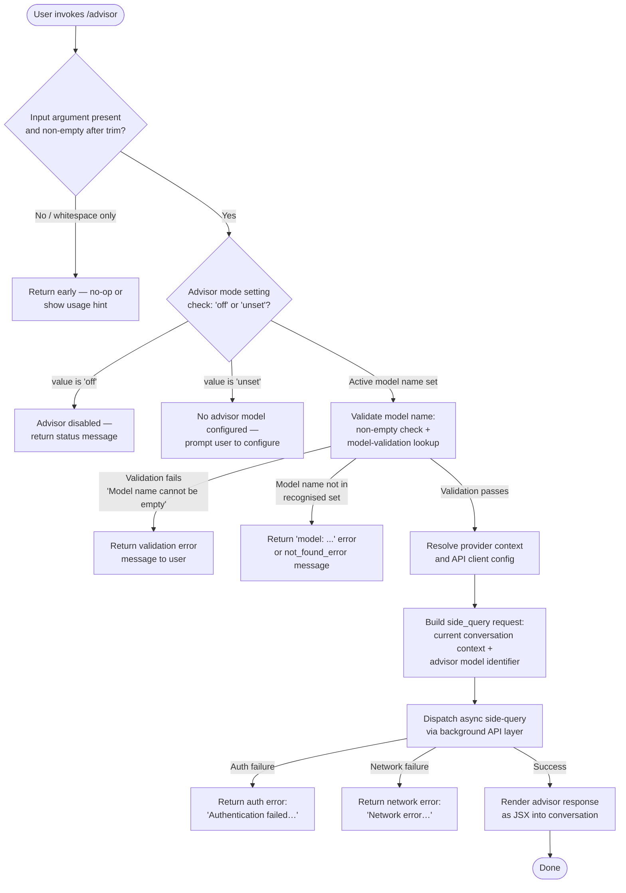

# `/advisor`

> Analysis basis: CC v2.1.165 bundle.js (AST extraction + Claude interpretation)
> Minimum version: v2.1.165

---

## Overview

The `/advisor` command allows Claude Code to consult a stronger (typically larger) model at key moments during a session, acting as an advisory consultation mechanism. It is implemented as an async JSX-returning handler (`sRf`) that validates the target model name, performs a side-query API call to the advisor model, and renders the response back into the current conversation. The command integrates with the model-selection subsystem and the background API execution layer to deliver on-demand consultation without replacing the primary model.

---

## Registration

| Field | Value |
|---|---|
| type | `local-jsx` |
| name | `advisor` |
| description | `Let Claude consult a stronger model at key moments` |
| module_id | `A9K` |
| load_inline | `true` |
| loc_byte | `12631088` |
| loc_byte_end | `12631329` |
| loc_line | `9063` |
| argumentHint | `null` |
| isHidden | `null` |
| arbor_handler.name | `sRf` |
| arbor_handler.fqn | `claude-2.1.165::sRf` |
| arbor_handler.kind | `AsyncFunction` |
| arbor_handler.resolution_path | `module_id` |
| arbor_handler.n_hits | `1` |

Analysis basis: CC v2.1.165 bundle.js:+12631088

---

## Input Branching

The handler exhibits 4+ distinct branches: (1) empty/whitespace input guard, (2) model name validation via the model-validation subsystem, (3) advisor model invocation mode selection (`off` vs `unset` vs active model), and (4) the actual side-query dispatch path with error recovery sub-branches. A Mermaid flowchart is used.



---

## Behavioral Spec

### Top-level handler (`sRf`)

The handler is an `AsyncFunction` resolved via `module_id` path (`A9K`).

```
async function advisorCommandHandler(input, appContext):
    // 1. Input normalisation
    trimmedInput = input.trim()                          // sRf → A.trim  (+12630544)

    // 2. Render wrapper via JSX factory
    element = createElement(AdvisorComponent, props)    // sRf → NX.createElement (+12630580)

    // 3. Resolve argument / model name
    resolvedModel = resolveModelName(trimmedInput)       // sRf → Aq (+12630698)

    // 4. Execute model validation
    validationResult = runModelValidation(resolvedModel) // sRf → wC8 (+12630712)

    // 5. Build conversation context
    contextMessages = buildConversationContext(appContext) // sRf → H (+12630738)

    // 6. Check locale / capability flags
    localeCheck = checkLocaleFlags(resolvedModel)        // sRf → L06 (+12630786)

    // 7. Join and return result lines
    return resultLines.join(separator)                   // sRf → YaH.join (+12630855)
```

Analysis basis: CC v2.1.165 bundle.js:+12630544

---

### Model name resolution (`Aq`)

```
function resolveModelName(rawInput):
    trimmed = rawInput.trim()
    lower   = trimmed.toLowerCase()

    // Alias expansion — short tokens map to canonical model names
    if lower == "opusplan":   return expandedOpusPlan    // (+2243249)
    if lower == "sonnet":     return expandedSonnet      // (+2243290)
    if lower == "haiku":      return expandedHaiku       // (+2243329)
    if lower == "opus":       return expandedOpus        // (+2243368)
    if lower == "best":       return expandedBest        // (+2243405)
    // [1m] suffix handling                               // (+2243275)

    // Check inclusion list
    if not in allowedModelList(lower):
        raise or return error

    // Apply canonical replacement
    result = rawInput.replace(normalisationPattern, ...)

    // Validate non-emptiness
    if result.length == 0:
        raise "Model name cannot be empty"               // (+12622802)

    return result
```

Analysis basis: CC v2.1.165 bundle.js:+2243153

---

### Model validation execution (`wC8`)

```
function runModelValidation(modelName):
    // Guard: empty name
    if modelName.trim() == "":
        return error("Model name cannot be empty")       // (+12622802)

    modelLower = modelName.toLowerCase()                 // (+12622925)

    // Check against known-model set (s1K)
    if s1K.has(modelLower):                              // (+12623046)
        return cached validation result

    // Check model family inclusion list                  // (+12622944)
    if not H4H.includes(modelLower):
        // Not a recognised model — proceed to live validation

    // Attempt ephemeral probe API call                   // (+12623235)
    //   telemetry label: "model_validation"             // (+12623141)
    //   test message: "Hi"                              // (+12623210)
    validationResult = callAdvisorModel(modelName, "Hi")

    switch validationResult.status:
        case AUTH_ERROR:
            return "Authentication failed. Please check your API credentials."  // (+12623501)
        case NETWORK_ERROR:
            return "Network error. Please check your internet connection."       // (+12623603)
        case NOT_FOUND / type == "not_found_error":
            return "model: " + modelName                                         // (+12623804)
        case SUCCESS:
            s1K.set(modelLower, result)                  // (+12623254) — cache result
            return buildValidatedModelRef(modelName)     // (+12623295)
```

Analysis basis: CC v2.1.165 bundle.js:+12622765

---

### Advisor model alias mapping (`gRf`)

```
function expandAdvisorAlias(alias):
    aliasList = ["opus-4-8", "opus_4_8",   // (+12624071, +12624095)
                 "opus-4-7", "opus_4_7",   // (+12624140, +12624164)
                 "opus-4-6", "opus_4_6",   // (+12624209, +12624233)
                 "opus-4-5", "opus_4_5",   // (+12624278, +12624302)
                 "sonnet-4-6", "sonnet_4_6", // (+12624347, +12624373)
                 "sonnet-4-5", "sonnet_4_5"] // (+12624422, +12624448)

    canonicalBase = gM(alias)               // resolve via model-resolution subsystem
    aliasLower    = alias.toLowerCase()     // (+12624041)

    if aliasLower is in aliasList:
        return mapToCanonicalModelId(aliasLower)

    return Z5(canonicalBase)               // fall through to standard resolution
```

Analysis basis: CC v2.1.165 bundle.js:+12623350

---

### Side-query dispatch (`_m` / background API layer)

The side-query is labelled `"side_query"` in the API request context (literal at +13461613) and is dispatched as a background async operation.

```
async function dispatchSideQuery(modelId, messages, context):
    // Build request
    requestLabel = "side_query"                          // (+13461613)
    requestType  = "sideQuery"                           // (+13462984)

    // Determine token budget
    tokenBudget = Math.min(available, MAX_TOKENS)        // (+13462423)
    chunkSize   = 1024                                   // (+13461429)

    // Identify conversation role
    userRole = "user"                                    // (+13461185)

    // Hash payload for dedup
    payloadHash = crypto.createHash("sha256")            // (+13415401)
                       .update(payload, encoding)
                       .digest("hex")                    // (+13415428)

    // Dispatch to API
    response = await apiClient.complete(
        model    = modelId,
        messages = messages,
        context  = context,
        label    = requestLabel
    )

    // Emit success telemetry
    emit("tengu_api_success", metrics)                   // (+13463194)

    return response
```

Analysis basis: CC v2.1.165 bundle.js:+13461581

---

### Mode / advisor-state check

The literals `"off"` (+12630620) and `"unset"` (+12630631) correspond to the two disabled states of the advisor configuration. When the current advisor setting equals `"off"`, the feature is administratively disabled. When it equals `"unset"`, no advisor model has been configured by the user. Any other non-empty value is treated as a candidate model identifier and forwarded to model validation.

Analysis basis: CC v2.1.165 bundle.js:+12630620

---

### Conversation context assembly (`yd`)

```
function buildConversationContext(appState):
    systemPrompt = resolveSystemPrompt(appState)        // yd → SA
    messages     = appState.messages.map(normalise)     // yd → A.map (+2237134)

    for msg in messages:
        trimmed = msg.trim()                             // (+2237145, +2237171)

        if trimmed.startsWith("anthropic."):             // (+2237210)
            tag = extractModelTag(trimmed)

        if not trimmed.includes(excludePattern):         // (+2237225)
            include(trimmed)

    // Filter and format for advisor context
    formattedContext = applyContextFilters(messages)

    return formattedContext
```

Analysis basis: CC v2.1.165 bundle.js:+12622836

---

### Locale / capability flag check (`L06`)

```
function checkLocaleAndCapabilityFlags(modelName):
    lower = modelName.toLowerCase()                      // (+5437730)

    if lower.includes(capabilityToken):                  // (+5437753)
        return capabilityEnabled

    return capabilityDisabled
```

Analysis basis: CC v2.1.165 bundle.js:+12630786

---

## State & Side Effects

| Item | Detail |
|---|---|
| Telemetry | `tengu_api_success` (+13463194) — fired on successful advisor API response |
| Telemetry | `tengu_prompt_cache_1h_config` (+13421791) — fired when 1-hour prompt-cache config is applied to the side query |
| Telemetry | `tengu_lone_surrogate_sanitized` (+13462943) — fired if lone Unicode surrogates are sanitised from the response |
| Telemetry | `tengu_feature_sad` (+1010365) — fired on feature-level failure path |
| Telemetry | Various `tengu_bg_*` events (+16133657 … +16127821) — emitted by the background process/daemon layer used for side-query dispatch |
| Validation cache | `s1K` Map — validated model names are cached to avoid re-probing (+12623046, +12623254) |
| API side-effect | One additional API call issued to the advisor model under the `"side_query"` / `"sideQuery"` label; does not replace the primary model |
| Hook registration | <!-- TODO: not found in depth-2 traversal; needs --depth 4 --> |
| appState changes | No persistent appState mutation detected at depth ≤ 2; response rendered via JSX return only |
| Sound | None detected |

---

## Version History

| Version | Change |
|---|---|
| v2.1.165 | Initial analysis |

---

## Common Mistakes

1. **Passing an empty or whitespace-only argument** — the handler trims input and returns an error (`"Model name cannot be empty"`) rather than defaulting to any model; always supply a model identifier or alias.
2. **Using an unsupported alias** — only the aliases `opusplan`, `sonnet`, `haiku`, `opus`, and `best` are expanded internally; arbitrary short-names that are not in the recognised set will fail validation.
3. **Assuming the advisor replaces the primary model** — `/advisor` fires a separate side-query (`"side_query"`) and does not change the session's primary model; the current model continues to be used for subsequent turns.
4. **Expecting instant response when model validation is cold** — on first use of a given model name the handler issues a live ephemeral probe call (`"Hi"`) to validate the model, which adds latency before the real query is sent.
5. **Using `/advisor` when the setting is `off`** — if the advisor feature has been administratively set to `"off"`, the command returns immediately without querying any model; check feature-flag configuration first.
6. **Mixing hyphen and underscore variants in scripts** — the alias mapping recognises both `opus-4-5` and `opus_4_5` style variants (+12624278, +12624302); however, passing an unrecognised variant that differs only in separator will fall through to live validation and may cause a `not_found_error`.

---

## Appendix — Identifier Mapping

> For bundle debugging only. Identifiers change across versions.

| Identifier | Role |
|---|---|
| `sRf` | Top-level handler for `/advisor` command (AsyncFunction, entry point) |
| `Aq` | Model name resolution / alias expansion function |
| `wC8` | Model validation execution (probe + cache layer) |
| `gRf` | Advisor alias-to-canonical-model-ID mapper |
| `FRf` | Wrapper that invokes `gRf` and coerces result to String |
| `L06` | Locale and capability flag checker for resolved model |
| `yd` | Conversation context assembly / message normalisation |
| `_m` | Background side-query dispatcher (async API client wrapper) |
| `cU` | Core API client construction and request execution |
| `H` | Generic request/response object or context carrier (context-dependent) |
| `v` | Model-provider resolution utility |
| `icK` | Provider-specific configuration builder |
| `acK` | Context/file attachment size and byte-length handler |
| `M` | MCP server state manager / connection map |
| `AbH` | MCP connection initialiser and slot manager |
| `eU8` | MCP connection result applicator (`applyConnectionResult`) |
| `IYA` | MCP server iteration and update dispatcher |
| `gM` | Model canonical name resolver |
| `Z5` | Model-ID structured normaliser |
| `D8L` | Model alias decomposer |
| `Us6` | Model list lookup utility |
| `N$1` | Object-entries-based model-property enumerator |
| `NE` | Model entry builder combining `gM` + `Z5` + `XA` |
| `SX1` | Model entry set constructor |
| `NQH` | Model query handler delegating to `Z5` |
| `Pe6` | Model inclusion-list checker (`r1L.includes`) |
| `vQH` | Model token/string coercion helper |
| `wI` | Model resolution pipeline combiner (`gM` + `Z5`) |
| `Gw_` | String-split-and-trim utility for multi-value fields |
| `ZHH` | Cache-set membership checker (`c44.has`) |
| `uj` | String replacement utility |
| `e1` | Message formatter / normaliser |
| `D6H` | Message structure builder |
| `eX` | Extended message formatter |
| `s6` | Sub-feature or state dispatcher |
| `P6` | Provider-level helper |
| `o0` | Input normalisation pipeline |
| `q4H` | String-to-token coercer |
| `eH` | String coercion wrapper (`String(...)`) |
| `_4H` | Model family inclusion checker (`H4H.includes`) |
| `J4` | Redaction and slice utility (`[REDACTED]` placeholder) |
| `ppH` | Content-type classifier |
| `SH` | JSON serialiser (`JSON.stringify`) |
| `Bs6` | Schema/object-entry enumerator |
| `e_` | Entry collector (`DU` delegator) |
| `VQH` | Model-variant inclusion checker (`c1L.includes`) |
| `hX1` | Index-of search with `VQH` pre-check |
| `l1L` | Multi-field inclusion tester |
| `n1L` | Prefix-aware model-name tester |
| `yX1` | `startsWith` helper for model prefix detection |
| `nyH` | Context-relevance and memory-directory evaluator |
| `ZA` | Parallel-executor combining `zY`, `nR`, `n1` |
| `FQ8` | <!-- TODO: not found in depth-2 traversal; needs --depth 4 --> |
| `D6` | Telemetry dispatch / event-queue entry |
| `gQ8` | <!-- TODO: not found in depth-2 traversal; needs --depth 4 --> |
| `cV` | Compliance / HIPAA flag resolver |
| `Rw_` | Canonical path resolver (`XA` delegator) |
| `ENH` | Environment flag helper |
| `hA8` | API-call wrapper with temperature config |
| `$2` | Message-array mapper |
| `iwH` | Request payload assembler with random-byte nonce |
| `oU` | Nonce/random-ID generator (`zr1.randomBytes`) |
| `hL` | Lifecycle hook combiner (`zY` + `y6`) |
| `m2A` | Message array pop/transform utility |
| `ap6` | Array-element validator (`UcK.test`) |
| `jW` | Deep-clone helper (`structuredClone`) |
| `tp6` | Message array push/transform utility |
| `u2A` | String replacement sub-utility |
| `N3H` | <!-- TODO: not found in depth-2 traversal; needs --depth 4 --> |
| `h1` | Nu6-delegating utility |
| `Nu6` | Core primitive helper |
| `p26` | Batch-job launcher (`Gj9` + `OoH` + `m26`) |
| `Gj9` | Sub-job executor with `kH` integration |
| `OoH` | Output handler (`Hx` delegator) |
| `m26` | Job-map processor (`OoH` + `Z$8`) |
| `Kl` | Agent-type resolver (`asL` + `E_H` + `kH`) |
| `asL` | Agent-prefix parser (`agent:builtin:`, `agent:custom:`, `agent:`) |
| `E_H` | Thread-type classifier (`repl_main_thread`, `hook_agent`, `verification_agent`, `auxiliary`) |
| `N46` | <!-- TODO: not found in depth-2 traversal; needs --depth 4 --> |
| `kH` | Error-logging and retry utility |
| `HA` | Error-wrapping helper |
| `wdf` | Find-first-match utility (`H.find` + `A.find`) |
| `l5A` | SHA-256 hash builder (`A3K.createHash`) |
| `Ee6` | API-call context emitter |
| `JK` | String-coercion label utility |
| `We6` | Store-getter for UX context (`uX1.getStore`) |
| `tf_` | <!-- TODO: not found in depth-2 traversal; needs --depth 4 --> |
| `qq8` | Path resolver (`XA` delegator) |
| `b3K` | <!-- TODO: not found in depth-2 traversal; needs --depth 4 --> |
| `TNH` | Provider/model compatibility checker |
| `t1` | Message inclusion tester |
| `ny` | Gateway/provider classifier (`XA` delegator) |
| `W` | MCP/SDK client manager |
| `XK6` | <!-- TODO: not found in depth-2 traversal; needs --depth 4 --> |
| `T55` | Background-daemon IPC message router |
| `X` | IPC buffer/stream handler |
| `J` | IPC channel factory |
| `w` | Background worker process manager |
| `J5` | Stream-end writer |
| `EH` | Error-to-string coercer |
| `S` | Daemon yield/write controller |
| `h` | Worker-sweep scheduler |
| `y` | Away-summary generator |
| `E` | OAuth token retriever |
| `T` | <!-- TODO: not found in depth-2 traversal; needs --depth 4 --> |
| `OEH` | Model-prefix validator (`agK.find` + `H.startsWith`) |
| `NW` | Route-delegation wrapper (`DO`) |
| `Bj` | Auth-profile selector |
| `vYH` | Provider-auth resolver |
| `BQH` | WIF-credentials resolver and fetch layer |
| `MXL` | Model-and-provider configuration assembler |
| `VYH` | Token-refresh scheduler |
| `MQ8` | Timestamp utility (`Date.now`) |
| `lD6` | Authorization-header injector |
| `jDH` | SDK-error logger |
| `PA8` | Request parameter packer |
| `LY` | Long-poll / retry orchestrator |
| `pr6` | Proxy-auth helper executor |
| `wXL` | Connection-map and UUID manager |
| `CD` | Provider-class detector |
| `zY` | Request-options assembler |
| `fXL` | Header-formatting helper |
| `H5_` | URL-encoding helper |
| `S3` | Stream-event handler |
| `mX1` | Boolean-coercion flag helper |
| `Z9` | Background-type resolver |
| `jo` | Store-fetch helper (`We6` delegator) |
| `S6` | Provider-UV configuration helper |
| `sY` | Session-store getter (`CX1.getStore`) |
| `KXL` | <!-- TODO: not found in depth-2 traversal; needs --depth 4 --> |
| `H3` | <!-- TODO: not found in depth-2 traversal; needs --depth 4 --> |
| `U_` | <!-- TODO: not found in depth-2 traversal; needs --depth 4 --> |
| `Vd` | <!-- TODO: not found in depth-2 traversal; needs --depth 4 --> |
| `_Z1` | <!-- TODO: not found in depth-2 traversal; needs --depth 4 --> |
| `IC1` | <!-- TODO: not found in depth-2 traversal; needs --depth 4 --> |
| `BC1` | <!-- TODO: not found in depth-2 traversal; needs --depth 4 --> |
| `WNH` | <!-- TODO: not found in depth-2 traversal; needs --depth 4 --> |
| `JA8` | <!-- TODO: not found in depth-2 traversal; needs --depth 4 --> |
| `XA8` | <!-- TODO: not found in depth-2 traversal; needs --depth 4 --> |
| `Jz6` | <!-- TODO: not found in depth-2 traversal; needs --depth 4 --> |
| `$` | NKK-delegating state accessor |
| `IYA` | MCP server update iterator |
| `c` | Stream/channel primitive |
| `K` | Map/pad-end list formatter |
| `XA` | Shared path/model-ID normaliser |