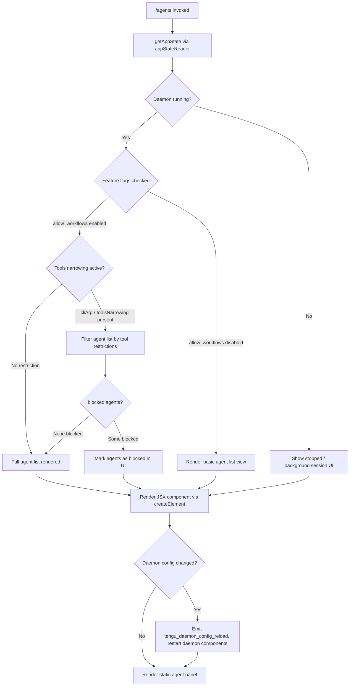

# `/agents`

> Analysis basis: CC v2.1.165 bundle.js (AST extraction + Claude interpretation)
> Minimum version: v2.1.165

---

## Overview

The `/agents` command provides an interactive management interface for agent configurations within Claude Code. It allows users to view, configure, and control agent sessions — including background daemon agents — through a JSX-rendered UI component. The command integrates with application state, daemon lifecycle management, and feature-flag checks to present the appropriate agent controls.

---

## Registration

| Field | Value |
|---|---|
| type | `local-jsx` |
| name | `agents` |
| description | `Manage agent configurations` |
| module_id | `vAK` |
| load_inline | `true` |
| loc_byte | `12564024` |
| loc_byte_end | `12564149` |
| loc_line | `9040` |
| arbor_handler.name | `CSf` |
| arbor_handler.fqn | `claude-2.1.165::CSf` |
| arbor_handler.kind | `AsyncFunction` |
| arbor_handler.resolution_path | `module_id` |
| arbor_handler.n_hits | `0` |

Analysis basis: CC v2.1.165 bundle.js:+12564024

---

## Input Branching

The command has 4+ distinct execution branches depending on agent type, daemon status, feature flags, and tool-narrowing state. A Mermaid flowchart is used.



Analysis basis: CC v2.1.165 bundle.js:+12563875, +9858376, +9857047, +4179842, +9857752, +16149069

---

## Behavioral Spec

### 1. Handler Entry — Async Agent Manager (`CSf`)

The primary handler is the async function `CSf`, resolved via module `vAK` using the `module_id` resolution path.

```
async function agentCommandHandler(context):
    appState = readAppState()                   // via appStateReader
    agentsList = buildAgentList(appState)       // via agentListBuilder
    jsxElement = createElement(agentUIComponent, { agents: agentsList, ... })
    return jsxElement
```

Analysis basis: CC v2.1.165 bundle.js:+12563875, +12563883, +12563896

---

### 2. App State Resolution (`R_` / appStateReader)

Before rendering, the handler reads current application state. The reader locates the most-recently active session using `findLast` over a session array, then extracts specific configuration fields.

```
function readAppState(sessions):
    session = sessions.findLast(s => s matches criteria)
    return {
        working_directory: session.working_directory,
        allowed_tools:     session.allowed_tools,
        disallowed_tools:  session.disallowed_tools,
        avoid_prompts:     session.avoid_prompts,
        effort:            session.effort,
        model:             session.model,
        max_thinking_tokens: session.max_thinking_tokens,
        flag_settings:     session.flag_settings
    }
```

Key field literals extracted:
- `"working_directory"` (bundle.js:+10916390)
- `"allowed_tools"` (bundle.js:+10916445)
- `"disallowed_tools"` (bundle.js:+10916500)
- `"avoid_prompts"` (bundle.js:+10916561)
- `"session"` (bundle.js:+10916860)
- `"effort"` (bundle.js:+10916885)
- `"model"` (bundle.js:+10916898)
- `"max_thinking_tokens"` (bundle.js:+10916910)
- `"flag_settings"` (bundle.js:+10916936)

Analysis basis: CC v2.1.165 bundle.js:+10916285, +10916365, +10916390

---

### 3. Agent List Builder (`Av` / agentListBuilder)

The agent list builder assembles the list of displayable agent configurations. It performs several sub-steps:

```
function agentListBuilder(appState):
    baseAgents = buildBaseAgentMap(appState)       // MG: reads cli/remote types
    agentEntries = collectAgentEntries(baseAgents)  // Y.push accumulation
    
    // Filter by tool narrowing
    filteredAgents = filterByToolRestrictions(agentEntries)  // u1H
    
    // Check feature flags
    if workflowsEnabled(appState):                 // aL9 / allow_workflows
        agentEntries = includeWorkflowAgents(agentEntries)
    
    // Check for blocked agents
    agentEntries = markBlockedAgents(agentEntries) // "blocked" literal
    
    // Merge daemon agents
    daemonAgents = getDaemonAgentList()             // Co_ / V4
    agentEntries = merge(agentEntries, daemonAgents)
    
    return agentEntries
```

Agent type literals: `"cli"` (bundle.js:+4793649), `"remote"` (bundle.js:+4793660), `"local-agent"` (bundle.js:+5351278)

Analysis basis: CC v2.1.165 bundle.js:+9858376, +9858448, +9858499, +9858514, +9858704, +9858732, +9858831

---

### 4. Workflow Feature Flag Check (`aL9` / workflowFeatureChecker)

```
function workflowFeatureChecker(appState):
    if appState.flag_settings contains "allow_workflows":
        return true
    return false
```

Emits `tengu_workflows_enabled` when workflows are active.

Analysis basis: CC v2.1.165 bundle.js:+4179534, +4179842, +4180043

---

### 5. Tool Restriction Filtering (`u1H` / toolRestrictionFilter)

Agents are filtered based on active tool-restriction modes. Two restriction sources are recognized: `"cliArg"` and `"toolsNarrowing"`. If any agent's required tools are in the `disallowed_tools` list, or absent from `allowed_tools`, the agent may be tagged as `"blocked"`.

```
function toolRestrictionFilter(agents, appState):
    restrictionMode = detectRestrictionMode(appState)  // EI6
    result = []
    for agent in agents:
        toolCheck = evaluateToolAccess(agent, appState.allowed_tools, appState.disallowed_tools)
        if toolCheck.isDenied:
            agent.status = "blocked"
        result.append(agent)
    return result
```

Literals: `"deny"` (bundle.js:+10651818), `"blocked"` (bundle.js:+9857752), `"cliArg"` (bundle.js:+10652404), `"toolsNarrowing"` (bundle.js:+10652425)

Analysis basis: CC v2.1.165 bundle.js:+9858499, +9857691, +10652467, +10652484

---

### 6. Daemon Agent Listing and Lifecycle (`z` / daemonAgentManager)

The daemon manager handles background agent sessions. It reads `daemon.status.json` and manages start/stop lifecycle.

```
function daemonAgentManager(context):
    status = readDaemonStatus("daemon.status.json")   // NKK / JR6
    
    if status == "stopped":
        renderStoppedMessage("background session")
        return
    
    for agent in status.agents:
        agentEntry = buildDaemonAgentEntry(agent)     // Yh / zX_
        agentEntry.type = "firstParty"
        entries.push(agentEntry)
    
    // Shutdown path
    shutdownResult = Promise.race([
        shutdownAllAgents(),                           // Tp / Ac
        timeoutAfter(500ms)                            // l8
    ])
    
    on config change:
        emitTelemetry("tengu_daemon_config_reload")
        stopDaemonComponent()
        updateDaemonConfig()
        startDaemonComponent()
    
    return entries
```

Timeout limit: 500 ms (bundle.js:+16165668)

Literals: `"daemon.status.json"` (bundle.js:+12743842), `"stopped"` (bundle.js:+16170459), `"background session"` (bundle.js:+16170502), `"firstParty"` (bundle.js:+3232024), `"daemon_stop"` (bundle.js:+16170550), `"daemon_stop_failed"` (bundle.js:+16170587), `"heartbeat"` (bundle.js:+16147497), `"supervisor"` (bundle.js:+16148276)

Analysis basis: CC v2.1.165 bundle.js:+16170547, +16170570, +16170622, +16170676, +16148793, +16148544, +16148673, +16148691, +16149067

---

### 7. Model / Effort String Normalization (`e1` / modelNameNormalizer)

Model and effort names are normalized to lowercase canonical tokens. Known model tier aliases are recognized and mapped internally.

```
function modelNameNormalizer(rawName):
    normalized = rawName.trim().toLowerCase()
    normalized = applyAliasMap(normalized)
    // Known alias tokens:
    //   "opusplan", "sonnet", "haiku", "opus", "best", "[1m]"
    return normalized
```

Literals: `"opusplan"` (bundle.js:+2243249), `"[1m]"` (bundle.js:+2243275), `"sonnet"` (bundle.js:+2243290), `"haiku"` (bundle.js:+2243329), `"opus"` (bundle.js:+2243368), `"best"` (bundle.js:+2243405)

Analysis basis: CC v2.1.165 bundle.js:+2239233, +2243153, +2243164

---

### 8. Agent Configuration I/O (`acK` / agentConfigIO)

Handles reading and writing per-agent configuration files. Enforces size limits.

```
function agentConfigIO(agentPath):
    resolvedPath = path.dirname(agentPath)
    content = readAgentFile(resolvedPath)
    
    // Size enforcement
    byteLen = Buffer.byteLength(content)
    if byteLen > 1000:
        truncate or warn                   // literal 1000 at +205882
    if byteLen > 100:
        apply secondary limit              // literal 100 at +205901
    
    // Write-back with retry (up to 1000ms timeout)
    result = await writeWithRetry(content, timeout=1000)
    return result
```

Size limits: 1000 bytes (bundle.js:+205882), 100 bytes (bundle.js:+205901)

Analysis basis: CC v2.1.165 bundle.js:+205563, +205596, +205771, +205882, +205901

---

### 9. Bootstrap / Fetch Subsystem (`H` / bootstrapFetcher)

Some agent configurations are fetched remotely during initialization.

```
function bootstrapFetcher(url):
    log("[Bootstrap] Fetching", url)
    response = fetch(url, {
        headers: {
            "Content-Type": "application/json",
            "User-Agent": userAgentString
        },
        timeout: 5000
    })
    if response.ok:
        log("[Bootstrap] Fetch ok")
        emitTelemetry("api_bootstrap_fetch")
        return response.json()
    else:
        emitTelemetry("api_bootstrap_fetch", { status: "parse_failed" })
        throw error
```

Timeout: 5000 ms (bundle.js:+15724784)

Literals: `"[Bootstrap] Fetching"` (bundle.js:+15724583), `"Content-Type"` (bundle.js:+15724668), `"application/json"` (bundle.js:+15724683), `"User-Agent"` (bundle.js:+15724702), `"[Bootstrap] Fetch ok"` (bundle.js:+15724957), `"api_bootstrap_fetch"` (bundle.js:+15724905), `"parse_failed"` (bundle.js:+15724927)

Analysis basis: CC v2.1.165 bundle.js:+15724581, +15724619, +15724715

---

### 10. Provider / API URL Detection (`xN` / providerDetector)

Agents are tagged with their API provider. Known providers include `"standard"`, `"tst"`, `"tst-auto"`, `"bedrock"`, `"foundry"`, `"anthropicAws"`, `"mantle"`, `"vertex"`. The default direct API endpoint is `"api.anthropic.com"`.

For Vertex AI, tool-search beta header is suppressed unless `ENABLE_TOOL_SEARCH=true` is set explicitly.

Analysis basis: CC v2.1.165 bundle.js:+6580607, +6580130, +6580209, +6580259, +2096653, +2096693, +2096799, +2097588, +6581143

---

### 11. Feature Gate — `allow_product_feedback` and `pro` tier

```
function checkProductFlags(appState):
    if appState has "allow_product_feedback":
        enableFeedbackUI()
    if appState.tier == "pro":
        unlockProAgentFeatures()
```

Literals: `"allow_product_feedback"` (bundle.js:+4178415), `"pro"` (bundle.js:+4180288)

Analysis basis: CC v2.1.165 bundle.js:+4178391, +4180281

---

### 12. Agent Teams Flag (`n9` / agentTeamsParser)

The `--agent-teams` CLI argument enables multi-agent team configuration mode.

```
function agentTeamsParser(args):
    if args includes "--agent-teams":
        teamConfig = parseTeamConfig(args)
        emitTelemetry("tengu_amber_flint")
        return teamConfig
    return null
```

Literal: `"--agent-teams"` (bundle.js:+5481208)

Analysis basis: CC v2.1.165 bundle.js:+9857396, +5481208, +5481320

---

## State & Side Effects

| Item | Detail |
|---|---|
| Telemetry | `tengu_feature_sad` (bundle.js:+1010365) — feature check failure |
| Telemetry | `tengu_feature_ok` (bundle.js:+1010222) — feature check success |
| Telemetry | `tengu_feature_bad` (bundle.js:+1010284) — feature check bad state |
| Telemetry | `tengu_slate_harbor` (bundle.js:+4793679) — agent session type event |
| Telemetry | `tengu_daemon_config_reload` (bundle.js:+16149069) — daemon config reload triggered |
| Telemetry | `tengu_workflows_enabled` (bundle.js:+4180043) — workflows feature active |
| Telemetry | `tengu_cobalt_ridge` (bundle.js:+4910281) — platform/OS event (Windows path noted) |
| Telemetry | `tengu_daemon_control` (bundle.js:+16170625) — daemon lifecycle control event |
| Telemetry | `tengu_amber_flint` (bundle.js:+5481320) — agent teams flag activated |
| Daemon lifecycle | `T.stop`, `T.updateConfig`, `T.start` — daemon component restart on config change (bundle.js:+16148664, +16148673, +16148691) |
| Daemon lifecycle | `Ac` / `KLH.shutdown` — graceful shutdown with 500 ms race timeout (bundle.js:+16165653, +3231405) |
| App state changes | Reads session fields: `working_directory`, `allowed_tools`, `disallowed_tools`, `avoid_prompts`, `effort`, `model`, `max_thinking_tokens`, `flag_settings` |
| Agent config I/O | Reads and potentially writes per-agent config files; enforces 1000-byte and 100-byte limits |
| Bootstrap fetch | HTTP fetch with `Content-Type: application/json` header and 5000 ms timeout |
| UUID generation | `$X_.randomUUID()` used during new agent entry creation (bundle.js:+3231559) |
| Sound | <!-- TODO: not found in depth-2 traversal; needs --depth 4 --> |
| Hook registration | <!-- TODO: not found in depth-2 traversal; needs --depth 4 --> |

---

## Version History

| Version | Change |
|---|---|
| v2.1.165 | Initial analysis |

---

## Common Mistakes

1. **Expecting a prompt-style response**: `/agents` is a `local-jsx` command; it renders a JSX UI component, not a chat text response. Invoking it and expecting a markdown reply will produce no output.
2. **Assuming all agents are always listed**: Agents tagged as `"blocked"` due to tool-narrowing (`cliArg` or `toolsNarrowing`) are still shown but marked as unavailable — they are not silently omitted.
3. **Confusing daemon agent state**: If the daemon status file (`daemon.status.json`) reports `"stopped"`, the agent panel will render a "background session" stopped view rather than an interactive list.
4. **Overlooking the `--agent-teams` flag**: Multi-agent team features are gated behind a CLI argument, not a settings toggle; they will not appear in the UI without it.
5. **Assuming Vertex AI supports tool-search**: The tool-search beta header is suppressed for Vertex AI unless `ENABLE_TOOL_SEARCH=true` is explicitly set in the environment.
6. **Treating model aliases as canonical**: Strings like `"opusplan"`, `"best"`, and `"[1m]"` are internal aliases that get normalized; external integrations should use canonical model names.

---

## Appendix — Identifier Mapping

> For bundle debugging only. Identifiers change across versions.

| Identifier | Role |
|---|---|
| `CSf` | Primary async handler for `/agents` command (agentCommandHandler) |
| `R_` | App state reader — reads session fields from current state |
| `H` | Bootstrap fetcher / general HTTP utility |
| `v` | Debug/logging utility (uses `"debug"` literal) |
| `icK` | Internal logging sub-utility |
| `SH` | JSON serialization helper (`JSON.stringify` wrapper) |
| `J4` | String path/token extraction helper |
| `ppH` | Prompt/config string processor |
| `acK` | Agent configuration file I/O handler |
| `e$` | State map getter |
| `Gw_` | String split/trim/index utility |
| `q` | General-purpose queue/file utility (also `unlinkSync`) |
| `ZHH` | Set membership checker |
| `uj` | String replace utility |
| `e1` | Model name normalizer dispatcher |
| `D6H` | Model normalization sub-processor |
| `Aq` | Model alias mapper (opusplan, sonnet, haiku, opus, best) |
| `eX` | Model name normalization entry point |
| `s6` | Feature flag evaluator |
| `c` | Core feature check function |
| `P6` | Feature check runner |
| `A` | Session/file array utility |
| `f` | File handle / connection object |
| `L` | Connection lifecycle manager (add/finally/delete) |
| `pk8` | Session builder variant A |
| `L1` | Session constructor |
| `Uk8` | Session builder variant B |
| `Av` | Agent list builder orchestrator |
| `MG` | Base agent map constructor |
| `cQ` | Agent map initializer |
| `JK` | String-to-boolean converter |
| `eH` | String utility wrapper |
| `D6` | Agent deduplication/registry manager |
| `Hj6` | Registry key constructor A |
| `_j6` | Registry key constructor B |
| `qu` | Agent registry lookup |
| `B98` | Agent registry set/get manager |
| `y6` | Agent entry timestamp recorder |
| `Y` | Agent entry accumulator (push/write/set/delete) |
| `C0H` | Agent config object builder |
| `N9` | Async store accessor |
| `v8` | Config field extractor |
| `X7A` | Config transformer |
| `EH` | String coercion wrapper |
| `K` | Column layout helper (map/padEnd) |
| `aLK` | Column width calculator (`Math.max`, `Object.keys`) |
| `E` | Event handler (preventDefault, remoteControlAtStartup) |
| `b` | DOM/UI event object |
| `t0` | User settings reader |
| `T` | Daemon component controller (stop/updateConfig/start) |
| `$mK` | Heartbeat manager |
| `L8H` | Heartbeat initializer |
| `V` | Secondary daemon component (start) |
| `Ro_` | React/Ink render orchestrator |
| `k_` | Module loader / ESModule setup |
| `Zu6` | Module bind helper |
| `OP` | Permission/opt-in checker |
| `Q78` | Permission query helper |
| `nT` | Permission result normalizer |
| `aL9` | Workflow feature checker |
| `W9` | Workflow access resolver |
| `ET_` | Extended permission checker |
| `SBL` | Subscription-level checker |
| `hBL` | Permission fallback handler |
| `u1H` | Tool restriction filter |
| `EI6` | Tool restriction mode detector |
| `YMH` | Tool list flattener |
| `OHA` | Tool access evaluator |
| `iSq` | Tool restriction result aggregator |
| `Co_` | Daemon agent listing helper |
| `pC` | Platform-aware agent config reader (Windows path) |
| `V4` | Agent config reader/writer |
| `z` | Daemon agent manager |
| `hH` | Daemon stop event handler |
| `RH` | Daemon stop-failed event handler |
| `Yh` | Daemon agent entry builder |
| `Au` | Agent core constructor |
| `QNH` | Agent notification helper |
| `zX_` | Agent UUID generator and emitter |
| `Tp` | Daemon shutdown race executor |
| `Ac` | Daemon shutdown initiator |
| `fc` | Timeout clear helper |
| `l8` | Timeout/abort controller |
| `Zt` | Agent rendering orchestrator (main JSX subtree) |
| `PP` | Agent type label builder |
| `ig8` | Agent icon selector |
| `ow` | Agent effort/model label |
| `Y_6` | Agent list sort helper |
| `n9` | Agent teams CLI flag parser |
| `r97` | Team config deserializer |
| `D8f` | Agent start event handler |
| `w8f` | Agent stop event handler |
| `xN` | Provider/API URL detector |
| `hR_` | Provider type classifier |
| `XA` | Bedrock/Vertex provider mapper |
| `Hf` | Provider config finalizer |
| `C4` | Feature capability checker |
| `O` | Secondary feature flag checker |
| `b8` | Feature flag backing store |
| `$` | Agent list includes-checker |
| `NKK` | Daemon status file reader |
| `nr` | Log/trace helper |
| `JR6` | Status file path builder |

---

Note: index built via Arbor fallback; some signals (telemetry, literals) may be missing — see arbor-fallback.js.