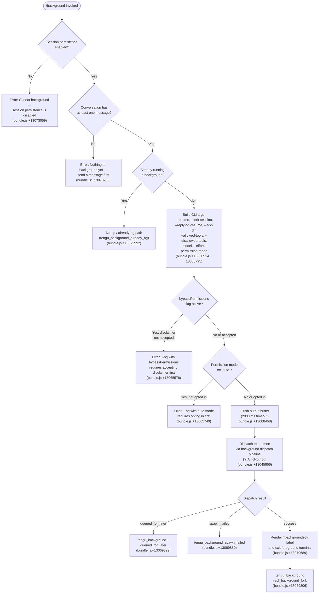

# `/background`

> Analysis basis: CC v2.1.165 bundle.js (AST extraction + Claude interpretation)
> Minimum version: v2.1.165

---

## Overview

The `/background` command (alias `/bg`) sends the current interactive Claude Code session to the background daemon, detaching it from the controlling terminal and freeing it to continue running without a connected TTY. Under the hood, it forks the current session into the background worker pool managed by the Claude Code daemon, optionally forwarding a prompt and CLI flags, then exits the foreground terminal cleanly.

---

## Registration

| Field | Value |
|---|---|
| type | `local-jsx` |
| name | `background` |
| description | `Send this session to the background and free the terminal` |
| aliases | `["bg"]` |
| argumentHint | `[prompt]` |
| immediate | `null` |
| module_id | `O5K` |
| load_inline | `true` |
| loc_byte | `13073694` |
| loc_byte_end | `13073934` |
| loc_line | `9697` |
| arbor_handler.name | `LBf` |
| arbor_handler.fqn | `claude-2.1.165::LBf` |
| arbor_handler.kind | `AsyncFunction` |
| arbor_handler.resolution_path | `module_id` |
| arbor_handler.n_hits | `0` |

Analysis basis: CC v2.1.165 bundle.js:+13073694

---

## Input Branching

The handler `LBf` evaluates several pre-conditions and session-state checks before dispatching. There are at least five distinct branches, so a Mermaid flowchart is used.



---

## Behavioral Spec

### Handler Entry Point (`LBf`)

The Arbor-resolved handler is `LBf` (AsyncFunction, `claude-2.1.165::LBf`, resolved via `module_id`).

```
async function backgroundCommandHandler(context):
    // Pre-condition: session persistence must be enabled
    if not sessionPersistenceEnabled(context):
        return renderError(
            "Cannot background — session persistence is disabled, " +
            "so the forked job would have nothing to resume."
        )
        // Analysis basis: CC v2.1.165 bundle.js:+13073059

    // Pre-condition: at least one message must exist
    if conversationIsEmpty(context):
        return renderError("Nothing to background yet — send a message first.")
        // Analysis basis: CC v2.1.165 bundle.js:+13073235

    // Pre-condition: not already backgrounded
    if sessionIsAlreadyBackground(context):
        emitTelemetry("tengu_background_already_bg")
        return  // no-op
        // Analysis basis: CC v2.1.165 bundle.js:+13072992

    // Build argument vector for the forked background process
    args = buildBackgroundArgs(context)

    // Validate permission constraints before dispatch
    if hasBypassPermissions(args) and not disclaimerAccepted():
        return renderError(
            "--bg with bypassPermissions requires accepting the disclaimer first. " +
            "Run `claude --dangerously-skip-permissions` once interactively."
        )
        // Analysis basis: CC v2.1.165 bundle.js:+13065578

    if permissionMode(args) == "auto" and not autoModeOptedIn():
        return renderError(
            "--bg with auto mode requires opting in first. " +
            "Run `claude --permission-mode auto` once interactively."
        )
        // Analysis basis: CC v2.1.165 bundle.js:+13065740

    // Flush any pending output before detaching (2000 ms timeout)
    await flushWithTimeout(2000, "flush timeout")
    // Analysis basis: CC v2.1.165 bundle.js:+13068458, +13068463

    // Hand off to background dispatch pipeline
    result = await dispatchToBackground(args, context)

    handleDispatchResult(result)
```

Analysis basis: CC v2.1.165 bundle.js:+13072978

---

### Argument Construction (`gb8` — background args builder)

```
function buildBackgroundArgs(context):
    args = []

    // Session identity
    args += ["--resume", sessionId]           // +13068514
    args += ["--fork-session"]                 // +13068527

    // Optional prompt forwarding
    if userPrompt exists:
        args += ["--reply-on-resume", userPrompt]  // +13068569

    // Working directories
    for dir in additionalDirs:
        args += ["--add-dir", dir]             // +13068621

    // Tool constraints (flat-map over config arrays)
    for tool in allowedTools:
        args += ["--allowed-tools", tool]      // +13068656
    for tool in disallowedTools:
        args += ["--disallowed-tools", tool]   // +13068697

    // Model selection
    if model set:
        args += ["--model", model]             // +13068728

    // Effort level
    if effort set:
        args += ["--effort", effort]           // +13068750

    // Permission mode
    if permissionMode set:
        args += ["--permission-mode", permissionMode]  // +13068767

    // Separator before free-form prompt tail
    args += ["--"]                             // +13068795

    return args
```

Analysis basis: CC v2.1.165 bundle.js:+13068163

---

### Session-Type Rendering (`Qb8`)

After successful dispatch the command renders a status indicator in the terminal UI. The rendering sub-component (`Qb8`) selects the appropriate label string `"(backgrounded)"` and builds the JSX element via `O$H.createElement`.

```
function renderBackgroundedStatus(dispatchResult):
    label = "(backgrounded)"             // bundle.js:+13070689
    type  = "command"                    // bundle.js:+13070210

    // Truncate display name to 120 characters if needed
    displayName = truncate(sessionName, 120)   // bundle.js:+13070459

    return createElement(statusComponent, {label, type, displayName})
```

Analysis basis: CC v2.1.165 bundle.js:+13073196, +13073305

---

### Daemon Dispatch Pipeline (`YfA` → `cR6` → `pg`)

The actual background dispatch is a multi-step async pipeline:

```
async function dispatchToBackground(args, context):
    // 1. Ensure daemon is running (pg = ensureDaemonRunning)
    daemonState = await ensureDaemonRunning()
    // Emits: tengu_bg_daemon_cold_start_ask, tengu_bg_daemon_install,
    //        tengu_bg_daemon_spawn_failed, tengu_bg_daemon_service_stale_exec
    // Analysis basis: CC v2.1.165 bundle.js:+13005031

    // 2. Write dispatch file (YfA = backgroundDispatch)
    dispatchResult = await backgroundDispatch(args)
    // Uses random bytes for job ID: ofK.randomBytes
    // Connects to daemon control socket: $z / ay8
    // Emits: tengu_bg_dispatch, tengu_bg_dispatch_fallback
    // Analysis basis: CC v2.1.165 bundle.js:+13043752

    // 3. Interpret dispatch result
    match dispatchResult.status:
        "queued_for_later" => emit "tengu_background" + "queued_for_later"
        "short_alive"      => report "Previous session is still shutting down — try again"
        "stale_short"      => report stale short error
        "daemon-unreachable" => emit tengu_bg_dispatch_fallback
        "ack-timeout"      => report no-ack error
        other error codes  => map to user-visible error string
    // Analysis basis: CC v2.1.165 bundle.js:+13052625…+13055278

    return dispatchResult
```

Analysis basis: CC v2.1.165 bundle.js:+13044002

---

### Environment Passthrough (`iUf`)

When forking the background session the following environment variables are forwarded to preserve configuration context:

- `CLAUDE_CONFIG_DIR` (bundle.js:+13066356)
- `CLAUDE_INTERNAL_FC_OVERRIDES` (bundle.js:+13066376)
- `ANTHROPIC_MODEL` (bundle.js:+13066407)
- `AWS_REGION` / `AWS_DEFAULT_REGION` / `AWS_PROFILE` (bundle.js:+13066425…+13066459)
- `GOOGLE_APPLICATION_CREDENTIALS` / `GOOGLE_CLOUD_PROJECT` / `GCLOUD_PROJECT` (bundle.js:+13066473…+13066529)

Analysis basis: CC v2.1.165 bundle.js:+13050928

---

### Flush Timeout (`yL`)

Before the foreground terminal disconnects, pending output is flushed using a race between a `Promise` completion and a `setTimeout` of **2000 ms**. If the flush wins, the terminal detaches cleanly; if the timeout fires, the command continues with the label `"flush timeout"`.

```
async function flushWithTimeout(ms, label):
    timeoutId = setTimeout(resolve, ms)
    try:
        await Promise.race([flushPromise, timeoutPromise])
    finally:
        clearTimeout(timeoutId)
```

Flush timeout: 2000 ms (bundle.js:+13068458)

Analysis basis: CC v2.1.165 bundle.js:+13068450

---

## State & Side Effects

| Item | Detail |
|---|---|
| Telemetry — primary | `tengu_background` (bundle.js:+13069954) |
| Telemetry — already bg | `tengu_background_already_bg` (bundle.js:+13072992) |
| Telemetry — spawn failed | `tengu_background_spawn_failed` (bundle.js:+13069151) |
| Telemetry — fork event | `repl_background_fork` (bundle.js:+13069806) |
| Telemetry — dispatch | `tengu_bg_dispatch` (bundle.js:+13045856) |
| Telemetry — dispatch fallback | `tengu_bg_dispatch_fallback` (bundle.js:+13046386) |
| Telemetry — dispatch rescued | `tengu_bg_dispatch_rescued` (bundle.js:+13051764) |
| Telemetry — daemon ensure | `tengu_bg_daemon_cold_start_ask`, `tengu_bg_daemon_install`, `tengu_bg_daemon_spawn_failed`, `tengu_bg_daemon_service_stale_exec` |
| Telemetry — feature | `tengu_feature_ok`, `tengu_feature_bad`, `tengu_feature_sad` |
| Telemetry — rename fork | `tengu_rename_full_session_fork` (bundle.js:+11996291) |
| Daemon interaction | Writes a dispatch file; connects to the daemon control socket via Unix socket (`$z` / `ay8`) |
| Session state change | Session transitions from `active` / `working` to `bg` state (bundle.js:+16140279) |
| Terminal release | Foreground terminal is freed after successful dispatch; process does not call `process.exit` from the command handler itself |
| File system | Temporary dispatch directory created under `tmp` subdirectory (bundle.js:+13048408); cleaned up on completion via `B9H.rm` |
| Sound | <!-- TODO: not found in depth-2 traversal; needs --depth 4 --> |

---

## Version History

| Version | Change |
|---|---|
| v2.1.165 | Initial analysis |

---

## Common Mistakes

1. **Invoking `/background` before sending any message** — the guard at bundle.js:+13073235 rejects the command with "Nothing to background yet — send a message first." Always ensure at least one conversation turn exists.
2. **Using `bypassPermissions` (or `--dangerously-skip-permissions`) without prior interactive acceptance** — the command will fail with an error requiring the user to run `claude --dangerously-skip-permissions` interactively at least once (bundle.js:+13065578).
3. **Using `--permission-mode auto` without prior interactive opt-in** — similarly blocked until the user runs `claude --permission-mode auto` once interactively (bundle.js:+13065740).
4. **Running `/background` when session persistence is disabled** — the session cannot be resumed after forking, so the command hard-errors (bundle.js:+13073059). Enable the daemon service (`claude daemon install`) first.
5. **Expecting immediate attachment from another terminal** — the session is placed in `bg` state and may briefly show `"resuming"` while the daemon adopts the worker. Use `/bg --resume <id>` or `claude --resume <id>` to re-attach.
6. **Retrying immediately after "Previous session is still shutting down"** — the short-alive guard (bundle.js:+13052687) means the prior session's socket is still being torn down; wait a moment before retrying.

---

## Appendix — Identifier Mapping

> For bundle debugging only. Identifiers change across versions.

| Identifier | Role |
|---|---|
| `LBf` | Main handler for `/background` command (AsyncFunction) |
| `gb8` | Background argument builder / session fork orchestrator |
| `Qb8` | Terminal status renderer (builds "(backgrounded)" JSX element) |
| `iUf` | Background session launch with env-var passthrough |
| `YfA` | Background dispatch coordinator (writes dispatch file, manages socket) |
| `cR6` | Daemon dispatch file writer / control-socket writer |
| `pg` | Daemon ensure-running helper |
| `OfA` | Dispatch error path/label builder |
| `yL` | Flush-with-timeout helper (2000 ms race) |
| `m16` | Session rename / fork helper invoked post-dispatch |
| `FTf` | Agent fork query helper (used during session forking) |
| `jG` | Agent query dispatcher (wraps `XV8`, `gm`, `b1H`) |
| `XV8` | App-state getter/setter used during fork |
| `Mi` | Background session spawner (creates tmp dir, writes files) |
| `ABf` | Permission flag validator (bypassPermissions, auto mode checks) |
| `i7A` | Permission prefix checker |
| `K5K` | Resume / session-id argument parser |
| `KBf` | Permission whitelist checker |
| `Ub8` | Additional-dir argument processor |
| `L5K` | Disallowed-tool argument processor |
| `$i` | Argument slice helper |
| `nUf` | Platform shell command builder (cmd.exe / /bin/sh) |
| `Bd6` | Windows Git Bash locator |
| `Z9` | Daemon-worker environment setup |
| `GYH` | Daemon-worker bootstrap |
| `GMH` | Detach-request sender |
| `suq` | Background task descriptor builder |
| `ut` | IPC writer (writes detach-request to daemon socket) |
| `m0H` | Environment variable mode resolver (production / test) |
| `LMK` | Environment literal mapper |
| `Lx` | Locale / config context helper |
| `eH` | String coercion utility |
| `vb8` | macOS memory check (used by low-mem guard) |
| `D6` | Background job state machine |
| `hDA` | Background session lifecycle manager |
| `VDA` | Daemon socket connector / claim handler |
| `w` | Background worker manager (spawn, adopt, retire) |
| `T55` | Daemon attach/detach multiplexer (full attach protocol) |
| `E55` | Worker startup/respawn coordinator |
| `QuK` | Dispatch acknowledgement awaiter |
| `Wz` | SDH background service status wrapper |
| `SDH` | Background service state reader |
| `kH` | Config read helper with error logging |
| `kHH` | CLAUDE_COMMANDS directory scanner |
| `AY` | Real-path resolver |
| `vx` | Path join helper |
| `jE` | Directory walker |
| `FW4` | File line-scanner (reads dispatch files) |
| `yK` | Job directory path builder |
| `cE` | Job sub-path builder |
| `e9` | Job state file reader/writer |
| `R8` | Version tag helper |
| `tf` | Version file helper |
| `ff` | Safe atomic file writer |
| `MY` | Atomic rename writer |
| `oj` | State cache invalidator |
| `y6` | Config watcher with file-system observer |
| `bDH` | Config file reader (JSON parse + backup) |
| `WTL` | Config file watcher (watchFile / unwatchFile) |
| `ay8` | Daemon control-socket connector (server socket) |
| `$z` | Daemon IPC socket client |
| `obH` | HO path socket builder |
| `rfK` | Dispatch result classifier |
| `ZQ` | Dispatch result to error-string mapper |
| `f8H` | Background-service anchor helper |
| `fLH` | Amber-anchor IPC wrapper |
| `oUf` | Dispatch rescue helper |
| `XR` | Background UI state updater |
| `DaH` | Daemon status display helper |
| `gJH` | Background job display renderer |
| `s6` | Feature flag OK/sad reporter |
| `vO` | Compact-boundary message slicer |
| `$k8` | Compact-boundary token finder |
| `BwH` | Background job pre-flight checker |
| `g$` | Session state store helper |
| `Yg` | Session store update helper |
| `S6` | Zustand store accessor |
| `uv` | Global state accessor |
| `EfA` | Register background feature hook |
| `d4` | Feature registration helper |
| `j9` | Slash-command registration hook |
| `ET` | Feature flag evaluator |
| `I46` | Session ID resolver |
| `XM` | Session map getter |
| `x0` | Session list initialiser |

---

Note: index built via Arbor fallback; some signals (telemetry, literals) may be missing — see arbor-fallback.js.