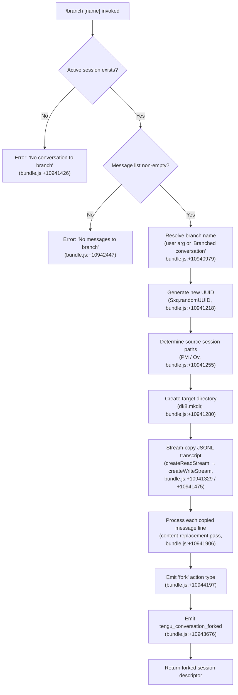

# `/branch`

> Analysis basis: CC v2.1.165 bundle.js (AST extraction + Claude interpretation)
> Minimum version: v2.1.165

---

## Overview

The `/branch` command forks the current conversation at its present point, creating an independent copy of the conversation history up to that moment. It copies the existing conversation's JSONL transcript to a new session file, assigns the new session a fresh UUID and an optional user-supplied name, and emits a `tengu_conversation_forked` telemetry event. The forked session is immediately accessible as a separate, divergent conversation thread.

---

## Registration

| Field | Value |
|---|---|
| type | `local-jsx` |
| name | `branch` |
| description | `Create a branch of the current conversation at this point` |
| argumentHint | `[name]` |
| module_id | `Q6A` |
| load_inline | `true` |
| loc_byte | `12477306` |
| loc_byte_end | `12477483` |
| loc_line | `8927` |
| arbor_handler.name | `Mzf` |
| arbor_handler.fqn | `claude-2.1.165::Mzf` |
| arbor_handler.kind | `AsyncFunction` |
| arbor_handler.resolution_path | `module_id` |
| arbor_handler.n_hits | `0` |

Analysis basis: CC v2.1.165 bundle.js:+12477306

---

## Input Branching

The command has four distinct logical paths based on session state and message availability.



---

## Behavioral Spec

### Top-level handler (`Mzf`)

The handler is an `AsyncFunction` resolved by Arbor via `module_id` path (`Q6A → Mzf`).

Analysis basis: CC v2.1.165 bundle.js:+10944461

```
async function branchCommandHandler(args, appState):
    # Step 1: Delegate to inner branch orchestrator
    result = await branchOrchestrator(args, appState)
    return result
```

### Branch orchestrator (`uxq`)

Analysis basis: CC v2.1.165 bundle.js:+10943372

```
async function branchOrchestrator(args, appState):
    # Resolve current session metadata
    sessionMeta = resolveSessionConfig(appState)       # S6 at +10943372
    sessionTitle = getSessionTitle(sessionMeta)        # g$ at +10943379

    # Guard: session must exist
    if sessionMeta is null or undefined:
        throw Error("No conversation to branch")       # +10941426

    # Copy transcript to new session
    newSession = await copyTranscriptToNewSession(args, sessionMeta)  # xxq at +10943480

    # Resolve branch name from user argument
    branchName = resolveBranchName(args, newSession)   # bxq at +10943539
    # fallback default: "Branched conversation"         # +10940979

    # Scan and select messages for branch point
    selectedMessages = findMessagesUpToBranchPoint(newSession, args)  # $.find +10943543

    # Guard: must have at least one message
    if selectedMessages is empty:
        raise Error("No messages to branch")           # +10942447

    # Run fuzzy-filter / ordering pass on selected messages
    orderedMessages = applyMessageOrdering(selectedMessages)   # fzf at +10943612

    # Emit session fork into app state
    forkResult = emitSessionFork(appState, {           # CS at +10943643
        name: branchName,
        messages: orderedMessages,
        action: "fork"                                 # +10944197
    })

    # Append agent-name metadata if set                # JMH at +10943661
    setAgentNameOnBranch(forkResult)

    # Set timestamp on forked session
    branchTimestamp = new Date().toISOString()         # +10943766

    # Resume stream / cleanup
    resumeInputStream(appState)                        # H.resume +10944184

    # Emit telemetry
    emit("tengu_conversation_forked")                  # +10943676

    return {
        sessionId: forkResult.id,
        name: branchName,
        action: "fork",
        timestamp: branchTimestamp
    }
```

### Transcript copy sub-routine (`xxq`)

Copies the source conversation JSONL file to a new session directory as a streaming operation.

Analysis basis: CC v2.1.165 bundle.js:+10941218

```
async function copyTranscriptToNewSession(args, sourceMeta):
    newId = crypto.randomUUID()                        # Sxq.randomUUID +10941218
    baseDir = resolveBaseDir(sourceMeta)               # S6 +10941237
    targetPath = buildSessionPath(newId, baseDir)      # NO +10941244, X_ +10941247

    # Resolve full source/target directory paths
    sourceDir = resolveSourceDirectory(sourceMeta)     # Ov +10941255
    targetDir = buildTargetDirectory(targetPath)       # PM +10941269

    # Create target directory (recursive)
    await fs.mkdir(targetDir, { recursive: true })     # dk8.mkdir +10941280

    # Open source JSONL as read stream (buffer size: 448 bytes) # +10941311
    readStream = fs.createReadStream(sourcePath, {     # Qk8.createReadStream +10941329
        encoding: "utf8"                               # +10941362
    })

    readStream.once("open", ...)                       # g6A.once +10941377
    # On open error:
    #   raise "No conversation to branch"              # +10941426 via kH / HA

    # Open write stream to target (buffer size: 384 bytes)  # +10941521
    writeStream = fs.createWriteStream(targetPath, {   # Qk8.createWriteStream +10941475
        encoding: "utf8"
    })

    # Pipe readline interface over the read stream
    lineReader = readline.createInterface(readStream)  # Rxq.createInterface +10941569

    # Process each JSONL line
    for line in lineReader:
        parsed = JSON.parse(line)                      # B6 +10941873
        # Apply content-replacement pass               # +10941906
        transformed = applyContentReplacement(parsed)
        # Write transformed line to destination        # O.write +10941758

    # On error during streaming: destroy streams and unlink target
    readStream.destroy()                               # O.destroy +10941671
    await fs.unlink(targetPath)                        # dk8.unlink +10941689

    # Drain and finalize
    await streamFinished(writeStream)                  # Cxq.finished +10942857

    return {
        newId: newId,
        targetPath: targetPath,
        messageCount: lineCount
    }
```

### Branch-name resolver (`bxq`)

Analysis basis: CC v2.1.165 bundle.js:+10941031

```
function resolveBranchName(args, sessionMeta):
    # Try to find a pre-existing name pattern from session list
    matched = array.find(sessionMeta.sessions, matcher)   # _.find +10941031

    if args.userInput is not empty:
        # Clean user-supplied name via replace
        return sanitize(args.userInput)                   # A.replace +10941109
    else:
        return "Branched conversation"                    # +10940979
```

### Session fork emitter (`CS`)

Writes the fork event into app state and configures the custom title.

Analysis basis: CC v2.1.165 bundle.js:+13196631

```
function emitSessionFork(appState, forkConfig):
    # Resolve session output path
    outputPath = resolveOutputPath(forkConfig)     # Ov +13196631
    # Write session descriptor to disk              # D$H +13196640
    writeSessionDescriptor(outputPath, {
        title: forkConfig.name,                    # "custom-title" key +13196652
        action: forkConfig.action                  # "fork" +10944197
    })
    # Update app-level session registry
    appState.sessions.set(forkConfig.newId, ...)   # S6 +13196699
    # Finalize via d4 (config persistence helper)  # d4 +13196704
    persistSessionConfig(forkConfig.newId)
    # Emit internal event
    appState.events.emit("session-forked")         # DC6.emit +13196731
```

### Agent-name setter (`JMH`)

Optionally records an agent name on the forked session.

Analysis basis: CC v2.1.165 bundle.js:+13199653

```
function setAgentNameOnBranch(forkResult):
    # Resolve paths same as CS                      # Ov +13199653, D$H +13199662
    if forkResult.agentName is set:
        persistAgentName(forkResult)                # S6 +13199717, d4 +13199722
        # Write roster entry                        # Rd +13199753
        updateConversationRoster(forkResult)
        # Emit tengu_agent_name_set                 # H5A.emit +13199759
        appState.events.emit("agent-name-set")
```

### Message ordering / fuzzy filter (`fzf`)

Analysis basis: CC v2.1.165 bundle.js:+10943049

```
function applyMessageOrdering(messages):
    # Fuzzy-rank messages using internal scorer     # Fn +10943049
    ranked = fuzzySortMessages(messages)

    # Escape special characters in names            # WV +10943150
    sanitizedNames = ranked.map(escapeSpecialChars) # H.replace +194172

    # Deduplicate by numeric key
    seen = new Set()
    result = []
    for msg in sanitizedNames:
        key = parseInt(msg.key)                     # parseInt +10943250
        if not seen.has(key):                       # K.has +10943297
            seen.add(key)
            result.push(msg)

    return result
```

---

## State & Side Effects

| Item | Detail |
|---|---|
| Telemetry | `tengu_conversation_forked` (bundle.js:+10943676) — emitted on every successful branch |
| Telemetry (indirect) | `tengu_session_renamed` (+13196744), `tengu_agent_name_set` (+13199772) — emitted when custom title or agent name is applied to the fork |
| Disk I/O | Creates new session directory via `fs.mkdir` (+10941280); copies source JSONL via streaming read/write (+10941329 / +10941475); unlinks partial file on error (+10941689) |
| App state changes | New session entry inserted into the session registry (`S6` / `d4`); conversation roster updated via `Rd` |
| Events emitted | Internal `DC6.emit` ("session-forked") at +13196731; `H5A.emit` ("agent-name-set") at +13199759 |
| Hook registration | `j9` → `zXA.register` at +60323 (transcript writer registration, reached via the write-stream path) |
| Sound | None observed in depth-2 traversal |
| Error literals | `"No conversation to branch"` (+10941426); `"No messages to branch"` (+10942447); `"Unknown error occurred"` (+10944345) |

---

## Version History

| Version | Change |
|---|---|
| v2.1.165 | Initial analysis |

---

## Common Mistakes

1. **Running `/branch` with no active conversation** — If no session is open or the session has no messages yet, the command exits with `"No conversation to branch"` or `"No messages to branch"` respectively. You must have at least one message exchange before branching.

2. **Expecting the branch to share state with the original** — The fork is a full copy of the JSONL transcript at branch time. Changes made in the original session after branching are not reflected in the forked session, and vice versa.

3. **Supplying a name with special characters** — The name resolver applies a sanitisation pass (`A.replace` at +10941109). Characters that require shell escaping (e.g. `$`, `&`) may be silently normalised or dropped.

4. **Branching mid-stream** — The transcript copy is a streaming operation. Invoking `/branch` while the assistant is actively generating a response may result in a partial transcript being copied to the fork, since the stream may not yet be fully flushed to disk.

5. **Confusing `/branch` with a git worktree** — While worktree detection logic (`WxH`, `tengu_worktree_detection`) is present in the same call graph (bundle.js:+12176731), `/branch` operates on the conversation transcript, not on git branches or the filesystem working tree.

---

## Appendix — Identifier Mapping

> For bundle debugging only. Identifiers change across versions.

| Identifier | Role |
|---|---|
| `Mzf` | Top-level async handler for `/branch` (arbor_handler) |
| `uxq` | Branch orchestrator — coordinates session copy, naming, fork emission |
| `xxq` | Transcript copy sub-routine — streams JSONL from source to new session file |
| `bxq` | Branch-name resolver — picks user-supplied name or default fallback |
| `fzf` | Message ordering / fuzzy filter applied to the selected messages |
| `CS` | Session fork emitter — writes fork descriptor and updates app state |
| `JMH` | Agent-name setter for the forked session |
| `Fn` | Fuzzy sort scorer used inside `fzf` |
| `WxH` | Worktree detection helper (git worktree path resolution) |
| `XMK` | File-system expansion helper (directory enumeration for autocomplete) |
| `txH` | Buffer accumulation helper used during transcript line processing |
| `WV` | Special-character escape helper for branch names |
| `D$H` | Session descriptor writer (disk persistence of session metadata) |
| `Rd` | Conversation roster update helper |
| `rO6` | Roster file read/write (JSON merge into roster file) |
| `Q1` | String slice / index utility (ISO timestamp trimming) |
| `S6` | Session config resolver / base-dir lookup |
| `g$` | Session title extractor |
| `d4` | Config persistence helper (writes session config to disk) |
| `Ov` | Session output-path resolver |
| `PM` | Target directory builder |
| `NO` | Session path component builder |
| `X_` | Session path assembler |
| `Uk` | Session metadata key builder |
| `kH` | Error handler / logger for stream errors |
| `HA` | Error constructor wrapper |
| `eH` | String coercion utility |
| `R8` | Error re-throw helper |
| `v8` | Low-level error type discriminator |
| `B6` | JSON.parse wrapper |
| `SH` | JSON.stringify wrapper |
| `acK` | Transcript write-stream append controller |
| `ocK` | Transcript append-file helper (bounded write with rotation) |
| `s2A` | Session file path builder |
| `a2A` | File rename / rotation helper |
| `aL6` | File size check helper |
| `j9` | Hook registration entry point (`zXA.register`) |
| `NKK` | Daemon status writer |
| `JR6` | Daemon status path builder |
| `N9` | Async-local-storage store accessor |
| `nr` | Log-level formatter |
| `hDA` | Worker lifecycle manager (session attach/detach) |
| `yK` | Session directory path helper |
| `e9` | Session state file reader/writer |
| `jY` | Active-session marker helper |
| `ff` | Session file hash helper |
| `q16` | Session dispatch event emitter |
| `kMH` | Session socket path builder |
| `VT` | Session socket split helper |
| `Xg` | Session socket link helper |
| `Vh6` | Session socket roster-entry helper |
| `VDA` | Worker spawn / claim coordinator |
| `AMA` | Worker directory and state-file initialiser |
| `D55` | Send-claim retry loop |
| `Y55` | Claim-frame builder |
| `zg` | Binary frame encoder (IPC protocol) |
| `T55` | IPC protocol message dispatcher (main daemon loop) |
| `QuK` | Rate-limit / timeout tracker for dispatch |
| `E55` | Worker kill / respawn sequencer |
| `G55` | Memory-pressure stall calculator |
| `Ib8` | Memory usage reporter |
| `Rx6` | IPC write helper |
| `J5` | IPC end/close helper |
| `P` | Terminal repaint coordinator |
| `L3A` | Vim-mode command table |
| `h` | Background sweep / health-check loop |
| `y` | Away-summary trigger |
| `cO8` | Away-summary API call handler |
| `sRq` | UUID generator for away-summary requests |
| `Fq5` | Away-summary cache-safe params helper |
| `pZ8` | App-state snapshot accessor for away-summary |
| `d` | Scheduled task runner |
| `T_H` | Task filter / deduplication helper |
| `se` | Task set membership checker |
| `W` | MCP server connection orchestrator |
| `n` | Voice recording toggle handler |
| `HH` | Voice MCP session container |
| `r` | MCP update apply helper |
| `s` | MCP parallel-update sequencer |
| `l` | MCP client wrapper |
| `_bH` | MCP transport-version mapper |
| `zA6` | MCP protocol version parser |
| `RI8` | MCP revision parser |
| `AbH` | MCP server capability resolver |
| `eU8` | MCP connection result applicator |
| `IYA` | MCP server map rebuilder |
| `M` | MCP server state aggregator |
| `hB` | Async iterable mapper utility |
| `D6` | Memory-stats collector |
| `vb8` | Memory-check dispatcher |
| `zX6` | Pinned-session file reader |
| `PBL` | Pinned-session directory scanner |
| `w` | Main daemon worker-pool manager |
| `g` | Worker retire-if-settled helper |
| `j` | Worker kill-all helper |
| `Q` | Supervisor heartbeat writer |
| `C` | Rate-limit event enqueuer |
| `K` | Terminal column formatter |
| `l8` | Subprocess graceful-kill helper |
| `RH` | Telemetry "bad" event emitter |
| `hH` | Telemetry "ok" event emitter |
| `D6H` | Markdown line parser |
| `yd` | Markdown block parser |
| `Aq` | Model-string normaliser |
| `wI` | Model alias resolver (sonnet/haiku) |
| `NQH` | Model alias resolver (Z5 path) |
| `NE` | Model tier resolver |
| `SX1` | Model tier fallback |
| `gM` | Provider type resolver |
| `Pe6` | Model allowlist checker |
| `vQH` | Model string coercer |
| `o0` | Model string token splitter |
| `_4H` | Model exclusion list checker |
| `e1` | Markdown/model entry point |
| `eX` | Markdown continuation handler |
| `r0` | Markdown token router |
| `Gw_` | Header line parser |
| `ZHH` | Cache-hit checker |
| `uj` | Markdown escape replacer |
| `e$` | HTTP fetch helper |
| `P45` | Fetch timeout constant (5000 ms) |
| `s6` | Telemetry emission wrapper |
| `P6` | Telemetry event sender |
| `Nu6` | Telemetry event base constructor |