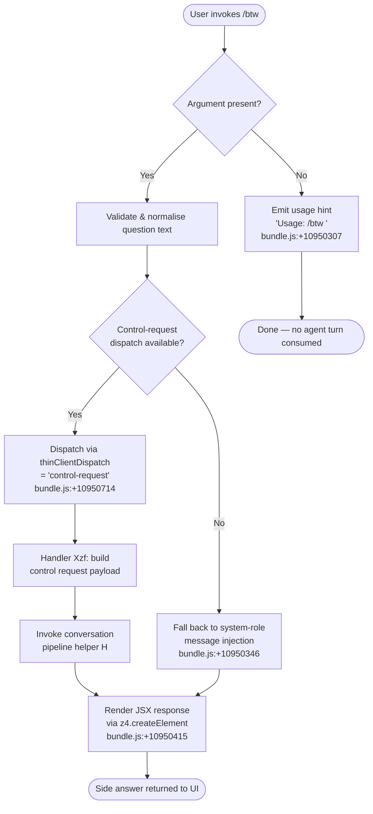

# `/btw`

> Analysis basis: CC v2.1.165 bundle.js (AST extraction + Claude interpretation)
> Minimum version: v2.1.165

---

## Overview

`/btw` ("by the way") is a lightweight side-question command that lets the user pose a quick, scoped question to Claude without disrupting the main conversational thread. It is dispatched immediately via the `control-request` thin-client path, meaning the question is routed as a control-plane request rather than a normal conversation turn, preserving the primary session state.

---

## Registration

| Field | Value |
|---|---|
| type | `local-jsx` |
| name | `btw` |
| description | Ask a quick side question without interrupting the main conversation |
| argumentHint | `<question>` |
| immediate | `true` |
| thinClientDispatch | `control-request` |
| module_id | `Uxq` |
| load_inline | `true` |
| loc_byte | `10950714` |
| loc_byte_end | `10950953` |
| loc_line | `7270` |
| arbor_handler.name | `Xzf` |
| arbor_handler.fqn | `claude-2.1.165::Xzf` |
| arbor_handler.kind | `AsyncFunction` |
| arbor_handler.resolution_path | `module_id` |
| arbor_handler.n_hits | `0` |

Analysis basis: CC v2.1.165 bundle.js:+10950714

---

## Input Branching

The command exhibits three distinct branches depending on argument presence and dispatch validation, warranting a Mermaid flowchart.



---

## Behavioral Spec

### Entry Point — Handler `Xzf` (AsyncFunction)

`Xzf` is the primary async handler resolved by Arbor via the `module_id` path (`Uxq`).

Analysis basis: CC v2.1.165 bundle.js:+10950305

```
async function btwCommandHandler(commandInput):
    question = commandInput.args.trim()

    if question is empty:
        emit usageMessage("Usage: /btw <your question>")   // bundle.js:+10950307
        return earlyExit()

    controlPayload = buildControlRequest(question)         // calls X8
    conversationResult = await dispatchConversation(       // calls H
        payload = controlPayload,
        role  = "system"                                   // bundle.js:+10950346
    )
    return renderJSX(conversationResult)                   // calls z4.createElement, bundle.js:+10950415
```

### Sub-feature: Argument Validation and Usage Hint

When the user invokes `/btw` without a `<question>` argument, the handler short-circuits and surfaces the usage string `"Usage: /btw <your question>"` without creating any agent turn.

Analysis basis: CC v2.1.165 bundle.js:+10950307

```
function validateArgument(rawInput):
    if rawInput is null or rawInput.trim() == "":
        return { valid: false, hint: "Usage: /btw <your question>" }
    return { valid: true, text: rawInput.trim() }
```

### Sub-feature: Control-Request Payload Construction (`X8`)

`X8` constructs the thin-client control-request payload. It delegates to `CX_` for config/context resolution and `bDH` for config-file reading, which reads project config via `readFileSync` with `"utf-8"` encoding (bundle.js:+3262004). Backup file rotation (`.backup.` suffix, bundle.js:+3260774) and lock-contention guards are applied.

Analysis basis: CC v2.1.165 bundle.js:+10950369

```
function buildControlRequest(questionText):
    context = resolveConversationContext()   // CX_ — reads config, manages backups
    timestamp = Date.now()                   // bundle.js:+3259749
    payload = assemblePayload(
        text      = questionText,
        context   = context,
        timestamp = timestamp,
        meta      = collectFileMeta()        // $r1 — Object.entries traversal
    )
    return payload
```

### Sub-feature: Conversation Pipeline Dispatch (`H`)

`H` is the shared conversation pipeline helper invoked by `Xzf`. It performs a bootstrap fetch (log prefix `"[Bootstrap] Fetching"`, bundle.js:+15724583) with a 5000 ms timeout (bundle.js:+15724784), sets headers `Content-Type: application/json` and `User-Agent` (bundle.js:+15724668, +15724702), and routes through the normalisation chain (`Gw_`, `ZHH`, `uj`, `e1`).

Analysis basis: CC v2.1.165 bundle.js:+15724581

```
async function dispatchConversation(payload, role):
    log("[Bootstrap] Fetching ...")                   // bundle.js:+15724583
    headers = {
        "Content-Type": "application/json",           // bundle.js:+15724683
        "User-Agent":   <agentString>                 // bundle.js:+15724702
    }
    response = await fetchWithTimeout(
        url     = resolveEndpoint(_A.get(...)),        // bundle.js:+15724619
        headers = headers,
        timeout = 5000                                 // bundle.js:+15724784
    )
    if parseFailed(response):
        emitTelemetry("api_bootstrap_fetch", "parse_failed")  // bundle.js:+15724927
        raise error
    log("[Bootstrap] Fetch ok")                       // bundle.js:+15724957
    normalised = normaliseInput(response)             // Gw_, ZHH, uj, e1
    return normalised
```

### Sub-feature: Input Normalisation Chain

The normalisation pipeline consists of several sequential helpers:

- **`Gw_`** — splits the raw string, trims whitespace, locates first index separator (bundle.js:+2974480–2974583).
- **`ZHH`** — performs a cache-set membership check (bundle.js:+843864).
- **`uj`** — applies a regex replacement to sanitise the input (bundle.js:+2244785).
- **`e1`** / **`D6H`** / **`Aq`** — further normalise and classify model-tier identifiers (`"sonnet"`, `"haiku"`, `"opus"`, `"best"`, `"opusplan"`) and API-provider strings (`"firstParty"`, `"anthropicAws"`, `"gateway"`, `"mantle"`) (bundle.js:+2239233–2243495).

Analysis basis: CC v2.1.165 bundle.js:+15724723

```
function normaliseInput(rawResponse):
    parts     = splitAndTrim(rawResponse)             // Gw_
    validated = checkCacheSet(parts)                  // ZHH
    sanitised = applyRegexSanitise(validated)         // uj
    classified = classifyModelTier(sanitised)         // e1 → D6H → Aq
    return classified
```

### Sub-feature: Conversation-File Append Pipeline (`v` / `acK` / `ocK`)

The `v` helper manages writing the side-question interaction to the conversation log. It invokes `acK`, which in turn calls `ocK` for the actual file operations: `Zy.mkdir` (create log directory if absent), `Zy.appendFile` (append the question/answer record), and `Zy.rename`/`Zy.unlink` for atomic rotation. Buffer byte-length is checked before each write (bundle.js:+205771).

Analysis basis: CC v2.1.165 bundle.js:+206075

```
async function appendConversationRecord(entry):
    dirPath = path.dirname(logFilePath)               // acK → KHH.dirname
    await ensureDir(dirPath)                          // ocK → Zy.mkdir
    byteLen = Buffer.byteLength(entry)                // bundle.js:+205771
    if byteLen exceeds threshold:
        rotateFile()                                  // a2A → Zy.rename / Zy.unlink
    await Zy.appendFile(logFilePath, entry)           // bundle.js:+205376
    scheduleDebounce()                                // $pH — clearTimeout/setTimeout
```

### Sub-feature: Debounced Flush (`$pH`)

`$pH` is a debounce/flush helper that batches pending writes. It uses `clearTimeout` + `setTimeout` with a 1000 ms window (bundle.js:+59625) and a maximum batch size of 100 (bundle.js:+59646). When the batch is ready, `setImmediate` is used for the final flush (bundle.js:+59994).

Analysis basis: CC v2.1.165 bundle.js:+205563

```
function debouncedFlush(pendingItems):
    clearTimeout(existingTimer)                       // bundle.js:+59737
    if pendingItems.length >= 100:                    // bundle.js:+59646
        flushNow(pendingItems)
    else:
        timer = setTimeout(flushNow, 1000)            // bundle.js:+59625
        setImmediate(processQueue)                    // bundle.js:+59994
```

### Sub-feature: JSX Rendering (`z4.createElement`)

After the control request completes, `Xzf` renders the reply surface using `z4.createElement`, passing the conversation result as props. This produces the inline UI component shown in the terminal.

Analysis basis: CC v2.1.165 bundle.js:+10950415

```
function renderBtwReply(conversationResult):
    return z4.createElement(BtwReplyComponent, {
        result: conversationResult
    })
```

---

## State & Side Effects

| Item | Detail |
|---|---|
| Telemetry — `tengu_feature_sad` | Emitted on feature-level error path (bundle.js:+1010365) |
| Telemetry — `tengu_config_lock_contention` | Emitted when config lock acquisition is slow (bundle.js:+3259977); accompanied by literal "Lock acquisition took longer than expected…" |
| Telemetry — `tengu_config_stale_write` | Emitted when a re-read config is detected as stale during write (bundle.js:+3260113) |
| Telemetry — `tengu_config_parse_error` | Emitted on config JSON parse failure (bundle.js:+3262552) |
| Telemetry — `tengu_config_auth_loss_prevented` | Emitted when a write that would wipe auth is blocked (bundle.js:+3260456) |
| Telemetry — `tengu_bg_dispatch_sigkill_escalate` | Emitted in background-session SIGKILL escalation path (bundle.js:+16133657) |
| Telemetry — `tengu_bg_dispatch_low_mem` | Emitted on low-memory condition in background dispatch (bundle.js:+16134258) |
| Telemetry — `tengu_bg_spare_enable` | Emitted when a spare background worker is enabled (bundle.js:+16134962) |
| Telemetry — `tengu_bg_spare_claim` | Emitted when a spare worker is claimed (bundle.js:+16135090) |
| Telemetry — `tengu_bg_spare_claim_fail` | Emitted on spare-worker claim failure (bundle.js:+16135356) |
| Telemetry — `tengu_daemon_control` | Emitted on daemon control operations (bundle.js:+16170625) |
| Telemetry — `tengu_daemon_config_reload` | Emitted when daemon reloads config (bundle.js:+16149069) |
| Telemetry — `tengu_bg_retire_pinned_low_mem` | Emitted when pinned workers are retired due to low memory (bundle.js:+16138262) |
| Telemetry — `tengu_bg_prewarm_per_sweep` | Emitted during background prewarm sweep (bundle.js:+16138383) |
| Conversation log file | Side question and response are appended to the conversation log file via `Zy.appendFile` (bundle.js:+205376) |
| Config file read | `bDH` reads project config via `readFileSync` with `"utf-8"` encoding (bundle.js:+3262004) |
| Config file write | `CX_` may write config with lock; backup rotation uses `.backup.` infix (bundle.js:+3260774), retaining up to 5 backups (bundle.js:+3260907) |
| Lock contention guard | Config writes guarded by file lock; 60000 ms timeout (bundle.js:+3260658) |
| Auth-loss guard | Write blocked if re-read config is missing auth present in cache (bundle.js:+3260304) |
| Hook registration | `j9` calls `zXA.register` (bundle.js:+60323) — registers an internal hook |
| appState changes | None identified in depth-2 traversal for this command's primary path |
| Sound | `<!-- TODO: not found in depth-2 traversal; needs --depth 4 -->` |
| Dispatch mode | `thinClientDispatch: "control-request"` — bypasses the normal agent-turn queue |
| immediate flag | `true` — command is executed without waiting for a pending turn to complete |

---

## Version History

| Version | Change |
|---|---|
| v2.1.165 | Initial analysis |

---

## Common Mistakes

1. **Invoking `/btw` without an argument** — The handler will emit `"Usage: /btw <your question>"` and return immediately without sending anything to the model. Always supply the question text: `/btw <your question>`.
2. **Expecting `/btw` to resume or reference the main conversation turn** — Because it dispatches via `control-request` with `immediate: true`, the side question runs independently of the primary conversation queue. Answers will not automatically have access to mid-turn context that has not yet been committed.
3. **Assuming the answer appears inline in the main transcript** — `/btw` renders through a separate JSX component path (`z4.createElement`). The reply surface is distinct from normal assistant messages and may appear differently in the UI.
4. **Running `/btw` during config lock contention** — If another Claude instance holds the config lock, `tengu_config_lock_contention` may fire and the dispatch could be delayed. The lock timeout is 60000 ms (bundle.js:+3260658).
5. **Mistaking `/btw` for a persistent context injection** — The command uses `role: "system"` framing (bundle.js:+10950346) for the control message, not a user turn, so it does not persist in the main conversation history.

---

## Appendix — Identifier Mapping

> For bundle debugging only. Identifiers change across versions.

| Identifier | Role |
|---|---|
| `Xzf` | Primary `/btw` command handler (AsyncFunction, Arbor-resolved) |
| `H` | Conversation pipeline dispatcher / bootstrap fetch helper |
| `v` | Conversation-file write orchestrator |
| `icK` | Write pipeline sub-coordinator |
| `DXA` | Write pipeline helper (delegates to `rgK`, `ogK`) |
| `SH` | JSON serialiser utility (calls `JSON.stringify`) |
| `J4` | Path/string construction helper (uses `c2A`, `H.replace`, `q.at`, `A.lastIndexOf`, `A.slice`) |
| `c2A` | Array-map helper over `QcK` |
| `q` | File-system utility (unlinkSync, etc.) |
| `A` | String/path helper (toLowerCase, etc.) |
| `ppH` | Write-stream helper (calls `C2A` → `H.write`) |
| `C2A` | Stream write wrapper |
| `acK` | Conversation-log append coordinator |
| `$pH` | Debounce/flush scheduler (clearTimeout, setTimeout, setImmediate) |
| `d3H` | Log-path builder (calls `KU6`, `KHH.join`, `a8`, `S6`) |
| `Q6` | Path resolver utility |
| `aL6` | Auxiliary logger (calls `v8`) |
| `s2A` | Secondary path-join helper |
| `a2A` | Atomic file-rotation helper (stat, rename, unlink, `.txt` suffix) |
| `ocK` | File append + rotate executor (mkdir, appendFile, rename, unlink) |
| `j9` | Hook registration caller (calls `zXA.register`) |
| `e$` | Session/context accessor |
| `Gw_` | Input splitter/trimmer (split, trim, indexOf, slice) |
| `ZHH` | Cache-set membership checker |
| `uj` | Input sanitiser (regex replace) |
| `e1` | Normalisation entry (delegates to `D6H`, `Aq`, `eX`) |
| `D6H` | Model-tier classifier (calls `x0`, `IqH`, `SA`, `yd`) |
| `x0` | Classification sub-helper |
| `IqH` | Classification sub-helper |
| `yd` | Detailed model/context normaliser |
| `Aq` | Model-alias resolver (sonnet/haiku/opus/best/opusplan) |
| `o0` | Model-alias lookup (calls `q4H`) |
| `_4H` | Model-name include-check (calls `H4H.includes`) |
| `wI` | Model-tier brancher (calls `gM`, `Z5`) |
| `NQH` | Model-normalisation helper (calls `Z5`) |
| `NE` | Provider classifier (firstParty/anthropicAws/gateway) |
| `SX1` | Normalisation wrapper (calls `NE`) |
| `gM` | Provider-kind mapper (calls `XA`) |
| `Pe6` | Model-list inclusion checker (calls `r1L.includes`) |
| `vQH` | Model variant helper (calls `eH`) |
| `eX` | Extended normaliser (calls `Aq`, `r0`) |
| `r0` | Full-path normaliser (ZA, P6H, PYH, IQH, NE, z2, gM, XA, Z5, wI) |
| `s6` | Telemetry/event emitter (calls `c`, `P6`) |
| `c` | Core event-emit primitive |
| `P6` | Event-emit helper (calls `Nu6`) |
| `Nu6` | Low-level event sink |
| `X8` | Control-request payload builder |
| `CX_` | Config context resolver + config-write orchestrator |
| `L` | File-system wrapper (mkdirSync, statSync, etc.) |
| `f` | Stream/handle manager (close, finally) |
| `XP1` | Payload assembly helper (calls `k5_`, `Object.assign`) |
| `k5_` | Payload field builder (calls `JP1`) |
| `v8` | Error/exception logger |
| `bDH` | Config file reader (readFileSync, statSync, mkdirSync, copyFileSync) |
| `B6` | JSON parse wrapper |
| `Ix` | String prefix stripper (startsWith, slice) |
| `Or1` | Directory/backup reader (readdirStringSync, basename, dirname) |
| `bX_` | Backup path builder (join, `"backups"` dir) |
| `w` | Background worker manager (spawn, kill, freemem, SIGKILL) |
| `fj6` | Config-write finaliser |
| `V` | UI scroll/viewport component |
| `P` | Terminal editor/pager component (NFC normalisation, INSERT/NORMAL mode) |
| `J` | Worker-pool accessor (calls `w`) |
| `j` | Worker killer (values, R.kill) |
| `z` | Daemon stop controller (hH, RH, Yh, Tp) |
| `Y` | Supervisor renderer (write, start, stop, updateConfig) |
| `h` | Worker health sweep (respawnIfIdleStale, retireIfSettled, shiftGraceClocksForward) |
| `L3A` | Editor key-motion registry (operator/find/replace/indent motions) |
| `C` | Request enqueuer (deq, I.enqueue, Pj.randomUUID) |
| `T` | Supervisor instance handle |
| `TM6` | Atomic file writer (readlinkSync, openSync, writeFileSync, fchmodSync, fsyncSync, renameSync) |
| `O` | Symlink stat checker |
| `R8` | Error re-thrower (calls `v8`) |
| `_lH` | Locale/format helper |
| `$r1` | Object-entries iterator |
| `t98` | Timestamp sampler (Date.now) |
| `RX_` | Config-write retry helper (eT, Q6, dirname, UJ, SH, TM6) |

---

Note: index built via Arbor fallback; some signals (telemetry, literals) may be missing — see arbor-fallback.js.