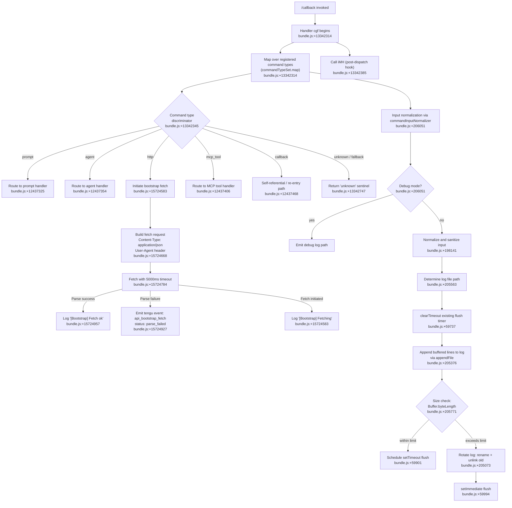

# `/callback`

> Analysis basis: CC v2.1.165 bundle.js (AST extraction + Claude interpretation)
> Minimum version: v2.1.165

---

## Overview

The `/callback` command is a `callback`-type slash command registration that serves as a programmatic re-entry point into the Claude Code CLI's command dispatch system. Unlike `prompt`-type or `agent`-type commands, it routes control flow through an internally registered handler (`cgf`) rather than generating user-visible prompt text, acting as a structural bridge between external invocation contexts (HTTP, MCP tool calls, etc.) and the core command processing pipeline.

---

## Registration

| Field | Value |
|---|---|
| type | `callback` |
| name | `callback` |
| description | `null` |
| loc_byte | `13342701` |
| loc_byte_end | `13342734` |
| loc_line | `10694` |
| arbor_handler.name | `cgf` |
| arbor_handler.fqn | `claude-2.1.165::cgf` |
| arbor_handler.kind | `Function` |
| arbor_handler.resolution_path | `direct` |
| arbor_handler.n_hits | `1` |

Analysis basis: CC v2.1.165 bundle.js:+13342701

---

## Input Branching

The call graph from `cgf` fans out across multiple distinct paths: the command-type dispatch (mapping over a command-type set `H`), the bootstrap fetch path (HTTP fetch with Content-Type/User-Agent headers), the log-file append pipeline, and error/fallback branches. This exceeds 3 distinct branches and warrants a Mermaid flowchart.



---

## Behavioral Spec

### Top-Level Handler: `cgf`

The Arbor-resolved handler `cgf` is the direct entry point for `/callback`. It maps over a set of registered command-type descriptors and dispatches each to the appropriate sub-handler.

```
function callbackCommandHandler(registeredCommandTypes, inputContext):
    results = commandTypeSet.map(commandType =>
        dispatchByType(commandType, inputContext)
    )
    postDispatchHook(inputContext)   // iMH
    return results
```

Analysis basis: CC v2.1.165 bundle.js:+13342314, +13342385

---

### Command Type Dispatch: `dispatchByType` (derived from `v`)

The central dispatch function inspects a type discriminator string and routes to the appropriate sub-handler. The string `"command"` appears as a literal key in this routing context.

```
function dispatchByType(commandType, inputContext):
    switch commandType.kind:
        case "prompt":
            return handlePromptCommand(inputContext)
        case "agent":
            return handleAgentCommand(inputContext)
        case "http":
            return handleHttpBootstrapFetch(inputContext)
        case "mcp_tool":
            return handleMcpToolCommand(inputContext)
        case "callback":
            return handleCallbackReEntry(inputContext)
        default:
            return "unknown"
```

Analysis basis: CC v2.1.165 bundle.js:+206051, +13342345, +13342747

---

### Input Normalization: `commandInputNormalizer` (derived from `icK`)

Before dispatch, raw command input is normalized. A debug-mode branch emits additional trace output. Sensitive content is replaced with `"[REDACTED]"` at offset +198141. An integer index of `2` is used in slice/replacement operations (bundle.js:+198170).

```
function normalizeCommandInput(rawInput, debugMode):
    if debugMode:
        emitDebugLog(rawInput)           // literal "debug" at +206051
    sanitized = redactSensitiveFields(rawInput)   // "[REDACTED]" at +198141
    normalized = applyNormalizationRules(sanitized, index=2)
    trimmed = normalized.trim()
    upperCased = trimmed.toUpperCase()
    return trimmed  // final normalized form
```

Sub-calls within normalization:
- `Vy` — validation/verification helper (bundle.js:+204684)
- `ncK` — normalization core (bundle.js:+204798)
- `DXA` — redaction/dispatch assist, calls `rgK` and `ogK` (bundle.js:+204811, +61456, +61470)

Analysis basis: CC v2.1.165 bundle.js:+204684, +204798, +204811, +206051, +198141

---

### Bootstrap HTTP Fetch: `bootstrapFetcher` (derived from `H`)

When the command type resolves to `"http"`, the handler initiates a bootstrapping fetch against a remote endpoint. A debug log `"[Bootstrap] Fetching"` is emitted before the request (bundle.js:+15724583). The request carries `Content-Type: application/json` (bundle.js:+15724683) and a `User-Agent` header (bundle.js:+15724702). A 5000 ms timeout is enforced (bundle.js:+15724784).

```
function handleHttpBootstrapFetch(context):
    log("[Bootstrap] Fetching")
    response = fetchWithTimeout(
        url = resolveBootstrapUrl(context),
        headers = {
            "Content-Type": "application/json",
            "User-Agent": buildUserAgent()
        },
        timeout = 5000
    )
    if response.parseOk:
        log("[Bootstrap] Fetch ok")
        return parsedData
    else:
        emitTelemetry("api_bootstrap_fetch", { status: "parse_failed" })
        return null
```

Sub-calls:
- `_A.get` — retrieve cached state (bundle.js:+15724619)
- `e$` — response processor (bundle.js:+15724715)
- `Gw_` — URL/header parser: uses `split`, `trim`, `indexOf`, `slice` (bundle.js:+15724723)
- `ZHH` — cache set membership check via `c44.has` (bundle.js:+15724754)
- `uj` — string replacement helper (bundle.js:+15724766)
- `e1` — token/model resolution (bundle.js:+15724769)
- `P45` — auxiliary fetch helper (bundle.js:+15724793)

Analysis basis: CC v2.1.165 bundle.js:+15724583, +15724619, +15724668, +15724683, +15724702, +15724784, +15724905, +15724927, +15724957

---

### Log File Write Pipeline: `logFileWriter` (derived from `acK`)

The log write subsystem buffers output lines, manages file rotation, and flushes via both `setTimeout` and `setImmediate` to avoid blocking.

```
function writeToLogFile(content, logDir):
    targetPath = path.dirname(logDir)            // KHH.dirname at +205596
    filePath = buildLogFilePath(targetPath)       // s2A at +205733

    // Debounce: cancel existing flush timer
    clearTimeout(existingFlushTimer)              // +59737

    // Append buffered lines
    lines = pendingLines.join(separator)          // $.join at +59811, L.join at +59855
    appendChunk(filePath, lines)                  // ocK.bind -> Zy.appendFile at +205376

    byteSize = Buffer.byteLength(content)         // +205771
    if byteSize exceeds rotation threshold:
        rotateLogFile(filePath)                   // a2A -> Zy.rename at +205073
        unlinkOldFile(filePath)                   // Zy.unlink at +205113
        setImmediate(flushImmediately)            // +59994
    else:
        setTimeout(flushDeferred, FLUSH_DELAY)    // +59901

    // Register with global timer registry
    registerTimer(flushHandle)                    // j9 -> zXA.register at +60323
```

Key constants observed:
- Timer delay 1000 ms (bundle.js:+59625)
- Timer limit 100 entries (bundle.js:+59646)
- `.txt` extension used for log file names (bundle.js:+205021)
- Byte slice offset `4` used during rotation (bundle.js:+205043)
- `"EISDIR"` error code handled during directory creation (bundle.js:+175646)

Sub-calls:
- `$pH` — core flush/buffer manager (bundle.js:+205563)
- `d3H` — log path builder calling `KU6`, `KHH.join`, `a8`, `S6` (bundle.js:+205588)
- `aL6` / `v8` — EISDIR-aware directory creation (bundle.js:+205716, +175638)
- `s2A` — path join helper (bundle.js:+205733)
- `a2A` — file stat + rename + unlink for rotation (bundle.js:+205765)
- `ocK` — mkdir + appendFile pipeline (bundle.js:+205830)
- `e2A` — error handler (bundle.js:+205804)

Analysis basis: CC v2.1.165 bundle.js:+205563, +205596, +205733, +205771, +205804, +205821, +205830, +59625, +59646, +59737, +59901, +59994

---

### Model/Token Resolution: `modelTokenResolver` (derived from `e1` / `Aq`)

When the HTTP path requires determining the active model context, a resolution chain normalises the model name string and maps it to a provider class.

```
function resolveModelContext(rawModelString):
    trimmed = rawModelString.trim()
    lower = trimmed.toLowerCase()

    // Keyword-based model family detection
    if lower includes "opusplan":   return modelConfig("opusplan")  // +2243249
    if lower includes "[1m]":       return modelConfig("1m-class")  // +2243275
    if lower includes "sonnet":     return modelConfig("sonnet")    // +2243290
    if lower includes "haiku":      return modelConfig("haiku")     // +2243329
    if lower includes "opus":       return modelConfig("opus")      // +2243368
    if lower == "best":             return modelConfig("best")      // +2243405

    // Provider routing
    if domain starts with "anthropic.":
        providerClass = "firstParty"                                // +2239457
    else if providerClass == "anthropicAws":
        providerClass = "anthropicAws"                             // +2097366
    else if providerClass == "gateway":
        providerClass = "gateway"                                   // +2097386
    else if providerClass == "mantle":
        providerClass = "mantle"                                    // +2240098

    return buildModelDescriptor(lower, providerClass)
```

Sub-calls:
- `D6H` — top-level model resolution entry (bundle.js:+2239233)
- `yd` — model string parser, splits on `"anthropic."` prefix (bundle.js:+2239191)
- `_4H` — inclusion check against `H4H` list (bundle.js:+2243228, +2236359)
- `wI` — model wrapper calling `gM` and `Z5` (bundle.js:+2243267)
- `NQH` — secondary model wrapper calling `Z5` (bundle.js:+2243344)
- `NE` — model descriptor builder calling `gM`, `Z5`, `XA` (bundle.js:+2243382)
- `SX1` — single-model resolution calling `NE` (bundle.js:+2243419)
- `Pe6` — provider inclusion check against `r1L` (bundle.js:+2243443)
- `vQH` — provider resolver calling `eH` (bundle.js:+2243451)
- `eX` — extended resolver calling `Aq` and `r0` (bundle.js:+2239283)
- `r0` — low-level model assembler (bundle.js:+2239988–+2240133)

Analysis basis: CC v2.1.165 bundle.js:+2239080, +2239233, +2239310, +2239457, +2243153, +2243249, +2243368, +2243405

---

### Telemetry & Bootstrap Reporting: `s6`

The `s6` function handles telemetry emission and references the `tengu_feature_sad` event. It delegates to `c` (core telemetry emitter) and `P6` / `Nu6` (reporting infrastructure).

```
function emitFeatureTelemetry(featureName, outcome):
    if outcome == SAD:
        emit("tengu_feature_sad", { feature: featureName })   // +1010365
    reportToInfrastructure(featureName, outcome)               // P6 -> Nu6
```

Analysis basis: CC v2.1.165 bundle.js:+1010363, +1010365, +1010399

---

### File Path Utility: `filePathHelper` (derived from `J4`)

Constructs sanitised file paths from a raw string, performing directory-level truncation and extension normalisation. A string `"[REDACTED]"` is substituted for sensitive path segments (bundle.js:+198141). Path depth is limited to index position `2` (bundle.js:+198170). File names are truncated at 40 characters (bundle.js:+16160428).

```
function buildSanitisedFilePath(rawPath):
    base = applyNameMapping(rawPath)          // c2A -> QcK.map at +197777
    sanitized = base.replace(sensitive, "[REDACTED]")  // +198141
    parts = sanitized.split(separator)
    last = parts.at(-1)                       // q.at at +198199
    idx = last.lastIndexOf(".")               // A.lastIndexOf at +198225
    ext = idx >= 0 ? last.slice(idx) : ""    // A.slice at +198251
    name = last.slice(0, 40)                  // +16160428
    return path.join(base, name + ext)
```

Analysis basis: CC v2.1.165 bundle.js:+198062, +198089, +198141, +198170, +198199, +198225, +198251, +16160354, +16160428

---

### JSON Serialization Helper: `jsonStringifyHelper` (derived from `SH`)

Wraps `JSON.stringify` for safe serialization of command payloads before logging or transmission.

```
function safeSerialize(value):
    return JSON.stringify(value)   // +185153
```

Analysis basis: CC v2.1.165 bundle.js:+185153

---

### Write Stream Helper: `writeStreamHelper` (derived from `C2A` / `ppH`)

Manages a writable stream for log output, delegating to `H.write`.

```
function writeToStream(stream, data):
    stream.write(data)     // C2A -> H.write at +193190
```

Analysis basis: CC v2.1.165 bundle.js:+193190, +193254

---

## State & Side Effects

| Item | Detail |
|---|---|
| Telemetry | `tengu_feature_sad` (bundle.js:+1010365); `api_bootstrap_fetch` with `parse_failed` status (bundle.js:+15724927) |
| Log file I/O | Append via `Zy.appendFile` (+205376); rotate via `Zy.rename` (+205073) and `Zy.unlink` (+205113); directory creation via `Zy.mkdir` (+205317) |
| Timer state | `clearTimeout` on existing flush timer (+59737); `setTimeout` scheduling (+59901); `setImmediate` for immediate flush (+59994) |
| Timer registry | Global timer registered via `zXA.register` through `j9` (+60323) |
| Write stream | Active writable stream mutated via `H.write` (+193190) |
| Model/provider resolution | Resolved model descriptor cached or returned; no persistent appState mutation observed at depth ≤ 2 |
| Bootstrap cache | `_A.get` reads from a shared cache map `c44` via `ZHH` (+15724619, +843864) |
| File path sanitisation | Sensitive path segments replaced with `"[REDACTED]"` in log output (+198141) |
| Error handling | `"EISDIR"` error code handled gracefully during log directory creation (+175646); `e2A` error handler called in log write path (+205804) |
| Sound | <!-- TODO: not found in depth-2 traversal; needs --depth 4 --> |
| appState changes | <!-- TODO: not found in depth-2 traversal; needs --depth 4 --> |

---

## Version History

| Version | Change |
|---|---|
| v2.1.165 | Initial analysis |

---

## Common Mistakes

1. **Treating `/callback` as a user-facing prompt command.** Its `type` is `"callback"` and `description` is `null` — it is not surfaced in the command palette and is not intended for direct user invocation. It is a programmatic re-entry point.
2. **Assuming the handler is a `getPromptForCommand` method.** No `handler_method` or `prompt_body` is present; the handler `cgf` is a plain `Function` resolved via `direct` Arbor path. There is no prompt text to inspect.
3. **Ignoring the log rotation threshold.** The log write pipeline silently rotates files when `Buffer.byteLength` of buffered content exceeds an internal limit. Applications relying on a single continuous log file may miss this behavior.
4. **Expecting a synchronous result.** The bootstrap fetch enforces a 5000 ms timeout (+15724784) and the log flush uses both `setTimeout` (1000 ms, +59625) and `setImmediate` (+59994); callers should not assume immediate side effects.
5. **Missing the `"unknown"` sentinel.** When the command type discriminator does not match any known type string, the handler returns the literal `"unknown"` (+13342747) rather than throwing. Callers must check for this sentinel explicitly.
6. **Confusing the `callback` type entry in the type-set map with recursion.** The literal `"callback"` at +12437468 is a type-discriminator value inside the command-type map, not an indication that the command recursively invokes itself in the general case.

---

## Appendix — Identifier Mapping

> For bundle debugging only. Identifiers change across versions.

| Identifier | Role |
|---|---|
| `cgf` | Top-level `/callback` command handler (Arbor-resolved entry point) |
| `H` | Bootstrap fetch orchestrator / command-type collection |
| `v` | Command type dispatch function |
| `icK` | Command input normalizer |
| `DXA` | Redaction/dispatch assist (calls `rgK`, `ogK`) |
| `SH` | JSON serialization wrapper |
| `J4` | Sanitised file path builder |
| `c2A` | Name mapping helper (calls `QcK.map`) |
| `q` | File unlink helper (`puK.unlinkSync`) |
| `A` | Lowercase file name helper (`f.toLowerCase`) |
| `ppH` | Write stream facade |
| `C2A` | Stream write executor (`H.write`) |
| `acK` | Log file write pipeline orchestrator |
| `$pH` | Core flush/buffer manager |
| `d3H` | Log path builder |
| `Q6` | Auxiliary log path helper |
| `aL6` | EISDIR-aware directory creation wrapper |
| `s2A` | Path join helper |
| `a2A` | File stat + rename + unlink rotation handler |
| `ocK` | mkdir + appendFile pipeline |
| `j9` | Timer registry registrar |
| `e$` | HTTP response processor |
| `Gw_` | URL/header string parser |
| `ZHH` | Bootstrap cache membership checker |
| `uj` | String replacement utility |
| `e1` | Token/model resolution entry |
| `D6H` | Model resolution top-level dispatcher |
| `x0` | Model resolution sub-helper |
| `IqH` | Model resolution intermediate |
| `yd` | Model string parser (splits on `"anthropic."`) |
| `Aq` | Model name normalizer and descriptor builder |
| `o0` | Model lookup sub-helper (`q4H`) |
| `_4H` | Model family inclusion checker (`H4H.includes`) |
| `wI` | Model wrapper (calls `gM`, `Z5`) |
| `NQH` | Secondary model wrapper (calls `Z5`) |
| `NE` | Model descriptor assembler (calls `gM`, `Z5`, `XA`) |
| `SX1` | Single-model resolver (calls `NE`) |
| `gM` | Provider class resolver (calls `XA`) |
| `Pe6` | Provider inclusion checker (`r1L.includes`) |
| `vQH` | Provider resolver (calls `eH`) |
| `eX` | Extended model resolver (calls `Aq`, `r0`) |
| `r0` | Low-level model assembler |
| `s6` | Telemetry emission and feature reporting |
| `c` | Core telemetry emitter |
| `P6` | Reporting infrastructure delegate |
| `Nu6` | Low-level reporting function |
| `iMH` | Post-dispatch hook called after command-type map |

---

Note: index built via Arbor fallback; some signals (telemetry, literals) may be missing — see arbor-fallback.js.