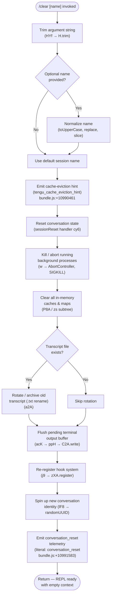

# `/clear`

> Analysis basis: CC v2.1.165 bundle.js (AST extraction + Claude interpretation)
> Minimum version: v2.1.165

---

## Overview

`/clear` starts a fresh conversation session with an empty context window while preserving the previous session on disk so it can be resumed later with `/resume`. It is also reachable under the aliases `/reset` and `/new`. The command trims the optional `[name]` argument, emits a cache-eviction hint, tears down any running background processes, resets all in-memory caches, and wires up a new conversation loop before returning control to the REPL.

---

## Registration

| Field | Value |
|---|---|
| type | `local` |
| name | `clear` |
| description | Start a new session with empty context; previous session stays on disk (resumable with /resume) |
| argumentHint | `[name]` |
| aliases | `reset`, `new` |
| supportsNonInteractive | `true` |
| thinClientDispatch | `post-text` |
| module_id | `Zuq` |
| load_inline | `true` |
| loc_byte | 10992456 |
| loc_byte_end | 10992747 |
| loc_line | 7291 |
| arbor_handler.name | `HYf` |
| arbor_handler.fqn | `claude-2.1.165::HYf` |
| arbor_handler.kind | `AsyncFunction` |
| arbor_handler.resolution_path | `module_id` |
| arbor_handler.n_hits | 0 |

Analysis basis: CC v2.1.165 bundle.js:+10992456

---

## Input Branching

There are more than three distinct paths through `HYf` and its immediate callees, so a Mermaid flowchart is used.



---

## Behavioral Spec

### 1. Entry point and argument normalization

The Arbor-resolved handler is `HYf` (AsyncFunction, `claude-2.1.165::HYf`).

```
async function clearCommandHandler(rawArg, appContext):
    trimmedArg = rawArg.trim()                    // HYf → H.trim  +10992282
    normalizedName = normalizeName(trimmedArg)    // cy6 subtree
    await resetSession(normalizedName, appContext)
```

Analysis basis: CC v2.1.165 bundle.js:+10992282

### 2. Name normalization (`cy6` / `ny6`)

```
function normalizeName(arg):
    parsed = parseInt(arg, 10)                    // ny6 → parseInt  +13293549
    if Number.isFinite(parsed):
        clampedIndex = Math.max(0, Math.min(parsed, maxIndex))  // +13293767
        return resolveNameByIndex(clampedIndex)   // BD subtree
    else:
        return arg  // raw string name used as-is
```

Analysis basis: CC v2.1.165 bundle.js:+10990357

### 3. Full session reset orchestrator (`cy6`)

`cy6` is the core reset function called by `HYf`. Its responsibilities, in execution order:

1. **Emit cache-eviction hint** — fires `tengu_cache_eviction_hint` event so downstream systems know context is being dropped. Analysis basis: CC v2.1.165 bundle.js:+10990461
2. **Signal session end** — the literal `"SessionEnd"` hook event (+13284107) is dispatched so registered hooks can persist state before tear-down.
3. **Set abort signal with timeout** — `AbortSignal.timeout` (+10990417) is armed so hung background tasks are forcibly cancelled.
4. **Walk object values** — iterates all live background process descriptors (`Object.values` +10990806) and dispatches kill/cleanup.
5. **Clear in-memory state** — delegates to the cache-clearing sub-tree (`P8A` → `zs`, `MF`, `vOq`, `g9q`, etc.).
6. **Re-register hooks** — calls the hook registration subsystem (`j9` → `zXA.register` +60323).
7. **Emit `conversation_reset`** — literal `"conversation_reset"` (+10991583) is fired after all cleanup is complete.
8. **Assign new UUID** — `Guq.randomUUID` (+10991622) generates a fresh conversation identity.

```
async function sessionResetOrchestrator(name, ctx):
    emit("tengu_cache_eviction_hint")
    dispatchHookEvent("SessionEnd")
    abortSignal = AbortSignal.timeout(timeoutMs)
    for proc in Object.values(liveProcessMap):
        killProcess(proc, abortSignal)
    clearAllCaches()
    flushTerminalOutput()          // ppH → C2A.write  +193190
    archiveTranscriptIfExists()    // a2A → Zy.rename  +205073
    registerHooks()                // j9 → zXA.register
    newSessionId = crypto.randomUUID()
    emit("conversation_reset")
    return newSessionId
```

Analysis basis: CC v2.1.165 bundle.js:+10990369

### 4. Cache clearing (`P8A` and `zs` subtrees)

The following caches are unconditionally cleared on `/clear`:

```
function clearAllCaches():
    clearSkillIndexCache()         // Mm → H.clearSkillIndexCache  +13154866
    clearLF()                      // Dx9 → LF.clear  +6720214
    resetSubagentState()           // LY8 → tu.delete, CC_.delete, t06.delete
    clearCompactCache()            // Z26 → CZ  +5011597
    clearQueryCaches()             // Qx9 → s06.clear, SC_.clear  +6757082
    clearMcpCache()                // vOq → VRH.clear, Xl_.clear
    clearHookCaches()              // g9q → kH6.clear, MV6.clear
    clearNotificationBuffer()      // jH_ → nBH.clear  +1108888
    clearPolicyCache()             // ab9 → mz8.clear  +6708794
    clearPermissionCache()         // KH_ → lBH.clear  +1101845
    clearCsState()                 // sKq → cs.clear, dPH.clear
    resetAutonomousLoopDelivered() // dz7.resetAutonomousLoopDelivered  +6769296
    clearMFCache()                 // MF → pN8.clear  +9960902
```

Analysis basis: CC v2.1.165 bundle.js:+10989317

### 5. Transcript archiving (`a2A`)

If a transcript file exists on disk, it is rotated before the new session begins:

```
async function archiveTranscript(transcriptPath):
    stat = await Zy.stat(transcriptPath)          // a2A → Zy.stat  +204917
    if stat exists:
        if transcriptPath.endsWith(".txt"):        // +205010
            newPath = transcriptPath.slice(0, -4) // strip 4 chars  +205032
        else:
            newPath = transcriptPath
        await Zy.rename(transcriptPath, newPath)  // +205073
        // on error: Zy.unlink(transcriptPath)    // +205113
```

The literal `".txt"` extension (+205021) and slice offset `4` (+205043) are confirmed constants.

Analysis basis: CC v2.1.165 bundle.js:+204917

### 6. Terminal output flush (`ppH` → `C2A`)

Pending terminal output is flushed to the write stream (`C2A.write` +193190) before the new context is installed, preventing stale display artifacts.

Analysis basis: CC v2.1.165 bundle.js:+193190

### 7. Hook re-registration (`j9` → `zXA.register`)

After all caches are cleared, the hook system is re-registered (+60323). This ensures that hooks configured for the new session (e.g., `SessionStart`, `PreToolUse`) are active from the first prompt.

Analysis basis: CC v2.1.165 bundle.js:+60323

### 8. Background-process tear-down (`cy6` → `w` → kill chain)

```
function killLiveProcesses(processMap, abortSignal):
    for entry in processMap.values():
        entry.kill("SIGKILL")         // literal "SIGKILL"  +16133705
        entry.close()
    // Timeout escalation: after 30 s (literal +16133612),
    //   escalate to SIGKILL if process still alive
    //   tengu_bg_dispatch_sigkill_escalate is fired  +16133657
```

Analysis basis: CC v2.1.165 bundle.js:+16133698

---

## State & Side Effects

| Item | Detail |
|---|---|
| Telemetry — `tengu_cache_eviction_hint` | Fired immediately when `/clear` runs (bundle.js:+10990461) |
| Telemetry — `tengu_feature_ok` / `tengu_feature_bad` / `tengu_feature_sad` | Fired by the REPL feature instrumentation wrapper around command dispatch (+1010222, +1010284, +1010365) |
| Telemetry — `tengu_run_hook` | Fired once the hook re-registration is completed (+13333446) |
| Telemetry — `tengu_bg_dispatch_sigkill_escalate` | Fired if a background process does not exit within the grace period (+16133657) |
| Telemetry — `tengu_shell_set_cwd` | Fired when the working directory is re-established for the new session (+8312474) |
| Telemetry — `tengu_session_renamed` | Fired if the optional `[name]` argument results in a rename (+13196744) |
| Telemetry — `tengu_repl_hook_finished` | Fired when hook execution completes after session reset (+13317226) |
| Session transcript | Old transcript file is rotated (renamed/unlinked) via `a2A` (+205073, +205113); previous session data remains on disk |
| New session UUID | Generated via `Guq.randomUUID` (+10991622); all subsequent messages use this ID |
| `conversation_reset` event | Emitted as literal string (+10991583) after full cleanup |
| `SessionEnd` hook event | Dispatched before teardown; literal `"SessionEnd"` (+13284107) |
| `SessionStart` hook event | Dispatched after re-registration; literal `"SessionStart"` (+13312864) |
| In-memory caches | All major caches cleared (skill index, subagent state, MCP, hooks, permissions — see §4) |
| Background processes | All live processes killed (SIGKILL with 30 s grace period) |
| Sound | <!-- TODO: not found in depth-2 traversal; needs --depth 4 --> |
| appState changes | Working directory re-established via `oD` → `Ke8` subtree (+8312319); backgrounded state key `"isBackgrounded"` (+10990568) is inspected during teardown |

---

## Version History

| Version | Change |
|---|---|
| v2.1.165 | Initial analysis |

---

## Common Mistakes

1. **Confusing `/clear` with permanent deletion.** The previous session is preserved on disk and is fully resumable with `/resume`. Only the in-memory context window is reset.
2. **Using `/clear` to fix MCP connection issues.** `/clear` does clear MCP caches (`vOq` → `VRH.clear`, `Xl_.clear`), but it does not reconnect servers. Use `/mcp` or restart the CLI if a server is unreachable.
3. **Expecting hooks to be silent during `/clear`.** Both `SessionEnd` and `SessionStart` hooks fire during a clear cycle. Hook scripts that perform expensive operations on these events will run on every `/clear`.
4. **Passing a non-integer name when intending an index.** The name argument is parsed with `parseInt`; non-numeric strings bypass index resolution and are used verbatim as the session name.
5. **Assuming `/reset` and `/new` behave differently.** The aliases `reset` and `new` are registered identically to `clear` — all three invoke `HYf` with identical logic.

---

## Appendix — Identifier Mapping

> For bundle debugging only. Identifiers change across versions.

| Identifier | Role |
|---|---|
| `HYf` | Main handler for `/clear` (AsyncFunction, Arbor-resolved) |
| `cy6` | Session reset orchestrator; called by `HYf`; manages full teardown and re-init |
| `ny6` | Name/index parser; resolves optional `[name]` argument |
| `BD` | Resolves session name by numeric index from policy settings |
| `SbH` | Session-end dispatcher; fires `SessionEnd` hook and saves state |
| `gL` | Session state builder for new conversation |
| `V0` | Main REPL conversation loop initializer |
| `P8A` | Global cache-clear coordinator; calls all individual clear helpers |
| `zs` | Subagent / compact-state reset helper |
| `Dx9` | Clears the `LF` (file/context) cache |
| `LY8` | Clears subagent tracking maps (`tu`, `CC_`, `t06`) |
| `MF` | Clears notification buffer (`pN8`) |
| `vOq` | Clears MCP tool caches (`VRH`, `Xl_`) |
| `g9q` | Clears hook-related caches (`kH6`, `MV6`) |
| `jH_` | Clears notification buffer (`nBH`) |
| `ab9` | Clears policy/MCP cache (`mz8`) |
| `KH_` | Clears permission cache (`lBH`) |
| `sKq` | Clears conversation-state caches (`cs`, `dPH`) |
| `acK` | Terminal output buffer manager; coordinates flush + transcript archive |
| `ppH` | Terminal output flush; calls `C2A.write` |
| `C2A` | Low-level write stream wrapper |
| `a2A` | Transcript archive helper; rotates `.txt` files via `Zy.rename` / `Zy.unlink` |
| `s2A` | Session file path resolver |
| `d3H` | Session directory helper; joins paths and delegates to `S6` |
| `j9` | Hook re-registration entry point; calls `zXA.register` |
| `oD` | Working-directory setter; resolves absolute paths for new session |
| `Ke8` | Context store accessor; retrieves `Cd6` store and calls `MO.normalize` |
| `w` | Background-process manager; handles kill chain and memory pressure |
| `lF8` | New-session identity generator; calls `TqH.randomUUID` and emits to `jm6` |
| `Az` | Pending-flush manager; drains `Xx8` map entries |
| `Gx8` | Async-operation tracker using `uMK` add/delete/finally pattern |
| `ICH` | Symlink / worktree directory setup for new session |
| `CS` | Post-reset conversation state emitter; fires `DC6.emit` |
| `nm` | Worktree state writer; emits `hk8` and calls `D$H` |
| `f9H` | Isolation-latch state writer |
| `fF` | Plugin/hook loader; invoked during SessionStart re-registration |
| `n06` | New conversation session constructor; generates UUID via `kx8.randomUUID` |
| `kP` | Full REPL agent loop (called by `n06`); the main per-session runner |
| `PRH` | SessionStart event emitter; calls `H` and `v` |
| `Mm` | Skill-index cache invalidator; calls `H.clearSkillIndexCache` |
| `hNq` | Plugin metrics cache reset helper |
| `Dk6` | Plugin metrics cache accessor (`Gv8.get` / `zk6`) |
| `GaH` | Post-clear notification; calls `VV9` |
| `dB` | Telemetry emitter helper; wraps `csL.emit` with timestamp and `TkH` map |
| `sz` | Dual-cache clear helper; clears `Mm6` and `FF8` |
| `aX_` | Policy cache accessor (`Ur1.get` / `Ur1.set`) |
| `AB` | Policy settings reset; calls `aX_`, `sz`, `sX_` |
| `x8` | Policy settings reader; accesses `policySettings` key |
| `sX_` | Policy settings writer; updates `Qj` and `SA` |
| `VDA` | Daemon session claim handler (used during background process management) |
| `hDA` | Background session lifecycle manager (state transitions: done/killed/failed/crashed) |
| `IJ` | Forced-shutdown initiator |
| `D` | Process-exit dispatcher; calls `process.exit` and `z.abort` |

---

Note: index built via Arbor fallback; some signals (telemetry, literals) may be missing — see arbor-fallback.js.