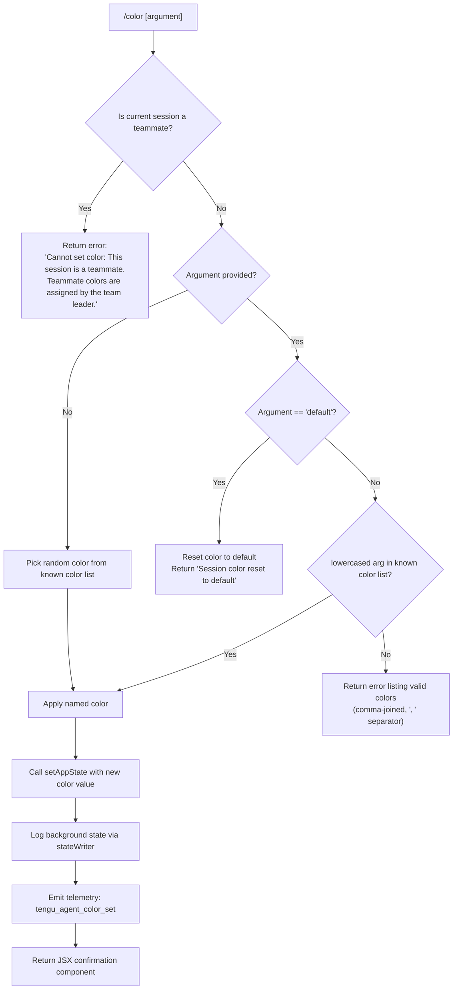

# `/color`

> Analysis basis: CC v2.1.161 bundle.js (AST extraction + Claude interpretation)
> Minimum version: v2.1.161

---

## Overview

The `/color` command sets the prompt bar color for the current Claude Code session. It accepts an optional color name argument (or the special value `default` to reset), validates the input against a set of known color names, and applies the selection by updating application state. The command also emits a telemetry event upon successful color change and persists the selection via a background state writer.

---

## Registration

| Field | Value |
|---|---|
| type | `local-jsx` |
| name | `color` |
| description | Set the prompt bar color for this session |
| loc_byte | 10902852 |
| loc_byte_end | 10903069 |
| loc_line | 7153 |
| argumentHint | `null` |
| immediate | `true` |
| module_id | `AR1` |
| load_inline | `true` |
| arbor_handler.name | `Zff` |
| arbor_handler.fqn | `claude-2.1.161::Zff` |
| arbor_handler.kind | `AsyncFunction` |
| arbor_handler.resolution_path | `module_id` |
| arbor_handler.n_hits | 0 |

Analysis basis: CC v2.1.161 bundle.js:+10902852

---

## Input Branching

The command has four distinct input paths: teammate session guard, `default` keyword, valid named color, and invalid/unrecognized input.



Analysis basis: CC v2.1.161 bundle.js:+10901691, +10901702, +10901831, +10901842, +10901868, +10901886, +10901910, +10901932, +10902030, +10902061, +10902072

---

## Behavioral Spec

### Handler Entry Point (`Zff`)

The Arbor-resolved handler `Zff` (AsyncFunction, resolved via `module_id`) is the top-level entry. It receives the session context object and the raw user argument string, then delegates to the core implementation function.

```
async function colorCommandHandler(sessionContext, rawArgument):
    sessionInfo = getSessionInfo(sessionContext)       // fM → u0 → cL_.getStore
    if sessionInfo.isTeammate:
        return errorMessage("Cannot set color: This session is a teammate. ...")
    invoke colorCommandCore(sessionContext, rawArgument)
```

Analysis basis: CC v2.1.161 bundle.js:+10901622, +10901630, +10901702

---

### Core Color Logic (`qI8`)

The core handler function performs argument normalization, validation, random selection, and state application.

```
async function colorCommandCore(ctx, rawArgument):
    // Step 1: Teammate guard (delegated from handler)
    if session is teammate:
        return errorResult("Cannot set color: This session is a teammate. ...")

    // Step 2: Normalize argument
    normalizedArg = rawArgument?.toLowerCase()

    // Step 3: Load known color list
    knownColors = getKnownColorNames()        // _I8 → Object.keys

    // Step 4: Argument routing
    if normalizedArg is absent or empty:
        // Pick a random color from the list
        randomIndex = Math.floor(Math.random() * knownColors.length)
        selectedColor = knownColors[randomIndex]

    else if normalizedArg == "default":
        // Reset to default
        setAppState({ promptBarColor: "default" })
        logBackgroundState(ctx)               // qL8
        return textResult("Session color reset to default")

    else if knownColors.includes(normalizedArg):
        selectedColor = normalizedArg

    else:
        // Unknown color — list valid options
        validList = knownColors.join(", ")
        return errorResult("Unknown color. Valid colors: " + validList)

    // Step 5: Apply color
    setAppState({ promptBarColor: selectedColor })    // _.setAppState

    // Step 6: Persist state in background
    logBackgroundState(ctx)                           // qL8

    // Step 7: Emit telemetry
    emitTelemetry("tengu_agent_color_set")            // via Wk6 → d

    // Step 8: Return JSX confirmation component
    return renderColorConfirmation(selectedColor)     // Vff
```

Analysis basis: CC v2.1.161 bundle.js:+10901831, +10901842, +10901868, +10901886, +10901910, +10901932, +10902014, +10902021, +10902061, +10902072, +10902091, +10902115, +10902220, +10902224, +10902282, +10902291

---

### Color Name Enumeration (`_I8`)

The set of recognized color names is derived at runtime by calling `Object.keys` on the color definition map.

```
function getKnownColorNames():
    return Object.keys(colorDefinitionMap)
```

Analysis basis: CC v2.1.161 bundle.js:+10901395

---

### JSX Result Renderer (`Vff`)

When a color is successfully applied, a JSX component is constructed and returned. This component assembles helper sub-components for display.

```
async function renderColorConfirmation(selectedColor):
    labelComponent   = buildColorLabel(selectedColor)     // nG
    swatchComponent  = buildColorSwatch(selectedColor)    // cs
    resolvedOutput   = await Promise.resolve(swatchComponent)
    detailComponent  = buildDetailView(selectedColor)     // I2H
    wrapperElement   = buildWrapper(...)                  // q
    footerElement    = buildFooter(...)                   // MqH
    return assembledJSX
```

Analysis basis: CC v2.1.161 bundle.js:+10902282, +10902375, +10902416, +10902421, +10902451, +10902503, +10902521

---

### Background State Logger (`qL8`)

After any successful color change or reset, the updated session state is persisted through the background state subsystem. This involves cache invalidation, state ordering, and atomic file writes.

```
function logBackgroundState(ctx):
    stateKey   = buildStateKey(ctx)        // aK → vG
    stateEntry = buildStateEntry(ctx)      // q1
    writePersisted(stateEntry)             // W5 → t3 (atomic write: randomBytes + writeFile + rename)
    invalidateCache(stateKey)              // Fj → NLH.delete
    notifyWatcher(stateEntry)             // k8 / yH
```

Atomic writes use `crypto.randomBytes(4).toString('hex')` for a temp-file suffix before renaming into place.

Analysis basis: CC v2.1.161 bundle.js:+4139807, +4139821, +4139866, +4139924, +4140002, +4140008, +2276452, +2276480, +2276499, +2276553

---

### Telemetry Dispatch via Logger (`Wk6`)

Color-set events are dispatched through the standard agent logging pipeline, which serializes the event, appends it to the agent log file, and ensures the parent directory exists.

```
function dispatchColorTelemetry(eventData):
    logEntry = formatLogEntry(eventData)      // cv → wM / N6 / P_
    logger   = getOrCreateLogger()           // CMH → F6 / SH
    logger.appendFileSync(logPath, logEntry)
    logger.mkdirSync(logDir, { recursive: true })
    registerCallback(eventData)              // a4 → Y9 → tYA.register
    emit("agent-color", eventData)           // event literal: "agent-color" at +13064983
    emitTelemetry("tengu_agent_color_set")   // at +13065067
```

Analysis basis: CC v2.1.161 bundle.js:+13064962, +13064971, +13064983, +13065028, +13065033, +13065065, +13065067

---

### Teammate Guard (`fM` / `u0`)

The teammate guard retrieves session context from an async-local store to determine whether the current session is operating as a sub-agent teammate.

```
function getSessionInfo(ctx):
    store = getAsyncLocalStore()    // u0 → cL_.getStore
    index = store?.get(0)           // literal 0 at +2244028
    return store entry at index
```

Analysis basis: CC v2.1.161 bundle.js:+10901691, +2244016, +2242875, +2244028

---

## State & Side Effects

| Item | Detail |
|---|---|
| Telemetry | `tengu_agent_color_set` (bundle.js:+13065067); `tengu_bg_state_read_transient` (bundle.js:+4137751, emitted from background state reader reached via `qL8 → q1`) |
| appState changes | `_.setAppState` called with updated `promptBarColor` field (bundle.js:+10902072); value is the lowercased color name or `"default"` |
| Background state persistence | Atomic file write via `crypto.randomBytes` + `writeFile` + `rename` sequence in `t3` (bundle.js:+2276452–+2276682) |
| Cache invalidation | `NLH.delete` and `rYH.delete` called on background state caches (bundle.js:+4137555, +4137569) |
| Agent event log | Entry appended via `appendFileSync` under the `"agent-color"` event key (bundle.js:+13060819, +13064983) |
| Random selection | `Math.floor(Math.random() * N)` used when no argument is provided (bundle.js:+10901831, +10901842) |
| Hook registration | `tYA.register` invoked via `Y9` after telemetry dispatch (bundle.js:+59405) |
| Sound | None identified in depth-2 traversal |
| Error: teammate session | Hard-coded string returned immediately; no state changes occur (bundle.js:+10901702) |
| Reset confirmation string | `"Session color reset to default"` (bundle.js:+10902291) |
| Color list join separator | `", "` (bundle.js:+10901940) |

---

## Version History

| Version | Change |
|---|---|
| v2.1.161 | Initial analysis |

---

## Common Mistakes

1. **Providing a color name with mixed case**: The command normalizes input with `.toLowerCase()` before matching, so `"Red"` and `"RED"` resolve correctly — but the caller should be aware that the stored value will be lowercase.
2. **Using `/color` in a teammate session**: The command blocks execution immediately with an error message explaining that teammate colors are controlled by the team leader. There is no workaround within the CLI.
3. **Expecting a synchronous result**: The handler is an `AsyncFunction` (`arbor_handler.kind: "AsyncFunction"`). Any caller integration must await the returned promise.
4. **Assuming `default` is a color in the known-color list**: `"default"` is handled as a special-case keyword branch before the color-list lookup. It is not an entry in `Object.keys(colorDefinitionMap)`.
5. **Omitting the argument to get the current color**: Omitting the argument does **not** display the current color — it randomly selects and applies a new one. There is no read-only query mode.

---

## Appendix — Identifier Mapping

> For bundle debugging only. Identifiers change across versions.

| Identifier | Role |
|---|---|
| `Zff` | Top-level async handler for `/color` command (Arbor-resolved entry point) |
| `qI8` | Core color command logic: argument validation, random selection, state update |
| `fM` | Session info retrieval wrapper (calls async-local store accessor) |
| `u0` | Async-local store reader (`cL_.getStore`) |
| `_I8` | Known color name enumerator (`Object.keys` on color map) |
| `qL8` | Background state logger orchestrator |
| `aK` | State key builder |
| `vG` | State key path helper (`w2.join`) |
| `q1` | State entry builder and background state reader (file I/O, cache management) |
| `k8` | Background state cache accessor |
| `v8` | Low-level value helper used by cache/state functions |
| `Fj` | Cache invalidation function (`NLH.delete`) |
| `W5` | Atomic background state writer (delegates to `t3`) |
| `t3` | Atomic file write implementation (`randomBytes` + `writeFile` + `rename`) |
| `yH` | Background state watcher / error handler |
| `a_` | Error construction utility |
| `pH` | String coercion utility |
| `r9` | Watcher queue helper |
| `qkA` | Watcher callback invoker |
| `s44` | Watcher queue shift/push manager |
| `gj` | State basename/key builder |
| `AoH` | Auxiliary handler used after state set |
| `Vff` | JSX confirmation component renderer for color result |
| `nG` | Color label sub-component builder |
| `cs` | Color swatch sub-component builder |
| `MqH` | Footer/wrapper sub-component builder |
| `Wk6` | Agent telemetry/event log dispatcher |
| `cv` | Log entry formatter |
| `CMH` | Log file writer (appendFileSync + mkdirSync) |
| `F6` | Log file path resolver |
| `SH` | JSON serializer used in log formatting |
| `a4` | Post-log callback registrar |
| `Y9` | Telemetry hook registrar (`tYA.register`) |
| `d` | Generic finalizer / event emitter |
| `N6` | Utility: log/formatting helper |
| `XN` | Low-level utility reached by formatting chain |
| `wM` | Message/entry assembly helper |
| `tS` | Sub-formatter within message assembly |
| `P_` | Sub-formatter within message assembly |
| `Gk` | Auxiliary formatting helper |
| `wO` | Auxiliary formatting helper |
| `N` | File content loader / bootstrap fetch helper |
| `VBK` | Bootstrap response handler |
| `H` | HTTP fetch wrapper (bootstrap) |
| `Z4` | URL path manipulator |
| `imH` | Bootstrap JSON parser helper |
| `IBK` | File read and byte-length checker |
| `df` | Low-level file descriptor helper |
| `m6` | JSON parse wrapper |
| `A` | String/stream utility (toLowerCase, close) |
| `f` | Stream/fd manager (close, finally) |
| `q` | Temp file / Set utility |
| `L` | Promise finalizer for stream cleanup |
| `_` | App state accessor object (`setAppState`, `getAppState`) |