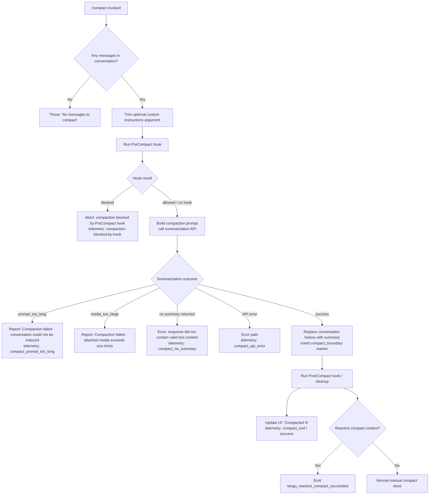

# `/compact`

> Analysis basis: CC v2.1.165 bundle.js (AST extraction + Claude interpretation)
> Minimum version: v2.1.165

---

## Overview

`/compact` frees up context window space by summarizing the current conversation history into a condensed form and replacing the previous message history with that summary. It optionally accepts custom summarization instructions as an argument, and supports both manual invocation and non-interactive (scripted) use.

---

## Registration

| Field | Value |
|---|---|
| type | `local` |
| name | `compact` |
| description | `Free up context by summarizing the conversation so far` |
| argumentHint | `<optional custom summarization instructions>` |
| supportsNonInteractive | `true` |
| thinClientDispatch | `post-text` |
| module_id | `Wmq` |
| load_inline | `true` |
| loc_byte | `11025738` |
| loc_byte_end | `11026038` |
| loc_line | `7420` |
| arbor_handler.name | `hYf` |
| arbor_handler.fqn | `claude-2.1.165::hYf` |
| arbor_handler.kind | `AsyncFunction` |
| arbor_handler.resolution_path | `module_id` |
| arbor_handler.n_hits | `0` |

Analysis basis: CC v2.1.165 bundle.js:+11025738

---

## Input Branching

The command has more than 3 distinct paths depending on message count, hook results, and compaction outcome.



Analysis basis: CC v2.1.165 bundle.js:+11024769, +11024800, +11020715, +10193538, +10195601, +10195985, +10196281, +10753646, +11022687

---

## Behavioral Spec

### Main Handler — `compactCommandHandler` (`hYf`)

Analysis basis: CC v2.1.165 bundle.js:+11024769

```
async function compactCommandHandler(commandInput, context):
    # Guard: conversation must have messages
    messageList = getConversationMessages(context)
    if messageList is empty:
        throw Error("No messages to compact")

    # Optional custom summarization instructions
    customInstructions = commandInput.trim()  # may be empty string

    # Load current session state
    sessionState = getAppState(context)

    # Phase 1: Pre-compact hook
    hookResult = runPreCompactHook(sessionState)
    if hookResult indicates "blocked":
        emit telemetry("compaction-blocked-by-hook")
        return abort("compaction blocked by PreCompact hook")

    # Phase 2: Build summarization prompt and call API
    emit progress("compact_progress", phase="hooks_start")
    emit progress("pre_compact")
    emit sdkStatus("compacting")
    emit progress("compact_start")

    startTime = performance.now()
    [systemPrompt, existingMessages] = buildCompactionInputs(sessionState, customInstructions)
    summaryText = callSummarizationAPI(systemPrompt, existingMessages)

    # Phase 3: Handle summarization failures
    if summaryText is null or empty:
        if reason is "prompt_too_long":
            report("Compaction failed · conversation could not be reduced below the context limit")
            emit telemetry("compact_prompt_too_long")
            return
        if reason is "media_too_large":
            report("Compaction failed · attached media exceeds size limits")
            return
        if reason is "no_summary":
            emit telemetry("compact_no_summary")
            throw Error("Failed to generate conversation summary - response did not contain valid text content")
            return
        emit telemetry("compact_api_error")
        return

    # Phase 4: Replace conversation history
    insertCompactBoundaryMarker(messageList, type="system", kind="compact_boundary")
    replaceMessagesWithSummary(sessionState, summaryText)

    # Phase 5: Post-compact cleanup and hooks
    runPostCompactCleanup(sessionState)         # clears caches, resets counters
    runPostCompactHook(sessionState)            # "PostCompact" hook event

    # Phase 6: Update UI and emit telemetry
    elapsedMs = performance.now() - startTime
    displayCompactionSummary("Compacted N", sessionState)
    emit telemetry("compact_end", result="success")
```

Analysis basis: CC v2.1.165 bundle.js:+11024769, +11024800, +11024832, +11024849, +11024867, +11024890, +11024904, +11025034, +11025059, +11025131

---

### Summarization Engine — `buildAndRunSummarization` (`SYf`)

Analysis basis: CC v2.1.165 bundle.js:+11020852

```
async function buildAndRunSummarization(sessionState, customInstructions):
    startTime = performance.now()

    # Gather context for compaction
    [systemPrompt, tools, mcpInfo] = await Promise.all([
        buildSystemPromptForCompaction(sessionState),   # Pmq
        gatherToolDefinitions(sessionState),            # Il
        getMCPServerInfo(sessionState)                  # M
    ])

    # Stream the summarization request
    streamResult = await streamSummarizationRequest(    # RYf
        systemPrompt   = systemPrompt,
        messages       = prepareMessagesForCompaction(sessionState),
        tools          = [],          # tool use denied during compaction
        customInstructions = customInstructions
    )

    # Determine miss reasons for telemetry
    if customInstructions absent:
        mark("miss_custom_instructions")
    if no PreCompact hook configured:
        mark("miss_hook")

    if streamResult.status is not "ready":
        mark("miss_not_ready")
        return null

    if streamResult.aborted:
        record("aborted")
        return null

    if summaryUUIDBoundaryMissing:
        record("boundary_uuid_missing")

    # Apply the produced summary
    applySummaryToSession(                              # OY8 / gC_
        sessionState  = sessionState,
        summaryText   = streamResult.text,
        startTime     = startTime
    )

    emit telemetry("compact_end")
    return summaryText
```

Analysis basis: CC v2.1.165 bundle.js:+11020852, +11020903, +11020991, +11021002, +11021075, +11021275, +11021306, +11022996, +11023049, +11023179, +11023257, +11023511, +11023638

---

### System Prompt Builder for Compaction — `buildCompactionSystemPrompt` (`Pmq`)

Analysis basis: CC v2.1.165 bundle.js:+11024256

```
async function buildCompactionSystemPrompt(sessionState):
    appState = sessionState.getAppState()

    # Gather all context sources in parallel
    [lastSummary, agentContext, systemPromptParts] = await Promise.all([
        findLastCompactionSummary(appState),    # R_
        buildAgentMemory(appState),             # Qm
        buildFullSystemPrompt(appState)         # DT
    ])

    # Merge results into compaction prompt
    mergedPrompt = combine(lastSummary, agentContext, systemPromptParts)
    return mergedPrompt
```

Analysis basis: CC v2.1.165 bundle.js:+11024256, +11024280, +11024323, +11024334, +11024380, +11024566

---

### Conversation History Normalizer — `normalizeMessagesForCompaction` (`vO`)

Analysis basis: CC v2.1.165 bundle.js:+10754220

The normalizer prepares the raw conversation for the summarization API by:

1. Filtering to include only messages up to the compaction boundary (`$k8`, `fJ`).
2. Slicing the message array to remove messages that should not be included (`H.slice`).
3. Inserting a `compact_boundary` sentinel (kind: `"system"`, value: `"compact_boundary"`) immediately before the oldest retained message.

Constants observed:
- Sentinel marker type: `"system"` (bundle.js:+10754068)
- Sentinel marker value: `"compact_boundary"` (bundle.js:+10754090)
- Slice indices: `1` and `0` (bundle.js:+10754144, +10754149)

Analysis basis: CC v2.1.165 bundle.js:+10754220, +10754243, +10754068, +10754090

---

### Reactive Compact Path — `reactiveCompactHandler` (`gC_`)

Analysis basis: CC v2.1.165 bundle.js:+6772776

This path is triggered automatically when the context nears capacity (not via direct user invocation of `/compact`).

```
async function reactiveCompact(sessionState):
    startTime = performance.now()

    # Check conversation shape
    messageGroups = groupConversationByRound(sessionState)
    if messageGroups < 2:
        log("Reactive compact: fewer than 2 groups, nothing to compact")
        emit("too_few_groups")
        return

    # Strip and prepare messages (ez8)
    candidateMessages = selectMessagesToSummarize(messageGroups)
    if candidateMessages contains no assistant messages:
        log("Reactive compact: no assistant messages in summarize set, bailing")
        emit("exhausted")
        return

    # Attempt summarization with retry on media-size error
    attempt = 1
    loop:
        result = callSummarizationAPI(candidateMessages)
        if result.error is "media_too_large" and attempt == 1:
            log("Reactive compact: summarize hit media-size error, retrying stripped")
            candidateMessages = stripMediaBlocks(candidateMessages)
            attempt = 2
            continue
        if result.error is "media_too_large" and attempt == 2:
            emit("media_unstrippable")
            return
        break

    if result.summaryText is empty:
        log("Reactive compact: empty summary text in summarization response")
        emit("summarization produced empty response")
        return

    applyReactiveSummary(sessionState, result.summaryText)
    emit telemetry("tengu_reactive_compact_succeeded")
```

Constants: minimum groups threshold = `2`; retry stripped = single retry on `"media_too_large"`.
Analysis basis: CC v2.1.165 bundle.js:+6772776, +6753538, +6754016, +6754057, +6754100, +6754988, +6755103, +6775585, +6773124

---

### Summarization API Streaming Loop — `streamSummarizationRequest` (`RYf`)

Analysis basis: CC v2.1.165 bundle.js:+11023068

```
async function streamSummarizationRequest(params):
    startTime = performance.now()

    # Wait until session is in "ready" state (uC_)
    await waitForSessionReady(params.sessionState)

    # Make API call (saH → AY8 → vl → D6)
    apiResult = await callCompactionAPI(
        messages        = params.messages,
        systemPrompt    = params.systemPrompt,
        maxTokens       = determineMaxOutputTokens(params.model),
        customInstructions = params.customInstructions
    )

    if apiResult.aborted:
        return { status: "aborted" }

    # Extract boundary UUID from response to locate insertion point
    summaryText = extractTextFromResponse(apiResult)   # mC_
    if boundaryUUID missing from summaryText:
        emit("boundary_uuid_missing")

    # Record token consumption (KY8)
    recordTokenUsage(apiResult.usage, elapsedMs = performance.now() - startTime)

    return { status: "ready", text: summaryText }
```

Analysis basis: CC v2.1.165 bundle.js:+11023068, +11023094, +11023149, +11023272, +11023431, +11023499, +11024012

---

### Post-Compact Session Cleanup — `postCompactCleanup` (`zs`)

Analysis basis: CC v2.1.165 bundle.js:+6769174

```
function postCompactCleanup(sessionState):
    # Cancel any pending streaming turns (LY8)
    cancelPendingTurns(sessionState)

    # Clear caches (MY8, Qx9)
    clearSummarizationCache()
    clearStreamCache()

    # Reset autonomous loop counter
    resetAutonomousLoopDelivered()          # dz7.resetAutonomousLoopDelivered

    # Clear tool/MCP state (TD)
    clearToolOutputValues(sessionState)

    # Reset app state flags (xyH)
    appState.setState(resetFlags)

    # Update status indicator (UC_)
    updateStatusToIdle(sessionState)
```

Analysis basis: CC v2.1.165 bundle.js:+6769174, +6769190, +6769237, +6769252, +6769258, +6769264, +6769270, +6769276, +6769296, +6769346, +6769351, +6769452

---

### Output Token Limit Resolver — `resolveMaxOutputTokens` (`JDH`)

Analysis basis: CC v2.1.165 bundle.js:+2981789

Token budget limits observed:
- Default compaction budget: `64000` tokens (bundle.js:+2981822)
- Extended budget (large context models): `128000` tokens (bundle.js:+2981830)
- Reduced budget (older models): `32000` tokens (bundle.js:+2981918)
- claude-3-opus cap: `4096` (bundle.js:+2982199)
- claude-3-sonnet cap: `8192` (bundle.js:+2982243)
- Environment override: `CLAUDE_CODE_MAX_OUTPUT_TOKENS` (bundle.js:+13460569)

```
function resolveMaxOutputTokens(modelName, envOverride):
    if envOverride present and valid integer:
        return min(envOverride, modelMaxOutputTokens)

    if modelName matches "claude-3-opus":
        return 4096
    if modelName matches "claude-3-sonnet":
        return 8192
    # default for modern models
    return 64000   # or 128000 for extended-context variant
```

Analysis basis: CC v2.1.165 bundle.js:+2981789, +2981822, +2981830, +2981918, +2982199, +2982243, +13460569

---

### Compaction Summary Injector — `injectCompactionSummary` (`xz7`)

Analysis basis: CC v2.1.165 bundle.js:+6751518

```
function injectCompactionSummary(sessionState, summaryText, boundaryIndex):
    # Validate summary is non-empty
    if summaryText is empty:
        emit("summarization produced empty response")
        return

    # Locate insertion point at boundary
    insertionPoint = findBoundaryIndex(sessionState.messages)  # mC_
    if insertionPoint not found:
        emit("boundary_uuid_missing")
        # Fall back to index 0

    # Replace all messages before boundary with summary message
    summaryMessage = buildSummaryMessage(
        role    = "user",
        content = "<summary>" + summaryText + "</summary>",
        marker  = "compaction"
    )
    newMessageList = [summaryMessage] + sessionState.messages[insertionPoint:]

    # Write back
    sessionState.setMessages(newMessageList)

    emit("Conversation compacted")
```

Literal `"<summary>"` tag (bundle.js:+6736463); `"Conversation compacted"` (bundle.js:+10753646).
Analysis basis: CC v2.1.165 bundle.js:+6751518, +6736463, +10753646, +6752296, +6752739

---

## State & Side Effects

| Item | Detail |
|---|---|
| Telemetry — compact lifecycle | `tengu_compact` (bundle.js:+10197582), `tengu_compact_failed` (bundle.js:+10208868), `tengu_compact_cache_prefix` (bundle.js:+10195165), `tengu_compact_cache_sharing_success` (bundle.js:+10206042), `tengu_compact_cache_sharing_fallback` (bundle.js:+10206672), `tengu_compact_ptl_retry` (bundle.js:+10195641) |
| Telemetry — reactive compact | `tengu_reactive_compact_attempt` (bundle.js:+6754261), `tengu_reactive_compact_succeeded` (bundle.js:+6775585), `tengu_reactive_compact_failed` (bundle.js:+6773124), `tengu_precomputed_compact_consumed` (bundle.js:+6767950), `tengu_precomputed_compact_discarded` (bundle.js:+6768573) |
| Telemetry — post-compact | `tengu_post_compact_file_restore_success` (bundle.js:+10209354), `tengu_post_compact_file_restore_error` (bundle.js:+10209396) |
| Telemetry — streaming | `tengu_amber_redwood3` (bundle.js:+10213298) used inside summarization streaming path |
| Hook — PreCompact | `"PreCompact"` hook event fired before summarization; can block compaction (bundle.js:+13279266) |
| Hook — PostCompact | `"PostCompact"` hook event fired after summary is applied (bundle.js:+13312947) |
| appState changes | `a06.setState(resetFlags)` resets streaming and turn state; autonomous loop counter reset via `dz7.resetAutonomousLoopDelivered` |
| Cache clears | Summarization cache (`ySq.clear`), stream cache (`s06.clear`, `SC_.clear`) |
| Pending turns | Any in-progress streaming turns are cancelled via `tu.delete` / `LY8` |
| UI update | "Compacted N" message shown with dim formatting; keyboard shortcut `ctrl+o` registered for transcript toggle (bundle.js:+11024093) |
| Message history | All messages before the compact boundary are replaced with a single summary message wrapped in `<summary>…</summary>` |
| Tool use during compact | Tool use is denied during compaction (literal: `"Tool use is not allowed during compaction"`, bundle.js:+10205165) |
| Sound | <!-- TODO: not found in depth-2 traversal; needs --depth 4 --> |

---

## Version History

| Version | Change |
|---|---|
| v2.1.165 | Initial analysis |

---

## Common Mistakes

1. **Invoking `/compact` on an empty session.** The handler throws `"No messages to compact"` immediately if the message list is empty (bundle.js:+11024800). Ensure at least one conversation turn has occurred before running the command.

2. **Passing custom instructions that are only whitespace.** The handler trims the argument (bundle.js:+11024832); an all-whitespace string becomes an empty string and is treated the same as no custom instructions.

3. **Expecting tool calls to work during compaction.** Tool use is blocked during the summarization API call (bundle.js:+10205165). Any hook or integration that expects tool execution will be denied.

4. **Assuming the full conversation remains accessible after compaction.** `/compact` is destructive to history within the current session context: all messages before the boundary are replaced. The summary is injected as a single `"compaction"` type message.

5. **Running `/compact` when a PreCompact hook blocks it.** If a configured `PreCompact` hook returns a blocking result, compaction is silently aborted with telemetry `"compaction-blocked-by-hook"`. No error is surfaced to the user unless the hook explicitly provides a reason.

6. **Expecting identical behaviour in reactive (automatic) vs. manual compact.** The reactive path (`gC_`) applies additional guards (minimum 2 message groups, presence of assistant messages) that are absent in the manual path, and it can retry after stripping oversized media.

---

## Appendix — Identifier Mapping

> For bundle debugging only. Identifiers change across versions.

| Identifier | Role |
|---|---|
| `hYf` | Main compact command handler (AsyncFunction) |
| `vO` | Conversation history normalizer / message slicer |
| `$k8` | Compact boundary filter helper |
| `fJ` | Boundary marker accessor |
| `SYf` | Summarization orchestrator (builds prompts, drives API call, applies result) |
| `Pmq` | Compaction system prompt builder |
| `RYf` | Summarization API streaming loop |
| `OY8` | Summary application and post-compact state updater |
| `gC_` | Reactive compact handler |
| `ez8` | Reactive compact message selector and strip/retry logic |
| `xz7` | Compaction summary injector into session messages |
| `mC_` | Boundary UUID locator in message list |
| `KY8` | Token usage recorder for compaction |
| `saH` | Pre-compact API call wrapper |
| `uC_` | Wait-for-session-ready helper |
| `zs` | Post-compact session cleanup |
| `xyH` | App state reset after compact |
| `Xmq` | UI update after compact ("Compacted N" display) |
| `DT` | Full system prompt builder (used inside Pmq) |
| `Qm` | Agent memory / context assembler |
| `R_` | Last compaction summary finder |
| `Il` | Tool definitions gatherer for compaction |
| `vl` | Session/agent state loader |
| `D6` | Agent dispatcher / turn executor |
| `y6` | File-based config reader |
| `bDH` | Config file read/write helper (with backup) |
| `WTL` | File watcher setup helper |
| `B98` | Experiment / feature-flag registration |
| `YX_` | Growthbook experiment event emitter |
| `XX_` | Feature-flag evaluation helper |
| `JDH` | Max output token resolver |
| `I_H` | Token limit environment-variable parser |
| `acK` | API request byte-length checker |
| `icK` | Message content type classifier |
| `J4` | Message role redactor (replaces sensitive content with `"[REDACTED]"`) |
| `ppH` | Content normaliser helper |
| `SH` | JSON.stringify wrapper |
| `EH` | String coercion / error formatter |
| `su` | Sensitive-data scrubber (URLs, emails, IPs, paths) |
| `HT` | Message-list assembler and token counter for API |
| `Qs_` | Attachment / content-block normalizer for API |
| `qvq` | Core agentic turn runner (drives main query loop) |
| `C3K` | Full agent query orchestrator |
| `kC_` | Message content flattener |
| `Oqf` | Filter for non-text message blocks |
| `zqf` | Message content mapper/transformer |
| `Xk6` | Tool search mode decision engine |
| `gqf` | Tool search query builder |
| `hCH` | Tool availability checker |
| `Ls` | Language/locale normalizer |
| `hR_` | Tool search result handler |
| `L_6` | Tool schema loader |
| `C3K` | Agent query full loop (also covers tool dispatch) |
| `Us_` | Deferred tool loader |
| `jG` | Turn lifecycle manager (timing, metrics) |
| `XV8` | App state setter during turn |
| `gm` | Turn completion handler |
| `wfH` | Tool result filter and accumulator |
| `Hvq` | Message slice and ratio calculator for compact |
| `ZiH` | Token count extractor from response |
| `M7H` | Array/object content type check |
| `SX6` | Context-window-exceeded token parser |
| `BZ` | Last-message finder (findLast) |
| `az8` | Summary tag `<summary>` injector helper |
| `sz8` | Summary tag wrapper |
| `Sx9` | Gap calculation for reactive compact (Math.max/floor) |
| `uz7` | Gap calculation helper |
| `r06` | Reactive compact entry point caller |
| `lz7` | Parallel context data fetcher (Promise.all) |
| `YY8` | File restore data fetcher post-compact |
| `JY8` | App-state-aware context fetcher |
| `DY8` | Delta context loader |
| `jY8` | Summary-aware context assembler |
| `wY8` | Tool-state serializer |
| `YfH` | Hook context builder |
| `pyH` | Tool permission context builder |
| `UyH` | Hook additional-context assembler |
| `fF` | Plugin/skill hook loader |
| `PXH` | Full prompt assembler (gL + V0) |
| `V0` | Hook runner (main hook execution engine) |
| `gL` | Hook configuration loader |
| `ux8` | Shell command hook executor |
| `G5A` | HTTP hook executor |
| `E5A` | MCP tool hook executor |
| `F1H` | Hook output parser |
| `xx8` | Hook JSON output interpreter |
| `R$K` | Hook block/approve decision parser |
| `iMH` | Hook result aggregator |
| `QSH` | Hook metrics reporter |
| `dB` | Telemetry emitter (csL.emit wrapper) |
| `Vj6` | Memory / CLAUDE.md loader |
| `Xo1` | Team memory loader |
| `PDH` | AWS/Bedrock credential loader |
| `naH` | Notification helper |
| `tz8` | Text trimmer for API messages |
| `ci` | Cancellation/interrupt checker |
| `kH` | Error logger |
| `hH` | Success result builder |
| `RH` | Failure result builder |
| `EO` | User-facing error reporter |
| `h1` | Notification display helper |
| `lE` | Context efficiency reporter |
| `Q$` | App state snapshot reader |
| `QyH` | Status bar updater |
| `WG6` | Progress indicator updater |
| `tjH` | OTEL metrics emitter |
| `N4` | OTEL span builder |
| `vkH` | OTEL resource attribute builder |
| `GG6` | Tracing span creator for compaction |
| `TfH` | Tracing span field setter |
| `rh` | Active tracer accessor |
| `Y86` | Full compact execution pipeline (manual path) |
| `Avq` | Error-compacting-conversation reporter |
| `PN` | Rate-limit notification handler |
| `hs_` | Post-compact hook result handler |
| `HhH` | Model context tip builder (Opus 1M / Sonnet 1M) |
| `Sw7` | Context model switcher |
| `$P` | Keybinding action dispatcher |
| `TD` | Tool output value clearer |
| `UC_` | Status reset after compact |
| `MY8` | Summarization cache clearer |
| `Qx9` | Stream cache clearer |
| `Ux9` | App state resetter |
| `wXH` | Pending-message resetter |
| `LY8` | Pending turn canceller |
| `Z26` | Sub-agent exit handler |
| `e_H` | Abort-state handler |
| `iQ8` | Queue-flush helper |
| `TD` | Object-values tool output clearer |

Note: index built via Arbor fallback; some signals (telemetry, literals) may be missing — see arbor-fallback.js.