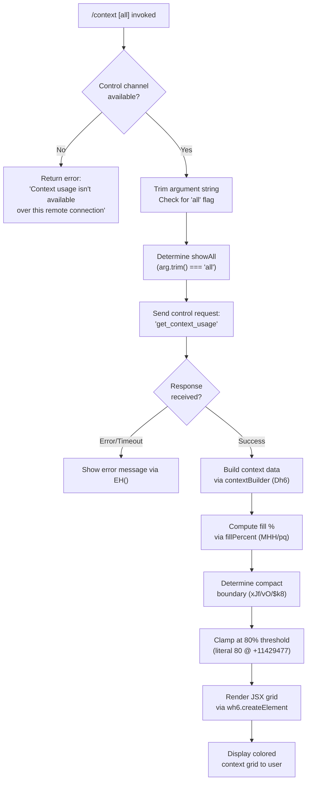

# `/context`

> Analysis basis: CC v2.1.165 bundle.js (AST extraction + Claude interpretation)
> Minimum version: v2.1.165

---

## Overview

`/context` visualizes the current conversation's context window usage as a colored grid, showing how tokens are allocated across system prompts, tools, memory files, messages, and other named regions. It can optionally accept the argument `all` to show an expanded breakdown. When invoked over a remote connection that lacks a control channel, it surfaces an informational error instead.

---

## Registration

| Field | Value |
|---|---|
| type | `local-jsx` |
| name | `context` |
| description | `Visualize current context usage as a colored grid` |
| argumentHint | `[all]` |
| thinClientDispatch | `control-request` |
| module_id | `zBq` |
| load_inline | `true` |
| loc_byte | `11430341` |
| loc_byte_end | `11430567` |
| loc_line | `7473` |
| arbor_handler.name | `uJf` |
| arbor_handler.fqn | `claude-2.1.165::uJf` |
| arbor_handler.kind | `AsyncFunction` |
| arbor_handler.resolution_path | `module_id` |
| arbor_handler.n_hits | `0` |

Analysis basis: CC v2.1.165 bundle.js:+11430341

---

## Input Branching

The handler has 4 distinct branches: remote-connection guard, optional `all`-mode flag, control-request dispatch, and JSX rendering path. A Mermaid flowchart is used.



Analysis basis: CC v2.1.165 bundle.js:+11428935 (handler entry `uJf`), +11428966 (`all` literal), +11429019 (remote error string), +11429131 (`get_context_usage` control request key)

---

## Behavioral Spec

### Top-Level Handler (`uJf`)

```
async function contextCommandHandler(argument, appState):
    trimmedArg = argument.trim()                         // A.trim @ +11428941

    // Guard: remote connection without control channel
    controlChannel = getControlChannel(appState)         // rv @ +11428989
    if controlChannel is null or unavailable:
        return errorMessage(
            "Context usage isn't available over this remote connection"
        )                                                // literal @ +11429019

    // Parse optional 'all' flag
    showAll = (trimmedArg === "all")                     // literal @ +11428966

    // Send control request to main process
    response = await controlChannel.sendControlRequest(  // K.sendControlRequest @ +11429101
        "get_context_usage"                              // literal @ +11429131
    )

    // Listen for response event
    responseData = await waitForResponse(               // yeH @ +11429161
        event="data",                                   // literal @ +7941000
        channel=controlChannel
    )

    // Build structured context breakdown
    contextSections = buildContextBreakdown(            // Dh6 @ +11429271
        responseData,
        showAll
    )

    // Compute compact boundary marker
    compactBoundaryInfo = resolveCompactBoundary(       // xJf @ +11429444
        responseData
    )

    // Determine fill percentage threshold
    fillThreshold = 80                                   // literal @ +11429477

    // Render JSX grid
    return renderContextGrid(                           // wh6.createElement @ +11429165
        contextSections,
        compactBoundaryInfo,
        fillThreshold,
        showAll
    )
```

Analysis basis: CC v2.1.165 bundle.js:+11428935

---

### Context Breakdown Builder (`Dh6`)

Constructs the ordered list of named context regions from the raw usage data.

```
function buildContextBreakdown(usageData, showAll):
    sections = []

    // Each section: filter by segment type, find matching entry
    allEntries = usageData.filter(...)                  // A.filter @ +11427038
    targetEntry = allEntries.find(...)                  // A.find @ +11427356

    // Named regions observed in literals (ordered display labels):
    //   "Free space"            @ +11427073
    //   "Autocompact buffer"    @ +11427096
    //   "System prompt"         @ +10228059
    //   "System tools"          @ +10228138
    //   "MCP tools"             @ +10228202
    //   "MCP tools (deferred)"  @ +10228278
    //   "System tools (deferred)" @ +10228364
    //   "Custom agents"         @ +10228453
    //   "Memory files"          @ +10228520
    //   "Skills"                @ +10228582
    //   "Messages"              @ +10229105
    //   settings layers: "projectSettings","userSettings",
    //                    "localSettings","Flag","Policy",
    //                    "Plugin","Built-in"  @ various locs

    // Format each token count with locale number formatting
    formatted = formatTokenCount(count)                 // pq/IK @ +11427038
                                                        // "en-US","compact" @ +213919,+213937

    // Attach type tag ("system","projectSettings", etc.)
    if showAll:
        include additional setting-layer rows

    return sections
```

Analysis basis: CC v2.1.165 bundle.js:+11427038, +11427073, +11427096

---

### Fill Percentage Calculator (`MHH` / `pq`)

```
function computeFillPercent(usedTokens, totalTokens):
    raw = Math.round((usedTokens / totalTokens) * 100)  // Math.round @ +211966
    // Format as locale percentage, suffix ".0" when whole number
    // ".0" literal @ +211907
    // Threshold labels:
    //   < 20 → green zone    ("< 20" literal @ +211946)
    //   10   → base constant (literal @ +211979)
    //   20   → upper bound   (literal @ +211937)
    return { raw, formatted }
```

Analysis basis: CC v2.1.165 bundle.js:+211966

---

### Compact Boundary Resolver (`xJf` → `vO` → `$k8`)

```
function resolveCompactBoundary(usageData):
    // Look up the "compact_boundary" marker in usage data
    boundary = lookupBoundaryKey(usageData, "compact_boundary")
                                                        // literal @ +10754090
    if boundary exists:
        position = usageData.slice(0, boundary)         // H.slice @ +10754243
    return { position, marker: "compact_boundary" }
```

Analysis basis: CC v2.1.165 bundle.js:+11428897, +10754090

---

### Control Channel Resolver (`rv` → `s4`)

```
function resolveControlChannel(appState):
    // Check appState for 'controlChannel' key
    channel = appState.get("controlChannel")            // literal @ +11428992
    if channel is null:
        return null
    return channel
```

Analysis basis: CC v2.1.165 bundle.js:+11428989, +11428992

---

### JSX Grid Renderer (`wh6.createElement` + `yeH`)

```
function renderContextGrid(sections, boundary, threshold, showAll):
    // Each section rendered as a colored cell proportional to token count
    // Color coding derived from section type string (e.g., "system" → blue,
    //   "permission" → orange, "warning" → yellow, "claude" → green,
    //   "inactive" → grey, "cyan_FOR_SUBAGENTS_ONLY" → cyan,
    //   "purple_FOR_SUBAGENTS_ONLY" → purple)
    //   literals @ +10228229, +10229131, +10228484, +10228606, +10228168

    // Grid row: one cell per section, width ∝ token fraction
    // Compact boundary drawn as a vertical divider at boundary.position
    // Fill threshold (80) shown as a warning marker when exceeded
    //   literal @ +11429477

    rows = sections.map(s => createElement("cell", {
        label: s.label,
        width: s.tokenFraction,
        color: colorForType(s.type)
    }))

    return createElement("grid", { rows, boundary, threshold })
```

Analysis basis: CC v2.1.165 bundle.js:+11429165, +7941000, +10228229, +10229131

---

## State & Side Effects

| Item | Detail |
|---|---|
| Telemetry | No `tengu_*` events found directly in the `uJf` / `context` command handler path at depth ≤ 2. Indirect callee `D6` fires `tengu_pewter_brook` (+3440447) and `tengu_amber_creek` (+3440539) for fullscreen-detection side paths; `dvH` fires `tengu_marlin_porch` (+3812514) and `tengu_native_cursor` (+3812775) in JSX rendering. |
| Control request | Sends `get_context_usage` over the `thinClientDispatch: "control-request"` channel. No write or mutation of application state. |
| Hook registration | None observed in the handler's direct call path. |
| appState changes | Read-only — reads `controlChannel` from appState; does not mutate. |
| Sound | None observed. |
| Remote guard | If no control channel is present, returns an error string and performs no further work. |
| 80% fill threshold | Computed internally; triggers a visual warning marker in the rendered grid (literal `80` at bundle.js:+11429477). |

---

## Version History

| Version | Change |
|---|---|
| v2.1.165 | Initial analysis |

---

## Common Mistakes

1. **Invoking over a thin-client or remote connection without a control channel.** The command silently returns "Context usage isn't available over this remote connection" instead of a grid. Ensure the session has a functioning control channel (`thinClientDispatch: "control-request"`).
2. **Expecting real-time updates.** `/context` is a one-shot snapshot; it fires a single `get_context_usage` request and renders the result. It does not subscribe to ongoing usage changes.
3. **Omitting or misspelling the `all` argument.** Only the exact string `"all"` (case-sensitive after trim) enables the expanded view. Any other value is treated as "no argument" and produces the default summary grid.
4. **Confusing fill percentage with remaining capacity.** The grid shows *used* fraction; the "Free space" and "Autocompact buffer" segments represent *headroom*, not consumed tokens.
5. **Interpreting the compact boundary as a hard limit.** The `compact_boundary` marker shows where the autocompact algorithm would truncate; it is informational and does not prevent further input.

---

## Appendix — Identifier Mapping

> For bundle debugging only. Identifiers change across versions.

| Identifier | Role |
|---|---|
| `uJf` | Top-level async handler for `/context` command |
| `M1` | Fullscreen / environment capability resolver |
| `ZHH` | Terminal capability set membership check |
| `L2_` | Background-mode string mapper |
| `eH` | String coercion utility |
| `mo` | tmux detection helper |
| `jNL` | tmux control-mode probe (spawnSync) |
| `wNL` | Terminal prefix classifier (`screen`/`tmux`) |
| `v` | Context window token breakdown assembler |
| `icK` | Viewport / terminal size resolver |
| `DXA` | Terminal geometry helpers |
| `H` | App / session state accessor |
| `Gw_` | HTTP header string parser |
| `uj` | String replacement utility |
| `e1` | Content-type parser |
| `s6` | Settings read helpers |
| `SH` | JSON serializer |
| `J4` | Path / file-extension utilities |
| `c2A` | Token count map builder |
| `ppH` | Terminal write helper |
| `C2A` | Raw terminal output writer |
| `acK` | Conversation log / transcript manager |
| `$pH` | Debounced render scheduler |
| `d3H` | Transcript path join / segment builder |
| `aL6` | Versioned storage accessor |
| `s2A` | Path join + sync stat helper |
| `a2A` | File rotation / rename helper |
| `ocK` | Transcript append-file handler |
| `j9` | Hook registrar |
| `K2_` | Platform/OS gate (Windows check) |
| `e_` | Settings loader |
| `DU` | Disk-settings load coordinator |
| `u9` | Memory-usage sampler |
| `Q6_` | Settings fetch async pipeline |
| `Kd` | Settings key enumeration |
| `JNL` | JSX rendering entry for fullscreen check |
| `D6` | Conversation state dispatcher |
| `qu` | Conversation action reducer |
| `B98` | Message deduplication tracker |
| `y6` | Message timestamp recorder |
| `s4` | Current model/config accessor |
| `MEH` | Model enum helper |
| `rv` | Control-channel availability resolver |
| `K` | Control channel object |
| `L` | Async request queue |
| `f` | Connection lifecycle manager |
| `yeH` | Control-response event listener |
| `XB` | JSX element factory helper |
| `zG_` | React createElement wrapper |
| `Ka` | Composite JSX cell renderer |
| `dvH` | Grid row JSX builder |
| `Dh6` | Context section breakdown builder |
| `pq` | Token count locale formatter |
| `IK` | Number formatter wrapper |
| `ecK` | Intl.NumberFormat instance |
| `HFH` | Section label resolver |
| `MHH` | Fill-percentage calculator |
| `EH` | String coercion (display) |
| `xJf` | Compact-boundary resolver entry |
| `vO` | Compact-boundary lookup |
| `$k8` | Compact-boundary key extractor |
| `fJ` | Boundary position helper |
| `Sv8` | System-prompt assembly coordinator |
| `zZ` | Model family classifier |
| `D6H` | Prompt content parser |
| `yd` | Memory file content processor |
| `NE` | Provider type classifier |
| `gM` | Provider string mapper |
| `Z5` | Provider enum resolver |
| `XA` | Endpoint type mapper |
| `wI` | Provider config builder |
| `AT` | Auto-compact threshold resolver |
| `g4` | Legacy config migration helper |
| `hV` | Config key set manager |
| `x8` | Settings + context merger |
| `yn` | Auto-compact window calculator |
| `t1` | Model name normalizer |
| `Bs6` | Model feature flag checker |
| `tX` | Model string tokenizer |
| `dV` | Token-limit parser |
| `o0` | Claude-3 context limit resolver |
| `RU` | Model max-token resolver |
| `w6H` | Legacy model limit resolver |
| `EA8` | Extended model limit resolver |
| `I_H` | Token cap validator |
| `Dvq` | Auto-compact config merger |
| `vs_` | Token window string parser |
| `DT` | System-prompt block assembler |
| `b6` | Async store accessor |
| `bd6` | AsyncLocalStorage store getter |
| `X_` | Permission store accessor |
| `re6` | System-prompt fragment builder |
| `cP1` | Prompt inclusion gate |
| `gN8` | MCP server list fetcher |
| `HQf` | System-prompt section: hardcoded guidelines |
| `_Qf` | System-prompt section: confirmation guideline |
| `d5A` | System-prompt section: task-continuity |
| `JK` | String coercion |
| `CQf` | System-prompt section: task-continuity wrapper |
| `jQf` | System-prompt section: core agent behavior |
| `TQ` | Hook state reader |
| `PP` | Permission mode reader |
| `wQf` | System-prompt: tool-results injection-warning |
| `BC` | Permission mode string resolver |
| `sL` | System-prompt section label builder |
| `yg` | Routines/schedule loader |
| `fg` | System-prompt fragment flattener |
| `Vj6` | Memory system-prompt builder |
| `R4` | File read utility |
| `GLH` | Directory create helper |
| `ko` | File stat helper |
| `W6` | Error boundary helper |
| `hH` | Config key reader |
| `nr1` | Memory file loader (async) |
| `Zj6` | Memory file path parser |
| `Fw` | Memory fragment builder |
| `Mo1` | Memory path joiner |
| `fo1` | Private memory loader |
| `Lo1` | Team memory loader |
| `jP_` | Auto-memory prompt builder |
| `VQf` | Env-info static block builder |
| `xj` | Model display name mapper |
| `F5A` | Model label builder |
| `ZQf` | Env-info simple block builder |
| `Q5A` | OS info collector |
| `XM` | Working-directory resolver |
| `g5A` | Shell type detector |
| `vQf` | Scratchpad section builder |
| `IQ_` | Worktree detector |
| `IQf` | Context-management section builder |
| `d9H` | Context-management event emitter |
| `g0H` | Scratchpad path helper |
| `yQf` | Brief-mode gate |
| `RQf` | Focus-mode section builder |
| `PQf` | GrowthBook experiment resolver |
| `KQf` | Heron-brook section builder |
| `LQf` | Autonomy-append section builder |
| `Cx9` | MCP instruction loader |
| `XQf` | Autonomy system-prompt section |
| `OQf` | Tool-use section builder |
| `zQf` | Verified-vs-assumed section builder |
| `YQf` | Task-continuity wrapper |
| `DQf` | Tool-result section builder |
| `MG` | CLI/remote mode detector |
| `JQf` | Fragment joiner |
| `Xo1` | Memory+prompt combiner |
| `Jo1` | Memory availability gate |
| `PDH` | Provider display helper |
| `Qm` | Main-thread system-prompt assembler |
| `b2` | MCP server config reader |
| `k_` | Module initializer |
| `M` | MCP server manager |
| `AbH` | MCP connection builder |
| `eU8` | MCP connection result applier |
| `IYA` | MCP server state reconciler |
| `vqf` | Conversation context builder |
| `Nqf` | Conversation message parser |
| `Cv8` | Per-request context assembler |
| `NQf` | Request env-info block builder |
| `Po1` | Per-request memory block builder |
| `i$K` | Request header parser |
| `d_6` | Message content block builder |
| `oCH` | Built-in tool context builder |
| `kH` | Tool error logger |
| `Jvq` | MCP tool context builder |
| `Iqf` | Conversation history injector |
| `V26` | Conversation filter |
| `kqf` | Per-request tool list builder |
| `KWH` | MCP tool batch builder |
| `bv8` | Per-MCP-server tool builder |
| `z` | Background session manager |
| `RH` | Session config reader |
| `Yh` | Session attach helper |
| `Tp` | Session lifecycle handler |
| `W` | MCP connection pool |
| `HA` | Error formatter |
| `X` | IPC socket handler |
| `J` | Worker lifecycle manager |
| `w` | Background worker manager |
| `J5` | IPC message writer |
| `T55` | IPC protocol handler |
| `Sqf` | Conversation turn assembler |
| `a5` | Token rounding helper |
| `O` | Background job queue |
| `D` | Process exit handler |
| `Rqf` | Tool-result assembler |
| `yqf` | Hook-based context injector |
| `hh_` | Hook state loader |
| `l_H` | Hook filter |
| `jvq` | Hook context builder |
| `kK` | Memory cache lookup |
| `uqf` | Context slot manager |
| `Cqf` | Context slot serializer |
| `bqf` | Context slot reader |
| `xqf` | Context slot formatter |
| `HT` | Full conversation message assembler |
| `tMf` | Thinking block builder |
| `K$f` | Thinking block extractor |
| `q$f` | Block type classifier |
| `L$f` | Block array validator |
| `qk8` | Block deduplicator |
| `P$f` | UUID generator wrapper |
| `u8` | Message ID generator |
| `GT` | Message timestamp helper |
| `Kk8` | Message block normalizer |
| `xN` | Tool-search gate |
| `uHA` | Tool-reference cleaner |
| `eMf` | Tool-reference filter |
| `H$f` | Thinking message validator |
| `X$f` | MCP tool name resolver |
| `M$f` | Message content filter |
| `QRq` | Message deduplication filter |
| `Qs_` | Full system-message builder |
| `W$f` | System-message assembler |
| `f$f` | Block pair normalizer |
| `cN6` | Orphan thinking block filter |
| `I$f` | Trailing thinking block filter |
| `dN6` | Whitespace-only message filter |
| `k$f` | Empty assistant content fixer |
| `$$f` | Message slot appender |
| `gRq` | Message history splitter |
| `dRq` | Message slot updater |
| `A$f` | Message segment validator |
| `hqf` | Hook-injected context builder |
| `Sh_` | Session hook state loader |
| `a0` | Attachment normalizer |
| `Aq` | Attachment content parser |
| `$k6` | Token estimator |
| `B1H` | Context window min-calculator |
| `zfH` | Max-output-token resolver |
| `JDH` | Token limit with output-reserve calculator |
| `HH` | Voice / recording toggle manager |
| `E` | Key-event handler |
| `t0` | Remote-control startup handler |
| `g` | Background agent lifecycle controller |
| `L4H` | System hint formatter |
| `C` | Rate-limit event enqueuer |
| `Q` | Idle-exit timer |
| `j` | Worker kill helper |
| `r` | MCP update applier |
| `_bH` | MCP update helper |
| `nrH` | Usage tracker |
| `k_H` | Usage set checker |
| `vl` | Context min-size resolver |
| `BH` | Bridge REPL v2 transport handler |
| `LH` | MCP connection write handler |
| `_H` | Active-request abort handler |
| `O8` | MCP debug logger |
| `hk6` | MCP tool result handler |
| `pxK` | Elicitation title reader |
| `Sk6` | Elicitation response handler |
| `Ln` | Notification dispatcher |
| `S6` | Async util (uv) |
| `j8` | Log file writer |
| `Z6` | Bridge batch writer |
| `O6` | Collapsed read/search message renderer |
| `d6` | AST node self-reference |
| `pH` | Session state machine |
| `k6` | Bridge batch flush handler |
| `fH` | MCP tools-list-changed handler |
| `k9K` | Bridge message ingress handler |
| `B6` | JSON parser |
| `GCf` | Bridge message type classifier |
| `ECf` | Bridge message error handler |
| `B4A` | Bridge message UUID tracker |
| `y9K` | Bridge control-request dispatcher |
| `o6` | Plugin/server name prefix parser |
| `J9` | Plugin name store |
| `iq` | Server name store |
| `Bq` | Server display name formatter |
| `k9` | Server entry builder |
| `cA` | Fatal CLI error handler |
| `YH` | Conversation history store |
| `XH` | Remote session launcher |
| `lw6` | Remote session initializer |
| `_u` | Remote session error handler |
| `U1` | OAuth URL validator |
| `gj` | Remote session HTTP helper |
| `R` | File watcher handler |
| `YmK` | File realpath/stat helper |
| `U55` | File watcher update handler |
| `vH` | Active session list |
| `nH` | Terminal parser (PTY output handler) |
| `iH` | Terminal sequence parser |
| `tuH` | Terminal sequence type table |
| `K6` | VT sequence handler |
| `mO` | Control sequence dispatcher |
| `MW` | Terminal history store |
| `t` | PTY input handler |
| `KR` | Terminal error handler |
| `MQ` | Terminal state reducer |
| `QH` | Terminal write-messages handler |
| `sH` | Terminal message queue |

---

Note: index built via Arbor fallback; some signals (telemetry, literals) may be missing — see arbor-fallback.js.