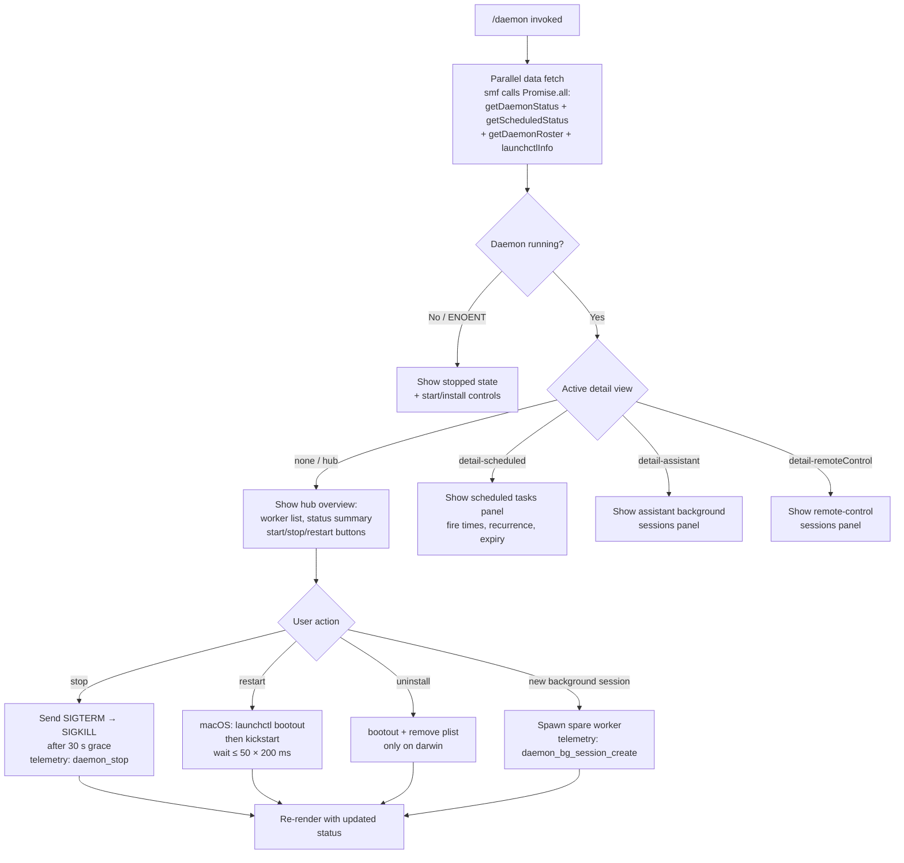

# `/daemon`

> Analysis basis: CC v2.1.165 bundle.js (AST extraction + Claude interpretation)
> Minimum version: v2.1.165

---

## Overview

The `/daemon` command exposes a terminal UI panel for managing the Claude Code background daemon process and its associated background sessions. It combines real-time status reporting with lifecycle controls (start, stop, restart, uninstall) and displays structured information about scheduled tasks, background workers, remote-control sessions, and system-service integration (launchctl on macOS).

---

## Registration

| Field | Value |
|---|---|
| type | `local-jsx` |
| name | `daemon` |
| description | `Manage background services and routines` |
| loc_byte | `12959128` |
| loc_byte_end | `12959296` |
| loc_line | `9602` |
| immediate | `true` |
| module_id | `Z7A` |
| load_inline | `true` |
| arbor_handler.name | `smf` |
| arbor_handler.fqn | `claude-2.1.165::smf` |
| arbor_handler.kind | `AsyncFunction` |
| arbor_handler.resolution_path | `module_id` |
| arbor_handler.n_hits | `0` |

Analysis basis: CC v2.1.165 bundle.js:+12959128

---

## Input Branching

The command has more than three distinct display paths depending on the active detail view and daemon state. A Mermaid flowchart is used.



Analysis basis: CC v2.1.165 bundle.js:+12947876 (smf entry), +12958084 (Lpf render loop), +12948330 (T7A component)

---

## Behavioral Spec

### 1. Handler Entry — `smf` (AsyncFunction)

`smf` is the primary handler resolved by Arbor via the `module_id` → `Z7A` path. It runs three parallel data-gathering tasks before returning the JSX component tree.

```
async function daemonHandler(context):
    [daemonStatus, scheduledStatus, roster] = await Promise.all([
        getDaemonRunningStatus(),   // reads daemon.status.json
        getScheduledDaemonStatus(), // reads daemon.scheduled.status.json
        getMcpRosterInfo()          // reads roster.json
    ])
    launchInfo = await getLaunchctlInfo()  // macOS only: launchctl print
    return renderDaemonComponent(daemonStatus, scheduledStatus, roster, launchInfo)
```

Analysis basis: CC v2.1.165 bundle.js:+12947876

---

### 2. Status File Readers

#### 2a. `getDaemonRunningStatus` (maps to `IKK`)

Reads `daemon.status.json` from the state directory, parses it as JSON, and extracts process identity for signal delivery.

```
async function getDaemonRunningStatus():
    dir = getStateDir()                    // N9 → async store lookup
    path = joinPath(dir, "daemon.status.json")
    raw = await readFile(path, "utf8")
    data = JSON.parse(raw)
    return data
    // on ENOENT → return null (daemon not running)
```

Analysis basis: CC v2.1.165 bundle.js:+12744128 (`IKK`), +12743842 (literal `"daemon.status.json"`)

#### 2b. `getScheduledDaemonStatus` (maps to `t4K`)

Reads `daemon.scheduled.status.json` from the same directory.

```
async function getScheduledDaemonStatus():
    dir = getStateDir()
    path = joinPath(dir, "daemon.scheduled.status.json")
    raw = await readFile(path, "utf8")
    return JSON.parse(raw)
    // on ENOENT → return null
```

Analysis basis: CC v2.1.165 bundle.js:+12834545 (`t4K`), +12834338 (literal `"daemon.scheduled.status.json"`)

#### 2c. `getDaemonRoster` (maps to `Pg`)

Reads `roster.json`, parses it, validates structure, and applies freshness checks using `Date.now()`.

```
async function getDaemonRoster():
    path = getRosterPath()           // joinPath(stateDir, "roster.json")
    raw = await readFile(path)
    if JSON.parse fails → emit telemetry tengu_bg_roster_parse_failed
    validate that result is Array or Object with expected keys (FXf check)
    filter entries by timestamp staleness (o_A uses Date.now())
    rotate/rename stale roster via XFq (renames with Date.now() suffix)
    return filtered roster entries
```

Analysis basis: CC v2.1.165 bundle.js:+11478881 (`Pg`), +11475294 (roster path `IMH`), +11475308 (literal `"roster.json"`), +11478971 (telemetry `tengu_bg_roster_parse_failed`)

#### 2d. `getLaunchctlInfo` (maps to `ln` / `C8` / `dy8`)

macOS-only. Invokes `launchctl print` with a 5000 ms timeout, parses service status, and captures UID via `process.getuid()`.

```
async function getLaunchctlInfo():
    if platform != "darwin": return null
    uid = process.getuid()
    result = await spawnCommand("launchctl", ["print", ...], timeout=5000)
    return parseServiceState(result)
```

Analysis basis: CC v2.1.165 bundle.js:+11472779 (`ln`), +11472782 (literal `"launchctl"`), +11472795 (literal `"print"`), +11472829 (literal `5000`), +11469636 (`fFq` → `process.getuid`)

---

### 3. Daemon Lifecycle Operations

#### 3a. Stop (`X0` → `IKK`)

Sends `SIGTERM` to the daemon PID. If the process does not exit within 30 seconds it escalates to `SIGKILL`. Telemetry emitted on success and failure.

```
async function stopDaemon(pid):
    process.kill(pid, "SIGTERM")
    wait up to 30 s polling for exit
    if still alive after 30 s:
        process.kill(pid, "SIGKILL")
        emit tengu_bg_dispatch_sigkill_escalate
    emit tengu_daemon_stop or tengu_daemon_stop_failed
```

Analysis basis: CC v2.1.165 bundle.js:+11468787 (`X0` → `process.kill`), +12744325 (`IKK` → `process.kill`), literal `"SIGTERM"` at +16135612, literal `"SIGKILL"` at +16133705, literal `30` at +16133612

#### 3b. Restart (`d_A` / `Zh6`)

On macOS, performs `launchctl bootout` then `launchctl kickstart`. Polls up to 50 × 200 ms for the service to appear running again. Falls back with an error message if the daemon does not exit within 10 s of SIGTERM before kickstart.

```
async function restartDaemon():
    await runLaunchctl(["bootout", ...])
    waitForExit(maxAttempts=50)
    if not exited within 10 s:
        log "daemon did not exit within 10s of SIGTERM; restart aborted"
        return error
    await runLaunchctl(["kickstart", ...])
```

Analysis basis: CC v2.1.165 bundle.js:+11471586 (`Zh6`), +11471670 (`d_A`), literal `"bootout"` at +11471340, literal `"kickstart"` at +11471703, literal `50` at +11471996, literal `"daemon did not exit within 10s of SIGTERM; restart aborted before kickstart"` at +11472025

#### 3c. Uninstall (`eA6`)

Runs `launchctl bootout` and then removes the plist file. Only implemented for `darwin`; on other platforms returns `"service uninstall not available on darwin"`.

```
async function uninstallDaemon():
    if platform != "darwin":
        return "service uninstall not available on darwin"
    plistPath = joinPath(homeDir(), "Library", "LaunchAgents", ...)
    await runLaunchctl(["bootout", ...])
    await fs.unlink(plistPath)
```

Analysis basis: CC v2.1.165 bundle.js:+11471312 (`eA6`), literal `"bootout"` at +11471340, literal `"service uninstall not available on darwin"` at +11471472, +11469544 (`Q_A` builds LaunchAgents path), literals `"Library"` at +11469567, `"LaunchAgents"` at +11469577

---

### 4. Background Worker Management

#### 4a. Worker status collection (`E7A`)

Aggregates all background worker state from the daemon roster, scheduled-status file, and MCP connections. Calls `Promise.all` over `$7K`, `_7K`, `IKK`, `t4K`, `Pg`, and `ln` sub-readers.

```
async function collectAllDaemonData():
    [workerMap, daemonInfo, scheduledInfo, rosterInfo, mcpInfo] =
        await Promise.all([
            getWorkerMap(),          // $7K
            getDaemonInfo(),         // _7K
            getDaemonRunningStatus(),
            getScheduledDaemonStatus(),
            getRosterInfo(),
            getLaunchctlInfo()
        ])
    return merge(workerMap, daemonInfo, scheduledInfo, rosterInfo, mcpInfo)
```

Analysis basis: CC v2.1.165 bundle.js:+12947397 (`E7A`)

#### 4b. Worker map resolution (`$7K` / `x96` / `vLA`)

Reads per-worker JSON state files (format: `<id>.json`), validates with `Array.isArray`, tags each worker as `"scheduled"` where appropriate.

```
async function buildWorkerMap():
    entries = await readWorkerStateDir()
    for each entry:
        raw = await readFile(entry, "utf8")
        parsed = JSON.parse(raw.trim())
        if not valid → skip
        if entry tagged "scheduled" → mark worker.type = "scheduled"
    return workerMap
```

Analysis basis: CC v2.1.165 bundle.js:+12942099 (`$7K`), +12835831 (`x96`), +12744604 (`vLA`), literal `"scheduled"` at +12835843, literal `"utf8"` at +12744638

#### 4c. Background session spawning and claiming (`VDA` / `AMA`)

The daemon maintains a pool of spare background sessions. When a new session is needed it claims a spare worker via `Fg.claim` (socket IPC), writes a claim frame to the socket, and falls back to `Fg.spawn` if no spare is available.

```
async function claimOrSpawnWorker(config):
    spare = findSpareWorker()
    if spare:
        emit tengu_bg_spare_claim
        socket = connectToWorker(spare)
        sendClaimFrame(socket, config)   // zg: binary framing with UInt32BE header
        if timeout: emit tengu_bg_sendclaim_failed
    else:
        emit tengu_bg_spare_claim_fail
        spawn new worker via Fg.spawn(config)
        emit tengu_daemon_bg_session_create
```

Analysis basis: CC v2.1.165 bundle.js:+16113231 (`VDA` → `Fg.claim`), +16113419 (`Fg.spawn`), +13493476 (`AMA`), +16135090 (telemetry `tengu_bg_spare_claim`), +16113387 (telemetry `tengu_bg_sendclaim_failed`), +16133973 (telemetry `tengu_daemon_bg_session_create`)

---

### 5. Scheduled Task Engine (`d` / clock loop)

The daemon's scheduler tracks task fire times and recurrence. On each clock tick it checks whether tasks are due, fires them, and manages grace period clock advancement.

```
function schedulerTick(now, tasks):
    for task in tasks:
        if task.nextFireTime <= now:
            if task.recurring:
                reschedule(task)        // advance nextFireTime
            else:
                if task.expired:
                    emit tengu_scheduled_task_expired
                else:
                    emit tengu_scheduled_task_fire
                    dispatchTask(task)
    shiftGraceClocksForward(now)
    retireIdleStaleWorkers()
```

Literals: `"never"` (non-recurring sentinel at +15638101), `" (recurring)"` suffix (+15638203), tick interval 60 s (+15638457).

Analysis basis: CC v2.1.165 bundle.js:+15637856 (`d`), +15638226 (telemetry `tengu_scheduled_task_fire`), +15638571 (telemetry `tengu_scheduled_task_expired`)

---

### 6. Memory-Pressure Management (`w` / `h`)

A sweep function runs on a timer; when free system memory falls below a threshold it retires non-pinned settled workers, and as a last resort retires even pinned workers. Reads `/proc`-style memory stats and worker stats files.

```
async function memorySweep():
    freeMem = os.freemem()
    if freeMem < threshold:
        emit tengu_bg_low_mem_mb
        emit tengu_bg_dispatch_low_mem
        retireNonPinnedSettledWorkers()
        if freeMem still < threshold:
            log "bg: low memory persists after shedding non-pinned — retiring pinned settled workers as a last resort"
            emit tengu_bg_retire_pinned_low_mem
            retirePinnedSettledWorkers()
```

Analysis basis: CC v2.1.165 bundle.js:+16134088 (`w` → `SDA.freemem`), +16134258 (telemetry `tengu_bg_dispatch_low_mem`), +13015589 (telemetry `tengu_bg_low_mem_mb`), +16138262 (telemetry `tengu_bg_retire_pinned_low_mem`), literal at +16138151

---

### 7. Daemon Yield / Supervisor Handoff (`Y` / supervisor literal)

When a foreground or service daemon claims the supervisor role the background daemon yields, writing a `"transient"` / `"yielding"` status and ceasing to dispatch new work. Background workers are re-adopted by the new supervisor.

```
function yieldToSupervisor():
    emit tengu_daemon_yield
    writeStatus("transient")
    log "yielding to a foreground/service daemon — bg workers will be re-adopted"
    stopDispatch()
```

Analysis basis: CC v2.1.165 bundle.js:+16148276 (literal `"supervisor"`), +16153157 (literal `"transient"`), +16153210 (literal `"yielding to a foreground/service daemon — bg workers will be re-adopted"`), +16153292 (telemetry `tengu_daemon_yield`)

---

### 8. Render Component (`T7A` / `Lpf`)

`T7A` is the React/Ink component that renders the interactive daemon dashboard. It uses `useState`, `useRef`, and `useSyncExternalStore` hooks. `Lpf` is the outer render wrapper that mounts the component with `M.render` and calls `M.unmount` on cleanup.

```
function DaemonComponent(props):
    [detailView, setDetailView] = useState(null)
    clock = useClock()                    // j1 → bA9.useContext
    intervalRef = useRef(null)
    data = useSyncExternalStore(subscribe, getSnapshot)

    render based on detailView:
        null / "hub"         → HubPanel
        "detail-scheduled"   → ScheduledPanel
        "detail-assistant"   → AssistantPanel
        "detail-remoteControl" → RemoteControlPanel

    handle keyboard input (E):
        on key press → dispatch action (t0 → r_)
        navigate tabs, trigger stop/start/restart/uninstall
```

Literals surfaced in rendered UI: `"Claude Daemon"` (+12950240), `"Remote Control"` (+12949955), `"Scheduled"` (+12949634), `"uninstall"` (+12948518), `"restart"` (+11471768), `"start"` (+11471692), `"stop"` (+11471728), `"new"` (+12948805), `"permission"` (+12950338).

Analysis basis: CC v2.1.165 bundle.js:+12948087 (`T7A`), +12958084 (`Lpf`), +12958501 (`M.render`), +12958715 (`M.unmount`)

---

## State & Side Effects

| Item | Detail |
|---|---|
| Telemetry | `tengu_bg_roster_parse_failed`, `tengu_daemon_config_reload`, `tengu_daemon_control`, `tengu_daemon_stop`, `tengu_daemon_stop_failed`, `tengu_daemon_yield`, `tengu_daemon_idle_exit`, `tengu_daemon_bg_session_create`, `tengu_bg_dispatch_sigkill_escalate`, `tengu_bg_low_mem_mb`, `tengu_bg_dispatch_low_mem`, `tengu_bg_adopt_sock_unlinked`, `tengu_bg_spare_enable`, `tengu_bg_spare_claim`, `tengu_bg_spare_claim_fail`, `tengu_bg_sendclaim_failed`, `tengu_bg_state_read_transient`, `tengu_bg_retire_grace_bridged_min`, `tengu_bg_retire_pinned_low_mem`, `tengu_bg_attach_upgrade`, `tengu_bg_prewarm_per_sweep`, `tengu_scheduled_task_fire`, `tengu_scheduled_task_expired`, `tengu_mcp_oauth_flow_start`, `tengu_mcp_oauth_flow_success`, `tengu_mcp_oauth_flow_error`, `tengu_mcp_reconnect`, `tengu_mcp_reconnect_not_connected`, `tengu_mcp_reconnect_failed`, `tengu_config_auth_loss_prevented`, `tengu_config_parse_error`, `tengu_feature_ok`, `tengu_feature_bad`, `tengu_feature_sad`, `tengu_skill_file_changed`, `tengu_mcp_skills` |
| File reads | `daemon.status.json`, `daemon.scheduled.status.json`, `roster.json`, worker state JSON files, `pins.json`, `mcp-needs-auth-cache.json`, `gateway-models.json` |
| File writes / renames | Stale roster renamed with `Date.now()` suffix; claim frame written to Unix socket; `c9H.writeFile` for worker state; `WD.rm` / `WD.unlink` on worker cleanup |
| Process signals | `SIGTERM` then `SIGKILL` on stop; `process.kill` used directly |
| OS integration | `launchctl print` / `bootout` / `kickstart` on macOS; `sLK.homedir()` to locate LaunchAgents plist; `process.getuid()` for service label |
| appState changes | Supervisor role transitions; MCP server reconnection state (`connected`, `failed`, `needs-auth`); worker roster entries added/removed |
| IPC | Unix domain socket (`XB8.connect`); binary framing via `Buffer.allocUnsafe` + `writeUInt32BE` + `writeUInt8`; claim frame size constants 448 / 384 bytes |
| UI mount | `M.render` / `M.unmount` (Ink); `immediate: true` means the command renders without waiting for a user prompt |
| Sound | None detected |

---

## Version History

| Version | Change |
|---|---|
| v2.1.165 | Initial analysis |

---

## Common Mistakes

1. **Running `/daemon` in a non-daemon process** — the command reads `daemon.status.json`; if the background daemon has never been started the file will be absent (ENOENT) and the panel will show a stopped state rather than an error.
2. **Expecting `restart` to work on non-macOS** — `restart` uses `launchctl bootout` + `kickstart`, which is macOS-only. On Linux/Windows the restart path is not available.
3. **Interpreting `"transient"` status as an error** — a transient status means the daemon has yielded to a foreground supervisor; it will resume once the foreground session exits.
4. **Assuming instant stop** — stop sends SIGTERM and waits up to 30 seconds before escalating to SIGKILL; the UI may remain in a "stopping" state for that duration.
5. **Expecting `/daemon` to block the CLI** — `immediate: true` causes the command to render its Ink UI inline without submitting a conversational turn; pressing a standard exit key (not a slash command) is required to dismiss the panel.

---

## Appendix — Identifier Mapping

> For bundle debugging only. Identifiers change across versions.

| Identifier | Role |
|---|---|
| `smf` | Main async handler for `/daemon` (Arbor-resolved, `module_id` Z7A) |
| `Lpf` | Outer JSX render wrapper; calls `M.render` / `M.unmount` |
| `T7A` | React/Ink daemon dashboard component |
| `E7A` | Parallel data aggregator for all daemon status sources |
| `$7K` | Worker map builder; dispatches to `x96`, `kH`, `X0` |
| `x96` | Per-worker state-file reader; tags `"scheduled"` entries |
| `vLA` | Reads and parses individual worker JSON state file |
| `tLA` | Validates worker state array structure |
| `kH` | Worker queue manager (shift/push ring buffer) |
| `HA` | Error/String coercion helper |
| `eH` | String coercion helper |
| `Dq` | Routes to essential-traffic handler (`xSA`) |
| `qW4` | Ring-buffer queue rotate (shift + push on `kd6`) |
| `X0` | Daemon process kill / PID-file manager |
| `Wh6` | PID file reader |
| `U_A` | PID file line parser (split, slice) |
| `w2` | Process wait helper (uses `ty`) |
| `_7K` | Daemon info aggregator (C0H, vb, X0) |
| `C0H` | Reads daemon info from state store; handles ENOENT |
| `N9` | Async store getter (`QZL.getStore`) |
| `v8` | Error classification helper |
| `X7A` | Calls `J7A` for state formatting |
| `EH` | String coercion (used in multiple places) |
| `K` | Status table padEnd formatter |
| `vb` | Path joiner using `B_A.join` + `a8` |
| `IKK` | Reads `daemon.status.json`; calls `process.kill` |
| `JR6` | Builds `daemon.status.json` path (`VKK.join` + `a8`) |
| `t4K` | Reads `daemon.scheduled.status.json`; calls `process.kill` |
| `s4K` | Builds `daemon.scheduled.status.json` path |
| `Pg` | Reads and validates `roster.json`; rotates stale entries |
| `B6` | JSON.parse wrapper |
| `IMH` | Builds roster path (`HO.join` + `rbH`) |
| `rbH` | Builds roster directory path |
| `R8` | ENOENT-tolerant error suppressor |
| `o_A` | Freshness timestamp calculator (`Date.now`) |
| `XFq` | Renames stale roster file with timestamp suffix |
| `FXf` | Validates roster structure (`Array.isArray`, `Object.keys`) |
| `h1` | Uses `Nu6` (utility helper) |
| `ln` | launchctl info orchestrator |
| `C8` | launchctl command executor; uses `S_` and `b6` |
| `S_` | Service state parser; calls `bTH`, `D`, `bG4`, `K$`, `kH` |
| `b6` | Subprocess spawn helper using `bd6` and `X_` |
| `dy8` | UID-aware launchctl path builder (uses `fFq`) |
| `fFq` | Calls `process.getuid` to get current UID |
| `P7A` | Configuration and home-directory resolver |
| `X_` | General utility (uses `uv`) |
| `td6` | Config reader using `Q6`, `R8` |
| `v` | Environment/config value resolver |
| `icK` | Config item resolver using `Vy`, `ncK`, `DXA` |
| `DXA` | Platform check helper |
| `H` | HTTP bootstrap fetch handler |
| `Gw_` | URL string tokeniser (split, trim, indexOf, slice) |
| `ZHH` | Uses `c44.has` for set-membership check |
| `uj` | String replace helper |
| `e1` | Calls `D6H`, `Aq`, `eX` |
| `s6` | Uses `c` and `P6` (state helpers) |
| `SH` | `JSON.stringify` wrapper |
| `J4` | Path/string transformer (uses `c2A`, `H.replace`, `A.lastIndexOf`) |
| `c2A` | Maps over `QcK` |
| `A` | String lowercaser (`f.toLowerCase`) |
| `ppH` | Uses `C2A` (`H.write`) |
| `acK` | Log file writer with rotation (`ocK`, `a2A`, `s2A`) |
| `$pH` | Debounced flush (clearTimeout / setTimeout / setImmediate) |
| `d3H` | Log directory builder (`KHH.join`, `a8`, `S6`) |
| `s2A` | Log path builder |
| `a2A` | Log file rotator (stat, rename, unlink) |
| `ocK` | Log appender (mkdir, appendFile) |
| `j9` | Signal handler registration (`zXA.register`) |
| `M` | Ink renderer (holds `AbH`, `eU8`, `IYA`) |
| `AbH` | MCP server connection orchestrator |
| `bl` | MCP connection pipeline (ws, Cl, DG6) |
| `wG6` | MCP transport constructor (ih, ZKH) |
| `ws` | MCP session manager (connect, approve, retry) |
| `Cl` | MCP server config enumerator |
| `uY8` | MCP error color formatter (red/yellow) |
| `DG6` | MCP server slot reconciler (sse/http) |
| `fk` | MCP tool fingerprinter (`oO`, `zb_`) |
| `oO` | Tool metadata formatter |
| `__` | Double-underscore alias to `_` |
| `sk6` | MCP filter helper |
| `skq` | MCP server needs-auth checker (`Ae_`, `VXH`, `bY8`) |
| `Ae_` | Needs-auth cache reader (`N9`, `SI8`) |
| `VXH` | Config hash builder (SHA-256, hex) |
| `bY8` | Config key extractor (`AAH`, `Object.keys`) |
| `xY8` | Uses `bY8` and `GP` (hash comparator) |
| `GP` | Config hash comparator (`SH`, `gu9.createHash`) |
| `RY8` | Uses `M4` for model info |
| `M4` | Model info fetcher (`VP1`) |
| `O8` | MCP debug logger (`hBH.push`, `Er.logMCPDebug`) |
| `ts_` | MCP server connection lifecycle manager |
| `BKf` | MCP connection config builder |
| `Ad` | Auth helper (`yx`, `GK`) |
| `i1H` | MCP client init (`pvq`, `XKf`) |
| `r1H` | MCP retry helper |
| `o1H` | MCP OAuth server / SSE connection handler |
| `r_6` | In-flight connection tracker (`iv8`) |
| `D` | Forced-shutdown helper (`process.exit`, `z.abort`) |
| `_I8` | Needs-auth state reader (`N9`, `SI8`) |
| `Sn` | MCP reconnect orchestrator |
| `yx` | Auth state helper (`GK`) |
| `Y` | Supervisor config-reload handler |
| `T7` | MCP error logger (`hBH.push`, `Er.logMCPError`) |
| `FKf` | MCP connection future holder |
| `UKf` | SSH detection (`T6.isSSH`, `eH`, `Wq`) |
| `es_` | MCP server external-session manager |
| `i_6` | In-flight map getter (`nv8.get`) |
| `o_6` | In-flight map getter (`iv8.get`) |
| `L` | Pending-set tracker (`q.add`, `q.delete`) |
| `Myq` | Needs-auth check with cache (`kI8.then`, `Ae_`, `N9`) |
| `SI8` | Needs-auth cache path builder |
| `ss_` | MCP tool-snapshot comparator (`GP`, `M4`, `O8`) |
| `Lb_` | MCP transport includes check (`X8`) |
| `X8` | Transport builder (CX_, eT, H, _lH) |
| `j` | Worker PID map iterator (`A.values`, `R.kill`) |
| `R` | Worker kill routine (`YmK`, `K$`, `v`, `kH`) |
| `FN` | Skills/tool-file watcher (`D6`) |
| `D6` | Tool-file change dispatcher |
| `I` | Chokidar file-watch config builder |
| `W6` | Uses `Nu6` |
| `S` | Worker write helper (`Y.write`, `c`) |
| `_yq` | Uses `hB` (async-iterator helper) |
| `hB` | Async iterator / pool implementation |
| `zA6` | parseInt wrapper (slot index) |
| `RI8` | parseInt wrapper (slot index) |
| `eU8` | MCP connection result applier (`H.applyMcpUpdate`) |
| `_bH` | Uses `VXH` for config hash |
| `mk` | MCP cleanup orchestrator (`$A6`, `K.cleanup`, `FN`) |
| `$A6` | Uses `VXH` |
| `$` | NKK-based main state snapshot |
| `NKK` | Daemon status snapshot builder (`nr`, `Date.now`, `N9`) |
| `nr` | Uses `L4H` (output formatter) |
| `IYA` | MCP server update applicator (filter, getClients, pY8) |
| `pY8` | MCP server feature-flag checker |
| `l8` | Timeout/abort helper |
| `O` | Uses `b8` |
| `j7K` | Model list / config loader (`dA6`) |
| `dA6` | Model configuration assembler (RDf, rmq, QA6, gM) |
| `RDf` | Model variant registry (opus, sonnet, haiku, gateway) |
| `ZA` | Model entry constructor (`zY`, `nR`, `n1`) |
| `P6H` | Max-tier plan entry builder |
| `PYH` | Team-plan entry builder |
| `IQH` | Enterprise-usage-based entry builder |
| `wy8` | Default/gateway model builder |
| `z2` | First-party model entry builder |
| `Ws` | Model variant constructor (q4H, ZA, xU9) |
| `Q8A` | Uses `w6H` and `NE` |
| `f` | Cleanup callback list (`A.close`, `q.close`) |
| `qpq` | Model display-name builder (gM, ZA, n8A) |
| `hfH` | Model variant constructor (q4H, ZA, xU9) |
| `Apq` | Opus variant builder (gM, ZA, rR) |
| `Mpq` | Model variant with 1M context (gM, A4H, Z5, n8A) |
| `fpq` | Opus variant builder (gM, n8A, rR) |
| `gM` | Model base-entry factory (`XA`) |
| `tmq` | Model tier helper (`l8A`, `o0`) |
| `Hpq` | Opus 4.8 1M entry (gM, A4H, Z5) |
| `amq` | Model tier helper (`l8A`, `o0`) |
| `smq` | Sonnet variant builder (gM, Z5, rR) |
| `emq` | Model entry builder (gM, Z5, rR) |
| `_pq` | Uses `l8A` |
| `Lpq` | Model entry builder (gM, rR) |
| `TDf` | Uses `Z5` |
| `NDf` | Model entry (gM, A4H, Z5) |
| `w6H` | Model display-string builder (q4H, t1, CD, Hf) |
| `Z5` | Model cost/tier descriptor (amH, D8L, N$1, Us6, XA) |
| `VDf` | Model entry (gM, Z5) |
| `IDf` | Model entry (gM, Z5) |
| `ZDf` | Model entry (gM, Z5) |
| `vDf` | Model entry (gM, Z5, A4H) |
| `yDf` | Model entry (NQH, Z5, Lpq, kDf) |
| `y6` | Model file loader (Q6, eT, kX_, bDH, WTL) |
| `kX_` | File key extractor |
| `bDH` | Model config file reader/parser (JSON, fs) |
| `WTL` | Model config file watcher (`a98.watchFile`) |
| `rmq` | Gateway model loader (lmq, B8A, imq) |
| `lmq` | Gateway model line parser (eH, XA, Hf) |
| `imq` | Gateway model path builder (`F8A.join`, `nmq`) |
| `D6H` | Command-line argument parser (x0, IqH, SA, yd) |
| `x0` | Argument string tokeniser |
| `IqH` | Argument key normaliser |
| `yd` | Settings-file argument parser |
| `QA6` | Model filter/normaliser (SA, H.filter, yd) |
| `SDf` | Model sanitiser |
| `NE` | Model name entry (gM, Z5, XA) |
| `XA` | Model identifier wrapper (eH) |
| `CDf` | Custom model entry builder (xj, t1, wI, NE, NQH) |
| `xj` | Model ID lowercaser (XA, H.toLowerCase, t1) |
| `t1` | Model string matcher (Bs6, tX, H.includes, cQ8, uj) |
| `wI` | Model info builder (gM, Z5) |
| `NQH` | Uses `Z5` |
| `smf` | Main async daemon handler (Arbor name) |
| `T7A` | Ink React component for daemon dashboard |
| `j1` | Clock context consumer (`bA9.useContext`) |
| `cK` | Ink timer hook (`Ma.useRef`, `Ma.useMemo`, `K.setTimeout`) |
| `z` | Background session orchestrator (hH, RH, Yh, Tp) |
| `hH` | Status helper using `c` and `P6` |
| `P6` | Uses `Nu6` |
| `RH` | Status helper using `c` and `P6` |
| `Yh` | Session emitter (Au, _c.push, QNH, zX_) |
| `Au` | Uses `fC` |
| `QNH` | Uses `zh` |
| `zX_` | Session UUID emitter (C98, $X_.randomUUID, GcH, oU, H.emit) |
| `Tp` | Shutdown race (Promise.race, Promise.all, Ac, fc, l8, process.exit) |
| `Ac` | Calls `KLH.shutdown` |
| `fc` | Clears shutdown timeout (clearTimeout, UX_) |
| `W` | Worker manager (XK6, IS, Ck, kH, HA) |
| `XK6` | Worker kind resolver |
| `J` | Daemon session holder (uses `w`) |
| `w` | Background worker loop (spawn, claim, retire, memory) |
| `b` | Worker process handle |
| `vb8` | Platform memory helper (`a6`, `D6`) |
| `zX6` | Reads `pins.json` and worker directories |
| `fT_` | Pins path builder (`k2.join`, `cE`) |
| `PBL` | Pinned worker directory reader |
| `g` | Worker instance (process.kill, v, c, L4H, C, Q) |
| `x` | Interval clearer (`clearInterval`) |
| `L4H` | Output formatter (`SHH`, `_.trim`) |
| `C` | Rate-limit event emitter (`deq`, `I.enqueue`, `Pj.randomUUID`) |
| `Q` | Idle-exit countdown timer (clearTimeout, setTimeout, Y.write) |
| `VDA` | Spare-worker claimer (`Fg.claim`, `AMA`, `D55`, `Y55`) |
| `AMA` | Worker state-file writer (`c9H.mkdir`, `c9H.writeFile`) |
| `D55` | Claim timeout handler (`Date.now`, `Error`, `w55`, `v8`) |
| `Y55` | Claim frame builder (`Fg.buildClaimFrame`) |
| `zg` | Binary socket frame encoder (Buffer, UInt32BE, UInt8, copy) |
| `hDA` | Worker lifecycle manager (spawn, retire, cleanup, roster) |
| `yK` | Worker path builder |
| `e9` | Worker state-file reconciler (stat, set, delete, clear) |
| `jY` | Uses `$N` |
| `ff` | Worker state snapshot writer (`MY`, `k2.join`, `SH`, `oj`) |
| `q16` | Roster scheduler (PFq.then, Pg, Date.now, gXf) |
| `kMH` | Log path builder for worker (`HO.join`, `abH`) |
| `VT` | Log path splitter (`a6`, `HO.join`, `H.split`) |
| `Xg` | Log path builder (`a6`, `l_A`, `HO.join`) |
| `Vh6` | State dir path builder (`HO.join`, `r_A`) |
| `F` | Process dispose helper |
| `P` | Input line editor (Ink, vim-mode keybindings) |
| `h` | Background sweep function (memory, retire, prewarm) |
| `d` | Scheduled task clock (grace clocks, fire, expire) |
| `X` | Socket data accumulator (Buffer.concat, indexOf) |
| `tP6` | Grace-clock tick calculator |
| `uM8` | Grace-clock max adjuster |
| `$hK` | Boolean coercion helper |
| `se` | Uses `_.has` |
| `T_H` | Grace-clock filter (se, zkH, q.filter, A.has, brH) |
| `lR6` | Memory info builder (`vb8`, `EfK.freemem`) |
| `TfK` | Timer for memory sweep (`D6`) |
| `l` | Worker retire-if-settled helper (`Wh6`, `AFq`) |
| `AFq` | PID-file cleanup on retire (`Kp.unlink`, `uWH`) |
| `Ib8` | Uses `D6` |
| `r` | Worker respawn manager (`W`, `eU8`, `l.applyMcpUpdate`) |
| `L3A` | Vim-mode motion dispatcher (xof, uof, mof, pof, Uof, Bof, Fof, gof, Qof, dof, cof) |
| `xof` | Vim motion: set-offset dispatcher |
| `iJK` | Vim motion: insert-mode entry |
| `uof` | Vim motion: character count |
| `mof` | Vim motion: delete/change |
| `a$A` | Vim text-edit applier (split, slice, indexOf, setText, setOffset, recordChange) |
| `rJK` | Vim motion: repeat/find |
| `pof` | Vim motion: paste |
| `Uof` | Uses `$m8` |
| `$m8` | Vim last-find tracker (bof, Fq6, setLastFind, recordChange) |
| `Bof` | Vim bracket/pair motion (Om8) |
| `Om8` | Vim bracket applier (Mm8, Fq6, recordChange) |
| `Fof` | Vim find-repeat (setOffset, setLastFind) |
| `gof` | Vim G-motion (TuH, setOffset, Math.min) |
| `TuH` | Vim offset helper (hof, L.equals) |
| `Qof` | Vim Q-motion (ZuH, cJK) |
| `ZuH` | Vim yank/change applier (TuH, K.equals, r$A, s$A, setRegister, enterInsert, recordChange) |
| `cJK` | Vim change-join motion (q.equals, s$A, Fq6, recordChange) |
| `dof` | Vim delete-word motion (Ym8) |
| `Ym8` | Vim word-delete applier (M76, K.slice, setText, setOffset, recordChange) |
| `cof` | Vim change-word motion (jm8) |
| `jm8` | Vim word-change applier (Math.min, e$A, K.join, setText, setOffset, VuH, recordChange) |
| `eA6` | Daemon service uninstall action |
| `Q_A` | LaunchAgents plist path builder |
| `Zh6` | Daemon restart action |
| `d_A` | launchctl stop-then-start sequence |
| `T` | Component state toggle |
| `E` | Keyboard event dispatcher (`b.preventDefault`, `t0`) |
| `t0` | Uses `r_` (settings/command router) |
| `r_` | Settings loader and command dispatcher |
| `cO` | Settings pre-processor (`HzH`, `Kd`) |
| `g6_` | Settings layer merger (`bmA`, `HzH`, `qd`, `SmA`, `Tr`) |
| `Kd` | Settings schema applier |
| `oP` | Uses `Zr` |
| `pH_` | Timestamp setter (`Rc6.set`, `Date.now`) |
| `rTH` | Settings reload trigger (`Xl6`, `Kd`) |
| `TM6` | Atomic file writer (lstat, rename, fchmod, fsync, unlinkSync) |
| `sz` | Cache clearer (`Mm6.clear`, `FF8.clear`) |
| `vc6` | Git-aware config writer (readFile, appendFile, writeFile) |
| `Sx` | Config path resolver (`_I.join`) |
| `DU` | Settings dispatch helper (`nT`, `u9`, `Q6_`, `Kd`, `$m6`) |
| `V` | Ink component instance |

---

Note: index built via Arbor fallback; some signals (telemetry, literals) may be missing — see arbor-fallback.js.