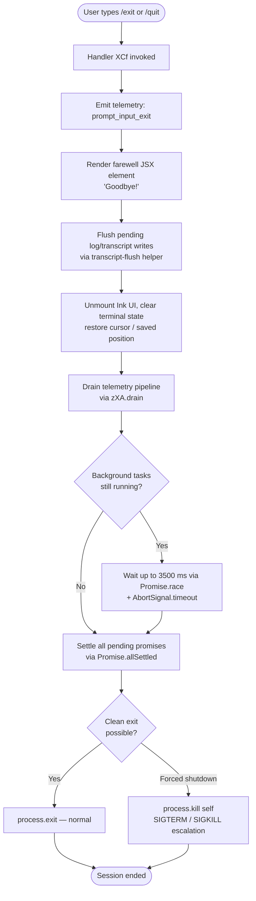

# `/exit`

> Analysis basis: CC v2.1.165 bundle.js (AST extraction + Claude interpretation)
> Minimum version: v2.1.165

---

## Overview

The `/exit` command (also available as `/quit`) terminates the Claude Code CLI session. When invoked, it renders a farewell JSX element, fires a `prompt_input_exit` telemetry event, then orchestrates a full graceful-shutdown sequence: unmounting the UI, flushing pending writes, draining telemetry, waiting for background tasks to settle, and finally calling `process.exit`.

---

## Registration

| Field | Value |
|---|---|
| type | `local-jsx` |
| name | `exit` |
| description | `null` |
| aliases | `["quit"]` |
| immediate | `true` |
| module_id | `E9K` |
| load_inline | `true` |
| loc_byte | `12645186` |
| loc_byte_end | `12645382` |
| loc_line | `9066` |
| arbor_handler.name | `XCf` |
| arbor_handler.fqn | `claude-2.1.165::XCf` |
| arbor_handler.kind | `AsyncFunction` |
| arbor_handler.resolution_path | `module_id` |
| arbor_handler.n_hits | `1` |

Analysis basis: CC v2.1.165 bundle.js:+12645186

---

## Input Branching

The `/exit` handler follows a predominantly linear flow with a small number of branches (background-task wait vs. immediate exit, and graceful vs. forced process termination). A flowchart is used because there are 3+ distinct outcome paths.



---

## Behavioral Spec

### Main handler — session exit orchestration

Analysis basis: CC v2.1.165 bundle.js:+12644435

```
async function exitCommandHandler(context):

    // 1. Immediate flag: command executes without waiting for agent turn
    //    (registration.immediate = true)

    // 2. Emit telemetry marker so downstream analytics can count exit paths
    emitTelemetry("prompt_input_exit")           // loc_byte 12644623

    // 3. Render the farewell message in the JSX layer
    renderFarewellElement("Goodbye!")            // loc_byte 12644399, 12644512

    // 4. Signal the detach / background-session layer that a detach-request
    //    is in progress (literal "detach-request" at loc_byte 11010463)
    notifyDetachRequest(context)                 // via GMH, loc_byte 12644451

    // 5. Flush transcript / conversation log to disk
    flushTranscriptWrites()                      // via acK → ocK, loc_byte 12644482+

    // 6. Unmount the Ink/React UI and restore terminal state
    //    - writes ANSI restore-cursor sequence (ESC 7 / ESC 8)
    //    - handles tmux double-escape wrapping
    unmountUI()                                  // via JyH → H.unmount, loc_byte 5445369
    restoreTerminalCursor()                      // via U48 → Aa.writeSync, loc_byte 3782353

    // 7. Print shutdown summary to stdout via MS_ helper
    //    Escapes special characters in path strings
    printShutdownSummary()                       // via MS_, loc_byte 5447813

    // 8. Drain buffered telemetry events before process dies
    drainTelemetryPipeline()                     // via OpH → zXA.drain, loc_byte 60366

    // 9. Race background-task settlement against a hard timeout
    //    Hard timeout value: 3500 ms  (loc_byte 5447843)
    //    Grace window for UI tear-down: 2000 ms (loc_byte 5448021)
    result = await Promise.race([
        settleAllPendingTasks(),                 // via cZ9 → Promise.allSettled
        AbortSignal.timeout(3500)                // loc_byte 5448121
    ])

    // 10. Attempt clean process exit
    //     If unreachable or error state, escalate to process.kill
    if canExitCleanly(result):
        process.exit(0)                          // via $S_ → process.exit, loc_byte 5445956
    else:
        process.kill(process.pid, "SIGTERM")     // via $S_ → process.kill, loc_byte 5445981
        // SIGKILL escalation handled by daemon layer if SIGTERM is ignored
```

### Farewell JSX element rendering

Analysis basis: CC v2.1.165 bundle.js:+12644605

```
function renderFarewellComponent():
    // JCf wraps the d2 UI component for a single-line goodbye display
    // The string literal "Goodbye!" is the only displayed text
    return createElement(JCf, { message: "Goodbye!" })
```

### Transcript flush and log rotation

Analysis basis: CC v2.1.165 bundle.js:+12644482

```
async function flushTranscript():
    // acK orchestrates:
    //   1. Resolve log directory via path.dirname  (loc_byte 205596)
    //   2. Check byte length via Buffer.byteLength  (loc_byte 205771)
    //   3. If log file ends with ".txt" and size > 4 bytes, rotate:
    //        rename current file  (via a2A → Zy.rename, loc_byte 205073)
    //        unlink stale file    (via a2A → Zy.unlink, loc_byte 205113)
    //   4. Append final content  (via ocK → Zy.appendFile, loc_byte 205376)
    //   5. Register completion via hook  (via j9 → zXA.register, loc_byte 60323)
    //   6. Clear any pending flush timeout (via $pH → clearTimeout, loc_byte 59737)
    //      Debounce window for flush: 1000 ms  (loc_byte 59625)
    //      Batch size limit: 100 entries  (loc_byte 59646)
```

### Terminal state restoration

Analysis basis: CC v2.1.165 bundle.js:+3782353

```
function restoreTerminalState():
    // U48 performs terminal cleanup:
    //   1. Write ANSI save/restore cursor sequences ESC-7 / ESC-8  (loc_byte 3782507/3782518)
    //   2. For tmux sessions: prepend double-escape prefix  (loc_byte 3431618)
    //      replaceAll double-escape chars  (loc_byte 3431664)
    //   3. For screen multiplexers: apply screen-specific escapes  (loc_byte 3431691)
    //   4. Terminal-specific paths:
    //        ghostty >= 1.2.0   (loc_byte 3510304)
    //        iTerm.app >= 3.6.6 (loc_byte 3510373)
    //      determined via SvH → bH9.coerce version check
```

### Graceful process termination

Analysis basis: CC v2.1.165 bundle.js:+5445875

```
async function gracefulShutdown():
    // $S_ implements the final exit gate:
    //   1. Cancel any remaining setTimeout handles via clearTimeout
    //   2. Read Ink instance from registry via t4.get
    //   3. Attempt process.exit
    //   4. If process is still alive (unreachable branch), throw Error("unreachable")
    //      literal "unreachable" at loc_byte 5446029
    //   5. Fallback: process.kill to self

    // pO8 races sub-tasks with a 500 ms abort window (loc_byte 5447414)
    // ensuring no task hangs the exit path indefinitely
```

### Bootstrap fetch during session teardown

Analysis basis: CC v2.1.165 bundle.js:+15724583

```
function bootstrapFetch(url):
    // H (bootstrap fetcher) is called from XCf to ensure any pending
    // remote config fetch completes or is aborted before exit.
    // Logs "[Bootstrap] Fetching" on start  (loc_byte 15724583)
    // Logs "[Bootstrap] Fetch ok" on success  (loc_byte 15724957)
    // Timeout: 5000 ms  (loc_byte 15724784)
    // Emits sub-event "api_bootstrap_fetch" / "parse_failed" on error  (loc_byte 15724905)
    // Sets headers: Content-Type: application/json, User-Agent  (loc_byte 15724668)
```

---

## State & Side Effects

| Item | Detail |
|---|---|
| Telemetry: prompt_input_exit | Fired once per `/exit` invocation (loc_byte 12644623) |
| Telemetry: tengu_feature_sad | Fired from feature-usage tracking path (loc_byte 1010365) |
| Telemetry: tengu_scroll_summary | May fire during UI unmount scroll summary (loc_byte 5447125) |
| Telemetry: tengu_cache_eviction_hint | Fired if cache eviction occurs during shutdown (loc_byte 5448195) |
| Telemetry: tengu_amber_creek | Fullscreen / flicker-detection event (loc_byte 3440539) |
| Telemetry: tengu_pewter_brook | Fullscreen / flicker-detection event (loc_byte 3440447) |
| Telemetry: tengu_startup_perf | Startup profiling report flushed on exit if profiling enabled (loc_byte 217090) |
| Telemetry: tengu_bg_dispatch_sigkill_escalate | Fires if background session must be SIGKILL'd (loc_byte 16133657) |
| Telemetry: tengu_bg_dispatch_low_mem | Fires if low-memory condition detected during shutdown (loc_byte 16134258) |
| Telemetry: tengu_bg_spare_enable / claim / claim_fail | Background spare-session lifecycle events (loc_byte 16134962–16135356) |
| Telemetry: tengu_daemon_config_reload | Config-reload event that may fire concurrently (loc_byte 16149069) |
| Transcript flush | Log file rotated / appended before exit; ".txt" files renamed if > 4 bytes (loc_byte 205021, 205043) |
| Hook registration | `zXA.register` called to mark flush completion; `zXA.drain` called to drain all hooks (loc_byte 60323, 60366) |
| UI unmount | Ink component tree unmounted via `H.unmount` (loc_byte 5445369) |
| Terminal cursor | ANSI save/restore sequences written to stdout; tmux/screen/ghostty/iTerm2 paths handled (loc_byte 3782507) |
| appState changes | Supervisor `session_end` event emitted (loc_byte 5448233); heartbeat stopped; config watcher stopped |
| Background sessions | Detach-request signalled to daemon layer; spare sessions retired via `g.retireIfSettled` (loc_byte 16134390) |
| process.exit | Called directly by `$S_`; escalates to `process.kill` if unreachable (loc_byte 5445956, 5445981) |
| Sound | No sound effect observed in call graph |

---

## Version History

| Version | Change |
|---|---|
| v2.1.165 | Initial analysis |

---

## Common Mistakes

1. **Using `/exit` mid-task**: Because `immediate: true` is set, the command fires without waiting for a running agent turn to complete. Any in-progress tool calls or streaming responses will be abandoned rather than cleanly cancelled.

2. **Expecting instant termination**: The shutdown sequence races background tasks with a 3500 ms hard timeout. In environments with slow filesystem I/O or many pending background sessions, the process may appear to hang briefly before exiting.

3. **Confusing `/quit` and `/exit`**: Both names are registered identically (`aliases: ["quit"]`). There is no behavioral difference between them.

4. **Killing the terminal externally during `/exit`**: If the outer terminal is closed while the transcript flush is in progress, the log rotation (`Zy.rename` / `Zy.appendFile`) may be interrupted, leaving the log file in an intermediate state.

5. **CLAUDE_CODE_NO_FLICKER not set in tmux-CC mode**: The shutdown path detects `tmux -CC` (iTerm2 integration mode) and disables fullscreen teardown unless `CLAUDE_CODE_NO_FLICKER=1` is set (literal at loc_byte 3440022). Omitting this variable in affected environments may produce visible flicker on exit.

---

## Appendix — Identifier Mapping

> For bundle debugging only. Identifiers change across versions.

| Identifier | Role |
|---|---|
| `XCf` | Main exit command handler (AsyncFunction; arbor_handler) |
| `Z9` | Process-mode check helper (distinguishes bg / daemon / daemon-worker) |
| `GYH` | Process-mode value resolver |
| `H` | Bootstrap fetch / HTTP utility |
| `v` | HTTP request builder / header assembler |
| `icK` | Request option normalizer |
| `DXA` | Request option field setter |
| `SH` | JSON serializer wrapper |
| `J4` | User-agent string builder |
| `c2A` | Version-map iterator |
| `ppH` | Stdout write helper |
| `C2A` | Low-level write wrapper |
| `acK` | Transcript flush orchestrator |
| `$pH` | Debounced flush scheduler |
| `d3H` | Log-path resolver |
| `Q6` | Directory existence checker |
| `aL6` | EISDIR error handler |
| `s2A` | Log filename builder |
| `a2A` | Log file rotator (rename / unlink) |
| `ocK` | Log append worker |
| `j9` | Hook registration helper |
| `e$` | Bootstrap response validator |
| `Gw_` | URL parser / trimmer |
| `ZHH` | Feature-flag set checker |
| `uj` | URL-escape helper |
| `e1` | Model-alias resolver |
| `D6H` | Model string parser |
| `x0` | Model prefix stripper |
| `IqH` | Model family extractor |
| `yd` | Model-string normalizer |
| `Aq` | Model alias expander |
| `o0` | Model token-window lookup |
| `_4H` | Opus-plan model checker |
| `wI` | Model tier selector (opusplan / sonnet / haiku) |
| `NQH` | Model haiku selector |
| `NE` | Model first-party resolver |
| `SX1` | Model NE wrapper |
| `gM` | AWS / gateway model resolver |
| `Pe6` | Model includes-check helper |
| `vQH` | Model eH wrapper |
| `eX` | Model alias expansion entry point |
| `r0` | Model resolution pipeline |
| `s6` | Feature-sad telemetry emitter |
| `c` | Generic no-op / constant |
| `P6` | Nu6 wrapper |
| `Nu6` | Core utility (timer / scheduler) |
| `GMH` | Detach-request notifier |
| `ke6` | Detach event builder |
| `suq` | Task-type classifier |
| `Nk8` | Task constant ("task") |
| `b8` | Background-session constant |
| `ut` | JSON write helper |
| `$9H` | Detach payload assembler |
| `XM` | Exit context accessor |
| `_y8` | Scheduled-task display formatter |
| `KE` | UV handle wrapper |
| `uv` | libuv / handle utility |
| `WYf` | Schedule time-window calculator |
| `GN` | Cron-expression parser |
| `K` | Column padding / map helper |
| `w` | Background-session lifecycle manager |
| `L` | Promise lifecycle tracker |
| `j` | Background-process kill helper |
| `D` | Forced-shutdown invoker (calls process.exit + z.abort) |
| `$` | NKK wrapper / batch accumulator |
| `J` | Weekday-offset calculator |
| `nI` | Cron-field parser |
| `FrL` | Cron-range expander |
| `SrH` | Next-run time calculator |
| `O` | Date/time mutator |
| `f` | File-handle closer |
| `f9` | Duration formatter |
| `a9` | Terminal string truncator |
| `A8` | String visual-width measurer (Bun.stringWidth) |
| `E1` | Grapheme-aware string slicer |
| `cY` | ANSI-strip helper |
| `JCf` | Farewell JSX component wrapper |
| `M9` | Full graceful-shutdown orchestrator |
| `JyH` | Ink UI unmounter |
| `DC` | Terminal-state reset helper |
| `U48` | ANSI cursor save/restore writer |
| `SvH` | Terminal-emulator version detector |
| `TvH` | Terminal type resolver |
| `bW` | tmux/screen escape sequence injector |
| `K$` | Terminal cleanup finalizer |
| `MS_` | Shutdown summary printer |
| `qE` | Config path resolver |
| `Lx` | Log directory resolver |
| `S6` | File-system stat helper |
| `w06` | Config file stat checker |
| `JR` | Config path UV helper |
| `X_` | Config path secondary helper |
| `g$` | Startup-profiling report dispatcher |
| `d4` | Profiling data formatter |
| `uZ9` | Summary string builder |
| `$S_` | Final process.exit / process.kill gate |
| `OpH` | Telemetry drain invoker |
| `Y` | Supervisor / session-end event emitter |
| `C0H` | Session-state writer |
| `N9` | AsyncLocalStorage store reader |
| `v8` | App-state accessor |
| `X7A` | J7A wrapper |
| `EH` | String coercer |
| `aLK` | Stats table formatter |
| `E` | Input-stop / remoteControlAtStartup handler |
| `b` | Event preventDefault wrapper |
| `t0` | userSettings reader |
| `T` | Renderer config updater |
| `$mK` | Heartbeat initiator |
| `L8H` | Heartbeat constant ("heartbeat") |
| `V` | Renderer starter |
| `cZ9` | Promise.allSettled background-task settler |
| `j76` | Telemetry event flusher |
| `Uc8` | PWA wrapper |
| `PWA` | Telemetry batch writer |
| `DWA` | Telemetry file writer orchestrator |
| `JWA` | Telemetry path builder (startup-perf) |
| `F3H` | Sync file write helper (openSync / writeFileSync / fsyncSync / closeSync) |
| `$WA` | Telemetry record serializer |
| `Ox` | perf_hooks require wrapper |
| `XWA` | Secondary telemetry path builder |
| `mO8` | Scroll-summary emitter |
| `xZ9` | Scroll metrics collector |
| `bZ9` | Scroll stats aggregator |
| `RZ9` | Scroll record finalizer |
| `M1` | Local-agent / fullscreen-mode initializer |
| `L2_` | eH wrapper |
| `mo` | jNL wrapper |
| `K2_` | Windows-over-SSH / fullscreen disabler |
| `e_` | DU wrapper |
| `JNL` | D6 wrapper |
| `D6` | React-ink render dispatcher |
| `Z46` | Session-end constant |
| `W6` | Nu6 secondary wrapper |
| `pO8` | Sub-task race runner (500 ms abort) |
| `l8` | Timeout-with-abort helper |