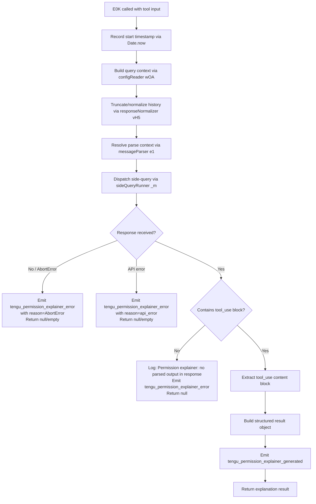

# `/explain_command`

> Analysis basis: CC v2.1.165 bundle.js (AST extraction + Claude interpretation)
> Minimum version: v2.1.165

---

## Overview

The `explain_command` tool is an internal **permission explainer** tool registered with type `tool`. When invoked, it dispatches an asynchronous AI query (via the `permission_explainer` sub-query path) that generates a human-readable explanation for why a specific tool or command requires the permissions it does. The result is extracted from the model response and returned to the caller.

---

## Registration

| Field | Value |
|---|---|
| type | `tool` |
| name | `explain_command` |
| description | `null` (not provided in registration) |
| loc_byte | `14216868` |
| loc_byte_end | `14216904` |
| loc_line | `11286` |
| arbor_handler.name | `E0K` |
| arbor_handler.fqn | `claude-2.1.165::E0K` |
| arbor_handler.kind | `AsyncFunction` |
| arbor_handler.resolution_path | `direct` |
| arbor_handler.n_hits | `1` |

Analysis basis: CC v2.1.165 bundle.js:+14216868

---

## Input Branching

The handler (`E0K`) has 4+ distinct paths depending on: whether a valid response body is obtained, whether `tool_use` content blocks are present, whether the explainer model returns parsed output, and whether the request is aborted or encounters an API error.



Analysis basis: CC v2.1.165 bundle.js:+14216563, +14216773, +14216966, +14217081, +14217193, +14217349, +14217401, +14217453, +14217563, +14217698, +14218021, +14218057, +14218092

---

## Behavioral Spec

### Main Handler — `permissionExplainerHandler` (E0K)

```
async function permissionExplainerHandler(toolInput):
    startTime = Date.now()                            // +14216587

    // 1. Build query configuration
    queryConfig = buildQueryConfig(toolInput)         // wOA, +14216563

    // 2. Normalize conversation history
    //    Filters to assistant-role messages, reverses order,
    //    truncates surrogate pairs via truncateString(ni),
    //    prepends ellipsis marker "..." if truncated,
    //    rejoins with newline
    normalizedHistory = normalizeHistory(queryConfig) // vH5, +14216626
    //    Constants: role filter = "assistant" (+14216167)
    //               max recent messages = 3 (+14216187)
    //               target length = 1000 chars (+14216132)
    //               truncation step = 2 chars (+14216088)

    // 3. Parse message context for tool identification
    parsedContext = parseMessageContext(normalizedHistory) // e1, +14216773

    // 4. Dispatch the side query to the permission_explainer sub-agent
    response = await sideQueryDispatcher(             // _m, +14216786
        queryConfig,
        parsedContext,
        { queryType: "side_query" }                   // +13461613
    )

    // 5. Validate response for tool_use content
    if response == null OR response has no "tool_use" block:  // +14217081
        log("Permission explainer: no parsed output in response") // +14217698
        emitTelemetry("tengu_permission_explainer_error")         // +14217563
        return null

    // 6. Identify tool type for MCP tools
    toolType = classifyToolType(response)             // U9, +14217401
    //    If tool name startsWith "mcp__" → toolType = "mcp_tool"  (+3210862, +3210881)
    //    Otherwise → toolType determined by hasOwn check

    // 7. Build result
    result = buildExplanationResult(response, toolType) // +14217349
    emitTelemetry("tengu_permission_explainer_generated") // +14217351

    return result

    // Error branches:
    on AbortError:                                    // +14218021
        emitTelemetry("tengu_permission_explainer_error", { reason: "AbortError" })
        return null
    on APIError:                                      // +14218092
        emitTelemetry("tengu_permission_explainer_error", { reason: "api_error" })
        return null
```

Analysis basis: CC v2.1.165 bundle.js:+14216563, +14216587, +14216626, +14216773, +14216786, +14217081, +14217193, +14217349, +14217351, +14217401, +14217453, +14217563, +14217698, +14218021, +14218092

---

### Config Reader — `buildQueryConfig` (wOA → y6)

```
function buildQueryConfig(input):
    // Reads global config (via configReader y6)
    // Validates config is accessible; throws if accessed before allowed:
    //   "Config accessed before allowed." (+3261921)
    // Reads config file as utf-8 (+3262004)
    // Parses JSON via safeJsonParse (B6 → JSON.parse, +185930)
    // Strips JSON comments via commentStripper (Ix, +3262027)
    // Classifies MCP server state using status strings:
    //   "unknown", "local", "migrated", "native", "installed" (+3257436–3257543)
    //   "disabled", "enabled", "no_permissions" (+3257562–3257602)
    //   "global", "not_configured" (+3257623, +3257642)
    // Makes backup copy timestamped with Date.now() (+3263042)
    //   via q.copyFileSync (+3263060)
    // Returns parsed config object with MCP state
    return configObject
```

Analysis basis: CC v2.1.165 bundle.js:+14216439, +3258669, +3261915, +3261921, +3262004, +3262024, +3262027

---

### History Normalizer — `normalizeHistory` (vH5)

```
function normalizeHistory(messages):
    // Filter: keep only "assistant"-role messages (+14216167)
    filtered = messages.filter(m => m.role == "assistant")  // +14216144

    // Reverse chronological order
    reversed = filtered.reverse()                           // +14216212

    // Take most recent N=3 messages (+14216187)
    recent = reversed.slice(0, 3)

    // Truncate each message text to target length
    // Uses truncateString(ni) which handles surrogate pairs:
    //   charCodeAt boundary check: 55296–56319 (+194519, +194529)
    truncated = recent.map(m => truncateString(m.text, 1000)) // +14216132, +14216355

    // Prepend "..." if any truncation occurred (+14216363)
    truncated.unshift("...")                               // +14216371

    // Join with newlines
    return truncated.join("\n")                            // +14216404
```

Analysis basis: CC v2.1.165 bundle.js:+14216144, +14216167, +14216187, +14216212, +14216355, +14216363, +14216371, +14216404

---

### Side Query Dispatcher — `sideQueryDispatcher` (_m)

```
async function sideQueryDispatcher(config, context, options):
    // Identifies the session context via sessionStore (cU → sY → CX1.getStore)
    // Sets request headers:
    //   "x-app": "cli-bg" or "cli" depending on context (+2968521, +2968530)
    //   "X-Claude-Code-Session-Id" (+2968554)
    //   "x-client-app" (+2968678)
    //   "x-claude-code-agent-id" (+2968712)
    // Resolves authentication (OAuth or API key) via authResolver (pr6)
    // Builds request payload including:
    //   - Normalized history messages
    //   - Tool definitions for "permission_explainer" tool (+14216926)
    //   - Model selection via modelSelector (Aq → opusplan/sonnet/haiku/opus/best)
    // Dispatches HTTP request via apiClient (wXL)
    // Applies byte-stream watchdog with:
    //   idle timeout = 15000 ms (+2975143)
    //   max timeout = 120000 ms (+2975161)
    // Returns streamed response or throws on failure
    response = await apiClient.send(payload)
    return response
```

Analysis basis: CC v2.1.165 bundle.js:+13461581, +13461613, +13461662, +2968521, +2968530, +2968554, +14216926, +2975143, +2975161

---

### Tool Type Classifier — `classifyToolType` (U9)

```
function classifyToolType(response):
    toolName = response.tool_use.name               // +3210849

    if toolName.startsWith("mcp__"):                // +3210862
        return "mcp_tool"                           // +3210881

    if Object.hasOwn(response, key):                // +3210793
        return resolveToolType(response)            // Hx → Nu6 (+3210840)

    return defaultToolType(response)                // W6 → Nu6 (+3210878)
```

Analysis basis: CC v2.1.165 bundle.js:+3210793, +3210840, +3210849, +3210862, +3210878, +3210881

---

## State & Side Effects

| Item | Detail |
|---|---|
| Telemetry — success | `tengu_permission_explainer_generated` (emitted when explanation is successfully extracted; +14217351) |
| Telemetry — error | `tengu_permission_explainer_error` (emitted on AbortError, api_error, or missing tool_use output; +14217563) |
| Telemetry — generate | `tengu_permission_explainer_generate` (emitted at dispatch time; +14217453) |
| Telemetry — API success | `tengu_api_success` (emitted by side-query dispatcher on HTTP 200; +13463194) |
| Telemetry — lone surrogate | `tengu_lone_surrogate_sanitized` (emitted when surrogate pairs are sanitized during history normalization; +13462943) |
| Telemetry — config error | `tengu_config_parse_error` (emitted if config JSON parse fails; +3262552) |
| Telemetry — config auth loss | `tengu_config_auth_loss_prevented` (emitted if auth data would be lost during config write; +3257126) |
| Hook registration | None found at depth-2 traversal |
| appState changes | None directly; config backup files written via `q.copyFileSync` (+3263060) |
| Config backup | Timestamped backup created in `backups/` subdirectory (+3261489, +3263042, +3263060) |
| File I/O | Config read via `q.readFileSync` utf-8 (+3261977, +3262004); directory created via `q.mkdirSync` if absent (+3262731) |
| Sound | None found at depth-2 traversal |
| Sub-query type label | `"side_query"` (+13461613), `"sideQuery"` key in payload (+13462984) |
| Content block expected | `"tool_use"` type (+14217081) |
| Tool role in sub-query | `"permission_explainer"` (+14216926) |
| Error message — no output | `"Permission explainer: no parsed output in response"` (+14217698) |
| Error — session expired | `"Cloud gateway session expired — run /login to reconnect."` (+2969595) |

---

## Version History

| Version | Change |
|---|---|
| v2.1.165 | Initial analysis |

---

## Common Mistakes

1. **Expecting a description**: The `explain_command` registration has a `null` description field. Any UI that renders command descriptions from this field will show nothing.
2. **Treating it as user-facing**: This command has type `tool` (not `prompt` or `action`), meaning it is invoked programmatically by the agent runtime, not typed directly by the user as a slash command.
3. **Assuming synchronous output**: The handler is an `AsyncFunction` (`E0K`) and dispatches a full model API call internally. Callers must `await` results and handle `AbortError` and `api_error` rejection paths.
4. **Ignoring MCP tool classification**: If the explained tool name starts with `mcp__`, the type is set to `"mcp_tool"`, not the default. Code consuming the result must check this field to render MCP-specific explanations correctly.
5. **Expecting explanation for every tool_use**: If the model response contains no `tool_use` content block, the handler logs a warning and returns `null`; callers must handle a null explanation gracefully.

---

## Appendix — Identifier Mapping

> For bundle debugging only. Identifiers change across versions.

| Identifier | Role |
|---|---|
| `E0K` | Main async handler for `explain_command` (permissionExplainerHandler) |
| `wOA` | Query config builder (wraps configReader y6) |
| `y6` | Config file reader (reads, parses, validates global config) |
| `Q6` | Config path resolver |
| `kX_` | Config path helper |
| `bDH` | Config file loader with backup logic |
| `B6` | Safe JSON parser (wraps JSON.parse) |
| `Ix` | JSON comment stripper (startsWith/slice) |
| `Or1` | Config directory reader (lists backup files) |
| `v8` | Error code classifier |
| `bX_` | Backup path builder (UD.join + a8) |
| `WTL` | File watcher / config watcher |
| `No` | Watcher notification handler |
| `j9` | Watcher hook registrar (zXA.register) |
| `NH5` | Response serializer (SH + String) |
| `SH` | JSON stringifier wrapper |
| `vH5` | History normalizer (filter, reverse, truncate, join) |
| `ni` | String truncator with surrogate-pair awareness |
| `e1` | Message context parser |
| `D6H` | Message decomposer (x0, IqH, SA, yd) |
| `Aq` | Model alias resolver (opusplan/sonnet/haiku/opus/best) |
| `eX` | Extended parse helper |
| `s6` | Request sender helper |
| `P6` | API request dispatcher |
| `_m` | Side-query dispatcher (full async agent call) |
| `cU` | API client core (session headers, auth, streaming) |
| `sY` | Session store accessor (CX1.getStore) |
| `Z9` | Context type resolver (GYH) |
| `jo` | Store accessor (We6 → uX1.getStore) |
| `S6` | Utility value accessor (uv) |
| `H5_` | URL component encoder (encodeURIComponent) |
| `eH` | String converter wrapper |
| `S3` | OAuth token manager (Bw_) |
| `Bw_` | OAuth token refresh logic (lock/retry/disk) |
| `mX1` | Boolean coercion helper |
| `zY` | Auth profile resolver (Bj, DO, Z7, SA, pX) |
| `L4` | Error builder helper |
| `Bj` | OAuth profile builder |
| `Z7` | Auth type resolver (XA) |
| `DO` | API key / auth provider dispatcher |
| `JcH` | Auth token formatter |
| `fXL` | Context flag resolver (pX, $cH) |
| `$cH` | Cache time recorder (Date.now, cu1, Uu1) |
| `U_` | Unknown/fallback auth state |
| `pr6` | Proxy auth helper runner |
| `GZH` | Proxy helper formatter |
| `D81` | Proxy helper sub-formatter |
| `Gg4` | Integer parser with NaN check |
| `ly` | Proxy credential handler |
| `tP` | Trust check helper (bTH) |
| `wXL` | HTTP API client (request build + send) |
| `XA` | First-party endpoint resolver |
| `Hf` | Request interceptor |
| `M` | Active request map |
| `rmH` | Request cleanup helper |
| `sP1` | Request sender variant (y6) |
| `Zw_` | Stream sender variant (y6) |
| `jXL` | Header inspector (authorization/anthropic-beta masking) |
| `DXL` | Response dispatcher (JK, eH, D6) |
| `zXL` | Timeout calculator (Number.isFinite, Math.min/max) |
| `YXL` | Streaming byte-watchdog (performance.now, clearTimeout, setTimeout) |
| `CD` | Cloud/Anthropic endpoint classifier |
| `AO6` | Endpoint URL builder (XA) |
| `z8L` | URL prefix checker |
| `ps6` | Provider string normalizer (toLowerCase) |
| `LY` | Proxy configuration resolver |
| `Ed` | URL parser (split, toLowerCase, includes, startsWith, substring) |
| `GFH` | Proxy credential builder (pR, JU) |
| `w81` | Proxy auth string builder |
| `e9_` | IP/host validator |
| `Aq_` | Bypass list checker |
| `MXL` | Request payload builder |
| `PA8` | Payload assembler (Y2, e1, t1, pv) |
| `pv` | Parameter validator |
| `YpH` | Request options helper |
| `OEH` | Agent context resolver |
| `U1` | URL validator / environment checker |
| `VYH` | Gateway token refresher |
| `$Q8` | Token cache accessor |
| `d9L` | Gateway refresh HTTP caller (rP.post) |
| `Rm6` | Token cache writer |
| `MQ8` | Timestamp helper (Date.now) |
| `lD6` | Header normalizer (Object.entries, toLowerCase) |
| `jDH` | SDK error logger (console.error) |
| `S` | Supervisor write forwarder |
| `Y` | TTY/output writer |
| `h` | Background session health sweep |
| `I` | Session state container |
| `d` | Session scheduler / grace clock manager |
| `lR6` | Memory reporter (vb8, EfK.freemem) |
| `TfK` | Memory threshold calculator (D6) |
| `zX6` | Config file reloader (I2.readFile, B6) |
| `kH` | Logger / diagnostics emitter |
| `__` | Utility wrapper (_) |
| `l` | MCP server lifecycle handler (Wh6, AFq) |
| `Ib8` | Metric recorder (D6) |
| `D6` | Event dispatcher / telemetry router |
| `r` | MCP reconnect / respawn handler |
| `y` | Away-summary runner |
| `pZ8` | App state reader (dF.getState) |
| `Fq5` | Cache params builder (CzA) |
| `_kK` | Rate limit checker |
| `V` | Draft input checker |
| `cO8` | Away-summary model caller |
| `RH` | Response handler (c, P6) |
| `sRq` | UUID generator (pk.randomUUID) |
| `Q` | Output queue / flush timer |
| `hH` | Warning response handler (c, P6) |
| `T` | Task scheduler |
| `NW` | Nested workflow runner (DO) |
| `vYH` | WIF credentials resolver |
| `BQH` | WIF token exchange HTTP caller |
| `e9L` | WIF error classifier |
| `E` | Event / key handler |
| `b` | Key event emitter |
| `t0` | User settings reader (r_) |
| `X` | IPC socket reader (Buffer.concat) |
| `J` | Socket/process connector |
| `J5` | Socket writer helper |
| `T55` | Daemon session handler (main loop) |
| `Z55` | Stream helper |
| `K` | Column formatter (L.map, padEnd) |
| `Wz` | Theme resolver (SDH) |
| `IDA` | Identity helper |
| `QuK` | Protocol message dispatcher (J5, kH) |
| `l8` | Async lock / retry helper |
| `P` | Terminal repaint manager |
| `e9` | File state tracker (I2.stat, I2.readFile) |
| `yK` | Path joiner helper (k2.join, cE) |
| `kHH` | Context path scanner (AY, Vr) |
| `G55` | Geometry calculator (D6, Math.max) |
| `p` | Pending write flusher |
| `$9H` | Heartbeat helper |
| `E55` | Session lifecycle manager (e9, yK, kHH, GK6.rm) |
| `n` | Voice/recording controller |
| `x` | Interval cleaner (clearInterval) |
| `s` | MCP connection batch manager |
| `G` | Worker group manager (sk6, XK6) |
| `Rx6` | Socket write helper (H.write, SH) |
| `W` | Worker pool launcher (XK6, IS, Ck) |
| `EH` | String coercion helper |
| `TNH` | Model compatibility checker (t1, CD, ny) |
| `t1` | Model name normalizer (Bs6, tX, uj) |
| `Bs6` | Model header builder (Object.entries) |
| `tX` | Model string transformer (toLowerCase, replace) |
| `cQ8` | Capability query helper |
| `ny` | Endpoint type resolver (XA) |
| `wdf` | Message finder (H.find, A.find) |
| `l5A` | Hash generator (A3K.createHash) |
| `Ee6` | Token header builder (JK, XA, We6, sY) |
| `JK` | String coercion helper |
| `tf_` | Token formatter |
| `qq8` | Context resolver (XA) |
| `nyH` | System prompt builder (eH, XA, ZA, D6) |
| `ZA` | Sub-agent config resolver (zY, nR, n1) |
| `nR` | Array inclusion checker |
| `FQ8` | Prompt flag helper |
| `gQ8` | Prompt section builder |
| `cV` | HIPAA filter (Rw_, ENH) |
| `Rw_` | XA-based filter |
| `ENH` | HIPAA string tester (gf_) |
| `gf_` | Sensitive string list checker |
| `b3K` | Message batch builder |
| `hA8` | Tool message assembler (Jo, t1) |
| `$2` | Message mapper (H.map) |
| `iwH` | Tool invocation wrapper (m9, oU, SH) |
| `oU` | Subprocess spawner (zr1.randomBytes, X8) |
| `X8` | Tool execution runner (bDH, fj6) |
| `hL` | Tool lifecycle helper (zY, y6) |
| `m2A` | Message array popper |
| `ap6` | Message append helper (b2A, UcK.test) |
| `jW` | Structured clone wrapper |
| `tp6` | Message array pusher |
| `u2A` | Text replacement helper (x2A) |
| `N3H` | Telemetry payload builder |
| `h1` | Nu6 caller |
| `Nu6` | Core utility / base helper |
| `p26` | Agent router (Gj9, OoH, m26) |
| `Gj9` | Builtin agent dispatcher (ssL, kH) |
| `ssL` | Agent set membership checker (Xj9.has, GK, N$8.has) |
| `OoH` | Custom agent resolver (Hx) |
| `Hx` | Nu6 indirect caller |
| `m26` | Agent path builder (OoH, Z$8) |
| `Z$8` | Agent hash creator (jj9.createHash) |
| `Kl` | Agent prefix classifier (asL, E_H, kH) |
| `asL` | Agent path parser (Tv_, V$8, E_H) |
| `V$8` | Path variant resolver (Tv_) |
| `Tv_` | Path indexer (H.indexOf, H.slice) |
| `E_H` | Path prefix tester (H.startsWith) |
| `N46` | Unknown utility at tail of _m |
| `U9` | Tool type classifier (Object.hasOwn, mcp__ prefix check) |
| `W6` | Default tool type resolver (Nu6) |
| `VH5` | Response shape builder |