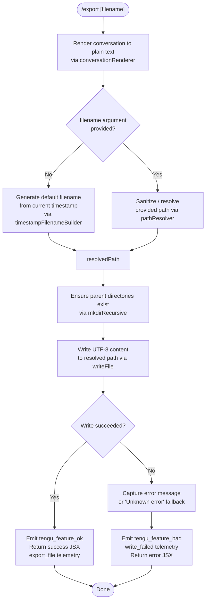

# `/export`

> Analysis basis: CC v2.1.165 bundle.js (AST extraction + Claude interpretation)
> Minimum version: v2.1.165

---

## Overview

The `/export` command serializes the current conversation (messages, tool outputs, etc.) into a structured text representation and writes it to a file on disk. An optional filename argument controls the output path; when omitted, the command derives a default filename from the current timestamp. The command is implemented as an async handler (`RCf`) registered under module `U9K`.

---

## Registration

| Field | Value |
|---|---|
| type | `local-jsx` |
| name | `export` |
| description | Export the current conversation to a file or clipboard |
| argumentHint | `[filename]` |
| module_id | `U9K` |
| load_inline | `true` |
| loc_byte | `12661515` |
| loc_byte_end | `12661711` |
| loc_line | `9069` |
| arbor_handler.name | `RCf` |
| arbor_handler.fqn | `claude-2.1.165::RCf` |
| arbor_handler.kind | `AsyncFunction` |
| arbor_handler.resolution_path | `module_id` |
| arbor_handler.n_hits | `0` |

Analysis basis: CC v2.1.165 bundle.js:+12661515

---

## Input Branching

Five or more distinct execution paths exist (file write success, file write failure, timestamp-derived default filename, caller-supplied filename, clipboard path, and various inner error states), so a Mermaid flowchart is used.



Analysis basis: CC v2.1.165 bundle.js:+12660987, +12661059, +12661157

---

## Behavioral Spec

### 1. Entry Point — `exportCommandHandler` (`RCf`)

The handler is an `AsyncFunction` resolved via `module_id → U9K → RCf`.

```
async function exportCommandHandler(context):
    rawText = renderConversationToText(context.messages)    // SCf → IC8 → yCf
    trimmedArg = context.argument.trim()                    // RCf:+12660956

    if trimmedArg is non-empty:
        resolvedPath = resolveOutputPath(trimmedArg)        // vC8 → NCf → Z1
    else:
        resolvedPath = buildTimestampFilename(context)      // hCf

    try:
        ensureDirectoryExists(dirname(resolvedPath))        // vC8 → VC8.mkdir
        writeFileUTF8(resolvedPath, rawText)                // vC8 → VC8.writeFile (encoding "utf-8")
        emit telemetry("export_file")
        return successUI(resolvedPath)                      // hH → tengu_feature_ok
    catch error:
        msg = error.message ?? "Unknown error"              // literal :+12661157
        emit telemetry("write_failed")                      // :+12661076
        return errorUI(msg)                                 // RH → tengu_feature_bad
```

Analysis basis: CC v2.1.165 bundle.js:+12660947, +12660987, +12661059, +12661194

---

### 2. Conversation Renderer — `conversationToText` (`SCf` → `IC8` → `yCf`)

Iterates over the message array and serializes each entry to a plain-text buffer.

```
function conversationToText(messages):
    lines = []
    for each message in messages:
        role = message.role            // "user" | "assistant" literals :+12660450, :+12659079
        contentBlocks = extractTextBlocks(message)   // yCf → kCf (Array.isArray check :+12659219)
        for each block in contentBlocks:
            stripped = stripANSI(block.text)         // b4 → Bun.stripANSI :+3840366
            lines.push(formatBlock(role, stripped))
    return lines.join("")              // IC8 → q.join :+12659966
```

- The renderer checks whether a message's content is an array (literal `"message"` :+12659164).
- It handles both `"export"` and `"prompt"` content-type markers (literals :+12659625, :+12659641).
- ANSI escape codes are stripped before writing via `Bun.stripANSI` (Analysis basis: CC v2.1.165 bundle.js:+3840366).
- Messages are limited to the most recent 50/49 entries during extraction (literals :+12660668, :+12660687 within `messageExtractor` `m9K`).

Analysis basis: CC v2.1.165 bundle.js:+12660891, +12659921, +12659855

---

### 3. Message Extractor — `messageExtractor` (`m9K`)

```
function messageExtractor(conversationState):
    userMessages = conversationState.find(role == "user")     // H.find :+12660429
    trimmed = userMessages.trim()                             // A.trim :+12660545
    if Array.isArray(trimmed):
        textBlock = trimmed.find(type == "text")              // A.find :+12660586
    truncated = textBlock.substring(0, 50)                    // q.substring :+12660673
                                                               // (limit 49 chars: :+12660687)
    return formatMessageEntry(truncated)                      // iL → Q1
```

Analysis basis: CC v2.1.165 bundle.js:+12660429, +12660562, +12660673

---

### 4. Path Resolver — `pathResolver` (`NCf` → `Z1`)

```
function resolveOutputPath(rawPath):
    ext = path.extname(rawPath)                    // NC8.extname :+12656342
    validated = validateAndNormalizePath(rawPath)  // Z1 :+12656382

    // Z1 performs the following checks:
    if rawPath contains null bytes:
        throw Error("Path contains null bytes")    // literal :+1052993
    normalized = NFC_normalize(rawPath)            // "NFC" :+177636
    if rawPath starts with "~/":
        rawPath = join(homedir(), rawPath[2:])     // id6.homedir :+1053090, "~/" :+1053121
    if not isAbsolute(rawPath):
        rawPath = path.resolve(cwd, rawPath)       // iv.resolve :+1053304

    return rawPath
```

Analysis basis: CC v2.1.165 bundle.js:+12656342, +12656382, +1052993, +1053090

---

### 5. Timestamp Filename Builder — `timestampFilenameBuilder` (`hCf`)

```
function buildTimestampFilename(now = new Date()):
    year   = String(now.getFullYear())                       // :+12660155
    month  = zeroPad(now.getMonth() + 1)                     // :+12660180
    day    = zeroPad(now.getDate())                          // :+12660221
    hours  = zeroPad(now.getHours())                         // :+12660259
    mins   = zeroPad(now.getMinutes())                       // :+12660298
    secs   = zeroPad(now.getSeconds())                       // :+12660339
    return "claude-export-{year}{month}{day}-{hours}{mins}{secs}.txt"
```

The `.txt` extension is confirmed by literal `".txt"` at bundle.js:+205021.

Analysis basis: CC v2.1.165 bundle.js:+12660155, +12661212

---

### 6. File Write Pipeline — `fileWriter` (`vC8`)

```
async function fileWriter(resolvedPath, content):
    dir = path.dirname(resolvedPath)          // NC8.dirname :+12656448
    await fs.mkdir(dir, {recursive: true})    // VC8.mkdir :+12656438
    await fs.writeFile(resolvedPath, content, {encoding: "utf-8"})
                                               // VC8.writeFile :+12656485, "utf-8" :+12656513
```

Analysis basis: CC v2.1.165 bundle.js:+12656438, +12656485, +12656513

---

### 7. Argument Format Normalizer — `argumentNormalizer` (`p9K`)

```
function normalizeArgument(rawArg):
    return rawArg.toLowerCase()    // H.toLowerCase :+12660732
```

Called before path resolution to canonicalize the user-supplied filename fragment.

Analysis basis: CC v2.1.165 bundle.js:+12660732

---

### 8. Success / Error UI Components — `successUI` (`hH`) and `errorUI` (`RH`)

Both are thin JSX wrapper functions that delegate to a shared component builder (`c`, `P6`) and route telemetry:

- `hH` → emits `tengu_feature_ok` (bundle.js:+1010222)
- `RH` → emits `tengu_feature_bad` (bundle.js:+1010284)
- `s6` (used elsewhere in the call graph) → emits `tengu_feature_sad` (bundle.js:+1010365)

Analysis basis: CC v2.1.165 bundle.js:+1010220, +1010282

---

## State & Side Effects

| Item | Detail |
|---|---|
| Telemetry — `tengu_feature_ok` | Fired on successful file write (bundle.js:+1010222) |
| Telemetry — `tengu_feature_bad` | Fired when file write fails; accompanied by `write_failed` label (bundle.js:+1010284, +12661076) |
| Telemetry — `tengu_feature_sad` | Fired on an alternative sad-path (bundle.js:+1010365) |
| Named event — `export_file` | Embedded in the success telemetry payload (bundle.js:+12660999) |
| Named event — `write_failed` | Embedded in the failure telemetry payload (bundle.js:+12661076) |
| File system — `mkdir` | Creates parent directories recursively before writing (bundle.js:+12656438) |
| File system — `writeFile` | Writes UTF-8 encoded plain text to the resolved output path (bundle.js:+12656485) |
| ANSI stripping | All ANSI escape sequences are removed from message content before serialization (bundle.js:+3840366) |
| appState changes | <!-- TODO: not found in depth-2 traversal; needs --depth 4 --> |
| Sound | <!-- TODO: not found in depth-2 traversal; needs --depth 4 --> |
| Hook registration | `j9 → zXA.register` observed in call graph (bundle.js:+60323); likely registers a cleanup or exit hook |
| Clipboard | Description mentions clipboard as a target; direct clipboard write path not confirmed in depth-2 traversal — <!-- TODO: not found in depth-2 traversal; needs --depth 4 --> |

---

## Version History

| Version | Change |
|---|---|
| v2.1.165 | Initial analysis |

---

## Common Mistakes

1. **Omitting the file extension**: The command accepts an optional `[filename]` argument. If no extension is provided, the path resolver uses the supplied name as-is; the auto-generated default always appends `.txt`. Supplying a path without an extension may produce an extensionless file.

2. **Relative paths without context**: When a relative path is supplied, it is resolved against the current working directory at invocation time. Running `/export` from an unexpected working directory may write the file to an unintended location.

3. **Tilde expansion scope**: Paths beginning with `~/` are expanded to the OS home directory (via `os.homedir()`). Paths beginning with `~username/` are **not** handled by this expansion and will be treated as literal relative paths.

4. **Large conversations**: The message extractor truncates individual message text to approximately 50 characters (literals `50` and `49` at bundle.js:+12660668, +12660687) for internal identification purposes. The full content is still serialized by the renderer; only the identification/preview step is truncated.

5. **Null bytes in filename**: Supplying a filename containing null bytes causes an immediate `Error("Path contains null bytes")` before any file I/O is attempted (bundle.js:+1052993).

6. **Directory targets**: If the resolved path is an existing directory rather than a file, the write will fail with an `EISDIR` error (literal `"EISDIR"` at bundle.js:+175646). The error is caught, and the `write_failed` telemetry event is emitted along with an error message in the UI.

---

## Appendix — Identifier Mapping

> For bundle debugging only. Identifiers change across versions.

| Identifier | Role |
|---|---|
| `RCf` | Main async export command handler (`exportCommandHandler`) |
| `SCf` | Conversation-to-text serialization entry point |
| `IC8` | Inner message block collector / line joiner |
| `yCf` | Per-message content renderer |
| `ICf` | Content type discriminator helper |
| `kCf` | Array-check guard for message content blocks |
| `vC8` | File write pipeline (mkdir + writeFile) |
| `NCf` | Path extension extractor + path validator entry |
| `Z1` | Path normalization and resolution (NFC, tilde, absolute) |
| `hCf` | Timestamp-based default filename builder |
| `m9K` | Message extractor (role filter + text truncation) |
| `p9K` | Argument format normalizer (toLowerCase) |
| `hH` | Success UI component wrapper (emits `tengu_feature_ok`) |
| `RH` | Error UI component wrapper (emits `tengu_feature_bad`) |
| `s6` | Alternative sad-path UI wrapper (emits `tengu_feature_sad`) |
| `b4` | ANSI escape code stripper (delegates to `Bun.stripANSI`) |
| `iL` | Message entry formatter |
| `Q1` | Text block index/slice helper |
| `acK` | File append / streaming write subsystem |
| `ocK` | Chunked append handler (mkdir + appendFile loop) |
| `a2A` | Atomic file rename helper (stat + rename + unlink) |
| `s2A` | Path join + stream helper |
| `aL6` | EISDIR error classifier |
| `d3H` | Clipboard or secondary output path handler |
| `$pH` | Buffered async writer with timeout/immediate scheduling |
| `Gl` | Conversation context / plan-mode resolver |
| `yeH` | Stream event listener and JSX element creator |
| `Aq` | Model name normalizer (lowercase + alias resolution) |
| `MO` | Path NFC normalizer |
| `j9` | Exit/cleanup hook registrar (`zXA.register`) |
| `e1` | Conversation message formatter |
| `D6H` | Message entry builder |
| `yd` | Message content parser |
| `eX` | Extended content parser with role context |
| `r0` | Multi-format content block renderer |
| `Gw_` | Argument string parser (split/trim/indexOf/slice) |
| `ZHH` | Cache/set membership checker |
| `uj` | Text replacement sanitizer |
| `wI` | Model tier classifier |
| `NQH` | Model variant resolver (Z5 branch) |
| `NE` | Model family discriminator |
| `SX1` | Model selection wrapper |
| `gM` | Provider type resolver |
| `Pe6` | Plan-mode inclusion checker |
| `vQH` | Error handler wrapper |
| `o0` | Model name lookup helper |
| `_4H` | Model name inclusion checker |
| `P6` | UI component builder |
| `Nu6` | Core UI primitive |
| `c2A` | Message map transformer |
| `C2A` | Stream write helper |
| `ppH` | Write dispatcher |
| `Q6` | Path utility helper |
| `e$` | Session/state accessor |
| `b6` | Path resolution helper (bd6 + X_) |
| `Bs6` | Metadata tag helper |
| `VQH` | Value query helper |
| `hX1` | Content header builder |
| `l1L` | List formatter |
| `n1L` | Nested list formatter |
| `IqH` | Message ID helper |
| `SA` | String accumulator |
| `x0` | Content prefix formatter |

---

Note: index built via Arbor fallback; some signals (telemetry, literals) may be missing — see arbor-fallback.js.