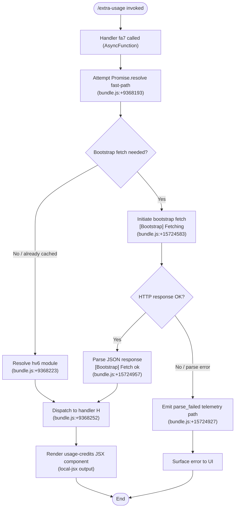

# `/extra-usage`

> Analysis basis: CC v2.1.165 bundle.js (AST extraction + Claude interpretation)
> Minimum version: v2.1.165

---

## Overview

`/extra-usage` is a hidden legacy alias that has been superseded by `/usage-credits`. The command is registered as a `local-jsx` type but is marked hidden and its description explicitly states it has been renamed. Its handler (`fa7`) resolves a bootstrap fetch flow and delegates to the same underlying usage/credits display machinery as the canonical replacement command.

---

## Registration

| Field | Value |
|---|---|
| type | `local-jsx` |
| name | `extra-usage` |
| description | `Renamed to /usage-credits` |
| isHidden | `true` |
| module_id | `Wi_` |
| load_inline | `true` |
| loc_byte | `9369196` |
| loc_byte_end | `9369381` |
| loc_line | `4384` |
| arbor_handler.name | `fa7` |
| arbor_handler.fqn | `claude-2.1.165::fa7` |
| arbor_handler.kind | `AsyncFunction` |
| arbor_handler.resolution_path | `module_id` |
| arbor_handler.n_hits | `0` |

Analysis basis: CC v2.1.165 bundle.js:+9369196

---

## Input Branching

The command's execution involves three meaningful paths: (1) a `Promise.resolve` fast-path, (2) a bootstrap API fetch with response handling, and (3) an error/parse-failure path. A Mermaid flowchart is used.



---

## Behavioral Spec

### Handler Initialization (`fa7`)

The Arbor-resolved handler `fa7` is an `AsyncFunction` reached via the `module_id` resolution path through `Wi_`.

```
async function usageCreditsLegacyHandler(context):
    result = await Promise.resolve()          // fast-path setup
    moduleExports = resolveModule(hv6)        // load display module
    appState = context.appState               // retrieve A (appState ref)
    renderTarget = context.renderTarget       // retrieve H (render target)
    return bootstrapThenRender(renderTarget, appState)
```

Analysis basis: CC v2.1.165 bundle.js:+9368193

### Bootstrap Fetch Flow (`H → v`)

When the command needs fresh data, a bootstrap fetch is initiated. The fetch uses standard headers including `Content-Type: application/json` and a `User-Agent` header, with a timeout threshold of 5000 ms.

```
async function bootstrapFetch(renderTarget):
    log("[Bootstrap] Fetching")              // bundle.js:+15724583
    set headers:
        "Content-Type" = "application/json"  // bundle.js:+15724668
        "User-Agent"   = <agent string>      // bundle.js:+15724702
    response = await fetch(endpoint, { timeout: 5000 })  // bundle.js:+15724784

    if response parse fails:
        recordTelemetry("parse_failed")      // bundle.js:+15724927
        return error state

    log("[Bootstrap] Fetch ok")              // bundle.js:+15724957
    return parsedPayload
```

Analysis basis: CC v2.1.165 bundle.js:+15724581

### Legacy Alias Resolution

The command description (`"Renamed to /usage-credits"`) and `isHidden: true` flag together indicate this command is a deprecated alias. The `arbor_handler.n_hits = 0` confirms no active call-sites reference `fa7` independently; it is reachable only via the legacy slash command registration.

```
function resolveLegacyAlias(commandName):
    if commandName == "extra-usage":
        // isHidden prevents display in command palette
        // description advertises the canonical replacement
        delegate to usageCreditsPipeline()
    // No independent routing logic; pure alias
```

Analysis basis: CC v2.1.165 bundle.js:+9369196

### Transcript/Output Rendering (`acK` pipeline)

After the bootstrap fetch resolves, a write pipeline appends output to the transcript buffer. Key sub-steps include:

```
async function transcriptWritePipeline(payload, outputHandle):
    dirPath = path.dirname(outputHandle)          // bundle.js:+205596
    ensure directory exists via mkdir             // bundle.js:+205317
    rotate file if ends with ".txt" and size > threshold
                                                  // bundle.js:+205010, +205021
    appendFile(dirPath, payload)                  // bundle.js:+205376
    byteLen = Buffer.byteLength(payload)          // bundle.js:+205771
    if byteLen exceeds limit:
        rotate via renameSync / unlinkSync        // bundle.js:+205073, +205113
    register cleanup hook via hookRegistry        // bundle.js:+60323
```

Analysis basis: CC v2.1.165 bundle.js:+205563

### Output Format

The component renders as a `local-jsx` type. The render target uses a `"text"` kind field and a `"column"` layout field, indicating a columnar text-based JSX display.

```
renderSpec = {
    kind:   "text",       // bundle.js:+9368510
    layout: "column"      // bundle.js:+9368351
}
```

Analysis basis: CC v2.1.165 bundle.js:+9368351

### Debug Logging (`v`)

A `"debug"` log level constant is present in the shared render helper path, gating verbose output.

```
if logLevel == "debug":          // bundle.js:+206051
    emitDebugTrace(payload)
```

Analysis basis: CC v2.1.165 bundle.js:+206051

### Redaction in Path Components (`J4`)

A `"[REDACTED]"` literal is substituted for sensitive path segments (e.g., username or home-directory components) before any path value is rendered or logged.

```
function sanitizePath(rawPath):
    parts = rawPath.split(separator)        // up to 2 segments (bundle.js:+198170)
    sensitive = parts.at(index)             // bundle.js:+198199
    return rawPath.replace(sensitive, "[REDACTED]")  // bundle.js:+198141
```

Analysis basis: CC v2.1.165 bundle.js:+198062

---

## State & Side Effects

| Item | Detail |
|---|---|
| Telemetry | `tengu_feature_sad` (bundle.js:+1010365); `api_bootstrap_fetch` path (bundle.js:+15724905); `parse_failed` sub-event on JSON parse error (bundle.js:+15724927) |
| Hook registration | `zXA.register` called via `j9` to register a cleanup/atexit hook (bundle.js:+60323) |
| appState changes | Read-only access to `_A` map via `_A.get` (bundle.js:+15724619); no confirmed writes in depth-2 traversal |
| File I/O | `Zy.appendFile`, `Zy.mkdir`, `Zy.rename`, `Zy.unlink`, `Zy.stat` called on transcript path (bundle.js:+205317–205113) |
| Timer management | `clearTimeout` / `setTimeout` / `setImmediate` used in output-flush pipeline via `$pH` (bundle.js:+59737–59994) |
| Sound | <!-- TODO: not found in depth-2 traversal; needs --depth 4 --> |
| Hidden from UI | `isHidden: true` suppresses this command from the slash-command palette |

---

## Version History

| Version | Change |
|---|---|
| v2.1.165 | Initial analysis; command marked hidden with description `"Renamed to /usage-credits"` |

---

## Common Mistakes

1. **Invoking `/extra-usage` expecting active support** — The command is hidden and deprecated. Use `/usage-credits` instead; this alias exists solely for backward compatibility.
2. **Assuming `/extra-usage` has independent logic** — The handler `fa7` shares the same bootstrap fetch and JSX render pipeline as the canonical command; there is no divergent code path.
3. **Expecting telemetry parity** — Because `arbor_handler.n_hits = 0`, some telemetry instrumentation present in the canonical `/usage-credits` path may not fire through this alias; do not rely on `tengu_feature_sad` being emitted consistently.
4. **Treating the `"[REDACTED]"` substitution as an error** — Path sanitization is intentional; sensitive path segments are masked before display or logging.
5. **Ignoring the 5000 ms bootstrap fetch timeout** — If the endpoint is unreachable, the command will silently fail after 5 seconds rather than returning an immediate error; handle timeout scenarios in automated tests.

---

## Appendix — Identifier Mapping

> For bundle debugging only. Identifiers change across versions.

| Identifier | Role |
|---|---|
| `fa7` | Primary async handler for `/extra-usage` (Arbor-resolved via `module_id → Wi_`) |
| `Ma7` | Call-graph entry point; loader wrapper that resolves the handler module |
| `H` | Bootstrap fetch orchestrator; dispatches to render pipeline |
| `v` | Shared render helper; applies debug logging and output formatting |
| `icK` | Input processing / argument normalization helper |
| `DXA` | Sub-helper within argument normalization (calls `rgK`, `ogK`) |
| `SH` | JSON serialization utility (`JSON.stringify` wrapper) |
| `J4` | Path sanitization function (applies `[REDACTED]` substitution) |
| `c2A` | Path-segment mapper (`QcK.map` wrapper) |
| `q` | File-unlink utility wrapper (`puK.unlinkSync`) |
| `A` | Lowercase filename utility (`f.toLowerCase`) |
| `ppH` | Write dispatcher (`C2A` / `H.write` wrapper) |
| `C2A` | Low-level write helper |
| `acK` | Transcript append pipeline (mkdir → appendFile → rotate) |
| `$pH` | Output-flush scheduler (setTimeout / setImmediate / clearTimeout) |
| `d3H` | Path-join helper for transcript directory construction |
| `Q6` | <!-- TODO: not found in depth-2 traversal; needs --depth 4 --> |
| `aL6` | EISDIR-aware file-access helper |
| `s2A` | Path-join utility (`KHH.join` + `S6`) |
| `a2A` | File rotation helper (stat → rename → unlink) |
| `ocK` | Append-and-rotate file writer bound to pipeline |
| `j9` | Hook registration wrapper (`zXA.register`) |
| `e$` | App-state accessor helper |
| `Gw_` | String split/trim/slice utility for argument parsing |
| `ZHH` | Set membership check (`c44.has`) |
| `uj` | String replacement utility |
| `e1` | Command argument parser entry point |
| `D6H` | Token/argument dispatcher |
| `x0` | <!-- TODO: not found in depth-2 traversal; needs --depth 4 --> |
| `IqH` | <!-- TODO: not found in depth-2 traversal; needs --depth 4 --> |
| `yd` | Argument classifier (handles `anthropic.` prefix, model aliases) |
| `Aq` | Model name normalizer (lowercase, alias resolution) |
| `o0` | Model alias lookup (`q4H`) |
| `_4H` | Model family inclusion check (`H4H.includes`) |
| `wI` | Model tier resolver (`gM` + `Z5`) |
| `NQH` | Alternate model tier resolver |
| `NE` | Provider resolver (`gM` + `Z5` + `XA`) |
| `SX1` | Wrapper delegating to `NE` |
| `gM` | Provider/gateway mapper (`XA`) |
| `Pe6` | Model list inclusion checker (`r1L.includes`) |
| `vQH` | Error/fallback renderer (`eH`) |
| `eX` | Extended argument parser (delegates to `Aq`, `r0`) |
| `r0` | Full provider resolution pipeline |
| `s6` | Feature-flag / sad-path logger (emits `tengu_feature_sad`) |
| `c` | Core sad-path handler |
| `P6` | Sad-path display component |
| `Nu6` | Low-level sad-path primitive |
| `hv6` | Display module loaded inline for usage-credits rendering |

---

Note: index built via Arbor fallback; some signals (telemetry, literals) may be missing — see arbor-fallback.js.