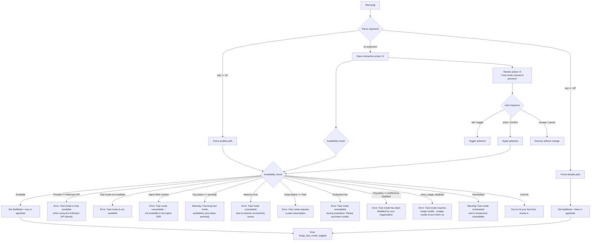

# `/fast`

> Analysis basis: CC v2.1.165 bundle.js (AST extraction + Claude interpretation)
> Minimum version: v2.1.165

---

## Overview

The `/fast` command toggles **Fast mode** — a research-preview capability that routes inference through a higher-throughput path. When invoked without an argument the command shows an interactive picker UI; when invoked with `on` or `off` it applies the change immediately. Availability is gated by API provider, subscription tier, and org-level policy, all of which are checked before the state is committed.

---

## Registration

| Field | Value |
|---|---|
| type | `local-jsx` |
| name | `fast` |
| description | `Toggle fast mode ( ... )` |
| argumentHint | `[on\|off]` |
| thinClientDispatch | `control-request` |
| immediate | `null` |
| isHidden | `null` |
| load_inline | `true` |
| module_id | `r6K` |
| loc_byte | `12420595` |
| loc_byte_end | `12420867` |
| loc_line | `8829` |
| arbor_handler.name | `tyf` |
| arbor_handler.fqn | `claude-2.1.165::tyf` |
| arbor_handler.kind | `AsyncFunction` |
| arbor_handler.resolution_path | `module_id` |
| arbor_handler.n_hits | `3` |

Analysis basis: CC v2.1.165 bundle.js:+12420595

---

## Input Branching

Six or more distinct cases are handled depending on the argument and availability state, so a flowchart is mandatory.



Analysis basis: CC v2.1.165 bundle.js:+12419629, +2228443, +2228475, +2228543, +2228740, +2228902, +12419854

---

## Behavioral Spec

### 1. Handler Entry Point (`tyf`)

The Arbor-resolved handler is `tyf` (an `AsyncFunction`), reached via `module_id → r6K`.

```
async function fastCommandHandler(args, appState):
    argument = parseArgument(args)           // sK  — +12419629
    availabilityResult = checkAvailability(appState)  // H  — +12419641
    renderResult = buildRenderOutput(availabilityResult, argument, appState)  // $6H — +12419643
    prefetchIfNeeded(appState)               // ZQH — +12419691
    uiComponent = buildJSXComponent(renderResult, availabilityResult)  // rR8 — +12419763
    emitTelemetry("tengu_fast_mode_picker_shown")  // +12419854
    return uiComponent
```

Analysis basis: CC v2.1.165 bundle.js:+12419629

---

### 2. Argument Parsing (`sK`)

```
function parseArgument(rawInput):
    normalized = rawInput.trim().toLowerCase()
    if normalized in ["yes", "on"]:   // literals +27104, +27110
        return "on"
    if normalized == "off":            // literal +12419744
        return "off"
    return null   // triggers picker UI
```

The truthy set is `{ "yes", "on" }` — both are accepted for enabling fast mode.

Analysis basis: CC v2.1.165 bundle.js:+12419629, +27104, +27110

---

### 3. Availability Check (`$6H` → provider / subscription / org guards)

```
function checkAvailability(appState):

    // Provider guard
    if apiProvider not in ["anthropic", "firstParty"]:
        // literal: "Fast mode is only available when using the Anthropic API directly"
        return { available: false, reason: "provider", message: ... }  // +2228475

    // Agent SDK guard
    if runningInAgentSDK():
        // literal: "Fast mode is not available in the Agent SDK"  +2228810
        return { available: false, reason: "sdk", message: ... }

    // Org status pending
    if orgStatus == "pending":
        // literal: "Checking fast mode availability (org status pending)"  +2228981
        return { available: false, reason: "pending", message: ... }

    // Network error
    if lastFetchStatus == "network_error":
        // literal: "Fast mode unavailable due to network connectivity issues"  +2228307
        return { available: false, reason: "network_error", message: ... }

    // Subscription tier
    if subscriptionTier == "free":
        // literal: "Fast mode requires a paid subscription"  +2227994
        return { available: false, reason: "free", message: ... }

    if subscriptionTier == "evaluation":
        // literal: "Fast mode unavailable during evaluation. Please purchase credits."  +2228035
        return { available: false, reason: "evaluation", message: ... }

    // Org policy
    if orgPolicy == "preference" and policyDisabled:
        // literal: "Fast mode has been disabled by your organization"  +2228126
        return { available: false, reason: "preference", message: ... }

    if orgPolicy == "extra_usage_disabled":
        // literal: "Fast mode requires usage credits · /usage-credits to turn them on"  +2228210
        return { available: false, reason: "extra_usage_disabled", message: ... }

    // Transient overload / limit
    if fastModeStatus == "overloaded":
        // literal: "Fast mode overloaded and is temporarily unavailable"  +12418838
        return { available: false, reason: "overloaded", message: ... }

    if rateLimitResetMs > 0:
        // literal: "You've hit your fast limit · resets in "  +12418892
        return { available: false, reason: "rate_limit", resetIn: formatDuration(rateLimitResetMs) }

    return { available: true }
```

Analysis basis: CC v2.1.165 bundle.js:+2228443, +2228475, +2228543, +2228740, +2228810, +2228902, +2229065

---

### 4. State Toggle (`rR8` / `oR8`)

```
function applyToggle(argument, availabilityResult, appState):
    if argument == "off":
        appState.fastMode = false
        // literal: "Fast mode OFF"  +12416259
        emitTelemetry("tengu_fast_mode_toggled", { newState: false })
        return

    if argument == "on" or userConfirmedViaUI:
        if availabilityResult.available:
            appState.fastMode = true
            emitTelemetry("tengu_fast_mode_toggled", { newState: true })
        else:
            displayError(availabilityResult.message)

    // "Kept Fast mode OFF" path when user exits picker without changing
    // literal: "Kept Fast mode OFF"  +12417285
```

Analysis basis: CC v2.1.165 bundle.js:+12416030, +12416259, +12417285

---

### 5. Prefetch Logic (`ZQH` / `nf_`)

The handler triggers an async prefetch of fast-mode availability data before rendering the UI.

```
async function prefetchFastModeAvailability(appState):
    if inFlightPrefetchPromise != null:
        log("Fast mode prefetch in progress, returning in-flight promise")  // +2232250
        return inFlightPrefetchPromise

    if lastFetchTimestamp + threshold > now:
        log("Skipping fast mode prefetch, fetched recently")  // +2232497
        return

    inFlightPrefetchPromise = fetchOrgStatus(authContext)
    try:
        result = await inFlightPrefetchPromise
        updateAvailabilityCache(result)
    catch NetworkError:
        setAvailabilityStatus("network_error")  // +2229065
        emitTelemetry("tengu_org_penguin_mode_fetch_failed")
    catch AuthError:  // 401 / 403  (+2232808, +2232834)
        log("No auth available")  // +2232673
    finally:
        inFlightPrefetchPromise = null
```

Analysis basis: CC v2.1.165 bundle.js:+12419691, +2232161, +2232250, +2232497, +2232673

---

### 6. Interactive Picker UI (`oR8` JSX component)

When no argument is supplied the command renders a React-based picker panel labelled `" Fast mode (research preview)"` (literal +12417890).

```
function renderFastModePicker(availabilityResult, appState):
    // Layout: column/row grid (+12418492, +12418555)
    // Shows ON / OFF toggle (+12418666, +12418672)
    // Keyboard bindings registered:
    //   escape / cancel  → dismiss  (+12418083, +12418099)
    //   tab / toggle     → flip selection  (+12418162, +12418175)
    //   enter / confirm  → apply  (+12418213, +12418228)
    // Renders availability status badge:
    //   "enabled (cached)"          (+2233596)
    //   "disabled (network_error)"  (+2233615)
    //   "overloaded" warning        (+12418825)
    //   rate-limit countdown  " · resets in " + formatted duration  (+12418921)
    // Documentation link: https://code.claude.com/docs/en/fast-mode  (+12419112)
    emitTelemetry("tengu_fast_mode_picker_shown")
```

Analysis basis: CC v2.1.165 bundle.js:+12417831, +12419854

---

### 7. Cooldown Re-enable (`cf_`)

A background watcher monitors the cooldown period after fast-mode is rate-limited. When the period elapses it automatically re-enables fast mode and logs the event.

```
function cooldownWatcher(appState):
    if fastModeStatus == "cooldown":  // +2229687
        schedule check at resetTimestamp:
            log("Fast mode cooldown expired, re-enabling fast mode")  // +2229740
            appState.fastMode = true
            emit("PX1")  // internal event bus
```

Analysis basis: CC v2.1.165 bundle.js:+2229687, +2229740

---

### 8. `tengu_penguins_off` Telemetry Path

When the availability check determines that fast mode ("penguins" internal code-name) must be turned off, a dedicated event is fired.

```
function handleFastModeUnavailable(reason, appState):
    if appState.fastMode == true:
        appState.fastMode = false
    emitTelemetry("tengu_penguins_off", { reason: reason })  // +2228581
```

Analysis basis: CC v2.1.165 bundle.js:+2228581

---

## State & Side Effects

| Item | Detail |
|---|---|
| Telemetry — `tengu_fast_mode_toggled` | Fired on every successful toggle (on or off); carries new boolean state. Analysis basis: +12416030 |
| Telemetry — `tengu_fast_mode_picker_shown` | Fired each time the interactive picker is rendered. Analysis basis: +12419854 |
| Telemetry — `tengu_penguins_off` | Fired when fast mode is forcibly disabled due to an availability gate. Analysis basis: +2228581 |
| Telemetry — `tengu_org_penguin_mode_fetch_failed` | Fired when the org-status prefetch request fails over the network. Analysis basis: +2233669 |
| `appState.fastMode` | Boolean flag updated immediately on toggle. |
| In-flight prefetch promise | Singleton promise deduplicated across concurrent invocations; cleared after resolution. Analysis basis: +2232250 |
| Cooldown watcher | `setTimeout`-based re-enable task scheduled when rate-limited. Analysis basis: +2229687 |
| Event bus emission | Internal `PX1` event emitted after cooldown expiry. Analysis basis: +2229800 |
| Auth dependency | Requires valid OAuth or API-key credentials; 401/403 responses abort the prefetch. Analysis basis: +2232808, +2232834 |

---

## Version History

| Version | Change |
|---|---|
| v2.1.165 | Initial analysis |

---

## Common Mistakes

1. **Using `/fast` with a non-Anthropic provider** — The command will immediately return the message `"Fast mode is only available when using the Anthropic API directly"` (Analysis basis: +2228475). Bedrock, Vertex, Foundry, and Mantle are all rejected.
2. **Expecting `/fast on` to work on a free-tier account** — Subscription checks happen before the state is written; free accounts receive the paid-subscription error message (Analysis basis: +2227994).
3. **Assuming `yes` is not a valid argument** — The parser accepts both `"yes"` and `"on"` as equivalent affirmative inputs (Analysis basis: +27104, +27110).
4. **Ignoring the rate-limit countdown** — When `"You've hit your fast limit"` is shown the command does not disable itself; the cooldown watcher will re-enable fast mode automatically when the window expires (Analysis basis: +12418892, +2229687).
5. **Using `/fast` inside the Agent SDK** — A dedicated guard blocks activation in SDK contexts with its own error message distinct from the API-provider guard (Analysis basis: +2228810).
6. **Expecting instant availability after org status is `pending`** — The org-status prefetch is async; the picker will show a "checking" state until the fetch completes (Analysis basis: +2228981).

---

## Appendix — Identifier Mapping

> For bundle debugging only. Identifiers change across versions.

| Identifier | Role |
|---|---|
| `tyf` | Main async handler for `/fast` command (Arbor-resolved entry point) |
| `sK` | Argument parser (normalises raw input to `"on"` / `"off"` / `null`) |
| `$6H` | Availability-check dispatcher; routes to provider / subscription / org guards |
| `ZQH` | Prefetch coordinator for org-status / fast-mode availability |
| `nf_` | Inner prefetch helper; manages in-flight promise singleton |
| `rR8` | Toggle application function; commits state change and emits telemetry |
| `oR8` | JSX component factory for the interactive picker UI |
| `cf_` | Cooldown watcher; schedules re-enable after rate-limit expiry |
| `we6` | Error-message renderer for unavailability states |
| `XA` | Logging/output utility used throughout the call graph |
| `eH` | String formatting helper |
| `H` | Auth / bootstrap fetch function |
| `v` | App-state accessor / logger |
| `D6` | Experiment / feature-flag evaluator |
| `B98` | Feature-flag cache reader |
| `YX_` | Growthbook experiment event emitter |
| `y6` | Config reader (reads project/user/local settings) |
| `bDH` | Config file reader with access-guard |
| `X8` | Global config save orchestrator |
| `CX_` | Atomic config write with file-lock |
| `DO` | Auth resolution pipeline |
| `nXL` | OAuth 401 recovery flow |
| `SU` | In-flight request tracker for auth refresh |
| `r_` | Settings-load pipeline |
| `vc6` | File-write helper with gitignore checks |
| `DU` | Settings-load entry point (starts disk read) |
| `Q6_` | Settings-load completion tracker |
| `HzH` | Settings path resolver |
| `Kd` | Config-object merger |
| `Xl6` | Path utilities for settings files |
| `TM6` | Atomic file-write with permission preservation |
| `sz` | Module cache clear helper |
| `acK` | Log-file writer |
| `$pH` | Log-buffer flush scheduler |
| `d3H` | Log entry formatter |
| `ocK` | Log file append with rotation |
| `a2A` | Log file rotation helper |
| `s2A` | Log file path builder |
| `aL6` | Log level filter |
| `j9` | Signal handler registration |
| `iR8` | Flag-settings applicator |
| `TQH` | Flag-settings resolver |
| `X0H` | Flag-settings value coercer |
| `zO` | Model-name-to-flag mapper |
| `J0H` | UI theme / prompt-border resolver |
| `Lu` | Theme resolution entry point |
| `VA` | Terminal colour picker |
| `nDH` | ANSI colour formatter |
| `g4` | Legacy-config migrator |
| `hV` | Legacy-config field mapper |
| `GA` | MCP server update effect hook |
| `M` | MCP server state manager |
| `AbH` | MCP connection orchestrator |
| `IYA` | MCP reconnect / retry manager |
| `eU8` | MCP connection result applier |
| `mk` | MCP slot cleanup helper |
| `bl` | MCP transport factory |
| `fk` | MCP stdio transport initialiser |
| `ts_` | MCP OAuth tool handler |
| `es_` | MCP OAuth callback handler |
| `skq` | MCP tool invocation wrapper |
| `NKK` | Daemon status file writer |
| `JR6` | Daemon status path builder |
| `rR` | Duration formatter |
| `kX1` | Number-to-fixed formatter |
| `FZH` | Status-line builder for fast-mode UI |
| `t1` | Model alias normaliser |
| `tX` | Model string pre-processor |
| `Bs6` | Environment-variable expander |
| `e1` | Model-config resolver |
| `D6H` | Model-config parser |
| `yd` | Model-string tokeniser |
| `Aq` | Model alias lookup |
| `gM` | Model capability checker |
| `NE` | Model tier resolver |
| `wI` | Model-to-speed-tier mapper |
| `NQH` | Haiku-tier selector |
| `SX1` | Sonnet-tier selector |
| `Pe6` | Model include-list checker |
| `vQH` | Model fallback formatter |
| `eX` | Model-config finaliser |
| `r0` | Complete model-resolution pipeline |
| `z2` | Model-name normaliser |
| `cf_` | Cooldown / re-enable watcher |
| `icK` | Log level comparator |
| `DXA` | Log level numeric mapper |
| `ppH` | Log stream writer |
| `C2A` | Stream write wrapper |
| `v8` | Verbose-mode checker |
| `f9` | Time-remaining formatter |
| `W6` | Ink/React render helper |
| `Nu6` | Ink render entry point |
| `P6` | React render scheduler |
| `s6` | React component lifecycle helper |
| `qx` | Pending-state tracker |
| `HpH` | VSCode integration guard |
| `U_` | IDE-mode flag reader |
| `n1` | Output message builder |
| `b1L` | Output message type constant |
| `BV` | Array / include check helper |
| `ZHH` | Cache hit checker |
| `Gw_` | Header parser |
| `e$` | Response header extractor |
| `Dq` | Request-category classifier |
| `xSA` | Essential-traffic tagger |
| `NW` | Network request wrapper |
| `lV` | HTTP response handler |
| `Bj` | Auth-header builder |
| `iR` | Response slice helper |
| `m1L` | Auth-token supplier |
| `U1` | OAuth URL builder |
| `KvA` | OAuth client-ID reader |
| `o74` | OAuth scope builder |
| `SH` | JSON stringify wrapper |
| `J4` | File path shortener |
| `c2A` | Path component mapper |
| `$r1` | Object entries iterator (UI state) |
| `t98` | Timestamp recorder |
| `RX_` | Config save with integrity check (fallback path) |
| `_lH` | State snapshot helper |
| `XP1` | Config object merger |
| `fj6` | Config integrity validator |
| `bX_` | Backup directory path builder |
| `CX_` | Atomic config write with file lock |
| `X8` | Global config save orchestrator |
| `xY8` | MCP tool result formatter |
| `RY8` | MCP capability wrapper |
| `O8` | MCP debug logger |
| `T7` | MCP error logger |
| `EH` | Error string coercer |
| `_yq` | MCP heartbeat helper |
| `zA6` | MCP port parser |
| `RI8` | MCP timeout parser |
| `ss_` | MCP connection health checker |
| `Lb_` | MCP server include checker |
| `Myq` | MCP reconnect scheduler |
| `IS` | MCP connection status constant |
| `FN` | MCP skills telemetry emitter |
| `xB` | MCP schema validator |
| `xn` | MCP tool filter |
| `Ck` | MCP consent checker |
| `pY8` | MCP auth state checker |
| `$A6` | MCP tool list builder |
| `_bH` | MCP update validator |
| `cD` | MCP cleanup finaliser |
| `l8` | Abortable timeout helper |
| `sk6` | MCP server state reducer |
| `eU8` | MCP connection result applier |
| `mk` | MCP slot cleanup helper |

---

Note: index built via Arbor fallback; some signals (telemetry, literals) may be missing — see arbor-fallback.js.