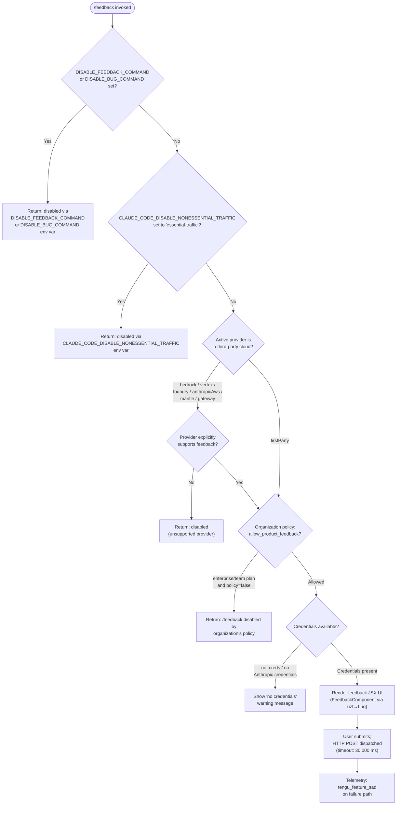

# `/feedback`

> Analysis basis: CC v2.1.165 bundle.js (AST extraction + Claude interpretation)
> Minimum version: v2.1.165

---

## Overview

The `/feedback` command (also aliased as `/share` and `/bug`) opens a feedback and bug-reporting interface that collects user input and/or the current conversation, then submits it to Anthropic. Before presenting the UI it performs a multi-stage eligibility check — inspecting environment variables, organization policy flags, and the active API provider — to determine whether the submission channel is available in the current deployment context.

---

## Registration

| Field | Value |
|---|---|
| type | `local-jsx` |
| name | `feedback` |
| description | `Submit feedback, report a bug, or share your conversation` |
| argumentHint | `[report]` |
| aliases | `share`, `bug` |
| module_id | `fuq` |
| load_inline | `true` |
| loc_byte | `10976391` |
| loc_byte_end | `10976614` |
| loc_line | `7289` |
| arbor_handler.name | `uzf` |
| arbor_handler.fqn | `claude-2.1.165::uzf` |
| arbor_handler.kind | `AsyncFunction` |
| arbor_handler.resolution_path | `module_id` |
| arbor_handler.n_hits | `0` |

Analysis basis: CC v2.1.165 bundle.js:+10976391

---

## Input Branching

The command has more than three distinct eligibility branches before the feedback UI is shown, so a Mermaid flowchart is used.



Analysis basis: CC v2.1.165 bundle.js:+10954266, +10954284, +10954425, +10954543, +10954707, +10955314, +10975780

---

## Behavioral Spec

### 1. Handler Entry Point

The Arbor-resolved handler is `uzf` (AsyncFunction, `claude-2.1.165::uzf`), reached via the `module_id` → `fuq` resolution path. `uzf` immediately delegates to the JSX component factory `Luq`.

Analysis basis: CC v2.1.165 bundle.js:+10976222

```
async function feedbackHandler(context):
    timestamp = captureTimestamp()          // Kuq → Date.now
    component = buildFeedbackComponent(context, timestamp)   // Luq
    return component
```

### 2. Environment-Variable Disable Checks (`checkDisabledViaEnv`)

Performed inside the eligibility guard (`kbH`), called from `Luq` at the top of component initialization.

```
function checkDisabledViaEnv(commandName):
    if env.DISABLE_FEEDBACK_COMMAND is set:
        return DisabledResult(
            "/feedback has been disabled via the DISABLE_FEEDBACK_COMMAND environment variable"
        )
    if env.DISABLE_BUG_COMMAND is set:
        return DisabledResult(
            "/feedback has been disabled via the DISABLE_BUG_COMMAND environment variable"
        )
    trafficMode = resolveTrafficMode()   // Dq → xSA → eH
    if trafficMode == "essential-traffic":
        return DisabledResult(
            "/feedback has been disabled via the CLAUDE_CODE_DISABLE_NONESSENTIAL_TRAFFIC environment variable"
        )
    return null   // not disabled
```

Analysis basis: CC v2.1.165 bundle.js:+10954266, +10954284, +10954425, +10954543

Traffic mode constants observed: `"essential-traffic"` (bundle.js:+1014267), `"no-telemetry"` (bundle.js:+1014326), `"default"` (bundle.js:+1014400).

### 3. Provider-Type Resolution (`resolveProviderType`)

Maps the active API configuration to a provider label used in subsequent policy and credential checks.

```
function resolveProviderType(apiConfig):
    switch apiConfig.bundle:
        case "bedrock"      → return "Amazon Bedrock"
        case "vertex"       → return "Vertex AI"
        case "foundry"      → return "Microsoft Foundry"
        case "anthropicAws" → return "Claude Platform on AWS"
        case "mantle"       → return "Amazon Bedrock (Mantle)"
        case "gateway"      → return "an API gateway"
        default             → return "firstParty"
```

Analysis basis: CC v2.1.165 bundle.js:+10954807, +10954839, +10954914, +10954985, +10955069, +10955152, +10955183, +10955237

Provider names `"bedrock"`, `"foundry"`, `"anthropicAws"`, `"mantle"`, `"vertex"`, `"firstParty"` are drawn from the API-configuration layer (`XA`, bundle.js:+2096653–+2096910).

### 4. Organization Policy Check (`checkOrganizationPolicy`)

Relevant only for `enterprise` and `team` plan accounts; uses the `allow_product_feedback` policy flag.

```
function checkOrganizationPolicy(accountTier, policyFlags):
    if accountTier in ["enterprise", "team"]:
        if not policyFlags.allow_product_feedback:
            return DisabledResult(
                "/feedback has been disabled by your organization's policy"
            )
    return null
```

Analysis basis: CC v2.1.165 bundle.js:+4178114, +4178149, +4178415, +10954707

### 5. Credential Availability Check

Performed via the auth-resolution chain (`rU` → `ad` / `ZA` / `NW`).

```
function checkCredentials(authState):
    if authState.status == "no_creds":
        return WarningResult("no Anthropic credentials")
    if not authState.hasOAuthToken:
        return WarningResult("No OAuth token available")
    if not authState.hasApiKey:
        return WarningResult("No API key available")
    return null
```

Analysis basis: CC v2.1.165 bundle.js:+10955314, +10955331, +3034449, +3034684

Credential error strings observed:
- `"Anthropic auth not used on third-party providers"` (bundle.js:+3034334)
- `"No OAuth token available"` (bundle.js:+3034449)
- `"Not available when using a Cloud gateway"` (bundle.js:+3034599)
- `"No API key available"` (bundle.js:+3034684)

### 6. Feedback Submission (`submitFeedback`)

Once all checks pass, the JSX UI is rendered (`Luq` → `M8A.createElement`). On user submission, an HTTP POST is dispatched.

```
async function submitFeedback(payload):
    headers = {
        "Content-Type": "application/json",
        "User-Agent":   buildUserAgent(),
    }
    response = await httpPost(
        endpoint = resolveSubmissionEndpoint(),
        body     = JSON.stringify(sanitizePayload(payload)),
        timeout  = 30000,      // ms — hard-coded timeout
    )
    if response.ok:
        logDebug("[Bootstrap] Fetch ok")
    else:
        emitTelemetry("tengu_feature_sad")
```

Analysis basis: CC v2.1.165 bundle.js:+10975780, +10955371, +15724668, +15724683, +15724702, +15724957

The HTTP timeout is 30 000 ms (bundle.js:+10975780). A bootstrap fetch timeout of 5 000 ms also appears in the call graph (bundle.js:+15724784) and applies to metadata pre-fetching.

### 7. Conversation Sanitization (`sanitizeConversation`)

Before the payload is serialized, the conversation transcript is sanitized to redact sensitive values.

```
function sanitizeConversation(messages):
    for message in messages:
        if message.containsSensitiveHeader():
            message.apiKeyField = "[REDACTED]"  // bundle.js:+198141
    return messages
```

Analysis basis: CC v2.1.165 bundle.js:+198141, +198062 (`J4` → `c2A`)

### 8. Log / Transcript Handling (`appendTranscriptToLog`)

The call graph shows file-system operations used to write and rotate transcript log files before or during submission.

```
function appendTranscriptToLog(logDir, content):
    ensureDirectory(logDir)                // ocK → Zy.mkdir
    appendFile(logDir, content)            // Zy.appendFile
    stat = Zy.stat(logPath)
    if logPath.endsWith(".txt"):
        rotatedPath = logPath.slice(0, -4) // drop ".txt" suffix — bundle.js:+205021, +205032
        Zy.rename(logPath, rotatedPath)
    checkBufferByteLength(content)         // Buffer.byteLength — bundle.js:+205771
```

Analysis basis: CC v2.1.165 bundle.js:+205317, +205376, +205021, +205032, +205073, +205771

---

## State & Side Effects

| Item | Detail |
|---|---|
| Telemetry | `tengu_feature_sad` — fired on the failure/sad path (bundle.js:+1010365) |
| HTTP POST | Submission dispatched on user confirmation; timeout 30 000 ms (bundle.js:+10975780) |
| File I/O | Conversation transcript appended to a log file; `.txt` suffix rotation performed (bundle.js:+205021, +205376) |
| Environment reads | `DISABLE_FEEDBACK_COMMAND`, `DISABLE_BUG_COMMAND`, `CLAUDE_CODE_DISABLE_NONESSENTIAL_TRAFFIC` checked at invocation time |
| Auth header | `x-api-key` header attached when API key is available (bundle.js:+3034724); OAuth bearer token used otherwise |
| `api.anthropic.com` | Submission endpoint base (bundle.js:+2097588); suppressed for third-party providers |
| JSX render | `M8A.createElement` produces the feedback UI tree (bundle.js:+10976004) |
| Bootstrap fetch | Metadata pre-fetch with separate 5 000 ms timeout (bundle.js:+15724784) |
| Timer management | `clearTimeout` / `setTimeout` / `setImmediate` used in the output-streaming layer (`$pH`) |
| Hook registration | `zXA.register` called via `j9` (bundle.js:+60323) — registers a cleanup or lifecycle hook |

---

## Version History

| Version | Change |
|---|---|
| v2.1.165 | Initial analysis |

---

## Common Mistakes

1. **Triggering with a disabled environment variable set** — If `DISABLE_FEEDBACK_COMMAND`, `DISABLE_BUG_COMMAND`, or `CLAUDE_CODE_DISABLE_NONESSENTIAL_TRAFFIC=essential-traffic` is present in the shell environment, the command exits immediately with an explanatory message rather than opening the feedback UI. Check these variables first when the command appears to do nothing.

2. **Using `/feedback` on third-party provider deployments without policy allowance** — On Amazon Bedrock, Vertex AI, Microsoft Foundry, Claude Platform on AWS, Amazon Bedrock (Mantle), or API gateway configurations, the organization policy flag `allow_product_feedback` must be `true` for enterprise/team plans; otherwise the command is silently blocked with a policy message.

3. **Expecting the command to work without Anthropic credentials** — All three aliases (`/feedback`, `/share`, `/bug`) require valid Anthropic credentials (OAuth token or API key). Running in an environment with no credentials yields a warning rather than the feedback form.

4. **Assuming `/bug` and `/share` have different behavior** — All three names (`feedback`, `bug`, `share`) resolve to the same handler (`uzf`) and follow identical eligibility logic.

5. **Confusing the submission timeout with the bootstrap timeout** — The UI metadata pre-fetch uses a 5 000 ms timeout (bundle.js:+15724784), while the actual POST submission uses a 30 000 ms timeout (bundle.js:+10975780). Network errors during the pre-fetch may prevent the UI from appearing, even though the submission channel itself would have a longer window.

---

## Appendix — Identifier Mapping

> For bundle debugging only. Identifiers change across versions.

| Identifier | Role |
|---|---|
| `uzf` | Top-level async handler for `/feedback` (Arbor-resolved; `claude-2.1.165::uzf`) |
| `Luq` | JSX component factory / render entry point for the feedback UI |
| `kbH` | Eligibility guard — runs all disable/policy/credential checks |
| `Dq` | Traffic-mode resolver (reads `CLAUDE_CODE_DISABLE_NONESSENTIAL_TRAFFIC`) |
| `xSA` | Traffic-mode string normalizer |
| `eH` | Generic string coercion utility |
| `W9` | Provider-aware policy check dispatcher |
| `rL9` | Inner policy evaluation router |
| `WIH` | Policy flag accessor (reads `allow_product_feedback`) |
| `TC` | Auth-config resolver (maps bundle type → provider label) |
| `XA` | API-configuration accessor |
| `Hf` | Provider-label formatter |
| `DO` | Credential existence checker |
| `Bj` | OAuth token resolver |
| `e4H` | Organization tier inspector (`enterprise` / `team`) |
| `rU` | Auth-header builder (attaches `x-api-key` or OAuth bearer) |
| `ad` | Third-party provider auth guard |
| `Z7` | API config reader |
| `ZA` | OAuth token retriever |
| `zY` | Token-expiry and refresh logic |
| `nR` | Array-based inclusion check utility |
| `NW` | API key credential builder |
| `H` | Bootstrap fetch orchestrator |
| `v` | HTTP request builder / sender |
| `icK` | User-agent string constructor |
| `DXA` | Platform/OS metadata resolver |
| `SH` | JSON serializer wrapper |
| `J4` | Payload sanitizer (redacts sensitive headers) |
| `c2A` | Header-map transformer |
| `ppH` | Stream write helper |
| `C2A` | Output writer |
| `acK` | Transcript log append coordinator |
| `$pH` | Buffered output stream manager (uses `setTimeout` / `setImmediate`) |
| `d3H` | Log-line formatter |
| `Q6` | Log directory resolver |
| `aL6` | EISDIR error handler |
| `s2A` | Log file path builder |
| `a2A` | Log file rotation helper (renames `.txt` files) |
| `ocK` | Log file append executor (`Zy.mkdir` + `Zy.appendFile`) |
| `j9` | Lifecycle hook registrar (`zXA.register`) |
| `e$` | Request metadata injector |
| `Gw_` | Input argument parser (splits / trims / indexes command args) |
| `ZHH` | Command cache lookup |
| `uj` | Text replacement utility |
| `e1` | Model-name resolution entry |
| `D6H` | Model-string parser |
| `x0` | Model-config loader |
| `IqH` | Model-config validator |
| `yd` | Model-name tokenizer / analyzer |
| `Aq` | Model alias resolver |
| `o0` | Model-tier lookup |
| `_4H` | Model inclusion-list checker |
| `wI` | Model group classifier |
| `NQH` | Sonnet-family model selector |
| `NE` | Haiku-family model selector |
| `SX1` | Model selection normalizer |
| `gM` | Model-name formatter |
| `Pe6` | Model allow-list filter |
| `vQH` | Model error reporter |
| `eX` | Model resolution chain entry |
| `r0` | Full model resolution pipeline |
| `s6` | Telemetry event emitter (fires `tengu_feature_sad`) |
| `c` | Core telemetry dispatcher |
| `P6` | Telemetry payload builder |
| `Nu6` | Telemetry endpoint sender |
| `Kuq` | Timestamp capturer (`Date.now`) |

---

Note: index built via Arbor fallback; some signals (telemetry, literals) may be missing — see arbor-fallback.js.