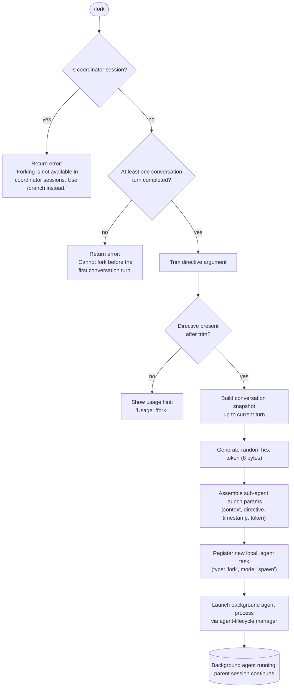

# `/fork`

> Analysis basis: CC v2.1.165 bundle.js (AST extraction + Claude interpretation)
> Minimum version: v2.1.165

---

## Overview

`/fork` spawns a background agent that inherits the full conversation history from the current session. The command accepts a user-supplied directive string, trims and validates it, then launches a new asynchronous sub-agent process seeded with the conversation context up to that point. It is unavailable inside coordinator sessions (where `/branch` should be used instead) and cannot be invoked before the first conversation turn has occurred.

## Registration

| Field | Value |
|---|---|
| type | `local-jsx` |
| name | `fork` |
| description | `Spawn a background agent that inherits the full conversation` |
| argumentHint | `<directive>` |
| module_id | `r8K` |
| load_inline | `true` |
| loc_byte | `12477998` |
| loc_byte_end | `12478201` |
| loc_line | `8927` |
| arbor_handler.name | `khf` |
| arbor_handler.fqn | `claude-2.1.165::khf` |
| arbor_handler.kind | `AsyncFunction` |
| arbor_handler.resolution_path | `module_id` |
| arbor_handler.n_hits | `0` |

Analysis basis: CC v2.1.165 bundle.js:+12477998

## Input Branching

The handler has four distinct outcome paths based on session state and the presence/content of the directive argument.



Analysis basis: CC v2.1.165 bundle.js:+12477557 (directive trim), +12477695 (coordinator guard), +12477768 (first-turn guard), +12477581 (usage hint), +12477649 (sub-agent launch)

## Behavioral Spec

### Handler entry — `forkCommandHandler` (`khf`)

The handler is an `AsyncFunction` reached via `module_id → r8K`. The Arbor symbol graph resolves this as `khf`.

```
async function forkCommandHandler(context):
    directive = context.args.trim()                    // +12477557

    if context.session.isCoordinatorMode:
        return errorMessage(
            "Forking is not available in coordinator sessions. Use /branch instead."
        )                                              // +12477695

    conversationHistory = buildConversationSnapshot(context)
    // buildConversationSnapshot calls getAppState, findLast on messages
    // to locate the most recent assistant turn                // +12477579 → H

    if conversationHistory has no completed turns:
        return errorMessage(
            "Cannot fork before the first conversation turn"
        )                                              // +12477768

    if directive is empty:
        return usageHint("Usage: /fork <directive>")  // +12477581

    token  = randomBytes(8).toString("hex")            // +10938889, +6857921
    taskId = generateTaskId(token, Date.now())         // +10938916
    launchParams = assembleSubAgentParams(
        conversationHistory,
        directive,
        taskId,
        context
    )
    return launchSubAgent(launchParams)                // +12477649 → B6A
```

### Conversation snapshot builder — `buildConversationSnapshot` (`H` → depth-1 from `khf`)

```
function buildConversationSnapshot(context):
    appState    = context.getAppState()               // +15724619
    messages    = appState.messages
    lastTurn    = messages.findLast(isCompletedAssistantTurn)
    systemPrompt = context.getSystemPrompt()          // +9542949
    return {
        messages    : sliceToLastTurn(messages, lastTurn),
        systemPrompt: systemPrompt,
        replContexts: appState.getReplContexts(),
    }
```

Analysis basis: CC v2.1.165 bundle.js:+15724619, +15724754, +9542949

### Sub-agent launch coordinator — `launchSubAgent` (`B6A`)

```
async function launchSubAgent(params):
    // Validate REPL contexts                          // +10938714
    replContexts = params.session.getReplContexts()

    // Trim and prepare directive for agent            // +10938841
    trimmedDirective = params.directive.trim()

    // Slice conversation to configured window         // +10938862
    // (window size: 50 chars for display, 49 raw)    // +10938859, +10938872
    contextSlice = prepareContextSlice(params.conversationHistory)

    // Assign fork-type marker                         // +10938674
    taskType = "fork"

    // Choose spawn vs resume mode                     // +10938793
    mode = "spawn"

    // Build system message override at role "system"  // +12477621
    systemOverride = buildSystemOverride(params)

    // Register the task in the local agent registry   // +10503093
    taskRecord = {
        type     : "local_agent",
        status   : "running",
        purpose  : "general-purpose",
        source   : "fork",
        mode     : mode,
    }
    registerTask(taskRecord)                           // +10503409

    // Start background agent process                  // +10939491 → wS
    agentProcess = startBackgroundAgent({
        task         : taskRecord,
        context      : contextSlice,
        directive    : trimmedDirective,
        systemPrompt : systemOverride,
    })

    return agentProcess
```

Analysis basis: CC v2.1.165 bundle.js:+10938468, +10938480, +10938587, +10938714, +10938841, +10938929

### Background agent runner — `runBackgroundAgent` (`wS`)

This is the deep process-level runner (depth-2 from `khf`). It orchestrates the full agent session lifecycle:

```
async function runBackgroundAgent(config):
    // Snapshot the conversation reference            // +9530437 → R_
    snapshot = takeConversationReference(config)

    // Build initial message list for the fork        // +9530454 → js
    initialMessages = buildInitialMessageList(config)

    // Compute context identifier                     // +9530516 → oh
    contextToken = generateContextToken()

    // Resolve and apply MCP configurations           // +9530664 → C7H
    mcpConfig = loadMcpConfiguration(config)

    // Run the agent event loop                       // +9533235 → D8.getPromptForCommand
    await executeAgentLoop(config, initialMessages)

    // Emit telemetry on completion / error
    // Manage task lifecycle state via registry updates
```

Analysis basis: CC v2.1.165 bundle.js:+9530437, +9530454, +9530516, +9530664

### Context slice preparation — `prepareContextSlice` (inside `rV8`)

```
function prepareContextSlice(messages):
    // Filter assistant turns                         // +9638201 ("assistant")
    // Filter user turns                              // +9638223 ("user")
    // Exclude tool_use and tool_result blocks        // +9637531, +9637690
    // Include "ok"/"err" coded results               // +9637806, +9637735
    // Retain "code"-type content blocks              // +9637379
    return filteredMessages
```

Analysis basis: CC v2.1.165 bundle.js:+9638113, +9638201, +9638223

### Error guard: coordinator mode check

The literal string `"Forking is not available in coordinator sessions. Use /branch instead."` is embedded at bundle.js:+12477695 and is returned directly to the user without launching any sub-agent.

Analysis basis: CC v2.1.165 bundle.js:+12477695

### Error guard: first-turn check

The literal string `"Cannot fork before the first conversation turn"` is embedded at bundle.js:+12477768. The check uses `findLast` over the conversation history looking for a completed assistant message. If none exists, the error is returned.

Analysis basis: CC v2.1.165 bundle.js:+12477768

### Random token generation — `generateContextToken` (`oh`)

```
function generateContextToken():
    bytes = crypto.randomBytes(8)                     // +6857921
    return bytes.toString("hex")                      // +6857949
```

The 8-byte hex token (16 hex characters) is used to uniquely identify the forked task.

Analysis basis: CC v2.1.165 bundle.js:+10938889, +6857921, +6857937 (value: 8), +6857949 ("hex")

### Agent process watchdog (`VsH`)

Once the background agent is running, a watchdog monitors it:

```
function watchdogLoop(agent):
    stall_timeout_ms = 600000   // 10 minutes       // +6948001
    poll_interval    = 10       // seconds           // +6947996

    on stall detected:
        emit telemetry "subagent_stall_timeout"      // +6949149
        agent.abort()

    on completion:
        emit telemetry "subagent_complete"           // +6949129
        update task registry status

    on user kill:
        emit "user_kill_async"                       // +6951310
        send SIGKILL                                 // "SIGKILL" literal +13489390
```

Analysis basis: CC v2.1.165 bundle.js:+6947935, +6948001, +6949129, +6949149

## State & Side Effects

| Item | Detail |
|---|---|
| Telemetry — subagent launch | `subagent_launch` (literal at +10938483), `subagent_fork_coordinator_mode` (literal at +10938501) |
| Telemetry — fork prompt missing | `subagent_fork_prompt_missing` (literal at +10938625) |
| Telemetry — stall timeout | `subagent_stall_timeout` (literal at +6949149) |
| Telemetry — completion | `subagent_complete` (literal at +6949129) |
| Telemetry — agent terminated | `tengu_agent_tool_terminated` (+6951137) |
| Telemetry — async agent stall | `tengu_async_agent_stall_timeout` (+6948892) |
| Telemetry — forked agent turns exceeded | `tengu_forked_agent_default_turns_exceeded` (+10915159) |
| Telemetry — agent tool completed | `tengu_agent_tool_completed` (+6944977) |
| Telemetry — user kill | `user_kill_async` (literal +6951310) |
| Telemetry — API metrics | `api_metrics` (literal +6949550) |
| Task registry | New `local_agent` record created (type: `"fork"`, status: `"running"`, purpose: `"general-purpose"`) via `K.register` (+10503409) |
| appState changes | `getAppState` read at +15724619, +10910774; `setAppState` written by background agent runner (+10911938) |
| File I/O | Background agent writes `.jsonl` transcript (+13167000), `.meta.json` metadata (+13166844); creates `agent_metadata` entries (+13167035) |
| Socket / IPC | Sub-agent communicates via local socket; socket path managed under `subagents/` directory (+6735246) |
| Symlinks | Agent socket directory uses `Ye.symlink` / `Ye.unlink` for socket registration (+13255068, +13255127) |
| Process spawn | `Fg.spawn` called to start child process (+16135419); watchdog uses `process.kill` / SIGKILL escalation (+13489390, +13488996) |
| Tracing / OTEL | Span `claude_code.subagent.spawn` emitted (+6856113); span type `subagent.spawn` (+6855980) |
| Sound | <!-- TODO: not found in depth-2 traversal; needs --depth 4 --> |
| Hook registration | `j9` → `zXA.register` called during agent context setup (+60323) |

## Version History

| Version | Change |
|---|---|
| v2.1.165 | Initial analysis |

## Common Mistakes

1. **Invoking `/fork` in a coordinator session**: The command returns an explicit error and does nothing. Use `/branch` inside coordinator/multi-agent orchestration sessions.
2. **Invoking `/fork` before any conversation turn**: There must be at least one completed assistant response before forking. Attempting it on a fresh session returns `"Cannot fork before the first conversation turn"`.
3. **Omitting the directive argument**: Without a non-empty directive (after trimming), the command displays the usage hint `"Usage: /fork <directive>"` and does not spawn any agent. The directive is mandatory.
4. **Expecting synchronous output**: The forked agent runs in the background. The parent session continues immediately; results from the sub-agent are delivered asynchronously via the task registry.
5. **Assuming the fork inherits live tool state**: The context passed to the fork is a filtered snapshot (filtered message types: `assistant`, `user`, `code`, `tool_use`, `tool_result`). Live REPL state or in-memory variables are not transferred.

---

Note: index built via Arbor fallback; some signals (telemetry, literals) may be missing — see arbor-fallback.js.

## Appendix — Identifier Mapping

> For bundle debugging only. Identifiers change across versions.

| Identifier | Role |
|---|---|
| `khf` | Main handler — `forkCommandHandler` (AsyncFunction) |
| `B6A` | Sub-agent launch coordinator |
| `wS` | Background agent runner / event-loop orchestrator |
| `H` | Conversation snapshot builder |
| `Lzf` | System-prompt + context assembler called by `B6A` |
| `R_` | Last-turn finder (`findLast` over messages) |
| `DT` | System prompt section builder (full prompt assembly) |
| `Qm` | Agent memory / system prompt loader |
| `VsH` | Watchdog / task lifecycle manager |
| `rV8` | Context slice / message filter for fork payload |
| `oh` | Random token generator (`crypto.randomBytes`) |
| `o86` | Task registry registration and agent spawn initiator |
| `ICH` | Socket directory / symlink manager for sub-agent IPC |
| `Gx8` | Active-agent set manager (add/delete on task set) |
| `B66` | Socket file creator (uses `Ye.open`) |
| `w5A` | Agent working-directory mkdir helper |
| `d$` | Agent path builder (`Y5A.join`) |
| `FZ` | Sub-agent socket path resolver |
| `uC` | AbortController / signal setup for sub-agent |
| `dq` | EventEmitter max-listeners setter |
| `qz9` | Signal binding helper (`A.bind`, `piL.bind`) |
| `o2` | Pending-status recorder with timestamp |
| `k_` | Module initialiser (sets `__esModule`, binds `Tu6`, `Zu6`) |
| `js` | Initial message list builder for fork |
| `zZ` | Message-formatter called by `js` |
| `M` | App-state / session-map accessor |
| `Iz` | Shared utility (reached from both `Qm` and `wS`) |
| `vt7` | MCP + command context assembler |
| `DLH` | Tool allow-list checker (`LZL.has`) |
| `Qj` | Tool inclusion guard (array check + includes) |
| `Om9` | Object-key iterator for tool set construction |
| `K4` | Utility wrapper (delegates to `uv`) |
| `It7` | Directive-routing resolver |
| `d86` | Routing helper → `WJ` |
| `Q1` | String index+slice utility |
| `YCH` | Context reference resolver with locale-compare sort |
| `WJ` | Symbol finder (`_.find` + `l5K`) |
| `It7` | (see above) |
| `gm` | Agent-loop main entry (calls `hOf`) |
| `hOf` | Core agent query loop (model calls, tool execution, compaction) |
| `LY8` | Sub-agent exit / cleanup handler |
| `jG` | Per-turn stream handler |
| `XV8` | App-state updater during agent run |
| `J6` | Session transport manager (connect/close/writeBatch) |
| `LH` | Low-level message writer / sequence tracker |
| `_$A` | Bridge transport adaptor (CCR v2 protocol) |
| `BH` | Transport reconnect / on-connect handler |
| `k6` | Batch message writer |
| `n5H` | Sub-agent task runner coordinator |
| `kP` | Full agent execution pipeline (hooks, tools, model) |
| `gL` | Agent stream output handler |
| `iv6` | Agent initialisation with UUID |
| `wfH` | Hook event dispatcher |
| `Nt7` | Post-run notification helper |
| `c86` | Skill-progress event emitter |
| `$0` | Agent-progress reporter |
| `aMf` | Progress event builder |
| `sMf` | Sub-message progress forwarder |
| `JV8` | Turn state packager |
| `jV8` | MCP tool set assembler for fork agent |
| `GZq` | MCP permission-set cache manager |
| `FI6` | Tool filter (bundled vs custom) |
| `Dn` | Tool set deduplicator |
| `l_H` | Tool-list filter with `l5K` |
| `yh_` | Tool ranking / deduplication across sources |
| `WyH` | Retry-backoff calculator (`Math.pow`, `Math.max`) |
| `dV` | Integer validator with `parseInt` / `isNaN` |
| `a0` | Token-allowance checker (`i1L.has`) |
| `Xs` | REPL context set builder (filters, maps, pushes) |
| `gb_` | Active-permit filter (`mjH`, `iv_`, `f26`, `sY9`) |
| `y3` | String-normalisation helper |
| `MG` | Message-type constructor (`cQ`, `JK`, `eH`) |
| `RV` | Path separator normaliser |
| `K$6` | Path decoder (`Ad`) |
| `NH` | Parallel sub-agent runner (races `o1H` against timeout) |
| `o1H` | Single sub-agent HTTP/socket session executor |
| `r_6` | In-flight request tracker (`iv8` map) |
| `dH` | Dynamic context/attachment assembler |
| `wr_` | Conversation reference writer (`d4`) |
| `d4` | Transcript file writer |
| `b1H` | Transcript read helper |
| `iCH` | Transcript filter (`_x8`, `Dx8`, `cFf`) |
| `n86` | Agent metadata file writer (`.jsonl`, `.meta.json`) |
| `qMK` | Path resolver for metadata dir |
| `gm9` | OTel tracing span creator for sub-agent spawn |
| `TfH` | Tracing attribute setter |
| `rh` | Active-span accessor (`EfH.active`) |
| `dyH` | Span-type tagger (`vkH`) |
| `hXH` | Span context propagator (`EfH.enterWith`) |
| `Qm9` | Span finaliser (sets status, ends span) |
| `QyH` | Span status setter |
| `SXH` | Span context restorer |
| `PfH` | Rate-limit / state updater with debounce |
| `$m9` | All-entries state sync |
| `ZsH` | Task-status updater (timestamp + `je_` epoch) |
| `MAH` | Task-update dispatcher with abort-speculation |
| `jD8` | Task-completion recorder |
| `mXH` | Task-progress updater |
| `IG6` | Sub-agent message processor / turn runner |
| `jG` | Per-turn model-stream handler |
| `u8` | UUID + context builder |
| `JPq` | Agent-update emitter |
| `ZG6` | Auto-mode classifier |
| `Wp9` | Classifier request builder |
| `zD8` | Handoff safety classifier |
| `BZ` | Last-message finder |
| `Aw7` | Classifier cache checker |
| `VsH` | (see watchdog above) |
| `IG6` | (see above) |
| `wD8` | Classifier result dispatcher |
| `ryH` | Filter helper for tool-result lists |
| `lK` | Active-task filter |
| `ayH` | Tool-call permission checker |
| `kK` | Recursive permission resolver (`Nr1`, `vr1`, `K`) |
| `DD8` | State/hook cross-checker |
| `XsH` | Hook progress recorder |
| `YD8` | (no additional detail found at depth-2) |
| `IfH` | `kG6` wrapper |
| `kG6` | (no additional detail found at depth-2) |
| `uXH` | `qbH` wrapper |
| `qbH` | REPL-tool-call logger / permission checker |
| `yG6` | Async-update emitter |
| `F06` | Stale-map pruner (`mz8.delete`) |
| `k3H` | (no additional detail found at depth-2) |
| `EH` | String coercer |
| `hH` | Console render helper (`c`, `P6`) |
| `RH` | Secondary render helper (`c`, `P6`) |
| `e$` | Internal utility (reached from snapshot builder) |
| `Gw_` | String splitter with index-of/slice |
| `ZHH` | Cache-hit checker (`c44.has`) |
| `uj` | String replacer |
| `e1` | Conversation turn classifier |
| `D6H` | Turn analysis helper (`x0`, `IqH`, `SA`, `yd`) |
| `yd` | Turn content extractor (map/trim/startsWith) |
| `Aq` | Model alias resolver |
| `NE` | Model provider mapper (`gM`, `Z5`, `XA`) |
| `SX1` | Model-alias forwarding shim |
| `gM` | Provider identity resolver |
| `Pe6` | Provider inclusion checker |
| `vQH` | Provider error handler |
| `eX` | Extended turn classifier |
| `r0` | Turn-type router |
| `s6` | Render helper (`c`, `P6`) |
| `P6` | Low-level render utility (delegates to `Nu6`) |
| `Nu6` | (base render primitive) |
| `W6` | Render utility (delegates to `Nu6`) |
| `v` | Internal utility — logging / state (appears in many call sites) |
| `S6` | Base path/string utility (delegates to `uv`) |
| `uv` | Primitive string/buffer utility |
| `lM` | (appears as clean-up / latch utility) |
| `eH` | String coercer (delegates to `String`) |
| `D6` | Event dispatcher / logger (`Hj6`, `_j6`, `qu`) |
| `EH` | String coercer |
| `M26` | (no additional detail at depth-2) |
| `AXH` | (no additional detail at depth-2) |