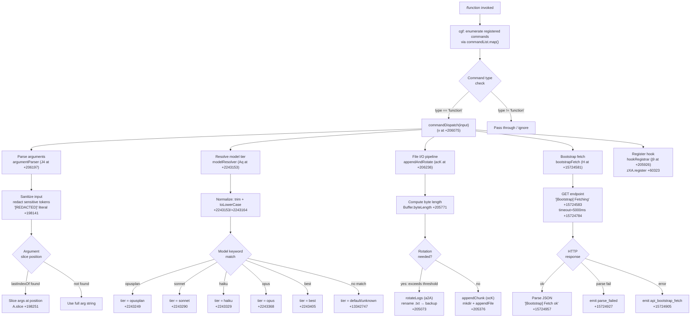

# `/function`

> Analysis basis: CC v2.1.165 bundle.js (AST extraction + Claude interpretation)
> Minimum version: v2.1.165

---

## Overview

The `/function` command is a `function`-type slash command registered in Claude Code that dispatches via the handler `cgf`. Based on the call graph, it enumerates available command entries (via `H.map`), resolves function-type command identities, and orchestrates a multi-stage pipeline covering argument parsing, model-tier resolution, file I/O for conversation context, and an HTTP bootstrap fetch cycle. The command does not carry a user-visible description string in the registration block.

---

## Registration

| Field | Value |
|---|---|
| type | `function` |
| name | `function` |
| description | `null` (none registered) |
| loc_byte | `13342633` |
| loc_byte_end | `13342666` |
| loc_line | `10694` |
| arbor_handler.name | `cgf` |
| arbor_handler.fqn | `claude-2.1.165::cgf` |
| arbor_handler.kind | `Function` |
| arbor_handler.resolution_path | `direct` (symbol falls inside registration byte range) |
| arbor_handler.n_hits | `1` |

Analysis basis: CC v2.1.165 bundle.js:+13342633

---

## Input Branching

The call graph from `cgf` reveals more than three distinct runtime paths (command enumeration, argument parsing, model resolution, file-write/rotate, HTTP bootstrap). A Mermaid flowchart is therefore used.



---

## Behavioral Spec

### 1. Entry Point and Command Enumeration

The primary handler `cgf` (resolved via `direct` Arbor path, `n_hits=1`) begins by mapping over the list of currently registered commands (`H.map` at +13342314). For each entry it checks the `"command"` type literal (+13342345) and delegates matching entries to the main dispatch function (`commandDispatch`, identifier `v`).

```
function cgf(commandList, input):
    for entry in commandList.map(normalizeEntry):
        if entry.type == "command":
            result = commandDispatch(entry, input)
    return collectResults(result, unknownFallback="unknown")
```

Analysis basis: CC v2.1.165 bundle.js:+13342314, +13342345, +13342747

---

### 2. Argument Parsing and Sanitization

The argument parser (`J4`, +206197) processes the raw input string. It first applies a replacement pass that injects `"[REDACTED]"` (+198141) over matched sensitive patterns. The numeric constant `2` (+198170) controls the replacement limit. The position of a relevant token is found using `lastIndexOf` (+198225), and the final argument string is extracted with a `slice` (+198251). The literal `.txt` (+205021) is referenced during file-related argument resolution.

```
function argumentParser(rawInput):
    sanitized = rawInput.replace(sensitivePattern, "[REDACTED]", limit=2)
    position  = sanitized.lastIndexOf(delimiter)
    if position >= 0:
        args = sanitized.slice(0, position)
    else:
        args = sanitized
    return buildArgObject(args)
```

Analysis basis: CC v2.1.165 bundle.js:+198141, +198170, +198225, +198251

---

### 3. Model Tier Resolution

The model resolver (`Aq`, +2243153) normalizes the requested model string and maps it to a known tier. Normalization applies trim (+2243153) then `toLowerCase` (+2243164). Recognized keyword strings are: `"opusplan"` (+2243249), `"[1m]"` (+2243275), `"sonnet"` (+2243290), `"haiku"` (+2243329), `"opus"` (+2243368), `"best"` (+2243405). Provider classification (first-party vs. gateway vs. AWS) is handled deeper in the sub-call chain via `firstParty` (+2239457), `anthropicAws` (+2097366), and `gateway` (+2097386). The string `"mantle"` (+2240098) and domain prefix `"anthropic."` (+2237210) are used during provider-string matching.

```
function modelResolver(modelString):
    normalized = modelString.trim().toLowerCase()
    if   normalized includes "opusplan" : tier = "opusplan"
    elif normalized includes "sonnet"   : tier = "sonnet"
    elif normalized includes "haiku"    : tier = "haiku"
    elif normalized includes "opus"     : tier = "opus"
    elif normalized includes "best"     : tier = "best"
    else                                : tier = "unknown"

    provider = classifyProvider(normalized)
    return ModelDescriptor(tier, provider)
```

Analysis basis: CC v2.1.165 bundle.js:+2243153, +2243249, +2243290, +2243329, +2243368, +2243405, +2239457, +2097366, +2097386

---

### 4. File I/O — Append and Rotate

The `appendAndRotate` function (`acK`, +206236) manages persistent log/context file writes. It computes the byte length of the content using `Buffer.byteLength` (+205771). If the file exists and ends with `".txt"` (+205021), and the current content would push the file beyond a rotation threshold (offset check at +205043, constant `4`), the file is renamed to a backup path (`Zy.rename`, +205073) and a fresh file is created. Files that fail the rename due to directory errors signal `EISDIR` (+175646). The `appendChunk` sub-function (`ocK`, +205317) creates the directory recursively (`Zy.mkdir`, +205317) and appends content (`Zy.appendFile`, +205376).

```
function appendAndRotate(filePath, content):
    byteLen = Buffer.byteLength(content)
    dirPath = path.dirname(filePath)

    if file.endsWith(".txt") and (existingSize + byteLen > rotationThreshold):
        backupPath = filePath.slice(0, -4) + backupSuffix
        await fs.rename(filePath, backupPath)
        # R8 handles post-rename cleanup
        await fs.unlink(stalePath)   # if needed

    await appendChunk(dirPath, filePath, content, byteLen)

function appendChunk(dirPath, filePath, content, byteLen):
    await fs.mkdir(dirPath, { recursive: true })
    await fs.appendFile(filePath, content)
    updateSizeTracker(byteLen)
    await rotateSizeFile(filePath)
```

Analysis basis: CC v2.1.165 bundle.js:+205771, +205021, +205043, +205073, +205317, +205376, +175646

---

### 5. Output Streaming and Debounce

The stream-output function (`$pH`, +205563) uses a classic debounce pattern. A `clearTimeout` (+59737) cancels any pending flush, and `setTimeout` (+59901) reschedules after a delay. `setImmediate` (+59994) is used for zero-lag microtask flushing. Multiple buffers (`$.join`, `L.join`, `J.join` at +59811, +59855, +60034) are assembled and dispatched via the output writer. The constants `1000` (+59625) and `100` (+59646) likely control the debounce wait and minimum-chunk size respectively.

```
function debouncedOutput(chunk):
    clearTimeout(pendingTimer)
    bufferQueue.push(chunk)
    pendingTimer = setTimeout(flushOutput, debounceMs=1000)

function flushOutput():
    combined = bufferA.join("") + bufferB.join("") + bufferC.join("")
    setImmediate(() => writer.write(combined))
    bufferA = []; bufferB = []; bufferC = []
```

Analysis basis: CC v2.1.165 bundle.js:+59625, +59646, +59737, +59901, +59994, +59811, +59855, +60034

---

### 6. HTTP Bootstrap Fetch

The bootstrap fetch sub-routine (`H` from `cgf` → `H`, +15724581) sends an HTTP GET with headers `Content-Type: application/json` (+15724683) and `User-Agent` (+15724702). A 5000 ms timeout is applied (+15724784). On success the response body is JSON-parsed and a `"[Bootstrap] Fetch ok"` log message is emitted (+15724957). On parse failure the telemetry path emits `"parse_failed"` (+15724927). The event key `"api_bootstrap_fetch"` (+15724905) is tracked for the overall fetch lifecycle. The `"[Bootstrap] Fetching"` log string (+15724583) appears at request start.

```
function bootstrapFetch(endpoint):
    log("[Bootstrap] Fetching", endpoint)
    response = await httpGet(endpoint, {
        headers: { "Content-Type": "application/json", "User-Agent": userAgent },
        timeout: 5000
    })
    try:
        data = JSON.parse(response.body)
        log("[Bootstrap] Fetch ok")
        return data
    catch ParseError:
        emitTelemetry("api_bootstrap_fetch", { result: "parse_failed" })
        return null
```

Analysis basis: CC v2.1.165 bundle.js:+15724581, +15724583, +15724668, +15724683, +15724702, +15724784, +15724905, +15724927, +15724957

---

### 7. Command Type Dispatch (sub-command routing)

Within the dispatch layer, the literals `"prompt"` (+12437325), `"agent"` (+12437354), `"http"` (+12437382), `"mcp_tool"` (+12437406), and `"callback"` (+12437468) define the recognized sub-command types. The `/function` command's own type is `"command"` (+13342345). Unrecognized types fall back to `"unknown"` (+13342747).

```
function routeByType(entry):
    switch entry.type:
        case "prompt"    : return handlePromptType(entry)
        case "agent"     : return handleAgentType(entry)
        case "http"      : return handleHttpType(entry)
        case "mcp_tool"  : return handleMcpToolType(entry)
        case "callback"  : return handleCallbackType(entry)
        default          : return { type: "unknown" }
```

Analysis basis: CC v2.1.165 bundle.js:+12437325, +12437354, +12437382, +12437406, +12437468, +13342747

---

### 8. Debug Logging

The string literal `"debug"` (+206051) is present in the dispatch path, indicating that debug-level logging is conditionally enabled when the session log level is set to `"debug"`.

Analysis basis: CC v2.1.165 bundle.js:+206051

---

### 9. Hook Registration

The `hookRegistrar` function (`j9`, +205926) calls `hookSystem.register` (`zXA.register`, +60323) to attach a lifecycle hook. This occurs after the file I/O pipeline completes, suggesting it registers a cleanup or post-write observer.

```
function hookRegistrar(context):
    hookSystem.register(context.hookKey, context.handler)
```

Analysis basis: CC v2.1.165 bundle.js:+205926, +60323

---

## State & Side Effects

| Item | Detail |
|---|---|
| Telemetry | `tengu_feature_sad` (bundle.js:+1010365) — fired on a sad/error path within the `s6`→`c` sub-chain |
| HTTP fetch telemetry event | `"api_bootstrap_fetch"` with sub-result `"parse_failed"` (+15724905, +15724927) |
| Hook registration | `zXA.register` called after file I/O pipeline (+60323) via `j9` |
| File system writes | `fs.appendFile` to context log files (+205376); `fs.mkdir` for directory creation (+205317) |
| File rotation | `fs.rename` for `.txt` log rotation (+205073); `fs.unlink` for stale file removal (+205113) |
| Buffer/debounce state | `clearTimeout` / `setTimeout` / `setImmediate` used for output debounce (+59737, +59901, +59994) |
| JSON serialization | `JSON.stringify` called in output-serialization path (`SH`, +185153) |
| appState changes | <!-- TODO: not found in depth-2 traversal; needs --depth 4 --> |
| Sound | <!-- TODO: not found in depth-2 traversal; needs --depth 4 --> |

---

## Version History

| Version | Change |
|---|---|
| v2.1.165 | Initial analysis |

---

## Common Mistakes

1. **Assuming a description exists**: The `/function` command has `description: null` in its registration. Do not expect a help string to appear in the command palette for this entry.
2. **Conflating command types**: The literals `"prompt"`, `"agent"`, `"http"`, `"mcp_tool"`, and `"callback"` are sibling command types routed by the same dispatcher — they are not sub-commands of `/function`.
3. **Misinterpreting `"[REDACTED]"` as an error**: The redaction string is an intentional sanitization of sensitive argument tokens, not a runtime fault signal.
4. **Ignoring the 5000 ms bootstrap timeout**: Callers that depend on bootstrap-fetched data must account for the fixed 5 second timeout (+15724784); there is no evidence of a configurable override at this depth.
5. **Not handling log rotation**: The `.txt` file rotation logic (`a2A`) is active; consumers of log files must be prepared for the file to be renamed mid-session.
6. **Treating `tengu_feature_sad` as a debug-only event**: This telemetry fires on a genuine error/sad path and should be monitored in production observability pipelines.

---

## Appendix — Identifier Mapping

> For bundle debugging only. Identifiers change across versions.

| Identifier | Role |
|---|---|
| `cgf` | Primary handler for `/function` command (Arbor-resolved, `direct` path) |
| `H` | Bootstrap fetch orchestrator; also used as command-list reference |
| `v` | Main command dispatch function |
| `icK` | Input validation / pre-check sub-routine |
| `DXA` | Nested validation helper (calls `rgK`, `ogK`) |
| `SH` | JSON serialization wrapper (calls `JSON.stringify`) |
| `J4` | Argument parser / sanitizer |
| `c2A` | Argument map helper (calls `QcK.map`) |
| `q` | File unlink helper (calls `puK.unlinkSync`) |
| `A` | Lowercase/slice path helper (calls `f.toLowerCase`) |
| `ppH` | Write pipeline coordinator (calls `C2A`) |
| `C2A` | Direct stream writer (calls `H.write`) |
| `acK` | Append-and-rotate coordinator |
| `$pH` | Debounced output streamer |
| `d3H` | Directory/join helper (`KHH.join`, `a8`, `S6`) |
| `Q6` | Sub-path resolver within `acK` |
| `aL6` | EISDIR-handling helper (calls `v8`) |
| `s2A` | Path join + size file helper |
| `a2A` | File rotate logic (`Zy.stat`, `Zy.rename`, `Zy.unlink`) |
| `ocK` | Chunk appender (`Zy.mkdir`, `Zy.appendFile`) |
| `j9` | Hook registrar (calls `zXA.register`) |
| `e$` | Unknown helper called from bootstrap fetch chain |
| `Gw_` | String splitter/trimmer (splits, trims, indexes, slices) |
| `ZHH` | Set membership checker (calls `c44.has`) |
| `uj` | String replacement helper |
| `e1` | Entry-point combinator for command resolution |
| `D6H` | Command record builder (`x0`, `IqH`, `SA`, `yd`) |
| `x0` | Sub-field extractor within `D6H` |
| `IqH` | Sub-field extractor within `D6H` |
| `yd` | Command metadata normalizer (trim, map, startsWith checks) |
| `Aq` | Model-tier resolver |
| `o0` | Provider lookup sub-helper (calls `q4H`) |
| `_4H` | Tier inclusion checker (calls `H4H.includes`) |
| `wI` | Model-string classifier (`gM`, `Z5`) |
| `NQH` | Model-string normalizer (calls `Z5`) |
| `NE` | First-party model classifier (`gM`, `Z5`, `XA`) |
| `SX1` | Model-string sub-resolver (calls `NE`) |
| `gM` | Provider category resolver (calls `XA`) |
| `Pe6` | Model inclusion checker (calls `r1L.includes`) |
| `vQH` | Model variant helper (calls `eH`) |
| `eX` | Extended model resolver (calls `Aq`, `r0`) |
| `r0` | Compound model descriptor builder (`ZA`, `P6H`, `PYH`, `IQH`, `NE`, `z2`, `gM`, `XA`, `Z5`, `wI`) |
| `s6` | Telemetry / feature-sad reporter (fires `tengu_feature_sad`) |
| `c` | Low-level telemetry emitter |
| `P6` | Telemetry transport (calls `Nu6`) |
| `Nu6` | Telemetry base sender |
| `iMH` | Secondary handler called directly from `cgf` |

---

Note: index built via Arbor fallback; some signals (telemetry, literals) may be missing — see arbor-fallback.js.