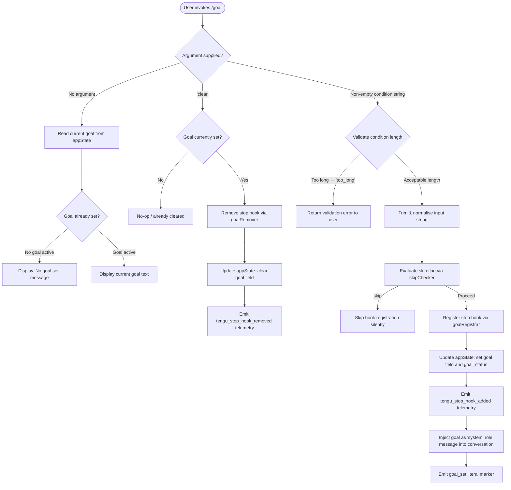

```
---
type: feature-spec
feature: "goal"
cc_version: "2.1.165"
updated: "2026-06-05"
tags: ["goal", "commands", "slash-commands"]
source: "bundle-analysis"
bundle_verified: true
analysis_basis: "CC v2.1.165 bundle.js (AST extraction + Claude interpretation)"
author: "ryujaeuk <ryujaeuk@gmail.com>"
repository: "https://github.com/MyLittleLuckyDog/cc-gnothi"
license: "AGPL-3.0-only"
---

# `/goal`

> Analysis basis: CC v2.1.165 bundle.js (AST extraction + Claude interpretation)
> Minimum version: v2.1.165

---

## Overview

The `/goal` command lets the user set a persistent stop-condition that Claude evaluates before finishing each agentic turn. When a goal string is active, Claude registers a stop hook that checks the stated condition and suppresses premature stopping; issuing `/goal clear` removes that hook. The command is immediate-execution, meaning it takes effect synchronously within the current session without requiring a separate agent round-trip.

---

## Registration

| Field | Value |
|---|---|
| type | `local-jsx` |
| name | `goal` |
| description | Set a goal Claude checks before stopping |
| argumentHint | `[<condition> \| clear]` |
| immediate | `true` |
| module_id | `U7K` |
| load_inline | `true` |
| loc_byte | `12977843` |
| loc_byte_end | `12978029` |
| loc_line | `9614` |
| arbor_handler.name | `dpf` |
| arbor_handler.fqn | `claude-2.1.165::dpf` |
| arbor_handler.kind | `AsyncFunction` |
| arbor_handler.resolution_path | `module_id` |
| arbor_handler.n_hits | `0` |

Analysis basis: CC v2.1.165 bundle.js:+12977843

---

## Input Branching

Four distinct execution branches exist depending on the argument supplied and current session state, so a flowchart is used.



Analysis basis: CC v2.1.165 bundle.js:+12976438 – +12976919

---

## Behavioral Spec

### Entry point — handler `dpf` (AsyncFunction)

```
async function goalCommandHandler(rawInput):
    trimmedInput = rawInput.trim()                      // → A.trim call
    
    if trimmedInput is empty:
        currentGoal = readAppState("goal")
        if currentGoal is null or empty:
            display("No goal set")                      // literal "No goal set"
            return
        else:
            display(currentGoal)
            return
    
    if skipChecker(trimmedInput) == "skip":             // literal "skip"
        return                                          // silent no-op
    
    if trimmedInput == "clear":
        goalRemover()                                   // kA6 branch
        return
    
    validationResult = validateGoalInput(trimmedInput)
    if validationResult == "too_long":                  // literal "too_long"
        displayError(validationResult)
        return
    
    registerGoal(trimmedInput)                          // IA6 branch
```

Analysis basis: CC v2.1.165 bundle.js:+12976438, +12976526, +12976544, +12976558, +12976572, +12976680, +12976806, +12976919

---

### Sub-feature: Skip detection — `skipChecker`

```
function skipChecker(inputString):
    lowered = inputString.toLowerCase()
    if lowered found in known-skip-set:               // Jk8 / X3f.has lookup
        return "skip"
    return null
```

Analysis basis: CC v2.1.165 bundle.js:+12976558, +10801374, +10801382

---

### Sub-feature: Goal removal — `goalRemover`

```
async function goalRemover(context):
    currentState = context.getAppState()               // H.getAppState
    
    if currentState.goal is not set:
        return                                         // nothing to remove
    
    buildGoalStopMessageBlock(currentState)            // vA6 → "Stop" literal
    context.setAppState({ goal: null })               // H.setAppState
    context.applyMessageOp("append", ...)             // H.applyMessageOp, literal "append"
    
    emit telemetry("tengu_stop_hook_removed")          // +10802833
    
    renderFeedback(context, "goal_removed")            // c / W6 → Nu6
```

Analysis basis: CC v2.1.165 bundle.js:+12976572, +10802578, +10802707, +10802776, +10802818, +10802833, +10802864

---

### Sub-feature: Goal registration — `goalRegistrar`

```
async function goalRegistrar(context, goalText):
    // Phase 1 — compute trust and hooks gates
    policyState  = readPolicySettings(context)         // _B → "policySettings"
    hooksAllowed = evaluateGate(policyState, "hooks_gate")    // literal "hooks_gate"
    trustAllowed = evaluateGate(policyState, "trust_gate")    // literal "trust_gate"
    
    // Phase 2 — build formatted stop-hook
    hookId       = generateUUID()                      // SCq → kCq.randomUUID
    timestamp    = Date.now()                          // IA6 → Date.now
    outputTokens = computeOutputTokens(context)        // TD → "outputTokens"
    
    // Phase 3 — inject goal into conversation as system message
    messageBlock = buildMessageBlock(
        role    = "system",                            // literal "system"
        content = goalText,
        type    = "attachment"                         // literal "attachment"
    )
    context.applyMessageOp("append", messageBlock)     // _.applyMessageOp, literal "append"
    
    // Phase 4 — register the stop hook
    registerStopHook(hookId, goalText)                 // j9 → zXA.register
    
    // Phase 5 — persist state
    context.setAppState({
        goal        : goalText,                        // literal "goal"
        goal_status : "goal_set"                       // literals "goal_status", "goal_set"
    })                                                 // _.setAppState
    
    emit telemetry("tengu_stop_hook_added")            // +10802461
    
    renderFeedback(context, "goal_registered")         // c / W6 → Nu6
```

Analysis basis: CC v2.1.165 bundle.js:+12976806, +10802075, +10801936, +10801942, +10801971, +10802025, +10802160, +10802324, +10802349, +10802362, +10802404, +10802446, +10802459, +10802512, +10802525, +10802867, +10802909, +10802927, +10802996

---

### Sub-feature: Bootstrap fetch — `bootstrapFetcher`

The handler delegates to a shared bootstrap mechanism that resolves API configuration before the goal hook can be registered. Relevant constants:

- Log prefix: `"[Bootstrap] Fetching"` (bundle.js:+15724583)
- Timeout: 5 000 ms (bundle.js:+15724784)
- Content-Type header: `"application/json"` (bundle.js:+15724683)
- User-Agent header present (bundle.js:+15724702)
- On success: `"[Bootstrap] Fetch ok"` (bundle.js:+15724957)
- On parse failure: emits `"api_bootstrap_fetch"` / `"parse_failed"` (bundle.js:+15724905, +15724927)

```
async function bootstrapFetcher(url):
    log("[Bootstrap] Fetching", url)
    response = await fetch(url, {
        timeout      : 5000,
        headers      : { "Content-Type": "application/json",
                         "User-Agent"  : <agent-string> }
    })
    if response not ok:
        emitTelemetry("api_bootstrap_fetch", { result: "parse_failed" })
        return null
    log("[Bootstrap] Fetch ok")
    return response.json()
```

Analysis basis: CC v2.1.165 bundle.js:+15724581, +15724583, +15724668, +15724683, +15724702, +15724784, +15724905, +15724927, +15724957

---

### Sub-feature: File-append logger — `fileLogger`

The stop-hook lifecycle uses an async file-append path for persistence/logging. Key constants:

- Rotation suffix: `".txt"` (bundle.js:+205021)
- Rotation threshold boundary: byte-length checked via `Buffer.byteLength` (bundle.js:+205771)
- Directory created with `mkdir` (bundle.js:+205317)
- Data appended with `appendFile` (bundle.js:+205376)
- Old file renamed then unlinked on rotation (bundle.js:+205073, +205113)
- EISDIR error code handled explicitly: `"EISDIR"` (bundle.js:+175646)

```
async function fileLogger(dirPath, content):
    ensure directory exists (mkdir)
    currentSize = Buffer.byteLength(content)
    if rotation needed:
        rename existing log to .txt backup
        unlink backup after rename
    appendFile(targetPath, content)
```

Analysis basis: CC v2.1.165 bundle.js:+205317, +205376, +205021, +205073, +205113, +205771

---

### Sub-feature: Stop-hook registry — `stopHookRegistry`

```
function stopHookRegistry(hookId, conditionText):
    // Debounced write: coalesces rapid updates
    clearTimeout(pendingTimer)                         // $pH → clearTimeout
    pendingTimer = setTimeout(flushHooks, 1000)        // literal 1000 ms
    
    // Batch limit
    if activeHooks.length >= 100:                      // literal 100
        dropOldest()
    
    activeHooks.push({ id: hookId, condition: conditionText })
    
    // Registration into hook table
    zXA.register(hookId, conditionText)                // j9 → zXA.register
```

Analysis basis: CC v2.1.165 bundle.js:+59737, +59901, +59625, +59646, +60323

---

## State & Side Effects

| Item | Detail |
|---|---|
| Telemetry — `tengu_stop_hook_added` | Fired when a new goal stop-hook is successfully registered (bundle.js:+10802461) |
| Telemetry — `tengu_stop_hook_removed` | Fired when `/goal clear` removes the active stop-hook (bundle.js:+10802833) |
| Telemetry — `tengu_feature_ok` | Fired on successful feature execution path (bundle.js:+1010222) |
| Telemetry — `tengu_feature_sad` | Fired on feature error path (bundle.js:+1010365) |
| appState — `goal` | Set to the condition string on registration; cleared on `/goal clear` (bundle.js:+10802867) |
| appState — `goal_status` | Set to `"goal_set"` on registration (bundle.js:+10802996) |
| Stop hook registration | A named stop-hook is registered via `zXA.register` keyed by UUID; removed on `clear` (bundle.js:+60323) |
| Conversation injection | The goal condition is appended as a `"system"` role `"attachment"` message block into the active conversation (bundle.js:+12976641, +10802909) |
| File logger | Stop-hook state is persisted to disk via an append-only log with `.txt` rotation (bundle.js:+205317, +205376) |
| Debounce timer | A 1 000 ms debounce timer coalesces rapid hook-state flushes; batch capped at 100 entries (bundle.js:+59625, +59646) |
| Hook gates | `"hooks_gate"` and `"trust_gate"` policy checks are evaluated before registration (bundle.js:+10801971, +10802025) |

---

## Version History

| Version | Change |
|---|---|
| v2.1.165 | Initial analysis |

---

## Common Mistakes

1. **Using `/goal clear` when no goal is active** — the command is a no-op but emits no confirmation, which can confuse users expecting feedback. Check the displayed goal status first with bare `/goal`.
2. **Providing an excessively long condition string** — the handler validates length and returns a `"too_long"` error rather than truncating silently. Keep condition strings concise.
3. **Expecting immediate agent behaviour change** — the goal is injected as a `"system"` attachment into the conversation and evaluated at the *next* stop decision, not retroactively for the current in-flight turn.
4. **Forgetting that `/goal` is session-scoped** — the stop-hook is tied to the current session's appState. Starting a new session or reloading Claude Code will not restore a previously set goal.
5. **Conflating `/goal` with memory or project settings** — the goal mechanism operates purely through the stop-hook registry and conversation injection; it does not write to `CLAUDE.md` or any persistent project file.

---

## Appendix — Identifier Mapping

> For bundle debugging only. Identifiers change across versions.

| Identifier | Role |
|---|---|
| `dpf` | Main async handler for `/goal` command (arbor_handler) |
| `A` | Input/argument variable; also used as generic accumulator in several callees |
| `f` | File/stream handle in file-logger subsystem |
| `q` | Secondary queue or file-handle in file-logger; also string operand in parser helpers |
| `L` | File-append task scheduler / finally-cleanup wrapper |
| `H` | Session context / API client object passed through most call sites |
| `v` | Bootstrap fetch core function |
| `icK` | Bootstrap initialisation helper |
| `DXA` | Bootstrap sub-initialiser (calls registry helpers `rgK`/`ogK`) |
| `SH` | JSON serialisation utility |
| `_` | Alternate context reference (mirrors `H` in some call sites) |
| `J4` | Path / token extraction utility |
| `c2A` | Token-map builder (`QcK.map`) |
| `ppH` | Stream writer wrapper |
| `C2A` | Low-level stream write helper |
| `acK` | File-logger orchestrator (mkdir, appendFile, rotation) |
| `$pH` | Debounced hook-flush scheduler |
| `d3H` | Hook payload builder (uses `KHH.join`, `a8`, `S6`) |
| `Q6` | Config path resolver inside file-logger |
| `aL6` | EISDIR-aware directory validator |
| `s2A` | Log file path joiner |
| `a2A` | Log file rotation handler (stat, rename, unlink) |
| `ocK` | File-logger write cycle (mkdir → append → rotate) |
| `j9` | Stop-hook registration dispatcher (`zXA.register`) |
| `e$` | Session capability / feature-flag checker |
| `Gw_` | String splitter / header parser |
| `ZHH` | Known-set membership checker (`c44.has`) |
| `uj` | String replace utility |
| `e1` | Token / model-spec parser |
| `D6H` | Model descriptor builder |
| `x0` | Model property extractor |
| `IqH` | Model identifier normaliser |
| `yd` | Model-string tokeniser / annotator |
| `Aq` | Model alias resolver (trim + toLowerCase + replace) |
| `o0` | Alias lookup table accessor (`q4H`) |
| `_4H` | Model family inclusion checker (`H4H.includes`) |
| `wI` | Model-tier classifier (calls `gM`, `Z5`) |
| `NQH` | Model-tier secondary classifier (`Z5`) |
| `NE` | Model provider classifier (`gM`, `Z5`, `XA`) |
| `SX1` | Model-spec wrapper calling `NE` |
| `gM` | Provider type mapper (`XA`) |
| `Pe6` | First-party model inclusion check (`r1L.includes`) |
| `vQH` | Model extra-data accessor (`eH`) |
| `eX` | Extended model resolver (calls `Aq`, `r0`) |
| `r0` | Full model resolution pipeline |
| `s6` | Feature telemetry emitter (ok / sad paths) |
| `c` | Feature-ok telemetry helper |
| `P6` | Feature reporting wrapper (`Nu6`) |
| `Nu6` | Base telemetry emitter |
| `Jk8` | Skip-flag detector (`X3f.has`, `H.toLowerCase`) |
| `kA6` | Goal-removal handler (getAppState / setAppState / applyMessageOp) |
| `S6` | Async utility / scheduler |
| `uv` | Low-level async primitive |
| `vA6` | Stop message block builder (produces "Stop" / "prompt" structures) |
| `j2H` | Map-setter helper (`K.set`) |
| `K` | Column-formatter (map + padEnd) |
| `MOq` | Message mapper (`H.map`) |
| `SCq` | UUID generator (`kCq.randomUUID`) |
| `W6` | Feedback renderer (`Nu6`) |
| `IA6` | Goal-registration handler (full lifecycle) |
| `H6A` | Pre-registration policy gate evaluator |
| `_B` | Policy settings reader (`"policySettings"`) |
| `x8` | Policy field extractor (`Pl6`, `Kd`) |
| `BD` | Policy branch dispatcher (`x8`, `SA`) |
| `U_` | Trust-gate evaluator |
| `Lf` | Hook-file path resolver (`wTL`) |
| `wTL` | Path construction helper (eH, qpH, Z9, y6, qlH, aQ, b6, UD.resolve) |
| `TD` | Output-token counter (`cmH`, `Object.values`) |
| `hH` | Goal-registered feedback emitter (`c`, `P6`) |
| `Xk8` | Post-registration finaliser / cleanup |
```

Note: index built via Arbor fallback; some signals (telemetry, literals) may be missing — see arbor-fallback.js.