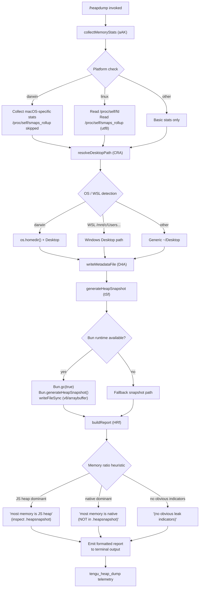

# `/heapdump`

> Analysis basis: CC v2.1.165 bundle.js (AST extraction + Claude interpretation)
> Minimum version: v2.1.165

---

## Overview

`/heapdump` is a hidden diagnostic command that captures a JavaScript heap snapshot of the running Claude Code process, writes it to the user's Desktop directory, and then emits a structured memory-analysis summary to the terminal. It is designed for debugging memory leaks and native-addon overuse; it is not intended for day-to-day use.

---

## Registration

| Field | Value |
|---|---|
| type | `local` |
| name | `heapdump` |
| description | `Dump the JS heap to ~/Desktop` |
| supportsNonInteractive | `true` |
| isHidden | `true` |
| module_id | `tAK` |
| load_inline | `true` |
| loc_byte | `12578611` |
| loc_byte_end | `12579039` |
| loc_line | `9049` |
| arbor_handler.name | `eSf` |
| arbor_handler.fqn | `claude-2.1.165::eSf` |
| arbor_handler.kind | `AsyncFunction` |
| arbor_handler.resolution_path | `module_id` |
| arbor_handler.n_hits | `0` |

Analysis basis: CC v2.1.165 bundle.js:+12578611

---

## Input Branching

The command has 4+ distinct branches based on platform detection, heap-snapshot format selection, memory heuristics, and file-write outcomes.



Analysis basis: CC v2.1.165 bundle.js:+12576118, +12575267, +12575686, +12576438, +12577160

---

## Behavioral Spec

### 1. Entry Point — Handler (`eSf`)

The Arbor-resolved async handler (`eSf`) is the primary entry point.

```
async function heapdumpHandler(context):
    lines = []
    reportLines = collectMemoryStats()        // aAK
    dumpResult  = performDump(context)        // D4A
    lines.push(...reportLines)
    outputText  = lines.join("\n")
    return outputText
```

Analysis basis: CC v2.1.165 bundle.js:+12577480, +12577599, +12577626, +12577748

---

### 2. Memory Statistics Collection (`aAK`)

Gathers a broad set of runtime metrics before the snapshot is taken, so the textual report can be assembled without re-querying after the GC run.

```
function collectMemoryStats():
    mem   = process.memoryUsage()
    heap  = v8Module.getHeapStatistics()           // zC8.getHeapStatistics
    res   = process.resourceUsage()
    up    = process.uptime()
    spaces = v8Module.getHeapSpaceStatistics()     // zC8.getHeapSpaceStatistics
    handles  = process._getActiveHandles().length
    requests = process._getActiveRequests().length

    // Linux-only open-file-descriptor count
    if platform == "linux":
        fdEntries = fs.readdir("/proc/self/fd")    // W96.readdir
        fdCount   = fdEntries.length

    // Linux-only RSS/PSS breakdown
    if platform == "linux":
        smaps = fs.readFile("/proc/self/smaps_rollup", "utf8")  // W96.readFile

    // bun:jsc module for JSC-specific heap info
    jscStats = require("bun:jsc")                  // W (bun:jsc module loader)

    // Uptime capped at 3600 s; RSS expressed per 1 048 576 bytes (1 MiB)
    // (constants at bundle.js:+12574175, +12574180)

    // Native-leak heuristic string injected when:
    //   native RSS > JS heap_used
    //   → "Native memory > heap - leak may be in native addons (node-pty, sharp, etc.)"
    //   (bundle.js:+12574413)

    formatted = X.toFixed(...)   // format megabyte values
    lines.push(...)
    return lines
```

Analysis basis: CC v2.1.165 bundle.js:+12573643, +12573667, +12573693, +12573719, +12573744, +12573786, +12573823, +12573874, +12573936, +12574034, +12574047, +12574175, +12574180, +12574413, +12574536

---

### 3. Desktop Path Resolution (`CRA`)

Determines the correct output directory across macOS, Linux, and WSL.

```
function resolveDesktopPath():
    home = os.homedir()                           // we8.homedir

    // WSL detection: check if home starts with /mnt/c/Users
    if home.startsWith("/mnt/c/Users"):
        // exclude well-known non-user dirs: Public, Default, Default User, All Users
        // (literals at bundle.js:+1061264, +1061283, +1061303, +1061328)
        windowsUser = extractWindowsUsername(home)
        return path.join("/mnt/c/Users", windowsUser, "Desktop")

    // Standard path
    return path.join(home, "Desktop")            // "Desktop" literal at +1060998
```

Analysis basis: CC v2.1.165 bundle.js:+1060945, +1060952, +1060988, +1060998, +1061220

---

### 4. Heap Snapshot and Metadata Write (`D4A` + `tSf`)

Orchestrates GC, snapshot generation, and writing both a JSON metadata file and a `.heapsnapshot` file.

```
async function performDump(context):
    stats        = collectMemoryStats()           // aAK
    desktopPath  = resolveDesktopPath()           // CRA

    // Ensure output directory exists
    Q6(desktopPath)                               // directory-creation helper

    // Build output file path; path.join used (Y4A.join at +12576547)
    metaPath     = path.join(desktopPath, <timestamped-filename>)

    // Write metadata JSON; file mode 0o600 (384 decimal, literal at +12576625)
    fs.writeFile(metaPath, SH(stats), { mode: 384 })   // W96.writeFile at +12576590

    // Generate heap snapshot (tSf)
    snapshotPath = generateAndWriteSnapshot(desktopPath)

    // Log and return summary
    c(...)
    HA(...)
    K$(...)
    kH(...)   // error-handling / logger

    // Emit telemetry
    emit("tengu_heap_dump")                       // +12576732

    return { metaPath, snapshotPath, stats }

async function generateAndWriteSnapshot(desktopPath):
    // Write a stub file first via oAK.writeFileSync (+12577160)
    fs.writeFileSync(snapshotPath, "")

    // Run full GC before capture
    Bun.gc(true)                                  // +12577237

    // Capture snapshot in v8/arraybuffer format
    // ("v8" literal at +12577205, "arraybuffer" at +12577210)
    snapshot = Bun.generateHeapSnapshot("v8", "arraybuffer")  // +12577180

    fs.writeFileSync(snapshotPath, snapshot)
    return snapshotPath
```

Analysis basis: CC v2.1.165 bundle.js:+12576142, +12576155, +12576201, +12576243, +12576438, +12576450, +12576547, +12576590, +12576606, +12576625, +12576681, +12576730, +12576901, +12576910, +12576988, +12577160, +12577180, +12577205, +12577210, +12577237

---

### 5. Report Formatting (`HRf`)

Assembles the final human-readable output lines from the raw statistics.

```
function buildReport(stats, snapshotPath):
    lines = []

    // Determine memory dominance
    heapUsed   = stats.heap_used_mb
    nativeUsed = stats.rss_mb - heapUsed
    ratio      = heapUsed / stats.rss_mb   // Math.max guards division (+12577855)

    if ratio >= threshold_js_dominant:
        annotation = "— most memory is JS heap (inspect the .heapsnapshot)"
        // literal at +12577923
    elif ratio <= threshold_native_dominant:
        annotation = "— most memory is native (NOT in the .heapsnapshot)"
        // literal at +12577983
    else:
        annotation = "  (no obvious leak indicators)"
        // literal at +12578120

    // Numeric formatting: values expressed to fixed decimal places
    // Column width: 8 characters (literal at +12578255)

    // Footer guidance line always appended:
    // "Open the .heapsnapshot in Chrome DevTools → Memory → Load to inspect retainers."
    // (literal at +12577636)

    lines.push(snapshotPath, annotation, footerLine)
    return lines
```

Analysis basis: CC v2.1.165 bundle.js:+12577599, +12577636, +12577748, +12577855, +12577923, +12577983, +12578120, +12578167, +12578255, +12578529

---

### 6. Threshold Constants

| Constant | Value | Role | Location |
|---|---|---|---|
| Uptime cap | `3600` seconds | Caps uptime display in stats | `bundle.js:+12574175` |
| MiB divisor | `1 048 576` | Converts bytes → MiB | `bundle.js:+12574180` |
| GiB threshold | `1 073 741 824` | 1 GiB boundary for ratio heuristic | `bundle.js:+12578529` |
| File mode | `384` (0o600) | Owner-only read/write on metadata file | `bundle.js:+12576625` |
| Column width | `8` | Fixed-width numeric columns in output | `bundle.js:+12578255` |

---

## State & Side Effects

| Item | Detail |
|---|---|
| Telemetry | `tengu_heap_dump` (bundle.js:+12576732) — fired after snapshot write; secondary events from call-graph shared infrastructure: `tengu_daemon_control` (+16170625), `tengu_daemon_config_reload` (+16149069), `tengu_bg_retire_pinned_low_mem` (+16138262), `tengu_bg_prewarm_per_sweep` (+16138383), `tengu_bg_dispatch_sigkill_escalate` (+16133657), `tengu_bg_dispatch_low_mem` (+16134258), `tengu_bg_spare_enable` (+16134962), `tengu_bg_spare_claim` (+16135090), `tengu_bg_spare_claim_fail` (+16135356), `tengu_bg_proto_mismatch` (+16121139), `tengu_bg_dispatch_stale_drop` (+16122378), `tengu_bg_attach_legacy_autorespawn` (+16124516), `tengu_bg_attach` (+16125674), `tengu_bg_attach_stall_gave_up` (+16126598), `tengu_bg_attach_stall_respawn` (+16126867), `tengu_bg_attach_kick` (+16127821) |
| File system writes | Two files created on Desktop: (1) a JSON metadata file with memory stats (mode 0o600); (2) a `.heapsnapshot` binary (v8/arraybuffer format) for Chrome DevTools |
| GC side effect | `Bun.gc(true)` forces a full synchronous garbage collection before snapshot capture, affecting process memory and potentially pausing the UI briefly |
| appState changes | None directly; shared background-daemon infrastructure may update worker/session state via `kH` and `K$` helpers |
| Hook registration | `j9` → `zXA.register` (FinalizationRegistry or similar hook, bundle.js:+60323) |
| Sound | None |
| Platform branch | `"darwin"` literal selects macOS code path; `"macos"` label used in report text (bundle.js:+12575267, +12575686) |
| WSL detection | Inspects `/mnt/c/Users` prefix; filters `Public`, `Default`, `Default User`, `All Users` accounts |

---

## Version History

| Version | Change |
|---|---|
| v2.1.165 | Initial analysis |

---

## Common Mistakes

1. **Expecting output in the current working directory.** The snapshot is always written to the user's Desktop (`~/Desktop`), not the project directory. On WSL the Desktop is resolved to the Windows user's Desktop under `/mnt/c/Users/<username>/Desktop`.
2. **Running in non-interactive pipelines.** Although `supportsNonInteractive: true` is set, the command writes to the Desktop which may not be writable in CI environments, causing a silent failure or permission error.
3. **Inspecting the metadata JSON file instead of the `.heapsnapshot` file.** The JSON metadata provides a textual summary; the actual heap object graph lives in the `.heapsnapshot` file, which must be opened in Chrome DevTools → Memory → Load Profile.
4. **Ignoring the native-memory warning.** When the report prints `— most memory is native (NOT in the .heapsnapshot)`, the `.heapsnapshot` will appear small because the leak is in a native addon (`node-pty`, `sharp`, etc.) and is invisible to the V8 heap snapshot.
5. **Running on non-Bun runtimes.** The snapshot uses `Bun.generateHeapSnapshot` and `Bun.gc`. Running Claude Code on a standard Node.js build will reach the fallback path and may produce an empty or unsupported snapshot.
6. **Forgetting the `isHidden` flag.** The command does not appear in `/help` output. It must be typed in full as `/heapdump`.

---

## Appendix — Identifier Mapping

> For bundle debugging only. Identifiers change across versions.

| Identifier | Role |
|---|---|
| `eSf` | Primary async handler for `/heapdump` (Arbor-resolved entry point) |
| `D4A` | Core dump orchestrator: coordinates stats → path → write → snapshot → report |
| `aAK` | Memory statistics collector (process, V8, JSC, /proc, fd count) |
| `tSf` | Heap snapshot generator: calls `Bun.gc` then `Bun.generateHeapSnapshot` |
| `CRA` | Desktop path resolver (macOS / WSL / generic Linux) |
| `HRf` | Report formatter: computes memory ratio, appends annotation and guidance line |
| `G96` | Inner helper called by report formatter (role: <!-- TODO: not found in depth-2 traversal; needs --depth 4 -->) |
| `S6` | Shared utility called at multiple points (likely async sleep or retry loop) |
| `uv` | Callee of `S6` (role: <!-- TODO: not found in depth-2 traversal; needs --depth 4 -->) |
| `W` | `bun:jsc` module loader / JSC stats accessor |
| `XK6` | Called by `W`; role in JSC stats pipeline |
| `kH` | Shared error-logging / background-event helper |
| `HA` | Error construction wrapper (wraps `Error` + `String`) |
| `K$` | Post-dump cleanup or notification helper |
| `Q6` | Directory-creation utility (ensure output dir exists) |
| `v` | Argument/context parser (processes command input, calls `icK` and `ppH`) |
| `icK` | Sub-parser for context preprocessing |
| `DXA` | Lower-level parse utility called by `icK` |
| `SH` | JSON serialiser wrapper (`JSON.stringify`) |
| `J4` | Path-manipulation helper (basename / extension operations) |
| `c2A` | Filename-mapping helper called by `J4` |
| `ppH` | Output-writer helper; calls `C2A` → `H.write` |
| `acK` | File-write pipeline (mkdir, appendFile, size checks, rotation) |
| `$pH` | Buffered async write scheduler (clearTimeout / setTimeout / setImmediate) |
| `d3H` | Write-path builder for log rotation |
| `s2A` | Log-file path joiner |
| `a2A` | Log-file rotation helper (stat, rename, unlink) |
| `ocK` | Append-file worker (mkdir + appendFile + size enforcement) |
| `aL6` | Size-limit checker helper |
| `j9` | Hook/finalizer registration (`zXA.register`) |
| `K` | Column formatter (pad values for tabular output) |
| `L` | Async task wrapper with cleanup (`q.add` / `q.delete` / `f.finally`) |
| `f` | Inner promise wrapper (close handles on finish) |
| `c` | General-purpose logging call within dump orchestrator |
| `X` | Stream/process communication object (used for numeric formatting via `X.toFixed`) |
| `J5` | Stream-end helper |
| `T55` | Terminal session / PTY message handler (shared infrastructure) |
| `EH` | Error-string coercion helper |
| `W96` | Async `fs` module reference (readdir, readFile, writeFile) |
| `Y4A` | `path` module reference (used for `path.join`) |
| `zC8` | `v8` module reference (getHeapStatistics, getHeapSpaceStatistics) |
| `we8` | `os` module reference (homedir) |
| `G5` | `path` module reference used in `CRA` |
| `oAK` | Sync `fs` module reference (writeFileSync) |

---

Note: index built via Arbor fallback; some signals (telemetry, literals) may be missing — see arbor-fallback.js.