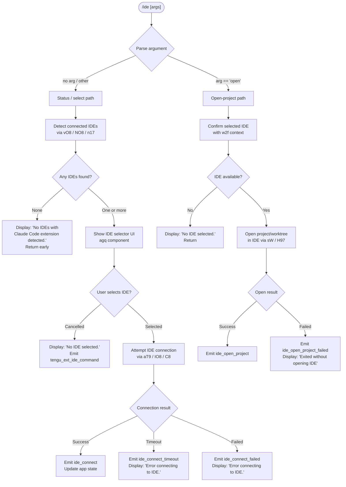

# `/ide`

> Analysis basis: CC v2.1.165 bundle.js (AST extraction + Claude interpretation)
> Minimum version: v2.1.165

---

## Overview

The `/ide` command manages IDE integrations for Claude Code, allowing users to detect connected IDEs with the Claude Code extension, select an active IDE, and optionally open the current project in that IDE. It presents a status panel showing all discovered IDE connections and their connection state, and provides an `open` sub-command to launch the project directly inside the chosen editor.

---

## Registration

| Field | Value |
|---|---|
| type | `local-jsx` |
| name | `ide` |
| description | `Manage IDE integrations and show status` |
| argumentHint | `[open]` |
| module_id | `sgq` |
| load_inline | `true` |
| loc_byte | `11554918` |
| loc_byte_end | `11555074` |
| loc_line | `7529` |
| arbor_handler.name | `w2f` |
| arbor_handler.fqn | `claude-2.1.165::w2f` |
| arbor_handler.kind | `AsyncFunction` |
| arbor_handler.resolution_path | `module_id` |
| arbor_handler.n_hits | `0` |

Analysis basis: CC v2.1.165 bundle.js:+11554918

---

## Input Branching

The command has four distinct primary paths based on the argument supplied and the IDE detection outcome, requiring a flowchart representation.



Analysis basis: CC v2.1.165 bundle.js:+11551034, +11551142, +11551251, +11551389, +11551587, +11551694, +11551984

---

## Behavioral Spec

### Handler Entry Point (`w2f`)

The Arbor-resolved async handler `w2f` is the primary entry point for the `/ide` command. It receives the command arguments, orchestrates IDE detection, UI rendering, and optional project opening.

```
async function ideCommandHandler(args, context):
    emit telemetry("tengu_ext_ide_command")

    isOpenSubcommand = (args[0] == "open")

    detectedIdes = await detectConnectedIdes()          // calls ideDetector
    if detectedIdes is empty:
        display("No IDEs with Claude Code extension detected.")
        return

    selectedIde = await showIdeSelector(detectedIdes)   // calls agq UI component
    if selectedIde is null:
        display("No IDE selected.")
        return

    if isOpenSubcommand:
        await openProjectInIde(selectedIde, context)
    else:
        await connectToIde(selectedIde)
```

Analysis basis: CC v2.1.165 bundle.js:+11551034, +11551156, +11551180, +11551249, +11551422, +11551444

---

### IDE Detection (`vO8` / `NO8` / `n17`)

The detection subsystem enumerates running processes and known socket paths to identify IDE instances that have the Claude Code extension active. On Linux, it issues a `ps aux` shell invocation filtered for known IDE process names. On macOS, it queries a platform-specific mechanism. WSL paths under `/mnt/c/Users` are resolved via `realpath` and filtered to exclude system accounts (`Public`, `Default`, `Default User`, `All Users`).

```
async function detectConnectedIdes():
    emit telemetry("ide_detect")

    candidates = []

    // Platform-specific enumeration
    if platform == "linux":
        raw = shell("ps aux | grep -E 'code|cursor|windsurf|...' | grep -v grep")
        candidates += parseProcessList(raw)
    else if platform == "macos":
        candidates += queryMacOsIdeSockets()

    // Resolve real paths; filter WSL system directories
    resolved = []
    for each candidate in candidates:
        realPath = fs.realpath(candidate.path)
        if realPath not in visited and not isSystemWslPath(realPath):
            resolved.push(candidate)

    if resolved is empty:
        emit telemetry("ide_detect_failed")
        return []

    return resolved
```

Known IDE name tokens matched during detection (from literals):
- `windsurf`, `devin`, `cursor`, `insiders`, `vscode`, `vs code`, `visual studio code`, `vscodium`, `code - oss`, `codium`
- JetBrains IDEs: `jetbrains`, `idea`, `pycharm`, `webstorm`, `phpstorm`, `rubymine`, `clion`, `goland`, `rider`, `datagrip`, `dataspell`, `aqua`, `gateway`, `fleet`, `android-studio`, `appcode`
- Devin Desktop: `Devin Desktop`

Analysis basis: CC v2.1.165 bundle.js:+5415719, +5412273, +5420444, +5417074, +5417138, +5413810

---

### IDE Name Classification (`aT9` / `IO8`)

After a raw IDE process entry is identified, the name is normalised to lowercase and matched against known IDE identifier strings to produce a canonical IDE type label (e.g. `"vscode"`, `"cursor"`, `"windsurf"`, `"devin"`). The basename of the executable path is also extracted for display purposes. On Windows, `.cmd` wrapper executables are handled by stripping the suffix.

```
function classifyIdeName(rawProcessName, executablePath):
    nameLower = rawProcessName.toLowerCase()

    if nameLower.includes("windsurf"):  return "windsurf"
    if nameLower.includes("devin"):     return "devin"
    if nameLower.includes("cursor"):    return "cursor"
    if nameLower.includes("insiders"):  return "insiders"
    if nameLower.includes("vscode") or nameLower.includes("vs code") ...:
                                        return "vscode"
    if nameLower.includes("codium"):    return "vscodium"
    ...

    baseName = path.basename(executablePath)
    if baseName.endsWith(".cmd"):
        baseName = baseName without ".cmd"

    return baseName
```

Analysis basis: CC v2.1.165 bundle.js:+5418514, +5418957, +5419049, +5419127

---

### IDE Connection (`C8` / `S_` / `bTH`)

Once a user selects an IDE from the selector UI, the handler attempts to establish a connection over either a WebSocket (`ws-ide`) or SSE (`sse-ide`) transport. The connection URL is displayed as `"Connecting to <url>"` while in progress.

```
async function connectToIde(selectedIde):
    url = buildConnectionUrl(selectedIde)   // ws: or sse: prefix
    display("Connecting to " + url)

    try:
        result = await ideConnect(selectedIde, timeout=...)
        emit telemetry("ide_connect")
        updateAppState(connectedIde = selectedIde)
    catch TimeoutError:
        emit telemetry("ide_connect_timeout")
        display("Error connecting to IDE.")
    catch Error:
        emit telemetry("ide_connect_failed")
        display("Error connecting to IDE.")
```

Transport identifiers found in literals: `"sse-ide"` (loc +11549021), `"ws-ide"` (loc +11549041), `"ws:"` prefix check (loc +11553947).

Analysis basis: CC v2.1.165 bundle.js:+11553134, +11553207, +11553331, +11553449, +11553947

---

### Open Project Sub-command (`sW` / `H97`)

When the `open` argument is supplied, after IDE selection the handler invokes the IDE's open-project protocol, passing the current working directory (or worktree path when inside a Git worktree). The IDE process receives this as a file path argument via the detected launcher executable.

```
async function openProjectInIde(selectedIde, context):
    projectPath = context.worktreeOrProjectDir

    try:
        await ideOpenProject(selectedIde, projectPath)
        emit telemetry("ide_open_project", {kind: "worktree" or "project"})
    catch Error:
        emit telemetry("ide_open_project_failed")
        display("Exited without opening IDE")
```

Analysis basis: CC v2.1.165 bundle.js:+11551587, +11551621, +11551632, +11551694, +11551984

---

### IDE Selector UI Component (`agq`)

The `agq` React component renders the interactive IDE selection list. It uses `useState`, `useRef`, `useEffect`, and `useCallback` hooks. It reads current IDE connection state from the global app store via `M6` (useSyncExternalStore pattern), renders each detected IDE entry, and calls back into the handler with the user's choice. It also listens for MCP IDE tool events via the `mcp__ide__` prefix.

```
function IdeSelector(detectedIdes, onSelect, onCancel):
    [selectedIndex, setSelectedIndex] = useState(0)
    appState = useAppState()
    connectionState = appState.ideConnectionState

    useEffect(() => {
        // Subscribe to IDE connection events
        // Filter MCP tools matching "mcp__ide__" prefix
    }, [])

    useCallback(handleKeyPress, [selectedIndex])

    render:
        for each ide in detectedIdes:
            render IdeRow(ide, isSelected = (index == selectedIndex))

        if userPressedEnter:   onSelect(detectedIdes[selectedIndex])
        if userPressedEscape:  onCancel()
```

Analysis basis: CC v2.1.165 bundle.js:+11552920, +11552940, +11552991, +11553012, +11553727, +11553820, +11553934

---

### IDE Disconnect Handling

When an IDE connection that was previously established drops, the handler emits a disconnect telemetry event and updates the app state accordingly.

```
function onIdeDisconnect(ideId):
    emit telemetry("ide_disconnect")
    updateAppState(remove ideId from connected IDEs)
```

Analysis basis: CC v2.1.165 bundle.js:+11553830

---

### IDE Status Display — Workspace List (`TAA`)

The `TAA` function (the call-graph entry bridging the registration to the main UI loop) formats the list of connected IDE workspaces for display. It normalises paths using `"NFC"` Unicode normalisation (Analysis basis: CC v2.1.165 bundle.js:+11554517) and truncates lists longer than a threshold (literal `100` at +11554376, threshold `3` at +11554449) with a `", …"` suffix (literal at +11554688). Path separators in the display are joined with `", "` (literal at +11554674).

```
function formatIdeWorkspaceList(workspaces, maxDisplay=3):
    normalised = workspaces
        .map(p => p.normalize("NFC"))
        .slice(0, maxDisplay)

    if workspaces.length > maxDisplay:
        return normalised.join(", ") + ", …"
    else:
        return normalised.join(", ")
```

Analysis basis: CC v2.1.165 bundle.js:+11554376, +11554449, +11554480, +11554505, +11554517, +11554526, +11554674, +11554688

---

## State & Side Effects

| Item | Detail |
|---|---|
| Telemetry: `tengu_ext_ide_command` | Fired at handler entry (loc +11551036) |
| Telemetry: `ide_detect` | Fired when IDE detection begins (loc +5417074) |
| Telemetry: `ide_detect_failed` | Fired when detection finds no IDEs (loc +5417138) |
| Telemetry: `ide_connect` | Fired on successful IDE connection (loc +11553137) |
| Telemetry: `ide_connect_failed` | Fired on connection error (loc +11553224) |
| Telemetry: `ide_connect_timeout` | Fired on connection timeout (loc +11553331) |
| Telemetry: `ide_open_project` | Fired on successful project open (loc +11551587) |
| Telemetry: `ide_open_project_failed` | Fired when IDE exits without opening (loc +11551694) |
| Telemetry: `ide_disconnect` | Fired when an established IDE connection drops (loc +11553830) |
| appState changes | Connected IDE identity written to global app state on successful connection; removed on disconnect |
| MCP tool filter | Selector component filters MCP tool names with `"mcp__ide__"` prefix (loc +11553727) |
| Transport protocols | SSE (`sse-ide`) and WebSocket (`ws-ide`) sockets used for IDE communication |
| File system | IDE socket/lock files read from `~/.claude` directory tree; WSL paths resolved via `realpath` |
| Process scanning (Linux) | `ps aux` shell invocation issued to enumerate running IDE processes |
| Hook registration | `useEffect` in `agq` component subscribes to IDE state changes; cleaned up on unmount |

---

## Version History

| Version | Change |
|---|---|
| v2.1.165 | Initial analysis |

---

## Common Mistakes

1. **Running `/ide open` without a supported IDE running** — If no IDE with the Claude Code extension is detected, the command exits immediately with "No IDEs with Claude Code extension detected." and never shows the open-project prompt.
2. **Cancelling the IDE selector** — Pressing Escape or otherwise dismissing the selector outputs "No IDE selected." without changing any state; no connection attempt is made.
3. **Expecting `/ide` to install the extension** — The command only detects and connects to IDEs where the Claude Code extension is already installed and running; it does not install the extension. The UI may suggest "restart your IDE" if a stale connection is detected (literal at +11552252).
4. **WSL path confusion** — On WSL, only non-system Windows user paths are scanned. IDE sockets under `Public`, `Default`, `Default User`, or `All Users` are silently excluded.
5. **Multiple IDEs open simultaneously** — The selector presents all detected IDEs; failing to select the correct one and instead accepting the default may connect to the wrong editor instance.
6. **Transport mismatch** — The command supports both `ws:` (WebSocket) and SSE transports; firewall or proxy configurations that block WebSocket upgrades will cause `ide_connect_failed` events.

---

## Appendix — Identifier Mapping

> For bundle debugging only. Identifiers change across versions.

| Identifier | Role |
|---|---|
| `TAA` | Workspace list formatter / registration entry bridge |
| `w2f` | Main async IDE command handler (Arbor-resolved) |
| `agq` | IDE selector React UI component |
| `vO8` | IDE detection orchestrator |
| `NO8` | Multi-IDE path resolver (Promise.all over candidates) |
| `n17` | Single IDE socket/path scanner with WSL handling |
| `aT9` | IDE name classifier (lowercase matching) |
| `IO8` | IDE executable basename extractor |
| `C8` | IDE connection initiator |
| `S_` | Connection transport wrapper |
| `bTH` | Low-level IPC / socket connection handler |
| `sW` | IDE open-project launcher |
| `H97` | Project path argument builder for IDE open |
| `ih_` | IDE extension install/open helper |
| `M2f` | IDE list renderer sub-component |
| `b6` | Context/store accessor |
| `bd6` | Store getter with `Cd6.getStore` |
| `X_` | Utility: async context helper (calls `uv`) |
| `v` | Bootstrap / API fetch orchestrator |
| `icK` | Fetch response handler |
| `DXA` | Request construction helper |
| `SH` | JSON serialisation wrapper |
| `J4` | Path/argument normalisation |
| `c2A` | QcK mapping helper |
| `ppH` | Write helper (`C2A`) |
| `acK` | File-backed log / append manager |
| `$pH` | Debounce / flush scheduler |
| `d3H` | Log entry formatter |
| `aL6` | Utility: calls `v8` |
| `s2A` | Log path joiner |
| `a2A` | Log file rotation (stat/rename/unlink) |
| `ocK` | Log append worker (mkdir + appendFile) |
| `j9` | Hook registration (`zXA.register`) |
| `Gw_` | String split/trim/index utility |
| `ZHH` | Set membership check (`c44.has`) |
| `uj` | String replace helper |
| `e1` | Markdown/text parser entry |
| `D6H` | Inline code block parser |
| `yd` | Text line processor |
| `Aq` | Model name normaliser |
| `o0` | Model ID lookup (`q4H`) |
| `_4H` | Model tier classifier |
| `wI` | Model display helper |
| `NQH` | Model alias resolver |
| `NE` | Model provider classifier |
| `SX1` | Model shorthand expander |
| `gM` | Provider type getter |
| `Pe6` | Provider list inclusion check |
| `vQH` | Extended model descriptor |
| `eX` | Text element extractor |
| `r0` | Rich text node renderer |
| `s6` | Sub-command dispatcher |
| `c` | Core shell/exec utility |
| `P6` | Process runner |
| `Nu6` | Process output collector |
| `D` | Force-shutdown handler |
| `IJ` | Shutdown logger |
| `z` | Daemon lifecycle controller |
| `hH` | Daemon sub-process launcher |
| `RH` | Daemon restart handler |
| `Yh` | Daemon stop logic |
| `Au` | Shutdown finaliser (`fC`) |
| `QNH` | Daemon stop emitter |
| `zX_` | Random-UUID event emitter |
| `Tp` | Graceful shutdown with timeout |
| `Ac` | MCP server shutdown |
| `fc` | Timeout clear on shutdown |
| `l8` | Timed abort helper |
| `w` | Session/worker manager |
| `vb8` | macOS memory check |
| `D6` | Session dispatcher |
| `Hj6` | Dispatch record builder |
| `_j6` | Dispatch validator |
| `qu` | Session queue entry |
| `B98` | Dedup-set tracker |
| `y6` | Session state update |
| `zX6` | Pin file reader |
| `fT_` | Pin file path builder |
| `cE` | Config directory resolver |
| `B6` | JSON parser wrapper |
| `R8` | Error classifier (`v8`) |
| `v8` | ENOENT / EISDIR error handler |
| `PBL` | Directory-based pin scanner |
| `K` | Directory entry padder |
| `pL9` | Pin write helper (mkdir + write) |
| `kH` | MCP tool renderer |
| `g` | Worker process controller |
| `x` | Interval clearer |
| `L4H` | Output line trimmer |
| `SHH` | Output slicer |
| `C` | Event enqueue dispatcher |
| `deq` | Event dequeue |
| `I` | File watcher (chokidar) |
| `S6` | Async utility (`uv`) |
| `Q` | Output write throttler |
| `F` | Timeout/flag holder |
| `Y` | Supervisor write manager |
| `p` | Timeout clear + write |
| `j` | Worker kill enumerator |
| `R` | Worker restart handler |
| `VDA` | Spare-session claim orchestrator |
| `AMA` | Claim file writer |
| `Vh6` | Auth directory path builder |
| `r_A` | Auth token path resolver |
| `EH` | String coercion wrapper |
| `D55` | Claim-send timeout handler |
| `w55` | Socket claim sender |
| `Y55` | Claim frame builder |
| `tf` | `v8` thin wrapper |
| `f` | Socket lifecycle manager |
| `L` | Promise-tracked socket set |
| `zg` | Binary frame encoder |
| `hDA` | Session attachment handler |
| `yK` | Socket path builder |
| `e9` | Job state file reader |
| `jY` | Active-job helper (`$N`) |
| `$N` | Job active-state check |
| `ff` | Job file writer |
| `MY` | Atomic file writer |
| `oj` | Job file deleter |
| `q16` | Roster reader + watcher |
| `Pg` | Roster file parser |
| `gXf` | Roster directory initialiser |
| `kMH` | PTY-pids path builder |
| `abH` | PTY auth path builder |
| `VT` | PTY split path parser |
| `Xg` | PTY socket path builder |
| `l_A` | PTY socket base resolver |
| `_16` | PTY path joiner |
| `XM` | Context/store helper |
| `vO8` | IDE detection orchestrator |
| `NO8` | Multi-path IDE resolver |
| `n17` | IDE socket scanner (per-user) |
| `s1` | Permission error handler |
| `c17` | IDE entry constructor |
| `_5_` | Process record parser |
| `S_` | IDE connection transport |
| `eH` | String display formatter |
| `eq9` | Regex match helper |
| `G` | Platform/OS accessor |
| `sk6` | Platform string getter |
| `XK6` | OS name getter |
| `X` | Socket stream handler |
| `J` | Worker write stream |
| `J5` | Stream end + JSON serialiser |
| `T55` | Full daemon protocol handler |
| `Z55` | Yield/lease sub-handler |
| `$` | Output pipe stream |
| `M` | Message router |
| `Wz` | Background service error wrapper |
| `IDA` | Protocol ID allocator |
| `QuK` | Keepalive / ping handler |
| `P` | Terminal repaint controller |
| `kHH` | Symlink scan helper |
| `Ib8` | Session upgrade checker |
| `G55` | Stall detector |
| `V` | Render frame buffer |
| `$9H` | Scroll/resize helper |
| `E55` | Worker stall respawn |
| `y` | Away-summary scheduler |
| `n` | Voice recording toggle |
| `s` | MCP skills updater |
| `d` | Scheduled task runner |
| `r` | MCP update applier |
| `l` | MCP watcher manager |
| `Rx6` | Socket write/destroy helper |
| `W` | MCP server connection manager |
| `nT9` | Process kill helper |
| `sT9` | IDE name replace helper |
| `sW` | IDE open-project launcher |
| `Q1` | String index/slice utility |
| `aT9` | IDE name classifier |
| `IO8` | IDE executable name extractor |
| `C8` | IDE connection initiator |
| `ih_` | IDE open helper dispatcher |
| `H97` | IDE open argument builder |
| `tP` | Terminal process spawner |
| `bTH` | IPC transport handler |
| `As` | IDE extension install advisor |
| `M2f` | IDE list render helper |
| `agq` | IDE selector React component |
| `M6` | App-state store hook |
| `XG_` | App-state context accessor |
| `qA` | Secondary state context hook |
| `Ef` | External store sync hook |
| `mk` | MCP command hash builder |
| `$A6` | VXH hash invoker |
| `VXH` | SHA-256 command hasher |
| `FN` | MCP skill registry |
| `O` | Background session sentinel |
| `b8` | Background session flag |