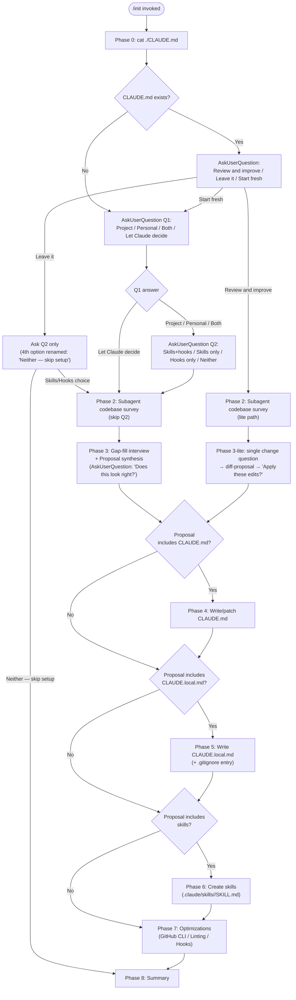

# `/init`

> Analysis basis: CC v2.1.165 bundle.js (AST extraction + Claude interpretation)
> Minimum version: v2.1.165

---

## Overview

`/init` is a guided onboarding command that creates and maintains `CLAUDE.md` project-memory files, optional skills (`.claude/skills/`), and lifecycle hooks (`.claude/settings.json` / `.claude/settings.local.json`) for the current repository. It operates as an eight-phase conversational workflow: it first inspects the working tree for an existing `CLAUDE.md`, interviews the user through structured `AskUserQuestion` calls, performs a subagent codebase survey, proposes a set of artifacts for approval, then writes the approved files, and closes with a summary and prioritised to-do list. The prompt body is selected conditionally at runtime between two template variables (`P2f`, 20 920 chars; `X2f`, 1 592 chars), making the richer multi-phase flow the primary path.

---

## Registration

| Field | Value |
|---|---|
| `type` | `prompt` |
| `name` | `init` |
| `description` | `Initialize new CLAUDE.md file(s) and optional skills/hooks with codebase documentation \| Initialize a new CLAUDE.md file with codebase documentation` |
| `loc_byte` | `11578257` |
| `loc_byte_end` | `11578650` |
| `loc_line` | `7771` |
| `handler_method` | `getPromptForCommand` |
| `handler_method_start` | `11578573` |
| `handler_method_end` | `11578649` |
| `prompt_body.length` | `22519` characters |
| `prompt_body.trace` | `conditional; identifier→P2f (var template, 20920 chars); identifier→X2f (var template, 1592 chars)` |
| `arbor_handler.name` | `getPromptForCommand` |
| `arbor_handler.fqn` | `claude-2.1.165::getPromptForCommand` |
| `arbor_handler.kind` | `Method` |
| `arbor_handler.resolution_path` | `direct` |
| `arbor_handler.n_hits` | `2` |

Analysis basis: CC v2.1.165 bundle.js:+11578257

---

## Input Branching

The command has more than three distinct execution branches (existing CLAUDE.md vs. none; user scope selection; "Let Claude decide" shortcut; "Review and improve" vs. "Start fresh" vs. "Leave it"), so a Mermaid flowchart is used.



---

## Behavioral Spec

### Phase 0 — Existence Check

```
function checkExistingClaudeMd():
    content = readFile("./CLAUDE.md")   // only the project-root file
    return content != null              // true → branch to existing-file flow
```

The check is intentionally shallow: only the project-root `CLAUDE.md` counts; subdirectory files are ignored at this stage.

Analysis basis: CC v2.1.165 bundle.js:+11578257

---

### Phase 1 — User Intent Interview

```
function collectUserIntent(claudeMdExists):
    printPrimer()   // educates first-time users on CLAUDE.md / Skills / Hooks concepts

    if claudeMdExists:
        choice = askUserQuestion("I found an existing CLAUDE.md. What would you like to do?",
                                 options=["Review and improve it",
                                          "Leave it, set up other things",
                                          "Start fresh (replace it)"])
        return routeExistingFile(choice)   // see flowchart

    q1 = askUserQuestion("Which CLAUDE.md files should /init set up?",
                         options=["Project CLAUDE.md",
                                  "Personal CLAUDE.local.md",
                                  "Both project + personal",
                                  "Let Claude decide"])

    if q1 == "Let Claude decide":
        return {scope: "project", skipSkillsHooks: false, autoApprove: true}

    q2 = askUserQuestion("Also set up skills and hooks?",
                         options=["Skills + hooks", "Skills only",
                                  "Hooks only", "Neither, just CLAUDE.md"])
    return {scope: q1, skillsHooksHint: q2}
```

Key rule: `Q1` and `Q2` are **never sent in the same `AskUserQuestion` call**; `Q2` is suppressed entirely when the user picks "Let Claude decide".

Analysis basis: CC v2.1.165 bundle.js:+11578257

---

### Phase 2 — Codebase Survey (Subagent)

```
function surveyCodebase():
    files = [
        "package.json", "Cargo.toml", "pyproject.toml", "go.mod", "pom.xml",
        "README*", "Makefile", "*.build", "CI config",
        "CLAUDE.md", ".claude/rules/", "AGENTS.md",
        ".cursor/rules", ".cursorrules",
        ".github/copilot-instructions.md",
        ".devin/rules/", ".windsurf/rules/", ".windsurfrules", ".clinerules",
        ".mcp.json"
    ]
    launch subagent to read files and detect:
        - build / test / lint commands (especially non-standard)
        - language, framework, package manager
        - project structure (monorepo / multi-module / single)
        - non-default code style rules
        - gotchas, required env vars, workflow quirks
        - existing .claude/skills/ and .claude/rules/ directories
        - formatter config (prettier, biome, ruff, black, gofmt, rustfmt, unified script)
        - git worktrees: run `git worktree list`
    record what CANNOT be determined from code alone   // becomes Q3+ material
```

Analysis basis: CC v2.1.165 bundle.js:+11578257

---

### Phase 3 — Gap-Fill Interview and Proposal Synthesis

```
function gapFillAndPropose(scope, surveyFindings, unknowns):
    // Ask only what the code cannot answer
    if scope includes "project":
        interview(topics=["non-obvious commands", "branch/PR conventions",
                          "required env setup", "testing quirks"])
    if scope includes "personal":
        interview(topics=["user role", "familiarity level",
                          "sandbox URLs/test accounts",
                          "worktree layout (if multiple found)",
                          "communication preferences"])

    // Classify each finding into artifact type
    for finding in surveyFindings + interviewAnswers:
        if finding is deterministic fast per-edit shell command:
            propose Hook
        elif finding is repeatable multi-step on-demand workflow:
            propose Skill
        else:
            propose CLAUDE.md note

    printProposal()   // printed as normal assistant text, not in tool `preview`
    approval = askUserQuestion("Does this look right?",
                               options=["Looks good — proceed",
                                        "Drop the hook", "Drop the skill", ...])
    buildPreferenceQueue(approvedItems)   // feeds Phases 4-7
```

The preference queue entries carry `{type, description, targetFile, phase2Details}`. Deviation from the user's Q2 hint is flagged in one line at the top of the proposal before proceeding.

Analysis basis: CC v2.1.165 bundle.js:+11578257

---

### Phase 4 — Write or Patch CLAUDE.md

```
function writeClaudeMd(path, surveyFindings, noteQueue, mode):
    if mode == "review_and_improve":
        existing = readFile(path)
        diffs = computeDiffs(existing, surveyFindings, phase3LiteAnswer)
        printDiffs()           // each diff has a one-line reason
        confirm = askUserQuestion("Apply these edits?",
                                  options=["Apply all", "Let me pick which",
                                           "Skip — leave it as is"])
        if confirm == "Skip":
            return

    content = buildMinimalContent(surveyFindings, noteQueue):
        // Include ONLY lines that pass: "Would removing this cause mistakes?"
        include: non-standard build/test/lint commands
        include: non-default code style rules
        include: testing quirks and single-test invocation
        include: repo etiquette (branch naming, PR, commit style)
        include: required env vars and setup steps
        include: non-obvious gotchas / architectural decisions
        include: important content from AGENTS.md / .cursor/rules / Copilot instructions
        include: team-level note entries from preference queue
        exclude: file-by-file component lists
        exclude: standard language conventions
        exclude: generic advice
        exclude: frequent-change data (use @path/to/import references instead)
        exclude: long tutorials (use @path/to/import or Skills)
        exclude: manifest-obvious commands

    prefix = "# CLAUDE.md\n\nThis file provides guidance to Claude Code " +
             "(claude.ai/code) when working with code in this repository.\n"
    writeFile(path, prefix + content)

    if projectHasMultipleConcerns:
        suggestRulesDirectory(".claude/rules/")   // e.g. code-style.md, testing.md
    if projectIsMonorepoOrMultiModule:
        offerSubdirectoryClaudeMdFiles()
```

Analysis basis: CC v2.1.165 bundle.js:+11578257

---

### Phase 5 — Write CLAUDE.local.md

```
function writeClaudeLocalMd(projectRoot, worktreeLayout, noteQueue):
    localPath = projectRoot + "/CLAUDE.local.md"

    if fileExists(localPath):
        existing = readFile(localPath)
        proposeAdditionsOnly()   // never silently overwrite

    if worktreeLayout == "sibling_or_external":
        homeFile = "~/.claude/<project-name>-instructions.md"
        writeFile(homeFile, personalContent(noteQueue))
        stub = "@" + homeFile
        writeFile(localPath, stub)
        // Never embed this import in project CLAUDE.md
    else:
        writeFile(localPath, personalContent(noteQueue))

    addToGitignore("CLAUDE.local.md")
```

Personal content includes: user role, familiarity level, sandbox URLs/accounts, communication preferences — only what makes responses noticeably better.

Analysis basis: CC v2.1.165 bundle.js:+11578257

---

### Phase 6 — Create Skills

```
function createSkills(skillQueue, surveyFindings):
    // 1. Consume queued skill preferences
    for pref in skillQueue:
        name = deriveNameFromPreference(pref)
        body = buildBodyFromUserWordsAndSurvey(pref, surveyFindings)
        if pref maps to existing bundled skill:
            notifyUser("bundled skill still exists; yours is additive")
        if pref is underspecified:
            askFollowUp(pref)
        writeFile(".claude/skills/" + name + "/SKILL.md",
                  yamlFrontmatter(name, description) + body)

    // 2. Suggest additional skills from survey
    for finding in surveyFindings:
        if finding is referenceKnowledgeOrRepeatableWorkflow:
            suggestSkill(name, purpose, reason)

    // Never overwrite existing .claude/skills/ entries
```

For skills with side effects, `disable-model-invocation: true` and `$ARGUMENTS` are added to the frontmatter.

Analysis basis: CC v2.1.165 bundle.js:+11578257

---

### Phase 7 — Environment Optimizations and Hooks

```
function suggestOptimizations(hookQueue, surveyFindings, phase1Scope):
    // GitHub CLI check
    ghPath = runShell("which gh")   // "where gh" on Windows
    if ghPath is missing AND remoteUsesGitHub:
        askUserQuestion("Install GitHub CLI?", explain="lets Claude help with PRs/issues")

    // Linting check
    if surveyFindings.lintConfig is missing:
        askUserQuestion("Set up linting?", explain="fast feedback on edits")

    // Hook construction (from approved proposal queue)
    if hookQueue is not empty OR (surveyFindings.formatter AND hookQueue has no formatHook):
        loadHookReference()   // invoke Skill tool: skill='update-config', args='[hooks-only] ...'
                              // called ONCE per /init run; subsequent hooks reuse context

        for hook in hookQueue:
            targetFile = resolveTargetFile(phase1Scope):
                // project → .claude/settings.json
                // personal → .claude/settings.local.json
                // both/ambiguous → ask once for all hooks

            event, matcher = mapPreferenceToEvent(hook.preference):
                // "after every edit" → PostToolUse / Write|Edit
                // "when Claude finishes" → Stop
                // "before running bash" → PreToolUse / Bash
                // "before committing" → NOT a hooks entry; route to git pre-commit

            followConstructingAHookFlow():
                dedupCheck()
                constructForProject()
                pipeTestRaw()
                wrapHook()
                writeJson(targetFile)
                validateWithJq()
                liveProof()    // only for Pre|PostToolUse on triggerable matchers
                cleanup()
                handoff()
```

Analysis basis: CC v2.1.165 bundle.js:+11578257

---

### Phase 8 — Summary and Next Steps

```
function summarizeAndSuggest(writtenFiles, surveyFindings):
    printRecap(writtenFiles)   // which files were written and key points of each
    remindUser("These files are a starting point; run /init again anytime to re-scan.")

    toDoList = []
    if frontendFrameworkDetected (React, Vue, Svelte, etc.):
        toDoList.add("/plugin install frontend-design@claude-plugins-official")
        toDoList.add("/plugin install playwright@claude-plugins-official")
    if phase7GapsRejected:
        toDoList.add(rejectedItems with one-line rationale)
    if testsMissingOrSparse:
        toDoList.add("Set up a test framework")
    toDoList.add("/plugin install skill-creator@claude-plugins-official")   // always
    toDoList.add("Browse plugins with /plugin")                              // always

    printSortedByImpact(toDoList)
```

The telemetry event `onboarding_project_complete` (bundle.js:+4024586) is fired upon successful completion, indicating this phase marks the end of the init workflow.

Analysis basis: CC v2.1.165 bundle.js:+4024586

---

### Handler Dispatch and Prompt Template Selection

```
function getPromptForCommand(context):
    // Arbor-resolved handler: getPromptForCommand (direct resolution)
    // Two template variables are candidates:
    //   P2f  — full multi-phase prompt  (20920 chars)
    //   X2f  — condensed fallback prompt (1592 chars)
    // Selection is conditional on context flags evaluated at call time.

    template = selectTemplate(context)   // conditional branch; P2f is primary path
    return buildPromptText(template, context)
```

The handler is an `ObjectMethod` (`handler_method: "getPromptForCommand"`) inlined directly on the registration object. Arbor resolved it via `direct` path with `n_hits: 2`.

Analysis basis: CC v2.1.165 bundle.js:+11578573 – +11578649

---

### Config I/O and File Safety (callGraph support functions)

```
function saveConfigWithLock(configPath, newConfig, cachedConfig):
    acquireLock(configPath, timeout=60000ms)       // contention fires tengu_config_lock_contention
    if lockTookTooLong:                            // threshold: 100 iterations
        warn("Lock acquisition took longer than expected - another Claude instance may be running")

    reRead = readFileSync(configPath, "utf-8")
    if reRead is missing auth that cachedConfig has:
        emit("tengu_config_auth_loss_prevented")   // refuse write; see GH #3117
        return

    if reRead differs from cachedConfig unexpectedly:
        emit("tengu_config_stale_write")

    backupExistingFile(configPath):
        // Keeps up to 5 backups in a "backups" sub-directory
        // Backup filenames contain ".backup." marker and a timestamp
        // Files starting with "." are excluded from backup rotation

    writeAtomic(configPath, newConfig):
        // Uses temp file + rename for crash safety
        // Applies original file permissions via fchmodSync
        // Syncs to disk with fsyncSync before rename

function readConfig(configPath):
    if accessedBeforeAllowed:
        throw Error("Config accessed before allowed.")
    content = readFileSync(configPath, "utf-8")
    if parseError:
        emit("tengu_config_parse_error")
    return parsed
```

Maximum backup rotation count: **5** (bundle.js:+3260907). Lock acquisition warning threshold: **100 iterations** (bundle.js:+3259882). Lock timeout: **60 000 ms** (bundle.js:+3260658).

Analysis basis: CC v2.1.165 bundle.js:+3259977, +3260113, +3260456, +3261915, +3262004

---

### CLAUDE.md Target Path Resolution

```
function resolveClaudeMdPath(workspaceRoot):
    // Literal "CLAUDE.md" is concatenated with IK9.join(workspaceRoot, "CLAUDE.md")
    // Falls back to workspace-level lookup when no project root is found
    return path.join(workspaceRoot, "CLAUDE.md")
```

The string literal `"CLAUDE.md"` appears at bundle.js:+4024074 alongside `"workspace"` (+4024112), confirming the path is always relative to the detected workspace root.

Analysis basis: CC v2.1.165 bundle.js:+4024060, +4024074

---

### Feature-Flag Gate (Growthbook / Slate Harbor)

```
function featureGate(featureName, context):
    // tengu_slate_harbor_experiment is emitted when the experiment path is evaluated
    // Uses a Set-based dedup (DX_.has / DX_.add) to prevent double-counting
    // Experiment events carry {type: "firstParty", name: "GrowthbookExperimentEvent"}
    // Emitted on Vo event bus with event "growthbook_experiment"
    result = lookupFeatureFlag(featureName, context)
    if not alreadyRecorded(featureName):
        recordExperiment(featureName, result)
        emitToEventBus("growthbook_experiment", payload)
    return result
```

The `tengu_slate_harbor_experiment` event (bundle.js:+11555148) indicates `/init` participates in at least one A/B experiment, which likely controls the template selection between `P2f` and `X2f`.

Analysis basis: CC v2.1.165 bundle.js:+11555148, +3232682

---

## State & Side Effects

| Item | Detail |
|---|---|
| Telemetry — `tengu_config_parse_error` | Fired when `~/.claude.json` or a project config file fails JSON parsing (bundle.js:+3262552) |
| Telemetry — `tengu_config_lock_contention` | Fired when config write-lock cannot be acquired promptly (bundle.js:+3259977) |
| Telemetry — `tengu_config_stale_write` | Fired when the on-disk config has changed between read and write (bundle.js:+3260113) |
| Telemetry — `tengu_config_auth_loss_prevented` | Fired when a write is refused to protect cached auth tokens; see GH #3117 (bundle.js:+3260456) |
| Telemetry — `tengu_feature_sad` | Fired on a failed feature-flag evaluation (bundle.js:+1010365) |
| Telemetry — `tengu_feature_ok` | Fired on a successful feature-flag evaluation (bundle.js:+1010222) |
| Telemetry — `tengu_slate_harbor_experiment` | Fired when the Slate Harbor A/B experiment branch is evaluated (controls template selection) (bundle.js:+11555148) |
| Literal — `onboarding_project_complete` | Event emitted at Phase 8 completion (bundle.js:+4024586) |
| Files written | `./CLAUDE.md`, `./CLAUDE.local.md`, `.claude/skills/<name>/SKILL.md`, `.claude/settings.json` or `.claude/settings.local.json` (conditional on user approval) |
| `.gitignore` mutation | `CLAUDE.local.md` entry appended when Phase 5 writes the personal file |
| Config backups | Up to 5 timestamped backups stored in a `backups/` subdirectory beside the config file |
| File-system locking | Atomic write via temp file + rename; `fsyncSync` before rename; original permissions restored via `fchmodSync` |
| Hook registration | Hooks written to `.claude/settings.json` (project) or `.claude/settings.local.json` (personal) as JSON; validated with `jq -e` after write |
| Event bus | Growthbook experiment results emitted on internal `Vo` event bus as `growthbook_experiment` |
| appState changes | Onboarding state updated upon completion via project-config save path |
| Sound | <!-- TODO: not found in depth-2 traversal; needs --depth 4 --> |

---

## Version History

| Version | Change |
|---|---|
| v2.1.165 | Initial analysis — eight-phase workflow with conditional prompt template (`P2f` 20 920 chars / `X2f` 1 592 chars), Growthbook A/B gate, atomic config writes with GH-#3117 auth-loss guard |

---

## Common Mistakes

1. **Running `/init` inside a subdirectory** — Phase 0 checks only `./CLAUDE.md` at the working directory, not the repository root. If invoked from a subdirectory, it may create a nested `CLAUDE.md` rather than updating the project-root file.
2. **Expecting `/init` to be non-interactive** — the command always calls `AskUserQuestion` at least once (Phase 1). Piping input or scripting the CLI will stall at the first prompt.
3. **Choosing "Let Claude decide" when needing a personal file** — that option forces scope to project-only and skips Q2; a `CLAUDE.local.md` will not be offered.
4. **Assuming Q1 and Q2 are asked together** — they are always separate `AskUserQuestion` calls; Q2 is omitted entirely on the "Let Claude decide" path.
5. **Manually editing `.claude/settings.json` hooks after `/init`** — the atomic write path creates a backup before overwriting; hand-edits between a hook write and the `jq -e` validation step may be overwritten by the dedup-then-write flow.
6. **Treating the generated CLAUDE.md as permanent** — the prompt explicitly tells the agent these files are a starting point; re-running `/init` will re-survey the codebase and propose updates via the "Review and improve" path.
7. **Expecting "before committing" hooks to be written to `.claude/settings.json`** — the command explicitly routes git-commit gates to `.git/hooks/pre-commit` (or husky / pre-commit framework) instead, because Claude hooks cannot filter Bash by command content.

---

## Appendix — Identifier Mapping

> For bundle debugging only. Identifiers change across versions.

| Identifier | Role |
|---|---|
| `__handler_init` | Synthetic BFS entry point for the `/init` command handler (not a real bundle symbol) |
| `snH` | Top-level init orchestrator called from the handler; coordinates sub-functions |
| `oO` | File-watcher / config-read helper called by the orchestrator |
| `y6` | Config file read-and-parse routine (reads UTF-8, handles ENOENT) |
| `Q6` | Logging / debug output utility |
| `kX_` | Config schema validation helper |
| `bDH` | Config read with lock-guard; performs backup rotation (up to 5 backups) |
| `WTL` | File-watch setup/teardown wrapper (watchFile / unwatchFile) |
| `kK9` | CLAUDE.md path resolver; joins workspace root with `"CLAUDE.md"` |
| `ME_` | Workspace root locator; calls path-join and existence checks |
| `b6` | Module-export helper (calls `bd6`, `X_`) |
| `td6` | Config accessor wrapper (calls `Q6`, `R8`) |
| `YY` | Project-config write coordinator; calls file-writer and save helpers |
| `CX_` | Core config-save-with-lock implementation; handles dedup, backup, atomic write |
| `_` | Generic utility / string helper |
| `L` | Async operation tracker (add / delete with finally cleanup) |
| `XP1` | Object-merge / assign helper (calls `Object.assign`) |
| `v` | Log-level / severity classifier |
| `c` | Application state accessor |
| `v8` | Error construction / wrapping helper |
| `fj6` | Auth-loss guard check (GH #3117 protection) |
| `A` | String case-normaliser (toLowercase) |
| `SH` | JSON serialiser (`JSON.stringify` wrapper) |
| `bX_` | Backup directory path builder (`"backups"` literal) |
| `V` | Path-prefix filter (startsWith check) |
| `P` | Editor / input widget controller (cursor, scroll, slice) |
| `T` | Backup entry list manager (slice for rotation) |
| `TM6` | Atomic file writer (temp file + rename + fsync + fchmod) |
| `f` | Async close / cleanup handler |
| `H` | Bootstrap HTTP fetch helper (`[Bootstrap] Fetching`) |
| `e$` | Cache lookup for bootstrapped data |
| `Gw_` | String splitter / trimmer for config field parsing |
| `ZHH` | Feature-flag set membership checker |
| `uj` | String replacement utility |
| `e1` | Diff / patch applier for config updates |
| `s6` | Feature-flag evaluation routine (ok/sad telemetry) |
| `_lH` | Project config field extractor |
| `t98` | Timestamp generator (`Date.now` wrapper) |
| `RX_` | Project-config write path (calls atomic writer `TM6`) |
| `hH` | Feature-flag ok-path handler |
| `P6` | Feature-flag result normaliser (calls `Nu6`) |
| `Nu6` | Feature-flag raw-value parser |
| `J2f` | Experiment / A/B gate evaluator (fires `tengu_slate_harbor_experiment`) |
| `eH` | String coercion utility (`String(...)`) |
| `D6` | Growthbook experiment resolver (Set-based dedup via `yDH`, `tw6`, `eU`) |
| `Hj6` | Experiment variant lookup |
| `_j6` | Experiment config reader |
| `qu` | Experiment context builder |
| `Au` | Feature-config loader (`fC`) |
| `B98` | Experiment record-and-emit function (fires `growthbook_experiment`) |
| `YX_` | Experiment event constructor (UUID, `GrowthbookExperimentEvent`, `Vo.emit`) |
| `XX_` | Experiment dedup tracker (calls `fm1`, `e_`, `oi1`, `ZHH`) |

---

Note: index built via Arbor fallback; some signals (telemetry, literals) may be missing — see arbor-fallback.js.