# `/insights`

> Analysis basis: CC v2.1.165 bundle.js (AST extraction + Claude interpretation)
> Minimum version: v2.1.165

---

## Overview

The `/insights` command generates a shareable HTML usage-analysis report from the user's Claude Code session data stored on disk, then instructs the agent to echo a fixed confirmation message verbatim. The command collects session facets from the local filesystem, assembles statistics and visualisations into `report.html`, and passes the completed report's path along with an at-a-glance summary to the agent via the `getPromptForCommand` handler, which in turn issues a single canned reply pointing the user to the report.

---

## Registration

| Field | Value |
|---|---|
| type | `prompt` |
| name | `insights` |
| description | `Generate a report analyzing your Claude Code sessions` |
| loc_byte | `13149745` |
| loc_byte_end | `13151049` |
| loc_line | `10595` |
| handler_method | `getPromptForCommand` |
| handler_method_start | `13149919` |
| handler_method_end | `13151048` |
| prompt_body.length | `513` |
| prompt_body.trace | `call→v5K(...) (1 literals)` |
| arbor_handler.name | `getPromptForCommand` |
| arbor_handler.fqn | `claude-2.1.165::getPromptForCommand` |
| arbor_handler.kind | `Method` |
| arbor_handler.resolution_path | `direct` |
| arbor_handler.n_hits | `1` |

Analysis basis: CC v2.1.165 bundle.js:+13149745

---

## Input Branching

The command takes no user-supplied arguments. Control flow has more than three distinct paths inside the data-collection pipeline (`N5K`), so a Mermaid flowchart is used.

```mermaid
flowchart TD
    A(["/insights invoked"]) --> B["getPromptForCommand called\n(handler_method_start: +13149919)"]
    B --> C["collectInsightsData — N5K\n(+13150018)"]

    C --> D["listProjectDirs — iBf\n(+13136682)\nreaddir projects root,\nfilter directories"]
    D --> E{"Sessions found?"}
    E -- "0 sessions" --> F["Return '_No insights generated_' literal\n(+13150816)"]
    E -- "≥1 sessions" --> G["Slice to most-recent 50 sessions\n(+13136701–13136706)\nwith setImmediate yield (+13136589)\nand sort (+13136613)"]

    G --> H["For each session (parallel Promise.all +13136778):\nreadSessionData — uBf (+13136835)\nread session-meta JSON, parse via B6/JSON.parse"]
    H --> I{"Session file\nreadable?"}
    I -- "No / parse error" --> J["Skip session; push null\n(+13136897)"]
    I -- "Yes" --> K["Accumulate session record\n(+13136926 → M.push)"]

    K --> L["buildFacets — nb8 (+13137285)\nCompute per-session facets:\nv1H state-machine over JSONL messages,\nr5K relink walk, yFf chain sorting,\ny5H validation checks"]
    L --> M["Generate report sections — lBf (+13138661)\nHTML rendering:\nz$H time-of-day chart (+13092500)\nQBf response-time histogram (+13093225)\ndBf tool-error section (+13093932)\ncBf/SH JSON→HTML serialisation (+13094428)"]

    M --> N["writeReport — mBf or xBf\n(+13137523 / +13138360)\nnS.mkdir + nS.writeFile → report.html\n(literal: 'report.html' +13138939)"]
    N --> O["writeReportDataFiles — BBf (+13138650)\nnS.writeFile per facet slice\n(Promise.all +13089238)"]
    O --> P["Build at-a-glance summary string — pBf (+13138219)\n(literal: 'at_a_glance' +13089879)"]

    P --> Q["Compose prompt via v5K\n(+13150951)\nInject: insights data, report URL,\nHTML file path, facets dir,\nat-a-glance summary (+13150306 Math.round)"]
    Q --> R["SH / JSON.stringify serialise (+13150969)"]
    R --> S["lb8 — resolve output path (+13151015)"]
    S --> T["Agent emits canned &#60;message&#62; block verbatim\n(getPromptForCommand instructs\n'Output the text between message tags verbatim')"]
    T --> U([Done — user sees report ready confirmation])
    F --> U
```



---

## Behavioral Spec

### 1 — Top-level handler: `getPromptForCommand`

The handler is an inline `ObjectMethod` on the registration object; Arbor resolved it directly (`resolution_path: direct`, `n_hits: 1`).

```
async function getPromptForCommand(context):
    result = await collectInsightsData(context)    // N5K, +13150018

    if result is empty / no sessions:
        summaryText = "_No insights generated_"    // literal +13150816
    else:
        summaryText = result.atAGlance             // built by pBf, +13089879

    separatorLiteral = " · "                       // literal +13150377
    roundedMetric = Math.round(result.metric)      // +13150306

    promptText = buildPromptString(               // v5K, +13150951
        insightsData   = result.data,
        reportURL      = result.reportURL,
        htmlFile       = result.htmlFilePath,
        facetsDir      = result.facetsDir,
        atAGlance      = summaryText
    )

    serialised = jsonStringify(promptText)         // SH, +13150969
    outputPath = resolveOutputPath()               // lb8, +13151015

    // Agent is told to output the <message> block verbatim — no deviation
    return promptText
```

Analysis basis: CC v2.1.165 bundle.js:+13149919

---

### 2 — Session discovery: `listProjectDirs` (`iBf`)

```
async function listProjectDirs(rootDir):
    entries = await fs.readdir(rootDir)            // nS.readdir, +13136309
    dirs    = entries.filter(e => e.isDirectory()) // _.filter + K.isDirectory, +13136363/+13136377
    joined  = dirs.map(d => path.join(rootDir, d)) // Ug.join, +13136403

    for each dir in joined:
        jsonlFiles = await listJsonlFiles(dir)     // Hq6, +13136467
        push results                               // q.push, +13136494

    yield via setImmediate()                       // +13136589  (prevents blocking event loop)
    dirs.sort(...)                                 // q.sort, +13136613
    return dirs
```

- JSONL file detection (`Hq6`) reads a subdirectory, filters entries where `K.isFile` is true and filename matches pattern tested by `DF` / `PD7.test`, and collects matching basenames (`.jsonl` extension literal, +13222401).
- Analysis basis: CC v2.1.165 bundle.js:+13136682

---

### 3 — Session data loading: `readSessionData` (`uBf`)

```
async function readSessionData(sessionDir):
    metaPath   = path.join(sessionDir, "session-meta")  // literal +13075730; via ZfA/qC6
    usagePath  = path.join(sessionDir, "usage-data")    // literal +13075634; via qC6/a8

    metaRaw  = await fs.readFile(metaPath, "utf-8")     // nS.readFile +13081741; encoding +13081765
    metaJson = parseJSON(metaRaw)                       // T5K + B6/JSON.parse, +13081782/+13081786

    // On parse failure B6 propagates the error; caller skips the session
    return { meta: metaJson, usagePath }
```

- Sub-directory layout expected: `<projects root>/<project>/<session>/session-meta` and `usage-data`.
- Analysis basis: CC v2.1.165 bundle.js:+13081698

---

### 4 — Facet computation: `buildFacets` (`nb8`)

The facet pipeline operates over the loaded session records and produces structured statistics used by the HTML renderer.

```
function buildFacets(sessions, stateStore):
    for each session in sessions:
        v1H(session, stateStore)          // state-machine: maps messages into typed slots
                                          // slots: summary, last-prompt, custom-title,
                                          //        ai-title, tag, agent-name, agent-color,
                                          //        agent-setting, mode, permission-mode,
                                          //        worktree-state, pr-link, etc.
                                          // literals +13209106 … +13210757

    chainValidation(stateStore)           // y5H: validates parent-uuid chains, +13189276
    chainSort(stateStore)                 // yFf: sorts chains by timestamp, +13190426
    relinkWalk(stateStore)                // r5K: repairs broken parent links, +13187345
    groupByProject(stateStore)            // YMK: groups sessions under project keys, +13189685

    // Collect per-session event records
    facetRecords = []
    for each session:
        record = buildSessionEventRecord(session)   // e66/H.map, +13187224
        facetRecords.push(record)

    // Compute aggregate stats
    stats = aggregateStats(facetRecords)  // ofA / mS6, +13186525
    return { facetRecords, stats, stateStore }
```

- Maximum sessions processed in a single batch: 50 (literal +13136701) drawn from 200 available (literal +13136706).
- State-machine slot constants observed: `"summary"`, `"last-prompt"`, `"custom-title"`, `"ai-title"`, `"tag"`, `"agent-name"`, `"agent-color"`, `"agent-setting"`, `"mode"`, `"permission-mode"`, `"worktree-state"`, `"pr-link"`, `"bridge-session"`, `"file-history-snapshot"`, `"attribution-snapshot"`, `"content-replacement"`, `"fork-context-ref"`, `"marble-origami-commit"`, `"marble-origami-snapshot"`, `"marble-origami-reset"`.
- Analysis basis: CC v2.1.165 bundle.js:+13223045

---

### 5 — HTML report generation: `generateReportHTML` (`lBf`)

```
function generateReportHTML(facets, stats):
    // Text pre-processing
    text = text.replace(htmlEntities)              // q5/m7: &amp; &lt; &gt; &quot; &apos;
                                                   // literals +4790982–+4791105

    // Section: time-of-day activity chart (z$H, +13092203)
    timeSlots = ["Morning (6-12)", "Afternoon (12-18)", "Evening (18-24)", "Night (0-6)"]
    // literals +13093700 +13093747 +13093801 +13093853
    buildBarChart(timeSlots, counts, colour="#2563eb")   // +13130517

    // Section: response-time histogram (QBf, +13093225)
    buckets = ["2-10s","10-30s","30s-1m","1-2m","2-5m","5-15m",">15m"]
    // literals +13092852–+13092912
    colours = ["#2563eb","#0891b2","#10b981","#8b5cf6"]  // +13130517/+13130655/+13130827/+13130970
    emptyMsg = "<p class=\"empty\">No response time data</p>"  // +13092800

    // Section: tool errors (dBf, +13093932)
    errColour     = "#dc2626"    // +13134233
    successColour = "#16a34a"    // +13134482
    warnColour    = "#eab308"    // +13134975
    emptyErrMsg   = "<p class=\"empty\">No tool errors</p>"  // +13134244

    // Section: CLAUDE.md suggestion button
    claudeMdLabel = "Add to CLAUDE.md"    // literal +13098196

    // Markdown inline formatting applied
    boldPattern → "<strong>$1</strong>"   // literal +13094558
    bulletPrefix = "• "                   // literal +13094601
    lineBreak    = "<br>"                 // literal +13094631

    maxHTMLBodyLength = 8192              // literal +13092021

    return assembledHTML
```

- Output file: `report.html` (literal +13138939) written via `nS.writeFile` (+13138967) after `nS.mkdir` (+13138680) ensures the output directory exists.
- Analysis basis: CC v2.1.165 bundle.js:+13094486

---

### 6 — Report path composition: `resolveReportPath` (`lb8` / `qC6`)

```
function resolveReportPath(baseDir):
    // Directory layout (constants from qC6 → literals):
    //   <base>/usage-data/    (+13075634)
    //   <base>/session-meta/  (+13075730)
    //   <base>/facets/        (+13075684)

    timestamp = new Date()
    year    = timestamp.getFullYear()   // +13138771
    month   = timestamp.getMonth()     // +13138792
    day     = timestamp.getDate()      // +13138813
    hour    = timestamp.getHours()     // +13138831
    minute  = timestamp.getMinutes()   // +13138849
    second  = timestamp.getSeconds()   // +13138869

    dirName  = String(year, month, day, hour, minute, second)  // +13138740
    fullPath = path.join(baseDir, dirName, "report.html")       // Ug.join +13138889
    return fullPath
```

Analysis basis: CC v2.1.165 bundle.js:+13075670

---

### 7 — Prompt assembly and canned response

```
function buildPromptString(insightsData, reportURL, htmlFile, facetsDir, atAGlance):
    // v5K called with one interpolated literal (+13150951)
    // Injects all five arguments into the 513-character template
    // Template structure (from prompt_body):
    //   - Preamble: "The user just ran /insights…"
    //   - Full insights data block
    //   - Report URL, HTML file path, Facets directory
    //   - At-a-glance summary (agent-only context)
    //   - Instruction: output <message>…</message> verbatim

    return formattedPrompt    // serialised via SH/JSON.stringify (+13150969)
```

The instruction embedded in the prompt body is unambiguous: the agent **must** emit the text between `<message>` tags as its **entire** response, omitting nothing. The canned message confirms the report is ready and asks whether the user wants to explore any section.

Analysis basis: CC v2.1.165 bundle.js:+13149925 / +13150951

---

### 8 — Insights data aggregation: `aggregateSessionStats` (`N5K` / `NfA` / `V5K`)

Key numeric constants governing aggregation:

| Constant | Value | Purpose | loc_byte |
|---|---|---|---|
| Max sessions sliced for analysis | 50 | Limits `A.slice` call | +13136701 |
| Total candidate sessions loaded | 200 | Upper bound before slice | +13136706 |
| Facets JSON max size | 4096 bytes | Per-facet write limit | +13083583 |
| At-a-glance max tokens | 384 | Prompt size guard | +13082414 |
| Session staleness window | 1 800 000 ms (30 min) | Cache expiry for facet data | +13084107 |
| Minimum facet entries | 8 | Threshold for report inclusion | +13079915 |
| Response-time threshold low | 120 s | Histogram bucket boundary | +13093072 |
| Response-time threshold high | 900 s | Histogram bucket boundary | +13093154 |
| Report section char limit | 8192 | HTML body truncation | +13092021 |
| Session processing timeout | 30 000 ms | Per-session read guard | +13080954 |
| Parallel session limit | 25 000 ms | Promise.all timeout | +13080975 |

Analysis basis: CC v2.1.165 bundle.js:+13136755 / +13078404 / +13085470

---

## State & Side Effects

| Item | Detail |
|---|---|
| Telemetry | None fired directly by `/insights` handler. Telemetry events found in the traversal are from shared infrastructure (MCP, daemon, voice, chain-walk). Insights-specific tracking is not surfaced at depth ≤ 2. |
| Filesystem reads | `fs.readdir` on projects root; `fs.readFile` per `session-meta` and `usage-data` file; JSONL listing via `zL.readdir` |
| Filesystem writes | `nS.mkdir` + `nS.writeFile` → `report.html`; additional per-facet JSON files written by `BBf` via `Promise.all` |
| Prompt body delivered to agent | 513-character template (via `v5K`); agent is instructed to repeat the `<message>` block verbatim |
| appState changes | None observed at depth ≤ 2 |
| Sound | None observed |
| Hook registration | None observed |
| Shared cache | Facet data has a 30-minute staleness window (1 800 000 ms, +13084107); stale entries are re-computed |

---

## Version History

| Version | Change |
|---|---|
| v2.1.165 | Initial analysis |

---

## Common Mistakes

1. **Expecting interactive output before the command completes.** The agent's reply is held until `getPromptForCommand` fully resolves (all file I/O and HTML generation finish). There is no streaming progress indicator from the command itself.
2. **Running `/insights` in a workspace with no prior sessions.** When `listProjectDirs` (`iBf`) finds zero qualifying JSONL session directories, the prompt body receives the literal `"_No insights generated_"` and the canned message will contain no report URL.
3. **Assuming the report is at a fixed path.** The output directory name is derived from a wall-clock timestamp at invocation time (`getFullYear`/`getMonth`/`getDate`/`getHours`/`getMinutes`/`getSeconds`, +13138771–+13138869); re-running `/insights` at a different time produces a different directory.
4. **Modifying `session-meta` files between runs.** The command reads these files synchronously during report generation; concurrent writes may cause `B6`/`JSON.parse` to fail, silently skipping the affected session.
5. **Expecting the agent to summarise or interpret the report.** The prompt body explicitly instructs the agent to output the `<message>` block verbatim as its **entire** response — no additional analysis is generated unless the user asks a follow-up question.

---

## Appendix — Identifier Mapping

> For bundle debugging only. Identifiers change across versions.

| Identifier | Role |
|---|---|
| `__handler_insights` | Synthetic BFS entry point for the `/insights` command handler |
| `N5K` | `collectInsightsData` — top-level insights data collection orchestrator |
| `iBf` | `listProjectDirs` — reads project directories and discovers session JSONL files |
| `Nl` | Path-join helper used inside `listProjectDirs` |
| `Hq6` | `listJsonlFiles` — reads a session subdirectory and filters `.jsonl` entries |
| `DF` | Filename pattern tester (delegates to `PD7.test`) |
| `uBf` | `readSessionData` — reads `session-meta` and `usage-data` for one session |
| `ZfA` | Resolves `session-meta` sub-path |
| `qC6` | Resolves base storage sub-paths (`usage-data`, `session-meta`, `facets`) |
| `T5K` | Session JSON post-processor applied after `B6`/`JSON.parse` |
| `B6` | Thin `JSON.parse` wrapper with error normalisation |
| `nb8` | `buildFacets` — top-level facet computation dispatcher |
| `v1H` | Session state-machine — maps JSONL messages into typed metadata slots |
| `r5K` | `relinkWalk` — repairs broken `parentUuid` chains in session graph |
| `y5H` | `chainValidate` — validates parent-uuid chains and detects cycles |
| `yFf` | `chainSort` — sorts conversation chains by timestamp |
| `vFf` | `chainShift` — shifts chain entries during sort stabilisation |
| `kFf` | `chainFilter` — filters NaN timestamps from chain data |
| `YMK` | `groupByProject` — groups session records under project keys |
| `e66` | Per-session event record builder |
| `ofA` | `aggregateStats` — computes aggregate usage statistics |
| `mS6` | Markdown / text normalisation applied during stats aggregation |
| `sfA` | Content-type filter (image / document detection) |
| `hFf` | Array-safe trim helper |
| `SFf` | Array-safe `.some` predicate wrapper |
| `qx8` | Session counter accumulator |
| `Kx8` | Converts Map values to Array for serialisation |
| `NfA` | `computeSessionMetrics` — computes per-session numeric metrics |
| `E5K` | `buildSessionRecord` — assembles a full session analysis record |
| `kBf` | NaN guard for session metric values |
| `IBf` | File extension extractor (delegates to `Ug.extname`) |
| `BJH` | Diff computation helper (delegates to `jZ9.diff`) |
| `AC6` | Tool-call category classifier |
| `VfA` | Metric value formatter |
| `mBf` | `writeReportMetadata` — writes per-project metadata JSON via `nS.writeFile` |
| `xBf` | `writeUsageData` — writes usage-data JSON file |
| `bBf` | `readCachedReport` — reads existing report JSON and deletes stale file via `nS.unlink` |
| `lb8` | Resolves base output path (joins `qC6` result) |
| `pBf` | `buildAtAGlanceSummary` — constructs the at-a-glance summary string |
| `CBf` | Summary section assembler |
| `hBf` | Per-section summary builder calling `NfA` |
| `BBf` | `writeReportDataFiles` — writes all facet slice files in parallel |
| `W5K` | Per-facet file writer |
| `ZBf` | Facet path resolver |
| `lBf` | `generateReportHTML` — full HTML report renderer |
| `cBf` | JSON→HTML serialiser helper |
| `z$H` | Time-of-day bar chart renderer |
| `QBf` | Response-time histogram renderer |
| `dBf` | Tool-error section renderer |
| `V5K` | `aggregateFacetStats` — per-facet statistics aggregator |
| `Z5K` | `buildBuckets` — constructs histogram buckets with set/map tracking |
| `e96` | Object.entries iterator used inside `V5K` |
| `Q1` | Array indexOf/slice utility |
| `q5` | HTML entity escaper |
| `m7` | `replaceAll` HTML entity helper |
| `cb8` | Secondary text escape helper |
| `rBf` | Object-key enumerator for report sections |
| `__6` | `buildAgentContext` — constructs agent context object passed to prompt |
| `eK` | Agent context entry formatter |
| `Uv8` | `hashAndCacheContext` — SHA-1 hashes context, reads/writes cache file |
| `u8` | UUID generator wrapper |
| `CxH` | `extractAssistantMessage` — extracts last assistant message from transcript |
| `UE` | Context finaliser |
| `G5K` | `resolveStorageRoot` — resolves CC storage root path |
| `NE` | Platform-specific storage-root helper |
| `lK` | Path filter used in storage-root resolution |
| `HA` | Error string normaliser |
| `SH` | `JSON.stringify` wrapper |
| `I5K` | Post-parse session record validator |
| `v5K` | Prompt template interpolator (builds the 513-char prompt string) |
| `N$` | Numeric formatter used in metrics |
| `sk6` | MCP skill registry lookup |
| `AbH` | MCP connection manager |
| `eU8` | `applyConnectionResult` — applies MCP connection result to app state |
| `IYA` | `syncMCPConnections` — reconciles configured vs. active MCP connections |
| `M` | MCP server state map manager |
| `_bH` | MCP connection validator |
| `mk` | MCP connection cleanup helper |
| `ts_` | MCP OAuth flow initiator |
| `es_` | MCP OAuth callback handler |
| `ss_` | MCP connection status reporter |
| `Myq` | MCP post-connect hook dispatcher |
| `Lb_` | MCP transport-type inclusion checker |
| `FN` | MCP skill registrar |
| `O8` | MCP debug logger |
| `T7` | MCP error logger |
| `EH` | Error-to-string converter |
| `kH` | Structured error logger |
| `NKK` | Session heartbeat emitter |
| `C0H` | Daemon supervisor write handler |
| `aLK` | Supervisor column-width calculator |
| `Y` | Supervisor output writer |
| `Q` | Daemon idle-exit timer |
| `p` | Daemon write buffer |
| `v1H` | (see above — session state-machine) |
| `r5K` | (see above — relink walk) |
| `w` | Background worker process manager |
| `h` | Background worker sweep scheduler |
| `g` | Background worker spawn/connect helper |
| `y` | Away-summary generator |
| `e` | Voice recording session manager |
| `_yq` | MCP connection handle resolver |
| `zA6` | MCP retry-count parser |
| `RI8` | MCP timeout parser |
| `xY8` | MCP bucket-size helper |
| `RY8` | MCP slot-count helper |
| `skq` | MCP skill cache updater |