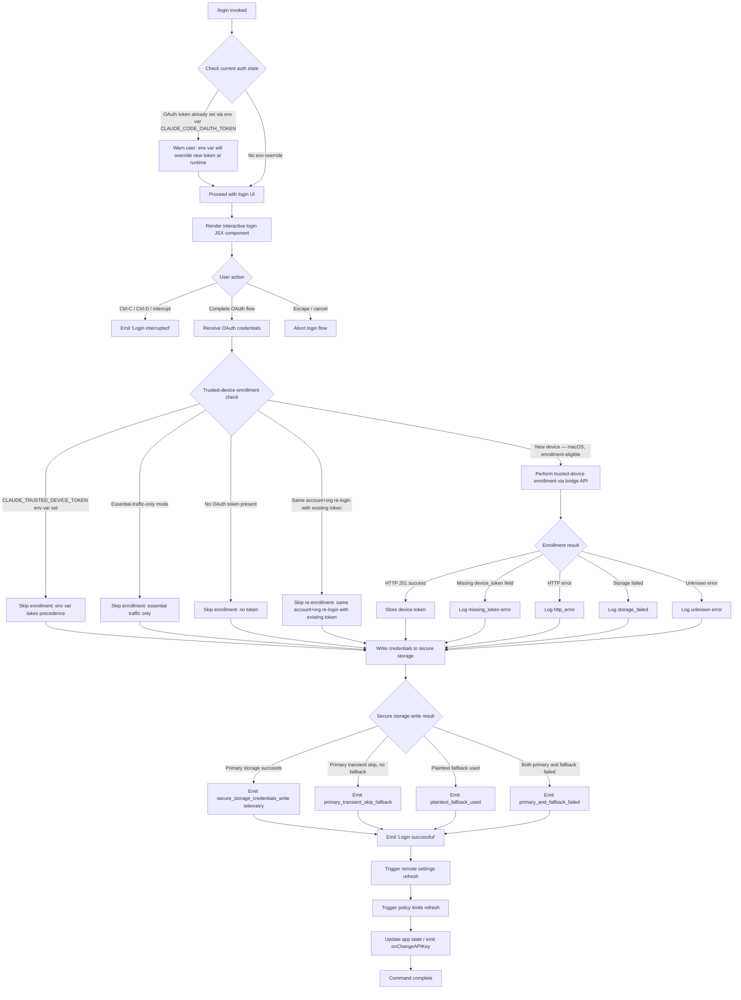

# `/login`

> Analysis basis: CC v2.1.165 bundle.js (AST extraction + Claude interpretation)
> Minimum version: v2.1.165

---

## Overview

The `/login` command initiates an interactive OAuth-based authentication flow that allows users to sign in with their Anthropic account or switch between accounts. It renders a local JSX UI component, manages credential storage via secure storage with plaintext fallback, and triggers downstream refresh of remote settings and policy limits upon successful authentication.

---

## Registration

| Field | Value |
|---|---|
| type | `local-jsx` |
| name | `login` |
| description | `Switch Anthropic accounts \| Sign in with your Anthropic account` |
| loc_byte | `11590159` |
| loc_byte_end | `11590379` |
| loc_line | `8013` |
| module_id | `Uwq` |
| load_inline | `true` |
| arbor_handler.name | `DQq` |
| arbor_handler.fqn | `claude-2.1.165::DQq` |
| arbor_handler.kind | `Function` |
| arbor_handler.resolution_path | `direct` |
| arbor_handler.n_hits | `2` |

Analysis basis: CC v2.1.165 bundle.js:+11590159

---

## Input Branching

The command exhibits more than three distinct execution branches based on authentication state, credential type, trusted-device enrollment path, and post-login state transitions. A flowchart is used.



---

## Behavioral Spec

### Top-level handler: LoginComponent (`Po7`)

The top-level JSX handler (`Po7`) is the component registered for this command. It:

1. Renders a React element tree using `Ot.createElement`.
2. Mounts the inner login form component (`TZ8`).
3. Passes `onDone` callback and `hL` / `y6` helpers for cleanup and event logging.
4. Subscribes to `ncH` events via the state-subscription helper (`qc`) to react to external auth changes.

Analysis basis: CC v2.1.165 bundle.js:+9317944

---

### Login form state machine (`TZ8`)

`TZ8` is the primary stateful form component. Its React memo cache uses sentinel value `"react.memo_cache_sentinel"` with a slot count of 21.

```
function loginFormComponent(props):
    state = useReducer(...)
    appState = getAppState()

    // Check for environment variable override
    if CLAUDE_CODE_OAUTH_TOKEN in environment:
        display warning:
            "Warning: CLAUDE_CODE_OAUTH_TOKEN is set in your environment..."
            // (fragment: "Warning: CLAUDE_CODE_OAUTH_TOKEN is set")

    // Keyboard handlers
    registerHandler(Ctrl-C):
        if confirm state active:
            transition to "cancel"
        else:
            transition to "confirm:no"

    registerHandler(Ctrl-D):
        transition to exit

    registerHandler(Escape):
        transition to "cancel" or "continue"

    // Render login UI with current state
    render LoginLabel("Login"), permission label
    applyMessageOp for streaming state transitions

    // On completion
    if loginSuccessful:
        emit "Login successful"   // bundle.js:+9317977
        call onDone
    else if interrupted:
        emit "Login interrupted"  // bundle.js:+9317996
        call onDone
```

Analysis basis: CC v2.1.165 bundle.js:+9317068, +9317226, +9317977

---

### API bootstrap fetch (`v`)

Performs the initial bootstrap HTTP request to retrieve account/session data.

```
function apiBootstrapFetch(endpoint, options):
    log "[Bootstrap] Fetching"        // bundle.js:+15724583
    set headers:
        "Content-Type": "application/json"
        "User-Agent": <user agent string>
    set timeout: 5000 ms              // bundle.js:+15724784

    response = await fetch(endpoint)

    if parse error:
        emit telemetry "api_bootstrap_fetch", status="parse_failed"
        // bundle.js:+15724927
        return error

    log "[Bootstrap] Fetch ok"        // bundle.js:+15724957
    emit telemetry "api_bootstrap_fetch"
    return parsed response
```

Analysis basis: CC v2.1.165 bundle.js:+15724581

---

### Credential write with secure storage (`VP1` / credential writer)

```
function writeCredentials(credentials):
    attempt primary secure storage:
        if success:
            emit "secure_storage_credentials_write"   // bundle.js:+2280589
            return

    if primary was transient skip and fallback disabled:
        emit "primary_transient_skip_fallback"        // bundle.js:+2280687
        return

    attempt plaintext fallback:
        if success:
            emit "plaintext_fallback_used"            // bundle.js:+2280836
            return

    // Both failed
    emit "primary_and_fallback_failed"                // bundle.js:+2280939
    throw error
```

Analysis basis: CC v2.1.165 bundle.js:+2280464

---

### Trusted-device enrollment (`CsH`)

```
function enrollTrustedDevice(oauthToken, appState):
    if env CLAUDE_TRUSTED_DEVICE_TOKEN is set:
        log "[trusted-device] CLAUDE_TRUSTED_DEVICE_TOKEN env var is set, skipping enrollment..."
        // bundle.js:+6994804
        return

    if essentialTrafficOnly(appState):
        log "[trusted-device] Essential traffic only, skipping enrollment"
        // bundle.js:+6995118
        return

    if no oauthToken:
        log "[trusted-device] No OAuth token, skipping enrollment"
        // bundle.js:+6995231
        return

    if sameAccountOrgReloginWithExistingToken:
        log "[trusted-device] Same account+org re-login with existing token, skipping re-enrollment"
        // bundle.js:+9317228
        return

    if platform == "darwin":                         // bundle.js:+6995427
        response = POST enrollmentEndpoint, timeout=10000ms, retry=500ms
        // bundle.js:+6995520, +6995546
        emit telemetry "bridge_trusted_device_enroll"  // bundle.js:+6995622

        if response.status == 201:                   // bundle.js:+6995708
            storeDeviceToken(response.device_token)
        elif response missing device_token:
            log "[trusted-device] Enrollment response missing device_token field"
            // bundle.js:+6995905
            emit error "missing_token"               // bundle.js:+6996006
        elif http error:
            emit error "http_error"                  // bundle.js:+6995827
        elif storage failed:
            emit error "storage_failed"              // bundle.js:+6996214
        else:
            emit error "unknown"                     // bundle.js:+6996167
```

Analysis basis: CC v2.1.165 bundle.js:+6994541

---

### Remote settings refresh after auth change (`gsH` / `px_`)

After login completes and credentials change, remote managed settings are refreshed:

```
function refreshRemoteSettingsAfterAuth():
    log "Remote settings: Refreshed after auth change"   // bundle.js:+7034214
    fetchRemoteSettings():
        if HTTP 200: apply new settings
            log "Remote settings: Fetched successfully"   // bundle.js:+7031289
        if HTTP 304: use cached
            log "Remote settings: Using cached settings (304)"  // bundle.js:+7030641
        if HTTP 401:
            emit telemetry "tengu_remote_settings_401_force_refresh_retry"
            log "Not authorized for remote settings"      // bundle.js:+7031676
        if HTTP 404: delete cached file
            log "Remote settings: Deleted cached file (404 response)"  // bundle.js:+7033405
        if timeout:
            log "Remote settings request timeout"         // bundle.js:+7031765
        if network error:
            log "Cannot connect to server"                // bundle.js:+7031838
        if fetch failure:
            log "Remote settings: Using stale cache after fetch failure"  // bundle.js:+7032703
            emit telemetry "remote_managed_settings_fetch_failed"
        if unknown error:
            log "Remote settings: Using stale cache after error"  // bundle.js:+7033755
            emit telemetry "remote_managed_settings_unexpected"
```

Analysis basis: CC v2.1.165 bundle.js:+7034203

---

### Policy limits refresh after auth change (`QG6` / `tU9`)

```
function refreshPolicyLimitsAfterAuth():
    log "Policy limits: Refreshed after auth change"    // bundle.js:+6992040
    fetchPolicyLimits():
        emit telemetry "tengu_policy_limits_fetch"      // bundle.js:+6990732
        if success: apply new restrictions
            log "Policy limits: Applied new restrictions successfully"  // bundle.js:+6991303
        if empty: no restrictions
            log "Policy limits: No restrictions (cached empty)"         // bundle.js:+6991358
        if 304: stale cache valid
            log "Policy limits: Cache still valid (304 Not Modified)"   // bundle.js:+6991145
        if failure:
            log "Policy limits: Using stale cache after fetch failure"  // bundle.js:+6990974
            emit status "stale_cache_used"              // bundle.js:+6991042
        if error:
            log "Policy limits: Using stale cache after error"          // bundle.js:+6991435
            emit status "unexpected_error"              // bundle.js:+6991529
        if loading promise timed out:
            log "Policy limits: Loading promise timed out, resolving anyway"  // bundle.js:+6988059
```

Analysis basis: CC v2.1.165 bundle.js:+9317062

---

### Managed settings security dialog (`cB9` / `Dj7`)

When new remote managed settings arrive, a security confirmation dialog is shown:

```
function managedSettingsSecurityCheck(newSettings, cachedSettings):
    if no check needed:
        return "no_check_needed"                        // bundle.js:+7027432

    emit telemetry "tengu_managed_settings_security_dialog_shown"  // bundle.js:+7027557

    wait for user response:
        if "approved":
            emit telemetry "tengu_managed_settings_security_dialog_accepted"  // bundle.js:+7027209
            return "approved"
        if "rejected":
            emit telemetry "tengu_managed_settings_security_dialog_rejected"  // bundle.js:+7027259
            log "Remote settings: User rejected new settings, using cached settings"
            // bundle.js:+7033110
            return "rejected"
        if timeout:
            log "managed-settings security dialog requester wait timed out"
            // bundle.js:+7027023
            return error
```

Analysis basis: CC v2.1.165 bundle.js:+7027491

---

### Auto-mode gate evaluation (`Vv6`)

Post-login the auto-mode configuration is evaluated:

```
function evaluateAutoModeConfig(appState, settings):
    emit telemetry "tengu_auto_mode_config"             // bundle.js:+10677352

    if disableAutoMode in settings:
        return "auto mode disabled by settings"          // bundle.js:+10677059
    if plan does not support auto mode:
        return "auto mode is unavailable for your plan"  // bundle.js:+10677122
    if CLAUDE_CODE_ENABLE_AUTO_MODE != "1":
        return "auto mode requires CLAUDE_CODE_ENABLE_AUTO_MODE=1"  // bundle.js:+10677186
    if model does not support auto mode:
        return "auto mode unavailable for this model"    // bundle.js:+10677258
    if tengu_auto_mode_config.enabled == "disabled" (circuit breaker):
        log "auto mode disabled: tengu_auto_mode_config.enabled === \"disabled\" (circuit breaker)"
        // bundle.js:+10678269
        return disabled

    return enabled config
```

Analysis basis: CC v2.1.165 bundle.js:+10677348

---

### App state update (`TZ8 → setAppState`)

```
function finalizeLogin(credentials):
    setAppState(newState)                               // bundle.js:+9317479
    onChangeAPIKey(credentials)                         // bundle.js:+9316975
    applyMessageOp(update)                             // bundle.js:+9316994, +9317017
```

Analysis basis: CC v2.1.165 bundle.js:+9317383, +9317403

---

## State & Side Effects

| Item | Detail |
|---|---|
| Telemetry: `tengu_feature_ok` | Feature flag resolved OK (bundle.js:+1010222) |
| Telemetry: `tengu_feature_bad` | Feature flag resolved bad (bundle.js:+1010284) |
| Telemetry: `tengu_feature_sad` | Feature flag sad path (bundle.js:+1010365) |
| Telemetry: `tengu_remote_settings_401_force_refresh_retry` | Remote settings forced retry on 401 (bundle.js:+7031590) |
| Telemetry: `tengu_managed_settings_security_dialog_shown` | Security dialog displayed (bundle.js:+7027557) |
| Telemetry: `tengu_managed_settings_security_dialog_accepted` | User accepted managed settings (bundle.js:+7027209) |
| Telemetry: `tengu_managed_settings_security_dialog_rejected` | User rejected managed settings (bundle.js:+7027259) |
| Telemetry: `tengu_policy_limits_fetch` | Policy limits fetch triggered (bundle.js:+6990732) |
| Telemetry: `tengu_disable_bypass_permissions_mode` | Bypass permissions mode disabled (bundle.js:+10679462) |
| Telemetry: `tengu_auto_mode_config` | Auto-mode config evaluated (bundle.js:+10677352) |
| Telemetry: `tengu_daemon_config_reload` | Daemon config reload triggered (bundle.js:+16149069) |
| Credential storage | Writes OAuth credentials via secure storage with plaintext fallback; emits `secure_storage_credentials_write`, `primary_transient_skip_fallback`, `plaintext_fallback_used`, or `primary_and_fallback_failed` |
| appState changes | `setAppState` called post-login (bundle.js:+9317479); `onChangeAPIKey` dispatched (bundle.js:+9316975) |
| Remote settings | Background re-fetch triggered on auth change; polling interval managed via `setInterval`/`clearInterval` (bundle.js:+6987343, +6987411) |
| Policy limits | Background re-fetch triggered on auth change; polling via interval (bundle.js:+6992401) |
| Trusted-device enrollment | POST to bridge API on macOS only; device token stored in secure storage (bundle.js:+6995427) |
| Hook registration | `P_` registers keyboard handler via `L.registerHandler`; `qc` subscribes to `ncH` event bus (bundle.js:+4091142, +3235788) |
| Process listeners | `rcH` registers/removes `process.off("exit")` and `process.removeListener("beforeExit")` for cleanup (bundle.js:+3239581, +3240369, +3239639, +3240392) |
| Sound | None observed in depth-2 traversal |
| env var warning | `CLAUDE_CODE_OAUTH_TOKEN` presence triggers a runtime warning displayed in the UI (bundle.js:+9317602) |

---

## Version History

| Version | Change |
|---|---|
| v2.1.165 | Initial analysis |

---

## Common Mistakes

1. **Leaving `CLAUDE_CODE_OAUTH_TOKEN` set after login** — The warning text at bundle.js:+9317602 makes clear that this environment variable overrides the freshly stored OAuth token at runtime. Users who log in while this variable is set will not actually use their new credentials until the variable is unset.
2. **Expecting instant remote-settings propagation** — Remote managed settings and policy limits are fetched asynchronously after login. A brief window exists where stale settings may be active; the polling mechanism (bundle.js:+6987343) eventually reconciles the state.
3. **Trusted-device enrollment is macOS-only** — The platform guard (`"darwin"`, bundle.js:+6995427) means Windows and Linux users will silently skip enrollment without an error; this is expected behavior, not a bug.
4. **Cancelling with Escape vs. Ctrl-C** — Escape transitions to `"cancel"`/`"continue"` within the form, while Ctrl-C triggers `"confirm:no"` requiring a second press to fully exit. Pressing Ctrl-C once does not immediately abort the login flow (bundle.js:+9318379).
5. **Bypassing OAuth via `CLAUDE_CODE_OAUTH_TOKEN`** — Any value in that environment variable takes full precedence over any interactively acquired token. Enterprise deployments using managed settings should ensure this variable is cleared from user shells before invoking `/login`.

---

## Appendix — Identifier Mapping

> For bundle debugging only. Identifiers change across versions.

| Identifier | Role |
|---|---|
| `DQq` | Arbor-resolved top-level handler function for `/login` (arbor_handler.name) |
| `Po7` | Login JSX wrapper component (handler_name); renders `TZ8` and passes callbacks |
| `TZ8` | Login form state machine; manages keyboard input, state transitions, credential submission |
| `R2H` | Login UI root component; owns React state, renders form fields and status messages |
| `Cwq` | Inner login reducer/effect component; uses `useReducer` and `useEffect` |
| `fj` | Login sub-component; computes memos, applies route/command resolution helpers |
| `M6` | App-state context reader using `useSyncExternalStore` |
| `v` | API bootstrap fetch function |
| `VP1` | Credential writer with secure-storage primary + plaintext fallback |
| `CsH` | Trusted-device enrollment orchestrator |
| `wx_` | Trusted-device enrollment entry point; checks env vars and platform before delegating to `CsH` |
| `gsH` | Remote settings + policy limits refresh coordinator (post-auth-change) |
| `px_` | Remote managed settings fetch/apply pipeline |
| `QG6` | Policy limits fetch/apply pipeline |
| `tU9` | Policy limits inner fetch with retry/backoff logic |
| `cB9` | Managed settings security check and dialog coordinator |
| `Dj7` | Managed settings security dialog state manager |
| `Vv6` | Post-login state evaluation including auto-mode gate |
| `aB9` | Remote settings HTTP fetch with ETag/304 support |
| `Ej7` | Remote settings fetch entry with retry/backoff |
| `jAH` | Exponential backoff calculator (Math.min/pow/random) |
| `l8` | Abortable timeout/sleep utility |
| `acK` | Append-log credential writer (file I/O) |
| `ocK` | Log-file append worker (mkdir, appendFile) |
| `a2A` | Log-file rotation helper (stat, rename, unlink) |
| `s2A` | Log-file path resolver |
| `$pH` | Debounced write-queue flusher (clearTimeout/setTimeout/setImmediate) |
| `d3H` | Write-queue entry formatter |
| `ppH` | Credential file writer (`H.write`) |
| `C2A` | Low-level file write wrapper |
| `icK` | Input validation / API key check entry |
| `DXA` | API key format validator |
| `J4` | API key normalizer (replace, slice, trim) |
| `c2A` | API key prefix mapper |
| `Gw_` | OAuth token parser (split/trim/indexOf/slice) |
| `ZHH` | Token set membership check |
| `uj` | Token string replace helper |
| `e1` | Model/provider resolution entry point |
| `D6H` | Model config resolver |
| `yd` | Provider-specific model lookup |
| `Aq` | Model alias normalizer (trim/toLowerCase/replace) |
| `_4H` | Model inclusion guard |
| `wI` | Model plan tier handler |
| `NQH` | Model tier Z5 mapper |
| `NE` | Model tier first-party handler |
| `SX1` | Model tier wrapper |
| `gM` | Model provider mapper (`anthropicAws`, `gateway`) |
| `eX` | Extended model resolution pipeline |
| `r0` | Full model resolution with provider fallback |
| `o0` | Model alias lookup |
| `Pe6` | Model include-list checker |
| `vQH` | Model variant string builder |
| `s6` | React render helper |
| `P6` | React element factory using `Nu6` |
| `DO` | Auth config builder; reads `ANTHROPIC_API_KEY`, `apiKeyHelper`, `flagSettings` |
| `lV` | Auth config sub-section builder |
| `Bj` | OAuth profile builder (`profile-implicit`, `user_oauth`) |
| `zO6` | File-descriptor key reader (`CLAUDE_CODE_API_KEY_FILE_DESCRIPTOR`) |
| `iR` | Key slicer (first 20 chars) |
| `hL` | Message rendering helper |
| `zY` | Formatted message builder using `DO`/`Bj`/`Z7` |
| `Aw6` | Message join helper |
| `JcH` | Message component renderer |
| `y6` | Event logger with `Date.now` timestamp |
| `rcH` | Process-exit cleanup handler (clears intervals, maps, removes listeners) |
| `WX_` | `beforeExit` cleanup sub-routine |
| `q8H` | Session teardown / cleanup entry |
| `qu` | Auth state getter |
| `Au` | Auth context resolver |
| `fC` | Auth context sub-resolver |
| `kH` | Essential-traffic-only mode checker |
| `HA` | Error string coercer |
| `Dq` | Network traffic classifier |
| `qW4` | Request queue manager (shift/push) |
| `iD8` | Auth-change notifier; calls `hu.notifyChange` |
| `kmA` | Auth-change signal emitter |
| `SfH` | App-state change handler for login |
| `D6` | Daemon state observer |
| `B98` | Daemon state registry manager |
| `wh` | Auth-state watcher |
| `ai1` | Auth subscription helper |
| `PX_` | Permission/bypass-mode state evaluator |
| `EZ8` | Permission state entry |
| `aG6` | App-state getter post-login |
| `J$` | Permission rules manager (allow/deny/ask rules, addDirectories) |
| `pM` | Permission mode validator |
| `R_` | Session init-param reader |
| `pk8` | Working-directory init loader |
| `Uk8` | Allowed/disallowed tools init loader |
| `Zv6` | Post-login full state reconciliation |
| `Vv6` | Auto-mode + settings evaluation post-login |
| `K8H` | Feature flag evaluator |
| `F98` | Feature flag subscriber |
| `EHA` | Enterprise settings evaluator |
| `GHA` | Global settings evaluator |
| `zcH` | Model compatibility checker |
| `t1` | Model string preprocessor |
| `rD6` | Model string renderer |
| `TA6` | Settings loader helper |
| `Ld` | Settings resolver |
| `Y` | Supervisor/daemon config reload handler |
| `C0H` | Supervisor message builder |
| `aLK` | Supervisor column formatter |
| `f` | Supervisor connection manager |
| `E` | Remote-control startup handler |
| `T` | Daemon lifecycle manager |
| `$mK` | Heartbeat manager |
| `V` | Supervisor start helper |
| `Rt` | Permission mode renderer |
| `WR` | Plan tier renderer |
| `m7H` | MCP event emitter wrapper |
| `N4` | MCP permission-mode-changed event emitter |
| `DMH` | App-state-to-MCP mapper |
| `XA` | String-to-color/style mapper |
| `eH` | String coercer |
| `SH` | JSON serializer (JSON.stringify) |
| `jW` | Deep clone via structuredClone |
| `hx` | Credential storage accessors (ZT4/NT4/IT4) |
| `XB` | File permission setter |
| `K` | Column padding formatter |
| `L` | Async task tracker (add/finally/delete) |
| `Ul` | UI lock helper |
| `lB9` | MCP settings integration loader |
| `iK` | MCP settings sub-system init |
| `Tj7` | Atomic file writer (open/writeFile/datasync/close) |
| `O$6` | Temp file path builder |
| `v8` | File-not-found error handler (ENOENT) |
| `tB9` | Background polling loop for settings + policy limits |
| `kD8` | Polling interval manager (setInterval/clearInterval) |
| `Vj7` | Poll-cycle executor |
| `YB9` | Settings hash calculator (SHA-256) |
| `Px_` | Settings value serializer |
| `rB9` | Settings diff applicator |
| `H2` | Settings merge helper |
| `U1` | OAuth URL validator |
| `KvA` | OAuth endpoint registry |
| `o74` | OAuth URL builder |
| `EH` | Error string coercer (String cast) |
| `bwq` | Login trusted-device state bridge |
| `Mi_` | Login interrupt handler |
| `ZDH` | Login display helper |
| `FXH` | Login trusted-device env-var check |
| `Tv6` | Post-login permission state setter |
| `P_` | Global keyboard handler registrar |
| `nj` | Context reader for keyboard handler |
| `dM` | Escape/exit key handler for login |
| `zL9` | Confirm-exit sub-handler |
| `sE_` | Confirm-exit UI component |
| `WC` | Input debounce/timeout helper |
| `M` | Active task map reader |
| `QD` | Theme/style context reader |
| `qc` | External store subscriber |
| `ci1` | Async event dispatcher |
| `XG_` | App-state context accessor |