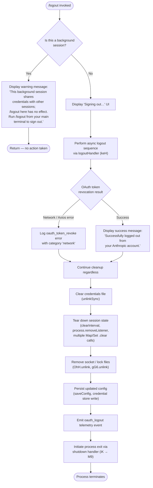

# `/logout`

> Analysis basis: CC v2.1.165 bundle.js (AST extraction + Claude interpretation)
> Minimum version: v2.1.165

---

## Overview

The `/logout` command signs the user out of their Anthropic account by revoking the active OAuth token, removing locally stored credentials, clearing all relevant in-memory session state, and then gracefully terminating the Claude Code process. It is a destructive, irreversible action within the current session: once executed, the user must re-authenticate before using Claude Code again. The command has a special guard for background sessions, where it refuses to act and instead instructs the user to run `/logout` from their main terminal.

---

## Registration

| Field | Value |
|---|---|
| type | `local-jsx` |
| name | `logout` |
| description | Sign out from your Anthropic account |
| loc_byte | `11590440` |
| loc_byte_end | `11590724` |
| loc_line | `8013` |
| module_id | `BB_` |
| load_inline | `true` |
| arbor_handler.name | `CC7` |
| arbor_handler.fqn | `claude-2.1.165::CC7` |
| arbor_handler.kind | `AsyncFunction` |
| arbor_handler.resolution_path | `module_id` |
| arbor_handler.n_hits | `0` |

Analysis basis: CC v2.1.165 bundle.js:+11590440

---

## Input Branching

The command has three distinct execution branches: a background-session guard, the normal logout flow, and an error recovery path. A Mermaid flowchart is used.



---

## Behavioral Spec

### Background-Session Guard

When the handler (`CC7`) is invoked, it first inspects the current session context by calling the session-kind resolver (`Z9` / `GYH`). If the session kind is `"bg"`, `"daemon"`, or `"daemon-worker"` (literals found at bundle.js:+2252507, :+2252517, :+2252531), the command renders a JSX system message informing the user that the background session shares credentials with the main terminal session and that `/logout` has no effect here. No further action is taken.

Analysis basis: CC v2.1.165 bundle.js:+7933678 (CC7 → Z9), :+7933788 (background warning literal)

```
function backgroundGuard(sessionKind):
    if sessionKind in ["bg", "daemon", "daemon-worker"]:
        renderSystemMessage(BG_WARNING_TEXT)
        return  // halt; no logout performed
```

### OAuth Token Revocation

After passing the background guard, the handler invokes the token-revocation helper (`BL_`). This function:

1. Reads the stored refresh token from the credential store.
2. Posts a revocation request to the Anthropic OAuth endpoint (`_A.post`) with `grant_type: "refresh_token"`.
3. On an Axios error (`_A.isAxiosError`), classifies the error as `"network"` and logs telemetry with the `"oauth_token_revoke"` event string (literal at bundle.js:+2108434).
4. On any non-network error, re-raises.
5. On success, continues silently.

Analysis basis: CC v2.1.165 bundle.js:+7932770 (keH → BL_), :+2108266 (BL_ → _A.post), :+2108434 (oauth_token_revoke literal), :+2108471 (BL_ → _A.isAxiosError)

```
async function revokeOAuthToken(credentialStore):
    token = credentialStore.readRefreshToken()
    try:
        await httpClient.post(oauthRevokeEndpoint, {grant_type: "refresh_token", token})
    catch error:
        if isAxiosError(error):
            logTelemetry("oauth_token_revoke", category="network")
            return  // swallow network errors; cleanup continues
        throw error
```

### Credential File Removal

The logout handler (`keH`) calls the credential-deletion helper (`q`) which invokes `puK.unlinkSync` to remove the on-disk credentials file.

Analysis basis: CC v2.1.165 bundle.js:+7932612 (keH → q), :+16110712 (q → puK.unlinkSync)

```
function deleteCredentialsFile(credPath):
    fs.unlinkSync(credPath)
```

### Session State Teardown

The session teardown orchestrator (`HZ6`) executes a sequence of sub-steps:

1. **IPC / emitter cleanup** (`iG6`, `YcH`): detaches internal event listeners.
2. **Cache clear** (`RA8`): calls `mu1.clear()` to flush an in-memory cache map (bundle.js:+2991994).
3. **Session registry clear** (`ZDH`): clears additional session-tracking state.
4. **Process listener removal** (`q8H` → `rcH`): calls `process.off` to remove `"exit"` (literal at bundle.js:+3239639) and `"beforeExit"` (literal at bundle.js:+3240392) listeners; calls `clearInterval`; clears five additional Maps/Sets (`yDH`, `p98`, `tw6`, `DX_`, `eU`) via their `.clear()` methods.
5. **Socket/lock file removal** (`sB9`): calls `OhH.unlink` to remove the Unix domain socket or lock file (bundle.js:+7032288).
6. **Watcher teardown** (`$x_` → `fx_`): calls `clearTimeout` and unlinks the file watcher socket (`gG6.unlink`, bundle.js:+6992123).

Analysis basis: CC v2.1.165 bundle.js:+7933536–7933644 (HZ6 sub-calls)

```
async function teardownSession():
    detachIpcListeners()        // iG6, YcH
    inMemoryCache.clear()       // RA8 → mu1.clear
    sessionRegistry.clear()     // ZDH
    removeProcessListeners()    // q8H → rcH: process.off("exit"), process.off("beforeExit")
    clearInterval(heartbeatTimer)
    for each stateStore in [yDH, p98, tw6, DX_, eU]:
        stateStore.clear()
    unlinkSocketFile()          // sB9 → OhH.unlink
    clearTimeout(watcherTimer)  // $x_ → fx_
    unlinkWatcherSocket()       // $x_ → gG6.unlink
```

### Config & Credential Store Persistence

After clearing in-memory state, the handler persists the now-credential-free config:

- `M4` → `VP1`: reads the current config, removes OAuth fields, and writes back via the storage layer (which implements a lock, retry, and backup mechanism — see literals: lock acquisition warning at bundle.js:+3259888; backup prefix `"backups"` at bundle.js:+3261489; max backup count: 5 at bundle.js:+3260907).
- `hH` and `s6`: write to the credential store; telemetry events `"secure_storage_credentials_write"` (bundle.js:+2280589), `"primary_transient_skip_fallback"` (bundle.js:+2280687), `"plaintext_fallback_used"` (bundle.js:+2280836), and `"primary_and_fallback_failed"` (bundle.js:+2280939) are emitted depending on the storage path taken.

Analysis basis: CC v2.1.165 bundle.js:+7932675 (keH → M4), :+2280039 (VP1 → H.read), :+2280568 (VP1 → _.delete)

```
async function persistClearedConfig(configStore, credentialStore):
    config = await configStore.read()
    config.deleteOAuthFields()
    await configStore.write(config)   // acquires lock, writes with backup
    credentialStore.delete()          // removes keychain / plaintext entry
```

### Keychain Entry Deletion

The keychain helper (`Hj_` → `X8` → `CX_`) removes the macOS Keychain (or equivalent secure storage) entry for the credential identified by a SHA-256 hash of the normalized user path (literal `"sha256"` at bundle.js:+2119764; hash truncated to 8 hex chars at bundle.js:+2119810). The entry name uses the prefix `"claude-code-user"` (literal at bundle.js:+2119944). On failure, a `"Failed to delete keychain entry"` warning is logged (literal at bundle.js:+2120703).

Analysis basis: CC v2.1.165 bundle.js:+7932865 (keH → Hj_), :+3009527 (Hj_ → ru1), :+2120507 (l$1 → zI)

```
async function deleteKeychainEntry(userPath):
    key = sha256(normalize(userPath, "NFC")).slice(0, 8)
    entryName = "claude-code-user" + key
    try:
        await keychain.delete(entryName)
    catch err:
        log.warn("Failed to delete keychain entry", err)
```

### Telemetry Emission & UI Update

After all cleanup steps complete:

1. The handler mutates the app state (`K.mutate`) to reflect the logged-out status (bundle.js:+7932893).
2. It emits the `"oauth_logout"` telemetry event (literal at bundle.js:+7933459) via `hH` (bundle.js:+7933456).
3. If an error occurred during the core logout steps, `kH` logs it with category `"error"` (literal at bundle.js:+1015961) and pushes to the error buffer (`hBH.push`, bundle.js:+1015946).

Analysis basis: CC v2.1.165 bundle.js:+7933459 (oauth_logout), :+7932893 (K.mutate)

```
function finalizeLogout(appState, errorBuffer, caughtError):
    appState.mutate({authenticated: false})
    emitTelemetry("oauth_logout")
    if caughtError:
        errorBuffer.push(caughtError)
        logger.logError("error", caughtError)
```

### Process Shutdown

After the logout JSX result is rendered and a brief delay elapses (`setTimeout` at bundle.js:+7934050, with a 200 ms delay literal at bundle.js:+7934082), the handler calls `iK` which delegates to the main shutdown routine (`M9`). This routine:

1. Writes a final status line to stdout via `JyH` → `AfH.writeSync`.
2. Drains the output stream (`OpH` → `zXA.drain`).
3. Races a 3500 ms timeout (literal at bundle.js:+5447843) against a `Promise.allSettled` of all pending cleanup tasks (`cZ9`).
4. Terminates via `process.exit` or `process.kill("SIGKILL")` if exit hangs (literals at bundle.js:+5445956, :+5446006).

Analysis basis: CC v2.1.165 bundle.js:+7934050 (CC7 → setTimeout), :+7934066 (CC7 → iK), :+5446096 (iK → M9)

```
async function shutdownProcess(delayMs=200):
    await sleep(delayMs)
    writeStatusToStdout("Successfully logged out from your Anthropic account.")
    await drainOutputStream()
    result = await Promise.race([
        Promise.allSettled(pendingCleanupTasks),
        timeout(3500)
    ])
    process.exit(0)
    // fallback if exit hangs:
    // process.kill(process.pid, "SIGKILL")
```

---

## State & Side Effects

| Item | Detail |
|---|---|
| Telemetry — `oauth_logout` | Emitted after all cleanup steps; literal at bundle.js:+7933459 |
| Telemetry — `oauth_token_revoke` | Emitted on network error during token revocation; literal at bundle.js:+2108434 |
| Telemetry — `secure_storage_credentials_write` | Emitted when credential store write path is taken; bundle.js:+2280589 |
| Telemetry — `primary_transient_skip_fallback` | Emitted when primary credential store write is skipped transiently; bundle.js:+2280687 |
| Telemetry — `plaintext_fallback_used` | Emitted when plaintext fallback storage is used; bundle.js:+2280836 |
| Telemetry — `primary_and_fallback_failed` | Emitted when both primary and fallback credential stores fail; bundle.js:+2280939 |
| Telemetry — `tengu_feature_ok` / `tengu_feature_sad` / `tengu_feature_bad` | General feature outcome tracking; bundle.js:+1010222, :+1010365, :+1010284 |
| Telemetry — `tengu_config_lock_contention` | Emitted when config write lock is contested; bundle.js:+3259977 |
| Telemetry — `tengu_config_stale_write` | Emitted when a stale config write is detected; bundle.js:+3260113 |
| Telemetry — `tengu_config_auth_loss_prevented` | Emitted when an auth-loss write is refused; bundle.js:+3260456 |
| Telemetry — `tengu_config_parse_error` | Emitted when config file cannot be parsed; bundle.js:+3262552 |
| Credentials file | Removed via `unlinkSync`; bundle.js:+16110712 |
| Keychain entry | Deleted via secure storage API; bundle.js:+2120507 |
| Socket / lock files | Unlinked (`OhH.unlink`, `gG6.unlink`); bundle.js:+7032288, :+6992123 |
| In-memory caches | `mu1`, `yDH`, `p98`, `tw6`, `DX_`, `eU` all cleared; bundle.js:+2991994, :+3239700–3239748 |
| Process event listeners | `"exit"` and `"beforeExit"` listeners removed; bundle.js:+3239639, :+3240392 |
| appState changes | `authenticated` flag set to `false` via `K.mutate`; bundle.js:+7932893 |
| Process termination | `process.exit` called after 200 ms delay and 3500 ms drain race; bundle.js:+7934050, :+5445956 |
| Sound | None detected in depth-2 traversal |

---

## Version History

| Version | Change |
|---|---|
| v2.1.165 | Initial analysis |

---

## Common Mistakes

1. **Running `/logout` inside a background or daemon session**: The command silently refuses and displays a warning. Users must run `/logout` from the main (foreground) terminal to actually sign out. The literal message is found at bundle.js:+7933788.
2. **Expecting the session to remain usable after logout**: `/logout` unconditionally terminates the process after a short drain period. Any unsaved conversation state is lost.
3. **Assuming network failures prevent credential removal**: The revocation HTTP request failure is swallowed (only telemetry is emitted); local credential deletion and process shutdown proceed regardless.
4. **Mistaking a config-write refusal for a bug**: If a re-read config is missing auth that the cache still holds, the write is deliberately refused to prevent auth data loss (literal: `"saveConfigWithLock: re-read config is missing auth..."` at bundle.js:+3260304). This is a safety guard, not a crash.
5. **Assuming the keychain entry is always deleted cleanly**: On systems where the keychain API fails, the error is logged as a warning and suppressed; the rest of the logout flow continues (bundle.js:+2120703).

---

## Appendix — Identifier Mapping

> For bundle debugging only. Identifiers change across versions.

| Identifier | Role |
|---|---|
| `CC7` | Main async logout handler (arbor_handler; AsyncFunction) |
| `keH` | Core logout execution function (async logout sequence orchestrator) |
| `bC7` | JSX logout UI component renderer |
| `Z9` | Session kind resolver |
| `GYH` | Session kind enum / lookup helper |
| `HZ6` | Session state teardown orchestrator |
| `iG6` | IPC listener detach helper |
| `YcH` | Event emitter cleanup helper |
| `RA8` | In-memory cache clear helper |
| `ZDH` | Session registry clear helper |
| `q8H` | Process listener removal orchestrator |
| `qu` | Process event unbind helper |
| `Au` | Auxiliary listener removal helper |
| `rcH` | Full process-listener teardown (clearInterval + process.off + Map clears) |
| `WX_` | Interval and listener clear sub-helper |
| `kH` | Error logger / error-buffer push helper |
| `HA` | Error classification helper |
| `eH` | String-based condition evaluator |
| `Dq` | Essential-traffic category resolver |
| `qW4` | Error buffer FIFO manager (shift/push) |
| `sB9` | Socket/lock file unlink helper |
| `eB9` | Socket path resolver |
| `ux_` | Socket path formatter |
| `ImA` | Socket path base helper |
| `TKH` | Path join utility wrapper |
| `O$6` | Multi-part path joiner |
| `$x_` | File watcher teardown helper |
| `fx_` | Watcher timer/socket cleanup |
| `Ox_` | Watcher state accessor |
| `q7H` | Watcher active-session checker |
| `YiH` | Watcher socket path builder |
| `XA` | Auth provider / API kind detector |
| `M4` | Config read-modify-write initiator |
| `VP1` | Config storage layer (read/write/delete/update) |
| `H` | Config store object |
| `v` | HTTP fetch / config fetch utility |
| `e$` | Config field extractor |
| `Gw_` | Config line parser |
| `ZHH` | Config cache checker |
| `uj` | Config value normalizer |
| `e1` | Config entry processor |
| `s6` | Credential store write helper |
| `aZH` | Async config writer |
| `x9L` | Config write lock acquirer |
| `hH` | Credential store helper (read/write) |
| `c` | Low-level config primitive |
| `P6` | Config persistence layer |
| `RH` | Plaintext fallback credential writer |
| `L` | Async file read abstraction |
| `f` | File handle abstraction |
| `A` | HTTP client / general utility |
| `BL_` | OAuth token revocation HTTP caller |
| `U1` | OAuth endpoint URL builder |
| `KvA` | OAuth base URL resolver |
| `o74` | Environment/stage detector |
| `Ui` | UI state update helper |
| `Hj_` | Keychain delete orchestrator |
| `ru1` | Keychain entry lookup helper |
| `l$1` | Keychain key derivation helper |
| `zI` | SHA-256 key hash generator |
| `tP` | Keychain platform adapter |
| `FV` | User-info / home-dir resolver |
| `EH` | String coercion utility |
| `X8` | Config-with-lock writer (saveGlobalConfig) |
| `CX_` | Config lock-file manager (acquire/rotate/backup) |
| `Q6` | File existence / stat checker |
| `XP1` | Config object builder |
| `v8` | JSON parse helper |
| `bDH` | Config file reader with backup |
| `fj6` | Config serializer |
| `SH` | JSON stringify wrapper |
| `bX_` | Backup path builder |
| `TM6` | Atomic file writer (temp + rename) |
| `_lH` | Config schema validator |
| `$r1` | Config entry enumerator |
| `t98` | Timestamp helper |
| `RX_` | Config re-read + conditional write helper |
| `ie6` | Keychain error classifier |
| `K` | App state / session map |
| `qEH` | Post-logout state mutator |
| `IkH` | Telemetry event emitter |
| `Vj` | Telemetry event type helper |
| `N4` | OTEL metric emitter |
| `vkH` | OTEL attribute builder |
| `oU` | Session ID generator |
| `S6` | OTEL SDK accessor |
| `k$8` | OTEL instrument builder |
| `B26` | OTEL label formatter |
| `hL` | OTEL histogram helper |
| `Tj9` | OTEL counter helper |
| `e46` | OTEL sequence helper |
| `Rg8` | OTEL flush helper |
| `M` | MCP server manager |
| `AbH` | MCP server connection runner |
| `eU8` | MCP connection result applier |
| `$` | MCP notification handler |
| `IYA` | MCP retry/reconnect orchestrator |
| `Cg8` | MCP server state accessor |
| `iK` | Process shutdown initiator |
| `M9` | Main shutdown routine |
| `JyH` | Final stdout writer |
| `DC` | Terminal cleanup helper |
| `U48` | Terminal restore helper |
| `MS_` | Shutdown status line formatter |
| `qE` | Terminal output stream accessor |
| `Lx` | Terminal width accessor |
| `w06` | Working directory resolver |
| `g$` | Path display formatter |
| `uZ9` | Output escape helper |
| `$S_` | Forced kill handler (SIGKILL fallback) |
| `OpH` | Output stream drain helper |
| `Y` | Ink/React renderer supervisor |
| `C0H` | Ink render state inspector |
| `aLK` | Ink layout calculator |
| `E` | Ink input event handler |
| `$mK` | Heartbeat manager |
| `cZ9` | Pending-task allSettled collector |
| `j76` | Startup profiling writer |
| `Uc8` | Profiling report formatter |
| `DWA` | Profiling report file writer |
| `mO8` | Scroll summary telemetry emitter |
| `xZ9` | Scroll state accessor |
| `bZ9` | Scroll metric calculator |
| `M1` | Session display mode manager |
| `Z46` | Session end event emitter |
| `W6` | Session end helper |
| `Nu6` | Low-level config store primitive |
| `pO8` | Parallel shutdown task runner |
| `l8` | Abort-signal timeout helper |