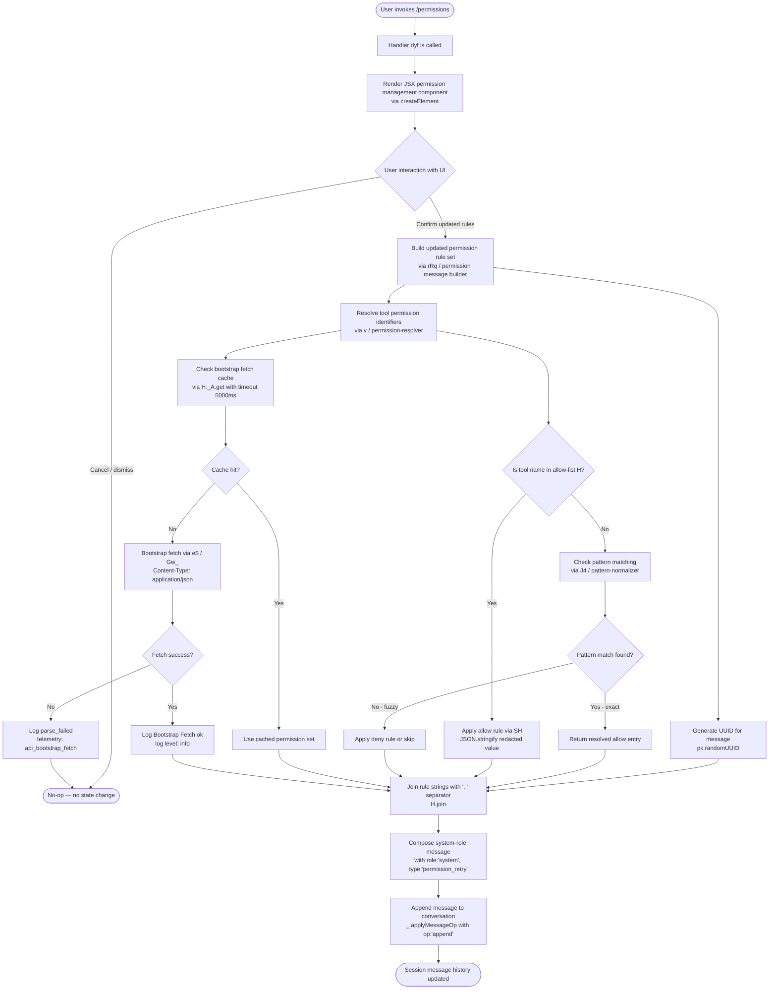

# `/permissions`

> Analysis basis: CC v2.1.165 bundle.js (AST extraction + Claude interpretation)
> Minimum version: v2.1.165

---

## Overview

The `/permissions` command (also accessible as `/allowed-tools`) provides an interactive JSX-based interface for managing the allow and deny rules that govern which tools Claude Code may invoke without prompting for user approval. When invoked, the handler renders a React component into the conversation view and, upon confirmation, appends a synthetic system message that encodes the updated permission state into the active session's message history.

---

## Registration

| Field | Value |
|---|---|
| type | `local-jsx` |
| name | `permissions` |
| description | `Manage allow and deny tool permission rules` |
| aliases | `["allowed-tools"]` |
| module_id | `m6K` |
| load_inline | `true` |
| loc_byte | `12411785` |
| loc_byte_end | `12411957` |
| arbor_handler.name | `dyf` |
| arbor_handler.fqn | `claude-2.1.165::dyf` |
| arbor_handler.kind | `AsyncFunction` |
| arbor_handler.resolution_path | `module_id` |
| arbor_handler.n_hits | `0` |

Analysis basis: CC v2.1.165 bundle.js:+12411785

---

## Input Branching

The command flow has three or more distinct branches (UI render path, permission update/append path, and the underlying permission-rule resolution sub-paths), so a Mermaid flowchart is used.



Analysis basis: CC v2.1.165 bundle.js:+12411603, +12411656, +12411698, +10752174, +10752263

---

## Behavioral Spec

### Top-Level Handler: `dyf` (AsyncFunction)

The primary handler for `/permissions` is the async function `dyf`, resolved via module `m6K` through the `module_id` resolution path.

```
async function permissionsHandler(context):
    // 1. Render the permissions management UI component
    element = createElement(PermissionsComponent, context.props)

    // 2. Await user interaction with the rendered component
    result = await awaitUserPermissionSelection(element)

    if result.cancelled:
        return  // no-op

    // 3. Build the permission update message
    updatedMessage = buildPermissionMessage(result.rules, context)

    // 4. Append the system message to conversation history
    applyMessageOp(context.messages, { op: "append", message: updatedMessage })
```

Analysis basis: CC v2.1.165 bundle.js:+12411603 (`createElement`), +12411656 (`applyMessageOp` with `"append"`), +12411698 (`rRq` call)

---

### Permission Message Builder: `rRq`

The `rRq` function constructs a synthetic system-role message that encodes the current permission state for injection into the conversation history.

```
function buildPermissionMessage(ruleList, context):
    // Join individual rule strings with ", " delimiter
    ruleString = ruleList.join(", ")

    // Generate a unique message identifier
    messageId = crypto.randomUUID()

    // Compose the system message object
    message = {
        role: "system",
        type: "permission_retry",
        content: ruleString,
        id: messageId,
        logLevel: "info"
    }

    return message
```

Analysis basis: CC v2.1.165 bundle.js:+10752174 (`H.join` with `", "`), +10752263 (`pk.randomUUID`), +10752119 (`"system"`), +10752136 (`"permission_retry"`), +10752206 (`"info"`)

---

### Permission Rule Resolver: `v` (permission-resolver)

The permission-resolver function `v` determines, for each tool name, whether an allow or deny rule applies by consulting a canonical list and performing pattern matching.

```
function resolvePermissionRule(toolName, allowList):
    // Step 1: Log debug trace for resolution attempt
    debugLog("debug", toolName)

    // Step 2: Delegate to the detailed rule checker
    ruleDetail = checkRuleDetail(toolName)  // icK

    // Step 3: Check if toolName is in the current allow-list
    if allowList.includes(toolName):
        // Serialize the allow entry, redacting sensitive fields
        serialized = serializeRule(toolName)  // SH → JSON.stringify
        return { action: "allow", entry: serialized }

    // Step 4: Normalize the tool name to uppercase for pattern matching
    normalized = toolName.toUpperCase()

    // Step 5: Attempt pattern-based matching
    patternResult = matchPattern(normalized)  // J4

    // Step 6: Trim and validate the result
    trimmed = patternResult.trim()

    // Step 7: Apply additional path-level permission check
    pathResult = checkPathPermission(trimmed)  // VR

    // Step 8: Apply MCP/plugin-level permission check
    mcpResult = checkMcpPermission(pathResult)  // ppH → C2A

    // Step 9: Apply workspace-scoped permission check
    workspaceResult = checkWorkspacePermission(mcpResult)  // acK

    return workspaceResult
```

Analysis basis: CC v2.1.165 bundle.js:+206051 (`"debug"`), +206075 (`f76`), +206093 (`icK`), +206115 (`H.includes`), +206133 (`SH`), +206177 (`toUpperCase`), +206197 (`J4`), +206200 (`H.trim`), +206216 (`VR`), +206222 (`ppH`), +206236 (`acK`)

---

### Rule Detail Checker: `icK`

The `icK` function performs fine-grained inspection of an individual permission rule entry.

```
function checkRuleDetail(toolName):
    // Extract rule scope index (1-based)
    scopeIndex = getScopeIndex(toolName)   // Vy, with value 1

    // Resolve the rule category
    category = resolveCategory(toolName)   // ncK

    // Apply domain-specific rule transform
    transformed = applyDomainRule(category)  // DXA

    return { scope: scopeIndex, category: category, result: transformed }
```

Analysis basis: CC v2.1.165 bundle.js:+204684 (`Vy`), +204696 (numeric literal `1`), +204798 (`ncK`), +204811 (`DXA`)

---

### Pattern Normalizer: `J4`

The `J4` function normalizes a tool name string into a canonical pattern for matching against the permission rule set.

```
function normalizePattern(toolName):
    // Start from index 0
    startIndex = 0  // literal 0

    // Redact any sensitive credential segments from the name
    redacted = toolName.replace(sensitivePattern, "[REDACTED]")

    // Find the last separator position
    lastSep = redacted.lastIndexOf(separator)

    // Extract meaningful suffix after the last separator
    suffix = redacted.slice(lastSep)

    // Retrieve the character at position 2 for prefix classification
    prefixChar = redacted.at(2)  // literal 2

    return { pattern: suffix, prefix: prefixChar, raw: redacted }
```

Analysis basis: CC v2.1.165 bundle.js:+198062 (`c2A`), +198067 (literal `0`), +198089 (`H.replace`), +198141 (`"[REDACTED]"`), +198170 (literal `2`), +198199 (`q.at`), +198225 (`A.lastIndexOf`), +198251 (`A.slice`)

---

### Workspace-Scoped Permission Checker: `acK`

The `acK` function applies workspace-level (directory-scoped) permission validation, enforcing size and count constraints.

```
async function checkWorkspacePermission(rule):
    // Resolve the base workspace path
    basePath = resolveBasePath()         // $pH
    dirPath = path.dirname(basePath)    // KHH.dirname

    // Check the rule against the known directory list
    knownDir = resolveKnownDir(dirPath)  // d3H
    scopeMatch = matchScope(knownDir)    // Vy
    queryResult = queryRuleStore(scopeMatch)  // Q6

    // Validate file size constraints
    // Maximum single-rule byte length: 1000 bytes
    byteLen = Buffer.byteLength(rule.content)
    if byteLen > 1000:
        throw new Error("Rule content exceeds 1000-byte limit")

    // Maximum number of stored rules: 100
    ruleCount = getRuleCount()
    if ruleCount > 100:
        throw new Error("Rule count exceeds 100-entry limit")

    // Apply supplementary rule helpers
    augmented = applyAugment(rule)     // s2A, a2A
    extended  = applyExtension(rule)   // e2A
    result    = await finalizeRule(extended)  // AU6.then, j9

    return result
```

Analysis basis: CC v2.1.165 bundle.js:+205563 (`$pH`), +205588 (`d3H`), +205596 (`KHH.dirname`), +205626 (`Vy`), +205641 (`Q6`), +205771 (`Buffer.byteLength`), +205882 (limit `1000`), +205901 (limit `100`), +205733 (`s2A`), +205765 (`a2A`), +205804 (`e2A`), +205821 (`AU6.then`), +205926 (`j9`)

---

### Bootstrap Fetch / Allow-List Hydration: `H`

The `H` function is a bootstrap fetch utility that populates the in-memory allow-list used by the resolver. It fetches tool permission metadata from a remote endpoint and caches the result.

```
async function hydrateAllowList(toolRegistry):
    debugLog("[Bootstrap] Fetching", toolRegistry.url)

    // Check in-memory cache first
    cached = _A.get(toolRegistry.cacheKey)
    if cached:
        return cached

    // Perform HTTP fetch with JSON content type and user-agent header
    response = await fetch(toolRegistry.url, {
        headers: {
            "Content-Type": "application/json",
            "User-Agent":   buildUserAgent()
        },
        timeout: 5000   // ms
    })

    if response.ok:
        parsed = await response.json()
        debugLog("[Bootstrap] Fetch ok")
        cacheStore(toolRegistry.cacheKey, parsed)

        // Apply permission token parsing
        tokenized = parsePermissionTokens(parsed)  // Gw_
        allowed   = filterAllowed(tokenized)        // ZHH → c44.has
        unified   = unifyRules(allowed)             // uj → H.replace
        resolved  = resolveEntries(unified)         // e1

        return resolved
    else:
        telemetryEvent("api_bootstrap_fetch", { status: "parse_failed" })
        return null
```

Analysis basis: CC v2.1.165 bundle.js:+15724581 (`"[Bootstrap] Fetching"`), +15724619 (`_A.get`), +15724668 (`"Content-Type"`), +15724683 (`"application/json"`), +15724702 (`"User-Agent"`), +15724784 (timeout `5000`), +15724715 (`e$`), +15724723 (`Gw_`), +15724754 (`ZHH`), +15724766 (`uj`), +15724769 (`e1`), +15724905 (`"api_bootstrap_fetch"`), +15724927 (`"parse_failed"`), +15724957 (`"[Bootstrap] Fetch ok"`)

---

### Permission Token Parser: `Gw_`

Parses a raw permission string (typically from a fetched payload) into individual permission tokens.

```
function parsePermissionTokens(rawPermissionString):
    // Split on delimiter
    parts = rawPermissionString.split(delimiter)

    tokens = []
    for part in parts:
        trimmed = part.trim()
        sepIndex = trimmed.indexOf(separator)

        if sepIndex >= 0:
            key   = trimmed.slice(0, sepIndex)
            value = trimmed.slice(sepIndex + 1)
            tokens.push({ key, value })

    return tokens
```

Analysis basis: CC v2.1.165 bundle.js:+2974480 (`_.split`), +2974519 (`q.trim`), +2974543 (`q.indexOf`), +2974583 (`q.slice`)

---

### Rule Entry Resolver: `e1` / `Aq`

Resolves human-readable or alias-based tool names to canonical internal tool identifiers.

```
function resolveRuleEntries(tokenList):
    results = []
    for token in tokenList:
        // Normalize: trim whitespace and lowercase
        normalized = token.key.trim().toLowerCase()

        // Route based on well-known model/tool aliases
        switch normalized:
            case "opusplan":  → map to internal opus-plan tool id
            case "sonnet":    → map to sonnet model tool class
            case "haiku":     → map to haiku model tool class
            case "opus":      → map to opus model tool class
            case "best":      → map to best-available tool class
            case "[1m]":      → map to one-million-context tool class
            default:
                // Apply regex-based substitution for unknown aliases
                canonical = applyRegexSubstitution(normalized)  // Aq → _.replace

        results.push(canonical)

    return results
```

Analysis basis: CC v2.1.165 bundle.js:+2239233 (`D6H`), +2239270 (`Aq`), +2243153 (`H.trim`), +2243164 (`_.toLowerCase`), +2243249 (`"opusplan"`), +2243267 (`wI`), +2243275 (`"[1m]"`), +2243290 (`"sonnet"`), +2243329 (`"haiku"`), +2243368 (`"opus"`), +2243405 (`"best"`), +2243495 (`_.replace`)

---

### Telemetry / Feature-Sad Event: `s6`

The `s6` function wraps a telemetry emission for feature-level failure states (named `tengu_feature_sad`). It is reached via the call graph from the permissions handler's dependency chain.

```
function reportFeatureFailure(featureName, context):
    // Emit structured telemetry for a degraded or failing feature
    emitTelemetry("tengu_feature_sad", {
        feature: featureName,
        context: context
    })  // c → tengu_feature_sad at loc_byte 1010365
```

Analysis basis: CC v2.1.165 bundle.js:+1010363 (`c`), +1010365 (telemetry event `tengu_feature_sad`)

---

## State & Side Effects

| Item | Detail |
|---|---|
| Telemetry | `tengu_feature_sad` (bundle.js:+1010365) — emitted on feature-level failure path; `api_bootstrap_fetch` with sub-event `parse_failed` (bundle.js:+15724905) — emitted when bootstrap fetch response cannot be parsed |
| Message history mutation | On confirmation, appends a `role:"system"` / `type:"permission_retry"` message entry via `applyMessageOp` with `op:"append"` (bundle.js:+12411656, +12411679) |
| UUID generation | Each permission update message is assigned a unique ID via `crypto.randomUUID()` (bundle.js:+10752263) |
| Bootstrap fetch cache | Permission metadata is fetched from a remote endpoint and stored in an in-memory cache keyed by `_A` (bundle.js:+15724619); fetch timeout is **5000 ms** (bundle.js:+15724784) |
| Byte-length enforcement | Individual rule content must not exceed **1000 bytes** as measured by `Buffer.byteLength` (bundle.js:+205882) |
| Rule count enforcement | The rule store must not hold more than **100 entries** (bundle.js:+205901) |
| Sensitive data redaction | Pattern normalization replaces sensitive credential segments with the literal string `[REDACTED]` before rule matching (bundle.js:+198141) |
| Sound | <!-- TODO: not found in depth-2 traversal; needs --depth 4 --> |
| Hook registration | <!-- TODO: not found in depth-2 traversal; needs --depth 4 --> |

---

## Version History

| Version | Change |
|---|---|
| v2.1.165 | Initial analysis |

---

## Common Mistakes

1. **Invoking via alias only**: The command is registered under both `permissions` and `allowed-tools`. Both resolve to the same handler (`dyf`); there is no behavioral difference between them.
2. **Expecting immediate filesystem persistence**: The `/permissions` command appends a synthetic `system` message to the in-session message history. It does not directly write a config file; persistence depends on the session save mechanism downstream of `applyMessageOp`.
3. **Assuming unlimited rule entries**: The workspace-scoped checker enforces a hard cap of **100 rules** and **1000 bytes per rule**. Exceeding either limit will cause the permission update to be rejected without a visible error in all UI states.
4. **Mistaking the bootstrap fetch as user-controllable**: The `[Bootstrap] Fetching` / `[Bootstrap] Fetch ok` log messages come from an internal hydration step for permission metadata. This fetch uses a 5000 ms timeout and is not configurable from the `/permissions` UI.
5. **Not accounting for rule redaction**: The pattern normalizer replaces sensitive credential-like segments in tool names with the literal `[REDACTED]` before storing or matching. If a tool name legitimately contains such a segment, the stored rule will differ from what was entered.
6. **Ignoring the `permission_retry` message type**: The synthetic system message written to conversation history has `type:"permission_retry"`. Downstream consumers that filter system messages by type must explicitly handle this type to correctly reflect the updated permission state.

---

## Appendix — Identifier Mapping

> For bundle debugging only. Identifiers change across versions.

| Identifier | Role |
|---|---|
| `dyf` | Top-level async handler for `/permissions` command (AsyncFunction, resolved via module `m6K`) |
| `rRq` | Permission message builder — constructs the `system`/`permission_retry` message object |
| `H` | Allow-list hydration / bootstrap fetch utility |
| `v` | Permission rule resolver — dispatches allow/deny decisions per tool name |
| `icK` | Rule detail checker — inspects scope, category, and domain transforms for a single rule |
| `SH` | Rule serializer — wraps `JSON.stringify` for allow-list entries |
| `J4` | Pattern normalizer — canonicalizes tool names for rule matching, applies `[REDACTED]` substitution |
| `ppH` | MCP/plugin-level permission checker (delegates to `C2A`) |
| `acK` | Workspace-scoped permission checker — enforces 1000-byte and 100-entry limits |
| `e$` | HTTP fetch executor used during bootstrap hydration |
| `Gw_` | Permission token parser — splits raw permission strings into key/value token pairs |
| `q` | Low-level string/file utility (hosts `trim`, `indexOf`, `slice`, `unlinkSync`) |
| `ZHH` | Allow-list membership checker (delegates to `c44.has`) |
| `uj` | Rule string normalizer — applies `H.replace` to unify rule representations |
| `e1` | Rule entry resolver — routes tokens through alias mapping and regex substitution |
| `D6H` | Intermediate rule dispatch helper (delegates to `x0`, `IqH`, `SA`, `yd`) |
| `Aq` | Alias-to-canonical resolver — handles `opusplan`, `sonnet`, `haiku`, `opus`, `best`, `[1m]` |
| `eX` | Secondary resolver wrapper (delegates to `Aq` and `r0`) |
| `s6` | Feature-failure telemetry emitter — wraps `tengu_feature_sad` event emission |
| `c` | Core telemetry dispatcher (emits `tengu_feature_sad` at bundle.js:+1010365) |
| `P6` | Helper invoked from `s6` (delegates to `Nu6`) |

---

Note: index built via Arbor fallback; some signals (telemetry, literals) may be missing — see arbor-fallback.js.