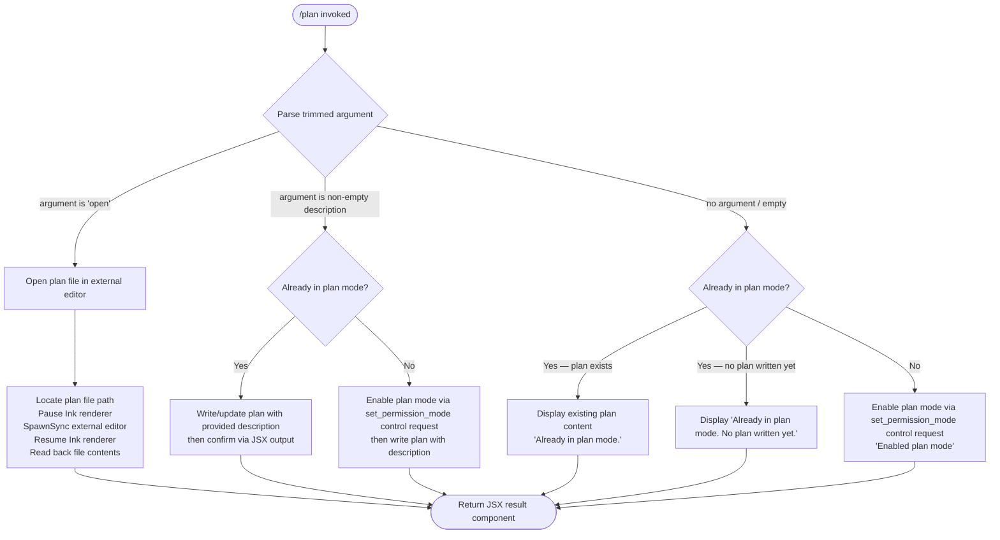

# `/plan`

> Analysis basis: CC v2.1.165 bundle.js (AST extraction + Claude interpretation)
> Minimum version: v2.1.165

---

## Overview

The `/plan` command enables plan mode for the current Claude Code session or displays the existing session plan. When invoked without arguments, it activates a read-only, no-tool-execution mode that prompts the model to produce a structured plan rather than taking direct actions; the sub-command `open` additionally opens an existing plan file in an external editor. A description argument causes the command to write or update the session plan content.

---

## Registration

| Field | Value |
|---|---|
| type | `local-jsx` |
| name | `plan` |
| description | Enable plan mode or view the current session plan |
| argumentHint | `[open\|<description>]` |
| module_id | `g6K` |
| load_inline | `true` |
| loc_byte | `12413911` |
| loc_byte_end | `12414110` |
| loc_line | `8829` |
| arbor_handler.name | `nyf` |
| arbor_handler.fqn | `claude-2.1.165::nyf` |
| arbor_handler.kind | `AsyncFunction` |
| arbor_handler.resolution_path | `module_id` |
| arbor_handler.n_hits | `0` |

Analysis basis: CC v2.1.165 bundle.js:+12413911

---

## Input Branching

The handler exhibits four or more distinct execution paths based on argument value and current session state, requiring a flowchart.



Analysis basis: CC v2.1.165 bundle.js:+12412712 – +12413678

---

## Behavioral Spec

### Top-level Handler (`nyf`)

The Arbor-resolved handler for `/plan` is the async function `nyf` (module `g6K`, resolved via `module_id` path).

```
async function planCommandHandler(context):
    fileSyncHelper    = getFileSyncHelper()         // q
    sessionStateStore = getSessionStateStore()       // s4
    permissionState   = getPermissionState()         // iX
    eventEmitter      = getEventEmitter()            // ee
    connectionMap     = getConnectionMap()            // K

    controlRequestSender = getControlRequestSender() // J$
    planModeRenderer     = getPlanModeRenderer()     // _RH
    rawArg               = getRawArgument()          // H
    trimmedArg           = rawArg.trim()             // A.trim

    // Branch: 'open' sub-command
    if trimmedArg == "open":
        result = openPlanInEditor(context)           // Gg
        return renderJSX(result)

    // Branch: non-empty description provided
    if trimmedArg != "":
        result = writePlanDescription(trimmedArg, context)  // iZ / nZ
        return renderJSX(result)

    // Branch: no argument — check current mode
    currentMode = getCurrentMode(sessionStateStore)
    if currentMode == "plan":
        existingPlan = readCurrentPlan(context)      // O96
        if existingPlan exists:
            return renderJSX("Already in plan mode.")
        else:
            return renderJSX("Already in plan mode. No plan written yet.")
    else:
        sendControlRequest("set_permission_mode", "plan")   // M.sendControlRequest
        return renderJSX("Enabled plan mode")
```

Analysis basis: CC v2.1.165 bundle.js:+12412712, +12412825, +12412912, +12413039, +12413049, +12413281, +12413363, +12413410

---

### Control Request: Set Permission Mode (`J$` → `controlRequestSender`)

When plan mode is not yet active, the handler dispatches a `set_permission_mode` control request to the session manager.

```
function sendSetModeControlRequest(sender, mode):
    payload = {type: "set_permission_mode", mode: mode}

    // Guard: bypassPermissions mode cannot be set if disableBypassPermissionsMode
    // flag is active or session was not launched in bypassPermissions mode.
    // Log warning and abort if so.
    if mode == "bypassPermissions" and bypassPermissionsNotAvailable:
        log("Ignoring permission update: setMode 'bypassPermissions' rejected — mode is not available ...")
        return

    sender.sendRequest(payload)
    updateRulesets(sender, payload)   // addRules / replaceRules / removeRules / addDirectories / removeDirectories
```

Analysis basis: CC v2.1.165 bundle.js:+12412912, +4751775, +4751839, +4751841, +4752117, +4752302, +4752465, +4753122, +4753506

---

### Plan File Read (`O96` → `planFileReader`)

Reads the current session's plan from disk and formats it for display.

```
function readCurrentPlan(context):
    store    = getSessionStore()     // I3H
    filePath = buildPlanFilePath()   // S6
    if filePath does not exist:
        return null
    content = readFileUtf8(filePath) // encoding "utf-8"
    return content
```

Analysis basis: CC v2.1.165 bundle.js:+12413363, +13231182, +13231195

---

### Plan File Write / Update (`iZ` → `planFileWriter`)

Writes or updates the plan file on disk when a description argument is provided.

```
async function writePlanFile(description, context):
    planPath = buildPlanFilePath()          // nZ → S6, Bg.join, IY
    ensureParentDirExists(planPath)         // Q6
    writeUtf8(planPath, description)        // R8 → v8

    // If plan mode not yet active, also enable it
    if not currentlyInPlanMode():
        sendSetModeControlRequest("plan")

    // Handle ENOENT / file-not-found gracefully
    // Handle EISDIR error condition
    return buildSuccessResult()
```

Analysis basis: CC v2.1.165 bundle.js:+12413410, +12413417, +13231394, +13231288, +13231307, +13231463, +175606, +175646

---

### Open Plan in External Editor (`Gg` → `externalEditorOpener`)

Suspends the Ink TUI, spawns an external editor process synchronously, then resumes the TUI and reads back the (possibly modified) plan file.

```
function openPlanInEditor(context):
    planPath = locatePlanFile()                     // DAA → Oh8.basename, Q1
    if planPath not found:
        throw Error("Ink instance not found - cannot pause rendering")

    // Determine editor binary
    editorBin = resolveEditorBinary()               // sW → SN.basename, Q1, H.toLowerCase

    // Suspend TUI
    inkInstance.enterAlternateScreen()              // A.enterAlternateScreen
    inkInstance.pause()                             // A.pause
    inkInstance.suspendStdin()                      // A.suspendStdin

    // Spawn editor synchronously
    args = buildEditorArgs(planPath)                // L.split, f.slice
    result = childProcess.spawnSync(editorBin, args, {stdio: "inherit"})  // Egq.spawnSync

    // Read back
    content = fs.readFileSync(planPath)             // _.readFileSync

    // Resume TUI
    inkInstance.exitAlternateScreen()               // A.exitAlternateScreen
    inkInstance.resumeStdin()                       // A.resumeStdin
    inkInstance.resume()                            // A.resume

    return content
```

Analysis basis: CC v2.1.165 bundle.js:+12413560, +11528489, +11528582, +11528642, +11528672, +11528682, +11528721, +11528746, +11528764, +11528796, +11529066, +11529144, +11529173, +11529189

---

### Permission / Mode Renderer (`_RH` → `planModeRenderer`)

Composes the JSX output shown after mode changes and plan display operations.

```
function renderPlanModeOutput(state):
    modeConfig = getModeConfiguration()         // NHA → Ld, WT
    // WT checks model compatibility:
    //   incompatible with claude-3-* family
    //   compatible with claude-opus-4-0/4-1/4-5, claude-sonnet-4-0/4-5,
    //   claude-haiku-4-5, claude-opus-4-6

    permissionEntries = buildPermissionEntries(state)   // _p → Object.entries, y3, XHA, fRq
    infoLines         = buildInfoLines(state)           // DMH → Object.entries, J$, K.map

    return renderJSX(modeConfig, permissionEntries, infoLines)
```

Analysis basis: CC v2.1.165 bundle.js:+12412828, +10680768, +10680859, +10680870, +10680964, +10680992, +2987631–2987894

---

### Output Rendering (JSX / Ink, `g6q` → `outputRenderer`)

The final result is rendered as a JSX component via Ink, with ANSI stripping applied where needed.

```
function renderOutput(content):
    // Register data event handler on stream
    stream.on("data", handler)                  // yeH → K.on
    // Build Ink element tree
    element = createElement(outputComponent)    // yeH → eAH.createElement
    // Strip ANSI codes from terminal output
    clean = Bun.stripANSI(content)              // b4 → Bun.stripANSI
    return element
```

Analysis basis: CC v2.1.165 bundle.js:+12413674, +12413678, +7941209, +7941062, +7941225, +3840366

---

## State & Side Effects

| Item | Detail |
|---|---|
| Telemetry | `tengu_feature_sad` (bundle.js:+1010365); `tengu_native_cursor` (bundle.js:+3812775) |
| Control request | Sends `set_permission_mode` with value `"plan"` to session manager when activating plan mode (bundle.js:+12412942) |
| File system — read | Reads plan file (UTF-8) from session-scoped path via `fs.readFileSync` / async read utilities (bundle.js:+13230993, +13231441) |
| File system — write | Writes or appends plan description to session plan file; creates parent directory if missing; renames `.txt` suffixed temp file; unlinks stale files (bundle.js:+205073, +205113, +205317, +205376) |
| TUI suspension | Suspends Ink renderer (`enterAlternateScreen`, `pause`, `suspendStdin`) and resumes after editor exits; only on `open` sub-command (bundle.js:+11528642–11529189) |
| External process | `spawnSync` with `stdio: "inherit"` to launch editor; command resolved from environment / IDE detection (bundle.js:+11528764, +11528796) |
| Hook registration | `zXA.register` called via `j9` during transcript/log file rotation lifecycle (bundle.js:+60323) |
| Permission rules | May add/replace/remove allow-rules, deny-rules, always-ask-rules, and directory entries on the session permission store via `J$` control request dispatch (bundle.js:+4752117–4753506) |
| Log / error reporting | Errors passed to `Er.logError`; error level `"error"` emitted to error bus (bundle.js:+1015961, +1015986) |

---

## Version History

| Version | Change |
|---|---|
| v2.1.165 | Initial analysis |

---

## Common Mistakes

1. **Invoking `/plan open` when no plan file exists** — the handler attempts to locate the plan file via `Oh8.basename`/`DAA`; if no file is found, the editor is not launched and an error is surfaced. Write a plan description first with `/plan <description>`.
2. **Calling `/plan` repeatedly expecting repeated activation** — if plan mode is already active and no description is supplied, the command returns either `"Already in plan mode."` or `"Already in plan mode. No plan written yet."` without making further changes (bundle.js:+12413079, +12413459).
3. **Using `/plan` with `bypassPermissions` mode** — attempting to combine plan mode activation with `bypassPermissions` is silently rejected when `disableBypassPermissionsMode` is set or the session was not launched in that mode (bundle.js:+4751841).
4. **Expecting plan mode on `claude-3-*` models** — the permission-mode renderer contains explicit model-family compatibility checks; `claude-3-*` models are flagged as incompatible (bundle.js:+2987631).
5. **Forgetting that `/plan <description>` and `/plan open` are mutually exclusive paths** — supplying the literal word `open` as a description will trigger the editor flow, not write the word "open" as a plan.

---

## Appendix — Identifier Mapping

> For bundle debugging only. Identifiers change across versions.

| Identifier | Role |
|---|---|
| `nyf` | Main `/plan` command async handler (Arbor-resolved, module `g6K`) |
| `q` | File-sync helper / unlink wrapper |
| `s4` | Session state store accessor |
| `MEH` | State store internal method |
| `iX` | Permission state accessor |
| `ee` | Event emitter reference |
| `K` | Connection / channel map |
| `L` | Channel entry / set helper |
| `f` | Channel object / file handle |
| `A` | General accumulator / string argument |
| `J$` | Control request sender / permission rule dispatcher |
| `v` | Permission rule builder / bootstrap fetch utility |
| `icK` | Internal fetch configuration builder |
| `DXA` | Fetch header builder |
| `H` | Raw argument string / HTTP utility |
| `e$` | HTTP helper |
| `Gw_` | Header-parsing utility |
| `ZHH` | Permission set membership checker |
| `uj` | String replacement utility |
| `e1` | Rule-entry constructor |
| `s6` | Feature-sad telemetry emitter wrapper |
| `SH` | JSON serialisation helper |
| `J4` | Path/string formatter |
| `c2A` | Path-component mapper |
| `ppH` | Write-stream helper |
| `C2A` | Stream writer |
| `acK` | Transcript / log file writer (append + rotate) |
| `$pH` | Buffered async output scheduler |
| `d3H` | Log line formatter |
| `Q6` | Directory creation utility |
| `aL6` | File size / byte-length helper |
| `s2A` | Log file path builder |
| `a2A` | Log file rotation handler (stat / rename / unlink) |
| `ocK` | Log file append worker |
| `j9` | Hook registration wrapper (`zXA.register`) |
| `pM` | Escape-sequence sanitiser (`zT4`) |
| `zT4` | String `replaceAll` escape normaliser |
| `_RH` | Plan mode output / permission renderer |
| `NHA` | Mode configuration loader |
| `Ld` | Mode label/description lookup |
| `WT` | Model-compatibility checker |
| `GHA` | Mode display helper |
| `zcH` | Model-name prefix classifier |
| `o6_` | Settings layer resolver |
| `x8` | Settings layer fetcher (policy / flag / user / local) |
| `WR` | Permission entry comparator |
| `DMH` | Info-line builder (Object.entries iteration) |
| `_p` | Permission entry list builder |
| `y3` | Permission entry formatter |
| `DT4` | Permission display type resolver |
| `PE` | Object.hasOwn guard |
| `wT4` | Permission label builder |
| `YT4` | Permission text `replaceAll` normaliser |
| `XHA` | Tool-allowlist entry builder |
| `YbH` | Cached tool-list resolver |
| `JHA` | Relative-path tool entry builder |
| `fRq` | Session-tool rule accumulator |
| `xMf` | Tool inclusion filter |
| `M` | Session context / message store |
| `EH` | String coercion wrapper |
| `O96` | Plan file reader (current plan getter) |
| `I3H` | Session store reference |
| `S6` | File-write utility (fs wrapper) |
| `uv` | Low-level write primitive |
| `iZ` | Plan file write orchestrator |
| `nZ` | Plan path builder + content writer |
| `c2H` | Plan file content formatter / store updater |
| `GX_` | Path separator replacement utility |
| `ocH` | Path join helper variant A |
| `Q98` | Path join helper variant B |
| `R8` | Async file write dispatcher |
| `v8` | Low-level async write (EISDIR / ENOENT aware) |
| `kH` | Error logging + telemetry reporter |
| `HA` | Error constructor wrapper |
| `eH` | String-from-error extractor |
| `Dq` | Error serialiser |
| `xSA` | Error-string formatter |
| `qW4` | Circular error-log buffer manager |
| `Gg` | External editor launcher (open sub-command handler) |
| `Lp` | Editor binary resolver |
| `FY` | Editor path validator |
| `gPf` | Plan file locator wrapper |
| `DAA` | Plan file basename / directory finder |
| `Q1` | String index-of / slice utility |
| `sW` | Editor binary name normaliser (basename + toLowerCase) |
| `g6q` | JSX output renderer (Ink stream wrapper) |
| `yeH` | Stream data-event handler builder |
| `XB` | Ink element factory |
| `zG_` | React `createElement` wrapper |
| `Ka` | Ink component constructor |
| `b4` | ANSI-strip wrapper (`Bun.stripANSI`) |